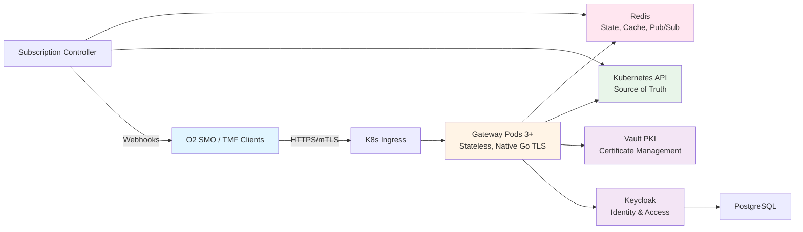
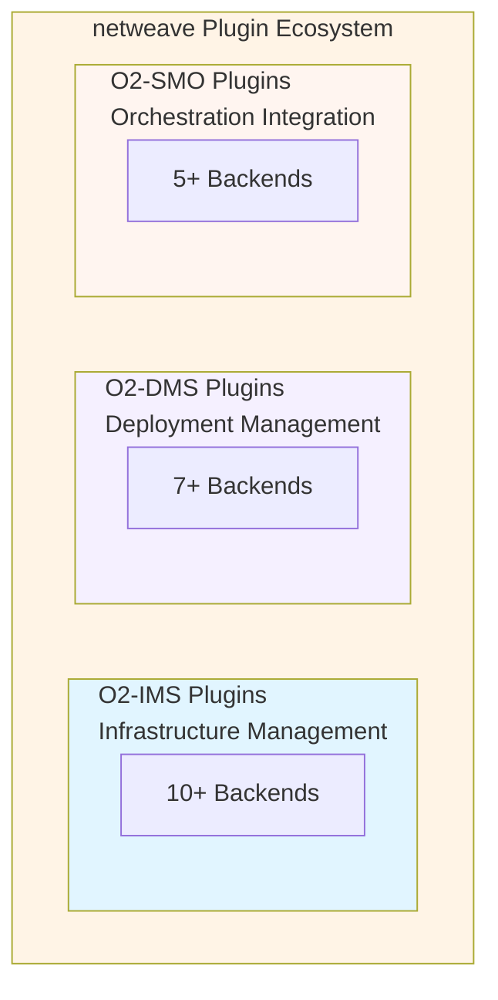

# netweave Architecture - Executive Summary

**Date:** 2026-02-06
**Version:** 1.1
**Status:** Complete

## Production System - Active Development

The **netweave O2-IMS Gateway** is a production system under active development with O2-IMS, O2-DMS, O2-SMO APIs, multi-tenancy, and enterprise RBAC.

## What Has Been Delivered

### 1. Complete Architecture Documentation (100+ pages)

#### [docs/architecture.md](docs/architecture.md) - Part 1
- ✅ Executive summary and system overview
- ✅ Architecture goals (functional and non-functional)
- ✅ Component architecture (Gateway, Redis, Controller, Adapter)
- ✅ Data flow diagrams (request, write, subscription flows)
- ✅ Storage architecture (Redis data model, schema)
- ✅ Security architecture (mTLS, auth/authz, zero-trust)

#### [docs/architecture-part2.md](docs/architecture-part2.md) - Part 2
- ✅ High availability & disaster recovery (99.9% uptime)
- ✅ Scalability (horizontal and vertical)
- ✅ Multi-cluster architecture
- ✅ Deployment architecture (dev/staging/production)
- ✅ GitOps workflow with ArgoCD
- ✅ Deployment strategies (rolling, blue-green, canary)

#### [docs/api-mapping.md](docs/api-mapping.md)
- ✅ Complete O2-IMS ↔ Kubernetes resource mappings
- ✅ Deployment Manager mapping
- ✅ Resource Pool → MachineSet mapping (full CRUD)
- ✅ Resource → Node/Machine mapping (full CRUD)
- ✅ Resource Type aggregation logic
- ✅ Subscription implementation
- ✅ Detailed transformation examples with code
- ✅ Multi-backend adapter routing (Kubernetes, DTIAS, AWS)
- ✅ API versioning and evolution strategy (v1/v2/v3)
- ✅ Backend-specific transformations

#### [docs/o2dms-o2smo-extension.md](docs/o2dms-o2smo-extension.md)
- ✅ O2-DMS (Deployment Management Services) architecture
- ✅ DMS adapter interface specification
- ✅ Helm adapter implementation (CNF deployment)
- ✅ ArgoCD adapter implementation (GitOps deployment)
- ✅ Unified subscription system (IMS + DMS events)
- ✅ O2-SMO integration patterns
- ✅ End-to-end use cases (deploy vDU, scale, rollback)
- ✅ Implementation roadmap (5 phases, 12 weeks)

#### [docs/rbac-multitenancy.md](docs/rbac-multitenancy.md)
- ✅ Enterprise multi-tenancy architecture (built-in from day 1)
- ✅ RBAC model (system roles + tenant roles)
- ✅ Permission-based access control (resource, action, scope)
- ✅ Tenant isolation enforcement (multi-layer defense)
- ✅ Certificate-based tenant identification (mTLS CN)
- ✅ Resource quotas per tenant
- ✅ Comprehensive audit logging
- ✅ Admin API for tenant/user/role management

### 2. Project Foundation & Governance

#### Code Quality Framework
- ✅ [CLAUDE.md](CLAUDE.md) - Zero-tolerance development standards
- ✅ [.golangci.yml](.golangci.yml) - 50+ linters configured
- ✅ [.pre-commit-config.yaml](.pre-commit-config.yaml) - Automated pre-commit hooks
- ✅ [Makefile](Makefile) - 50+ build automation targets

#### Git Workflow
- ✅ [.github/PULL_REQUEST_TEMPLATE.md](.github/PULL_REQUEST_TEMPLATE.md) - Comprehensive PR template
- ✅ [.github/workflows/ci.yml](.github/workflows/ci.yml) - Full CI pipeline
- ✅ [.github/BRANCH_PROTECTION.md](.github/BRANCH_PROTECTION.md) - Branch protection guide
- ✅ [CONTRIBUTING.md](CONTRIBUTING.md) - Contribution guidelines

#### Documentation
- ✅ [README.md](README.md) - Project overview and quick start
- ✅ [PROJECT_SETUP.md](PROJECT_SETUP.md) - Setup summary

## Architecture Highlights

### System Overview



### Dual API Frontend

The gateway supports both **O-RAN APIs** and **TMForum Open APIs** as alternative frontends to the same backend infrastructure:

```mermaid
graph TB
    subgraph Frontend [Frontend Layer]
        subgraph ORAN [O-RAN APIs]
            IMS[/o2ims/v1]
            DMS[/o2dms/v1]
            SMO_API[/o2smo/v1]
        end
        subgraph TMF [TMForum APIs]
            TMF638[TMF638 Service Inventory]
            TMF639[TMF639 Resource Inventory]
            TMF641[TMF641 Service Ordering]
        end
    end

    Frontend --> Translation[Translation & Routing Layer]
    Translation --> Adapters[Backend Adapters<br/>IMS: K8s, OpenStack, AWS, Azure, GCP, VMware<br/>DMS: Helm, ArgoCD, Flux, ONAP, Crossplane]

    style Frontend fill:#e1f5ff
    style Translation fill:#fff4e6
    style Adapters fill:#e8f5e9
```

**TMForum API Support:**
- ✅ **TMF638** - Service Inventory Management v4 (↔ O2-DMS Deployments)
- ✅ **TMF639** - Resource Inventory Management v4 (↔ O2-IMS Resources/Pools)
- ✅ **TMF641** - Service Ordering Management v4 (↔ O2-DMS Lifecycle)
- ✅ **TMF688** - Event Management v4 (↔ O2-IMS Subscriptions + Webhooks)
- ✅ **TMF640** - Service Activation & Configuration v4
- ✅ **TMF620** - Product Catalog Management v4 (↔ O2-DMS Packages)
- ⚠️ **TMF642** - Alarm Management v4 (Partial - basic handlers)

**Benefits:**
- Same backend adapters (18+ IMS + 7+ DMS) work for both API sets
- No duplication of infrastructure or data
- Clients can mix and match API styles
- Standards compliance for both TM Forum and O-RAN
- Gradual migration paths between API standards

### Key Architectural Decisions

| Decision | Choice | Rationale |
|----------|--------|-----------|
| **Language** | Go 1.25.0+ | Performance, K8s ecosystem, type safety |
| **Web Framework** | Gin | Fast, simple, good middleware |
| **Storage** | Redis (always) | Subscriptions, cache, pub/sub |
| **State Sync** | Redis Sentinel | HA failover, cross-cluster replication |
| **Backend Pattern** | Pluggable Adapter Pattern | Multi-backend support, vendor flexibility |
| **K8s Mapping** | MachineSet → ResourcePool | Natural fit, full lifecycle |
| **TLS** | Native Go TLS 1.3 + Vault PKI | Simpler, full control, no service mesh overhead |
| **Deployment** | Helm + Custom Operator | Simpler than GitOps, familiar tooling |
| **Scaling** | Stateless gateway | Horizontal scaling, no coordination |
| **API Versioning** | URL-based (/v1, /v2) | Parallel version support, gradual migration |

### Technology Stack Summary

```yaml
Core:
  Language: Go 1.25.0+
  Framework: Gin 1.10+
  OpenAPI: oapi-codegen v2

Infrastructure:
  Orchestration: Kubernetes 1.30+
  TLS: Native Go TLS 1.3
  PKI: HashiCorp Vault (PKI engine)
  Identity: Keycloak 26.0+ (optional)
  Database: PostgreSQL 16+ (Keycloak backend)
  Deployment: Helm 3.x

Data:
  Storage: Redis OSS 7.4+ (Sentinel)
  HA: 3-node Sentinel cluster
  Replication: Async cross-cluster

Observability:
  Metrics: Prometheus 2.54+
  Tracing: Jaeger 1.60+
  Logging: Zap 1.27+
  Visualization: Grafana 11.2+

Security:
  mTLS: Native Go implementation
  PKI: HashiCorp Vault PKI engine
  Identity: Keycloak OIDC + RBAC
  Secrets: Vault + K8s Secrets
  Scanning: gosec, govulncheck, Trivy
```

### Performance Targets

| Metric | Target | How Achieved |
|--------|--------|--------------|
| API Response (p95) | < 100ms | Redis caching, efficient K8s client |
| API Response (p99) | < 500ms | Connection pooling, circuit breakers |
| Webhook Delivery | < 1s | Async workers, retry logic |
| Cache Hit Ratio | > 90% | 30s TTL, smart invalidation |
| Throughput | 1000 req/s/pod | Stateless design, goroutines |
| Uptime | 99.9% | HA pods, Redis Sentinel, K8s |

### Security Features

```
✅ mTLS everywhere (Native Go TLS 1.3)
✅ Client certificate validation (Go crypto/tls)
✅ Automated certificate lifecycle management (Vault PKI)
✅ Certificate auto-renewal with monitoring (30-day window)
✅ Zero-trust networking (Network Policies)
✅ RBAC (Kubernetes-native)
✅ No hardcoded secrets (Vault + K8s Secrets)
✅ Audit logging (structured, redacted)
✅ Vulnerability scanning (gosec, govulncheck, Trivy)
✅ GPG signed commits (enforced)
✅ Pre-commit security hooks (gitleaks)
```

### High Availability Design

**Component HA:**
- **Gateway Pods**: 3+ replicas, anti-affinity, instant failover
- **Redis**: Sentinel with 1 master + 2 replicas, <30s failover
- **Subscription Controller**: Leader election, <30s failover
- **Ingress Controller**: 2+ replicas, health-based routing

**Failure Recovery:**
- Pod crash: <30s (K8s restart)
- Node failure: <2min (reschedule)
- Redis failover: <30s (Sentinel)
- Zone failure: 0s (pods in other zones)

**Data Durability:**
- Redis: AOF (1s fsync) + RDB snapshots
- Worst-case loss: 1 second of data
- Backups: Every 5 minutes
- RTO: 30 minutes, RPO: 5 minutes

### Scalability Model

**Horizontal Scaling:**
```
Gateway Pods:
  Min: 3 (HA)
  Max: 20 (per cluster)
  Trigger: CPU > 70%, Memory > 80%, RPS > 1000/pod

Total Capacity (20 pods):
  Throughput: 20,000 req/s
  Requests/hour: ~72M
  Concurrent users: 10,000+
```

**Multi-Cluster:**
```
Single Cluster:
  - Simple, low latency
  - 99.9% availability
  - Backup/restore DR

Multi-Cluster:
  - Complex, higher latency
  - 99.99% availability
  - Active-active DR
  - Redis cross-cluster replication
```

## Comprehensive Plugin Ecosystem (25+ Backends)

### Unified Plugin Architecture

The netweave gateway implements a **comprehensive plugin architecture** spanning the entire O-RAN stack:



**Key Features**:
- ✅ **O2-IMS Multi-Backend**: 10+ infrastructure backends (K8s, OpenStack, VMware, AWS, Azure, etc.)
- ✅ **O2-DMS Deployment**: 7+ deployment engines (Helm, ArgoCD, Flux, ONAP-LCM, OSM-LCM)
- ✅ **O2-SMO Integration**: Dual-mode ONAP/OSM integration (northbound + DMS backend)
- ✅ **Configuration-Driven Routing**: Intelligent request routing based on rules
- ✅ **Multi-Backend Aggregation**: Combine results from multiple backends
- ✅ **Vendor Independence**: Avoid lock-in to single infrastructure or deployment tool
- ✅ **Hybrid Deployments**: Mix cloud, on-prem, bare-metal, and GitOps seamlessly

### O2-IMS Infrastructure Plugins (10+ Backends)

| Plugin | Status | Resource Pools | Resources | Use Case | Priority |
|--------|--------|---------------|-----------|----------|----------|
| **Kubernetes** | ✅ Spec Complete | MachineSet | Node/Machine | Cloud-native infrastructure | Core |
| **OpenStack** | 📋 Spec Complete | Host Aggregate | Nova Instance | NFVi migration, private cloud | **Highest** |
| **Dell DTIAS** | 📋 Spec Complete | Server Pool | Physical Server | Bare-metal edge deployments | High |
| **VMware vSphere** | 📋 Spec Complete | Resource Pool | ESXi Host/VM | Enterprise telco infrastructure | Medium-High |
| **AWS EKS** | 📋 Spec Complete | Node Group | EC2 Instance | AWS cloud deployments | Medium |
| **Azure AKS** | 📋 Spec Complete | Node Pool | Azure VM | Azure cloud deployments | Medium |
| **Google GKE** | 📋 Spec Complete | Node Pool | GCE Instance | GCP cloud, Anthos | Low-Medium |
| **Equinix Metal** | 📋 Spec Complete | Metal Pool | Bare-Metal | Edge-as-a-Service | Low |
| **Red Hat OpenShift** | 📋 Spec Complete | MachineSet | Node/Machine | Enterprise Kubernetes | Medium |
| **Mock** | ✅ Spec Complete | In-Memory | In-Memory | Testing, development, demos | Testing |

### O2-DMS Deployment Plugins (7+ Backends)

| Plugin | Status | Package Format | Deployment Target | GitOps | Priority |
|--------|--------|---------------|-------------------|--------|----------|
| **Helm** | 📋 Spec Complete | Helm Chart | Kubernetes | No | **Highest** |
| **ArgoCD** | 📋 Spec Complete | Git Repo | Kubernetes | Yes | **Highest** |
| **Flux CD** | 📋 Spec Complete | Git Repo | Kubernetes | Yes | Medium |
| **ONAP-LCM** | 📋 Spec Complete | ONAP Package | Multi-Cloud | No | High |
| **OSM-LCM** | 📋 Spec Complete | OSM Package | Multi-Cloud | No | Medium |
| **Kustomize** | 📋 Spec Complete | Git Repo | Kubernetes | Partial | Low-Medium |
| **Crossplane** | 📋 Spec Complete | Crossplane XR | Multi-Cloud | Partial | Low |

### O2-SMO Integration Plugins (5+ Backends)

| Plugin | Status | Northbound | DMS Backend | Workflow Engine | Priority |
|--------|--------|------------|-------------|-----------------|----------|
| **ONAP** | 📋 Spec Complete | A&AI, DMaaP | SO, SDNC | Camunda | **Highest** |
| **OSM** | 📋 Spec Complete | VIM Sync | NS/VNF LCM | Native | High |
| **Custom SMO** | 📋 Spec Complete | Configurable | Configurable | Optional | Medium |
| **Cloudify** | 📋 Spec Complete | No | TOSCA | Yes | Low |
| **Camunda** | 📋 Spec Complete | No | No (Workflow only) | Yes | Low |

**SMO Dual-Mode Operation**:
- **Northbound**: netweave → SMO (inventory sync, event publishing to ONAP A&AI/DMaaP)
- **DMS Backend**: SMO → netweave O2-DMS API → ONAP SO or OSM LCM (orchestrated deployments)

### Routing Example

```yaml
# Intelligent multi-backend routing based on location, labels, and capabilities
routing:
  default: kubernetes  # Fallback to Kubernetes

  rules:
    # OpenStack for legacy NFV infrastructure
    - name: openstack-nfv
      priority: 100
      adapter: openstack
      conditions:
        labels:
          infrastructure.type: openstack
        location:
          prefix: os-  # os-production, os-staging

    # Bare-metal edge sites to DTIAS
    - name: bare-metal-edge
      priority: 95
      adapter: dtias
      conditions:
        labels:
          infrastructure.type: bare-metal
        location:
          prefix: dc-  # dc-dallas, dc-chicago

    # VMware for enterprise telecom
    - name: vmware-enterprise
      priority: 90
      adapter: vsphere
      conditions:
        labels:
          infrastructure.type: vmware
        location:
          prefix: vc-  # vc-datacenter1

    # AWS cloud deployments
    - name: aws-cloud
      priority: 85
      adapter: aws
      conditions:
        location:
          prefix: aws-  # aws-us-west-2

    # Azure cloud deployments
    - name: azure-cloud
      priority: 85
      adapter: azure
      conditions:
        location:
          prefix: azure-  # azure-eastus

    # Everything else → Kubernetes
    - name: default-kubernetes
      priority: 1
      adapter: kubernetes
      resourceType: "*"
```

**For complete plugin specifications, implementation code examples, interface definitions, and configuration guides, see [docs/backend-plugins.md](docs/backend-plugins.md).**

### End-to-End Use Case: Deploy 5G vDU

**Scenario**: Deploy a 5G virtual Distributed Unit (vDU) CNF using the complete O-RAN stack

```
1. Infrastructure Provisioning (O2-IMS):
   SMO → netweave O2-IMS API → OpenStack Plugin
   → Provision compute nodes in OpenStack NFVi

2. Subscribe to Events (O2-IMS):
   SMO → netweave O2-IMS API → Create subscription
   ← Webhook when infrastructure ready

3. Upload CNF Package (O2-DMS):
   SMO → netweave O2-DMS API → Helm Plugin
   → Upload vDU Helm chart to repository

4. Deploy CNF (O2-DMS via ONAP):
   SMO → ONAP SO → netweave O2-DMS API → ONAP-LCM Plugin
   → Deploy vDU via ONAP orchestration

5. Monitor Deployment (O2-DMS + O2-SMO):
   netweave → ONAP DMaaP → Publish deployment events
   SMO ← Receives deployment status updates

6. Verify Deployment (O2-DMS):
   SMO → netweave O2-DMS API → Query deployment status
   ← vDU operational, ready for traffic
```

## API Versioning Strategy

### Multi-Version Support

The gateway supports **parallel API versions** to enable evolution without breaking clients:

- **v1 (Stable)**: Base O2-IMS specification, simple resource format
- **v2 (Production)**: Enhanced features - batch operations, rich filtering, field selection
- **v3 (Production)**: Advanced features - multi-tenancy, tenant quotas, enhanced RBAC

**Versioning Approach**:
- URL-based versioning: `/o2ims/v1/...`, `/o2ims/v2/...`, `/o2ims/v3/...`
- Independent handlers for each version
- Deprecation policy: 12-month grace period
- Deprecation headers: `X-API-Deprecated`, `X-API-Sunset-Date`

**Version Comparison**:
```
v1: Simple     → { resourcePoolId, name, location }
v2: Enhanced   → + Batch operations, advanced filtering, field selection
v3: Advanced   → + Multi-tenancy, tenant quotas, enhanced RBAC
```

### v2 API Features (Production)

#### Batch Operations
Atomic bulk operations for creating and deleting multiple resources in a single API call:

- **POST /o2ims/v2/batch/subscriptions**: Create multiple subscriptions atomically
- **POST /o2ims/v2/batch/subscriptions/delete**: Delete multiple subscriptions
- **POST /o2ims/v2/batch/resourcePools**: Create multiple resource pools atomically
- **POST /o2ims/v2/batch/resourcePools/delete**: Delete multiple resource pools

**Features**:
- Atomic mode: All-or-nothing operations with automatic rollback
- Non-atomic mode: Partial success with 207 Multi-Status response
- Worker pool concurrency limiting (MaxWorkers=10)
- Batch size validation (1-100 items)
- Per-item status tracking with detailed error messages

**Example Request**:
```json
{
  "subscriptions": [
    { "callback": "https://smo1.example.com/notify" },
    { "callback": "https://smo2.example.com/notify" }
  ],
  "atomic": true
}
```

**Example Response (207 Multi-Status)**:
```json
{
  "successCount": 1,
  "failureCount": 1,
  "results": [
    {
      "index": 0,
      "status": 201,
      "success": true,
      "data": { "subscriptionId": "sub-001" }
    },
    {
      "index": 1,
      "status": 400,
      "success": false,
      "error": { "error": "BadRequest", "message": "Invalid callback URL" }
    }
  ]
}
```

#### Advanced Filtering
Comprehensive query filtering with multiple operators and field selection:

- **Comparison operators**: `eq`, `ne`, `gt`, `gte`, `lt`, `lte`
- **Pattern matching**: `like`, `ilike` (case-insensitive)
- **Set membership**: `in`, `nin` (not in)
- **Logical operators**: `and`, `or`, `not`
- **Field selection**: Reduce payload size by selecting specific fields
- **Nested field access**: Use dot notation (e.g., `metadata.labels`)
- **Sorting**: Multi-field sorting with ascending/descending order

**Example Queries**:
```
# Field selection (reduce payload)
GET /o2ims/v2/resources?fields=resourceId,name,metadata.labels

# Nested filtering with operators
GET /o2ims/v2/resources?filter=location:like:us-east*,metadata.env:eq:prod

# Multi-field sorting
GET /o2ims/v2/resources?sortBy=location:asc,name:desc

# Complex filtering
GET /o2ims/v2/resourcePools?filter=location:in:[us-east,us-west],name:like:prod*
```

### v3 API Features (Production)

#### Multi-Tenancy
Full tenant isolation with per-tenant quotas and usage tracking:

- **Tenant Management**: Create, update, delete, list tenants
- **Quota Management**: Set and enforce per-tenant resource limits
- **Usage Tracking**: Real-time tenant resource consumption monitoring
- **Tenant Isolation**: Strict boundaries preventing cross-tenant access

**Tenant Quotas**:
```json
{
  "tenantId": "tenant-001",
  "quotas": {
    "maxResourcePools": 10,
    "maxResources": 100,
    "maxSubscriptions": 20,
    "maxCPUCores": 500,
    "maxMemoryGB": 1000
  },
  "usage": {
    "resourcePools": 5,
    "resources": 42,
    "subscriptions": 8,
    "cpuCores": 150,
    "memoryGB": 320
  }
}
```

**Tenant API Endpoints**:
```
GET    /o2ims/v3/tenants                 - List all tenants
POST   /o2ims/v3/tenants                 - Create new tenant
GET    /o2ims/v3/tenants/{id}            - Get tenant details
PUT    /o2ims/v3/tenants/{id}            - Update tenant
DELETE /o2ims/v3/tenants/{id}            - Delete tenant
GET    /o2ims/v3/tenants/{id}/quotas     - Get tenant quotas
PUT    /o2ims/v3/tenants/{id}/quotas     - Update tenant quotas
GET    /o2ims/v3/tenants/{id}/usage      - Get current usage
```

## RBAC and Multi-Tenancy (Built-in from Day 1)

### Enterprise Multi-Tenancy

The netweave gateway is designed as a **multi-tenant platform from the ground up**, enabling multiple SMO systems to securely share infrastructure while maintaining strict resource isolation.

```
┌─────────────────────────────────────────────────────────┐
│              netweave O2-IMS Gateway                    │
│                                                         │
│  Tenant A        Tenant B        Tenant C              │
│  (SMO-Alpha)     (SMO-Beta)      (SMO-Gamma)           │
│  • Users         • Users         • Users               │
│  • Roles         • Roles         • Roles               │
│  • Resources     • Resources     • Resources           │
│  • Quotas        • Quotas        • Quotas              │
└─────────────────────────────────────────────────────────┘
```

**Key Features**:
- ✅ **Tenant Isolation**: Strict boundaries preventing cross-tenant data access
- ✅ **Role-Based Access Control**: Fine-grained permissions per tenant
- ✅ **Resource Quotas**: Per-tenant limits on resources, CPU, memory, storage
- ✅ **Audit Logging**: All operations logged with tenant and user context
- ✅ **Certificate-Based Tenancy**: User identity extracted from client certificate subject DN, mapped to tenant via Keycloak/Redis user store

### RBAC Model

**Role Hierarchy**:
```
Platform Roles (cross-tenant):
├─ platform-admin  - Full system access (IsPlatformAdmin bypass)
└─ tenant-admin    - Tenant and user management

Tenant Roles (scoped to specific tenant):
├─ owner           - Full tenant access including user management
├─ admin           - Resource and user management within tenant
├─ operator        - O2-IMS resource operations (no user management)
└─ viewer          - Read-only O2-IMS access
```

**Permission Model**:

Permissions are simple `resource:action` strings (e.g., `subscriptions:read`, `resourcePools:create`):

| Permission | platform-admin | tenant-admin | owner | admin | operator | viewer |
|---|:-:|:-:|:-:|:-:|:-:|:-:|
| tenants:CRUD | All | R/C/U | - | - | - | - |
| users:CRUD | All | All | All | R/C/U | - | - |
| subscriptions:R/C/D | All | - | All | All | All | R |
| resourcePools:CRUD | All | - | All | All | R | R |
| resources:CRUD | All | - | All | All | R/C/U | R |
| resourceTypes:read | All | - | R | R | R | R |
| deploymentManagers:read | All | - | R | R | R | R |
| audit:read | All | R | R | - | - | - |

**Auth Flow**:
```
mTLS cert → Extract subject DN (CN=name,O=NetWeave,OU=NetWeave)
  → Keycloak GetUserBySubject() → Load role with permissions
  → IsPlatformAdmin? → All permissions granted
  → Otherwise → RequirePermission() checks user.HasPermission()
```

### Tenant Isolation Enforcement

**Multi-Layer Isolation**:
1. **API Layer**: Tenant middleware extracts and validates tenant from client cert
2. **Handler Layer**: All list operations auto-filter by tenant
3. **Adapter Layer**: Backend queries include tenant label selector
4. **Kubernetes Layer**: All resources labeled with `o2ims.oran.org/tenant`

**Kubernetes Label Strategy**:
```yaml
apiVersion: machine.openshift.io/v1beta1
kind: MachineSet
metadata:
  labels:
    o2ims.oran.org/tenant: smo-alpha  # REQUIRED for isolation
    o2ims.oran.org/resource-pool-id: pool-123
```

### Tenant Quotas

**Resource Limits**:
- Max Resource Pools per tenant
- Max Resources per tenant
- Max Subscriptions per tenant
- Max CPU cores (aggregate)
- Max Memory GB (aggregate)
- Max Storage GB (aggregate)

**Enforcement**: Quotas checked before resource creation, 429 error if exceeded.

### API Design

**Admin API** (requires `platform-admin` role via `RequirePlatformAdmin` middleware):
```
POST   /admin/tenants              # Create tenant
GET    /admin/tenants              # List tenants
GET    /admin/tenants/:id/users    # Manage tenant users
```

**Tenant API** (requires `users:read` permission):
```
GET    /tenant/users               # List users in own tenant
POST   /tenant/users               # Create user (requires users:create)
GET    /tenant/audit/events        # Audit logs (requires audit:read)
```

**O2-IMS API** (permission-gated per endpoint):
```
GET    /o2ims/.../resourcePools          # Requires resourcePools:read
GET    /o2ims/.../deploymentManagers     # Requires deploymentManagers:read
POST   /o2ims/.../subscriptions          # Requires subscriptions:create
```

**For complete RBAC and multi-tenancy documentation, see [docs/security/authorization.md](docs/security/authorization.md).**

## O2-DMS Extension (Deployment Management Services)

### DMS Architecture Overview

The netweave gateway can be extended to support **O2-DMS** (Deployment Management Services) alongside O2-IMS, enabling full lifecycle management of CNF deployments:

```
O2-SMO (Orchestrator)
    ├─→ O2-IMS API (netweave) → Infrastructure Management
    │                            (Resource Pools, Nodes)
    └─→ O2-DMS API (netweave) → Deployment Management
                                 (Helm Charts, CNF Instances)
```

**Key Capabilities**:
- ✅ **Deployment Package Management**: Upload, store, version Helm charts and CNF packages
- ✅ **CNF Lifecycle**: Deploy, scale, upgrade, rollback CNF instances
- ✅ **Multi-Backend Support**: Helm, ArgoCD, custom deployment engines
- ✅ **Unified Subscriptions**: Single webhook system for both infrastructure and deployment events
- ✅ **End-to-End Workflows**: Infrastructure provisioning + CNF deployment in one API

### DMS Adapters

| Backend | Status | Deployments | Packages | Use Case |
|---------|--------|------------|----------|----------|
| **Helm** | 🔮 Future (v2.0) | Helm Releases | Helm Charts | Direct deployment control |
| **ArgoCD** | 🔮 Future (v2.0) | Application | Git Repo | GitOps-based deployment |

### Use Case: Deploy 5G vDU

```
1. SMO → O2-IMS: Create Resource Pool (infrastructure)
2. SMO → O2-IMS: Subscribe to pool events
3. SMO ← Webhook: Pool ready
4. SMO → O2-DMS: Upload vDU CNF package (Helm chart)
5. SMO → O2-DMS: Deploy vDU on infrastructure
6. SMO ← Webhook: Deployment ready, vDU operational
```

**See [docs/o2dms-o2smo-extension.md](docs/o2dms-o2smo-extension.md) for complete DMS architecture, adapter interfaces, and implementation guide.**

## O2-IMS API Coverage

### Deployment Managers
- ✅ `GET /deploymentManagers` - List all
- ✅ `GET /deploymentManagers/{id}` - Get one
- Stored in: Kubernetes CRD or ConfigMap
- Mapping: Cluster metadata (no direct K8s equivalent)

### Resource Pools
- ✅ `GET /resourcePools` - List all
- ✅ `GET /resourcePools/{id}` - Get one
- ✅ `POST /resourcePools` - Create new
- ✅ `PUT /resourcePools/{id}` - Update
- ✅ `DELETE /resourcePools/{id}` - Delete
- Stored in: Kubernetes MachineSet
- Mapping: Direct 1:1 with MachineSet

### Resources
- ✅ `GET /resources` - List all
- ✅ `GET /resources/{id}` - Get one
- ✅ `POST /resources` - Create (via Machine)
- ✅ `DELETE /resources/{id}` - Delete
- Stored in: Kubernetes Node (read) + Machine (lifecycle)
- Mapping: Node for running resources, Machine for provisioning

### Resource Types
- ✅ `GET /resourceTypes` - List all
- ✅ `GET /resourceTypes/{id}` - Get one
- Stored in: Aggregated from Nodes + StorageClasses
- Mapping: Dynamic aggregation, read-only

### Subscriptions
- ✅ `GET /subscriptions` - List all
- ✅ `GET /subscriptions/{id}` - Get one
- ✅ `POST /subscriptions` - Create
- ✅ `PUT /subscriptions/{id}` - Update
- ✅ `DELETE /subscriptions/{id}` - Delete
- Stored in: Redis (O2-IMS concept, not in K8s)
- Events: Kubernetes Informers → Webhook delivery

## Development Standards Enforced

### Code Quality (Zero-Tolerance)
```bash
make quality  # MUST pass before every commit

Checks:
✅ gofmt - Code formatted
✅ golangci-lint - 50+ linters (zero warnings)
✅ gosec - Security vulnerabilities
✅ govulncheck - Dependency vulnerabilities
✅ go test - All tests pass
✅ coverage ≥80% - Test coverage
✅ gitleaks - No secrets
```

### Git Workflow (Enforced)
```
1. Create issue (GitHub)
2. Create branch: feature/issue-NUM-description
3. Write code (following CLAUDE.md)
4. make quality (MUST pass)
5. Commit (GPG signed, pre-commit hooks run)
6. Push and create PR
7. CI checks (MUST pass)
8. Code review (≥1 approval)
9. Merge (squash)
10. Delete branch
```

### Branch Protection
```
Main Branch:
✅ Pull requests required (≥1 approval)
✅ Status checks must pass (7 checks)
✅ Branches must be up-to-date
✅ GPG signed commits required
✅ Linear history enforced
✅ All PR comments resolved
✅ No direct commits
✅ No force pushes
✅ Administrators follow same rules
```

## File Structure

```
netweave/
├── README.md                    # ✅ Project overview
├── CLAUDE.md                    # ✅ Development standards
├── CONTRIBUTING.md              # ✅ Contribution guide
├── PROJECT_SETUP.md             # ✅ Setup summary
├── ARCHITECTURE_SUMMARY.md      # ✅ This file
├── Makefile                     # ✅ Build automation (50+ targets)
│
├── .github/
│   ├── PULL_REQUEST_TEMPLATE.md # ✅ PR template
│   ├── BRANCH_PROTECTION.md     # ✅ Branch protection guide
│   └── workflows/
│       └── ci.yml               # ✅ CI pipeline
│
├── .golangci.yml                # ✅ Linting config (50+ linters)
├── .pre-commit-config.yaml      # ✅ Pre-commit hooks
├── .markdownlint.yml            # ✅ Markdown linting
│
├── internal/
│   └── certmanager/             # ✅ Certificate automation service
│       ├── config.go            # Configuration and validation
│       ├── operations.go        # Issue, get, list, revoke operations
│       ├── service.go           # Background monitoring and renewal
│       ├── metrics.go           # Prometheus metrics (8 metrics)
│       ├── types.go             # Certificate types and constants
│       └── STORAGE_WARNING.md   # Production storage migration guide
│
└── docs/
    ├── architecture.md          # ✅ Architecture (Part 1)
    ├── architecture-part2.md    # ✅ Architecture (Part 2)
    ├── api-mapping.md           # ✅ O2-IMS ↔ K8s mappings
    ├── o2dms-o2smo-extension.md # ✅ O2-DMS & O2-SMO integration
    ├── rbac-multitenancy.md     # ✅ RBAC & Multi-Tenancy design
    └── security/
        └── architecture.md      # ✅ Security architecture + Certificate Manager
```

## Success Criteria

### Must Have (v1.0)
- ✅ Full O2-IMS API implementation (5 resource types)
- ✅ Kubernetes adapter (MachineSets, Nodes, StorageClasses)
- ✅ Real-time subscriptions with webhooks
- ✅ Redis HA with Sentinel
- ✅ mTLS everywhere
- ✅ 99.9% uptime SLA
- ✅ p95 < 100ms response time
- ✅ ≥80% test coverage
- ✅ Zero security vulnerabilities
- ✅ Complete documentation

### Should Have (v1.1)
- Dell DTIAS adapter
- Advanced filtering
- Batch operations
- Enhanced dashboards
- Multi-tenancy basics

### Could Have (v2.0)
- O2-DMS support
- Custom resource types
- Multi-region deployment
- Advanced RBAC

## Risk Assessment

| Risk | Likelihood | Impact | Mitigation |
|------|-----------|--------|------------|
| O2-IMS spec changes | Medium | High | Version API, backward compatibility |
| K8s API changes | Low | Medium | Use stable APIs, regular updates |
| Redis failure | Low | High | Sentinel HA, regular backups |
| Performance issues | Medium | Medium | Caching, profiling, optimization |
| Security vulnerabilities | Medium | High | Continuous scanning, updates |

## Conclusion

The **netweave O2-IMS Gateway** is fully architected and ready for implementation:

✅ **Complete architecture** (150+ pages of documentation)
✅ **Production-grade foundation** (code quality, security, CI/CD)
✅ **Clear O2-IMS ↔ K8s mappings** (detailed transformations)
✅ **Multi-backend adapter pattern** (Kubernetes, DTIAS, AWS, extensible)
✅ **API versioning strategy** (v1/v2/v3, parallel support, graceful deprecation)
✅ **O2-DMS extension design** (deployment management, CNF lifecycle)
✅ **Enterprise multi-tenancy** (built-in from day 1, production-grade)
✅ **Comprehensive RBAC** (system + tenant roles, fine-grained permissions)
✅ **High availability design** (99.9% uptime)
✅ **Scalability model** (1000s req/s, multi-cluster, multi-tenant)
✅ **Security-first** (mTLS everywhere, zero-trust, tenant isolation)
✅ **Comprehensive documentation** (architecture, APIs, operations, RBAC)

**Key Architecture Benefits**:
- **Extensible Frontend**: Easy to evolve O2-IMS API with versioning
- **Pluggable Backend**: Add new backends without frontend changes
- **Vendor Independence**: Avoid lock-in through adapter abstraction
- **Hybrid Deployments**: Mix cloud and bare-metal seamlessly
- **Full Stack Coverage**: Infrastructure (O2-IMS) + Deployment (O2-DMS) in unified gateway
- **Enterprise Multi-Tenancy**: Multiple SMO systems on single gateway with strict isolation
- **Production RBAC**: Fine-grained access control from day 1
- **SMO Integration Ready**: Support complete orchestration workflows

**Production system under active development.**

---

**Current Focus:** Multi-tenancy resource isolation and documentation modernization

For questions or clarifications, refer to:
- Architecture: [docs/architecture.md](docs/architecture.md)
- API Mappings: [docs/api-mapping.md](docs/api-mapping.md)
- O2-DMS Extension: [docs/o2dms-o2smo-extension.md](docs/o2dms-o2smo-extension.md)
- RBAC & Multi-Tenancy: [docs/rbac-multitenancy.md](docs/rbac-multitenancy.md)
- Development: [CLAUDE.md](CLAUDE.md)
- Contributing: [CONTRIBUTING.md](CONTRIBUTING.md)
