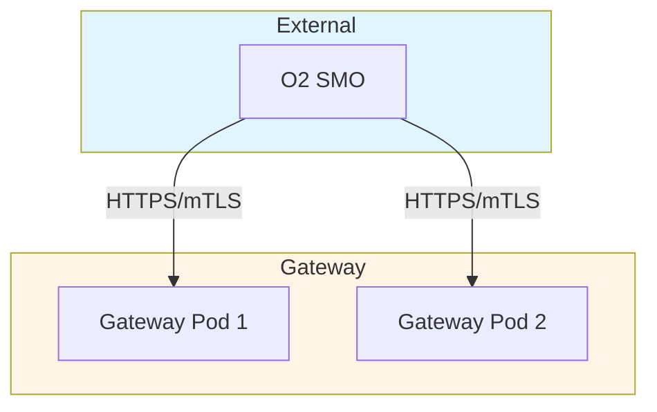

# O2-IMS Gateway - Claude Development Guide

Production-grade ORAN O2-IMS compliant API gateway. This guide defines Go-specific standards and project conventions.

## Quick Reference

| Aspect | Standard |
|--------|----------|
| **Language** | Go 1.25.0+ (toolchain auto-managed) |
| **Framework** | Gin (HTTP) |
| **Storage** | Redis OSS 7.4+ (Sentinel) |
| **Testing** | ≥80% coverage required |
| **Linting** | Zero tolerance - NO `//nolint` |
| **Verification** | ALWAYS verify fixes work (CI must pass) |

## CRITICAL RULE: ALWAYS VERIFY

**NEVER assume a fix will work. ALWAYS verify fixes are actually working before considering them complete.**

**Verification Checklist (MANDATORY):**
1. Run affected tests: `go test -race ./path/to/package`
2. Run full test suite: `make test`
3. Run linters: `make lint`
4. Commit and push changes
5. **Wait for CI to complete** (do not move on)
6. Check CI status: `gh run list --limit 1`
7. If CI fails, check logs: `gh run view <id> --log | grep "FAIL\|ERROR"`
8. Fix ALL failures found, repeat from step 1
9. Only mark complete when `gh run list` shows "success"

## Technology Stack

### Core Dependencies

```go
// go.mod - Required versions (DO NOT DOWNGRADE)
go 1.25.0

require (
    k8s.io/client-go v0.35.0
    k8s.io/api v0.35.0
    k8s.io/apimachinery v0.35.0
    k8s.io/kube-openapi v0.0.0-20250910181357-589584f1c912
    sigs.k8s.io/structured-merge-diff/v6 v6.3.0
)
```

**Why these versions:**
- **Go 1.25.0+**: Required by k8s.io/client-go v0.35.0
- **k8s.io v0.35.0**: Resolves yaml.v3 module path conflicts
- **structured-merge-diff v6**: K8s v0.35+ compatibility (migrated from v4)

**Known Issues with Earlier Versions:**
- k8s.io v0.31-v0.34 + Go 1.24: yaml.v3 type mismatch errors
- k8s.io v0.34 + Go 1.23: golang.org/x/net@v0.47.0 requires Go 1.24+

### Architecture

- **Stateless gateway pods** (3+ replicas)
- **Redis** for subscriptions, caching, inter-pod communication
- **Kubernetes API** as source of truth
- **Native Go TLS 1.3** for mTLS (no service mesh)
- **Multi-cluster** capable via Redis replication

## Code Quality Standards - ZERO TOLERANCE

### 1. Linting (MANDATORY)

**All code MUST pass linting without ANY errors or warnings.**

#### Linters Used

```yaml
golangci-lint:
  - gosec, revive, staticcheck, govet
  - errcheck, ineffassign, unused
  - gocyclo, gofmt, goimports
  - misspell, godot, gocritic
  - prealloc, unconvert, unparam
```

#### Rules

**❌ NEVER ALLOWED:**
- Disabling linters via `//nolint` (ANY linter)
- Using `//golangci-lint:disable`
- Committing code with linting errors
- Using `interface{}` or `any` without justification
- TODO/FIXME without GitHub issues

**✅ ALWAYS REQUIRED:**
- Run `make lint` before every commit
- Fix ALL issues by refactoring code
- **FIX THE CODE, NOT THE RULE**

#### Fixing Cyclomatic Complexity

When complexity > 10, **NEVER use `//nolint:cyclop`**. Instead:

1. **Extract Helper Functions**
```go
// ❌ BAD: Complexity 15
func processRequest(req Request) error {
    if req.Type == "A" {
        if req.Valid {
            // ... 20 lines
        }
    } else if req.Type == "B" {
        // ... more logic
    }
    return nil
}

// ✅ GOOD: Complexity 3
func processRequest(req Request) error {
    if req.Type == "A" {
        return processTypeA(req)
    }
    return processTypeB(req)
}
```

2. **Use Early Returns**
```go
// ✅ GOOD
func validate(data Data) error {
    if data == nil {
        return ErrInvalid
    }
    if !data.Valid {
        return ErrInvalid
    }
    if data.ID == "" {
        return ErrInvalid
    }
    return nil
}
```

3. **Use Maps/Strategy Patterns**
```go
// ✅ GOOD
var handlers = map[string]func() error{
    "create": handleCreate,
    "update": handleUpdate,
    "delete": handleDelete,
}

func handle(eventType string) error {
    handler, ok := handlers[eventType]
    if !ok {
        return ErrUnknownEvent
    }
    return handler()
}
```

### 2. Testing Standards (MANDATORY)

**All code MUST have ≥80% coverage with comprehensive tests.**

#### Test Coverage Requirements

- **Unit Tests:** ≥80% for all packages in `internal/` and `pkg/`
- **Integration Tests:** ALL API endpoints with real dependencies
- **E2E Tests:** ALL critical user flows

#### Required Testing Libraries

```go
import (
    "testing"
    "github.com/stretchr/testify/assert"
    "github.com/stretchr/testify/require"
    "go.uber.org/mock/gomock"
)
```

**Development Dependencies:**
- `github.com/stretchr/testify` - Assertions and mocking
- `go.uber.org/mock` - Mock generation
- `github.com/alicebob/miniredis/v2` - Redis mocking
- `github.com/testcontainers/testcontainers-go` - Integration tests

#### Unit Test Pattern (MANDATORY)

```go
// Table-driven tests (ALWAYS USE THIS PATTERN)
func TestSubscriptionStore_Create(t *testing.T) {
    tests := []struct {
        name    string
        sub     *O2Subscription
        wantErr bool
        errType error
    }{
        {
            name: "valid subscription",
            sub: &O2Subscription{
                ID:       "sub-123",
                Callback: "https://smo.example.com/notify",
            },
            wantErr: false,
        },
        {
            name: "duplicate subscription",
            sub: &O2Subscription{ID: "sub-123"},
            wantErr: true,
            errType: ErrSubscriptionExists,
        },
    }

    for _, tt := range tests {
        t.Run(tt.name, func(t *testing.T) {
            mockRedis := miniredis.RunT(t)
            defer mockRedis.Close()

            store := NewStore(mockRedis.Addr())
            err := store.Create(context.Background(), tt.sub)

            if tt.wantErr {
                require.Error(t, err)
                require.ErrorIs(t, err, tt.errType)
            } else {
                require.NoError(t, err)
            }
        })
    }
}
```

#### Integration Test Pattern

```go
func TestSubscriptionIntegration(t *testing.T) {
    if testing.Short() {
        t.Skip("Skipping integration test")
    }

    // Setup: Real Redis container
    ctx := context.Background()
    redisContainer, err := testcontainers.GenericContainer(ctx, testcontainers.GenericContainerRequest{
        ContainerRequest: testcontainers.ContainerRequest{
            Image:        "redis:7.4-alpine",
            ExposedPorts: []string{"6379/tcp"},
            WaitingFor:   wait.ForLog("Ready to accept connections"),
        },
        Started: true,
    })
    require.NoError(t, err)
    defer redisContainer.Terminate(ctx)

    // Test with real dependencies
    gateway := setupGateway(redisContainer)
    // ... test implementation
}
```

#### Running Tests

```bash
# Unit tests (fast)
make test
go test ./... -short

# Coverage report
make test-coverage

# Integration tests (requires Docker)
make test-integration

# E2E tests (requires Kubernetes)
make test-e2e

# All tests
make test-all
```

### 3. Code Security (MANDATORY)

**Input Validation:**
- ✅ Validate ALL external inputs
- ✅ Use OpenAPI schema validation
- ✅ Sanitize before logging (no secrets)
- ✅ Use parameterized queries

**Secrets Management:**
- ✅ NEVER hardcode secrets
- ✅ Use Kubernetes Secrets
- ✅ Read from environment variables only
- ✅ Redact secrets in logs

**Security Scanning:**
```bash
gosec ./...
govulncheck ./...
trivy image o2ims-gateway:latest
make security-scan
```

### 4. Go Code Style

#### Naming Conventions

- **Packages:** Short, lowercase, no underscores (`storage`, `cache`, `o2ims`)
- **Files:** Lowercase with underscores (`subscription_store.go`)
- **Types:** PascalCase (`O2Subscription`, `DeploymentManager`)
- **Functions:** PascalCase (exported), camelCase (unexported)
- **Constants:** PascalCase (not SCREAMING_CASE)
- **Interfaces:** `-er` suffix for single-method (`Storer`, `Cacher`)

#### CRITICAL: Avoid Variable Shadowing

**NEVER use local variable names that match imported package names.**

```go
// ❌ BAD: Shadows imported package
import "github.com/example/adapter"

func TestSomething(t *testing.T) {
    adapter := NewAdapter()  // SHADOWS package!
}

// ✅ GOOD: Use import alias or different name
import dmsadapter "github.com/example/adapter"

func TestSomething(t *testing.T) {
    adp := NewAdapter()
    assert.Contains(t, adp.Capabilities(), dmsadapter.CapabilityX)
}
```

#### Error Handling

```go
// ✅ GOOD: Wrap with context
if err := store.Create(ctx, sub); err != nil {
    return fmt.Errorf("failed to create subscription: %w", err)
}

// ✅ GOOD: Sentinel errors
var (
    ErrSubscriptionNotFound = errors.New("subscription not found")
    ErrSubscriptionExists   = errors.New("subscription already exists")
)

// ✅ GOOD: Check error types
if errors.Is(err, ErrSubscriptionNotFound) {
    return http.StatusNotFound
}
```

#### Context Handling

```go
// ✅ GOOD: Context as first parameter
func (s *Store) Create(ctx context.Context, sub *O2Subscription) error

// ✅ GOOD: Respect cancellation
select {
case <-ctx.Done():
    return ctx.Err()
case result := <-ch:
    return result
}

// ❌ BAD: Context as struct field
type Store struct {
    ctx context.Context  // NEVER DO THIS
}
```

### 5. Documentation Standards

#### Code Documentation

```go
// ✅ GOOD: Package documentation
// Package storage provides abstractions for subscription storage.
// It supports Redis-backed storage with automatic failover.
package storage

// ✅ GOOD: Type with example
// O2Subscription represents an O2-IMS subscription.
// Subscribers receive webhook notifications when resources change.
//
// Example:
//
//	sub := &O2Subscription{
//	    ID:       "sub-123",
//	    Callback: "https://smo.example.com/notify",
//	}
type O2Subscription struct { ... }

// Create creates a new subscription in the store.
// Returns ErrSubscriptionExists if a subscription with the same ID exists.
// The context is used for cancellation and timeout control.
func (s *Store) Create(ctx context.Context, sub *O2Subscription) error
```

#### External Documentation (MANDATORY Updates)

| Change Type | Required Documentation |
|-------------|----------------------|
| **New API Endpoint** | docs/api-mapping.md, OpenAPI spec, examples |
| **API Modification** | docs/api-mapping.md, OpenAPI spec, breaking changes |
| **Architecture Change** | docs/architecture.md, ARCHITECTURE_SUMMARY.md |
| **Deployment Change** | README.md, deployment guides, Helm docs |
| **Security Change** | docs/architecture.md security section |
| **New Feature** | README.md features list, usage examples |

**Mermaid Diagram Standards:**

Use Mermaid diagrams (not ASCII art) for:
- System architecture
- Component relationships
- Data flow sequences
- State machines



### 6. Performance Guidelines

**Requirements:**
- API response: p95 < 100ms, p99 < 500ms
- Webhook delivery: < 1s end-to-end
- Cache hit ratio: > 90%
- Memory per pod: < 512MB

**Best Practices:**

```go
// ✅ Preallocate slices
subs := make([]*O2Subscription, 0, len(subIDs))

// ✅ Use sync.Pool
var bufferPool = sync.Pool{
    New: func() interface{} { return new(bytes.Buffer) },
}

// ✅ Buffered channels
ch := make(chan result, 100)
```

### 7. Observability (MANDATORY)

```go
// ✅ Structured logging
log.Info("subscription created",
    "subscriptionID", sub.ID,
    "callback", sub.Callback,
)

// ✅ Metrics
var subscriptionCreates = promauto.NewCounterVec(
    prometheus.CounterOpts{
        Name: "o2ims_subscription_creates_total",
    },
    []string{"status"},
)

// ✅ Tracing
ctx, span := otel.Tracer("storage").Start(ctx, "Create")
defer span.End()
```

## Development Workflow

### Daily Development

```bash
# 1. Create feature branch
git checkout -b feature/issue-42-add-filter

# 2. Write code + tests

# 3. Run quality checks
make lint      # Every few minutes
make test      # After each feature
make quality   # Before commit

# 4. Commit
git commit -m "feat(subscription): add resource type filter

Resolves #42"

# 5. Verify CI passes
gh run list --limit 1
```

### Quality Gates (MUST PASS)

Every commit and PR must pass:
1. ✅ `make fmt` - Code formatting
2. ✅ `make lint` - All linters (zero warnings)
3. ✅ `make test` - Unit tests
4. ✅ `make test-coverage` - Coverage ≥80%
5. ✅ `make test-integration` - Integration tests
6. ✅ `make test-e2e` - E2E tests
7. ✅ `make security-scan` - No vulnerabilities
8. ✅ `make lint-docs` - Documentation formatting
9. ✅ CI pipeline - All checks green

## Claude-Specific Instructions

### When Writing Code

1. **ALWAYS run linters** after writing: `make lint`
2. **NEVER disable linters** - fix the code
3. **ALWAYS write tests** (≥80% coverage)
4. **ALWAYS check security** with `gosec`
5. **ALWAYS use structured logging**
6. **ALWAYS document** exported types/functions
7. **ALWAYS update documentation** for user-facing changes

### Common Violations to AVOID

❌ Using `//nolint` directives
❌ Ignoring errors with `_`
❌ Hardcoding secrets
❌ Using `any` without justification
❌ Missing tests (coverage < 80%)
❌ Code changes without doc updates
❌ Local variables shadowing package names
❌ Saying "should work" without verifying

## Makefile Targets

```bash
# Quality
make lint              # Run all linters
make fmt               # Format code
make quality           # Run all checks

# Testing
make test              # Unit tests
make test-coverage     # Coverage report
make test-integration  # Integration tests
make test-e2e          # E2E tests
make test-all          # All tests

# Security
make security-scan     # All security checks

# Documentation
make lint-docs         # Lint Markdown
```

## Resources

- [Effective Go](https://go.dev/doc/effective_go)
- [Uber Go Style Guide](https://github.com/uber-go/guide/blob/master/style.md)
- [O-RAN O2 IMS Spec](https://specifications.o-ran.org/)

---

**Remember: We build production systems for critical telecom infrastructure. Quality is not optional.**
