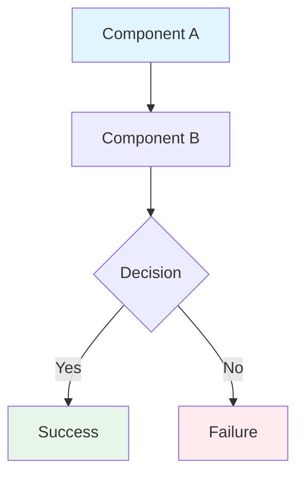
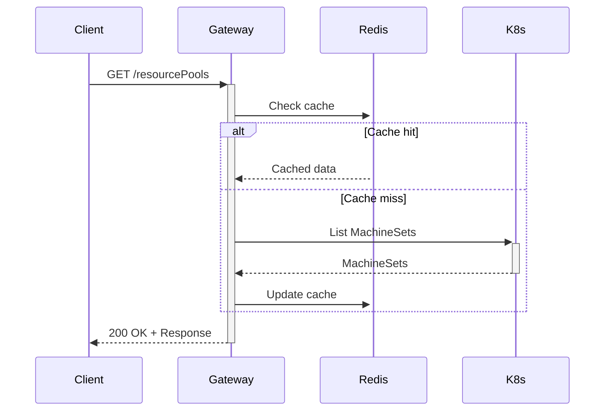
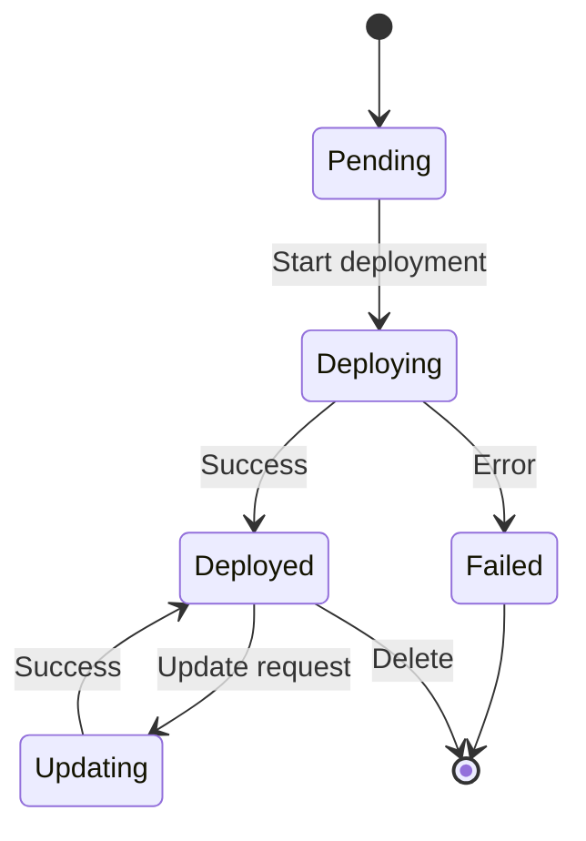
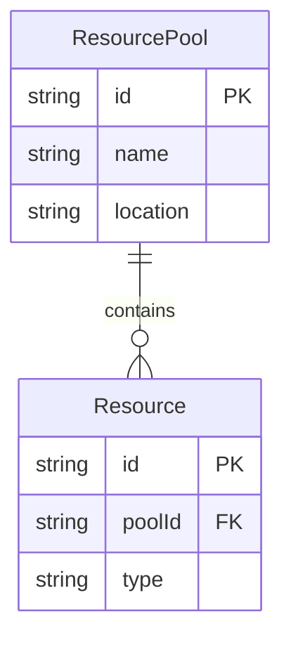

# O2-IMS Gateway Project - Claude Development Guide

This file provides development guidelines for Claude Code when working on the O2-IMS Gateway project.

## Project Overview

**O2-IMS Gateway** is a production-grade ORAN O2-IMS compliant API gateway that translates O2-IMS requests to Kubernetes API calls, enabling disaggregation of backend infrastructure components.

**Technology Stack:**
- Language: Go 1.23+
- Framework: Gin (HTTP)
- Storage: Redis OSS 7.4+ (Sentinel)
- Container Orchestration: Kubernetes 1.30+
- TLS: Native Go TLS 1.3 + cert-manager 1.15+
- Deployment: Helm 3.x + Custom Operator

**Architecture:**
- Stateless gateway pods (3+ replicas)
- Redis for subscriptions, caching, and inter-pod communication
- Kubernetes API as source of truth for infrastructure resources
- Native Go TLS 1.3 for mTLS (no service mesh overhead)
- Multi-cluster capable via Redis replication

## Code Quality Standards - ZERO TOLERANCE

### 1. Linting - MANDATORY

**All code MUST pass linting without ANY errors or warnings.**

#### Linters Used:
```yaml
golangci-lint:
  - gosec          # Security vulnerabilities
  - revive         # Code style and best practices
  - staticcheck    # Static analysis
  - govet          # Go vet tool
  - errcheck       # Unchecked errors
  - ineffassign    # Ineffective assignments
  - unused         # Unused code
  - gocyclo        # Cyclomatic complexity
  - gofmt          # Code formatting
  - goimports      # Import organization
  - misspell       # Spelling errors
  - godot          # Comment formatting
  - gocritic       # Go best practices
  - prealloc       # Slice preallocation
  - unconvert      # Unnecessary conversions
  - unparam        # Unused function parameters
```

#### Linting Rules - ABSOLUTE REQUIREMENTS:

**❌ NEVER ALLOWED:**
- Disabling linters via `//nolint` comments
- Using `//golangci-lint:disable` directives
- Committing code with linting errors
- Ignoring security warnings from gosec
- Using `interface{}` or `any` without strong justification
- Leaving TODO/FIXME comments without GitHub issues

**✅ ALWAYS REQUIRED:**
- Run `make lint` before every commit
- Fix ALL linting issues (no exceptions)
- If a linting rule is triggered, FIX THE CODE, not the rule
- Document why if a specific pattern is required (rare)
- Use strongly-typed interfaces and structs

#### Running Linters:

```bash
# Run all linters (MUST pass before commit)
make lint

# Auto-fix formatting issues
make fmt

# Security scan only
make security-scan

# All quality checks (lint + test + security)
make quality
```

### 2. Code Security - MANDATORY

**All code MUST be secure by default.**

#### Security Requirements:

**Input Validation:**
- ✅ Validate ALL external inputs (HTTP requests, env vars, config files)
- ✅ Use OpenAPI schema validation for API requests
- ✅ Sanitize inputs before logging (no secrets in logs)
- ✅ Use parameterized queries/commands (prevent injection)

**Authentication & Authorization:**
- ✅ mTLS for all service-to-service communication
- ✅ Validate client certificates in Istio gateway
- ✅ Use Kubernetes RBAC for pod permissions
- ✅ Rotate secrets regularly (cert-manager automation)

**Secrets Management:**
- ✅ NEVER hardcode secrets, passwords, API keys
- ✅ Use Kubernetes Secrets or external secret managers
- ✅ Read secrets from environment variables only
- ✅ Redact secrets in logs and error messages

**Error Handling:**
- ✅ NEVER expose internal errors to external clients
- ✅ Log detailed errors internally, return generic errors externally
- ✅ Use structured logging (no sensitive data in logs)

**Dependencies:**
- ✅ Use `go mod verify` to verify dependencies
- ✅ Run `govulncheck` before releases
- ✅ Keep dependencies updated (monthly security patches)
- ✅ Pin dependency versions in go.mod

#### Security Scanning:

```bash
# Static security analysis
gosec ./...

# Vulnerability scanning
govulncheck ./...

# Container scanning (before deployment)
trivy image o2ims-gateway:latest

# All security checks
make security-scan
```

**Security violations are BLOCKING - code will NOT be merged.**

### 3. Testing Standards - MANDATORY

**All code MUST have comprehensive tests with ≥80% coverage.**

This project follows a complete testing pyramid with unit tests, integration tests, and functional/E2E tests. **ALL** test types are mandatory for production-grade quality.

#### Test Coverage Requirements:

- **Unit Tests:** ≥80% coverage for all packages (enforced in CI)
- **Integration Tests:** ALL API endpoints tested with real dependencies
- **Functional/E2E Tests:** ALL critical user flows tested end-to-end

#### Test Framework Setup:

**Required Testing Libraries:**
```go
import (
    "testing"
    "github.com/stretchr/testify/assert"   // Assertions
    "github.com/stretchr/testify/require"  // Fatal assertions
    "github.com/stretchr/testify/mock"     // Mocking
    "github.com/stretchr/testify/suite"    // Test suites
    "go.uber.org/mock/gomock"              // Mock generation
)
```

**Development Dependencies:**
- `github.com/stretchr/testify` - Assertion and mocking framework
- `go.uber.org/mock` - Mock code generation for interfaces
- `github.com/DATA-DOG/go-sqlmock` - SQL mocking (if using SQL)
- `github.com/alicebob/miniredis/v2` - Redis mocking for unit tests
- `github.com/testcontainers/testcontainers-go` - Real containers for integration tests

#### 3.1 Unit Testing

**Purpose:** Test individual functions, methods, and packages in isolation.

**Requirements:**
- ✅ Every exported function MUST have unit tests
- ✅ Table-driven tests for multiple scenarios
- ✅ Mock external dependencies (Redis, Kubernetes, HTTP clients)
- ✅ Test success cases AND all error paths
- ✅ Test edge cases and boundary conditions
- ✅ Fast execution (< 5s for full unit test suite)

**Unit Test Pattern (MANDATORY):**

```go
// Table-driven tests (ALWAYS USE THIS PATTERN)
func TestSubscriptionStore_Create(t *testing.T) {
    tests := []struct {
        name    string
        sub     *O2Subscription
        wantErr bool
        errType error
    }{
        {
            name: "valid subscription",
            sub: &O2Subscription{
                ID:       "sub-123",
                Callback: "https://smo.example.com/notify",
            },
            wantErr: false,
        },
        {
            name: "duplicate subscription",
            sub: &O2Subscription{
                ID: "sub-123",
            },
            wantErr: true,
            errType: ErrSubscriptionExists,
        },
        {
            name: "missing callback URL",
            sub: &O2Subscription{
                ID: "sub-456",
            },
            wantErr: true,
            errType: ErrInvalidCallback,
        },
    }

    for _, tt := range tests {
        t.Run(tt.name, func(t *testing.T) {
            // Setup: Create mocked dependencies
            mockRedis := miniredis.RunT(t)
            defer mockRedis.Close()

            store := NewStore(mockRedis.Addr())

            // Execute
            err := store.Create(context.Background(), tt.sub)

            // Assert
            if tt.wantErr {
                require.Error(t, err)
                require.ErrorIs(t, err, tt.errType)
            } else {
                require.NoError(t, err)

                // Verify subscription was actually stored
                got, err := store.Get(context.Background(), tt.sub.ID)
                require.NoError(t, err)
                assert.Equal(t, tt.sub.ID, got.ID)
            }
        })
    }
}
```

**Mocking Best Practices:**

```go
// Generate mocks using gomock
//go:generate mockgen -source=adapter.go -destination=mocks/adapter_mock.go -package=mocks

// Use mocks in tests
func TestHandler_CreateSubscription(t *testing.T) {
    ctrl := gomock.NewController(t)
    defer ctrl.Finish()

    mockAdapter := mocks.NewMockAdapter(ctrl)
    mockAdapter.EXPECT().
        CreateSubscription(gomock.Any(), gomock.Any()).
        Return(nil)

    handler := NewHandler(mockAdapter)
    // ... test logic
}
```

#### 3.2 Integration Testing

**Purpose:** Test multiple components working together with real dependencies.

**Requirements:**
- ✅ Test with REAL Redis (via testcontainers)
- ✅ Test with REAL Kubernetes API (via envtest or kind)
- ✅ Test ALL API endpoints end-to-end
- ✅ Test subscription workflows (create → event → webhook)
- ✅ Test failure scenarios (Redis down, K8s unavailable)
- ✅ Cleanup after each test (isolated environments)

**Integration Test Pattern:**

```go
// tests/integration/subscription_test.go
func TestSubscriptionIntegration(t *testing.T) {
    if testing.Short() {
        t.Skip("Skipping integration test in short mode")
    }

    // Setup: Start real Redis container
    ctx := context.Background()
    redisContainer, err := testcontainers.GenericContainer(ctx, testcontainers.GenericContainerRequest{
        ContainerRequest: testcontainers.ContainerRequest{
            Image:        "redis:7.4-alpine",
            ExposedPorts: []string{"6379/tcp"},
            WaitingFor:   wait.ForLog("Ready to accept connections"),
        },
        Started: true,
    })
    require.NoError(t, err)
    defer redisContainer.Terminate(ctx)

    // Get Redis connection details
    redisHost, err := redisContainer.Host(ctx)
    require.NoError(t, err)
    redisPort, err := redisContainer.MappedPort(ctx, "6379")
    require.NoError(t, err)

    // Setup gateway with real Redis
    cfg := &config.Config{
        Redis: config.RedisConfig{
            Addr: fmt.Sprintf("%s:%s", redisHost, redisPort.Port()),
        },
    }
    gateway := server.New(cfg)

    // Test: Create subscription via API
    req := httptest.NewRequest("POST", "/o2ims/v1/subscriptions",
        strings.NewReader(`{
            "callback": "https://smo.example.com/notify",
            "consumerSubscriptionId": "smo-sub-123"
        }`))
    w := httptest.NewRecorder()

    gateway.ServeHTTP(w, req)

    // Assert: Subscription created and stored in Redis
    assert.Equal(t, http.StatusCreated, w.Code)

    // Verify in Redis
    client := redis.NewClient(&redis.Options{
        Addr: fmt.Sprintf("%s:%s", redisHost, redisPort.Port()),
    })
    val, err := client.Get(ctx, "subscription:*").Result()
    require.NoError(t, err)
    assert.Contains(t, val, "smo-sub-123")
}
```

**Running Integration Tests:**

```bash
# Run integration tests only
make test-integration

# Run with verbose output
go test -v ./tests/integration/... -tags=integration

# Run specific integration test
go test -v ./tests/integration/... -run=TestSubscriptionIntegration
```

#### 3.3 Functional/E2E Testing

**Purpose:** Test complete user workflows from start to finish as a black box.

**Requirements:**
- ✅ Test COMPLETE user journeys (not individual operations)
- ✅ Use real Kubernetes cluster (kind or minikube)
- ✅ Test subscription notifications end-to-end
- ✅ Test multi-component interactions
- ✅ Test failure and recovery scenarios
- ✅ Measure end-to-end latency and performance

**E2E Test Pattern:**

```go
// tests/e2e/subscription_workflow_test.go
func TestE2E_SubscriptionWorkflow(t *testing.T) {
    if testing.Short() {
        t.Skip("Skipping E2E test in short mode")
    }

    // Setup: Deploy full stack (Gateway + Redis + K8s)
    e2e := setupE2EEnvironment(t)
    defer e2e.Cleanup()

    // Step 1: Create subscription
    t.Log("Creating subscription...")
    subID := e2e.CreateSubscription(&Subscription{
        Callback: e2e.WebhookServerURL(),
        Filter: SubscriptionFilter{
            ResourcePoolID: "pool-test",
        },
    })

    // Step 2: Create a resource pool (triggers event)
    t.Log("Creating resource pool to trigger event...")
    poolID := e2e.CreateResourcePool(&ResourcePool{
        Name: "test-pool",
        Description: "E2E test pool",
    })

    // Step 3: Wait for webhook notification
    t.Log("Waiting for webhook notification...")
    notification := e2e.WaitForWebhook(10 * time.Second)

    // Assert: Webhook received with correct data
    require.NotNil(t, notification)
    assert.Equal(t, subID, notification.SubscriptionID)
    assert.Equal(t, poolID, notification.Resource.ResourcePoolID)
    assert.Equal(t, "ResourcePoolCreated", notification.EventType)

    // Measure: End-to-end latency
    latency := notification.ReceivedAt.Sub(notification.Timestamp)
    assert.Less(t, latency, 1*time.Second, "Webhook latency exceeded 1s SLA")

    t.Logf("E2E test completed in %v", latency)
}
```

**E2E Test Utilities:**

```go
// tests/e2e/helpers.go
type E2EEnvironment struct {
    KubeClient    kubernetes.Interface
    GatewayURL    string
    WebhookServer *httptest.Server
    notifications chan *Notification
}

func setupE2EEnvironment(t *testing.T) *E2EEnvironment {
    // Start kind cluster
    cluster := kind.CreateCluster(t)

    // Deploy gateway + Redis via Helm
    helm.Install(t, "netweave", "./helm/netweave")

    // Start webhook receiver
    webhookServer := startWebhookServer(t)

    return &E2EEnvironment{
        KubeClient:    cluster.Client(),
        GatewayURL:    "http://localhost:8080",
        WebhookServer: webhookServer,
        notifications: make(chan *Notification, 100),
    }
}
```

#### Test Organization:

```
netweave/
├── internal/
│   ├── adapter/
│   │   ├── adapter.go
│   │   ├── adapter_test.go         # Unit tests
│   │   └── mocks/
│   │       └── adapter_mock.go     # Generated mocks
│   ├── storage/
│   │   ├── redis.go
│   │   └── redis_test.go           # Unit tests
├── tests/
│   ├── integration/
│   │   ├── api_test.go             # API integration tests
│   │   ├── subscription_test.go     # Subscription integration tests
│   │   └── helpers.go
│   └── e2e/
│       ├── subscription_workflow_test.go  # E2E tests
│       ├── resource_lifecycle_test.go
│       └── helpers.go
```

#### Running Tests:

```bash
# Run ONLY unit tests (fast, for development)
make test
go test ./... -short

# Run tests with coverage report
make test-coverage
go test ./... -coverprofile=coverage.out
go tool cover -html=coverage.out

# Run integration tests (requires Docker)
make test-integration
go test ./tests/integration/... -tags=integration

# Run E2E tests (requires Kubernetes)
make test-e2e
go test ./tests/e2e/... -tags=e2e

# Run ALL tests (unit + integration + E2E)
make test-all

# Watch mode (auto-run tests on file change)
make test-watch
```

#### Test Enforcement:

**Pre-Commit Checks:**
- ✅ Unit tests MUST pass (`make test`)
- ✅ Coverage MUST be ≥80% (`make test-coverage`)
- ✅ No test files with `t.Skip()` without justification

**CI Pipeline Checks:**
- ✅ Unit tests (fast feedback)
- ✅ Integration tests (with testcontainers)
- ✅ E2E tests (with kind cluster)
- ✅ Coverage report uploaded to Codecov
- ✅ ALL must pass before merge

**Coverage Requirements:**
```bash
# Coverage MUST be ≥80% for:
- All packages in internal/
- All packages in pkg/

# Exceptions (document why):
- cmd/ (main packages)
- tests/ (test helpers)
```

**Tests MUST pass before commit. No exceptions. No skipped tests without documented reasons.**

### 4. Code Style - Go Best Practices

#### Naming Conventions:

- **Packages:** Short, lowercase, no underscores (e.g., `storage`, `cache`, `o2ims`)
- **Files:** Lowercase with underscores (e.g., `subscription_store.go`, `redis_cache.go`)
- **Types:** PascalCase (e.g., `O2Subscription`, `DeploymentManager`)
- **Functions/Methods:** PascalCase for exported, camelCase for unexported
- **Constants:** PascalCase (not SCREAMING_CASE)
- **Interfaces:** `-er` suffix for single-method (e.g., `Storer`, `Cacher`)

#### Code Organization:

```
internal/           # Private application code
  adapter/          # Adapter interface and registry
  adapters/         # Concrete adapter implementations
    k8s/
    mock/
  config/           # Configuration loading
  controller/       # Subscription controller
  o2ims/            # O2-IMS models and handlers
    models/
    handlers/
  server/           # HTTP server setup

pkg/                # Public reusable libraries
  cache/            # Cache abstraction
  storage/          # Storage abstraction
  errors/           # Error types

cmd/                # Entry points
  gateway/          # Main gateway binary
  migrate/          # Migration tools
```

#### Error Handling:

```go
// ✅ GOOD: Wrap errors with context
if err := store.Create(ctx, sub); err != nil {
    return fmt.Errorf("failed to create subscription: %w", err)
}

// ✅ GOOD: Sentinel errors for specific cases
var (
    ErrSubscriptionNotFound = errors.New("subscription not found")
    ErrSubscriptionExists   = errors.New("subscription already exists")
)

// ✅ GOOD: Check error types
if errors.Is(err, ErrSubscriptionNotFound) {
    return http.StatusNotFound
}

// ❌ BAD: Ignoring errors
_ = store.Create(ctx, sub)

// ❌ BAD: Generic error messages
return errors.New("error")
```

#### Context Handling:

```go
// ✅ GOOD: Always pass context as first parameter
func (s *Store) Create(ctx context.Context, sub *O2Subscription) error

// ✅ GOOD: Respect context cancellation
select {
case <-ctx.Done():
    return ctx.Err()
case result := <-ch:
    return result
}

// ❌ BAD: Context as struct field
type Store struct {
    ctx context.Context  // NEVER DO THIS
}
```

#### Concurrency:

```go
// ✅ GOOD: Use sync primitives properly
type Cache struct {
    mu    sync.RWMutex
    items map[string]interface{}
}

func (c *Cache) Get(key string) interface{} {
    c.mu.RLock()
    defer c.mu.RUnlock()
    return c.items[key]
}

// ✅ GOOD: Close channels to signal completion
ch := make(chan result)
defer close(ch)

// ❌ BAD: Shared state without synchronization
var counter int  // Race condition!
go func() { counter++ }()
go func() { counter++ }()
```

### 5. Documentation Requirements

#### Code Documentation:

```go
// ✅ GOOD: Package documentation
// Package storage provides abstractions for subscription storage.
// It supports Redis-backed storage with automatic failover and caching.
package storage

// ✅ GOOD: Type documentation with examples
// O2Subscription represents an O2-IMS subscription.
// Subscribers receive webhook notifications when watched resources change.
//
// Example:
//
//	sub := &O2Subscription{
//	    ID:       "sub-123",
//	    Callback: "https://smo.example.com/notify",
//	    Filter: SubscriptionFilter{
//	        ResourcePoolID: "pool-abc",
//	    },
//	}
type O2Subscription struct { ... }

// ✅ GOOD: Function documentation with parameters and errors
// Create creates a new subscription in the store.
// Returns ErrSubscriptionExists if a subscription with the same ID already exists.
// The context is used for cancellation and timeout control.
func (s *Store) Create(ctx context.Context, sub *O2Subscription) error
```

#### External Documentation:

**Required Documentation Files:**
- `README.md` - Project overview, quickstart, architecture diagram
- `docs/architecture.md` - Detailed architecture and design decisions
- `docs/api-mapping.md` - O2-IMS ↔ Kubernetes mappings
- `docs/deployment.md` - Deployment guide (single and multi-cluster)
- `docs/security.md` - Security model and mTLS configuration
- `docs/operations.md` - Operational runbooks (backup, restore, failover)
- `CONTRIBUTING.md` - How to contribute (PR process, coding standards)

### 6. Documentation Standards - MANDATORY

**All documentation MUST be kept up-to-date with code changes.**

Documentation is a **first-class requirement** - not an afterthought. Every code change that affects user-facing behavior, APIs, architecture, or deployment MUST include corresponding documentation updates **in the same commit/PR**.

#### 6.1 Documentation Update Requirements

**MANDATORY:** Documentation updates are REQUIRED for these change types:

| Change Type | Required Documentation Updates |
|------------|-------------------------------|
| **New API Endpoint** | • [docs/api-mapping.md](docs/api-mapping.md) - Add O2-IMS ↔ K8s mapping<br>• Update OpenAPI spec<br>• Add request/response examples |
| **API Modification** | • [docs/api-mapping.md](docs/api-mapping.md) - Update mappings<br>• Update OpenAPI spec<br>• Document breaking changes |
| **Architecture Change** | • [docs/architecture.md](docs/architecture.md) - Update component diagrams<br>• [ARCHITECTURE_SUMMARY.md](ARCHITECTURE_SUMMARY.md) - Update summary<br>• Update data flow diagrams |
| **Deployment Change** | • [README.md](README.md) - Update quickstart if affected<br>• Update deployment guides<br>• Update Helm values documentation |
| **Security Change** | • [docs/architecture.md](docs/architecture.md) - Update security section<br>• Document new security controls<br>• Update threat model |
| **Configuration Change** | • Document new config options<br>• Update example configs<br>• Update environment variable docs |
| **New Feature** | • [README.md](README.md) - Update features list<br>• Add usage examples<br>• Update architecture if components added |
| **Breaking Change** | • **ALL relevant docs**<br>• Migration guide<br>• Changelog with clear warnings |

#### 6.2 Documentation Types and Standards

**Architecture Documentation:**
- **Location:** [docs/architecture.md](docs/architecture.md), [docs/architecture-part2.md](docs/architecture-part2.md)
- **Content:** Component diagrams, data flows, technology decisions, HA/DR design
- **Update When:** Architecture changes, new components, technology stack updates
- **Format:** Markdown with Mermaid diagrams where applicable
- **Review:** Requires architecture review for major changes

**API Documentation:**
- **Location:** [docs/api-mapping.md](docs/api-mapping.md), OpenAPI spec
- **Content:** Complete O2-IMS ↔ Kubernetes mappings with examples
- **Update When:** Any API endpoint change (new, modified, deprecated)
- **Format:** Markdown with code examples (request/response JSON)
- **Testing:** All examples MUST be tested and working

**Code Documentation (GoDoc):**
```go
// ✅ REQUIRED: All exported types, functions, methods
// Subscription represents an O2-IMS subscription for resource change notifications.
// Subscribers receive webhook callbacks when watched resources are created, updated, or deleted.
//
// Example:
//
//	sub := &Subscription{
//	    ID:       uuid.New().String(),
//	    Callback: "https://smo.example.com/notify",
//	    Filter: SubscriptionFilter{
//	        ResourceTypeID: []string{"compute-node"},
//	    },
//	}
type Subscription struct { ... }

// Create creates a new subscription in the store.
// Returns ErrSubscriptionExists if a subscription with the same ID already exists.
// Returns ErrInvalidCallback if the callback URL is invalid.
// The context is used for timeout and cancellation.
func (s *Store) Create(ctx context.Context, sub *Subscription) error { ... }
```

**README.md:**
- **Purpose:** First contact point for users - project overview and quickstart
- **Update When:**
  - Feature list changes
  - Technology stack changes
  - Installation/setup process changes
  - Prerequisites change
- **Must Include:**
  - Current feature list
  - Accurate technology stack
  - Working quickstart commands
  - Links to detailed documentation

**ARCHITECTURE_SUMMARY.md:**
- **Purpose:** Executive summary for stakeholders
- **Update When:**
  - Major architecture changes
  - Technology decisions change
  - Key metrics change (SLAs, performance targets)
- **Keep Synchronized With:** [docs/architecture.md](docs/architecture.md), [README.md](README.md)

#### 6.3 Documentation Quality Standards

**All Documentation Must:**
- ✅ Be accurate and current (no outdated information)
- ✅ Include working code examples (tested, not pseudo-code)
- ✅ Use proper Markdown formatting (pass markdownlint)
- ✅ Include diagrams for complex concepts (Mermaid preferred)
- ✅ Be clear and concise (avoid jargon without explanation)
- ✅ Include links to related documentation

**Code Examples in Documentation:**
```bash
# ❌ BAD: Outdated or non-working example
curl -X GET http://localhost:8080/api/v1/subscriptions

# ✅ GOOD: Current, working example with full context
curl -X GET https://netweave.example.com/o2ims/v1/subscriptions \
  --cert client.crt \
  --key client.key \
  --cacert ca.crt \
  -H "Accept: application/json"
```

#### 6.3.1 Mermaid Diagram Standards

**All architecture and flow documentation MUST use Mermaid diagrams instead of ASCII art.**

Mermaid provides beautiful, maintainable diagrams that render properly in GitHub, IDEs, and documentation viewers.

**When to Use Mermaid Diagrams:**
- ✅ System architecture overviews
- ✅ Component relationships
- ✅ Data flow sequences
- ✅ State machines
- ✅ Deployment topologies
- ✅ Plugin/adapter architectures
- ✅ Request/response flows

**Diagram Types and Usage:**

**1. Flowcharts (graph TB/LR)** - Use for architecture and component diagrams:


**2. Sequence Diagrams** - Use for request/response flows and interactions:


**3. State Diagrams** - Use for lifecycle and state transitions:


**4. Entity Relationship Diagrams** - Use for data models:


**Mermaid Best Practices:**

**✅ DO:**
- Use subgraphs to group related components
- Apply consistent color coding (blue for external, green for success, red for errors)
- Add notes for important details
- Use meaningful labels on connections
- Keep diagrams focused (one concept per diagram)
- Use proper Mermaid syntax (no mixing styles)

**❌ DON'T:**
- Use ASCII art diagrams (convert to Mermaid)
- Create overly complex diagrams (split into multiple)
- Forget to add labels to arrows
- Use inconsistent naming between diagrams
- Mix different diagram types in one code block

**Standard Color Scheme:**
```
External Systems: #e1f5ff (light blue)
Gateway/API Layer: #fff4e6 (light orange)
Storage/Cache: #ffe6f0 (light pink)
Backend/K8s: #e8f5e9 (light green)
Controllers: #f3e5f5 (light purple)
Success/Active: #e8f5e9 (light green)
Error/Failure: #ffebee (light red)
```

**Example: Architecture Diagram**
```markdown
\`\`\`mermaid
graph TB
    subgraph External [External Layer]
        SMO[O2 SMO]
    end

    subgraph Gateway [Gateway Layer]
        GW1[Gateway Pod 1]
        GW2[Gateway Pod 2]
    end

    subgraph Storage [Storage Layer]
        Redis[Redis Sentinel]
    end

    subgraph Backend [Backend Layer]
        K8s[Kubernetes API]
    end

    SMO -->|HTTPS/mTLS| GW1
    SMO -->|HTTPS/mTLS| GW2
    GW1 --> Redis
    GW2 --> Redis
    GW1 --> K8s
    GW2 --> K8s

    style External fill:#e1f5ff
    style Gateway fill:#fff4e6
    style Storage fill:#ffe6f0
    style Backend fill:#e8f5e9
\`\`\`
```

**Validation:**
- Preview diagrams in GitHub before committing
- Ensure diagrams render correctly in VS Code with Mermaid extension
- Test in documentation viewers (mkdocs, hugo, etc.)

#### 6.4 Documentation Update Workflow

**During Development:**
1. **Identify Impact:** When making code changes, identify which docs are affected
2. **Update Docs:** Update documentation in the SAME branch as code changes
3. **Review Examples:** Ensure all code examples still work
4. **Check Links:** Verify internal documentation links are valid

**Before Committing:**
```bash
# Lint documentation
make lint-docs

# Verify Markdown formatting
markdownlint docs/ *.md

# Check for broken links
make check-links

# Verify examples (if applicable)
make verify-examples
```

**In Pull Request:**
- ✅ Include documentation updates in the SAME PR as code
- ✅ List documentation changes in PR description
- ✅ Mark "Documentation updated" checkbox in PR template
- ✅ Request review from documentation owners (if applicable)

**Example PR Checklist:**
```markdown
## Documentation Updates

- [x] Updated docs/api-mapping.md with new subscription filter syntax
- [x] Updated OpenAPI spec with new filter parameters
- [x] Added code examples for new filter options
- [x] Verified all examples are tested and working
- [x] Updated ARCHITECTURE_SUMMARY.md with new feature
- [ ] N/A - No user-facing changes
```

#### 6.5 Documentation Violations (BLOCKING)

**These will BLOCK PR merge:**
- ❌ API change without updating [docs/api-mapping.md](docs/api-mapping.md)
- ❌ Architecture change without updating [docs/architecture.md](docs/architecture.md)
- ❌ New feature without updating [README.md](README.md) features list
- ❌ Breaking change without migration guide
- ❌ Code examples that don't work or are outdated
- ❌ Missing GoDoc comments on exported types/functions
- ❌ Markdown linting failures

**Documentation is Code - Treat it with the same rigor as implementation.**

### 7. Git Workflow - MANDATORY

#### Branch Protection:

**Main Branch Rules:**
- ✅ Require pull request reviews (minimum 1 approval)
- ✅ Require status checks to pass (lint, test, security)
- ✅ Require branches to be up to date before merging
- ✅ No direct commits to main (enforce PRs only)
- ✅ Require linear history (squash or rebase merge)
- ✅ Require signed commits (GPG)

#### Commit Standards:

```bash
# ✅ GOOD: Conventional commit format
feat(adapter): add Kubernetes adapter for O2-IMS resource pools
fix(cache): resolve race condition in Redis cache invalidation
docs(api): update O2-IMS OpenAPI specification to v1.2
test(subscription): add integration tests for webhook delivery
refactor(storage): simplify Redis key schema for subscriptions
chore(deps): upgrade Redis client to v9.6.1

# ✅ GOOD: Reference GitHub issues
fix(auth): validate mTLS certificates in ingress gateway

Fixes certificate validation logic that allowed expired
certificates to pass through.

Resolves #42

# ❌ BAD: Vague commit messages
fix bug
update code
wip
```

#### Pre-Commit Hooks:

**Automated Checks (MUST pass before commit):**
1. Run `gofmt` (code formatting)
2. Run `goimports` (import organization)
3. Run `golangci-lint` (all linters)
4. Run `go test ./...` (unit tests)
5. Run `gosec` (security scan)
6. Check for secrets (using gitleaks)
7. Validate commit message format

```bash
# Pre-commit hook installation
make install-hooks

# Manual pre-commit check
make pre-commit
```

#### Pull Request Process:

**PR Requirements:**
1. Create feature branch: `feature/issue-NUM-description`
2. Write code following ALL standards above
3. Write tests (≥80% coverage)
4. Run `make quality` (MUST pass)
5. Update documentation if needed
6. Create PR with template
7. Address review comments
8. Squash commits before merge

**PR Template Must Include:**
- Summary of changes
- Link to GitHub issue (`Resolves #NUM`)
- Testing performed
- Screenshots (for UI changes)
- Breaking changes (if any)
- Checklist:
  - [ ] Tests added/updated
  - [ ] Documentation updated
  - [ ] Linting passed
  - [ ] Security scan passed
  - [ ] No secrets committed

### 7. Performance Guidelines

**Code MUST be performant and scalable.**

#### Performance Requirements:

- API response time: p95 < 100ms, p99 < 500ms
- Subscription webhook delivery: < 1s from event to webhook
- Cache hit ratio: > 90%
- Redis operations: < 5ms (local), < 50ms (cross-cluster)
- Memory usage per pod: < 512MB under normal load

#### Performance Best Practices:

```go
// ✅ GOOD: Preallocate slices when size is known
subs := make([]*O2Subscription, 0, len(subIDs))

// ✅ GOOD: Use sync.Pool for frequently allocated objects
var bufferPool = sync.Pool{
    New: func() interface{} {
        return new(bytes.Buffer)
    },
}

// ✅ GOOD: Use buffered channels appropriately
ch := make(chan result, 100)

// ✅ GOOD: Avoid unnecessary allocations in hot paths
func (s *Store) Get(key string) (*Subscription, error) {
    // Reuse buffer instead of allocating
    buf := bufferPool.Get().(*bytes.Buffer)
    defer bufferPool.Put(buf)
    buf.Reset()
    ...
}

// ❌ BAD: Unnecessary conversions
str := string([]byte(str))  // Wasteful

// ❌ BAD: Unbuffered channels in loops
for _, item := range items {
    ch <- item  // Can block and slow down loop
}
```

#### Profiling:

```bash
# CPU profiling
go test -cpuprofile=cpu.prof -bench=.
go tool pprof cpu.prof

# Memory profiling
go test -memprofile=mem.prof -bench=.
go tool pprof mem.prof

# Live profiling (pprof endpoint)
curl http://localhost:8080/debug/pprof/heap > heap.prof
go tool pprof heap.prof
```

### 8. Observability - MANDATORY

**All code MUST be observable.**

#### Structured Logging:

```go
// ✅ GOOD: Structured logging with context
log.Info("subscription created",
    "subscriptionID", sub.ID,
    "callback", sub.Callback,
    "cluster", clusterID,
)

// ✅ GOOD: Log levels appropriately
log.Debug("cache hit", "key", key)              // Verbose debugging
log.Info("subscription created", "id", id)       // Important events
log.Warn("redis unavailable, using cache", ...)  // Degraded mode
log.Error("failed to send webhook", "error", err) // Errors

// ❌ BAD: Unstructured logging
log.Println("Subscription created:", sub.ID)

// ❌ BAD: Logging sensitive data
log.Info("auth token", "token", token)  // NEVER LOG SECRETS
```

#### Metrics:

```go
// ✅ GOOD: Instrument all critical paths
var (
    subscriptionCreates = promauto.NewCounterVec(
        prometheus.CounterOpts{
            Name: "o2ims_subscription_creates_total",
            Help: "Total number of subscription create requests",
        },
        []string{"status"},
    )

    webhookDeliveryDuration = promauto.NewHistogramVec(
        prometheus.HistogramOpts{
            Name:    "o2ims_webhook_delivery_duration_seconds",
            Help:    "Webhook delivery latency",
            Buckets: prometheus.ExponentialBuckets(0.001, 2, 10),
        },
        []string{"status"},
    )
)

// Instrument function
func (s *Store) Create(ctx context.Context, sub *O2Subscription) error {
    timer := prometheus.NewTimer(webhookDeliveryDuration.WithLabelValues("success"))
    defer timer.ObserveDuration()

    err := s.create(ctx, sub)
    if err != nil {
        subscriptionCreates.WithLabelValues("error").Inc()
        return err
    }

    subscriptionCreates.WithLabelValues("success").Inc()
    return nil
}
```

#### Tracing:

```go
// ✅ GOOD: Add tracing to all major operations
func (s *Store) Create(ctx context.Context, sub *O2Subscription) error {
    ctx, span := otel.Tracer("storage").Start(ctx, "Create")
    defer span.End()

    span.SetAttributes(
        attribute.String("subscription.id", sub.ID),
        attribute.String("subscription.callback", sub.Callback),
    )

    err := s.redis.Set(ctx, ...)
    if err != nil {
        span.RecordError(err)
        span.SetStatus(codes.Error, err.Error())
        return err
    }

    return nil
}
```

## Development Workflow

### Initial Setup:

```bash
# Clone repository
git clone https://github.com/yourorg/o2-gateway.git
cd o2-gateway

# Install development tools
make install-tools

# Install pre-commit hooks
make install-hooks

# Verify setup
make verify-setup
```

### Daily Development:

```bash
# 1. Create feature branch
git checkout -b feature/issue-42-add-subscription-filter

# 2. Write code (following ALL standards above)

# 3. Run quality checks frequently
make lint      # Every few minutes
make test      # After each function/feature
make quality   # Before commit

# 4. Commit (pre-commit hooks run automatically)
git add .
git commit -m "feat(subscription): add resource type filter

Adds ability to filter subscriptions by resource type.
Includes unit and integration tests.

Resolves #42"

# 5. Push and create PR
git push origin feature/issue-42-add-subscription-filter
# Create PR via GitHub UI or gh CLI
```

### Before Creating PR:

```bash
# Run full quality check
make quality

# Update from main
git fetch origin
git rebase origin/main

# Run tests one more time
make test

# Create PR
gh pr create --title "feat(subscription): add resource type filter" \
  --body "Resolves #42"
```

## Claude Code Specific Instructions

### When Writing Code:

1. **ALWAYS run linters** after writing code: `make lint`
2. **NEVER disable linters** - fix the code instead
3. **ALWAYS write tests** alongside implementation:
   - Unit tests for all new functions/methods (≥80% coverage)
   - Integration tests for API endpoints
   - E2E tests for critical user workflows
4. **ALWAYS check security** with `gosec` before committing
5. **ALWAYS use structured logging** with appropriate levels
6. **ALWAYS add metrics** for critical operations
7. **ALWAYS document** exported functions and types with GoDoc
8. **ALWAYS handle errors** properly (wrap with context)
9. **ALWAYS update documentation** when making changes:
   - Update [docs/api-mapping.md](docs/api-mapping.md) for API changes
   - Update [docs/architecture.md](docs/architecture.md) for architecture changes
   - Update [README.md](README.md) for feature/tech stack changes
   - Update code examples to match current implementation

### When Reviewing Code:

1. Check linting passes: `make lint`
2. Check ALL tests pass:
   - `make test` (unit tests with ≥80% coverage)
   - `make test-integration` (integration tests)
   - `make test-e2e` (E2E tests for critical flows)
3. Check coverage: `make test-coverage`
4. Check security: `make security-scan`
5. Verify documentation updated:
   - GoDoc for new exported types/functions
   - Relevant docs/ files updated
   - Code examples tested and working
6. Verify observability (logs, metrics, traces)

### Common Violations to Avoid:

❌ Using `//nolint` to suppress linter warnings
❌ Ignoring errors with `_` operator
❌ Hardcoding secrets or credentials
❌ Using `interface{}` or `any` without justification
❌ Missing tests for new code (unit, integration, or E2E)
❌ Tests with `t.Skip()` without documented justification
❌ Test coverage below 80%
❌ Exposing internal errors to external clients
❌ Logging sensitive information
❌ Disabling security checks
❌ Committing without running quality checks
❌ Creating PRs without linking to GitHub issues
❌ Code changes without documentation updates
❌ Outdated code examples in documentation
❌ Missing GoDoc comments on exported functions
❌ Markdown linting failures in documentation

### Quality Gates (MUST PASS):

Every commit and PR must pass:
1. ✅ `make fmt` - Code formatting
2. ✅ `make lint` - All linters (zero warnings)
3. ✅ `make test` - All unit tests pass
4. ✅ `make test-coverage` - Coverage ≥80% for internal/ and pkg/
5. ✅ `make test-integration` - All integration tests pass
6. ✅ `make test-e2e` - All E2E tests pass (for critical flows)
7. ✅ `make security-scan` - No security vulnerabilities
8. ✅ `make lint-docs` - Documentation formatting passes
9. ✅ Pre-commit hooks - All automated checks pass
10. ✅ Documentation updated - All affected docs synchronized
11. ✅ PR review - Minimum 1 approval
12. ✅ CI pipeline - All checks green

## Makefile Targets

All common operations have Makefile targets:

```bash
# Setup and Installation
make help              # Show all available targets
make install-tools     # Install development tools (golangci-lint, gosec, etc.)
make install-hooks     # Install git pre-commit hooks
make verify-setup      # Verify development environment setup

# Code Quality
make fmt               # Format code (gofmt, goimports)
make lint              # Run all linters (golangci-lint)
make lint-fix          # Auto-fix linting issues where possible

# Testing
make test              # Run unit tests (fast, -short flag)
make test-coverage     # Run tests with coverage report (≥80% required)
make test-integration  # Run integration tests (requires Docker)
make test-e2e          # Run E2E tests (requires Kubernetes)
make test-all          # Run ALL tests (unit + integration + E2E)
make test-watch        # Watch mode for development

# Security
make security-scan     # Run all security scanners (gosec + govulncheck)
make check-secrets     # Check for committed secrets (gitleaks)

# Documentation
make lint-docs         # Lint all Markdown documentation
make check-links       # Verify documentation links are valid
make verify-examples   # Verify code examples in docs are working

# Quality Gates
make pre-commit        # Run all pre-commit checks
make quality           # Run all quality checks (REQUIRED before PR)
make ci                # Run full CI pipeline locally

# Build
make build             # Build binary
make build-all         # Build for all platforms (Linux, Darwin, amd64, arm64)
make docker-build      # Build Docker image
make docker-scan       # Scan Docker image with Trivy

# Deployment
make deploy-dev        # Deploy to development environment
make deploy-staging    # Deploy to staging environment
make deploy-prod       # Deploy to production (with confirmation)

# Utilities
make clean             # Clean build artifacts
make deps-upgrade      # Upgrade Go dependencies
```

## Resources

- [Effective Go](https://go.dev/doc/effective_go)
- [Go Code Review Comments](https://github.com/golang/go/wiki/CodeReviewComments)
- [Uber Go Style Guide](https://github.com/uber-go/guide/blob/master/style.md)
- [O-RAN O2 IMS Specification](https://specifications.o-ran.org/)
- [Kubernetes API Conventions](https://github.com/kubernetes/community/blob/master/contributors/devel/sig-architecture/api-conventions.md)

## Questions?

If anything is unclear or you encounter edge cases not covered here, ask the team before proceeding. When in doubt, prioritize:

1. **Security** - Never compromise security
2. **Quality** - Code must be maintainable
3. **Performance** - Must scale to production loads
4. **Observability** - Must be debuggable in production

**Remember: We build production systems for critical telecom infrastructure. Quality is not optional.**
