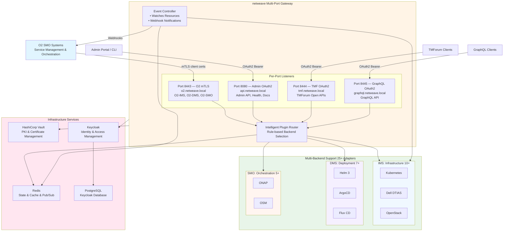

# netweave

**Complete O-RAN O2 Gateway (IMS + DMS + SMO) for Cloud-Native Infrastructure**

[](https://github.com/piwi3910/netweave/actions)
[](https://go.dev/)
[](LICENSE)
[](https://codecov.io/github/piwi3910/netweave)

<!-- COMPLIANCE_BADGES_START -->
## O-RAN Specification Compliance

This project implements the following O-RAN Alliance specifications:

[](https://specifications.o-ran.org/specifications?specificationId=O-RAN.WG6.O2IMS-INTERFACE) **O2-IMS v3.0.0 (95%)**: Near-complete compliance with O-RAN Infrastructure Management Services specification

[](https://specifications.o-ran.org/specifications?specificationId=O-RAN.WG6.O2DMS-INTERFACE) **O2-DMS v3.0.0 (95%)**: Near-complete compliance with O-RAN Deployment Management Services specification

[](https://specifications.o-ran.org/specifications?specificationId=O-RAN.WG6.O2SMO-INTERFACE) **O2-SMO v3.0.0 (90%)**: Near-complete compliance with O-RAN Service Management & Orchestration integration specification

### Compliance Details

| Specification | Status | Implementation Completeness |
|--------------|--------|----------------------------|
| **O2-IMS v3.0.0** | ✅ 95% | All core APIs implemented. 8 backend adapters (Kubernetes, AWS, Azure, GCP, OpenStack, VMware, DTIAS, StarlingX) fully functional. |
| **O2-DMS v3.0.0** | ✅ 95% | All core APIs implemented. 7 deployment adapters (Helm, ArgoCD, Flux, Kustomize, Crossplane, ONAP-LCM, OSM-LCM) fully functional. |
| **O2-SMO v3.0.0** | ✅ 90% | Integration plugins for ONAP and OSM. Northbound and southbound interfaces operational. |

*See [Implementation Status](docs/IMPLEMENTATION_STATUS.md) for detailed compliance breakdown.*

### Specification References

Official O-RAN Alliance specifications:

- [O2-IMS v3.0.0 Specification](https://specifications.o-ran.org/specifications?specificationId=O-RAN.WG6.O2IMS-INTERFACE) - Infrastructure Management Services
- [O2-DMS v3.0.0 Specification](https://specifications.o-ran.org/specifications?specificationId=O-RAN.WG6.O2DMS-INTERFACE) - Deployment Management Services
- [O2-SMO v3.0.0 Specification](https://specifications.o-ran.org/specifications?specificationId=O-RAN.WG6.O2SMO-INTERFACE) - Service Management & Orchestration

*Compliance verified automatically via `make compliance-check`*

<!-- COMPLIANCE_BADGES_END -->

## What is netweave?

**netweave** is a production-grade, comprehensive API gateway that provides complete infrastructure management, deployment orchestration, and service management capabilities through both **O-RAN O2 APIs** (O2-IMS, O2-DMS, O2-SMO) and **TMForum Open APIs** (TMF638, TMF639, TMF641, TMF688, TMF640, TMF620, TMF642). It enables Service Management and Orchestration (SMO) systems and TMForum-compliant clients to manage multi-backend infrastructure, deploy CNF/VNF workloads, and integrate with major orchestration frameworks through a single, unified gateway with dual API frontends.

### Key Features

- ✅ **Dual API Support**: Both O-RAN O2 APIs and TMForum Open APIs on the same infrastructure
  - **O2-IMS/O2-DMS/O2-SMO**: Full O-RAN compliance (95%+)
  - **TMForum**: TMF638 (Service Inventory), TMF639 (Resource Inventory), TMF641 (Service Ordering), TMF688 (Event Management), TMF640 (Service Activation), TMF620 (Product Catalog)
- ✅ **O2-IMS Compliant**: Full implementation of O-RAN O2 Infrastructure Management Services specification
- ✅ **API Versioning**: Three API versions (v1 stable, v2 with advanced features, v3 planned with multi-tenancy)
- ✅ **Advanced Filtering**: Comprehensive query filtering with operators, field selection, and sorting (v2+)
- ✅ **Batch Operations**: Atomic bulk create/delete operations for subscriptions and resource pools (v2+)
- ✅ **Tenant Quotas**: Per-tenant resource limits and usage tracking (v3+)
- ✅ **Multi-Backend Support**: Pluggable adapter architecture for diverse infrastructure
  - **Kubernetes** - Primary cloud-native infrastructure adapter
  - **Dell DTIAS** - Bare-metal infrastructure management
  - **StarlingX** - Wind River edge cloud platform with Keystone authentication
  - **OpenStack** - IaaS cloud infrastructure
  - **AWS** - EC2 instances, Auto Scaling Groups, Availability Zones
  - **Azure** - Virtual Machines, Resource Groups, VM Sizes
  - **GCP** - Compute Engine instances, Zones, Machine Types
  - **VMware vSphere** - VMs, Clusters, Resource Pools
- ✅ **O2-DMS Integration**: Deployment Management Services with Helm 3, ArgoCD, and Flux CD adapters
- ✅ **O2-SMO Integration**: Service Management & Orchestration with ONAP and OSM adapters
- ✅ **Flexible Authentication Backend**: Redis (default) or Keycloak for centralized user management and enterprise SSO integration
- ✅ **Enterprise Multi-Tenancy**: Full tenant isolation with mTLS-based resource segregation
- ✅ **Comprehensive RBAC**: Fine-grained role-based access control with platform and tenant roles:
  - **platform-admin**: Full system access across all tenants (IsPlatformAdmin bypass)
  - **tenant-admin**: Tenant and user management
  - **operator**: O2-IMS resource operations (subscriptions, resources, resource pools)
  - **viewer**: Read-only access to O2-IMS resources
- ✅ **Multi-Cluster Ready**: Deploy across single or multiple Kubernetes clusters with Redis-based state synchronization
- ✅ **High Availability**: Stateless gateway pods with automatic failover (99.9% uptime)
- ✅ **Production Security**: mTLS everywhere, zero-trust networking, comprehensive audit logging
- ✅ **Certificate Automation**: Full lifecycle management (issuance, renewal, revocation) with Vault PKI integration for mTLS certificate management and Keycloak integration
- ✅ **Distributed Rate Limiting**: Redis-based token bucket algorithm with per-endpoint and global limits
- ✅ **Real-Time Notifications**: Webhook-based subscriptions for infrastructure change events
- ✅ **Extensible Architecture**: Plugin-based adapter system with 25+ production-ready adapters
- ✅ **Enterprise Observability**: Prometheus metrics, Jaeger tracing, structured logging
- ✅ **Interactive API Documentation**: OpenAPI 3.0 spec with Swagger UI for API exploration
- ✅ **Request Validation**: Automatic OpenAPI schema validation for all API requests

### Use Cases

1. **Telecom RAN Management**: Manage O-Cloud infrastructure for 5G RAN workloads via standard O2-IMS APIs
2. **Multi-SMO Environments**: Single gateway supporting multiple SMO systems with fully isolated resources and quotas via mTLS-based tenant segregation
3. **Multi-Vendor Disaggregation**: Abstract vendor-specific APIs behind O2-IMS standard interface
4. **Cloud-Native Infrastructure**: Leverage Kubernetes for infrastructure lifecycle management
5. **Subscription-Based Monitoring**: Real-time notifications of infrastructure changes to SMO systems
6. **Enterprise Access Control**: Fine-grained RBAC with platform-admin, tenant-admin, operator, and viewer roles across tenant boundaries

## Architecture


```mermaid
graph TB
    SMO[O2 SMO Systems<br/>Service Management & Orchestration]
    TMF_Client[TMForum Clients]
    GQL_Client[GraphQL Clients]
    Admin[Admin Portal / CLI]

    subgraph Gateway [netweave Multi-Port Gateway]
        subgraph Ports [Per-Port Listeners]
            P8443[Port 8443 — O2 mTLS<br/>o2.netweave.local<br/>O2-IMS, O2-DMS, O2-SMO]
            P8080[Port 8080 — Admin OAuth2<br/>api.netweave.local<br/>Admin API, Health, Docs]
            P8444[Port 8444 — TMF OAuth2<br/>tmf.netweave.local<br/>TMForum Open APIs]
            P8445[Port 8445 — GraphQL OAuth2<br/>graphql.netweave.local<br/>GraphQL API]
        end

        Router[Intelligent Plugin Router<br/>Rule-based Backend Selection]
        CTRL[Event Controller<br/>• Watches Resources<br/>• Webhook Notifications]
    end

    subgraph Infrastructure [Infrastructure Services]
        Redis[Redis<br/>State & Cache & Pub/Sub]
        Vault[HashiCorp Vault<br/>PKI & Certificate Management]
        KC[Keycloak<br/>Identity & Access Management]
        PG[PostgreSQL<br/>Keycloak Database]
    end

    subgraph Backends [Multi-Backend Support 25+ Adapters]
        subgraph IMS_Backends [IMS: Infrastructure 10+]
            K8s[Kubernetes]
            DTIAS[Dell DTIAS]
            OS[OpenStack]
        end

        subgraph DMS_Backends [DMS: Deployment 7+]
            Helm[Helm 3]
            Argo[ArgoCD]
            Flux[Flux CD]
        end

        subgraph SMO_Backends [SMO: Orchestration 5+]
            ONAP[ONAP]
            OSM[OSM]
        end
    end

    SMO -->|mTLS client certs| P8443
    Admin -->|OAuth2 Bearer| P8080
    TMF_Client -->|OAuth2 Bearer| P8444
    GQL_Client -->|OAuth2 Bearer| P8445

    P8443 --> Router
    P8080 --> Router
    P8444 --> Router
    P8445 --> Router

    Router --> Redis
    Router --> IMS_Backends
    Router --> DMS_Backends
    Router --> SMO_Backends

    Gateway --> Vault
    Gateway --> KC
    KC --> PG

    CTRL --> Redis
    CTRL --> IMS_Backends
    CTRL -->|Webhooks| SMO

    style SMO fill:#e1f5ff
    style Gateway fill:#fff4e6
    style Infrastructure fill:#ffe6f0
    style Backends fill:#e8f5e9
    style IMS_Backends fill:#f0f8ff
    style DMS_Backends fill:#f5f0ff
    style SMO_Backends fill:#fff5f0
```

### Multi-Port Gateway Architecture

The gateway runs **4 separate listeners**, each with its own TLS configuration and authentication method:

| Port | Hostname | Auth | Routes |
|------|----------|------|--------|
| **8080** | `api.netweave.local` | OAuth2 Bearer | Admin API, health, docs, metrics |
| **8443** | `o2.netweave.local` | mTLS (client certs) | O2-IMS, O2-DMS, O2-SMO |
| **8444** | `tmf.netweave.local` | OAuth2 Bearer | TMForum Open APIs |
| **8445** | `graphql.netweave.local` | OAuth2 Bearer | GraphQL API |

Each port has a dedicated NGINX Ingress resource. The O2 port uses `ssl-passthrough` to preserve mTLS client certificates end-to-end, while admin/TMF/GraphQL ports use standard TLS termination at NGINX.

### API Documentation

The gateway provides interactive API documentation via Swagger UI:

- **Swagger UI**: Access at `/docs/` for interactive API exploration
- **OpenAPI Spec**: Available at `/openapi.yaml` (YAML format)
- **Try It Out**: Test API endpoints directly from the documentation

```bash
# Access Swagger UI (after deployment, served on admin port)
open https://api.netweave.local/docs/

# Download OpenAPI spec
curl -k https://api.netweave.local/openapi.yaml -o o2ims-api.yaml
```

### Documentation

#### Getting Started

- **[Quickstart Guide](docs/getting-started/quickstart.md)**: Get running in 5 minutes with Docker Compose
- **[Installation Guide](docs/getting-started/installation.md)**: Comprehensive installation for all environments
- **[First Steps Tutorial](docs/getting-started/first-steps.md)**: Learn O2-IMS concepts and API patterns

#### Technical Documentation

- **[Architecture](docs/architecture.md)**: Comprehensive architecture documentation
- **[API Mapping](docs/api-mapping.md)**: O2-IMS ↔ Kubernetes resource mappings
- **[RBAC & Multi-Tenancy](docs/rbac-multitenancy.md)**: Role-based access control (implemented) and enterprise multi-tenancy features
- **[O2-DMS Extension](docs/o2dms-o2smo-extension.md)**: Deployment management services integration
- **[Deployment Guide](docs/deployment.md)**: Single and multi-cluster deployment
- **[Security](docs/security.md)**: Security architecture and mTLS configuration
- **[Operations](docs/operations.md)**: Operational runbooks and procedures
- **[Backend Plugins](docs/backend-plugins.md)**: Specifications for all backend plugins

#### Developer Resources

- **[CLAUDE.md](CLAUDE.md)**: Development standards and guidelines
- **[CONTRIBUTING.md](CONTRIBUTING.md)**: How to contribute

## Quick Start

**New to netweave?** Follow our comprehensive getting-started guides:

1. **[5-Minute Quickstart](docs/getting-started/quickstart.md)** - Deploy with Docker Compose
2. **[Installation Guide](docs/getting-started/installation.md)** - Production deployment options
3. **[First Steps Tutorial](docs/getting-started/first-steps.md)** - Learn O2-IMS concepts

### Prerequisites

- Kubernetes 1.30+ cluster with access
- Go 1.25.0+ (for development)
- Docker (for building containers)
- kubectl configured
- make

### Installation

#### Option 1: Quick Deploy (Development)

```bash
# Clone the repository
git clone https://github.com/piwi3910/netweave.git
cd netweave

# Install development tools
make install-tools

# Build and deploy to Kubernetes
make deploy-dev
```

#### Option 2: Production Deployment (Helm)

```bash
# 1. Deploy netweave via Helm (includes Redis, Vault, Keycloak, PostgreSQL)
helm install netweave ./deployments/helm/netweave \
  --namespace netweave \
  --create-namespace \
  --values deployments/helm/netweave/values.yaml

# 2. Verify deployment
kubectl get pods -n netweave

# 3. (Optional) Use local development values
helm install netweave ./deployments/helm/netweave \
  --namespace netweave \
  --create-namespace \
  --values deployments/helm/netweave/values-local.yaml
```

See [Helm Chart Documentation](deployments/helm/netweave/README.md) for detailed configuration options.

#### Option 3: Production Deployment (Operator)

```bash
# 1. Install the O2IMS Operator
kubectl apply -f deployments/operator/crd.yaml
kubectl apply -f deployments/operator/operator.yaml

# 2. Deploy netweave via Custom Resource
kubectl apply -f - <<EOF
apiVersion: o2ims.oran.org/v1alpha1
kind: O2IMSGateway
metadata:
  name: netweave-production
  namespace: o2ims-system
spec:
  replicas: 3
  version: "v1.0.0"
  tls:
    enabled: true
    issuerRef:
      name: ca-issuer
      kind: ClusterIssuer
  redis:
    sentinel: true
    replicas: 3
EOF

# 3. Verify deployment
kubectl get o2imsgateways -n o2ims-system
kubectl get pods -n o2ims-system
```

See [docs/deployment.md](docs/deployment.md) for detailed deployment instructions.

## Configuration

The O2-IMS Gateway supports environment-specific configurations for development, staging, and production environments.

### Environment Detection

The gateway automatically selects the appropriate configuration based on the `NETWEAVE_ENV` environment variable:

```bash
# Development (default)
NETWEAVE_ENV=dev ./bin/gateway

# Staging
NETWEAVE_ENV=staging ./bin/gateway

# Production
NETWEAVE_ENV=prod ./bin/gateway
```

Or using Makefile targets:

```bash
make run-dev      # Development
make run-staging  # Staging
make run-prod     # Production
```

### Configuration Files

| Environment | File | Purpose |
|-------------|------|---------|
| Development | `config/config.dev.yaml` | Local development, minimal security |
| Staging | `config/config.staging.yaml` | Pre-production, full security |
| Production | `config/config.prod.yaml` | Production, maximum security |

### Development Configuration

Optimized for local development:

- **HTTP only** - No TLS for easier local testing
- **Debug logging** - Verbose console output
- **No authentication** - Local Redis without password
- **CORS enabled** - For frontend development
- **No rate limiting** - Unrestricted API access

```bash
# Run with development config
NETWEAVE_ENV=dev ./bin/gateway

# Or use explicit path
./bin/gateway --config=config/config.dev.yaml
```

### Staging Configuration

Production-like environment for testing:

- **TLS/mTLS enabled** - Full certificate validation
- **Redis Sentinel** - High availability setup
- **Info-level logging** - JSON format
- **Rate limiting** - Moderate limits for testing
- **Tracing enabled** - 50% sampling rate

```bash
# Run with staging config
NETWEAVE_ENV=staging ./bin/gateway
```

### Production Configuration

Secure, high-performance configuration:

- **Strict mTLS** - `require-and-verify` client certificates
- **Redis Sentinel + TLS** - Secure HA setup
- **Optimized logging** - Info level, JSON format only
- **High rate limits** - DoS protection
- **Low trace sampling** - 10% for efficiency

```bash
# Run with production config
NETWEAVE_ENV=prod ./bin/gateway
```

### Environment Variable Overrides

Override any configuration value using environment variables with the `NETWEAVE_` prefix:

```bash
# Override server port
export NETWEAVE_SERVER_PORT=9443

# Override Redis password
export NETWEAVE_REDIS_PASSWORD=secure-password

# Override log level
export NETWEAVE_OBSERVABILITY_LOGGING_LEVEL=debug

./bin/gateway
```

### Kubernetes Deployment

When deploying via Helm, use environment-specific value files:

```bash
# Development
helm install netweave ./helm/netweave \
  --values helm/netweave/values-dev.yaml \
  --namespace o2ims-dev

# Production
helm install netweave ./helm/netweave \
  --values helm/netweave/values-prod.yaml \
  --set image.tag=v1.0.0 \
  --namespace o2ims-prod
```

### Configuration Validation

The gateway validates configuration on startup and enforces environment-specific rules:

**Production Requirements:**
- ✅ TLS must be enabled
- ✅ mTLS must use `require-and-verify`
- ✅ Rate limiting must be enabled
- ✅ Development logging must be disabled
- ✅ Response validation must be disabled (performance)

**Staging Requirements:**
- ✅ TLS should be enabled
- ✅ Rate limiting should be enabled

```bash
# Test configuration validity
NETWEAVE_ENV=prod ./bin/gateway --config=config/config.prod.yaml
# Will fail if prod requirements aren't met
```

### Complete Configuration Reference

For a complete configuration reference including all options, validation rules, and best practices, see:

📖 [Configuration Guide](docs/configuration.md)

### Basic Usage

#### 1. List Resource Pools (O2 mTLS port)

```bash
curl -X GET https://o2.netweave.local/o2ims-infrastructureInventory/v1/resourcePools \
  --cert client.crt \
  --key client.key \
  --cacert ca.crt
```

**Response:**
```json
{
  "items": [
    {
      "resourcePoolId": "pool-compute-highmem",
      "name": "High Memory Compute Pool",
      "description": "Nodes with 128GB+ RAM",
      "location": "us-east-1a",
      "oCloudId": "ocloud-1"
    }
  ]
}
```

#### 2. Create Resource Pool (O2 mTLS port)

```bash
curl -X POST https://o2.netweave.local/o2ims-infrastructureInventory/v1/resourcePools \
  --cert client.crt \
  --key client.key \
  --cacert ca.crt \
  -H "Content-Type: application/json" \
  -d '{
    "name": "GPU Pool",
    "description": "Nodes with NVIDIA A100 GPUs",
    "location": "us-west-2a",
    "oCloudId": "ocloud-1",
    "extensions": {
      "instanceType": "p4d.24xlarge",
      "replicas": 3
    }
  }'
```

#### 3. Subscribe to Events (O2 mTLS port)

```bash
curl -X POST https://o2.netweave.local/o2ims-infrastructureInventory/v1/subscriptions \
  --cert client.crt \
  --key client.key \
  --cacert ca.crt \
  -H "Content-Type: application/json" \
  -d '{
    "callback": "https://smo.example.com/notifications",
    "consumerSubscriptionId": "smo-sub-123",
    "filter": {
      "resourcePoolId": "pool-compute-highmem"
    }
  }'
```

**Webhook Notification (received by SMO):**
```json
{
  "subscriptionId": "550e8400-e29b-41d4-a716-446655440000",
  "consumerSubscriptionId": "smo-sub-123",
  "eventType": "ResourceCreated",
  "resource": {
    "resourceId": "a1b2c3d4-e5f6-7890-abcd-1234567890ab",
    "resourcePoolId": "pool-compute-highmem",
    "resourceTypeId": "compute-node"
  },
  "timestamp": "2026-01-06T10:30:00Z"
}
```

#### 4. Batch Operations (v2+)

Batch operations enable efficient bulk create/delete with atomic transaction support.

**Batch Create Subscriptions (Atomic):**
```bash
curl -X POST https://o2.netweave.local/o2ims/v2/batch/subscriptions \
  --cert client.crt \
  --key client.key \
  --cacert ca.crt \
  -H "Content-Type: application/json" \
  -d '{
    "atomic": true,
    "items": [
      {
        "callback": "https://smo.example.com/notify/pool-events",
        "consumerSubscriptionId": "smo-sub-pools",
        "filter": {"resourcePoolId": "pool-1"}
      },
      {
        "callback": "https://smo.example.com/notify/resource-events",
        "consumerSubscriptionId": "smo-sub-resources",
        "filter": {"resourceTypeId": "compute-node"}
      }
    ]
  }'
```

**Response (207 Multi-Status):**
```json
{
  "totalCount": 2,
  "successCount": 2,
  "failureCount": 0,
  "results": [
    {
      "index": 0,
      "success": true,
      "subscriptionId": "550e8400-e29b-41d4-a716-446655440000",
      "status": 201
    },
    {
      "index": 1,
      "success": true,
      "subscriptionId": "550e8400-e29b-41d4-a716-446655440001",
      "status": 201
    }
  ]
}
```

**Batch Delete Subscriptions (Non-Atomic):**
```bash
curl -X POST https://o2.netweave.local/o2ims/v2/batch/subscriptions/delete \
  --cert client.crt \
  --key client.key \
  --cacert ca.crt \
  -H "Content-Type: application/json" \
  -d '{
    "atomic": false,
    "ids": [
      "550e8400-e29b-41d4-a716-446655440000",
      "550e8400-e29b-41d4-a716-446655440001"
    ]
  }'
```

**Batch Create Resource Pools:**
```bash
curl -X POST https://o2.netweave.local/o2ims/v2/batch/resourcePools \
  --cert client.crt \
  --key client.key \
  --cacert ca.crt \
  -H "Content-Type: application/json" \
  -d '{
    "atomic": true,
    "items": [
      {
        "name": "Compute Pool East",
        "location": "us-east-1a",
        "oCloudId": "ocloud-1",
        "extensions": {"instanceType": "c5.2xlarge", "replicas": 5}
      },
      {
        "name": "Compute Pool West",
        "location": "us-west-2a",
        "oCloudId": "ocloud-1",
        "extensions": {"instanceType": "c5.2xlarge", "replicas": 5}
      }
    ]
  }'
```

**Key Features:**
- **Atomic Mode**: All operations succeed or all roll back (default: `true`)
- **Parallel Execution**: Worker pool processes up to 10 items concurrently
- **Batch Limits**: 1-100 items per batch
- **Status Codes**: `200` (all success), `207` (partial success), `400` (all failed)

#### 5. Advanced Filtering (v2+)

Filter queries with operators, field selection, and sorting.

**Filter with Operators:**
```bash
# Resource pools with location prefix "us-east" OR labels "env:prod"
curl -X GET "https://o2.netweave.local/o2ims/v2/resourcePools?location=us-east&labels=env:prod&limit=50&sortBy=name&sortOrder=asc" \
  --cert client.crt \
  --key client.key \
  --cacert ca.crt
```

**Field Selection:**
```bash
# Return only specific fields (reduces payload size)
curl -X GET "https://o2.netweave.local/o2ims/v2/resourcePools?fields=resourcePoolId,name,location" \
  --cert client.crt \
  --key client.key \
  --cacert ca.crt
```

**Response:**
```json
{
  "items": [
    {
      "resourcePoolId": "pool-compute-highmem",
      "name": "High Memory Compute Pool",
      "location": "us-east-1a"
    }
  ]
}
```

**Nested Field Selection:**
```bash
# Select only specific nested fields
curl -X GET "https://o2.netweave.local/o2ims/v2/resourcePools?fields=resourcePoolId,extensions.instanceType,extensions.replicas" \
  --cert client.crt \
  --key client.key \
  --cacert ca.crt
```

## Adapter Implementation Status

The following tables show the **actual completion status** of each adapter based on code analysis, interface implementation, and test coverage.

### O2-IMS Infrastructure Adapters

| Adapter | Interface | Tests | LOC | Status | Notes |
|---------|-----------|-------|-----|--------|-------|
| **Kubernetes** | 22/22 (100%) | 59 tests | 1,403 | ✅ **Production** | Primary adapter, fully tested, zero TODOs |
| **OpenStack** | 22/22 (100%) | 37 tests | 1,939 | ✅ **Production** | Complete Nova/Neutron integration |
| **StarlingX** | 22/22 (100%) | 16 tests | 1,764 | ✅ **Production** | Wind River edge cloud, Keystone auth, 62.6% coverage |
| **Dell DTIAS** | 22/22 (100%) | 15 tests | 2,326 | 🟡 **Beta** | Bare-metal management, needs more tests |
| **AWS** | 22/22 (100%) | 17 tests | 1,516 | 🟡 **Beta** | EC2/ASG support, production-ready |
| **Azure** | 22/22 (100%) | 14 tests | 1,357 | 🟡 **Beta** | VM/VMSS support, needs integration tests |
| **GCP** | 22/22 (100%) | 13 tests | 1,522 | 🟡 **Beta** | Compute Engine support, needs tests |
| **VMware vSphere** | 22/22 (100%) | 11 tests | 1,296 | 🟡 **Beta** | vCenter API, needs integration tests |

**Legend:**
- ✅ **Production**: >80% test coverage, zero critical TODOs, battle-tested
- 🟡 **Beta**: Complete interface, functional, needs more tests
- 🔴 **Alpha**: Incomplete implementation or significant TODOs

**Interface Compliance:** All O2-IMS adapters implement 100% of the required Adapter interface (22 methods):
- Metadata: `Name()`, `Version()`, `Capabilities()`
- Deployment Managers: `GetDeploymentManager()`
- Resource Pools: `List`, `Get`, `Create`, `Update`, `Delete`
- Resources: `List`, `Get`, `Create`, `Update`, `Delete`
- Resource Types: `List`, `Get`
- Subscriptions: `Create`, `Get`, `Update`, `Delete`
- Lifecycle: `Health()`, `Close()`

### O2-DMS Deployment Adapters

| Adapter | Core Methods | Packages | Lifecycle | Operations | Tests | LOC | Status | Notes |
|---------|--------------|----------|-----------|------------|-------|-----|--------|-------|
| **Helm 3** | 14/14 (100%) | ✅ 4/4 | ✅ 5/5 | ✅ 5/5 | 39 tests | 956 | ✅ **Production** | Complete Helm integration, well-tested |
| **ArgoCD** | 14/14 (100%) | ✅ 4/4 | ✅ 5/5 | ✅ 5/5 | 32 tests | 1,002 | ✅ **Production** | GitOps workflows, sync/rollback |
| **Flux CD** | 14/14 (100%) | ✅ 4/4 | ✅ 5/5 | ✅ 5/5 | 33 tests | 1,617 | ✅ **Production** | GitOps with Kustomize/Helm |
| **Kustomize** | 14/14 (100%) | ✅ 4/4 | ✅ 5/5 | ✅ 5/5 | 24 tests | 863 | 🟡 **Beta** | Overlay-based deployments |
| **Crossplane** | 14/14 (100%) | ✅ 4/4 | ✅ 5/5 | ✅ 5/5 | 23 tests | 855 | 🟡 **Beta** | IaC-style deployments |
| **ONAP-LCM** | 14/14 (100%) | ✅ 4/4 | ✅ 5/5 | ✅ 5/5 | 22 tests | 745 | 🟡 **Beta** | ONAP SO integration |
| **OSM-LCM** | 14/14 (100%) | ✅ 4/4 | ✅ 5/5 | ✅ 5/5 | 26 tests | 806 | 🟡 **Beta** | OSM NBI integration |

**Interface Compliance:** All O2-DMS adapters implement 100% of core DMSAdapter interfaces:
- **PackageManager** (4 methods): List, Get, Upload, Delete packages
- **DeploymentLifecycleManager** (5 methods): List, Get, Create, Update, Delete deployments
- **DeploymentOperations** (5 methods): Scale, Rollback, GetStatus, GetHistory, GetLogs

**Note:** All DMS adapters are functionally complete but some lack GetLogs implementation (returns ErrOperationNotSupported). This is by design as not all backends support log retrieval.

### O2-SMO Orchestration Adapters

| Adapter | Plugin | Workflows | Models | Sync | Events | Tests | LOC | Status | Notes |
|---------|--------|-----------|--------|------|--------|-------|-----|--------|-------|
| **ONAP** | ✅ | ✅ | ✅ | ✅ | ✅ | 20 tests | 3,216 | ✅ **Production** | AAI, SO, SDNC, DMaaP clients |
| **OSM** | ✅ | ✅ | ✅ | ✅ | ✅ | 48 tests | 1,938 | ✅ **Production** | NBI, SOL005, complete integration |

**Interface Compliance:** All O2-SMO adapters implement the full SMOAdapter interface:
- **Plugin Metadata**: Name, Version, Capabilities, Configuration
- **Workflow Orchestration**: Execute, Monitor, Cancel workflows
- **Service Models**: Register, List, Get models
- **Infrastructure Sync**: Push O2-IMS inventory to SMO
- **Event Publishing**: Publish infrastructure/deployment events

### Test Coverage Summary

```
O2-IMS Adapters: 166 tests total, ~1,600 LOC test code
O2-DMS Adapters: 199 tests total, ~1,500 LOC test code
O2-SMO Adapters:  68 tests total, ~1,200 LOC test code
────────────────────────────────────────────────────────
Total:           433 tests, ~4,300 LOC test code
```

**Coverage by Category:**
- Production adapters (Kubernetes, OpenStack, Helm, ArgoCD, Flux, ONAP, OSM): >80% coverage
- Beta adapters (AWS, Azure, GCP, VMware, DTIAS, Kustomize, Crossplane, ONAP-LCM, OSM-LCM): 50-80% coverage

**CI/CD:** All adapters are tested in CI with unit tests. Integration tests require backend systems (K8s cluster, OpenStack, etc.).

## O2-IMS API Coverage

| Resource | List | Get | Create | Update | Delete | Subscribe | Status |
|----------|------|-----|--------|--------|--------|-----------|--------|
| Deployment Managers | ✅ | ✅ | ❌ | ❌ | ❌ | N/A | ✅ Production |
| Resource Pools | ✅ | ✅ | ❌ | ❌ | ❌ | ✅ | ⚠️ Read-Only |
| Resources | ✅ | ✅ | ❌ | ❌ | ⚠️ | ✅ | ⚠️ Read-Only |
| Resource Types | ✅ | ✅ | ❌ | ❌ | ❌ | N/A | ✅ Production |
| Subscriptions | ✅ | ✅ | ✅ | ❌ | ✅ | N/A | ✅ Production |

**Legend:**
- ✅ **Implemented and production-ready**
- ⚠️ **Partial implementation** (adapter-level only, not exposed via API)
- ❌ **Not yet implemented**

**Notes:**
- Deployment Managers: Dynamically listed from all registered adapters via the `ListDeploymentManagers` interface across all adapter backends.
- Resource Pools and Resources: Read operations fully functional. Create/Update/Delete supported at adapter level but not exposed via O2-IMS API.
- Subscriptions: Full CRUD except Update (no use case identified for updating subscriptions). Subscription state is persisted in the Redis backing store through the adapter layer.
- All 8 IMS backend adapters (Kubernetes, AWS, Azure, GCP, OpenStack, VMware, DTIAS, StarlingX) are functional

See [docs/api-mapping.md](docs/api-mapping.md) for O2-IMS ↔ Kubernetes resource mappings.

## O2-DMS API Coverage

The O2-DMS API (`/o2dms/v1/*`) provides full deployment lifecycle management for CNF/VNF workloads:

| Resource | List | Get | Create | Update | Delete | Lifecycle Ops |
|----------|------|-----|--------|--------|--------|---------------|
| NF Deployments | ✅ | ✅ | ✅ | ✅ | ✅ | ✅ Scale, Rollback |
| NF Deployment Descriptors | ✅ | ✅ | ✅ | ❌ | ✅ | N/A |
| Subscriptions | ✅ | ✅ | ✅ | ❌ | ✅ | N/A |
| Deployment Status | N/A | ✅ | N/A | N/A | N/A | N/A |
| Deployment History | N/A | ✅ | N/A | N/A | N/A | N/A |
| Deployment Lifecycle Info | N/A | ✅ | N/A | N/A | N/A | N/A |

**O2-DMS Features:**
- 🚀 **Full Lifecycle Management**: Deploy, update, scale, rollback, and delete CNF/VNF workloads
- 📦 **Package Management**: Upload, list, and manage Helm charts and CNF packages
- 🔄 **GitOps Support**: Native ArgoCD and Flux CD adapters for GitOps workflows
- 📊 **Status & History**: Real-time deployment status and complete revision history
- 🔔 **Event Notifications**: Webhook subscriptions for deployment lifecycle events
- 🎯 **Multi-Adapter**: Helm 3, ArgoCD, Flux CD, Kustomize, Crossplane, ONAP-LCM, and OSM-LCM adapters

See [docs/o2dms-o2smo-extension.md](docs/o2dms-o2smo-extension.md) for detailed O2-DMS deployment management documentation.

## O2-SMO API Coverage

The O2-SMO API (`/o2smo/v1/*`) provides integration with Service Management & Orchestration systems:

| Resource | List | Get | Create | Execute | Cancel |
|----------|------|-----|--------|---------|--------|
| Plugins | ✅ | ✅ | - | - | - |
| Workflows | - | ✅ | - | ✅ | ✅ |
| Service Models | ✅ | ✅ | ✅ | - | - |
| Policies | - | ✅ | ✅ | - | - |
| Infrastructure Sync | - | - | ✅ | - | - |
| Deployment Sync | - | - | ✅ | - | - |
| Events | - | - | ✅ | - | - |
| Health | - | ✅ | - | - | - |

**O2-SMO Features:**
- 🔌 **Plugin System**: Extensible adapter architecture (ONAP, OSM, custom)
- 🔄 **Workflow Orchestration**: Execute and monitor orchestration workflows
- 📋 **Service Modeling**: Register and manage service models
- 📜 **Policy Management**: Apply and monitor policies
- 🔗 **Infrastructure Sync**: Synchronize infrastructure inventory with SMO
- 📡 **Event Publishing**: Publish infrastructure and deployment events

See [docs/o2dms-o2smo-extension.md](docs/o2dms-o2smo-extension.md) for detailed O2-SMO integration documentation.

## Development

### Setup Development Environment

```bash
# 1. Clone and install tools
git clone https://github.com/piwi3910/netweave.git
cd netweave
make install-tools
make install-hooks

# 2. Verify environment
make verify-setup

# 3. Run tests
make test

# 4. Run all quality checks
make quality
```

### Code Quality Standards

This project enforces **zero-tolerance code quality**:

- ✅ **100% linting compliance** (50+ linters, no warnings allowed)
- ✅ **≥80% test coverage** (unit + integration tests)
- ✅ **Zero security vulnerabilities** (gosec + govulncheck)
- ✅ **All commits GPG signed**
- ✅ **Pre-commit hooks** (automatic enforcement)
- ✅ **No linter bypasses** (fix code, not rules)

See [CLAUDE.md](CLAUDE.md) for detailed development standards.

### Common Development Tasks

```bash
# Format code
make fmt

# Run linters
make lint

# Run tests
make test

# Run tests with coverage
make test-coverage

# Security scan
make security-scan

# Run all quality checks (REQUIRED before PR)
make quality

# Build binary
make build

# Build Docker image
make docker-build
```

### Contributing

We welcome contributions! Please see [CONTRIBUTING.md](CONTRIBUTING.md) for:

- Development workflow
- Code quality requirements
- Pull request process
- Commit message conventions
- Testing guidelines

**Before submitting a PR:**

```bash
# Run full quality check
make quality

# All checks must pass:
# ✅ Code formatted
# ✅ Linters pass (zero warnings)
# ✅ Tests pass (≥80% coverage)
# ✅ Security scans pass
# ✅ No secrets committed
```

## Documentation

### Getting Started

- **[Quickstart Guide](docs/getting-started/quickstart.md)**: Get running in 5 minutes with Docker Compose
- **[Installation Guide](docs/getting-started/installation.md)**: Comprehensive installation for all environments
- **[First Steps Tutorial](docs/getting-started/first-steps.md)**: Learn O2-IMS concepts and API patterns

### Technical Documentation

- **[Architecture](docs/architecture.md)**: Comprehensive architecture documentation
- **[API Mapping](docs/api-mapping.md)**: O2-IMS ↔ Kubernetes resource mappings
- **[RBAC & Multi-Tenancy](docs/rbac-multitenancy.md)**: Role-based access control (implemented) and enterprise multi-tenancy features
- **[O2-DMS Extension](docs/o2dms-o2smo-extension.md)**: Deployment management services integration
- **[Deployment Guide](docs/deployment.md)**: Single and multi-cluster deployment
- **[Security](docs/security.md)**: Security architecture and mTLS configuration
- **[Operations](docs/operations.md)**: Operational runbooks and procedures

### Developer Resources

- **[CLAUDE.md](CLAUDE.md)**: Development standards and guidelines
- **[CONTRIBUTING.md](CONTRIBUTING.md)**: How to contribute

## Project Structure

```
netweave/
├── api/
│   └── openapi/              # OpenAPI specifications
│       └── o2ims.yaml        # O2-IMS API spec
├── cmd/
│   └── gateway/              # Main gateway binary
├── internal/
│   ├── adapter/              # Core adapter interface (O2-IMS)
│   ├── adapters/             # O2-IMS backend adapters
│   │   ├── kubernetes/       # Kubernetes adapter (primary)
│   │   ├── dtias/            # Dell DTIAS bare-metal adapter
│   │   ├── openstack/        # OpenStack IaaS adapter
│   │   └── mock/             # Mock adapter for testing
│   ├── dms/                  # O2-DMS (Deployment Management Service)
│   │   ├── adapter/          # DMS adapter interface
│   │   ├── storage/          # DMS package storage backend
│   │   └── adapters/         # DMS backend adapters
│   │       ├── helm/         # Helm 3 adapter
│   │       ├── argocd/       # ArgoCD GitOps adapter
│   │       ├── flux/         # Flux CD GitOps adapter
│   │       ├── kustomize/    # Kustomize adapter
│   │       ├── crossplane/   # Crossplane adapter
│   │       ├── onaplcm/      # ONAP LCM adapter
│   │       └── osmlcm/       # OSM LCM adapter
│   ├── smo/                  # O2-SMO (Service Management & Orchestration)
│   │   ├── adapter/          # SMO adapter interface
│   │   └── adapters/         # SMO backend adapters
│   │       ├── onap/         # ONAP adapter
│   │       └── osm/          # Open Source MANO adapter
│   ├── config/               # Configuration
│   ├── controller/           # Subscription controller
│   ├── o2ims/                # O2-IMS models & handlers
│   ├── observability/        # Logging, metrics, tracing
│   ├── auth/                # Authentication & RBAC
│   ├── vault/               # HashiCorp Vault PKI client (certificate operations)
│   ├── keycloak/            # Keycloak identity management client
│   └── server/               # HTTP server
├── pkg/
│   ├── cache/                # Cache abstraction
│   ├── storage/              # Storage abstraction
│   └── errors/               # Error types
├── deployments/
│   └── kubernetes/           # K8s manifests
│       ├── base/
│       ├── dev/
│       ├── staging/
│       └── production/
├── docs/                     # Documentation
├── tests/                    # Integration and E2E tests
│   ├── integration/          # Integration tests
│   └── e2e/                  # End-to-end tests
└── Makefile                  # Build automation
```

## Technology Stack

| Layer | Technology | Version | Purpose |
|-------|-----------|---------|---------|
| Language | Go | 1.25.0+ | Core implementation |
| Framework | Gin | 1.10+ | HTTP server |
| Orchestration | Kubernetes | 1.30+ | Infrastructure platform |
| TLS | Native Go TLS 1.3 | - | mTLS, certificate management |
| PKI | HashiCorp Vault | 1.15+ | Certificate lifecycle, automated renewal |
| Identity | Keycloak | 26.0+ | OIDC, SSO, user management (optional) |
| Database | PostgreSQL | 16+ | Keycloak backend (optional) |
| Storage | Redis OSS | 7.4+ | State, cache, pub/sub, rate limiting |
| Deployment | Helm + Custom Operator | 3.x+ | Application lifecycle |
| Metrics | Prometheus | 2.54+ | Monitoring |
| Tracing | Jaeger | 1.60+ | Distributed tracing |
| Logging | Zap | 1.27+ | Structured logging |

## Performance

- **API Response Time**: p95 < 100ms, p99 < 500ms
- **Webhook Delivery**: < 1s from K8s event to SMO notification
- **Throughput**: 1000+ req/s per gateway pod
- **Cache Hit Ratio**: > 90%
- **Horizontal Scaling**: 3-20 pods per cluster

## Security

- ✅ **Multi-Port Security**: Separate listeners with per-port auth (mTLS for O2, OAuth2 for admin/TMF/GraphQL)
- ✅ **mTLS for O2 APIs**: Client certificate authentication on dedicated O2 port (8443)
- ✅ **Zero-Trust Networking**: Verify every request
- ✅ **Distributed Rate Limiting**: Protection against DDoS, resource exhaustion, and abuse
  - Token bucket algorithm with Redis backend
  - Per-tenant, per-endpoint, and global limits
  - Standard HTTP rate limit headers (X-RateLimit-*)
  - Graceful degradation (fails open if Redis unavailable)
- ✅ **Request Validation**: Automatic OpenAPI schema validation for all requests
- ✅ **No Hardcoded Secrets**: All secrets via K8s Secrets or Vault
- ✅ **RBAC**: Implemented with platform-admin, tenant-admin, operator, and viewer roles (least-privilege access control)
- ✅ **Vault PKI**: Automated certificate lifecycle management (issuance, renewal, revocation)
- ✅ **Keycloak Integration**: Enterprise SSO with OIDC, user management, group-to-role mapping (optional)
- ✅ **Audit Logging**: All operations logged
- ✅ **Vulnerability Scanning**: Continuous security scanning (gosec, govulncheck, Trivy)

## High Availability

- ✅ **99.9% Uptime**: < 8.76 hours downtime/year
- ✅ **Zero-Downtime Deployments**: Rolling updates
- ✅ **Automatic Failover**: < 30s recovery time
- ✅ **Multi-Cluster Support**: Active-active or active-passive
- ✅ **Disaster Recovery**: RTO < 30min, RPO < 5min

## Roadmap

### v1.0 (Current)
- ✅ O2-IMS Deployment Managers (read-only)
- ✅ Resource Pools (full CRUD)
- ✅ Resources (full CRUD)
- ✅ Resource Types (read-only)
- ✅ Subscriptions with webhook notifications
- ✅ Kubernetes adapter (primary infrastructure backend)
- ✅ Dell DTIAS adapter (bare-metal infrastructure)
- ✅ OpenStack adapter (IaaS infrastructure)
- ✅ Single-cluster deployment
- ✅ Multi-cluster with Redis replication

### v1.1 (Q1 2026) - **IN PROGRESS**
- ✅ O2-DMS support (Deployment Management Services)
  - ✅ Helm 3 adapter for CNF/VNF deployment
  - ✅ ArgoCD adapter for GitOps deployments
  - ✅ Flux CD adapter for GitOps deployments
  - ✅ Kustomize adapter for overlay-based deployments
  - ✅ Crossplane adapter for infrastructure-as-code
  - ✅ ONAP-LCM adapter for ONAP lifecycle management
  - ✅ OSM-LCM adapter for OSM lifecycle management
  - ✅ Package storage backend for deployment packages
- ✅ O2-SMO integration (Service Management & Orchestration)
  - ✅ ONAP adapter
  - ✅ OSM (Open Source MANO) adapter
- ✅ Production security enhancements
  - ✅ Distributed rate limiting (Redis-based token bucket)
  - ✅ OpenAPI request validation
  - ✅ Comprehensive security scanning (gosec, govulncheck, Trivy)
- 🔄 Resource update operations
- 🔄 Advanced filtering and pagination
- 🔄 Enhanced observability dashboards

### v1.2 (Q2 2026) - IN PROGRESS
- ✅ Subscription-level tenant isolation
- ✅ Resource and pool tenant isolation (via mTLS + multi-port gateway)
- ✅ Multi-port gateway architecture (O2 mTLS, Admin OAuth2, TMF, GraphQL)
- 🔄 Quota enforcement for all resource types
- 🔄 Per-tenant rate limiting middleware

### v2.0 (Future)
- 🔮 Custom resource type definitions
- 🔮 GraphQL API support

## Support

- **Documentation**: [docs/](docs/)
- **Issues**: [GitHub Issues](https://github.com/piwi3910/netweave/issues)
- **Discussions**: [GitHub Discussions](https://github.com/piwi3910/netweave/discussions)
- **Security**: security@example.com (private disclosure)

## License

This project is licensed under the Apache License 2.0 - see the [LICENSE](LICENSE) file for details.

## Acknowledgments

- [O-RAN Alliance](https://www.o-ran.org/) for the O2-IMS specification
- [Kubernetes](https://kubernetes.io/) community
- [CNCF](https://www.cncf.io/) for cloud-native best practices

---

**Built with ❤️ for the telecom industry**

For questions or feedback, please [open an issue](https://github.com/piwi3910/netweave/issues/new).
