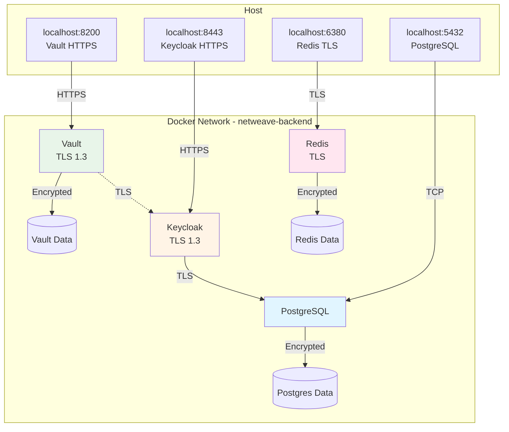

# NetWeave Docker Compose Deployment

Secure, production-ready Docker Compose setup for local development and testing.

## Security Features

### Enabled by Default

- ✅ **TLS 1.3** for all services (Vault, Keycloak, Redis)
- ✅ **Secret management** via Docker secrets (no hardcoded passwords)
- ✅ **Network isolation** with dedicated backend network
- ✅ **Read-only containers** where possible
- ✅ **No new privileges** security option
- ✅ **Minimal port exposure** (localhost only)
- ✅ **Latest secure versions** (Vault 1.18.3, Keycloak 26.0, Postgres 16, Redis 7.4)

### Architecture



## Quick Start

### 1. Generate TLS Certificates

```bash
cd deployments/docker
./generate-certs.sh
```

This generates:
- Self-signed CA certificate
- TLS certificates for Vault, Keycloak, Redis
- Secure random passwords for all services

**Output:**
```
deployments/docker/
├── ca.crt                    # Root CA (add to system trust)
├── ca-key.pem               # CA private key (keep secure!)
├── vault/tls/
│   ├── tls.crt
│   ├── tls.key
│   └── ca.crt
├── keycloak/tls/
│   ├── tls.crt
│   ├── tls.key
│   └── ca.crt
├── redis/tls/
│   ├── tls.crt
│   ├── tls.key
│   └── ca.crt
└── secrets/
    ├── postgres_password.txt
    ├── keycloak_admin_password.txt
    └── redis_password.txt
```

### 2. Start Services

```bash
# Start all services
docker compose up -d

# Check status
docker compose ps

# View logs
docker compose logs -f
```

### 3. Initialize Vault

Vault must be initialized on first run:

```bash
# Wait for Vault to be ready
docker compose logs vault-init -f

# Check initialization
cat vault/init/keys.json
```

**⚠️ CRITICAL: Save Vault Keys Immediately**

The initialization creates `vault/init/keys.json` with:
- 5 unseal keys (threshold: 3 required)
- Root token for admin access

**You MUST:**
1. Copy `keys.json` to a secure location immediately
2. Delete `keys.json` after securing the keys
3. Never commit keys to git (already in .gitignore)

```bash
# Example: Secure the keys
cp vault/init/keys.json ~/secure-vault-keys.json
chmod 400 ~/secure-vault-keys.json
rm vault/init/keys.json
```

### 4. Access Services

| Service | URL | Credentials |
|---------|-----|-------------|
| **Vault UI** | https://localhost:8200 | Token: see `keys.json` |
| **Keycloak Admin** | https://localhost:8443/admin | User: `admin`<br/>Password: see `secrets/keycloak_admin_password.txt` |
| **PostgreSQL** | localhost:5432 | User: `keycloak`<br/>Password: see `secrets/postgres_password.txt` |
| **Redis** | localhost:6380 (TLS) | Password: see `secrets/redis_password.txt` |

### 5. Trust CA Certificate (Optional)

For browsers and tools to trust the self-signed certificates:

**macOS:**
```bash
sudo security add-trusted-cert -d -r trustRoot -k /Library/Keychains/System.keychain ca.crt
```

**Linux:**
```bash
sudo cp ca.crt /usr/local/share/ca-certificates/netweave-ca.crt
sudo update-ca-certificates
```

**Windows:**
```powershell
certutil -addstore -f "ROOT" ca.crt
```

## Service Configuration

### Vault

**Configuration:** `vault/config/vault.hcl`

- Storage: File-based (persistent volume)
- Listener: TLS 1.3 on port 8200
- UI: Enabled
- Telemetry: Prometheus metrics

**PKI Setup:**
- Root CA: 10-year validity
- Intermediate CA: 5-year validity
- Certificate roles: `netweave-client`, `netweave-server`
- Policies: `gateway`, `keycloak`

**Managing Vault:**
```bash
# Login with root token
export VAULT_ADDR=https://localhost:8200
export VAULT_SKIP_VERIFY=true
vault login

# Check status
vault status

# Issue certificate
vault write pki_int/issue/netweave-client \
  common_name="test.netweave.local" \
  ttl=24h
```

### Keycloak

**Configuration:** Environment variables in `docker-compose.yml`

- Database: PostgreSQL 16
- Realms: Auto-imported from `realm-import/`
- TLS: Certificate-based HTTPS
- Admin Console: https://localhost:8443/admin

**First-time setup:**
```bash
# Get admin password
cat secrets/keycloak_admin_password.txt

# Login to admin console
open https://localhost:8443/admin
```

### PostgreSQL

**Configuration:** Default PostgreSQL settings

- Database: `keycloak`
- User: `keycloak`
- Password: Managed via Docker secret
- Data: Persistent volume

**Connecting:**
```bash
# Get password
PGPASSWORD=$(cat secrets/postgres_password.txt)

# Connect
psql -h localhost -U keycloak -d keycloak
```

### Redis

**Configuration:** TLS-enabled Redis

- Port: 6380 (TLS only, port 6379 disabled)
- Auth: Password required
- TLS: Certificate verification enabled
- Data: Persistent volume

**Connecting:**
```bash
# Get password
REDIS_PASSWORD=$(cat secrets/redis_password.txt)

# Connect with TLS
redis-cli --tls \
  --cacert redis/tls/ca.crt \
  --cert redis/tls/tls.crt \
  --key redis/tls/tls.key \
  -a "$REDIS_PASSWORD"
```

## Security Best Practices

### Development vs Production

This setup is **secure for local development**. For production:

❌ **Do NOT use in production as-is:**
- Self-signed certificates (use proper CA certificates)
- File-based Vault storage (use Raft or cloud storage)
- Shamir unsealing (use auto-unseal with KMS)
- Docker secrets from files (use proper secrets management)

✅ **Production requirements:**
- Valid TLS certificates from trusted CA
- Vault HA with cloud storage backend
- Auto-unseal with AWS KMS / Azure Key Vault / GCP Cloud KMS
- External secrets manager (HashiCorp Vault, AWS Secrets Manager)
- Network policies and firewall rules
- Regular backups and disaster recovery plan

### Secret Management

**Secrets stored securely:**
- PostgreSQL password: Docker secret
- Keycloak admin password: Docker secret
- Redis password: Environment variable (consider moving to Docker secret)
- Vault unseal keys: File-based (must be secured externally)

**Never commit to git:**
- `secrets/` directory
- `vault/init/keys.json`
- `ca-key.pem`
- Any `.key` files

### Network Security

**Port exposure:**
- All services bind to `127.0.0.1` only (not accessible from network)
- Services communicate via internal Docker network
- No external access without port forwarding

**To expose services externally:**
```yaml
ports:
  - "8200:8200"  # WARNING: Exposes to all interfaces
```

## Maintenance

### Backup

```bash
# Backup Vault data
docker compose exec vault vault operator raft snapshot save backup.snap
docker compose cp vault:/vault/data/backup.snap ./backups/

# Backup PostgreSQL
docker compose exec postgres pg_dump -U keycloak keycloak > backup.sql

# Backup Redis
docker compose exec redis redis-cli --tls --cacert /tls/ca.crt save
docker compose cp redis:/data/dump.rdb ./backups/
```

### Restart Services

```bash
# Restart all
docker compose restart

# Restart specific service
docker compose restart vault

# Rebuild after config changes
docker compose up -d --build
```

### Unseal Vault After Restart

Vault must be unsealed after every restart:

```bash
# Check seal status
docker compose exec vault vault status

# Unseal (requires 3 keys)
docker compose exec vault vault operator unseal <key1>
docker compose exec vault vault operator unseal <key2>
docker compose exec vault vault operator unseal <key3>
```

### View Logs

```bash
# All services
docker compose logs -f

# Specific service
docker compose logs -f vault
docker compose logs -f keycloak

# Last 100 lines
docker compose logs --tail=100 vault
```

### Clean Up

```bash
# Stop all services
docker compose down

# Remove volumes (WARNING: deletes all data)
docker compose down -v

# Remove certificates and secrets
rm -rf vault/tls keycloak/tls redis/tls secrets/ ca.* vault/init/
```

## Troubleshooting

### Vault: "connection refused"

**Issue:** Vault not accessible via HTTPS

**Fix:**
```bash
# Check Vault container logs
docker compose logs vault

# Verify TLS certificates exist
ls -la vault/tls/

# Regenerate certificates if needed
./generate-certs.sh
docker compose restart vault
```

### Keycloak: "Database not ready"

**Issue:** PostgreSQL not healthy

**Fix:**
```bash
# Check PostgreSQL health
docker compose ps postgres

# View PostgreSQL logs
docker compose logs postgres

# Restart PostgreSQL
docker compose restart postgres
```

### Redis: "NOAUTH Authentication required"

**Issue:** Missing Redis password

**Fix:**
```bash
# Check password file exists
cat secrets/redis_password.txt

# Set environment variable
export REDIS_PASSWORD=$(cat secrets/redis_password.txt)

# Restart Redis
docker compose restart redis
```

### Certificate Trust Issues

**Issue:** Browser shows "unsafe connection"

**Fix:**
1. Add `ca.crt` to system trust store (see "Trust CA Certificate" above)
2. Or use `curl -k` / browser exception for testing
3. For production, use certificates from trusted CA

## Development Workflow

### 1. Start Environment

```bash
cd deployments/docker
./generate-certs.sh  # First time only
docker compose up -d
docker compose logs -f vault-init  # Wait for Vault initialization
```

### 2. Configure Services

```bash
# Login to Vault
export VAULT_ADDR=https://localhost:8200
export VAULT_SKIP_VERIFY=true
vault login  # Use root token from keys.json

# Configure Keycloak
open https://localhost:8443/admin
```

### 3. Develop and Test

```bash
# Run gateway with Docker Compose services
go run cmd/gateway/main.go

# Connect to services
export VAULT_ADDR=https://localhost:8200
export KEYCLOAK_URL=https://localhost:8443
export REDIS_ADDR=localhost:6380
```

### 4. Stop Environment

```bash
docker compose down
```

## Differences from Kubernetes Deployment

| Feature | Docker Compose | Kubernetes |
|---------|----------------|------------|
| **Vault HA** | Single instance | 3-pod StatefulSet with Raft |
| **Storage** | File-based | Raft consensus storage |
| **Unsealing** | Manual | Automated via init job |
| **Scaling** | Manual | Automatic with HPA |
| **Networking** | Bridge network | Service mesh ready |
| **Secrets** | Docker secrets | Kubernetes secrets + KMS |
| **Certificates** | Self-signed | Auto-rotation with cert-manager |

## References

- [Vault Documentation](https://developer.hashicorp.com/vault/docs)
- [Keycloak Documentation](https://www.keycloak.org/documentation)
- [Docker Compose Secrets](https://docs.docker.com/compose/use-secrets/)
- [TLS Best Practices](https://wiki.mozilla.org/Security/Server_Side_TLS)
