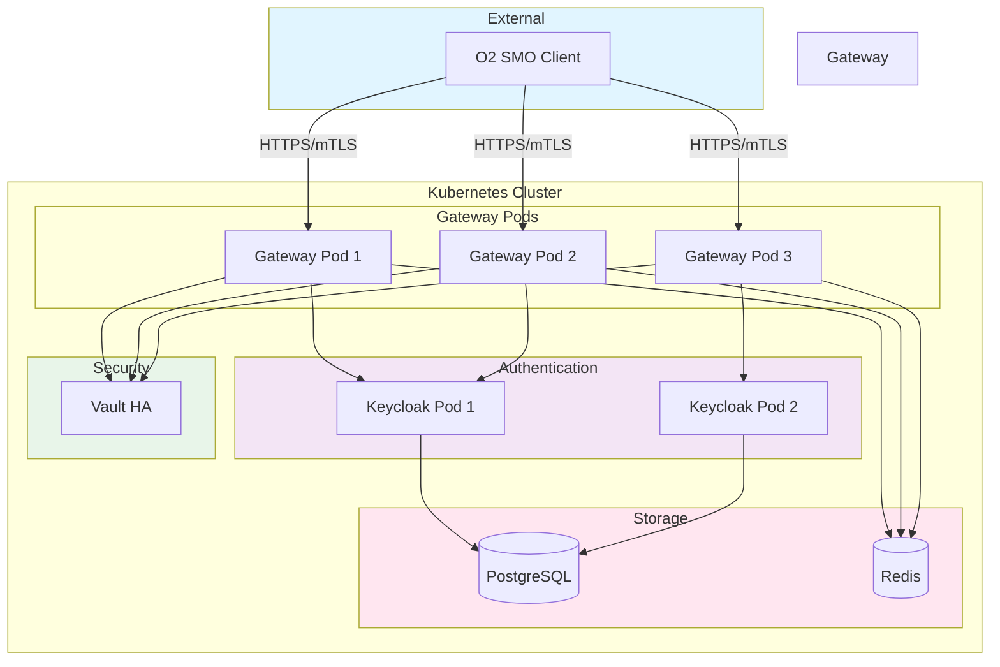

# NetWeave Helm Chart

Production-grade Helm chart for deploying the NetWeave O-RAN O2-IMS Gateway with Keycloak authentication and HashiCorp Vault PKI integration.

## Overview

This chart deploys a complete NetWeave stack including:

- **NetWeave Gateway**: O2-IMS compliant API gateway (3+ replicas with HPA)
- **Keycloak**: Identity and Access Management with OAuth2/OIDC (2 replicas)
- **PostgreSQL**: Database backend for Keycloak (Bitnami chart)
- **Redis**: Session storage and caching (standalone mode)
- **HashiCorp Vault**: PKI engine for mTLS certificates (deployed separately)

## Architecture



## Prerequisites

- Kubernetes 1.28+
- Helm 3.12+
- kubectl configured with cluster access
- HashiCorp Vault deployed (see [Vault deployment guide](../../kubernetes/vault/README.md))
- Storage class for persistent volumes
- (Optional) Ingress controller for external access

## Quick Start

### 1. Create Namespace

```bash
kubectl create namespace netweave
```

### 4. Install Chart

```bash
# With default values (development)
helm install netweave . --namespace netweave

# With custom values (production)
helm install netweave . \
  --namespace netweave \
  --values values-production.yaml
```

### 5. Verify Installation

```bash
# Check pod status
kubectl get pods -n netweave

# Check services
kubectl get svc -n netweave

# Check init jobs completion
kubectl get jobs -n netweave

# View gateway logs
kubectl logs -n netweave -l app.kubernetes.io/component=gateway
```

## Configuration

### Chart Dependencies

The chart automatically manages the following dependencies:

| Dependency | Version | Repository | Purpose |
|-----------|---------|------------|---------|
| postgresql | 15.5.38 | Bitnami | Keycloak database |
| keycloak | 23.0.7 | Bitnami | Identity management |
| redis | 20.5.0 | Bitnami | Session storage |

### Key Configuration Values

#### Gateway Configuration

```yaml
gateway:
  enabled: true
  replicaCount: 3

  image:
    registry: ghcr.io
    repository: piwi3910/netweave
    tag: ""  # Defaults to Chart.AppVersion
    pullPolicy: IfNotPresent

  resources:
    requests:
      cpu: 250m
      memory: 256Mi
    limits:
      cpu: 1000m
      memory: 512Mi

  autoscaling:
    enabled: false
    minReplicas: 3
    maxReplicas: 10
    targetCPUUtilizationPercentage: 70
    targetMemoryUtilizationPercentage: 80

  config:
    logLevel: info

    auth:
      oauth2:
        enabled: true
        clientID: netweave-gateway
        clientSecret: ""  # Set via secret

      mtls:
        enabled: true

    certManager:
      enabled: true
      monitorInterval: 1h
      renewalWindow: 720h  # 30 days
```

#### Keycloak Configuration

```yaml
keycloak:
  enabled: true
  replicaCount: 2

  auth:
    adminUser: admin
    adminPassword: ""  # Generated if empty

  postgresql:
    enabled: false  # Uses main PostgreSQL instance

  externalDatabase:
    host: ""  # Auto-configured
    port: 5432
    user: keycloak
    database: keycloak
```

#### PostgreSQL Configuration

```yaml
postgresql:
  enabled: true

  auth:
    username: keycloak
    password: ""  # Generated if empty
    database: keycloak

  primary:
    persistence:
      enabled: true
      size: 10Gi

  resources:
    requests:
      cpu: 250m
      memory: 256Mi
    limits:
      cpu: 1000m
      memory: 512Mi
```

#### Vault Configuration

```yaml
vault:
  enabled: true
  namespace: vault-system
  deployViaManifests: true  # Deploy using separate manifests
```

**Note**: Vault must be deployed separately using the manifests in `deployments/kubernetes/vault/`. See the [Vault deployment guide](../../kubernetes/vault/README.md).

### Ingress Configuration

```yaml
gateway:
  ingress:
    enabled: true
    className: nginx
    annotations:
      cert-manager.io/cluster-issuer: "letsencrypt-prod"
    hosts:
      - host: netweave.example.com
        paths:
          - path: /
            pathType: Prefix
    tls:
      - secretName: netweave-tls
        hosts:
          - netweave.example.com
```

### Network Security

#### NetworkPolicy

Enable network isolation with Kubernetes NetworkPolicy:

```yaml
networkPolicy:
  enabled: true
  policyTypes:
    - Ingress
    - Egress
```

The NetworkPolicy restricts:
- **Ingress**: Only from ingress controller and within namespace
- **Egress**: Only to DNS, PostgreSQL, Redis, Keycloak, Vault, and Kubernetes API

**Requirements**: CNI plugin with NetworkPolicy support (Calico, Cilium, Weave Net)

### Secrets Management

#### Development (Default)

Secrets are auto-generated and stored in Kubernetes:

```yaml
secrets:
  create: true
```

**Important**: Secrets persist across `helm upgrade` using Helm's `lookup` function. Passwords are only generated on initial installation.

#### Production (External Secrets)

Use External Secrets Operator with Vault:

```yaml
secrets:
  create: false
  externalSecrets:
    enabled: true
    backend: vault
    vaultRole: netweave
```

### Database Security

#### PostgreSQL TLS

Enable TLS for PostgreSQL connections:

```yaml
postgresql:
  primary:
    tls:
      enabled: true
      certificatesSecret: "postgresql-tls"
      certFilename: "tls.crt"
      certKeyFilename: "tls.key"
```

The connection string automatically uses `sslmode=require` when TLS is enabled, or `sslmode=disable` otherwise.

## Installation Scenarios

### Testing with Different Release Names

The chart supports custom release names without hardcoded hostnames:

```bash
# Install with custom name "my-release"
helm install my-release . --namespace netweave

# PostgreSQL hostname automatically becomes: my-release-postgresql
# Keycloak URL automatically becomes: http://my-release-keycloak:80
```

### Development Environment

```bash
helm install netweave . \
  --namespace netweave \
  --set gateway.replicaCount=1 \
  --set keycloak.replicaCount=1 \
  --set postgresql.primary.persistence.size=5Gi
```

### Development Without Vault

For local development without Vault PKI:

```bash
helm install netweave . \
  --namespace netweave \
  --set vault.enabled=false \
  --set gateway.config.certManager.enabled=false \
  --set gateway.config.auth.mtls.enabled=false \
  --set initJobs.vaultPKI.enabled=false
```

**Note**: OAuth2/OIDC authentication via Keycloak still works. Only mTLS and certificate management features are disabled.

### Staging Environment

```bash
helm install netweave . \
  --namespace netweave-staging \
  --values values-staging.yaml
```

### Production Environment

```bash
# 1. Create production values file
cat > values-production.yaml <<EOF
global:
  imageRegistry: "registry.example.com"
  storageClass: "fast-ssd"

gateway:
  replicaCount: 5
  autoscaling:
    enabled: true
    minReplicas: 5
    maxReplicas: 20

  ingress:
    enabled: true
    className: nginx
    annotations:
      cert-manager.io/cluster-issuer: "letsencrypt-prod"
    hosts:
      - host: api.netweave.example.com
        paths:
          - path: /
            pathType: Prefix
    tls:
      - secretName: netweave-tls
        hosts:
          - api.netweave.example.com

postgresql:
  primary:
    persistence:
      size: 50Gi
  resources:
    requests:
      cpu: 1000m
      memory: 2Gi
    limits:
      cpu: 4000m
      memory: 4Gi

keycloak:
  replicaCount: 3
  resources:
    requests:
      cpu: 1000m
      memory: 1Gi
    limits:
      cpu: 4000m
      memory: 2Gi

secrets:
  create: false
  externalSecrets:
    enabled: true
    backend: vault
    vaultRole: netweave

monitoring:
  enabled: true
  serviceMonitor:
    enabled: true
    interval: 30s
    additionalLabels:
      prometheus: kube-prometheus

networkPolicy:
  enabled: true

postgresql:
  primary:
    tls:
      enabled: true
      certificatesSecret: "postgresql-tls"
EOF

# 2. Install with production values
helm install netweave . \
  --namespace netweave \
  --values values-production.yaml \
  --atomic \
  --timeout 10m
```

## Post-Installation

### Access Keycloak Admin Console

```bash
# Port-forward to Keycloak
kubectl port-forward -n netweave svc/netweave-keycloak 8080:80

# Open browser to http://localhost:8080
# Default credentials: admin / <check secret>
kubectl get secret netweave-keycloak -n netweave -o jsonpath='{.data.admin-password}' | base64 -d
```

### Access Gateway API

```bash
# Port-forward to Gateway
kubectl port-forward -n netweave svc/netweave 8081:8080

# Test API endpoint
curl http://localhost:8081/o2ims-infrastructureInventory/v1/
```

### Verify Vault PKI

```bash
# Check Vault pods in vault-system namespace
kubectl get pods -n vault-system

# Verify PKI initialization
kubectl logs -n netweave job/netweave-vault-init
```

### Get Client Credentials

```bash
# Gateway OAuth2 client secret
kubectl get secret netweave-secret -n netweave -o jsonpath='{.data.keycloak-client-secret}' | base64 -d

# Database connection string
kubectl get secret netweave-secret -n netweave -o jsonpath='{.data.database-connection-string}' | base64 -d
```

## Monitoring

### Prometheus Integration

Enable ServiceMonitor for Prometheus Operator:

```yaml
monitoring:
  enabled: true
  serviceMonitor:
    enabled: true
    interval: 30s
    scrapeTimeout: 10s
    # Optional: Add labels for Prometheus selector
    additionalLabels:
      prometheus: kube-prometheus
    # Optional: Relabeling configs
    relabelings: []
    metricRelabelings: []
```

The ServiceMonitor automatically discovers and scrapes metrics from gateway pods on port 9090.

### Available Metrics

Gateway exposes metrics on port 9090:

```bash
kubectl port-forward -n netweave svc/netweave 9090:9090
curl http://localhost:9090/metrics
```

Key metrics:
- `o2ims_subscription_creates_total` - Subscription creation count
- `o2ims_http_requests_total` - HTTP request count
- `o2ims_http_request_duration_seconds` - Request latency
- `o2ims_certificate_renewals_total` - Certificate renewal count

## Upgrading

### Minor Version Upgrade

```bash
helm upgrade netweave . \
  --namespace netweave \
  --reuse-values
```

### Major Version Upgrade

```bash
# 1. Backup current values
helm get values netweave -n netweave > backup-values.yaml

# 2. Review changelog
cat CHANGELOG.md

# 3. Update dependencies
helm dependency update

# 4. Upgrade with new values
helm upgrade netweave . \
  --namespace netweave \
  --values backup-values.yaml \
  --atomic \
  --timeout 10m
```

### Rolling Back

```bash
# View release history
helm history netweave -n netweave

# Rollback to previous version
helm rollback netweave -n netweave

# Rollback to specific revision
helm rollback netweave 2 -n netweave
```

## Uninstallation

```bash
# Delete Helm release
helm uninstall netweave -n netweave

# Delete PVCs (optional, data loss)
kubectl delete pvc -n netweave -l app.kubernetes.io/instance=netweave

# Delete namespace
kubectl delete namespace netweave
```

## Troubleshooting

### Gateway Pods Not Starting

```bash
# Check pod events
kubectl describe pod -n netweave -l app.kubernetes.io/component=gateway

# Check init container logs
kubectl logs -n netweave <pod-name> -c wait-for-keycloak
kubectl logs -n netweave <pod-name> -c wait-for-vault

# Common issues:
# - Keycloak not ready: Check Keycloak pod status
# - Vault not ready: Verify Vault deployment
# - Image pull errors: Check imagePullSecrets
```

### Keycloak Realm Not Imported

```bash
# Check init job logs
kubectl logs -n netweave job/netweave-keycloak-init

# Check realm ConfigMap
kubectl get configmap keycloak-realm-import -n netweave -o yaml

# Verify Keycloak has realm
kubectl exec -n netweave deployment/netweave-keycloak -- \
  /opt/keycloak/bin/kcadm.sh get realms/netweave \
  --server http://localhost:8080 \
  --realm master \
  --user admin \
  --password <admin-password>
```

### Vault PKI Not Initialized

```bash
# Check Vault init job
kubectl logs -n netweave job/netweave-vault-init

# Verify Vault status
kubectl exec -n vault-system vault-0 -- vault status

# Check if PKI is enabled
kubectl exec -n vault-system vault-0 -- vault secrets list
```

### Database Connection Issues

```bash
# Check PostgreSQL pod
kubectl get pods -n netweave -l app.kubernetes.io/name=postgresql

# Test connection from gateway pod
kubectl exec -n netweave deployment/netweave -- \
  sh -c 'apk add postgresql-client && \
  psql "$DATABASE_CONNECTION_STRING" -c "SELECT version();"'

# Check secret
kubectl get secret netweave-secret -n netweave -o yaml
```

### Certificate Issues

```bash
# Check certificate manager logs
kubectl logs -n netweave -l app.kubernetes.io/component=gateway | grep certmanager

# Verify Vault PKI role
kubectl exec -n vault-system vault-0 -- \
  vault read pki_int/roles/netweave-mtls
```

## Security Considerations

### Production Hardening

1. **Change Default Passwords**
   ```yaml
   keycloak:
     auth:
       adminPassword: "<strong-password>"
   postgresql:
     auth:
       password: "<strong-password>"
   ```

2. **Enable TLS**
   ```yaml
   gateway:
     ingress:
       enabled: true
       tls:
         - secretName: netweave-tls
   ```

3. **Enable Network Policies**
   ```yaml
   networkPolicy:
     enabled: true
   ```

4. **Use External Secrets**
   ```yaml
   secrets:
     create: false
     externalSecrets:
       enabled: true
   ```

5. **Regular Updates**
   - Monitor CVE databases
   - Update dependencies quarterly
   - Apply security patches promptly

### RBAC Configuration

The chart creates a ServiceAccount with minimal required permissions:

```yaml
gateway:
  serviceAccount:
    create: true
    annotations:
      eks.amazonaws.com/role-arn: arn:aws:iam::ACCOUNT:role/netweave
```

## Support

- **Issues**: [GitHub Issues](https://github.com/piwi3910/netweave/issues)
- **Documentation**: [Project Docs](../../docs/)
- **Slack**: [#netweave](https://netweave.slack.com)

## License

See [LICENSE](../../../LICENSE) file.

## Maintainers

- Pascal Watteel <pascal@watteel.com>
