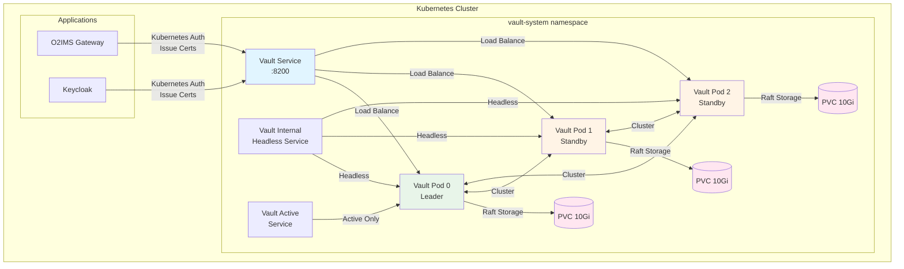
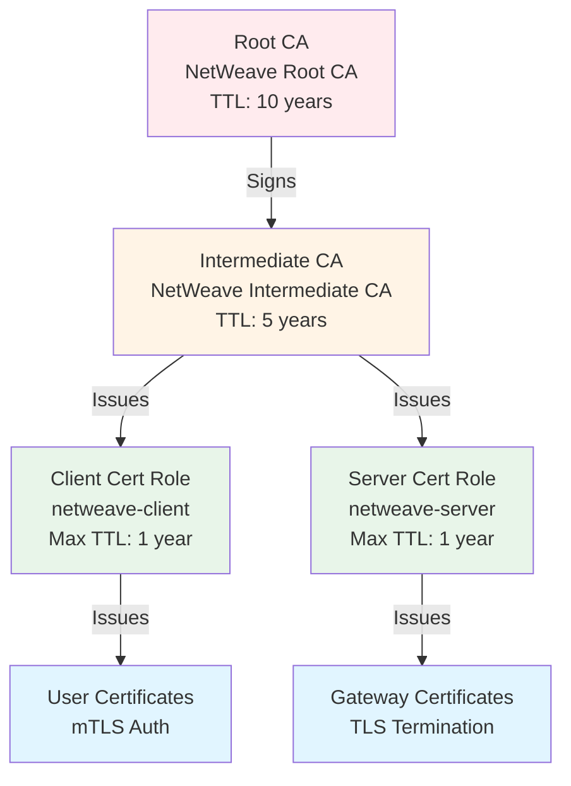

# Vault Deployment for NetWeave Gateway

This directory contains Kubernetes manifests for deploying HashiCorp Vault with PKI secrets engine in high availability mode.

## Architecture



## PKI Hierarchy



## Components

### High Availability (HA) Configuration

- **3 Vault replicas** with pod anti-affinity
- **Raft integrated storage** for consensus and data replication
- **Automatic leader election** for failover
- **Shamir secret sharing** for unsealing (5 keys, threshold 3)

### PKI Configuration

- **Root CA**: 10-year validity, stored in `pki/` path
- **Intermediate CA**: 5-year validity, stored in `pki_int/` path
- **Certificate Roles**:
  - `netweave-client`: For user mTLS authentication (1-year max TTL)
  - `netweave-server`: For gateway TLS termination (1-year max TTL)

### Kubernetes Authentication

- **Gateway Service Account**: Bound to `gateway` policy
- **Keycloak Service Account**: Bound to `keycloak` policy
- **Token TTL**: 24 hours with automatic renewal

## Deployment

### Prerequisites

- Kubernetes cluster 1.24+
- kubectl configured
- Persistent storage provisioner

### Deploy Vault

```bash
# Apply manifests
kubectl apply -k deployments/kubernetes/vault/

# Wait for pods to be running
kubectl wait --for=condition=ready pod -l app.kubernetes.io/name=vault -n vault-system --timeout=300s

# Check status
kubectl get pods -n vault-system
```

### Initialize and Unseal

The `vault-init` job automatically:
1. Initializes Vault
2. Stores unseal keys in Kubernetes secret
3. Unseals all 3 Vault pods
4. Configures PKI hierarchy
5. Creates certificate roles
6. Enables Kubernetes auth

```bash
# Check init job status
kubectl get jobs -n vault-system

# View init logs
kubectl logs job/vault-init -n vault-system

# Get root token (for admin tasks only)
kubectl get secret vault-unseal-keys -n vault-system -o jsonpath='{.data.root-token}' | base64 -d
```

### Verify PKI Setup

```bash
# Port-forward to Vault
kubectl port-forward svc/vault -n vault-system 8200:8200 &

# Set environment
export VAULT_ADDR='http://localhost:8200'
export VAULT_TOKEN=$(kubectl get secret vault-unseal-keys -n vault-system -o jsonpath='{.data.root-token}' | base64 -d)

# Check PKI paths
vault secrets list

# Verify root CA
vault read pki/cert/ca

# Verify intermediate CA
vault read pki_int/cert/ca

# List roles
vault list pki_int/roles

# Test certificate issuance
vault write pki_int/issue/netweave-client \
  common_name="test.netweave.local" \
  ttl=720h
```

## Access Policies

### Gateway Policy

Allows gateway to:
- Read CA certificates
- Issue client and server certificates
- Revoke certificates
- Read CRL
- List and read certificate details

### Keycloak Policy

Allows Keycloak to:
- Issue client certificates
- Read CA certificates

## Security Considerations

### Secure by Default

This deployment is configured with security best practices enabled by default:

1. **TLS 1.3 Enabled**: All Vault API communication uses TLS with minimum version 1.3
2. **Auto-Generated Certificates**: TLS certificates are automatically generated during initialization
3. **Encrypted Storage**: Vault data is encrypted at rest using AES-256-GCM
4. **SSD Storage Class**: Dedicated storage class with Retain policy for data persistence
5. **Pod Security**: Read-only root filesystem, non-root user, dropped capabilities
6. **Network Isolation**: Service accounts with least-privilege policies

### TLS Configuration

**Automatic Certificate Generation:**
- Self-signed CA with 10-year validity
- Server certificates with SANs for all pod and service names
- Certificates stored in `vault-tls` Kubernetes secret
- Automatic certificate rotation can be implemented via CronJob

**Production Recommendations:**
- Replace self-signed certificates with certificates from your organization's PKI
- Use cert-manager for automatic certificate lifecycle management
- Configure proper CA trust chain in client applications

### Storage Requirements

**Performance:**
- **SSD storage required** for Raft consensus performance
- Minimum IOPS: 3000 (AWS gp3, Azure Premium_LRS, GCP pd-ssd)
- Network latency between pods: < 10ms recommended

**Capacity:**
- Default: 10Gi per pod (30Gi total)
- Plan for certificate storage: ~1KB per certificate
- Raft snapshots: ~10-50MB depending on data volume
- Recommended production: 50Gi per pod minimum

### Unseal Key Management

**CRITICAL SECURITY WARNING:**

The init job stores unseal keys and root token in Kubernetes secret `vault-unseal-keys`.
This is **ONLY suitable for development/testing environments**.

**⚠️ For Production, you MUST:**

1. **Extract unseal keys immediately after initialization:**
   ```bash
   kubectl get secret vault-unseal-keys -n vault-system -o jsonpath='{.data.unseal-keys}' | base64 -d > unseal-keys.txt
   kubectl get secret vault-unseal-keys -n vault-system -o jsonpath='{.data.root-token}' | base64 -d > root-token.txt
   ```

2. **Store keys in secure external vault** (NOT in Kubernetes):
   - Hardware Security Module (HSM)
   - Cloud KMS (AWS KMS, Azure Key Vault, GCP Cloud KMS)
   - Enterprise secret management system (HashiCorp Vault, CyberArk)

3. **Delete the Kubernetes secret:**
   ```bash
   kubectl delete secret vault-unseal-keys -n vault-system
   ```

4. **Implement auto-unseal with Cloud KMS:**
   - AWS KMS: `seal "awskms" { ... }`
   - Azure Key Vault: `seal "azurekeyvault" { ... }`
   - GCP Cloud KMS: `seal "gcpckms" { ... }`

5. **Split unseal keys** among multiple trusted operators (Shamir's Secret Sharing)

**Why This Matters:**
- Kubernetes secrets are only base64-encoded (NOT encrypted) by default
- Anyone with cluster admin access can read unseal keys
- Compromised unseal keys = complete access to all Vault data
- Auto-unseal eliminates manual unsealing while improving security

### Additional Production Hardening

1. **Enable Audit Logging**: Configure audit device to track all Vault operations
   ```bash
   vault audit enable file file_path=/vault/logs/audit.log
   ```

2. **Restrict Network Access**: Use NetworkPolicies to limit pod-to-pod communication
3. **Enable Pod Security Standards**: Use restricted PSS to enforce security constraints
4. **Rotate Root Token**: Generate new root token and revoke old one after setup
5. **Enable Encryption at Rest**: Configure etcd encryption in Kubernetes
6. **Implement Backup Strategy**: Regular Raft snapshots to external object storage

### Backup and Disaster Recovery

```bash
# Take snapshot (requires root or sufficient permissions)
vault operator raft snapshot save backup.snap

# Restore snapshot
vault operator raft snapshot restore backup.snap
```

Schedule regular backups using CronJob:
- Daily snapshots
- Store in object storage (S3, GCS, Azure Blob)
- Test restore procedures regularly

## Monitoring

### Health Checks

```bash
# Check overall health
curl http://vault.vault-system.svc.cluster.local:8200/v1/sys/health

# Check seal status
vault status
```

### Metrics

Vault exposes Prometheus metrics at `:9102/metrics`

Key metrics to monitor:
- `vault_core_unsealed`: Seal status (1 = unsealed)
- `vault_core_active`: Leader status (1 = leader)
- `vault_core_leader`: Leader election
- `vault_runtime_alloc_bytes`: Memory usage
- `vault_pki_tidy_*`: PKI tidy operations

### ServiceMonitor Example

```yaml
apiVersion: monitoring.coreos.com/v1
kind: ServiceMonitor
metadata:
  name: vault
  namespace: vault-system
spec:
  selector:
    matchLabels:
      app.kubernetes.io/name: vault
  endpoints:
    - port: prometheus
      path: /v1/sys/metrics
      params:
        format: ['prometheus']
```

## Troubleshooting

### Vault Pod Not Starting

```bash
# Check logs
kubectl logs vault-0 -n vault-system

# Common issues:
# - Insufficient permissions: Check RBAC
# - Storage issues: Check PVC status
# - Config errors: Validate configmap
```

### Vault Sealed After Restart

```bash
# Check seal status
kubectl exec -n vault-system vault-0 -- vault status

# Unseal manually
UNSEAL_KEYS=$(kubectl get secret vault-unseal-keys -n vault-system -o jsonpath='{.data.unseal-keys}' | base64 -d)

echo "$UNSEAL_KEYS" | head -n 3 | while read key; do
  kubectl exec -n vault-system vault-0 -- vault operator unseal $key
done
```

### PKI Issues

```bash
# Verify PKI mount
vault secrets list

# Check issuer
vault read pki_int/issuer/netweave-intermediate

# Verify role configuration
vault read pki_int/roles/netweave-client

# Test certificate generation
vault write -format=json pki_int/issue/netweave-client \
  common_name="debug.netweave.local" \
  ttl=1h
```

### Raft Cluster Issues

```bash
# Check Raft peers
vault operator raft list-peers

# Remove dead peer
vault operator raft remove-peer <node-id>

# Join new peer
vault operator raft join http://vault-0.vault-internal:8200
```

## Maintenance

### Certificate Rotation

Root and intermediate CAs have long TTLs (10 and 5 years). Plan rotation well in advance:

1. Generate new intermediate CA
2. Configure applications to trust both old and new CAs
3. Switch to new CA for issuance
4. Wait for all certificates to expire or be renewed
5. Remove old CA from trust stores

### Tidy Operations

Periodically clean up expired certificates:

```bash
# Manual tidy
vault write pki_int/tidy \
  tidy_cert_store=true \
  tidy_revoked_certs=true \
  safety_buffer=72h

# Check tidy status
vault read pki_int/tidy-status
```

### Upgrading Vault

1. Upgrade one pod at a time
2. Wait for pod to become ready
3. Verify it rejoined the cluster
4. Proceed to next pod

```bash
# Update image in statefulset
kubectl set image statefulset/vault vault=hashicorp/vault:1.16 -n vault-system

# Watch rollout
kubectl rollout status statefulset/vault -n vault-system
```

## References

- [Vault Documentation](https://developer.hashicorp.com/vault/docs)
- [Vault PKI Secrets Engine](https://developer.hashicorp.com/vault/docs/secrets/pki)
- [Vault on Kubernetes](https://developer.hashicorp.com/vault/tutorials/kubernetes)
- [Vault HA with Raft](https://developer.hashicorp.com/vault/docs/configuration/storage/raft)
