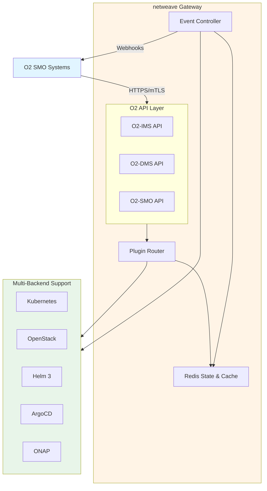

# netweave Documentation

**Complete O-RAN O2 Gateway (IMS + DMS + SMO) for Cloud-Native Infrastructure**

Welcome to the comprehensive documentation for netweave, a production-grade O-RAN O2 Gateway implementing O2-IMS, O2-DMS, and O2-SMO APIs for telecom-grade cloud-native infrastructure management.

## Quick Navigation by Role

### 👥 I'm New to netweave

Start here for a guided introduction:
- **[Quick Start →](getting-started/quickstart.md)** - Get running in 5 minutes
- **[Installation Guide →](getting-started/installation.md)** - Detailed setup instructions
- **[First Steps →](getting-started/first-steps.md)** - Your first API calls and concepts

### 🏗️ I'm an Architect

Understanding system design and trade-offs:
- **[Architecture Overview →](architecture/README.md)** - High-level system design
- **[System Components →](architecture/components.md)** - Gateway, Redis, controllers
- **[Multi-Tenancy →](architecture/multi-tenancy.md)** - Enterprise isolation model
- **[High Availability →](architecture/high-availability.md)** - HA & disaster recovery
- **[Architecture Decisions →](architecture/decisions.md)** - ADRs and trade-offs

### 💻 I'm a Developer

Building integrations and understanding APIs:
- **[API Overview →](api/README.md)** - All APIs at a glance
- **[O2-IMS API →](api/o2ims/README.md)** - Infrastructure management
- **[O2-DMS API →](api/o2dms/README.md)** - Deployment management
- **[O2-SMO API →](api/o2smo/README.md)** - Orchestration integration
- **[Adapters →](adapters/README.md)** - Backend plugin system
- **[Development Guide →](development/README.md)** - Contributing and testing

### 🚀 I'm an Operator

Deploying and operating the gateway:
- **[Deployment Guide →](operations/deployment.md)** - Production deployment
- **[Monitoring →](operations/monitoring.md)** - Metrics, alerts, dashboards
- **[Troubleshooting →](operations/troubleshooting.md)** - Common issues & solutions
- **[Backup & Recovery →](operations/backup-recovery.md)** - DR procedures
- **[Runbooks →](operations/runbooks.md)** - Operational procedures

### 🔒 I'm a Security Engineer

Security architecture and hardening:
- **[Security Overview →](security/README.md)** - Security architecture
- **[TLS/mTLS Setup →](security/tls-mtls.md)** - Certificate management
- **[Authorization →](security/authorization.md)** - RBAC & tenancy
- **[Security Hardening →](security/hardening.md)** - Production checklist
- **[Supply Chain Security →](security/supply-chain.md)** - Build security

## Documentation Structure

### 📚 Core Documentation

#### [Getting Started](getting-started/README.md)
Quick-start guides for new users:
- [Quickstart Guide](getting-started/quickstart.md) - 5-minute setup
- [Installation Guide](getting-started/installation.md) - Detailed installation
- [First Steps](getting-started/first-steps.md) - Basic concepts & first API calls

#### [Architecture](architecture/README.md)
System design and architectural patterns:
- [System Overview](architecture/system-overview.md) - High-level design
- [Components](architecture/components.md) - Gateway, Redis, controllers
- [Data Flow](architecture/data-flow.md) - Request patterns
- [Multi-Tenancy](architecture/multi-tenancy.md) - Enterprise isolation
- [High Availability](architecture/high-availability.md) - HA & DR design
- [Scalability](architecture/scalability.md) - Scaling patterns
- [Decisions](architecture/decisions.md) - Architecture decision records

#### [API Reference](api/README.md)
Complete API documentation with mappings:

**[O2-IMS (Infrastructure Management)](api/o2ims/README.md)**
- [Deployment Managers](api/o2ims/deployment-managers.md) - Cluster management
- [Resource Pools](api/o2ims/resource-pools.md) - Infrastructure pools
- [Resources](api/o2ims/resources.md) - Compute resources
- [Resource Types](api/o2ims/resource-types.md) - Resource capabilities
- [Subscriptions](api/o2ims/subscriptions.md) - Event notifications

**[O2-DMS (Deployment Management)](api/o2dms/README.md)**
- [Deployments](api/o2dms/deployments.md) - CNF/VNF lifecycle
- [Packages](api/o2dms/packages.md) - Helm charts & packages
- [Operations](api/o2dms/operations.md) - Scale, rollback, logs

**[O2-SMO (Service Management & Orchestration)](api/o2smo/README.md)**
- [Plugins](api/o2smo/plugins.md) - SMO integration plugins
- [Workflows](api/o2smo/workflows.md) - Orchestration workflows

**[API Versioning](api/versioning.md)** - Version strategy & migration

#### [Adapters](adapters/README.md)
Backend plugin system (25+ adapters):

**[IMS Adapters (Infrastructure)](adapters/ims/README.md)**
- [Kubernetes Adapter](adapters/ims/kubernetes.md) - Primary infrastructure
- [OpenStack Adapter](adapters/ims/openstack.md) - OpenStack Nova/Neutron
- [Cloud Providers](adapters/ims/cloud-providers.md) - AWS, Azure, GCP
- [Bare Metal](adapters/ims/bare-metal.md) - DTIAS, VMware

**[DMS Adapters (Deployment)](adapters/dms/README.md)**
- [Helm Adapter](adapters/dms/helm.md) - Helm 3 deployments
- [GitOps Adapters](adapters/dms/gitops.md) - ArgoCD, Flux
- [Orchestrators](adapters/dms/orchestrators.md) - ONAP-LCM, OSM-LCM

**[SMO Adapters (Orchestration)](adapters/smo/README.md)**
- [ONAP Integration](adapters/smo/onap.md) - ONAP AAI, SO, DMaaP
- [OSM Integration](adapters/smo/osm.md) - OSM NBI, SOL005

#### [Configuration](configuration/README.md)
Complete configuration reference:
- [Configuration Basics](configuration/basics.md) - Core options
- [Environments](configuration/environments.md) - Dev/staging/prod
- [Security Configuration](configuration/security.md) - TLS, mTLS, auth
- [Adapter Configuration](configuration/adapters.md) - Backend config
- [Complete Reference](configuration/reference.md) - All config options

#### [Security](security/README.md)
Security architecture and hardening:
- [Security Architecture](security/architecture.md) - Threat model & controls
- [TLS/mTLS Setup](security/tls-mtls.md) - Certificate management
- [Authentication](security/authentication.md) - Auth mechanisms
- [Authorization](security/authorization.md) - RBAC & tenancy
- [Security Hardening](security/hardening.md) - Production checklist
- [Webhook Security](security/webhooks.md) - Webhook authentication
- [Supply Chain Security](security/supply-chain.md) - Build & dependency security

#### [Operations](operations/README.md)
Day-2 operations and procedures:
- [Deployment Strategies](operations/deployment.md) - Helm, operator, GitOps
- [Monitoring & Alerting](operations/monitoring.md) - Prometheus, Grafana, Jaeger
- [Troubleshooting](operations/troubleshooting.md) - Common issues & solutions
- [Backup & Recovery](operations/backup-recovery.md) - DR procedures
- [Upgrade Procedures](operations/upgrades.md) - Version upgrades
- [Operational Runbooks](operations/runbooks.md) - Incident response

### 🔧 Development

#### [Development Guide](development/README.md)
Contributing to netweave:
- **[Overview](development/README.md)** - Development overview and quick start (~200 lines)
- **[Development Setup](development/setup.md)** - Detailed environment setup (~300 lines)
- **[Testing Guidelines](development/testing.md)** - Testing philosophy and patterns (~300 lines)
- **[Contributing Guide](development/contributing.md)** - Contribution workflow and standards (~300 lines)
- **[Architecture Decisions](development/decisions.md)** - ADR log with decision templates (~150 lines)

**Use this section when:**
- Setting up local development environment
- Writing and running tests
- Contributing code or documentation
- Understanding past architectural decisions

### 📖 Reference

#### [Reference Documentation](reference/README.md)
Specifications and references:
- **[Overview](reference/README.md)** - Reference materials overview (~100 lines)
- **[O-RAN Compliance](reference/compliance.md)** - Detailed spec compliance status
- **[Glossary](reference/glossary.md)** - O-RAN terms, K8s concepts, acronyms (~300 lines)
- **[Error Code Reference](reference/error-codes.md)** - HTTP codes, app errors, solutions (~200 lines)

**Use this section when:**
- Looking up unfamiliar terms or acronyms
- Troubleshooting error messages
- Verifying O-RAN compliance status
- Understanding technical specifications

## Quick Links

### 🚀 Common Tasks

- **Set up development environment →** [Development Setup](development/setup.md)
- **Write and run tests →** [Testing Guidelines](development/testing.md)
- **Deploy to production →** [Deployment Guide](operations/deployment.md)
- **Configure TLS/mTLS →** [TLS Setup](security/tls-mtls.md)
- **Create subscription →** [Subscriptions API](api/o2ims/subscriptions.md)
- **Add new adapter →** [Adapter Development](adapters/README.md)
- **Troubleshoot issue →** [Troubleshooting](operations/troubleshooting.md) / [Error Codes](reference/error-codes.md)
- **Monitor gateway →** [Monitoring](operations/monitoring.md)
- **Look up term or acronym →** [Glossary](reference/glossary.md)
- **Check O-RAN compliance →** [Compliance Status](reference/compliance.md)

### 📊 Key Specifications

- **[O-RAN O2-IMS v3.0.0](https://specifications.o-ran.org/)** - Infrastructure Management
- **[O-RAN O2-DMS v3.0.0](https://specifications.o-ran.org/)** - Deployment Management
- **[O-RAN O2-SMO v3.0.0](https://specifications.o-ran.org/)** - SMO Integration

### 🔗 External Resources

- **[GitHub Repository](https://github.com/watteel/netweave)** - Source code
- **[GitHub Issues](https://github.com/watteel/netweave/issues)** - Bug reports & features
- **[GitHub Discussions](https://github.com/watteel/netweave/discussions)** - Community support
- **[Contributing Guide](development/contributing.md)** - How to contribute

## About netweave

netweave is a production-grade O-RAN O2 Gateway that provides:

### Key Features

- ✅ **O2-IMS Compliant** - Full O-RAN Infrastructure Management Services
- ✅ **O2-DMS Compliant** - Complete Deployment Management Services
- ✅ **O2-SMO Compliant** - Service Management & Orchestration integration
- ✅ **Multi-Backend Support** - 25+ infrastructure and deployment adapters
- ✅ **Enterprise Multi-Tenancy** - Built-in strict tenant isolation
- ✅ **High Availability** - 99.9% uptime with automatic failover
- ✅ **Production Security** - mTLS everywhere, zero-trust architecture
- ✅ **Real-Time Notifications** - Webhook-based event subscriptions
- ✅ **Comprehensive RBAC** - Fine-grained access control

### Technology Stack

| Component | Technology | Version |
|-----------|-----------|---------|
| Language | Go | 1.25.0+ |
| HTTP Framework | Gin | 1.10+ |
| Storage | Redis OSS (Sentinel) | 7.4+ |
| Orchestration | Kubernetes | 1.30+ |
| Packaging | Helm | 3.x+ |
| Observability | OpenTelemetry, Prometheus | - |
| Security | Native TLS 1.3, mTLS | - |

### Architecture Highlights

## Support

- **Documentation:** You're in the right place!
- **Issues:** [GitHub Issues](https://github.com/watteel/netweave/issues)
- **Discussions:** [GitHub Discussions](https://github.com/watteel/netweave/discussions)
- **Contributing:** [Development Guide](development/README.md)

## License

[Apache License 2.0](../LICENSE)

---

*Built for production telecom infrastructure. Quality is not optional.*
