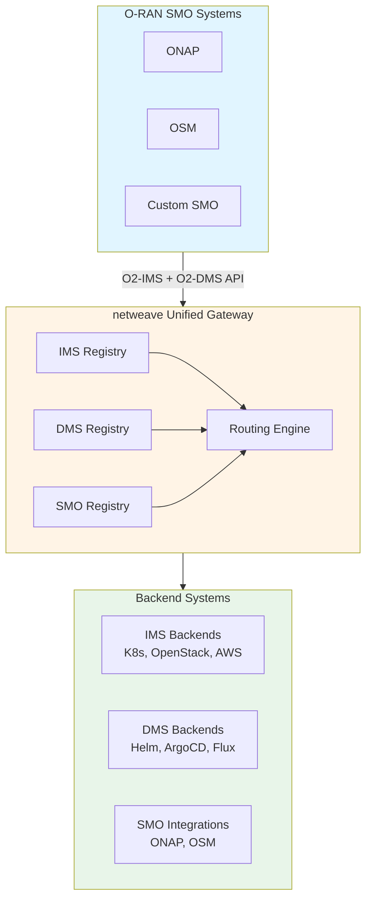

# netweave Adapter Pattern

**Version:** 1.0
**Last Updated:** 2026-01-12

## Overview

netweave implements a comprehensive **plugin architecture** supporting three distinct adapter categories to enable multi-cloud, multi-backend infrastructure and deployment management.

## Adapter Categories

| Category | Purpose | Adapter Count | Examples |
|----------|---------|---------------|----------|
| **O2-IMS** | Infrastructure resource management | 10+ | Kubernetes, OpenStack, AWS, Azure |
| **O2-DMS** | CNF/VNF deployment lifecycle | 7+ | Helm, ArgoCD, Flux, ONAP-LCM |
| **O2-SMO** | SMO integration & orchestration | 5+ | ONAP, OSM, Custom SMO |

## Architecture



## Unified Plugin Interface

All adapters implement a base interface with category-specific extensions:

```go
// internal/plugin/plugin.go

package plugin

import "context"

// Plugin is the base interface all plugins must implement
type Plugin interface {
    // Metadata
    Name() string                    // Unique plugin identifier
    Version() string                 // Plugin version (semver)
    Category() PluginCategory        // IMS, DMS, SMO, Observability
    Capabilities() []Capability      // Supported operations

    // Lifecycle
    Initialize(ctx context.Context, config map[string]interface{}) error
    Health(ctx context.Context) HealthStatus
    Close() error
}

type PluginCategory string

const (
    CategoryIMS           PluginCategory = "ims"
    CategoryDMS           PluginCategory = "dms"
    CategorySMO           PluginCategory = "smo"
    CategoryObservability PluginCategory = "observability"
)

type Capability string

const (
    // IMS Capabilities
    CapResourcePoolManagement Capability = "resource-pool-management"
    CapResourceManagement     Capability = "resource-management"
    CapResourceTypeDiscovery  Capability = "resource-type-discovery"
    CapRealtimeEvents         Capability = "realtime-events"

    // DMS Capabilities
    CapPackageManagement      Capability = "package-management"
    CapDeploymentLifecycle    Capability = "deployment-lifecycle"
    CapRollback               Capability = "rollback"
    CapScaling                Capability = "scaling"
    CapGitOps                 Capability = "gitops"

    // SMO Capabilities
    CapWorkflowOrchestration  Capability = "workflow-orchestration"
    CapServiceModeling        Capability = "service-modeling"
    CapPolicyManagement       Capability = "policy-management"
    CapInventorySync          Capability = "inventory-sync"
)
```

## Plugin Registry & Routing

The registry manages all plugins and routes requests based on configuration:

```go
// internal/plugin/registry.go

type Registry struct {
    mu sync.RWMutex

    // Plugin stores by category
    imsPlugins    map[string]ims.IMSPlugin
    dmsPlugins    map[string]dms.DMSPlugin
    smoPlugins    map[string]smo.SMOPlugin

    // Routing rules
    imsRoutes []IMSRoutingRule
    dmsRoutes []DMSRoutingRule
    smoRoutes []SMORoutingRule

    // Default plugins
    defaultIMS string
    defaultDMS string
    defaultSMO string
}

// RouteIMS determines which IMS plugin to use
func (r *Registry) RouteIMS(resourceType string, filter *ims.Filter) (ims.IMSPlugin, error)

// RouteDMS determines which DMS plugin to use
func (r *Registry) RouteDMS(packageType string, req *dms.DeploymentRequest) (dms.DMSPlugin, error)

// GetSMOPlugin returns SMO plugin by name or default
func (r *Registry) GetSMOPlugin(name string) (smo.SMOPlugin, error)
```

## Configuration Example

```yaml
# config/plugins.yaml

plugins:
  # IMS Plugins
  ims:
    - name: kubernetes
      type: kubernetes
      enabled: true
      default: true
      config:
        kubeconfig: /etc/kubernetes/admin.conf
        ocloudId: ocloud-k8s-1

    - name: openstack-nfv
      type: openstack
      enabled: true
      config:
        authUrl: https://openstack.example.com:5000/v3
        username: admin
        ocloudId: ocloud-openstack-1

  # DMS Plugins
  dms:
    - name: helm-deployer
      type: helm
      enabled: true
      default: true
      config:
        kubeconfig: /etc/kubernetes/admin.conf
        namespace: deployments

    - name: argocd-gitops
      type: argocd
      enabled: true
      config:
        serverUrl: https://argocd.example.com

  # SMO Plugins
  smo:
    - name: onap-integration
      type: onap
      enabled: true
      default: true
      config:
        aaiUrl: https://onap-aai.example.com:8443

# Routing Rules
routing:
  ims:
    default: kubernetes
    rules:
      - name: openstack-nfv-resources
        priority: 100
        plugin: openstack-nfv
        resourceType: "*"
        conditions:
          labels:
            infrastructure.type: openstack

  dms:
    default: helm
    rules:
      - name: gitops-argocd
        priority: 100
        plugin: argocd-gitops
        packageType: git-repo
        conditions:
          gitOps: true
```

## Directory Structure

```
netweave/
├── internal/
│   ├── plugin/
│   │   ├── plugin.go              # Base plugin interface
│   │   ├── registry.go            # Unified plugin registry
│   │   ├── loader.go              # Dynamic plugin loading
│   │   │
│   │   ├── ims/
│   │   │   ├── ims.go             # IMS plugin interface
│   │   │   ├── filter.go          # Filter/query structures
│   │   │   └── models.go          # IMS data models
│   │   │
│   │   ├── dms/
│   │   │   ├── dms.go             # DMS plugin interface
│   │   │   ├── lifecycle.go       # Deployment lifecycle
│   │   │   └── models.go          # DMS data models
│   │   │
│   │   └── smo/
│   │       ├── smo.go             # SMO plugin interface
│   │       ├── inventory.go       # Inventory sync
│   │       ├── workflow.go        # Workflow orchestration
│   │       └── models.go          # SMO data models
│   │
│   └── plugins/
│       ├── ims/                   # IMS adapter implementations
│       ├── dms/                   # DMS adapter implementations
│       └── smo/                   # SMO adapter implementations
```

## Adapter Documentation

Detailed specifications for each adapter category:

### IMS Adapters
- [IMS Adapter Interface](ims/README.md) - Core interface definition
- [Kubernetes Adapter](ims/kubernetes.md) - Kubernetes infrastructure adapter
- [OpenStack Adapter](ims/openstack.md) - OpenStack NFVi adapter
- [Cloud Adapters](ims/cloud.md) - AWS, Azure, GCP adapters
- [Bare-Metal Adapters](ims/bare-metal.md) - DTIAS, VMware adapters

### DMS Adapters
- [DMS Adapter Interface](dms/README.md) - Core interface definition
- [Helm Adapter](dms/helm.md) - Helm chart deployment
- [GitOps Adapters](dms/gitops.md) - ArgoCD, Flux adapters
- [Orchestrator Adapters](dms/orchestrators.md) - ONAP-LCM, OSM-LCM

### SMO Adapters
- [SMO Adapter Interface](smo/README.md) - Core interface definition
- [ONAP Integration](smo/onap.md) - ONAP A&AI, SO, SDNC
- [OSM Integration](smo/osm.md) - OSM NBI, LCM

## Plugin Lifecycle

```go
func InitializePlugins(ctx context.Context, config *Config) (*plugin.Registry, error) {
    registry := plugin.NewRegistry()

    // 1. Load IMS plugins
    for _, pluginCfg := range config.Plugins.IMS {
        if !pluginCfg.Enabled {
            continue
        }
        plugin, err := loadIMSPlugin(pluginCfg)
        if err != nil {
            return nil, fmt.Errorf("failed to load IMS plugin %s: %w", pluginCfg.Name, err)
        }
        if err := plugin.Initialize(ctx, pluginCfg.Config); err != nil {
            return nil, fmt.Errorf("failed to initialize IMS plugin %s: %w", pluginCfg.Name, err)
        }
        registry.RegisterIMS(pluginCfg.Name, plugin, pluginCfg.Default)
    }

    // 2. Load DMS plugins
    for _, pluginCfg := range config.Plugins.DMS {
        // Similar process...
    }

    // 3. Load SMO plugins
    for _, pluginCfg := range config.Plugins.SMO {
        // Similar process...
    }

    // 4. Load routing rules
    if err := registry.LoadRoutingRules(config.Routing); err != nil {
        return nil, fmt.Errorf("failed to load routing rules: %w", err)
    }

    return registry, nil
}
```

## Key Benefits

✅ **Unified Architecture**: Consistent interface across all plugin categories
✅ **Configuration-Driven**: Intelligent request routing based on rules
✅ **Extensible Design**: Easy to add new backends without modifying core code
✅ **Multi-Backend Support**: Support multiple infrastructure and deployment tools
✅ **Production-Grade**: Enterprise-ready plugin lifecycle management

## Next Steps

1. Review adapter specifications for your use case
2. Configure plugins in `config/plugins.yaml`
3. Implement custom adapters if needed (extend base interfaces)
4. Set up routing rules for multi-backend environments
