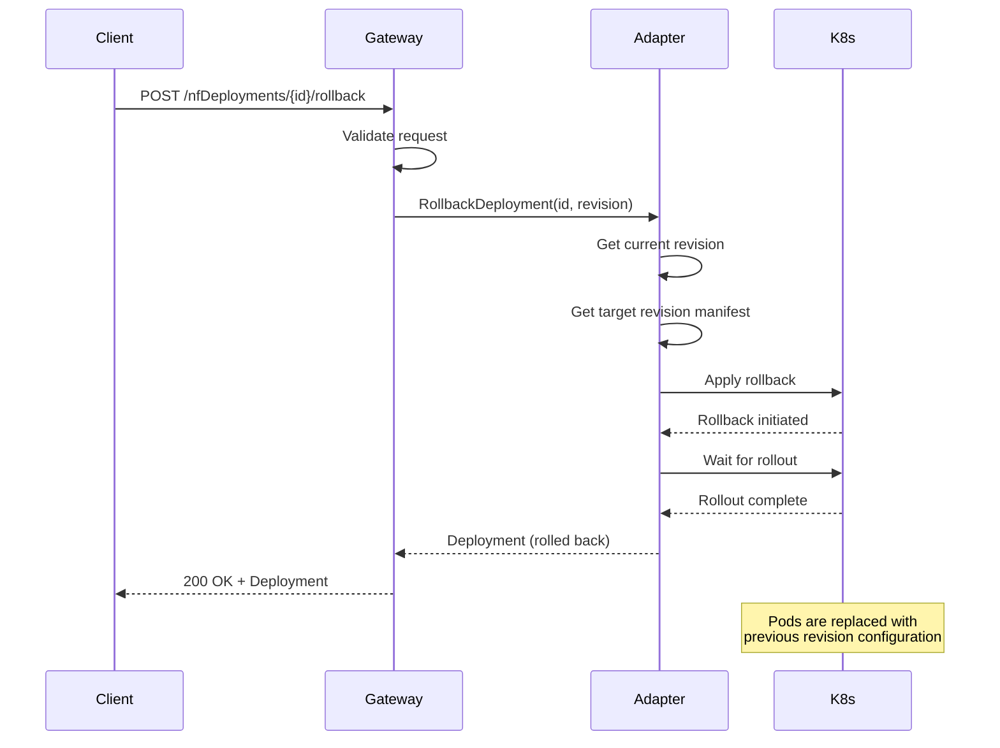

# O2-DMS Lifecycle Operations

**Version:** 1.0
**Last Updated:** 2026-01-14

## Overview

This document describes the deployment lifecycle operations available in the O2-DMS (Deployment Management Services) API. These operations allow you to manage the complete lifecycle of NFDeployments, including scaling, rolling back, and upgrading deployments.

**Supported Operations:**
- ✅ **Scale** - Adjust deployment replica count
- ✅ **Rollback** - Revert to previous deployment revision
- ✅ **Upgrade** - Update deployment with new configuration/version
- ✅ **Status** - Monitor deployment health and progress
- ✅ **History** - View deployment revision history

---

## Table of Contents

1. [Scaling Deployments](#scaling-deployments)
2. [Rolling Back Deployments](#rolling-back-deployments)
3. [Upgrading Deployments](#upgrading-deployments)
4. [Deployment Status](#deployment-status)
5. [Deployment History](#deployment-history)
6. [Advanced Scenarios](#advanced-scenarios)
7. [Adapter-Specific Behavior](#adapter-specific-behavior)
8. [Troubleshooting](#troubleshooting)
9. [Best Practices](#best-practices)

---

## Scaling Deployments

### Overview

Scaling adjusts the number of running replicas for a deployment. This operation is useful for:
- **Load management**: Scale up during high traffic
- **Cost optimization**: Scale down during low usage
- **Maintenance**: Scale to zero for updates
- **Testing**: Scale to single replica for debugging

### API Endpoint

```
POST /o2dms/v1/nfDeployments/{nfDeploymentId}/scale
```

### Request Format

```json
{
  "replicas": 5
}
```

### Parameters

| Parameter | Type | Required | Description |
|-----------|------|----------|-------------|
| `nfDeploymentId` | string | Yes | Unique deployment identifier |
| `replicas` | integer | Yes | Target replica count (≥0) |

### Response Format

**Success (204 No Content):**
```
HTTP/1.1 204 No Content
```

**Error (400 Bad Request):**
```json
{
  "error": "BadRequest",
  "message": "Replica count must be non-negative",
  "code": 400
}
```

### Examples

#### Scale Up to 5 Replicas

```bash
curl -X POST "http://localhost:8080/o2dms/v1/nfDeployments/nginx-prod/scale" \
  -H "Content-Type: application/json" \
  -d '{
    "replicas": 5
  }'
```

**Response:**
```
HTTP/1.1 204 No Content
```

#### Scale Down to 1 Replica

```bash
curl -X POST "http://localhost:8080/o2dms/v1/nfDeployments/nginx-prod/scale" \
  -H "Content-Type: application/json" \
  -d '{
    "replicas": 1
  }'
```

#### Scale to Zero (Maintenance Mode)

```bash
curl -X POST "http://localhost:8080/o2dms/v1/nfDeployments/nginx-prod/scale" \
  -H "Content-Type: application/json" \
  -d '{
    "replicas": 0
  }'
```

**Use Case:** Temporarily stop a deployment while preserving configuration.

**⚠️ Warning:** Scaling to zero will make the application unavailable.

### Scaling Behavior by Adapter

#### Helm Adapter
- Updates `replicaCount` value in Helm release
- Performs Helm upgrade with new replica count
- Kubernetes automatically reconciles pod count
- **Duration:** Typically 5-30 seconds

#### ArgoCD Adapter
- Updates Application manifest replica count
- Triggers ArgoCD sync operation
- ArgoCD reconciles desired state
- **Duration:** Depends on sync policy (manual/automatic)

#### Flux Adapter
- Updates HelmRelease replica override
- Flux HelmController reconciles changes
- Kubernetes scales deployment
- **Duration:** Based on reconciliation interval (default: 5 minutes)

### Validation

**Pre-Scale Validation:**
- ✅ Deployment exists
- ✅ Replica count ≥ 0
- ✅ Deployment is in a scalable state

**Post-Scale Verification:**
```bash
# Check deployment status
curl "http://localhost:8080/o2dms/v1/nfDeployments/nginx-prod/status"

# Expected response
{
  "deploymentId": "nginx-prod",
  "status": "INSTANTIATED",
  "progress": 100,
  "message": "Deployment scaled to 5 replicas"
}
```

### Error Scenarios

| Error | Cause | Solution |
|-------|-------|----------|
| **400 Bad Request** | Negative replica count | Use non-negative integer (≥0) |
| **404 Not Found** | Deployment doesn't exist | Verify deployment ID |
| **500 Internal Error** | Backend failure | Check adapter logs, retry operation |
| **503 Service Unavailable** | Adapter unavailable | Verify adapter is initialized |

---

## Rolling Back Deployments

### Overview

Rollback reverts a deployment to a previous revision. This is critical for:
- **Failed deployments**: Quick recovery from bad releases
- **Configuration errors**: Restore working configuration
- **Bug fixes**: Revert problematic changes
- **Testing**: Compare behavior across versions

### API Endpoint

```
POST /o2dms/v1/nfDeployments/{nfDeploymentId}/rollback
```

### Request Format

```json
{
  "revision": 3
}
```

**Special Values:**
- `revision: 0` - Rollback to immediately previous revision (most common)
- `revision: N` - Rollback to specific revision N

### Parameters

| Parameter | Type | Required | Description |
|-----------|------|----------|-------------|
| `nfDeploymentId` | string | Yes | Unique deployment identifier |
| `revision` | integer | Yes | Target revision (0 = previous, N = specific) |

### Response Format

**Success (200 OK):**
```json
{
  "deploymentId": "nginx-prod",
  "name": "nginx-prod",
  "status": "INSTANTIATED",
  "version": 4,
  "description": "Rolled back to revision 3"
}
```

### Examples

#### Rollback to Previous Revision

```bash
curl -X POST "http://localhost:8080/o2dms/v1/nfDeployments/nginx-prod/rollback" \
  -H "Content-Type: application/json" \
  -d '{
    "revision": 0
  }'
```

**Use Case:** Quick recovery after failed deployment.

#### Rollback to Specific Revision

```bash
# First, check revision history
curl "http://localhost:8080/o2dms/v1/nfDeployments/nginx-prod/history"

# Then rollback to known-good revision
curl -X POST "http://localhost:8080/o2dms/v1/nfDeployments/nginx-prod/rollback" \
  -H "Content-Type: application/json" \
  -d '{
    "revision": 3
  }'
```

**Response:**
```json
{
  "deploymentId": "nginx-prod",
  "name": "nginx-prod",
  "status": "INSTANTIATED",
  "version": 6,
  "description": "Rolled back from revision 5 to revision 3",
  "extensions": {
    "helm.previousRevision": 5,
    "helm.targetRevision": 3,
    "helm.rollbackTime": "2026-01-14T10:30:00Z"
  }
}
```

### Rollback Behavior by Adapter

#### Helm Adapter
- Uses Helm's built-in rollback command
- Restores release to target revision
- Preserves rollback history (creates new revision)
- **Duration:** Typically 10-60 seconds
- **History Limit:** Configurable (default: 10 revisions)

**Example Helm History:**
```
REVISION  STATUS      CHART           DESCRIPTION
1         superseded  nginx-1.0.0     Install complete
2         superseded  nginx-1.1.0     Upgrade complete
3         deployed    nginx-1.0.0     Rollback to 1
```

#### ArgoCD Adapter
- Reverts Application manifest to previous Git commit
- Triggers sync to restore state
- Git history provides audit trail
- **Duration:** Based on sync policy

#### Flux Adapter
- Updates HelmRelease to previous chart version
- Flux reconciles to target revision
- GitOps workflow preserved
- **Duration:** Based on reconciliation interval

### Rollback Sequence Diagram



### Validation

**Pre-Rollback Validation:**
- ✅ Deployment exists
- ✅ Target revision exists in history
- ✅ Target revision ≠ current revision
- ✅ Deployment is not currently rolling back

**Post-Rollback Verification:**
```bash
# Verify rollback success
curl "http://localhost:8080/o2dms/v1/nfDeployments/nginx-prod"

# Check deployment history
curl "http://localhost:8080/o2dms/v1/nfDeployments/nginx-prod/history"
```

### Error Scenarios

| Error | Cause | Solution |
|-------|-------|----------|
| **400 Bad Request** | Invalid revision number | Check history for valid revisions |
| **404 Not Found** | Deployment or revision not found | Verify deployment ID and revision |
| **409 Conflict** | Rollback to current revision | Choose different revision |
| **500 Internal Error** | Rollback failed | Check logs, may need manual intervention |

---

## Upgrading Deployments

### Overview

Upgrade updates a deployment with new configuration, image version, or chart version. This enables:
- **Version updates**: Deploy new application versions
- **Configuration changes**: Update environment variables, secrets
- **Resource adjustments**: Modify CPU, memory limits
- **Feature flags**: Enable/disable features via config

### API Endpoint

```
PUT /o2dms/v1/nfDeployments/{nfDeploymentId}
```

### Request Format

```json
{
  "descriptorId": "nginx-chart-1.2.0",
  "parameters": {
    "image": {
      "repository": "nginx",
      "tag": "1.21.0"
    },
    "replicaCount": 3,
    "resources": {
      "limits": {
        "cpu": "500m",
        "memory": "512Mi"
      }
    }
  }
}
```

### Parameters

| Parameter | Type | Required | Description |
|-----------|------|----------|-------------|
| `nfDeploymentId` | string | Yes | Unique deployment identifier |
| `descriptorId` | string | No | New deployment package/chart version |
| `parameters` | object | No | Configuration parameters to update |

### Response Format

**Success (200 OK):**
```json
{
  "deploymentId": "nginx-prod",
  "name": "nginx-prod",
  "namespace": "production",
  "status": "INSTANTIATED",
  "version": 4,
  "description": "Upgraded to nginx-chart-1.2.0",
  "extensions": {
    "helm.chartName": "nginx",
    "helm.chartVersion": "1.2.0",
    "helm.appVersion": "1.21.0"
  }
}
```

### Examples

#### Update Image Version

```bash
curl -X PUT "http://localhost:8080/o2dms/v1/nfDeployments/nginx-prod" \
  -H "Content-Type: application/json" \
  -d '{
    "parameters": {
      "image": {
        "tag": "1.21.0"
      }
    }
  }'
```

**Use Case:** Deploy new application version without changing other configuration.

#### Update Chart Version and Configuration

```bash
curl -X PUT "http://localhost:8080/o2dms/v1/nfDeployments/nginx-prod" \
  -H "Content-Type: application/json" \
  -d '{
    "descriptorId": "nginx-chart-1.2.0",
    "parameters": {
      "replicaCount": 5,
      "service": {
        "type": "LoadBalancer"
      },
      "ingress": {
        "enabled": true,
        "hosts": ["nginx.example.com"]
      }
    }
  }'
```

**Use Case:** Major upgrade with multiple configuration changes.

#### Update Resource Limits

```bash
curl -X PUT "http://localhost:8080/o2dms/v1/nfDeployments/nginx-prod" \
  -H "Content-Type: application/json" \
  -d '{
    "parameters": {
      "resources": {
        "requests": {
          "cpu": "250m",
          "memory": "256Mi"
        },
        "limits": {
          "cpu": "1000m",
          "memory": "1Gi"
        }
      }
    }
  }'
```

**Use Case:** Adjust resource allocation based on observed usage.

### Upgrade Strategies

#### Rolling Update (Default)
- Gradually replaces old pods with new pods
- Zero-downtime deployment
- Configurable via `maxUnavailable` and `maxSurge`

```bash
curl -X PUT "http://localhost:8080/o2dms/v1/nfDeployments/nginx-prod" \
  -H "Content-Type: application/json" \
  -d '{
    "parameters": {
      "image": {"tag": "1.21.0"},
      "strategy": {
        "type": "RollingUpdate",
        "rollingUpdate": {
          "maxUnavailable": 1,
          "maxSurge": 1
        }
      }
    }
  }'
```

#### Recreate Strategy
- Terminates all old pods before creating new ones
- Brief downtime during update
- Useful for stateful applications

```bash
curl -X PUT "http://localhost:8080/o2dms/v1/nfDeployments/nginx-prod" \
  -H "Content-Type: application/json" \
  -d '{
    "parameters": {
      "image": {"tag": "1.21.0"},
      "strategy": {
        "type": "Recreate"
      }
    }
  }'
```

### Upgrade Behavior by Adapter

#### Helm Adapter
- Performs `helm upgrade` with new values
- Merges new parameters with existing values
- Kubernetes handles pod rollout strategy
- **Duration:** 30 seconds to several minutes (depends on image size)
- **Rollout:** Follows deployment strategy (RollingUpdate/Recreate)

#### ArgoCD Adapter
- Updates Application manifest with new parameters
- Triggers ArgoCD sync
- ArgoCD manages progressive delivery
- **Duration:** Based on sync policy and health checks

#### Flux Adapter
- Updates HelmRelease with new values
- Flux reconciles changes
- Supports advanced deployment strategies (Canary, Blue-Green via Flagger)
- **Duration:** Based on reconciliation interval

### Monitoring Upgrade Progress

```bash
# Monitor upgrade status
watch -n 2 'curl -s "http://localhost:8080/o2dms/v1/nfDeployments/nginx-prod/status"'

# Expected progress sequence:
# Progress: 0%  - Upgrade initiated
# Progress: 25% - Old pods terminating
# Progress: 50% - New pods creating
# Progress: 75% - New pods starting
# Progress: 100% - Upgrade complete
```

### Validation

**Pre-Upgrade Validation:**
- ✅ Deployment exists
- ✅ New descriptor exists (if provided)
- ✅ Parameters are valid for chart
- ✅ No concurrent upgrade in progress

**Post-Upgrade Verification:**
```bash
# Verify upgrade
curl "http://localhost:8080/o2dms/v1/nfDeployments/nginx-prod"

# Check pods are healthy
kubectl get pods -n production -l app=nginx-prod
```

### Error Scenarios

| Error | Cause | Solution |
|-------|-------|----------|
| **400 Bad Request** | Invalid parameters | Check parameter schema |
| **404 Not Found** | Deployment or descriptor not found | Verify IDs |
| **409 Conflict** | Upgrade already in progress | Wait for current upgrade to complete |
| **422 Unprocessable** | Parameter validation failed | Fix parameter values |
| **500 Internal Error** | Upgrade failed | Check logs, may need rollback |

---

## Deployment Status

### Overview

Monitor deployment health, progress, and current state.

### API Endpoint

```
GET /o2dms/v1/nfDeployments/{nfDeploymentId}/status
```

### Response Format

```json
{
  "deploymentId": "nginx-prod",
  "status": "INSTANTIATED",
  "message": "All replicas healthy",
  "progress": 100,
  "conditions": [
    {
      "type": "Available",
      "status": "True",
      "reason": "MinimumReplicasAvailable",
      "message": "Deployment has minimum availability"
    },
    {
      "type": "Progressing",
      "status": "True",
      "reason": "NewReplicaSetAvailable",
      "message": "ReplicaSet has successfully progressed"
    }
  ],
  "updatedAt": "2026-01-14T10:30:00Z",
  "extensions": {
    "helm.revision": 5,
    "helm.status": "deployed",
    "helm.notes": "Access your application at http://nginx.example.com"
  }
}
```

### Status Values

| Status | Description |
|--------|-------------|
| `NOT_INSTANTIATED` | Deployment created but not yet deployed |
| `INSTANTIATED` | Deployment active and healthy |
| `FAILED` | Deployment failed (pods crashing, etc.) |
| `DEPLOYING` | Deployment in progress |
| `ROLLING_BACK` | Rollback operation in progress |
| `DELETING` | Deployment being removed |

### Example

```bash
curl "http://localhost:8080/o2dms/v1/nfDeployments/nginx-prod/status"
```

---

## Deployment History

### Overview

View complete revision history for a deployment, enabling informed rollback decisions.

### API Endpoint

```
GET /o2dms/v1/nfDeployments/{nfDeploymentId}/history
```

### Response Format

```json
{
  "deploymentId": "nginx-prod",
  "currentRevision": 5,
  "revisions": [
    {
      "revision": 5,
      "status": "deployed",
      "chartVersion": "1.2.0",
      "appVersion": "1.21.0",
      "description": "Upgrade complete",
      "deployedAt": "2026-01-14T10:30:00Z"
    },
    {
      "revision": 4,
      "status": "superseded",
      "chartVersion": "1.1.0",
      "appVersion": "1.20.0",
      "description": "Rolled back from revision 3",
      "deployedAt": "2026-01-14T09:00:00Z"
    },
    {
      "revision": 3,
      "status": "superseded",
      "chartVersion": "1.2.0",
      "appVersion": "1.21.0",
      "description": "Upgrade failed - reverted",
      "deployedAt": "2026-01-14T08:30:00Z"
    }
  ]
}
```

### Example

```bash
curl "http://localhost:8080/o2dms/v1/nfDeployments/nginx-prod/history"
```

---

## Advanced Scenarios

### Zero-Downtime Upgrades

**Strategy:** Use readiness probes and rolling updates

```bash
# Configure readiness probe in deployment
curl -X PUT "http://localhost:8080/o2dms/v1/nfDeployments/nginx-prod" \
  -H "Content-Type: application/json" \
  -d '{
    "parameters": {
      "image": {"tag": "1.21.0"},
      "readinessProbe": {
        "httpGet": {
          "path": "/health",
          "port": 80
        },
        "initialDelaySeconds": 5,
        "periodSeconds": 5
      },
      "strategy": {
        "type": "RollingUpdate",
        "rollingUpdate": {
          "maxUnavailable": 0,
          "maxSurge": 1
        }
      }
    }
  }'
```

**Key Settings:**
- `maxUnavailable: 0` - Never reduce available pods below desired count
- `maxSurge: 1` - Allow one extra pod during rollout
- `readinessProbe` - Only route traffic to healthy pods

### Blue-Green Deployment

**Strategy:** Deploy new version alongside old, switch traffic when ready

```bash
# 1. Deploy "green" version
curl -X POST "http://localhost:8080/o2dms/v1/nfDeployments" \
  -d '{
    "name": "nginx-prod-green",
    "descriptorId": "nginx-chart-1.2.0",
    "parameters": {
      "service": {"enabled": false}
    }
  }'

# 2. Test green deployment
curl "http://nginx-prod-green-service:80/health"

# 3. Switch traffic (update service selector)
curl -X PUT "http://localhost:8080/o2dms/v1/nfDeployments/nginx-prod" \
  -d '{
    "parameters": {
      "service": {
        "selector": {"version": "green"}
      }
    }
  }'

# 4. Decommission blue deployment
curl -X DELETE "http://localhost:8080/o2dms/v1/nfDeployments/nginx-prod-blue"
```

### Canary Deployment

**Strategy:** Gradually shift traffic to new version

```bash
# 1. Deploy canary with 10% traffic
curl -X POST "http://localhost:8080/o2dms/v1/nfDeployments" \
  -d '{
    "name": "nginx-prod-canary",
    "descriptorId": "nginx-chart-1.2.0",
    "parameters": {
      "replicaCount": 1,
      "canary": {
        "enabled": true,
        "weight": 10
      }
    }
  }'

# 2. Monitor metrics
# If successful, increase traffic
curl -X PUT "http://localhost:8080/o2dms/v1/nfDeployments/nginx-prod-canary" \
  -d '{"parameters": {"canary": {"weight": 50}}}'

# 3. Full rollout
curl -X PUT "http://localhost:8080/o2dms/v1/nfDeployments/nginx-prod" \
  -d '{"descriptorId": "nginx-chart-1.2.0"}'
```

---

## Adapter-Specific Behavior

### Helm Adapter

**Capabilities:**
- ✅ Scale
- ✅ Rollback
- ✅ Upgrade
- ✅ History (10 revisions default)

**Configuration:**
```yaml
helm:
  timeout: 5m
  maxHistory: 10
  atomic: true      # Rollback on failure
  wait: true        # Wait for resources to be ready
  waitForJobs: true # Wait for jobs to complete
```

**Rollback Behavior:**
- Helm creates new revision for rollback
- Original failed revision marked as "superseded"
- History preserved for audit

### ArgoCD Adapter

**Capabilities:**
- ✅ Scale
- ✅ Rollback (via Git history)
- ✅ Upgrade (via GitOps)
- ✅ Progressive delivery

**Configuration:**
```yaml
argocd:
  syncPolicy:
    automated:
      prune: true
      selfHeal: true
    syncOptions:
      - CreateNamespace=true
    retry:
      limit: 5
      backoff:
        duration: 5s
        factor: 2
        maxDuration: 3m
```

**Rollback Behavior:**
- Reverts to previous Git commit
- ArgoCD syncs to restore state
- Git provides complete audit trail

### Flux Adapter

**Capabilities:**
- ✅ Scale
- ✅ Rollback (limited)
- ✅ Upgrade (via HelmRelease)
- ✅ Advanced deployment strategies (with Flagger)

**Configuration:**
```yaml
flux:
  interval: 5m
  retries: 3
  timeout: 10m
  install:
    remediation:
      retries: 3
  upgrade:
    remediation:
      retries: 3
      remediateLastFailure: true
```

**Rollback Behavior:**
- Updates HelmRelease to previous version
- Flux reconciles to target state
- Limited native rollback (use Flagger for advanced scenarios)

---

## Troubleshooting

### Scale Operation Issues

#### Problem: Scale Operation Times Out

**Symptoms:**
```json
{
  "error": "InternalError",
  "message": "Scale operation timed out after 5 minutes"
}
```

**Causes:**
- Image pull failures (ImagePullBackOff)
- Resource constraints (insufficient CPU/memory)
- Pod startup failures (CrashLoopBackOff)

**Solutions:**
```bash
# Check pod status
kubectl get pods -n production -l app=nginx-prod

# Check events
kubectl get events -n production --sort-by='.lastTimestamp'

# Check pod logs
kubectl logs -n production <pod-name>

# If image pull issue, verify image exists
docker pull nginx:1.21.0
```

#### Problem: Pods Not Scaling Down

**Symptoms:** Replicas don't decrease after scale-down command

**Causes:**
- PodDisruptionBudget preventing scale-down
- Finalizers blocking pod deletion
- Node drain issues

**Solutions:**
```bash
# Check PodDisruptionBudget
kubectl get pdb -n production

# Check pod finalizers
kubectl get pod <pod-name> -n production -o yaml | grep finalizers -A 5

# Force delete if necessary (use carefully!)
kubectl delete pod <pod-name> -n production --grace-period=0 --force
```

### Rollback Operation Issues

#### Problem: Rollback Fails with "Revision Not Found"

**Symptoms:**
```json
{
  "error": "NotFound",
  "message": "Revision 3 not found in deployment history"
}
```

**Causes:**
- Revision pruned (exceeded max history)
- Incorrect revision number
- Deployment history cleared

**Solutions:**
```bash
# Check available revisions
curl "http://localhost:8080/o2dms/v1/nfDeployments/nginx-prod/history"

# If history cleared, deploy known-good version
curl -X PUT "http://localhost:8080/o2dms/v1/nfDeployments/nginx-prod" \
  -d '{"descriptorId": "nginx-chart-1.0.0"}'
```

#### Problem: Rollback Completes but Application Still Broken

**Symptoms:** Rollback succeeds but application behavior unchanged

**Causes:**
- External dependencies changed (database schema, API contracts)
- Configuration stored outside deployment (ConfigMaps, Secrets)
- State corruption in persistent volumes

**Solutions:**
```bash
# Check external dependencies
kubectl get configmap -n production
kubectl get secret -n production

# Verify persistent volumes
kubectl get pvc -n production

# May need to restore database to previous state
# (requires separate database backup/restore process)
```

### Upgrade Operation Issues

#### Problem: Upgrade Fails with Validation Error

**Symptoms:**
```json
{
  "error": "ValidationError",
  "message": "Invalid parameter: image.tag must be a valid version string"
}
```

**Causes:**
- Invalid parameter values
- Schema validation failures
- Incompatible chart version

**Solutions:**
```bash
# Get deployment package schema
curl "http://localhost:8080/o2dms/v1/nfDeploymentDescriptors/nginx-chart-1.2.0"

# Validate parameters against schema before upgrade
# Use JSON schema validation tools

# Try upgrade with minimal parameters first
curl -X PUT "http://localhost:8080/o2dms/v1/nfDeployments/nginx-prod" \
  -d '{"descriptorId": "nginx-chart-1.2.0"}'
```

#### Problem: Upgrade Stuck in "Deploying" State

**Symptoms:** Deployment progress stuck at 50% for extended time

**Causes:**
- New pods failing readiness checks
- Image pull taking very long
- Resource quota exceeded

**Solutions:**
```bash
# Check deployment status
curl "http://localhost:8080/o2dms/v1/nfDeployments/nginx-prod/status"

# Check pod status
kubectl get pods -n production -l app=nginx-prod

# Check resource quotas
kubectl describe quota -n production

# Check readiness probe logs
kubectl logs -n production <pod-name>

# If upgrade appears stuck, may need to rollback
curl -X POST "http://localhost:8080/o2dms/v1/nfDeployments/nginx-prod/rollback" \
  -d '{"revision": 0}'
```

---

## Best Practices

### Scaling Best Practices

1. **Use Horizontal Pod Autoscaler (HPA)**
   - Automate scaling based on metrics
   - Set appropriate CPU/memory thresholds
   - Configure min/max replica limits

2. **Test Scaling Under Load**
   - Verify application handles concurrent scaling
   - Check connection draining works correctly
   - Monitor performance during scale operations

3. **Consider Cost vs. Performance**
   - Scale up during peak hours
   - Scale down during off-peak
   - Use spot instances for non-critical workloads

### Rollback Best Practices

1. **Maintain Adequate History**
   - Keep at least 5-10 revisions
   - Document known-good revisions
   - Tag stable releases in Git

2. **Test Rollback Procedures**
   - Practice rollback in staging
   - Verify data compatibility across versions
   - Document rollback decision criteria

3. **Monitor Post-Rollback**
   - Verify application behavior restored
   - Check metrics return to baseline
   - Investigate root cause of failure

### Upgrade Best Practices

1. **Follow GitOps Principles**
   - Store configuration in Git
   - Use pull requests for changes
   - Require code review before merge

2. **Use Progressive Delivery**
   - Start with canary deployments
   - Gradually increase traffic
   - Monitor error rates and latency

3. **Implement Automated Testing**
   - Run smoke tests after upgrade
   - Use readiness/liveness probes
   - Implement automated rollback on failure

4. **Plan for Database Migrations**
   - Use backward-compatible schema changes
   - Separate schema changes from code changes
   - Test rollback with database state

5. **Document Upgrade Procedures**
   - Maintain upgrade runbooks
   - Document breaking changes
   - Include rollback criteria

---

## Metrics and Observability

### Prometheus Metrics

```go
// Scale operations
o2dms_scale_operations_total{adapter="helm",direction="up|down",status="success|failure"}

// Rollback operations
o2dms_rollback_operations_total{adapter="helm",status="success|failure"}

// Upgrade operations
o2dms_upgrade_operations_total{adapter="helm",status="success|failure"}

// Operation duration
o2dms_operation_duration_seconds{operation="scale|rollback|upgrade",adapter="helm"}
```

### Grafana Dashboard Query Examples

**Scale Operations Rate:**
```promql
rate(o2dms_scale_operations_total[5m])
```

**Rollback Success Rate:**
```promql
sum(rate(o2dms_rollback_operations_total{status="success"}[5m])) /
sum(rate(o2dms_rollback_operations_total[5m]))
```

**Average Upgrade Duration:**
```promql
avg(o2dms_operation_duration_seconds{operation="upgrade"})
```

---

## References

### O-RAN Specifications

- **O2-DMS v3.0.0**: [Deployment Management Services](https://specifications.o-ran.org/specifications?specificationId=O-RAN.WG6.O2DMS-INTERFACE)

### Related Documentation

- [DMS Adapter Overview](README.md)
- [Package Management](package-management.md)
- [Error Handling](error-handling.md)
- [Helm Adapter](helm.md)

### External Resources

- [Kubernetes Deployments](https://kubernetes.io/docs/concepts/workloads/controllers/deployment/)
- [Helm Upgrade](https://helm.sh/docs/helm/helm_upgrade/)
- [ArgoCD Sync](https://argo-cd.readthedocs.io/en/stable/user-guide/sync-options/)
- [Flux HelmRelease](https://fluxcd.io/docs/components/helm/helmreleases/)

---

**For questions about lifecycle operations or to report issues, please open a GitHub issue.**
