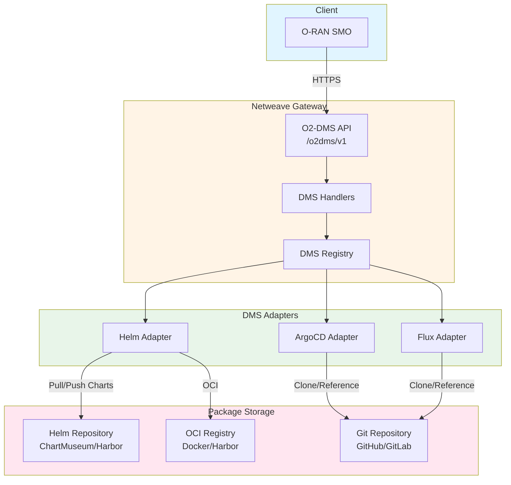
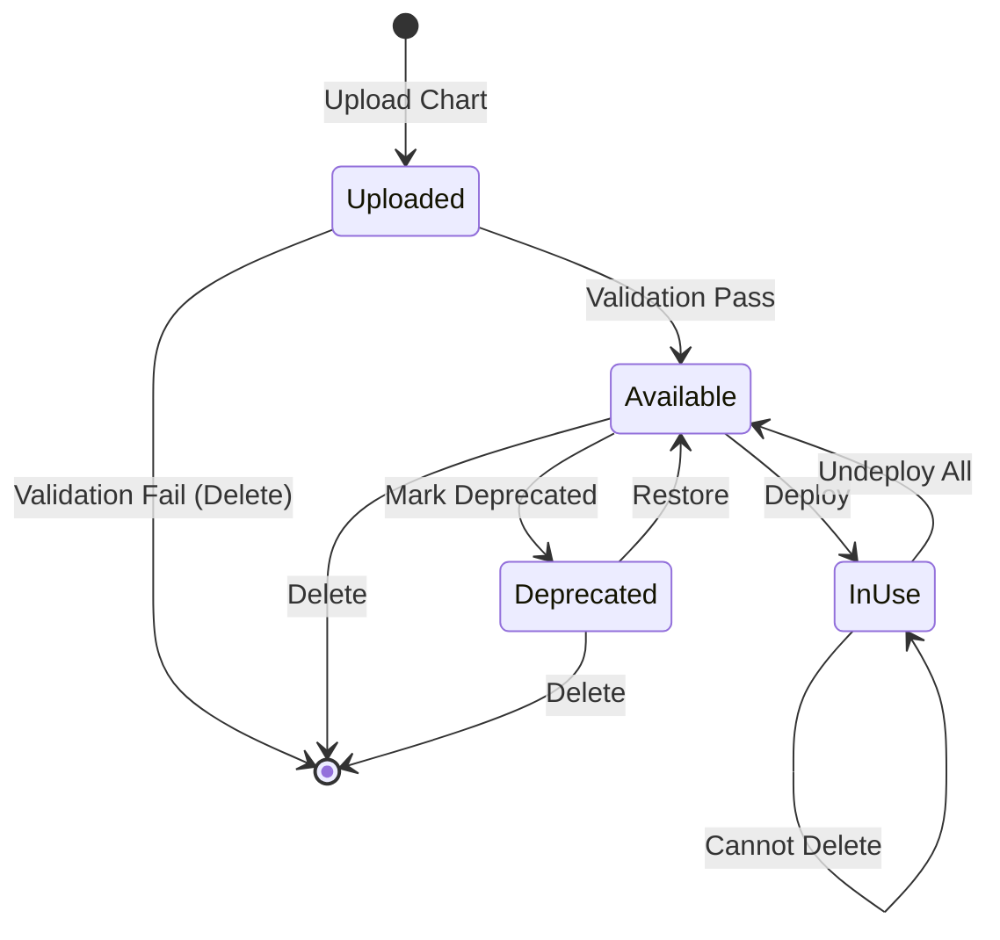

# O2-DMS Package Management

**Version:** 1.0
**Last Updated:** 2026-01-14

## Overview

The O2-DMS Package Management system provides deployment package lifecycle management capabilities across multiple backend deployment systems. It enables uploading, listing, retrieving, and deleting deployment packages (Helm charts, CNF packages, GitOps manifests) through a unified API.

## Capabilities

| Operation | Endpoint | Helm | ArgoCD | Flux | Description |
|-----------|----------|------|--------|------|-------------|
| **List Packages** | `GET /o2dms/v1/nfDeploymentDescriptors` | ✅ | 📋 | 📋 | List available packages |
| **Get Package** | `GET /o2dms/v1/nfDeploymentDescriptors/{id}` | ✅ | 📋 | 📋 | Get package details |
| **Upload Package** | `POST /o2dms/v1/nfDeploymentDescriptors` | ✅ | 📋 | 📋 | Upload/register package |
| **Delete Package** | `DELETE /o2dms/v1/nfDeploymentDescriptors/{id}` | ✅ | 📋 | 📋 | Delete package |

**Legend:**
- ✅ Fully implemented
- 📋 Planned/Spec defined

## Architecture

### Storage Model

Package management in Netweave uses an **adapter-specific storage model**, where each DMS adapter manages packages according to its backend capabilities:



### Helm Adapter Storage

The Helm adapter integrates with Helm repositories and does NOT store artifacts directly in Netweave. Instead, it:

1. **List**: Queries configured Helm repositories for available charts
2. **Get**: Retrieves chart metadata from repository index
3. **Upload**: Pushes charts to configured Helm repository (ChartMuseum, Harbor, OCI)
4. **Delete**: Removes charts from Helm repository

**Supported Repository Types:**
- Classic Helm HTTP repositories (ChartMuseum)
- OCI-based registries (Docker Hub, Harbor, GHCR, ACR, ECR)
- Cloud storage (S3, GCS, Azure Blob) with Helm index

### Package Metadata

Each deployment package contains:

```go
type DeploymentPackage struct {
    PackageID       string                 `json:"packageId"`
    Name            string                 `json:"name"`
    ArtifactName    string                 `json:"artifactName"`
    ArtifactVersion string                 `json:"artifactVersion"`
    Description     string                 `json:"description,omitempty"`
    Provider        string                 `json:"provider,omitempty"`
    PackageURI      string                 `json:"packageUri"`
    Checksum        string                 `json:"checksum,omitempty"`
    CreatedAt       time.Time              `json:"createdAt"`
    UpdatedAt       time.Time              `json:"updatedAt"`
    Extensions      map[string]interface{} `json:"extensions,omitempty"`
}
```

**Key Fields:**
- `PackageID`: Unique identifier (format: `{name}-{version}`)
- `ArtifactName`: Package artifact name (e.g., Helm chart name)
- `ArtifactVersion`: Semantic version (e.g., `1.0.0`)
- `PackageURI`: Repository URI where package is stored
- `Checksum`: SHA256 checksum for integrity verification
- `Extensions`: Adapter-specific metadata

## Helm Package Management

### Listing Packages

**Endpoint:** `GET /o2dms/v1/nfDeploymentDescriptors`

Retrieves all Helm charts from configured repositories.

**Request:**
```bash
curl -X GET "http://localhost:8080/o2dms/v1/nfDeploymentDescriptors" \
  -H "Accept: application/json"
```

**Response:**
```json
[
  {
    "packageId": "nginx-1.0.0",
    "name": "nginx",
    "artifactName": "nginx",
    "artifactVersion": "1.0.0",
    "description": "NGINX web server",
    "provider": "Bitnami",
    "packageUri": "https://charts.bitnami.com/bitnami",
    "checksum": "sha256:abc123...",
    "createdAt": "2026-01-14T10:00:00Z",
    "updatedAt": "2026-01-14T10:00:00Z"
  }
]
```

**Filtering:**

Query parameters support filtering:
- `?name=nginx` - Filter by chart name
- `?version=1.0.0` - Filter by specific version
- `?limit=10&offset=0` - Pagination

### Getting Package Details

**Endpoint:** `GET /o2dms/v1/nfDeploymentDescriptors/{packageId}`

Retrieves detailed information about a specific Helm chart.

**Request:**
```bash
curl -X GET "http://localhost:8080/o2dms/v1/nfDeploymentDescriptors/nginx-1.0.0" \
  -H "Accept: application/json"
```

**Response:**
```json
{
  "packageId": "nginx-1.0.0",
  "name": "nginx",
  "artifactName": "nginx",
  "artifactVersion": "1.0.0",
  "description": "NGINX web server with load balancing and caching",
  "provider": "Bitnami",
  "packageUri": "https://charts.bitnami.com/bitnami/nginx-1.0.0.tgz",
  "checksum": "sha256:abc123def456...",
  "createdAt": "2026-01-14T10:00:00Z",
  "updatedAt": "2026-01-14T10:00:00Z",
  "extensions": {
    "chartVersion": "1.0.0",
    "appVersion": "1.25.3",
    "dependencies": [
      {"name": "common", "version": "2.x.x"}
    ],
    "maintainers": [
      {"name": "Bitnami", "email": "support@bitnami.com"}
    ]
  }
}
```

### Uploading Packages

**Endpoint:** `POST /o2dms/v1/nfDeploymentDescriptors`

Uploads a new Helm chart to the configured repository.

**Request:**
```bash
curl -X POST "http://localhost:8080/o2dms/v1/nfDeploymentDescriptors" \
  -H "Content-Type: multipart/form-data" \
  -F "name=my-app" \
  -F "artifactVersion=1.0.0" \
  -F "chart=@my-app-1.0.0.tgz"
```

**Response:**
```json
{
  "packageId": "my-app-1.0.0",
  "name": "my-app",
  "artifactName": "my-app",
  "artifactVersion": "1.0.0",
  "packageUri": "oci://registry.example.com/charts/my-app:1.0.0",
  "checksum": "sha256:xyz789...",
  "createdAt": "2026-01-14T12:00:00Z",
  "updatedAt": "2026-01-14T12:00:00Z"
}
```

**Chart Validation:**

The Helm adapter validates uploaded charts:
- ✅ Valid chart structure (Chart.yaml, templates/, values.yaml)
- ✅ Semantic version format
- ✅ Chart dependencies are resolvable
- ✅ No duplicate chart+version combination
- ❌ Rejects invalid/corrupted chart archives

### Deleting Packages

**Endpoint:** `DELETE /o2dms/v1/nfDeploymentDescriptors/{packageId}`

Deletes a Helm chart from the repository.

**Request:**
```bash
curl -X DELETE "http://localhost:8080/o2dms/v1/nfDeploymentDescriptors/my-app-1.0.0"
```

**Response:**
```http
HTTP/1.1 204 No Content
```

**Protection:**
- ❌ Cannot delete packages currently in use by deployments
- ✅ Returns `409 Conflict` if package is deployed
- ✅ Soft delete option via query parameter `?force=false`

## Configuration

### Helm Repository Configuration

Configure Helm repositories in the Helm adapter initialization:

```go
helmConfig := &helm.Config{
    Kubeconfig: cfg.Kubernetes.ConfigPath,
    Namespace:  cfg.Kubernetes.Namespace,
    Timeout:    30 * time.Second,
    // Repository configuration
    RepositoryURL:  "https://charts.bitnami.com/bitnami",
    RepositoryName: "bitnami",
    // OCI registry support
    OCIRegistry: "oci://registry.example.com/charts",
}
```

### Repository Types

#### 1. Classic HTTP Repository (ChartMuseum)

```yaml
helm:
  repository_url: "https://chartmuseum.example.com"
  repository_name: "internal"
  auth:
    username: "admin"
    password: "${HELM_REPO_PASSWORD}"
```

#### 2. OCI Registry

```yaml
helm:
  oci_registry: "oci://ghcr.io/myorg/charts"
  auth:
    username: "github-user"
    password: "${GITHUB_TOKEN}"
```

#### 3. Cloud Storage (S3)

```yaml
helm:
  repository_url: "s3://my-bucket/charts"
  aws:
    region: "us-east-1"
    access_key_id: "${AWS_ACCESS_KEY_ID}"
    secret_access_key: "${AWS_SECRET_ACCESS_KEY}"
```

## Package Lifecycle



### Package States

1. **Uploaded**: Chart uploaded but not yet validated
2. **Available**: Chart validated and ready for deployment
3. **In Use**: Chart is deployed (prevents deletion)
4. **Deprecated**: Chart marked as deprecated (warning on use)

## Error Handling

### Common Errors

| Error Code | Description | Resolution |
|------------|-------------|------------|
| `404 Not Found` | Package doesn't exist | Verify packageId |
| `409 Conflict` | Package already exists or in use | Use different version or force delete |
| `400 Bad Request` | Invalid chart structure | Fix Chart.yaml and retry |
| `413 Payload Too Large` | Chart exceeds size limit | Reduce chart size or increase limit |
| `500 Internal Error` | Repository unavailable | Check repository connectivity |

### Example Error Response

```json
{
  "error": "PackageInUse",
  "message": "Cannot delete package nginx-1.0.0: used by 3 deployments",
  "code": 409,
  "details": {
    "deployments": [
      "nginx-prod",
      "nginx-staging",
      "nginx-dev"
    ]
  }
}
```

## Best Practices

### 1. Versioning Strategy

Use **semantic versioning** for all packages:
- `1.0.0` - Major release
- `1.1.0` - Minor feature
- `1.1.1` - Patch/bugfix

**Don't:**
- ❌ Overwrite existing versions
- ❌ Use generic versions like `latest`
- ❌ Deploy `0.x.x` versions to production

### 2. Package Validation

Before uploading, validate charts locally:

```bash
# Lint chart
helm lint ./my-chart

# Verify structure
helm package ./my-chart --verify

# Test installation (dry-run)
helm install test ./my-chart --dry-run --debug
```

### 3. Package Naming

Follow consistent naming conventions:
- `{app-name}-{major}.{minor}.{patch}` (e.g., `nginx-1.0.0`)
- Use lowercase and hyphens
- Avoid special characters

### 4. Large Packages

For charts >100MB:
- Use OCI registries (better compression)
- Split into multiple charts with dependencies
- Use external image registries for container images

### 5. Security

- ✅ Sign Helm charts with GPG keys
- ✅ Scan charts for vulnerabilities
- ✅ Use private repositories for proprietary charts
- ✅ Rotate repository credentials regularly

## Monitoring and Metrics

### Package Metrics

Prometheus metrics for package operations:

```prometheus
# Package uploads
o2dms_package_uploads_total{adapter="helm",status="success"} 45
o2dms_package_uploads_total{adapter="helm",status="failed"} 2

# Package deletions
o2dms_package_deletions_total{adapter="helm",status="success"} 12

# Package list operations
o2dms_package_list_duration_seconds{adapter="helm"} 0.234

# Active packages
o2dms_packages_total{adapter="helm",status="available"} 123
o2dms_packages_total{adapter="helm",status="in_use"} 45
```

### Logging

Package operations are logged with structured fields:

```json
{
  "level": "info",
  "msg": "package uploaded",
  "adapter": "helm",
  "packageId": "nginx-1.0.0",
  "size": "15.2MB",
  "checksum": "sha256:abc123...",
  "repository": "oci://ghcr.io/myorg/charts",
  "duration": "2.3s"
}
```

## Testing

### Unit Tests

Test coverage for package operations:
- `TestHelmAdapter_ListDeploymentPackages` - List charts
- `TestHelmAdapter_GetDeploymentPackage` - Get chart details
- `TestHelmAdapter_UploadDeploymentPackage` - Upload charts
- `TestHelmAdapter_DeleteDeploymentPackage` - Delete charts

Run package tests:

```bash
go test -v ./internal/dms/adapters/helm/... -run TestHelmAdapter.*Package
```

### Integration Tests

Test with real Helm repositories:

```bash
# Start local ChartMuseum
docker run -d -p 8080:8080 chartmuseum/chartmuseum

# Run integration tests
TEST_HELM_REPO=http://localhost:8080 go test -tags=integration ./internal/dms/adapters/helm/...
```

## Troubleshooting

### Chart Upload Fails

**Symptom:** `400 Bad Request: invalid chart structure`

**Solutions:**
1. Verify Chart.yaml exists and is valid
2. Check chart dependencies are resolvable
3. Lint chart: `helm lint ./chart`
4. Verify chart packages successfully: `helm package ./chart`

### Cannot List Packages

**Symptom:** `500 Internal Error: failed to fetch repository index`

**Solutions:**
1. Verify repository URL is accessible
2. Check repository authentication credentials
3. Ensure repository index.yaml exists
4. Test manually: `helm repo add test $REPO_URL && helm search repo test`

### Package Deletion Fails

**Symptom:** `409 Conflict: package in use`

**Solutions:**
1. List deployments using package: `GET /o2dms/v1/nfDeployments?packageId={id}`
2. Undeploy all instances
3. Retry deletion
4. Force delete (if appropriate): `DELETE /.../{id}?force=true`

## References

- [O-RAN O2-DMS Specification v3.0.0](https://specifications.o-ran.org/)
- [Helm Documentation](https://helm.sh/docs/)
- [Helm Repository Structure](https://helm.sh/docs/topics/chart_repository/)
- [OCI Registry Support](https://helm.sh/docs/topics/registries/)
- [DMS Adapter Interface](../../../internal/dms/adapter/adapter.go)
- [Helm Adapter Implementation](../../../internal/dms/adapters/helm/adapter.go)

## See Also

- [DMS Adapter Interface](README.md)
- [Helm Adapter Documentation](helm.md)
- [Deployment Lifecycle Operations](../../../docs/api/o2dms/)
- [O2-DMS Compliance](../../reference/compliance.md)
