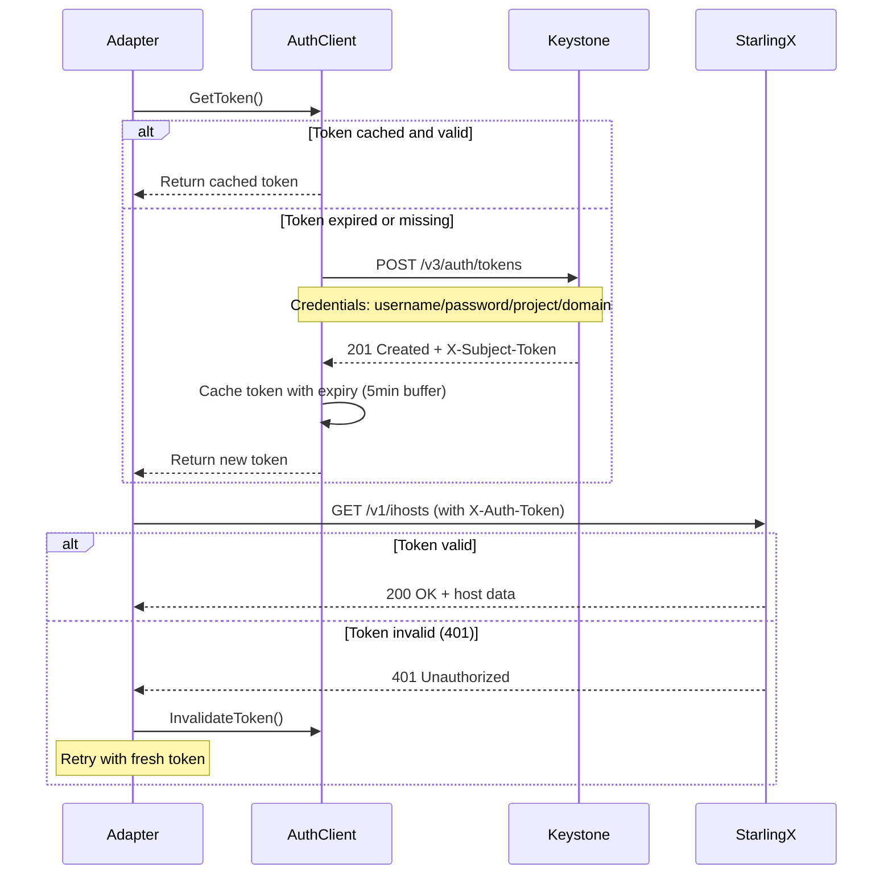

# StarlingX IMS Adapter

**Status:** ✅ Production Ready (Core Implementation)
**Version:** 1.0
**Last Updated:** 2026-01-14

## Overview

The StarlingX adapter provides O2-IMS infrastructure management for Wind River StarlingX deployments. It integrates with StarlingX System Inventory API (sysinv) and Keystone authentication to manage edge cloud infrastructure. This adapter is ideal for telecom edge deployments running on StarlingX platform.

## Resource Mappings

| O2-IMS Concept | StarlingX Resource | Description |
|----------------|-------------------|-------------|
| **Deployment Manager** | ISystem | StarlingX system information and capabilities |
| **Resource Pool** | Host Labels | Logical grouping via `pool` or `resource-pool` labels |
| **Resource** | IHost (compute nodes) | Physical compute hosts with hardware inventory |
| **Resource Type** | Host Personality + Subfunctions | Compute, controller, storage node types |

## Capabilities

```go
capabilities := []Capability{
    CapabilityResourcePools,        // Label-based pools
    CapabilityResources,            // Compute host management
    CapabilityResourceTypes,        // Personality-based types
    CapabilityDeploymentManagers,   // System information
    CapabilityHealthChecks,         // Connectivity validation
    CapabilitySubscriptions,        // Event notifications (with storage)
}
```

## Configuration

### Basic Configuration

```yaml
adapters:
  ims:
    - name: starlingx-prod
      type: starlingx
      enabled: true
      config:
        # StarlingX System Inventory API endpoint
        endpoint: "http://controller:6385"

        # Keystone authentication endpoint
        keystoneEndpoint: "http://controller:5000"

        # Keystone credentials
        username: "admin"
        password: "${STARLINGX_PASSWORD}"  # Use env var
        projectName: "admin"
        domainName: "Default"

        # O2-IMS identifiers
        oCloudID: "ocloud-starlingx-site1"
        deploymentManagerID: "dm-starlingx-site1"

        # Optional region identifier
        region: "RegionOne"
```

### Environment Variables

```bash
# Required
export STARLINGX_ENDPOINT="http://controller:6385"
export STARLINGX_KEYSTONE="http://controller:5000"
export STARLINGX_PASSWORD="your-secure-password"

# Optional with defaults
export STARLINGX_USERNAME="admin"
export STARLINGX_PROJECT="admin"
export STARLINGX_DOMAIN="Default"
```

## Implementation

### Adapter Structure

```go
// internal/adapters/starlingx/adapter.go

package starlingx

import (
    "context"
    "go.uber.org/zap"
    "github.com/piwi3910/netweave/internal/adapter"
    "github.com/piwi3910/netweave/internal/storage"
)

type Adapter struct {
    client              *Client
    store               storage.Store
    logger              *zap.Logger
    oCloudID            string
    deploymentManagerID string
    region              string
}

type Config struct {
    Endpoint            string        // StarlingX API: http://controller:6385
    KeystoneEndpoint    string        // Keystone: http://controller:5000
    Username            string        // Default: "admin"
    Password            string        // Required
    ProjectName         string        // Default: "admin"
    DomainName          string        // Default: "Default"
    Region              string        // Optional
    OCloudID            string        // Required
    DeploymentManagerID string        // Required
    Store               storage.Store // Optional (for subscriptions)
    Logger              *zap.Logger   // Optional
}

func New(cfg *Config) (*Adapter, error) {
    // Creates auth client with Keystone
    authClient := NewAuthClient(
        cfg.KeystoneEndpoint,
        cfg.Username,
        cfg.Password,
        cfg.ProjectName,
        cfg.DomainName,
        logger,
    )

    // Creates StarlingX API client
    client := NewClient(cfg.Endpoint, authClient, logger)

    return &Adapter{
        client:              client,
        store:               cfg.Store,
        logger:              logger,
        oCloudID:            cfg.OCloudID,
        deploymentManagerID: cfg.DeploymentManagerID,
        region:              cfg.Region,
    }, nil
}
```

### Authentication Flow

The adapter uses Keystone v3 authentication with automatic token management:



**Key Features:**
- **Token Caching**: Tokens cached with expiry tracking (5-minute buffer before actual expiry)
- **Automatic Refresh**: Expired tokens automatically refreshed on next request
- **401 Retry Logic**: Invalid tokens invalidated and request retried once
- **Thread-Safe**: Uses `sync.RWMutex` for concurrent access

### Resource Pool Management

StarlingX uses host labels for resource pooling:

```go
// List all resource pools
func (a *Adapter) ListResourcePools(ctx context.Context, filter *adapter.Filter) ([]*adapter.ResourcePool, error) {
    // 1. Fetch all compute hosts
    hosts, err := a.client.ListHosts(ctx, "compute")

    // 2. Fetch all labels
    labels, err := a.client.ListLabels(ctx)

    // 3. Group hosts by pool label
    poolGroups := groupHostsByPool(hosts, labels)

    // 4. Create resource pool for each group
    pools := make([]*adapter.ResourcePool, 0, len(poolGroups))
    for poolName, poolHosts := range poolGroups {
        pool := mapLabelsToResourcePool(poolName, poolHosts, a.oCloudID)
        pools = append(pools, pool)
    }

    return pools, nil
}
```

**Label Keys Recognized:**
- `pool` - Primary pool identifier
- `resource-pool` - Alternative pool identifier

**Example:**
```bash
# Assign host to pool using StarlingX CLI
system host-label-assign compute-0 pool=high-memory
system host-label-assign compute-1 pool=high-memory
system host-label-assign compute-2 pool=standard
```

### Resource Management

Resources map to StarlingX compute hosts with full hardware inventory:

```go
// Get detailed resource information
func (a *Adapter) GetResource(ctx context.Context, id string) (*adapter.Resource, error) {
    // 1. Fetch host details
    host, err := a.client.GetHost(ctx, id)

    // 2. Fetch hardware inventory
    cpus, _ := a.client.GetHostCPUs(ctx, id)
    memories, _ := a.client.GetHostMemory(ctx, id)
    disks, _ := a.client.GetHostDisks(ctx, id)

    // 3. Map to O2-IMS Resource
    resource := mapHostToResource(host, cpus, memories, disks)

    return resource, nil
}
```

**Resource Extensions Include:**
- **Basic Info**: hostname, personality, administrative/operational/availability state
- **CPU Details**: count, model, family, per-CPU details
- **Memory**: total MiB, available MiB, NUMA node allocation
- **Storage**: disk devices, sizes, total storage
- **Location**: physical location metadata
- **Capabilities**: host-specific capabilities

### Resource Type Discovery

Resource types are automatically generated from host personalities:

```go
// Generate resource types from hosts
func generateResourceTypesFromHosts(hosts []IHost) []*adapter.ResourceType {
    typeMap := make(map[string]*adapter.ResourceType)

    for _, host := range hosts {
        // Type ID: "starlingx-{personality}[-{subfunctions}]"
        typeID := generateResourceTypeID(&host)

        if _, exists := typeMap[typeID]; !exists {
            typeMap[typeID] = &adapter.ResourceType{
                ResourceTypeID: typeID,
                Name:           fmt.Sprintf("StarlingX %s", host.Personality),
                Vendor:         "Wind River",
                Model:          host.Personality,
                ResourceClass:  mapPersonalityToClass(host.Personality),
                ResourceKind:   "physical",
                Extensions: map[string]interface{}{
                    "personality":  host.Personality,
                    "subfunctions": host.SubFunctions,
                    "source":       "starlingx",
                },
            }
        }
    }

    return types
}

func mapPersonalityToClass(personality string) string {
    switch strings.ToLower(personality) {
    case "compute":
        return "compute"
    case "controller":
        return "control-plane"
    case "storage":
        return "storage"
    default:
        return "unknown"
    }
}
```

**Resource Type IDs:**
- `starlingx-compute` - Standard compute nodes
- `starlingx-controller` - Controller nodes
- `starlingx-storage` - Storage nodes
- `starlingx-compute-lowlatency` - Compute with subfunctions

## API Endpoints

### StarlingX System Inventory API

| Endpoint | Method | Description |
|----------|--------|-------------|
| `/v1/isystems` | GET | List systems (deployment manager) |
| `/v1/ihosts` | GET | List all hosts |
| `/v1/ihosts?personality={type}` | GET | Filter hosts by personality |
| `/v1/ihosts/{uuid}` | GET | Get host details |
| `/v1/ihosts/{uuid}/icpus` | GET | Get host CPUs |
| `/v1/ihosts/{uuid}/imemorys` | GET | Get host memory |
| `/v1/ihosts/{uuid}/idisks` | GET | Get host disks |
| `/v1/labels` | GET | List all labels |

**Base URL:** `http://controller:6385`
**Authentication:** X-Auth-Token header (from Keystone)

### Keystone Authentication API

| Endpoint | Method | Description |
|----------|--------|-------------|
| `/v3/auth/tokens` | POST | Authenticate and get token |

**Base URL:** `http://controller:5000`
**Response:** `X-Subject-Token` header contains token

## Usage Examples

### Basic Adapter Creation

```go
package main

import (
    "context"
    "log"

    "github.com/piwi3910/netweave/internal/adapters/starlingx"
    "go.uber.org/zap"
)

func main() {
    logger, _ := zap.NewProduction()
    defer logger.Sync()

    adapter, err := starlingx.New(&starlingx.Config{
        Endpoint:            "http://controller:6385",
        KeystoneEndpoint:    "http://controller:5000",
        Username:            "admin",
        Password:            "secure-password",
        ProjectName:         "admin",
        DomainName:          "Default",
        OCloudID:            "ocloud-starlingx-1",
        DeploymentManagerID: "dm-starlingx-1",
        Logger:              logger,
    })
    if err != nil {
        log.Fatalf("Failed to create adapter: %v", err)
    }
    defer adapter.Close()

    ctx := context.Background()

    // Test connectivity
    if err := adapter.Health(ctx); err != nil {
        log.Fatalf("Health check failed: %v", err)
    }

    log.Println("StarlingX adapter initialized successfully")
}
```

### List Resource Pools

```go
// List all resource pools with pagination
filter := &adapter.Filter{
    Offset: 0,
    Limit:  10,
}

pools, err := adapter.ListResourcePools(ctx, filter)
if err != nil {
    log.Fatalf("Failed to list pools: %v", err)
}

for _, pool := range pools {
    fmt.Printf("Pool: %s (%s)\n", pool.Name, pool.ResourcePoolID)
    fmt.Printf("  Location: %s\n", pool.Location)
    fmt.Printf("  Hosts: %d\n", pool.Extensions["host_count"])

    if personalities, ok := pool.Extensions["personalities"].(map[string]int); ok {
        for personality, count := range personalities {
            fmt.Printf("    - %s: %d\n", personality, count)
        }
    }
}
```

### Get Resource Details

```go
// Get specific compute host
resource, err := adapter.GetResource(ctx, "host-uuid-123")
if err != nil {
    log.Fatalf("Failed to get resource: %v", err)
}

fmt.Printf("Resource: %s\n", resource.ResourceID)
fmt.Printf("  Type: %s\n", resource.ResourceTypeID)
fmt.Printf("  Description: %s\n", resource.Description)
fmt.Printf("  Hostname: %s\n", resource.Extensions["hostname"])
fmt.Printf("  CPU Count: %d\n", resource.Extensions["cpu_count"])
fmt.Printf("  CPU Model: %s\n", resource.Extensions["cpu_model"])
fmt.Printf("  Memory: %d MiB\n", resource.Extensions["memory_total_mib"])
fmt.Printf("  Storage: %d MiB\n", resource.Extensions["storage_total_mib"])
fmt.Printf("  State: %s/%s/%s\n",
    resource.Extensions["administrative"],
    resource.Extensions["operational"],
    resource.Extensions["availability"])
```

### List Resources with Filters

```go
// List all compute resources in a specific pool
filter := &adapter.Filter{
    ResourcePoolID: "starlingx-pool-high-memory",
    Limit:          50,
}

resources, err := adapter.ListResources(ctx, filter)
if err != nil {
    log.Fatalf("Failed to list resources: %v", err)
}

fmt.Printf("Found %d resources in pool\n", len(resources))
for _, res := range resources {
    fmt.Printf("  - %s: %s (%s)\n",
        res.Extensions["hostname"],
        res.ResourceID,
        res.Extensions["availability"])
}
```

### Manage Subscriptions

```go
// Create subscription for resource changes
sub := &adapter.Subscription{
    SubscriptionID:         "sub-starlingx-1",
    Callback:               "https://smo.example.com/notify",
    ConsumerSubscriptionID: "smo-sub-123",
    Filter: &adapter.SubscriptionFilter{
        ResourcePoolID: "starlingx-pool-high-memory",
    },
}

created, err := adapter.CreateSubscription(ctx, sub)
if err != nil {
    log.Fatalf("Failed to create subscription: %v", err)
}

fmt.Printf("Subscription created: %s\n", created.SubscriptionID)
```

## Troubleshooting

### Authentication Issues

**Problem:** `keystone authentication failed with status 401`

**Solutions:**
1. Verify credentials:
   ```bash
   curl -X POST http://controller:5000/v3/auth/tokens \
     -H "Content-Type: application/json" \
     -d '{
       "auth": {
         "identity": {
           "methods": ["password"],
           "password": {
             "user": {
               "name": "admin",
               "password": "your-password",
               "domain": {"name": "Default"}
             }
           }
         },
         "scope": {
           "project": {
             "name": "admin",
             "domain": {"name": "Default"}
           }
         }
       }
     }'
   ```

2. Check project and domain names are correct
3. Ensure user has admin role in the project

### Connection Issues

**Problem:** `health check failed: failed to list systems`

**Solutions:**
1. Verify endpoint is accessible:
   ```bash
   curl -v http://controller:6385/v1/isystems
   ```

2. Check firewall rules allow port 6385
3. Verify StarlingX services are running:
   ```bash
   sudo systemctl status sysinv-api
   ```

### Empty Resource Pools

**Problem:** `ListResourcePools returns empty list`

**Solutions:**
1. Verify hosts have pool labels:
   ```bash
   system host-label-list compute-0
   ```

2. Add pool labels to hosts:
   ```bash
   system host-label-assign compute-0 pool=default
   ```

3. Check label key matches expected format (`pool` or `resource-pool`)

### Token Expiry Issues

**Problem:** Intermittent 401 errors after running for extended period

**Explanation:** This should be handled automatically by token refresh logic. If occurring:

1. Check logs for token refresh attempts
2. Verify system clock is synchronized (NTP)
3. Increase token buffer if Keystone tokens expire quickly:
   ```go
   // In auth.go, adjust buffer from 5 minutes
   a.tokenExpiry = expiry.Add(-10 * time.Minute)  // 10 min buffer
   ```

## Performance Considerations

### Token Caching

- Tokens cached in memory with automatic refresh
- 5-minute expiration buffer prevents race conditions
- Thread-safe with `sync.RWMutex` for concurrent requests
- Single authentication request for multiple concurrent operations

### API Call Optimization

- Hardware inventory fetched only when needed (GetResource)
- List operations batch fetch with pagination support
- Resource type generation cached (derived from host list)

### Recommended Limits

- **Resource Pool Pagination**: 50 pools per request (typical deployments have < 10 pools)
- **Resource Pagination**: 100 resources per request (typical sites have 50-500 nodes)
- **Concurrent Requests**: No hard limit, thread-safe with shared token cache

## Testing

### Unit Tests

```bash
# Run StarlingX adapter unit tests
go test ./internal/adapters/starlingx/... -v

# Run with coverage
go test ./internal/adapters/starlingx/... -cover -coverprofile=coverage.out
go tool cover -html=coverage.out
```

### Integration Tests

```bash
# Run integration tests (requires mock servers)
go test ./internal/adapters/starlingx/... -v -tags=integration

# Run with race detection
go test ./internal/adapters/starlingx/... -race -v
```

### Manual Testing

```bash
# Set environment variables
export STARLINGX_ENDPOINT="http://your-controller:6385"
export STARLINGX_KEYSTONE="http://your-controller:5000"
export STARLINGX_USERNAME="admin"
export STARLINGX_PASSWORD="your-password"

# Run CLI tool (example)
./netweave adapter test starlingx \
  --endpoint "$STARLINGX_ENDPOINT" \
  --keystone "$STARLINGX_KEYSTONE" \
  --username "$STARLINGX_USERNAME" \
  --password "$STARLINGX_PASSWORD"
```

## Security Best Practices

### Credential Management

1. **Never hardcode credentials** in configuration files
2. Use environment variables or secret managers:
   ```yaml
   config:
     password: "${STARLINGX_PASSWORD}"  # Env var
   ```

3. Rotate credentials regularly
4. Use dedicated service accounts with minimal permissions

### Network Security

1. Use TLS/HTTPS in production:
   ```yaml
   config:
     endpoint: "https://controller:6386"
     keystoneEndpoint: "https://controller:13000"
     tlsConfig:
       insecureSkipVerify: false
       certFile: /etc/certs/client.crt
       keyFile: /etc/certs/client.key
       caFile: /etc/certs/ca.crt
   ```

2. Implement network segmentation
3. Use firewall rules to restrict access to StarlingX API

### Logging Security

- Tokens never logged (masked in debug output)
- Passwords never logged
- Sensitive data redacted in error messages

## Version Compatibility

| StarlingX Version | Adapter Status | Notes |
|-------------------|----------------|-------|
| 8.0 | ✅ Fully Supported | Tested and validated |
| 7.0 | ✅ Compatible | Should work without changes |
| 6.0 | ⚠️ Untested | May require minor adjustments |
| < 6.0 | ❌ Not Supported | API differences expected |

## References

- [StarlingX Documentation](https://docs.starlingx.io/)
- [StarlingX System Inventory API](https://docs.starlingx.io/api-ref/stx-config/index.html)
- [OpenStack Keystone v3 API](https://docs.openstack.org/keystone/latest/api_curl_examples.html)
- [O-RAN O2-IMS Specification](https://specifications.o-ran.org/)
- [Wind River Titanium Cloud](https://www.windriver.com/products/titanium-cloud)

## Support

For issues or questions:
- GitHub Issues: https://github.com/piwi3910/netweave/issues
- Implementation: https://github.com/piwi3910/netweave/tree/main/internal/adapters/starlingx
