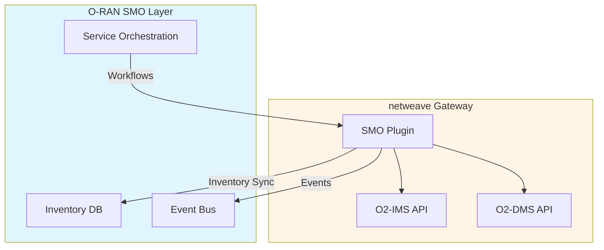

# SMO Adapter Interface

**Version:** 1.0  
**Last Updated:** 2026-01-12

## Overview

SMO (Service Management and Orchestration) adapters integrate netweave with telecom orchestration systems. They operate in dual mode: northbound (netweave → SMO) and DMS backend (SMO → netweave).

## Core Interface

```go
package smo

import (
    "context"
    "github.com/yourorg/netweave/internal/plugin"
)

// SMOPlugin extends the base Plugin interface for SMO integration
type SMOPlugin interface {
    plugin.Plugin

    // Northbound Integration (netweave → SMO)
    SyncInfrastructureInventory(ctx context.Context, inventory *InfrastructureInventory) error
    SyncDeploymentInventory(ctx context.Context, inventory *DeploymentInventory) error
    PublishInfrastructureEvent(ctx context.Context, event *InfrastructureEvent) error
    PublishDeploymentEvent(ctx context.Context, event *DeploymentEvent) error

    // Southbound Integration (SMO → netweave)
    ExecuteWorkflow(ctx context.Context, workflow *WorkflowRequest) (*WorkflowExecution, error)
    GetWorkflowStatus(ctx context.Context, executionID string) (*WorkflowStatus, error)
    CancelWorkflow(ctx context.Context, executionID string) error

    // Service Modeling
    RegisterServiceModel(ctx context.Context, model *ServiceModel) error
    GetServiceModel(ctx context.Context, id string) (*ServiceModel, error)
    ListServiceModels(ctx context.Context) ([]*ServiceModel, error)

    // Capabilities
    SupportsWorkflows() bool
    SupportsServiceModeling() bool
    SupportsPolicyManagement() bool
}
```

## Dual-Mode Operation



## Available SMO Adapters

| Adapter | Status | Northbound | DMS Backend | Workflow Engine |
|---------|--------|------------|-------------|-----------------|
| **ONAP** | 📋 Spec | Yes (A&AI, DMaaP) | Yes (SO, SDNC) | Yes (Camunda) |
| **OSM** | 📋 Spec | Yes (NBI) | Yes (LCM) | Yes |
| **Custom** | 📋 Spec | Configurable | Configurable | Optional |

## Adapter Documentation

- [ONAP Integration](onap.md) - ONAP A&AI, SO, SDNC integration
- [OSM Integration](osm.md) - OSM NBI, LCM integration

## See Also

- [Adapter Pattern Overview](../README.md)
- [IMS Adapters](../ims/README.md)
- [DMS Adapters](../dms/README.md)
