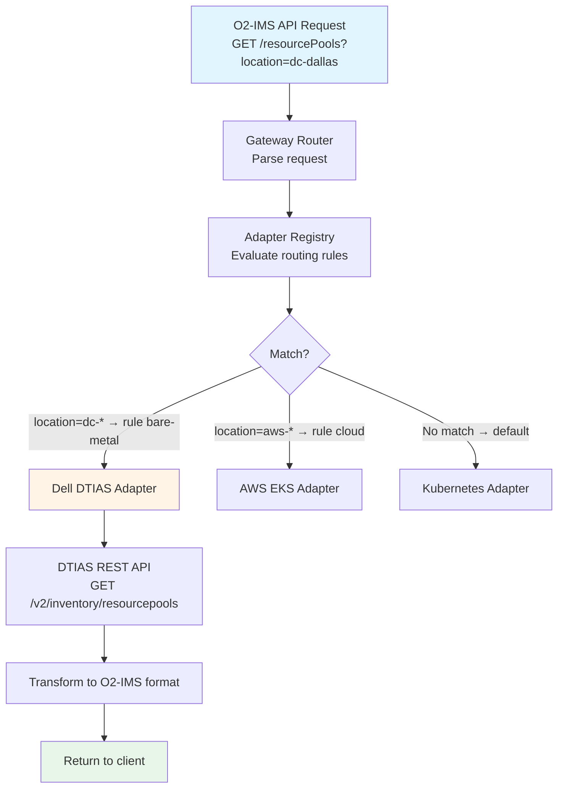

# O2-IMS Overview

This document describes the O2-IMS concepts, architecture philosophy, and cross-cutting concerns for the netweave gateway.

## Table of Contents

1. [Mapping Philosophy](#mapping-philosophy)
2. [Supported Resources](#supported-resources)
3. [Multi-Tenancy and RBAC](#multi-tenancy-and-rbac)
4. [Multi-Backend Adapter Routing](#multi-backend-adapter-routing)

## Mapping Philosophy

### Goals

1. **Semantic Correctness**: O2-IMS concepts accurately represent Kubernetes reality
2. **Bidirectional**: Both read (GET/LIST) and write (POST/PUT/DELETE) operations supported
3. **Idempotent**: Operations can be safely repeated
4. **Kubernetes-Native**: Leverage existing K8s resources where possible

### Approach

- **Direct Mapping**: Where O2-IMS and K8s concepts align (e.g., Node → Resource)
- **Aggregation**: Where O2-IMS requires combining multiple K8s resources
- **Custom Resources**: Where no direct K8s equivalent exists (e.g., DeploymentManager)

## Supported Resources

| O2-IMS Resource | K8s Primary Resource | Status | CRUD Support | Documentation |
|-----------------|----------------------|--------|--------------|---------------|
| Deployment Manager | Custom (cluster metadata) | ✅ Full | R | [deployment-managers.md](deployment-managers.md) |
| Resource Pool | MachineSet / NodePool | ✅ Full | CRUD | [resource-pools.md](resource-pools.md) |
| Resource | Node / Machine | ✅ Full | CRUD | [resources.md](resources.md) |
| Resource Type | StorageClass, Machine Types | ✅ Full | R | [resource-types.md](resource-types.md) |
| Subscription | Redis (O2-IMS specific) | ✅ Full | CRUD | [subscriptions.md](subscriptions.md) |

## Multi-Tenancy and RBAC

### Overview

The netweave gateway provides multi-tenancy and Role-Based Access Control (RBAC) to enable secure, isolated access to O2-IMS resources across different organizations or teams.

### Key Concepts

| Concept | Description |
|---------|-------------|
| **Tenant** | Isolated organization with its own users, quotas, and resources |
| **User** | Entity authenticated via mTLS certificate, belonging to a tenant |
| **Role** | Collection of permissions (platform-level or tenant-scoped) |
| **Permission** | Granular access right (e.g., `subscription:create`, `resource:read`) |

### Authentication

Authentication is performed via mTLS client certificates. The certificate's Subject DN is used to identify users:

```
CN=john.doe,O=Tenant A,OU=Engineering
```

The middleware extracts user identity from the `X-Forwarded-Client-Cert` (XFCC) header when behind a proxy, or directly from the TLS connection.

### Tenant Management API

#### List Tenants (Platform Admin Only)

```http
GET /admin/tenants HTTP/1.1
Accept: application/json
```

**Response:**
```json
{
  "tenants": [
    {
      "id": "tenant-123",
      "name": "Acme Corporation",
      "description": "Primary production tenant",
      "status": "active",
      "contactEmail": "admin@acme.com",
      "quota": {
        "maxSubscriptions": 100,
        "maxResourcePools": 50,
        "maxDeployments": 200,
        "maxUsers": 25
      },
      "usage": {
        "subscriptions": 45,
        "resourcePools": 12,
        "deployments": 78,
        "users": 15
      },
      "createdAt": "2026-01-01T00:00:00Z",
      "updatedAt": "2026-01-05T12:30:00Z"
    }
  ],
  "total": 1
}
```

#### Create Tenant (Platform Admin Only)

```http
POST /admin/tenants HTTP/1.1
Content-Type: application/json

{
  "name": "New Tenant",
  "description": "Description of the tenant",
  "contactEmail": "admin@newtenant.com",
  "quota": {
    "maxSubscriptions": 50,
    "maxResourcePools": 25,
    "maxDeployments": 100,
    "maxUsers": 10
  }
}
```

**Response:** `201 Created`

### User Management API

#### List Users (Tenant Admin)

```http
GET /tenant/users HTTP/1.1
Accept: application/json
```

**Response:**
```json
{
  "users": [
    {
      "id": "user-123",
      "tenantId": "tenant-456",
      "subject": "CN=john.doe,O=Acme,OU=Engineering",
      "commonName": "john.doe",
      "email": "john.doe@acme.com",
      "roleId": "role-tenant-admin",
      "isActive": true,
      "createdAt": "2026-01-01T00:00:00Z",
      "lastLoginAt": "2026-01-06T09:15:00Z"
    }
  ],
  "total": 1
}
```

### Role System

#### Platform-Level Roles

| Role | Permissions | Description |
|------|-------------|-------------|
| `platform_admin` | All permissions | Full system administration |
| `platform_operator` | Tenant read, some write | Platform operations |
| `platform_viewer` | Read-only platform access | Monitoring and auditing |

#### Tenant-Scoped Roles

| Role | Permissions | Description |
|------|-------------|-------------|
| `tenant_admin` | Full tenant management | Manage users, quotas, resources within tenant |
| `tenant_operator` | Create/manage resources | Day-to-day operations |
| `tenant_viewer` | Read-only tenant access | View resources and status |

### Permissions

| Permission | Description |
|------------|-------------|
| `tenant:create` | Create new tenants (platform admin) |
| `tenant:read` | View tenant information |
| `tenant:update` | Modify tenant settings |
| `tenant:delete` | Delete tenants |
| `user:create` | Create users within tenant |
| `user:read` | View user information |
| `user:update` | Modify user settings |
| `user:delete` | Remove users |
| `subscription:create` | Create subscriptions |
| `subscription:read` | View subscriptions |
| `subscription:delete` | Remove subscriptions |
| `resource:read` | View resources |
| `resource:create` | Create resources |
| `resource:delete` | Delete resources |
| `audit:read` | View audit logs |

### Quota Enforcement

Tenants have configurable quotas that are enforced atomically:

| Resource | Default Limit | Description |
|----------|---------------|-------------|
| `maxSubscriptions` | 100 | Maximum O2-IMS subscriptions |
| `maxResourcePools` | 50 | Maximum resource pools |
| `maxDeployments` | 200 | Maximum deployments |
| `maxUsers` | 25 | Maximum users per tenant |

When a quota is exceeded:
```http
HTTP/1.1 403 Forbidden
Content-Type: application/json

{
  "error": "QuotaExceeded",
  "message": "User quota exceeded for tenant",
  "code": 403
}
```

### Tenant Isolation

All O2-IMS resources are isolated by tenant:

1. **Subscriptions**: Each subscription belongs to a tenant
2. **Resources**: Resources are scoped to tenant's resource pools
3. **Audit Logs**: Tenants can only view their own audit events
4. **Users**: Users can only access their own tenant's data

## Multi-Backend Adapter Routing

### Architecture Overview

The netweave gateway uses a **pluggable adapter pattern** that allows routing O2-IMS requests to different backend systems based on configuration rules. This enables:

1. **Multi-Technology Support**: Kubernetes, Dell DTIAS, AWS, OpenStack, etc.
2. **Hybrid Deployments**: Different resource pools can be managed by different backends
3. **Migration Paths**: Gradually move from legacy systems to Kubernetes
4. **Vendor Flexibility**: Avoid lock-in by supporting multiple infrastructure providers

### Adapter Interface

All backends implement the same `Adapter` interface:

```go
// internal/adapter/adapter.go
package adapter

type Adapter interface {
    // Metadata
    Name() string
    Version() string
    Capabilities() []Capability

    // Resource Pools
    ListResourcePools(ctx context.Context, filter *Filter) ([]*ResourcePool, error)
    GetResourcePool(ctx context.Context, id string) (*ResourcePool, error)
    CreateResourcePool(ctx context.Context, pool *ResourcePool) (*ResourcePool, error)
    UpdateResourcePool(ctx context.Context, id string, pool *ResourcePool) (*ResourcePool, error)
    DeleteResourcePool(ctx context.Context, id string) error

    // Resources (Nodes/Machines)
    ListResources(ctx context.Context, filter *Filter) ([]*Resource, error)
    GetResource(ctx context.Context, id string) (*Resource, error)
    CreateResource(ctx context.Context, resource *Resource) (*Resource, error)
    DeleteResource(ctx context.Context, id string) error

    // Resource Types
    ListResourceTypes(ctx context.Context, filter *Filter) ([]*ResourceType, error)
    GetResourceType(ctx context.Context, id string) (*ResourceType, error)

    // Lifecycle
    Health(ctx context.Context) error
    Close() error
}
```

### Routing Configuration

Routing rules determine which adapter handles which requests:

```yaml
# config/routing.yaml
routing:
  # Default adapter for requests not matching any rule
  default: kubernetes

  # Routing rules (evaluated in priority order)
  rules:
    # Rule 1: Bare-metal pools → Dell DTIAS
    - name: bare-metal-to-dtias
      priority: 100
      adapter: dtias
      resourceType: resourcePool
      conditions:
        labels:
          infrastructure.type: bare-metal
        location:
          prefix: dc-

    # Rule 2: Cloud pools → AWS adapter
    - name: cloud-to-aws
      priority: 90
      adapter: aws
      resourceType: resourcePool
      conditions:
        labels:
          infrastructure.type: cloud
        location:
          prefix: aws-
```

### Request Routing Flow



### Routing Examples

**Example 1: Bare-Metal Pool → Dell DTIAS**

```bash
# Request
curl -X GET 'https://netweave.example.com/o2ims-infrastructureInventory/v1/resourcePools?location=dc-dallas'

# Routing Decision
location=dc-dallas → prefix match "dc-" → route to "dtias" adapter

# Backend Call
DTIAS Adapter → GET https://dtias.example.com/v2/inventory/resourcepools
                → Transform DTIAS response to O2-IMS format
```

**Example 2: Cloud Pool → AWS**

```bash
# Request
curl -X POST https://netweave.example.com/o2ims-infrastructureInventory/v1/resourcePools \
  -d '{
    "name": "Production EKS Pool",
    "location": "aws-us-west-2",
    "extensions": {"instanceType": "m5.2xlarge"}
  }'

# Routing Decision
location=aws-us-west-2 → prefix match "aws-" → route to "aws" adapter

# Backend Call
AWS Adapter → Create EKS NodeGroup via AWS SDK
            → Transform AWS response to O2-IMS format
```

### Multi-Backend Aggregation

For `List` operations, results can be **aggregated from multiple backends**:

**Aggregation Strategies**:

| Strategy | Description | Use Case |
|----------|-------------|----------|
| **Merge** | Combine results from all adapters | List all pools across all backends |
| **First** | Return first successful response | Fallback chain (try primary, then backup) |
| **Fanout** | Send to all, wait for all | Ensure consistency across backends |
| **Priority** | Query highest-priority adapter only | Single source of truth per resource type |

## Related Documentation

- [Deployment Managers](deployment-managers.md)
- [Resource Pools](resource-pools.md)
- [Resources](resources.md)
- [Resource Types](resource-types.md)
- [Subscriptions](subscriptions.md)
- [Backend Plugins](../../backend-plugins.md)
