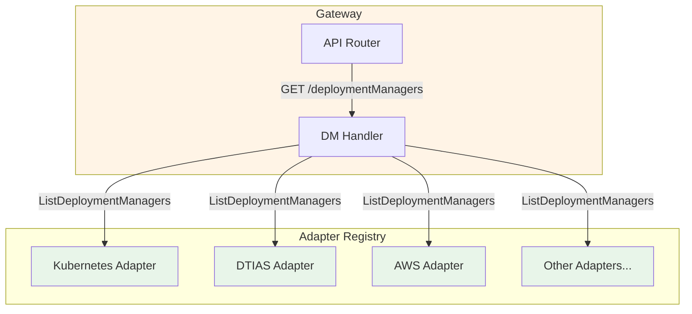

# Deployment Manager API

Deployment Manager represents an O-Cloud infrastructure manager. Each registered adapter in the gateway exposes its own deployment manager metadata via the `DeploymentManagerClient` interface.

## Table of Contents

1. [O2-IMS Specification](#o2-ims-specification)
2. [Architecture](#architecture)
3. [API Operations](#api-operations)
4. [Kubernetes Adapter Implementation](#kubernetes-adapter-implementation)
5. [Backend-Specific Mappings](#backend-specific-mappings)
6. [Error Handling](#error-handling)

## O2-IMS Specification

### Resource Model

```json
{
  "deploymentManagerId": "netweave-k8s-dm",
  "name": "Kubernetes Cluster: netweave-k8s-dm",
  "description": "Kubernetes-based O2-IMS Deployment Manager",
  "oCloudId": "default-ocloud",
  "serviceUri": "/o2ims/v1/deploymentManagers/netweave-k8s-dm",
  "capabilities": ["resource-pools", "resources", "resource-types", "subscriptions", "health-checks"],
  "extensions": {
    "kubernetes.io/adapter-version": "1.30.0",
    "kubernetes.io/deployment-manager-id": "netweave-k8s-dm",
    "kubernetes.io/namespace": "o2ims-system",
    "kubernetes.io/o-cloud-id": "default-ocloud"
  }
}
```

### Attributes

| Field | Type | Required | Description |
|-------|------|----------|-------------|
| `deploymentManagerId` | string | Y | Unique identifier (from adapter configuration) |
| `name` | string | Y | Human-readable name |
| `description` | string | N | Description |
| `oCloudId` | string | Y | Parent O-Cloud ID |
| `serviceUri` | string | Y | API endpoint path |
| `supportedLocations` | array | N | Geographic locations |
| `capabilities` | array | N | Supported O2-IMS capabilities |
| `extensions` | object | N | Vendor/adapter-specific metadata |

## Architecture

### Adapter Registry Pattern

The DM endpoint dynamically lists all registered adapters from the adapter registry. Each adapter implements the `DeploymentManagerClient` interface and returns its own deployment manager metadata.



### DeploymentManagerClient Interface

Each adapter must implement the `DeploymentManagerClient` interface defined in `internal/adapter/adapter.go`:

```go
// DeploymentManagerClient provides deployment manager operations.
type DeploymentManagerClient interface {
    // ListDeploymentManagers retrieves all deployment managers matching the filter.
    // The filter parameter can be nil to retrieve all deployment managers.
    // Returns a slice of deployment managers or an error.
    ListDeploymentManagers(ctx context.Context, filter *Filter) ([]*DeploymentManager, error)

    // GetDeploymentManager retrieves metadata about the deployment manager.
    // Returns the deployment manager or an error if not found.
    GetDeploymentManager(ctx context.Context, id string) (*DeploymentManager, error)
}
```

### DeploymentManager Data Structure

```go
// DeploymentManager represents O2-IMS Deployment Manager metadata.
type DeploymentManager struct {
    DeploymentManagerID string                 `json:"deploymentManagerId"`
    Name                string                 `json:"name"`
    Description         string                 `json:"description,omitempty"`
    OCloudID            string                 `json:"oCloudId"`
    ServiceURI          string                 `json:"serviceUri"`
    SupportedLocations  []string               `json:"supportedLocations,omitempty"`
    Capabilities        []string               `json:"capabilities,omitempty"`
    Extensions          map[string]interface{} `json:"extensions,omitempty"`
}
```

## API Operations

### List Deployment Managers

```http
GET /o2ims-infrastructureInventory/v1/deploymentManagers HTTP/1.1
Accept: application/json
```

**Response (200 OK)**:
```json
{
  "deploymentManagers": [
    {
      "deploymentManagerId": "netweave-k8s-dm",
      "name": "Kubernetes Cluster: netweave-k8s-dm",
      "description": "Kubernetes-based O2-IMS Deployment Manager",
      "oCloudId": "default-ocloud",
      "serviceUri": "/o2ims/v1/deploymentManagers/netweave-k8s-dm",
      "capabilities": [
        "resource-pools",
        "resources",
        "resource-types",
        "subscriptions",
        "health-checks"
      ],
      "extensions": {
        "kubernetes.io/adapter-version": "1.30.0",
        "kubernetes.io/deployment-manager-id": "netweave-k8s-dm",
        "kubernetes.io/namespace": "o2ims-system",
        "kubernetes.io/o-cloud-id": "default-ocloud"
      }
    }
  ],
  "total": 1
}
```

**Action**: Returns deployment managers from all registered adapters in the adapter registry. Each adapter's `ListDeploymentManagers()` method is called to collect DM metadata.

**Permission**: `deploymentManagers:read`

### Get Deployment Manager

```http
GET /o2ims-infrastructureInventory/v1/deploymentManagers/{id} HTTP/1.1
Accept: application/json
```

**Response (200 OK)**:
```json
{
  "deploymentManagerId": "netweave-k8s-dm",
  "name": "Kubernetes Cluster: netweave-k8s-dm",
  "description": "Kubernetes-based O2-IMS Deployment Manager",
  "oCloudId": "default-ocloud",
  "serviceUri": "/o2ims/v1/deploymentManagers/netweave-k8s-dm",
  "capabilities": [
    "resource-pools",
    "resources",
    "resource-types",
    "subscriptions",
    "health-checks"
  ],
  "extensions": {
    "kubernetes.io/adapter-version": "1.30.0",
    "kubernetes.io/deployment-manager-id": "netweave-k8s-dm",
    "kubernetes.io/namespace": "o2ims-system",
    "kubernetes.io/o-cloud-id": "default-ocloud",
    "kubernetes.io/version": "v1.30.0",
    "kubernetes.io/platform": "linux/amd64",
    "kubernetes.io/go-version": "go1.22.0"
  }
}
```

**Action**: Retrieves a specific deployment manager by ID from the active adapter. The Kubernetes adapter accepts "default" and "" as aliases for the configured DM ID.

**Permission**: `deploymentManagers:read`

**Error Response (404 Not Found)**:
```json
{
  "error": "NotFound",
  "message": "Deployment manager not found: nonexistent-dm",
  "code": 404
}
```

### Operations Summary

| Operation | Method | Endpoint | Supported | Notes |
|-----------|--------|----------|:---------:|-------|
| List | GET | `/deploymentManagers` | Y | Returns DMs from all registered adapters |
| Get | GET | `/deploymentManagers/{id}` | Y | Retrieves a specific DM by ID |
| Create | POST | `/deploymentManagers` | N | Cluster-level config, managed via IaC |
| Update | PUT | `/deploymentManagers/{id}` | N | Cluster-level config, managed via IaC |
| Delete | DELETE | `/deploymentManagers/{id}` | N | Cluster-level config, managed via IaC |

**Note**: Create/Update/Delete operations are not supported because Deployment Managers represent cluster-level infrastructure that is managed via infrastructure-as-code (Terraform, Helm, etc.), not via the O2-IMS API.

## Kubernetes Adapter Implementation

### DM Metadata Source

In the Kubernetes adapter, deployment manager metadata comes from **adapter configuration** (not CRDs or ConfigMaps). The adapter is initialized with a deployment manager ID, O-Cloud ID, and namespace, and constructs the DM metadata from these configuration values.

```go
// internal/adapters/kubernetes/deploymentmanagers.go

func (a *Adapter) getDeploymentManager() *adapter.DeploymentManager {
    return &adapter.DeploymentManager{
        DeploymentManagerID: a.deploymentManagerID,
        Name:                fmt.Sprintf("Kubernetes Cluster: %s", a.deploymentManagerID),
        Description:         "Kubernetes-based O2-IMS Deployment Manager",
        OCloudID:            a.oCloudID,
        ServiceURI:          fmt.Sprintf("/o2ims/v1/deploymentManagers/%s", a.deploymentManagerID),
        Capabilities: []string{
            "resource-pools",
            "resources",
            "resource-types",
            "subscriptions",
            "health-checks",
        },
        Extensions: map[string]interface{}{
            "kubernetes.io/deployment-manager-id": a.deploymentManagerID,
            "kubernetes.io/o-cloud-id":            a.oCloudID,
            "kubernetes.io/namespace":             a.namespace,
            "kubernetes.io/adapter-version":       a.Version(),
        },
    }
}
```

### ListDeploymentManagers

Returns the adapter's own DM metadata with optional filter matching:

```go
func (a *Adapter) ListDeploymentManagers(
    _ context.Context,
    filter *adapter.Filter,
) ([]*adapter.DeploymentManager, error) {
    dm := a.getDeploymentManager()

    managers := []*adapter.DeploymentManager{}
    if adapter.MatchesFilter(filter, dm.DeploymentManagerID, "", "", nil) {
        managers = append(managers, dm)
    }

    return managers, nil
}
```

### GetDeploymentManager

Retrieves detailed DM metadata including dynamic Kubernetes version information:

```go
func (a *Adapter) GetDeploymentManager(_ context.Context, id string) (*adapter.DeploymentManager, error) {
    // Accept "default" and "" as aliases for the configured DM ID
    if id != a.deploymentManagerID && id != "default" && id != "" {
        return nil, fmt.Errorf("deployment manager %s not found", id)
    }

    // Get Kubernetes server version for enriched metadata
    version, err := a.client.Discovery().ServerVersion()
    // ...

    dm := a.getDeploymentManager()

    // Add dynamic version information
    if version != nil {
        dm.Extensions["kubernetes.io/version"] = version.GitVersion
        dm.Extensions["kubernetes.io/platform"] = version.Platform
        dm.Extensions["kubernetes.io/go-version"] = version.GoVersion
    }

    return dm, nil
}
```

### Kubernetes Field Mapping

| O2-IMS Field | Kubernetes Source |
|--------------|-------------------|
| `deploymentManagerId` | Adapter config: `deploymentManagerID` |
| `name` | Generated: `"Kubernetes Cluster: " + deploymentManagerID` |
| `description` | Static: `"Kubernetes-based O2-IMS Deployment Manager"` |
| `oCloudId` | Adapter config: `oCloudID` |
| `serviceUri` | Generated: `/o2ims/v1/deploymentManagers/{id}` |
| `capabilities` | Static list of supported capabilities |
| `extensions.kubernetes.io/adapter-version` | `Adapter.Version()` |
| `extensions.kubernetes.io/deployment-manager-id` | Adapter config: `deploymentManagerID` |
| `extensions.kubernetes.io/namespace` | Adapter config: `namespace` |
| `extensions.kubernetes.io/o-cloud-id` | Adapter config: `oCloudID` |
| `extensions.kubernetes.io/version` | Dynamic: `Discovery().ServerVersion().GitVersion` |
| `extensions.kubernetes.io/platform` | Dynamic: `Discovery().ServerVersion().Platform` |
| `extensions.kubernetes.io/go-version` | Dynamic: `Discovery().ServerVersion().GoVersion` |

## Backend-Specific Mappings

### Dell DTIAS Adapter

The DTIAS adapter maps Dell DTIAS site information to O2-IMS deployment manager metadata.

**DTIAS API**: `GET /v2/inventory/sites/{Id}`

| O2-IMS Field | DTIAS Source |
|--------------|--------------|
| `deploymentManagerId` | Site ID |
| `name` | Site name |
| `description` | Site description |
| `capabilities` | `["bare-metal", "compute", "storage"]` |
| `extensions.vendor` | `"Dell"` |

### AWS EKS Adapter

The AWS adapter maps EKS cluster information to O2-IMS deployment manager metadata.

**AWS API**: `DescribeCluster`

| O2-IMS Field | AWS Source |
|--------------|-----------|
| `deploymentManagerId` | Cluster name |
| `name` | Cluster name |
| `capabilities` | `["compute", "storage", "networking", "auto-scaling"]` |
| `extensions.provider` | `"AWS"` |

### VMware Adapter

The VMware adapter maps vCenter server information to O2-IMS deployment manager metadata.

**VMware API**: vSphere API (AboutInfo)

| O2-IMS Field | VMware Source |
|--------------|--------------|
| `deploymentManagerId` | vCenter ID |
| `name` | vCenter name |
| `capabilities` | `["compute", "storage", "networking", "vmotion"]` |
| `extensions.vendor` | `"VMware"` |

## Error Handling

### Sentinel Error

The `adapter.ErrDeploymentManagerNotFound` sentinel error is used for consistent 404 responses across all adapters:

```go
// internal/adapter/adapter.go
var ErrDeploymentManagerNotFound = errors.New("deployment manager not found")
```

The route handler maps this sentinel error to an HTTP 404 response:

```go
// internal/server/routes.go
func (s *Server) handleGetDeploymentManager(c *gin.Context) {
    dm, err := s.adapter.GetDeploymentManager(c.Request.Context(), deploymentManagerID)
    if err != nil {
        c.JSON(http.StatusNotFound, gin.H{
            "error":   "NotFound",
            "message": "Deployment manager not found: " + deploymentManagerID,
            "code":    http.StatusNotFound,
        })
        return
    }
    c.JSON(http.StatusOK, dm)
}
```

### ID Aliases

The Kubernetes adapter accepts multiple ID aliases for convenience:
- The configured `deploymentManagerID` (exact match)
- `"default"` (alias for backward compatibility)
- `""` (empty string, alias for the configured DM)

Any other ID returns a "deployment manager not found" error.

## Related Documentation

- [O2-IMS Overview](README.md)
- [Resource Pools](resource-pools.md)
- [Authorization](../../security/authorization.md)

---

**Last Updated:** 2026-02-06
**Version:** 2.0
