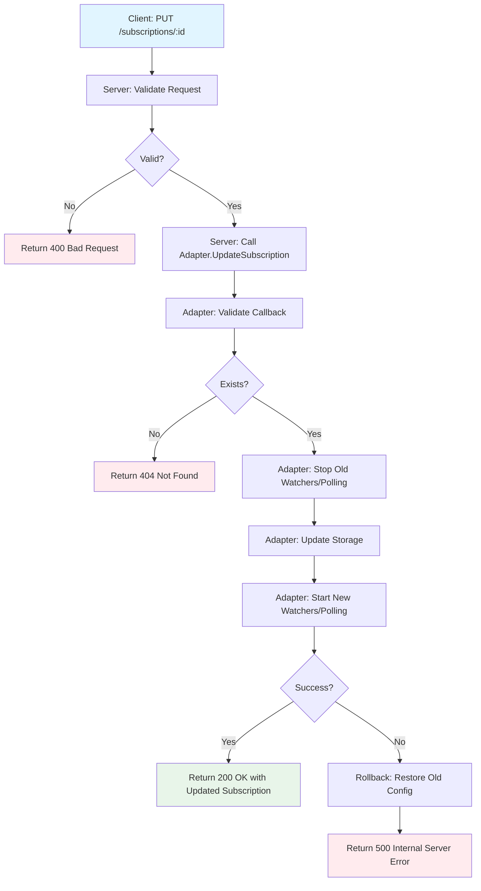

# Subscriptions API

Subscription enables webhook notifications for resource lifecycle events (create, update, delete).

## Table of Contents

1. [O2-IMS Specification](#o2-ims-specification)
2. [Kubernetes Mapping](#kubernetes-mapping)
3. [API Operations](#api-operations)
4. [Update Operation - Detailed Behavior](#update-operation---detailed-behavior)
5. [Webhook Delivery](#webhook-delivery)
6. [Security](#security)
7. [Batch Operations (v2+)](#batch-operations-v2)
8. [Backend-Specific Implementations](#backend-specific-implementations)

## O2-IMS Specification

### Resource Model

```json
{
  "subscriptionId": "550e8400-e29b-41d4-a716-446655440000",
  "callback": "https://smo.example.com/notifications",
  "consumerSubscriptionId": "smo-sub-123",
  "filter": {
    "resourcePoolId": "pool-compute-high-mem",
    "resourceTypeId": "compute-node"
  }
}
```

### Attributes

| Field | Type | Required | Description |
|-------|------|----------|-------------|
| `subscriptionId` | string | ✅ (auto-generated) | Unique ID (UUID format) |
| `callback` | string | ✅ | Webhook URL (HTTPS recommended) |
| `consumerSubscriptionId` | string | ❌ | Client-provided identifier |
| `filter` | object | ❌ | Event filtering criteria |
| `filter.resourcePoolId` | string | ❌ | Filter by pool |
| `filter.resourceTypeId` | string | ❌ | Filter by type |
| `filter.resourceId` | string | ❌ | Filter by specific resource |

## Kubernetes Mapping

**Storage**: Redis (subscriptions are O2-IMS concept, not in K8s)

**Event Sources**: Kubernetes Informers (watch API)
- Node events (add, update, delete)
- Machine events
- MachineSet events
- Pod events (optional)

### Subscription Controller

```go
type SubscriptionController struct {
    redis      *redis.Client
    k8sClient  client.Client
    httpClient *http.Client
}

func (c *SubscriptionController) watchNodeEvents(ctx context.Context) {
    nodeInformer := c.k8sClient.Informer(&corev1.Node{})

    nodeInformer.AddEventHandler(cache.ResourceEventHandlerFuncs{
        AddFunc: func(obj interface{}) {
            node := obj.(*corev1.Node)
            c.notifySubscribers(ctx, "ResourceCreated", transformNodeToO2Resource(node))
        },
        UpdateFunc: func(oldObj, newObj interface{}) {
            node := newObj.(*corev1.Node)
            c.notifySubscribers(ctx, "ResourceUpdated", transformNodeToO2Resource(node))
        },
        DeleteFunc: func(obj interface{}) {
            node := obj.(*corev1.Node)
            c.notifySubscribers(ctx, "ResourceDeleted", transformNodeToO2Resource(node))
        },
    })
}

func (c *SubscriptionController) notifySubscribers(
    ctx context.Context,
    eventType string,
    resource *models.Resource,
) {
    // 1. Get matching subscriptions from Redis
    subs, err := c.getMatchingSubscriptions(ctx, resource)
    if err != nil {
        log.Error("failed to get subscriptions", "error", err)
        return
    }

    // 2. For each subscription, send webhook
    for _, sub := range subs {
        go c.sendWebhook(ctx, sub, eventType, resource)
    }
}
```

## API Operations

### List Subscriptions

```http
GET /o2ims-infrastructureInventory/v1/subscriptions HTTP/1.1
Accept: application/json
```

**Query Parameters**:
- `limit` (int): Max results (default: 100)
- `offset` (int): Pagination offset (default: 0)

**Response (200 OK)**:
```json
{
  "subscriptions": [
    {
      "subscriptionId": "550e8400-e29b-41d4-a716-446655440000",
      "callback": "https://smo.example.com/notifications",
      "consumerSubscriptionId": "smo-sub-123",
      "filter": {
        "resourcePoolId": "pool-compute-high-mem"
      },
      "createdAt": "2026-01-10T10:00:00Z"
    }
  ],
  "total": 1
}
```

**Redis Action**: List subscriptions for tenant from Redis

### Get Subscription

```http
GET /o2ims-infrastructureInventory/v1/subscriptions/{id} HTTP/1.1
Accept: application/json
```

**Response (200 OK)**:
```json
{
  "subscriptionId": "550e8400-e29b-41d4-a716-446655440000",
  "callback": "https://smo.example.com/notifications",
  "consumerSubscriptionId": "smo-sub-123",
  "filter": {
    "resourcePoolId": "pool-compute-high-mem",
    "resourceTypeId": "compute-node"
  },
  "createdAt": "2026-01-10T10:00:00Z"
}
```

**Error Response (404 Not Found)**:
```json
{
  "error": "NotFound",
  "message": "Subscription not found: sub-nonexistent",
  "code": 404
}
```

### Create Subscription

```http
POST /o2ims-infrastructureInventory/v1/subscriptions HTTP/1.1
Content-Type: application/json

{
  "callback": "https://smo.example.com/o2ims/notifications",
  "consumerSubscriptionId": "smo-subscription-456",
  "filter": {
    "resourcePoolId": "pool-gpu-a100"
  }
}
```

**Response (201 Created)**:
```json
{
  "subscriptionId": "sub-a1b2c3d4-e5f6-7890-abcd-1234567890ab",
  "callback": "https://smo.example.com/o2ims/notifications",
  "consumerSubscriptionId": "smo-subscription-456",
  "filter": {
    "resourcePoolId": "pool-gpu-a100"
  },
  "createdAt": "2026-01-12T10:30:00Z"
}
```

**Redis Actions**:
1. Store subscription in Redis
2. Index by resourcePoolId, resourceTypeId
3. Publish `subscriptions:created` event for controller

**Headers**:
```
Location: /o2ims-infrastructureInventory/v1/subscriptions/sub-a1b2c3d4-e5f6-7890-abcd-1234567890ab
```

### Update Subscription

```http
PUT /o2ims-infrastructureInventory/v1/subscriptions/{id} HTTP/1.1
Content-Type: application/json

{
  "callback": "https://new-smo.example.com/notifications",
  "consumerSubscriptionId": "smo-sub-updated",
  "filter": {
    "resourceTypeId": "compute-node"
  }
}
```

**Response (200 OK)**:
```json
{
  "subscriptionId": "550e8400-e29b-41d4-a716-446655440000",
  "callback": "https://new-smo.example.com/notifications",
  "consumerSubscriptionId": "smo-sub-updated",
  "filter": {
    "resourceTypeId": "compute-node"
  },
  "createdAt": "2026-01-10T10:00:00Z",
  "updatedAt": "2026-01-12T11:00:00Z"
}
```

**Redis Actions**:
1. Update subscription in Redis
2. Re-index if filter changed
3. Controller restarts watchers with new filter

See [Update Operation - Detailed Behavior](#update-operation---detailed-behavior) for comprehensive update semantics.

### Delete Subscription

```http
DELETE /o2ims-infrastructureInventory/v1/subscriptions/{id} HTTP/1.1
```

**Response (204 No Content)**: Empty body

**Redis Actions**:
1. Delete subscription from Redis
2. Remove from indexes
3. Controller stops watchers for this subscription

## Update Operation - Detailed Behavior

### Operation Flow



### Validation Rules

#### Server-Level Validation (HTTP Input)

1. **Request Body**:
   - Must be valid JSON
   - Must conform to Subscription schema

2. **Callback URL**:
   - **Required**: Cannot be empty
   - **Format**: Must be valid URL (parseable by `url.Parse`)
   - **Scheme**: Must be `http` or `https` (not `ftp`, `file`, etc.)
   - **Host**: Must have valid host component

   **Examples**:
   ```json
   // ✅ Valid
   {"callback": "https://smo.example.com/notify"}
   {"callback": "http://10.0.0.5:8080/webhooks"}

   // ❌ Invalid - empty
   {"callback": ""}

   // ❌ Invalid - not a URL
   {"callback": "not-a-url"}

   // ❌ Invalid - unsupported scheme
   {"callback": "ftp://example.com/webhook"}
   ```

3. **Filter** (Optional):
   - `null` = Subscribe to all events
   - `{}` = Subscribe to all events (empty filter)
   - Partial filters supported (e.g., only `resourcePoolId`)

#### Adapter-Level Validation (Defense-in-Depth)

Adapters perform additional validation for programmatic calls:
- Callback URL non-empty check
- Subscription existence check

This dual-layer validation ensures:
- **Server** validates external HTTP requests
- **Adapter** validates internal programmatic calls

### Error Scenarios

#### 1. Invalid Request Body (400 Bad Request)

**Trigger**: Malformed JSON or invalid fields

```http
HTTP/1.1 400 Bad Request
Content-Type: application/json

{
  "error": "BadRequest",
  "message": "Invalid request body: unexpected end of JSON input",
  "code": 400
}
```

#### 2. Empty Callback URL (400 Bad Request)

**Trigger**: `callback` field is empty string

```http
HTTP/1.1 400 Bad Request
Content-Type: application/json

{
  "error": "BadRequest",
  "message": "callback URL is required",
  "code": 400
}
```

#### 3. Invalid Callback URL Format (400 Bad Request)

**Trigger**: Callback is not a valid URL

```http
HTTP/1.1 400 Bad Request
Content-Type: application/json

{
  "error": "BadRequest",
  "message": "invalid callback URL format: parse \"not-a-url\": invalid URI for request",
  "code": 400
}
```

#### 4. Unsupported URL Scheme (400 Bad Request)

**Trigger**: Callback uses non-HTTP(S) scheme

```http
HTTP/1.1 400 Bad Request
Content-Type: application/json

{
  "error": "BadRequest",
  "message": "callback URL must use http or https scheme",
  "code": 400
}
```

#### 5. Subscription Not Found (404 Not Found)

**Trigger**: Subscription ID doesn't exist

```http
HTTP/1.1 404 Not Found
Content-Type: application/json

{
  "error": "NotFound",
  "message": "Subscription not found: sub-nonexistent",
  "code": 404
}
```

#### 6. Polling/Watcher Restart Failure (500 Internal Server Error)

**Trigger**: Adapter fails to start new watchers after update

**Adapter Behavior**:
1. Stop old watchers/polling ✅
2. Update subscription in storage ✅
3. Start new watchers/polling ❌ **FAILS**
4. **Rollback**: Restore old subscription configuration
5. **Rollback**: Attempt to restart old watchers (best-effort)

```http
HTTP/1.1 500 Internal Server Error
Content-Type: application/json

{
  "error": "InternalServerError",
  "message": "failed to restart polling: <error details>",
  "code": 500
}
```

**Client Action**:
- Retry the UPDATE request
- Check gateway logs for root cause
- Verify subscription is still in original state (GET /subscriptions/:id)

**Recovery**: Subscription remains in original state (rollback successful)

### Filter Update Behavior

#### Removing Filter (Subscribe to All Events)

```json
{
  "callback": "https://smo.example.com/notify",
  "filter": null
}
```

**Result**: Subscription receives notifications for ALL resource changes (no filtering)

#### Empty Filter (Same as null)

```json
{
  "callback": "https://smo.example.com/notify",
  "filter": {}
}
```

**Result**: Empty filter means no filtering criteria - receives ALL events

#### Partial Filter

```json
{
  "callback": "https://smo.example.com/notify",
  "filter": {
    "resourcePoolId": "pool-compute"
  }
}
```

**Result**: Receives events only for resources in `pool-compute`

#### Complete Filter

```json
{
  "callback": "https://smo.example.com/notify",
  "filter": {
    "resourcePoolId": "pool-compute",
    "resourceTypeId": "machine",
    "resourceId": "res-123"
  }
}
```

**Result**: Receives events only for `res-123` of type `machine` in `pool-compute`

### Idempotency

**Question**: Is UPDATE idempotent?

**Answer**: **Yes**, with caveats:

1. **Same Request Repeated**: Safe to repeat - subscription ends up in desired state
2. **Concurrent UPDATEs**: **Not safe** - last write wins, may lose updates
3. **Recommendation**: Implement optimistic locking with `If-Match` header (future enhancement)

**Example - Safe Retry**:
```bash
# Initial UPDATE
curl -X PUT /subscriptions/sub-123 \
  -d '{"callback": "https://new-url.com"}'
# Response: 500 Internal Server Error

# Retry (safe - idempotent)
curl -X PUT /subscriptions/sub-123 \
  -d '{"callback": "https://new-url.com"}'
# Response: 200 OK
```

## Webhook Delivery

### Notification Format

```json
{
  "subscriptionId": "550e8400-e29b-41d4-a716-446655440000",
  "consumerSubscriptionId": "smo-subscription-456",
  "eventType": "ResourceCreated",
  "resource": {
    "resourceId": "node-gpu-1",
    "resourcePoolId": "pool-gpu-a100",
    "resourceTypeId": "compute-node",
    "extensions": {
      "status": "Ready",
      "cpu": "64",
      "memory": "512Gi"
    }
  },
  "timestamp": "2026-01-12T10:30:00Z"
}
```

### Event Types

| Event Type | Description |
|------------|-------------|
| `ResourceCreated` | New resource added to pool |
| `ResourceUpdated` | Resource properties changed |
| `ResourceDeleted` | Resource removed from pool |

### Delivery Mechanism

```go
func (c *SubscriptionController) sendWebhook(
    ctx context.Context,
    sub *models.Subscription,
    eventType string,
    resource *models.Resource,
) {
    notification := map[string]interface{}{
        "subscriptionId":         sub.SubscriptionID,
        "consumerSubscriptionId": sub.ConsumerSubscriptionID,
        "eventType":              eventType,
        "resource":               resource,
        "timestamp":              time.Now().UTC().Format(time.RFC3339),
    }

    body, _ := json.Marshal(notification)

    // Retry with exponential backoff
    backoff := []time.Duration{1 * time.Second, 2 * time.Second, 4 * time.Second}
    for attempt, delay := range backoff {
        req, _ := http.NewRequestWithContext(ctx, "POST", sub.Callback, bytes.NewReader(body))
        req.Header.Set("Content-Type", "application/json")

        resp, err := c.httpClient.Do(req)
        if err == nil && resp.StatusCode >= 200 && resp.StatusCode < 300 {
            log.Info("webhook delivered", "subscription", sub.SubscriptionID, "attempt", attempt+1)
            return
        }

        log.Warn("webhook failed, retrying", "subscription", sub.SubscriptionID, "attempt", attempt+1)
        time.Sleep(delay)
    }

    log.Error("webhook failed after retries", "subscription", sub.SubscriptionID)
}
```

### Retry Policy

- **Attempts**: 3 retries (total 4 attempts)
- **Backoff**: Exponential (1s, 2s, 4s)
- **Success**: HTTP 2xx response code
- **Failure**: Non-2xx response or network error

## Security

### SSRF Protection

**Blocked Callback URLs**:
- `localhost`, `127.0.0.1`, `::1` (loopback)
- Private IPv4: `10.0.0.0/8`, `172.16.0.0/12`, `192.168.0.0/16`
- Link-local: `169.254.0.0/16`
- IPv6 private: ULA `fc00::/7`, link-local `fe80::/10`

**Example - Rejected Callback**:
```json
POST /o2ims/v1/subscriptions
{
  "callback": "http://localhost/admin",
  "filter": {}
}

→ HTTP 400 Bad Request
{
  "error": "BadRequest",
  "message": "callback URL cannot be localhost",
  "code": 400
}
```

### Webhook Authentication (Future Enhancement)

**Current**: No authentication required for callback URLs

**Planned**: HMAC-SHA256 signature verification

```http
POST https://smo.example.com/notifications HTTP/1.1
Content-Type: application/json
X-Webhook-Signature: sha256=a1b2c3d4e5f6...
X-Webhook-Timestamp: 2026-01-12T10:30:00Z

{...}
```

## Batch Operations (v2+)

**Version**: Available in API v2 and later

Batch operations enable efficient bulk creation and deletion of subscriptions in a single API call.

| Operation | Method | Endpoint | Atomic Support |
|-----------|--------|----------|----------------|
| Batch Create | POST | `/o2ims/v2/batch/subscriptions` | ✅ Yes |
| Batch Delete | POST | `/o2ims/v2/batch/subscriptions/delete` | ✅ Yes |

### Batch Create Subscriptions

**Request**:
```http
POST /o2ims/v2/batch/subscriptions HTTP/1.1
Content-Type: application/json

{
  "subscriptions": [
    {
      "callback": "https://smo.example.com/notify1",
      "consumerSubscriptionId": "smo-sub-1",
      "filter": {
        "resourcePoolId": "pool-compute"
      }
    },
    {
      "callback": "https://smo.example.com/notify2",
      "consumerSubscriptionId": "smo-sub-2",
      "filter": {
        "resourceTypeId": "compute-node"
      }
    }
  ],
  "atomic": false
}
```

**Response**:
```http
HTTP/1.1 200 OK
Content-Type: application/json

{
  "results": [
    {
      "index": 0,
      "status": 201,
      "success": true,
      "data": {
        "subscriptionId": "sub-550e8400-e29b-41d4-a716-446655440000",
        "callback": "https://smo.example.com/notify1",
        "consumerSubscriptionId": "smo-sub-1",
        "createdAt": "2026-01-11T10:00:00Z"
      }
    },
    {
      "index": 1,
      "status": 201,
      "success": true,
      "data": {
        "subscriptionId": "sub-550e8400-e29b-41d4-a716-446655440001",
        "callback": "https://smo.example.com/notify2",
        "consumerSubscriptionId": "smo-sub-2",
        "createdAt": "2026-01-11T10:00:01Z"
      }
    }
  ],
  "success": true,
  "successCount": 2,
  "failureCount": 0
}
```

### Atomic Batch Operations

When `atomic: true`, all operations must succeed or all are rolled back:

**Request**:
```http
POST /o2ims/v2/batch/subscriptions HTTP/1.1
Content-Type: application/json

{
  "subscriptions": [
    {"callback": "https://smo.example.com/notify1"},
    {"callback": "invalid-url"}  // This will fail
  ],
  "atomic": true
}
```

**Response**:
```http
HTTP/1.1 400 Bad Request
Content-Type: application/json

{
  "results": [
    {
      "index": 0,
      "status": 409,
      "success": false,
      "error": {
        "error": "RolledBack",
        "message": "Operation rolled back due to atomic batch failure",
        "code": 409
      }
    },
    {
      "index": 1,
      "status": 400,
      "success": false,
      "error": {
        "error": "BadRequest",
        "message": "Invalid callback URL",
        "code": 400
      }
    }
  ],
  "success": false,
  "successCount": 0,
  "failureCount": 2
}
```

### Batch Operation Constraints

- **Min batch size:** 1 operation
- **Max batch size:** 100 operations per request
- **Concurrency limit:** 10 concurrent operations per batch
- **Timeout:** Standard API timeout applies to entire batch
- **HTTP Status Codes:**
  - `200 OK` - All operations succeeded
  - `207 Multi-Status` - Partial success
  - `400 Bad Request` - All failed or atomic batch failed

## Backend-Specific Implementations

### Kubernetes Adapter

**Storage**: Redis
**Notification**: Kubernetes Informers

**Update Flow**:
1. Validate callback URL
2. Get existing subscription from Redis
3. Update in Redis (atomic)
4. Controller detects change via Redis watch
5. Controller restarts Kubernetes informers with new filter

**Rollback**: Redis update is atomic - no rollback needed

### OpenStack Adapter

**Storage**: In-memory map with `sync.RWMutex`
**Notification**: Polling goroutines

**Update Flow**:
1. Validate callback
2. Acquire write lock
3. Stop old polling goroutine
4. Update in memory
5. Start new polling goroutine
6. Release lock

**Rollback**: If polling start fails, restore old subscription and restart old polling (best-effort)

**Race Prevention**: Hold lock from update through successful polling start

### AWS, Azure, GCP, VMware Adapters

**Storage**: In-memory map with `sync.Mutex` or `sync.RWMutex`
**Notification**: Cloud-provider event streams

**Update Flow**:
1. Validate callback
2. Acquire lock
3. Update in memory
4. Release lock

**Rollback**: N/A (in-memory update is atomic)

**Note**: These adapters don't start/stop watchers on update - subscriptions are passive filters on existing event streams.

## Monitoring and Metrics

**Metrics Recorded**:
- `o2ims_adapter_operations_total{adapter="kubernetes",operation="UpdateSubscription",status="success|error"}`
- `o2ims_adapter_operation_duration_seconds{adapter="kubernetes",operation="UpdateSubscription"}`
- `o2ims_webhook_deliveries_total{status="success|error"}`
- `o2ims_webhook_delivery_duration_seconds`

**Logs**:
- `subscription created` (INFO)
- `subscription updated` (INFO)
- `subscription deleted` (INFO)
- `webhook delivered` (INFO)
- `webhook failed` (WARN)
- `failed to restart polling` (ERROR) - Rollback triggered
- `failed to rollback` (ERROR) - Critical failure

**Alerting Recommendations**:
- Alert on `UpdateSubscription` error rate > 5%
- Alert on webhook delivery failures > 10%
- Alert on rollback failures (critical - data inconsistency)

## Related Documentation

- [O2-IMS Overview](README.md)
- [Resource Pools](resource-pools.md)
- [Resources](resources.md)
- [Webhook Security Guide](../../webhook-security.md)
