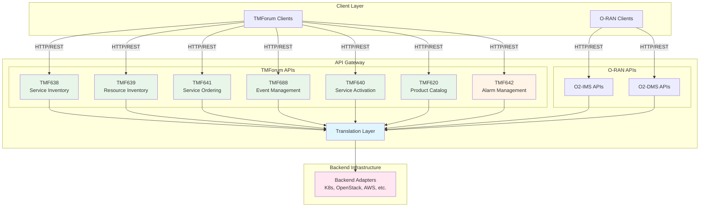

# TMForum Open API Support

The O2-IMS Gateway provides comprehensive TMForum API compatibility by implementing a translation layer between TMForum Open APIs and the native O-RAN O2-IMS/O2-DMS interfaces. This enables TMForum-compliant systems to seamlessly interact with O-RAN infrastructure using industry-standard APIs.

## Overview

TMForum Open APIs provide a standardized, carrier-grade approach to telecommunications service management. By supporting these APIs alongside O-RAN standards, the gateway enables:

- **Multi-standard interoperability**: Support both O-RAN and TMForum clients simultaneously
- **Vendor flexibility**: Choose tools and systems based on TMForum or O-RAN ecosystems
- **Migration paths**: Gradual transition between API standards
- **Standards compliance**: Adherence to both TM Forum and O-RAN specifications

## Architecture



## Supported TMForum APIs

### Core Inventory & Service APIs

| API | Version | Status | Description |
|-----|---------|--------|-------------|
| **[TMF638](tmf638-service-inventory.md)** | v4 | ✅ Complete | Service Inventory Management |
| **[TMF639](tmf639-resource-inventory.md)** | v4 | ✅ Complete | Resource Inventory Management |
| **TMF641** | v4 | ✅ Complete | Service Ordering Management |
| **TMF640** | v4 | ✅ Complete | Service Activation & Configuration |
| **TMF620** | v4 | ✅ Complete | Product Catalog Management |

### Event & Monitoring APIs

| API | Version | Status | Description |
|-----|---------|--------|-------------|
| **TMF688** | v4 | ✅ Complete | Event Management (Hub subscription + webhooks) |
| **TMF642** | v4 | ⚠️ Partial | Alarm Management (basic handlers implemented) |

## API Base Paths

All TMForum APIs are available under the `/tmf-api/` prefix:

```
https://<gateway-host>/tmf-api/resourceInventoryManagement/v4
https://<gateway-host>/tmf-api/serviceInventoryManagement/v4
https://<gateway-host>/tmf-api/serviceOrdering/v4
https://<gateway-host>/tmf-api/eventManagement/v4
https://<gateway-host>/tmf-api/serviceActivation/v4
https://<gateway-host>/tmf-api/productCatalog/v4
https://<gateway-host>/tmf-api/alarmManagement/v4
```

## Quick Start

### Prerequisites

- O2-IMS Gateway deployed and running
- Backend adapters configured (Kubernetes, OpenStack, etc.)
- TMForum-compliant client or tool

### Example: List Resources (TMF639)

```bash
curl -X GET https://gateway.example.com/tmf-api/resourceInventoryManagement/v4/resource \
  -H "Authorization: Bearer <token>"
```

Response:
```json
[
  {
    "id": "pool-us-east-1",
    "href": "/tmf-api/resourceInventoryManagement/v4/resource/pool-us-east-1",
    "name": "US East Compute Pool",
    "category": "resourcePool",
    "resourceStatus": "available",
    "operationalState": "enabled",
    "place": [
      {"id": "us-east-1", "name": "US East Region"}
    ],
    "resourceCharacteristic": [
      {"name": "type", "value": "compute-pool"},
      {"name": "provider", "value": "kubernetes"}
    ],
    "@type": "ResourcePool",
    "@baseType": "Resource"
  }
]
```

### Example: Create Service (TMF638)

```bash
curl -X POST https://gateway.example.com/tmf-api/serviceInventoryManagement/v4/service \
  -H "Content-Type: application/json" \
  -H "Authorization: Bearer <token>" \
  -d '{
    "name": "5G Core Network Function",
    "description": "5G UPF deployment",
    "serviceType": "network-function",
    "serviceSpecification": {
      "id": "upf-v1.0",
      "name": "User Plane Function"
    },
    "serviceCharacteristic": [
      {"name": "replicas", "value": "3"},
      {"name": "version", "value": "1.0.0"}
    ]
  }'
```

### Example: Register Event Hub (TMF688)

```bash
curl -X POST https://gateway.example.com/tmf-api/eventManagement/v4/hub \
  -H "Content-Type: application/json" \
  -H "Authorization: Bearer <token>" \
  -d '{
    "callback": "https://consumer.example.com/webhook",
    "query": "resourceTypeId=node&eventType=ResourceCreationNotification"
  }'
```

## API Mappings

### TMF639 ↔ O2-IMS

| TMForum Concept | O-RAN Concept | Notes |
|----------------|---------------|-------|
| Resource (category="resourcePool") | ResourcePool | Physical/logical infrastructure pools |
| Resource (other categories) | Resource | Individual infrastructure elements |
| resourceCharacteristic | extensions | Flexible key-value attributes |
| resourceStatus | administrativeState | Lifecycle state |
| operationalState | operationalState | Runtime operational status |
| place | location | Geographic/logical location |

### TMF638 ↔ O2-DMS

| TMForum Concept | O-RAN Concept | Notes |
|----------------|---------------|-------|
| Service | Deployment | Deployed workload instances |
| serviceSpecification | packageId | Reference to deployment package |
| serviceCharacteristic | extensions | Deployment parameters |
| state | status | Deployment lifecycle state |
| startDate | createdAt | Creation timestamp |

### TMF641 ↔ O2-DMS

| TMForum Concept | O-RAN Concept | Notes |
|----------------|---------------|-------|
| ServiceOrder | Deployment Request | Orchestration of service deployment |
| ServiceOrderItem | Deployment Spec | Individual service to deploy |
| state | status | Order/deployment state |
| orderDate | createdAt | Order creation time |

### TMF688 ↔ O2-IMS Subscriptions

| TMForum Concept | O-RAN Concept | Notes |
|----------------|---------------|-------|
| Hub (callback URL) | Subscription | Webhook registration for events |
| query parameters | filter | Event filtering criteria |
| Event notifications | Resource events | Lifecycle change notifications |

## State Mappings

### Service/Deployment States

| TMF638/TMF641 State | O2-DMS Status | Description |
|---------------------|---------------|-------------|
| `pending` | Pending | Waiting to start |
| `inProgress` | Installing, Upgrading | Actively processing |
| `activated`/`completed` | Installed | Successfully deployed |
| `failed` | Failed | Deployment failed |
| `cancelled` | - | Order cancelled |

### Resource States

| TMF639 resourceStatus | O2-IMS administrativeState | Description |
|-----------------------|---------------------------|-------------|
| `available` | unlocked | Available for use |
| `reserved` | locked | Reserved/in-use |
| `unavailable` | shutting-down | Not available |

## Common Patterns

### Filtering and Pagination

TMForum APIs support standard query parameters:

```bash
# Filter by attribute
GET /tmf-api/resourceInventoryManagement/v4/resource?category=compute

# Pagination
GET /tmf-api/serviceInventoryManagement/v4/service?offset=20&limit=10

# Field selection
GET /tmf-api/resourceInventoryManagement/v4/resource?fields=id,name,resourceStatus
```

### Error Handling

All APIs return standard TMForum error format:

```json
{
  "error": "NotFound",
  "message": "Resource with ID 'abc123' not found"
}
```

Common HTTP status codes:
- `200 OK` - Success
- `201 Created` - Resource created
- `400 Bad Request` - Invalid request
- `404 Not Found` - Resource not found
- `500 Internal Server Error` - Server error
- `501 Not Implemented` - Feature not yet implemented

### HATEOAS Links

All resources include HATEOAS links for navigation:

```json
{
  "id": "resource-123",
  "href": "/tmf-api/resourceInventoryManagement/v4/resource/resource-123",
  "relatedParty": [
    {
      "id": "pool-456",
      "href": "/tmf-api/resourceInventoryManagement/v4/resource/pool-456",
      "role": "ResourcePool"
    }
  ]
}
```

## Event Management (TMF688)

### Hub Registration

Register a webhook endpoint to receive event notifications:

```bash
curl -X POST https://gateway.example.com/tmf-api/eventManagement/v4/hub \
  -H "Content-Type: application/json" \
  -d '{
    "callback": "https://consumer.example.com/notifications",
    "query": "resourceTypeId=node&eventType=ResourceCreationNotification"
  }'
```

### Supported Event Types

- `ResourceCreationNotification` - New resource created
- `ResourceStateChangeNotification` - Resource state changed
- `ResourceRemoveNotification` - Resource deleted
- `ResourceAttributeValueChangeNotification` - Resource attributes updated
- `ServiceOrderStateChangeEvent` - Service order state changed
- `ServiceOrderCreationNotification` - New service order created
- `ServiceOrderStateChangeNotification` - Service order state changed
- `AlarmCreatedNotification` - New alarm created
- `AlarmStateChangeNotification` - Alarm state changed
- `AlarmClearedNotification` - Alarm cleared

### Event Payload Example

```json
{
  "eventId": "evt-123",
  "eventTime": "2026-01-16T10:30:00Z",
  "eventType": "ResourceCreationNotification",
  "domain": "resource",
  "event": {
    "resource": {
      "id": "node-001",
      "name": "Edge Node 1",
      "category": "compute",
      "resourceStatus": "available"
    }
  }
}
```

## Authentication & Authorization

The TMForum APIs use the same authentication as the O-RAN APIs:

- **mTLS**: Mutual TLS for production deployments
- **JWT Tokens**: Bearer token authentication
- **RBAC**: Role-based access control

See [Authentication Guide](../../security.md) for details.

## Performance & Scalability

- **Stateless design**: All TMForum handlers are stateless
- **Shared backend**: Uses same adapters as O-RAN APIs
- **Caching**: Redis-based caching for frequently accessed data
- **Concurrent access**: Thread-safe implementation

Performance targets:
- API response time: p95 < 100ms, p99 < 500ms
- Event delivery: < 1s end-to-end
- Concurrent requests: 1000+ req/s per pod

## Compliance & Standards

All implemented TMForum APIs conform to:

- [TMForum Open API Standards](https://www.tmforum.org/open-apis/)
- RESTful design principles
- JSON data format
- HATEOAS linking
- Standard error responses

## Troubleshooting

### Common Issues

**Problem**: 404 errors for all TMForum endpoints

**Solution**: Verify TMForum routes are registered. Check server logs for route initialization.

**Problem**: Empty resource/service lists

**Solution**: Ensure backend adapters are configured and returning data. Check adapter health.

**Problem**: Events not being delivered to hubs

**Solution**:
1. Verify hub callback URL is accessible
2. Check webhook publisher logs for retry attempts
3. Ensure O2-IMS subscriptions are active
4. Verify Redis Stream is receiving events

## Migration Guide

### From O-RAN to TMForum

If you're using O-RAN APIs and want to migrate to TMForum:

1. **Identify equivalents**: Use mapping tables above
2. **Update endpoints**: Change base paths from `/o2ims-*` to `/tmf-api/*`
3. **Adapt data models**: Map O-RAN structures to TMForum structures
4. **Test thoroughly**: Verify behavior matches expectations

### Dual API Usage

You can use both APIs simultaneously:

```python
# O-RAN API
response = requests.get("https://gateway/o2ims-infrastructureInventory/v1/resourcePools")

# TMForum API (same data, different format)
response = requests.get("https://gateway/tmf-api/resourceInventoryManagement/v4/resource?category=resourcePool")
```

## Additional Resources

- [TMF639 Resource Inventory API Reference](tmf639-resource-inventory.md)
- [TMF638 Service Inventory API Reference](tmf638-service-inventory.md)
- [TMForum Implementation Status](../../tmforum-implementation-status.md)
- [API Mapping Guide](../../api-mapping.md)
- [Architecture Overview](../../architecture.md)

## Support

For issues or questions:
- GitHub Issues: [netweave/issues](https://github.com/piwi3910/netweave/issues)
- Documentation: [docs/](../../)
- O-RAN Specifications: [o-ran.org](https://www.o-ran.org/)
- TMForum Specifications: [tmforum.org](https://www.tmforum.org/open-apis/)
