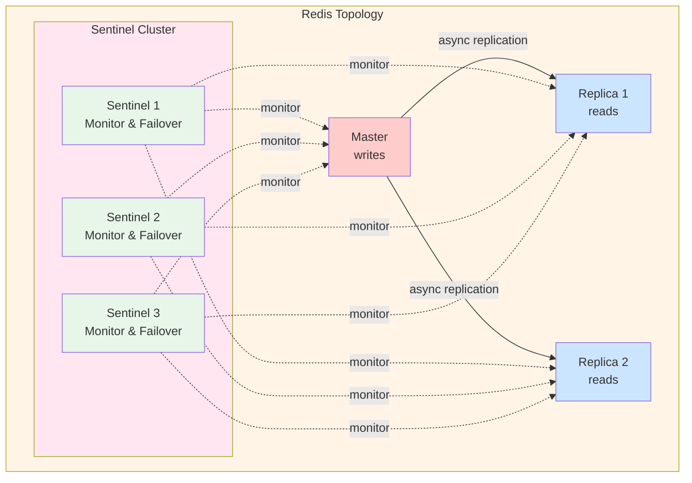
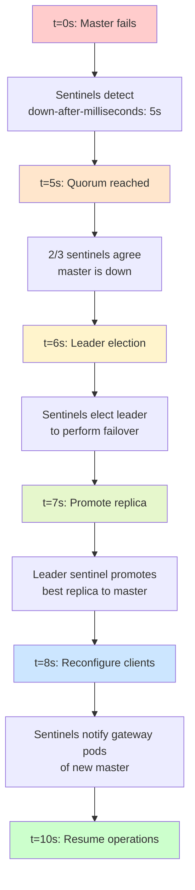
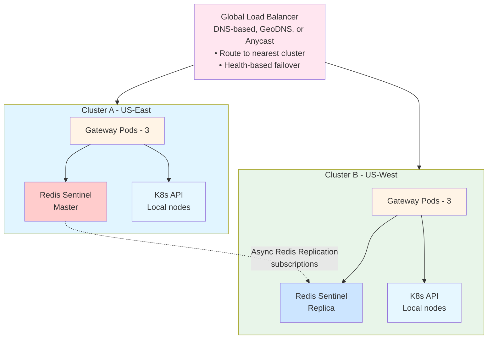
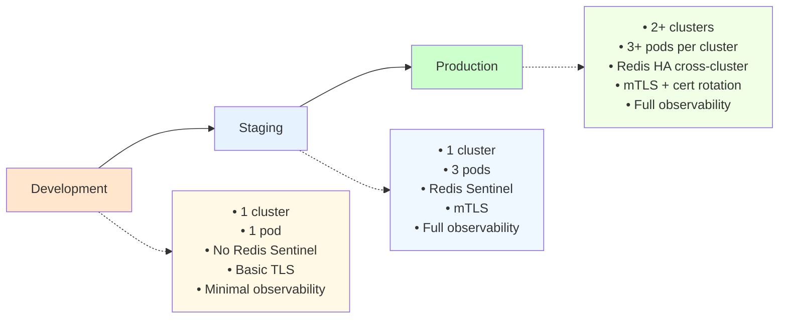
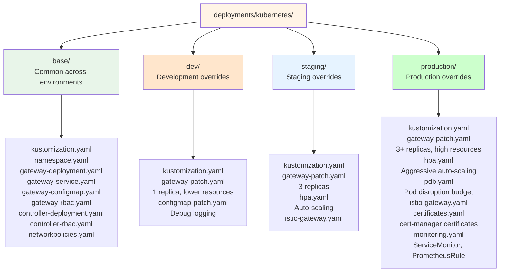
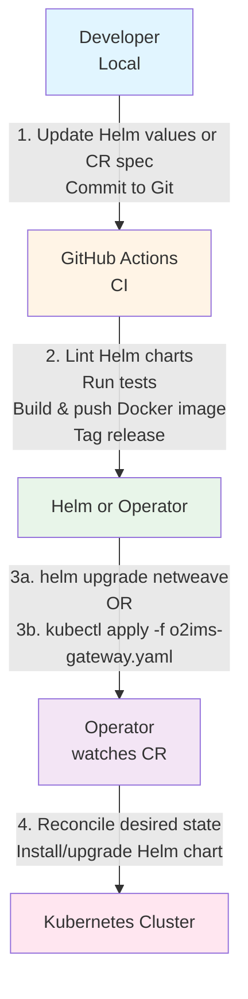

# netweave O2-IMS Gateway - Architecture Documentation (Part 2)

## High Availability & Disaster Recovery

### HA Strategy

**Goal**: 99.9% uptime (< 8.76 hours downtime/year)

#### Component HA Matrix

| Component | HA Strategy | Failure Detection | Recovery Time | Data Loss |
|-----------|-------------|-------------------|---------------|-----------|
| Gateway Pods | 3+ replicas, anti-affinity | Readiness probe (5s) | Instant | None (stateless) |
| Redis Master | Sentinel failover | Sentinel (5s) | < 30s | None (AOF) |
| Redis Replicas | 2+ replicas | Sentinel (5s) | N/A | None |
| Subscription Controller | Leader election | Lease heartbeat (15s) | < 30s | None (Redis state) |
| Kubernetes API | Built-in K8s HA | etcd consensus | N/A | None |
| Ingress Controller | 2+ replicas | Liveness probe (10s) | Instant | None (stateless) |

### Gateway Pod HA

**Deployment Strategy**:
```yaml
apiVersion: apps/v1
kind: Deployment
metadata:
  name: netweave-gateway
spec:
  replicas: 3
  strategy:
    type: RollingUpdate
    rollingUpdate:
      maxUnavailable: 1
      maxSurge: 1

  template:
    spec:
      # Pod anti-affinity: spread across nodes
      affinity:
        podAntiAffinity:
          requiredDuringSchedulingIgnoredDuringExecution:
            - labelSelector:
                matchLabels:
                  app: netweave-gateway
              topologyKey: kubernetes.io/hostname

      # Topology spread: spread across zones
      topologySpreadConstraints:
        - maxSkew: 1
          topologyKey: topology.kubernetes.io/zone
          whenUnsatisfiable: DoNotSchedule
          labelSelector:
            matchLabels:
              app: netweave-gateway

      containers:
        - name: gateway
          livenessProbe:
            httpGet:
              path: /healthz
              port: 8080
            initialDelaySeconds: 10
            periodSeconds: 10
            timeoutSeconds: 5
            failureThreshold: 3

          readinessProbe:
            httpGet:
              path: /ready
              port: 8080
            initialDelaySeconds: 5
            periodSeconds: 5
            timeoutSeconds: 3
            failureThreshold: 2

          # Resource requests/limits
          resources:
            requests:
              memory: "256Mi"
              cpu: "250m"
            limits:
              memory: "512Mi"
              cpu: "500m"
```

**Failure Scenarios**:

1. **Pod Crash**
   - Detection: Liveness probe fails (30s)
   - Action: Kubernetes restarts container
   - Impact: Single pod unavailable, traffic routes to healthy pods
   - Recovery: New container ready in < 30s

2. **Node Failure**
   - Detection: Node NotReady (40s)
   - Action: Pods rescheduled to healthy nodes
   - Impact: Pods on failed node unavailable
   - Recovery: Pods running on new nodes in < 2 minutes

3. **Zone Failure**
   - Detection: All nodes in zone NotReady
   - Action: Topology spread ensures pods in other zones
   - Impact: Reduced capacity, no outage
   - Recovery: Scale up in remaining zones if needed

### Redis HA (Sentinel)

**Deployment**: 1 master + 2 replicas + 3 sentinels



**Failover Process**:


Gateway pods reconnect to new master.

**Total downtime**: < 30s

**Data Durability**:
```yaml
# Redis configuration
appendonly yes                 # AOF enabled
appendfsync everysec          # Fsync every second
save 900 1                    # RDB snapshot every 15min if ≥1 key changed
save 300 10                   # RDB snapshot every 5min if ≥10 keys changed
save 60 10000                 # RDB snapshot every 1min if ≥10k keys changed

# Worst-case data loss:
# - 1 second of data (between fsync calls)
# - Acceptable for subscription data (SMO can re-subscribe)
```

### Subscription Controller HA

**Leader Election**:
```go
func (c *Controller) Run(ctx context.Context) error {
    // Use Kubernetes Lease for leader election
    lock := &resourcelock.LeaseLock{
        LeaseMeta: metav1.ObjectMeta{
            Name:      "subscription-controller-leader",
            Namespace: "o2ims-system",
        },
        Client: c.k8sClient,
        LockConfig: resourcelock.ResourceLockConfig{
            Identity: c.podName,
        },
    }

    leaderelection.RunOrDie(ctx, leaderelection.LeaderElectionConfig{
        Lock:          lock,
        LeaseDuration: 15 * time.Second,
        RenewDeadline: 10 * time.Second,
        RetryPeriod:   2 * time.Second,
        Callbacks: leaderelection.LeaderCallbacks{
            OnStartedLeading: func(ctx context.Context) {
                log.Info("became leader, starting controller")
                c.runController(ctx)
            },
            OnStoppedLeading: func() {
                log.Info("lost leadership, stopping controller")
                c.stopController()
            },
        },
    })
}
```

**Failover**:
- Leader heartbeat every 15s
- If leader misses 2 heartbeats (30s), new leader elected
- New leader resumes from Redis state (no data loss)
- Webhook queue preserved in Redis

### Disaster Recovery

#### Backup Strategy

**What to Backup**:
1. **Redis Data** (subscriptions, critical)
   - Method: RDB snapshots to persistent volume
   - Frequency: Every 5 minutes
   - Retention: 7 days

2. **Kubernetes Resources** (configuration)
   - Method: GitOps (all manifests in Git)
   - Frequency: Continuous (Git commits)
   - Retention: Infinite (Git history)

3. **Application Logs** (audit)
   - Method: Centralized logging (ELK/Loki)
   - Frequency: Real-time streaming
   - Retention: 30 days

**Redis Backup**:
```bash
#!/bin/bash
# Scheduled CronJob in Kubernetes

# 1. Trigger RDB snapshot
redis-cli -h redis-master BGSAVE

# 2. Wait for completion
while [ $(redis-cli -h redis-master LASTSAVE) -eq $LASTSAVE ]; do
  sleep 1
done

# 3. Copy RDB to persistent storage
kubectl cp o2ims-system/redis-master-0:/data/dump.rdb \
  /backups/redis/dump-$(date +%Y%m%d-%H%M%S).rdb

# 4. Upload to object storage (S3, GCS, etc.)
aws s3 cp /backups/redis/dump-*.rdb \
  s3://netweave-backups/redis/
```

#### Recovery Procedures

**Scenario 1: Complete Cluster Failure**

```bash
# 1. Provision new Kubernetes cluster
# 2. Install prerequisites (cert-manager, ingress controller)
kubectl apply -f https://github.com/cert-manager/cert-manager/releases/download/v1.15.0/cert-manager.yaml

# 3. Install Redis via Helm
helm repo add bitnami https://charts.bitnami.com/bitnami
helm install redis bitnami/redis --set sentinel.enabled=true

# 4. Restore Redis data from backup
kubectl create -f redis-restore-job.yaml  # Loads from S3

# 5. Deploy netweave via Helm
helm install netweave ./helm/netweave \
  --values helm/netweave/values-production.yaml

# 6. Or via Custom Resource with Operator
kubectl apply -f - <<EOF
apiVersion: o2ims.oran.org/v1alpha1
kind: O2IMSGateway
metadata:
  name: netweave-production
spec:
  replicas: 3
  version: "v1.0.0"
  redis:
    sentinel: true
EOF

# 7. Verify
make verify-deployment
```

**Recovery Time Objective (RTO)**: 30 minutes
**Recovery Point Objective (RPO)**: 5 minutes

**Scenario 2: Redis Data Corruption**

```bash
# 1. Stop Redis writes
kubectl scale deployment netweave-gateway --replicas=0

# 2. Stop Redis
kubectl exec redis-master-0 -- redis-cli SHUTDOWN NOSAVE

# 3. Restore from latest backup
kubectl cp s3://netweave-backups/redis/dump-latest.rdb \
  o2ims-system/redis-master-0:/data/dump.rdb

# 4. Start Redis
kubectl exec redis-master-0 -- redis-server /etc/redis/redis.conf

# 5. Verify data
kubectl exec redis-master-0 -- redis-cli DBSIZE

# 6. Resume gateway
kubectl scale deployment netweave-gateway --replicas=3
```

**RTO**: 10 minutes
**RPO**: 5 minutes

---

## Scalability

### Horizontal Scaling

#### Gateway Pods

**Scaling Metrics**:
```yaml
apiVersion: autoscaling/v2
kind: HorizontalPodAutoscaler
metadata:
  name: netweave-gateway-hpa
spec:
  scaleTargetRef:
    apiVersion: apps/v1
    kind: Deployment
    name: netweave-gateway

  minReplicas: 3
  maxReplicas: 20

  metrics:
    # CPU-based scaling
    - type: Resource
      resource:
        name: cpu
        target:
          type: Utilization
          averageUtilization: 70

    # Memory-based scaling
    - type: Resource
      resource:
        name: memory
        target:
          type: Utilization
          averageUtilization: 80

    # Custom metric: request rate
    - type: Pods
      pods:
        metric:
          name: http_requests_per_second
        target:
          type: AverageValue
          averageValue: "1000"  # Scale if > 1000 req/s per pod
```

**Scaling Behavior**:
```yaml
behavior:
  scaleUp:
    stabilizationWindowSeconds: 60
    policies:
      - type: Percent
        value: 50         # Scale up by 50% at a time
        periodSeconds: 60
      - type: Pods
        value: 2          # Or add 2 pods, whichever is larger
        periodSeconds: 60

  scaleDown:
    stabilizationWindowSeconds: 300  # Wait 5min before scaling down
    policies:
      - type: Percent
        value: 10         # Scale down by 10% at a time
        periodSeconds: 60
```

**Scaling Limits**:
- Minimum: 3 pods (HA)
- Maximum: 20 pods (per cluster)
- CPU: 70% utilization target
- Memory: 80% utilization target
- Requests: 1000 req/s per pod

**Capacity Planning**:
```
Single Pod Capacity:
- Requests: 1000 req/s
- CPU: 500m (0.5 core)
- Memory: 512Mi

Cluster Capacity (20 pods):
- Requests: 20,000 req/s
- Throughput: ~2M requests/hour
- Concurrent users: 10,000+
```

#### Redis Scaling

**Vertical Scaling** (single cluster):
```yaml
# Increase memory and CPU
resources:
  requests:
    memory: "4Gi"   # From 2Gi
    cpu: "1000m"    # From 500m
  limits:
    memory: "8Gi"
    cpu: "2000m"
```

**Read Scaling** (add replicas):
```yaml
replica:
  replicaCount: 5  # From 2

# Gateway pods can read from replicas
# Writes always go to master
```

**Redis Cluster** (horizontal sharding):
```
For very large datasets (> 10GB), switch to Redis Cluster:
- 3+ master nodes (sharding)
- 2+ replicas per master
- Automatic data partitioning
- Higher complexity
```

### Vertical Scaling

**When to Scale Vertically**:
- High memory usage (> 80% consistently)
- High CPU usage (> 70% consistently)
- Before hitting resource limits

**Pod Resource Sizes**:
```yaml
# Small (dev/test)
resources:
  requests: {memory: "128Mi", cpu: "100m"}
  limits: {memory: "256Mi", cpu: "250m"}

# Medium (staging, small production)
resources:
  requests: {memory: "256Mi", cpu: "250m"}
  limits: {memory: "512Mi", cpu: "500m"}

# Large (production)
resources:
  requests: {memory: "512Mi", cpu: "500m"}
  limits: {memory: "1Gi", cpu: "1000m"}

# X-Large (high load)
resources:
  requests: {memory: "1Gi", cpu: "1000m"}
  limits: {memory: "2Gi", cpu: "2000m"}
```

### Multi-Cluster Scaling

**Single vs Multi-Cluster**:

| Aspect | Single Cluster | Multi-Cluster |
|--------|----------------|---------------|
| Complexity | Low | High |
| Latency | Low (< 10ms) | Medium (5-50ms cross-region) |
| Availability | 99.9% | 99.99% |
| Disaster Recovery | Backup/restore | Active-active |
| Cost | Lower | Higher |
| Data Consistency | Strong | Eventual |

**Multi-Cluster Architecture**:


**Cross-Cluster Setup**:
```bash
# Cluster A: Primary (Master)
helm install redis bitnami/redis \
  --set sentinel.enabled=true \
  --set master.service.type=LoadBalancer

# Cluster B: Replica of Cluster A
CLUSTER_A_IP=$(kubectl get svc redis-master --context=cluster-a -o jsonpath='{.status.loadBalancer.ingress[0].ip}')

helm install redis bitnami/redis \
  --set sentinel.enabled=true \
  --set replica.externalMaster.enabled=true \
  --set replica.externalMaster.host=${CLUSTER_A_IP} \
  --context=cluster-b
```

---

## Deployment Architecture

### Deployment Topology



### Kubernetes Manifests Structure



### Deployment Workflow (Helm + Operator)



### Helm-Based Deployment

**Direct Helm Deployment**:
```bash
# Development
helm install netweave ./helm/netweave \
  --namespace o2ims-system \
  --create-namespace \
  --values helm/netweave/values-dev.yaml

# Staging
helm upgrade --install netweave ./helm/netweave \
  --namespace o2ims-system \
  --values helm/netweave/values-staging.yaml

# Production
helm upgrade --install netweave ./helm/netweave \
  --namespace o2ims-system \
  --values helm/netweave/values-production.yaml \
  --wait \
  --timeout 5m
```

**Helm Values Structure**:
```yaml
# helm/netweave/values-production.yaml
replicaCount: 3

image:
  repository: ghcr.io/yourorg/netweave
  tag: "v1.0.0"
  pullPolicy: IfNotPresent

tls:
  enabled: true
  certManager:
    enabled: true
    issuer: ca-issuer
    duration: 2160h  # 90 days

redis:
  enabled: true
  sentinel:
    enabled: true
    quorum: 2
  master:
    persistence:
      enabled: true
      size: 8Gi

resources:
  requests:
    memory: "512Mi"
    cpu: "500m"
  limits:
    memory: "1Gi"
    cpu: "1000m"

autoscaling:
  enabled: true
  minReplicas: 3
  maxReplicas: 20
  targetCPUUtilizationPercentage: 70
```

### Operator-Based Deployment

**Custom Resource Definition**:
```yaml
apiVersion: apiextensions.k8s.io/v1
kind: CustomResourceDefinition
metadata:
  name: o2imsgateways.o2ims.oran.org
spec:
  group: o2ims.oran.org
  names:
    kind: O2IMSGateway
    plural: o2imsgateways
    singular: o2imsgateway
    shortNames:
      - o2gw
  scope: Namespaced
  versions:
    - name: v1alpha1
      served: true
      storage: true
      schema:
        openAPIV3Schema:
          type: object
          properties:
            spec:
              type: object
              properties:
                replicas:
                  type: integer
                  minimum: 1
                version:
                  type: string
                tls:
                  type: object
                  properties:
                    enabled:
                      type: boolean
                    issuerRef:
                      type: object
                      properties:
                        name:
                          type: string
                        kind:
                          type: string
                redis:
                  type: object
                  properties:
                    sentinel:
                      type: boolean
                    replicas:
                      type: integer
```

**Custom Resource Example**:
```yaml
apiVersion: o2ims.oran.org/v1alpha1
kind: O2IMSGateway
metadata:
  name: netweave-production
  namespace: o2ims-system
spec:
  # Gateway configuration
  replicas: 3
  version: "v1.0.0"

  # TLS configuration
  tls:
    enabled: true
    issuerRef:
      name: ca-issuer
      kind: ClusterIssuer

  # Redis configuration
  redis:
    sentinel: true
    replicas: 3
    persistence:
      enabled: true
      size: 8Gi

  # Subscription controller
  subscriptionController:
    enabled: true
    replicas: 3
    leaderElection: true

  # Autoscaling
  autoscaling:
    enabled: true
    minReplicas: 3
    maxReplicas: 20
    targetCPU: 70

  # Monitoring
  monitoring:
    enabled: true
    prometheus:
      enabled: true
    grafana:
      enabled: true
```

**Operator Reconciliation Loop**:
```go
// Operator watches O2IMSGateway CRs and reconciles
func (r *O2IMSGatewayReconciler) Reconcile(ctx context.Context, req ctrl.Request) (ctrl.Result, error) {
    // 1. Fetch the O2IMSGateway CR
    gateway := &o2imsv1alpha1.O2IMSGateway{}
    if err := r.Get(ctx, req.NamespacedName, gateway); err != nil {
        return ctrl.Result{}, client.IgnoreNotFound(err)
    }

    // 2. Generate Helm values from CR spec
    helmValues := generateHelmValues(gateway)

    // 3. Install or upgrade Helm chart
    if err := r.helmClient.UpgradeInstall(
        "netweave",
        "./helm/netweave",
        helmValues,
    ); err != nil {
        return ctrl.Result{}, err
    }

    // 4. Update CR status
    gateway.Status.Phase = "Running"
    gateway.Status.Replicas = gateway.Spec.Replicas
    return ctrl.Result{}, r.Status().Update(ctx, gateway)
}
```

### Deployment Process

#### Rolling Update (Zero-Downtime)

```yaml
# Deployment strategy
strategy:
  type: RollingUpdate
  rollingUpdate:
    maxUnavailable: 1    # At most 1 pod down
    maxSurge: 1          # At most 1 extra pod

# Process:
# 1. Create 1 new pod (v2)
# 2. Wait for ready (readiness probe)
# 3. Terminate 1 old pod (v1)
# 4. Repeat until all pods are v2
```

**Timeline**:
```
t=0s:   3 pods v1 running
t=30s:  1 pod v2 created, becoming ready
t=35s:  1 pod v2 ready, serving traffic
t=36s:  1 pod v1 terminated → 2 v1 + 1 v2
t=66s:  1 pod v2 created
t=71s:  1 pod v2 ready → 1 v1 + 2 v2
t=72s:  1 pod v1 terminated
t=102s: 1 pod v2 created
t=107s: 1 pod v2 ready → 3 v2
t=108s: 1 pod v1 terminated → complete

Total: ~2 minutes, zero downtime
```

#### Blue-Green Deployment (Maximum Safety)

```yaml
# Deploy v2 alongside v1
apiVersion: apps/v1
kind: Deployment
metadata:
  name: netweave-gateway-v2
spec:
  replicas: 3
  selector:
    matchLabels:
      app: netweave-gateway
      version: v2
  # ... same spec as v1 but version label differs

---
# Switch traffic by updating Service selector
apiVersion: v1
kind: Service
metadata:
  name: netweave-gateway
spec:
  selector:
    app: netweave-gateway
    version: v2  # Changed from v1
```

**Process**:
1. Deploy v2 deployment (doesn't receive traffic)
2. Test v2 internally
3. Switch Service to v2 (instant cutover)
4. Monitor v2 for issues
5. Delete v1 deployment (or keep for quick rollback)

**Pros**: Instant rollback, thorough testing
**Cons**: 2x resources during deployment

#### Canary Deployment (Gradual Rollout)

```yaml
# Using Istio VirtualService
apiVersion: networking.istio.io/v1beta1
kind: VirtualService
metadata:
  name: netweave-gateway
spec:
  hosts:
    - netweave-gateway
  http:
    - match:
        - headers:
            x-canary:
              exact: "true"
      route:
        - destination:
            host: netweave-gateway
            subset: v2
    - route:
        - destination:
            host: netweave-gateway
            subset: v1
          weight: 90
        - destination:
            host: netweave-gateway
            subset: v2
          weight: 10  # 10% traffic to v2
```

**Process**:
1. Deploy v2 (10% traffic)
2. Monitor metrics, errors
3. Gradually increase: 25%, 50%, 75%, 100%
4. Rollback if issues detected

---

*Continued in architecture-part3.md...*
