# netweave O2-IMS Gateway - Architecture Documentation

**Version:** 1.0
**Date:** 2026-01-06
**Status:** Draft

## Table of Contents

1. [Executive Summary](#executive-summary)
2. [System Overview](#system-overview)
3. [Architecture Goals](#architecture-goals)
4. [Component Architecture](#component-architecture)
5. [Data Flow](#data-flow)
6. [Storage Architecture](#storage-architecture)
7. [Security Architecture](#security-architecture)
8. [High Availability & Disaster Recovery](#high-availability--disaster-recovery)
9. [Scalability](#scalability)
10. [Deployment Architecture](#deployment-architecture)
11. [Technology Stack](#technology-stack)
12. [Design Decisions](#design-decisions)

---

## Executive Summary

**netweave** is an ORAN O2-IMS compliant API gateway that enables disaggregation of telecom infrastructure by translating standardized O2-IMS API requests into native Kubernetes API calls. This allows Service Management and Orchestration (SMO) systems to manage infrastructure resources across multiple vendor backends through a single, standardized interface.

### Key Capabilities

- **O2-IMS Compliance**: Full implementation of O-RAN O2 Infrastructure Management Services specification
- **Kubernetes Native**: Translates O2-IMS requests to native Kubernetes API operations
- **Multi-Cluster Ready**: Single or multi-cluster deployment with Redis-based state synchronization
- **High Availability**: Stateless gateway pods with automatic failover
- **Production Grade**: Enterprise security, observability, and operational excellence
- **Extensible**: Plugin-based adapter architecture for future backend integrations

### Target Use Cases

1. **Telecom Infrastructure Management**: Enable SMO to manage O-Cloud infrastructure via standard O2-IMS APIs
2. **Multi-Vendor Disaggregation**: Abstract vendor-specific APIs behind O2-IMS standard
3. **Cloud-Native RAN**: Manage Kubernetes-based RAN workload infrastructure
4. **Infrastructure Lifecycle**: Provision, monitor, and manage infrastructure resources
5. **Event Subscriptions**: Real-time notifications of infrastructure changes

---

## System Overview

### High-Level Architecture

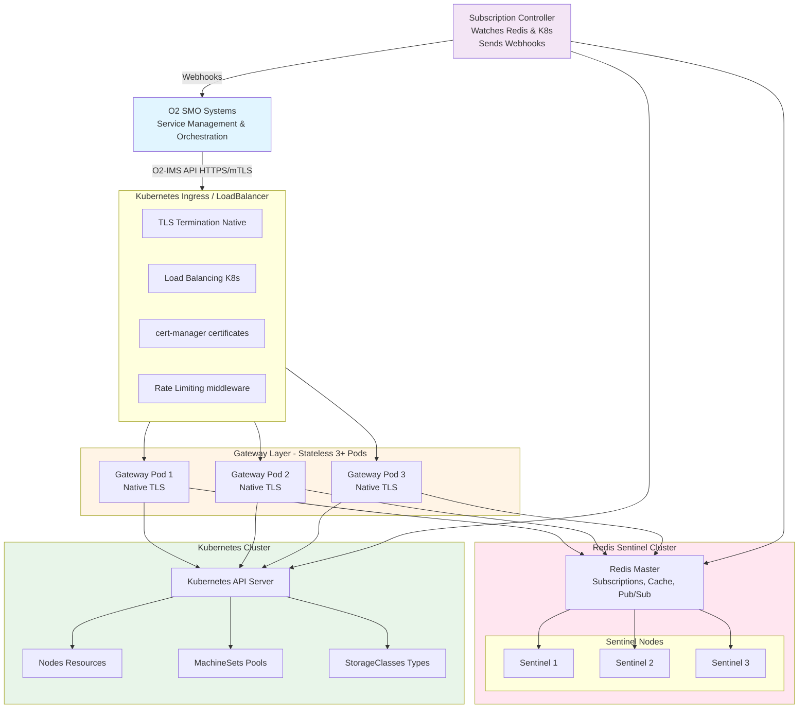

### System Context

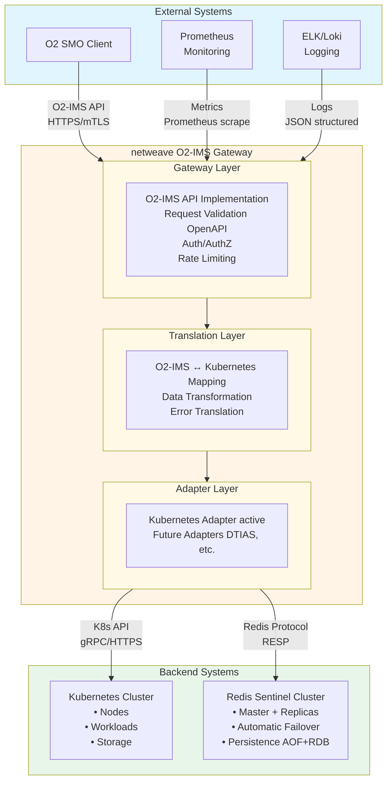

---

## Architecture Goals

### Functional Goals

1. **O2-IMS Compliance**
   - Full implementation of O-RAN O2-IMS specification
   - OpenAPI-driven development
   - Strict schema validation

2. **Backend Abstraction**
   - Translate O2-IMS to Kubernetes API
   - Support for future backend adapters (Dell DTIAS, etc.)
   - Consistent error handling and responses

3. **Real-Time Notifications**
   - Subscription-based event delivery
   - Webhook notifications to SMO systems
   - Filtering and transformation

### Non-Functional Goals

1. **Performance**
   - API response: p95 < 100ms, p99 < 500ms
   - Webhook delivery: < 1s from event to notification
   - Cache hit ratio: > 90%
   - Support 1000+ req/sec per cluster

2. **Reliability**
   - 99.9% uptime (< 8.76 hours downtime/year)
   - Zero-downtime deployments
   - Automatic failover < 30s
   - Graceful degradation

3. **Scalability**
   - Horizontal scaling (add more gateway pods)
   - Multi-cluster support
   - Handle 10,000+ nodes per cluster
   - 100+ concurrent subscriptions

4. **Security**
   - mTLS everywhere
   - Zero-trust networking
   - No hardcoded secrets
   - Minimal attack surface
   - Audit logging

5. **Observability**
   - Comprehensive metrics (Prometheus)
   - Distributed tracing (Jaeger)
   - Structured logging
   - Health checks and dashboards

6. **Operability**
   - GitOps-friendly
   - Configuration as code
   - Simple rollback procedures
   - Clear operational runbooks

---

## Component Architecture

### Gateway Pods

**Responsibility**: Handle O2-IMS API requests, translate to backend operations

```go
// High-level structure
type Gateway struct {
    // HTTP server (Gin framework)
    router *gin.Engine

    // O2-IMS handlers
    dmHandler   *DeploymentManagerHandler
    poolHandler *ResourcePoolHandler
    resHandler  *ResourceHandler
    subHandler  *SubscriptionHandler

    // Backend adapter
    adapter adapter.BackendAdapter

    // Cache layer
    cache cache.Cache

    // Observability
    metrics *prometheus.Registry
    tracer  trace.Tracer
    logger  *zap.Logger
}
```

**Characteristics**:
- **Stateless**: No local state (all in Redis or K8s)
- **Identical**: All pods are equal, no leader
- **Scalable**: Add/remove pods without coordination
- **Fast startup**: < 5s to ready state

**Lifecycle**:
1. Load configuration (env vars, ConfigMap)
2. Connect to Redis (Sentinel)
3. Connect to Kubernetes API
4. Register routes and middleware
5. Start HTTP server on port 8080
6. Signal readiness (liveness/readiness probes)

### Redis Cluster

**Responsibility**: Shared state, caching, pub/sub

**Deployment**: Redis Sentinel for HA
- 1 master + 2+ replicas per cluster
- Automatic failover via Sentinel (quorum=2)
- Persistence: AOF + RDB snapshots

**Data Stored**:
1. **Subscriptions** (primary data)
   ```
   subscription:{uuid} → Hash {id, callback, filter, ...}
   subscriptions:active → Set of UUIDs
   subscriptions:resourcePool:{id} → Set of UUIDs
   ```

2. **Cache** (performance optimization)
   ```
   cache:nodes:list → JSON (TTL: 30s)
   cache:resourcePools:list → JSON (TTL: 30s)
   cache:node:{id} → JSON (TTL: 60s)
   ```

3. **Pub/Sub** (inter-pod communication)
   ```
   cache:invalidate:nodes → Event stream
   subscriptions:created → Event stream
   subscriptions:deleted → Event stream
   ```

4. **Distributed Locks** (coordination)
   ```
   lock:webhook:{sub_id}:{event_id} → {pod_id} (TTL: 10s)
   lock:cache:refresh → {pod_id} (TTL: 5s)
   ```

### Subscription Controller

**Responsibility**: Watch for K8s changes, send webhook notifications

```go
type SubscriptionController struct {
    redis      *redis.Client
    k8sClient  client.Client
    subStore   storage.SubscriptionStore
    webhookSvc *WebhookService
}

// Main loop
func (c *SubscriptionController) Run(ctx context.Context) {
    // Watch K8s resources
    nodeInformer.AddEventHandler(...)
    podInformer.AddEventHandler(...)

    // Watch Redis subscription events
    go c.syncRedisSubscriptions(ctx)

    // Process notification queue
    go c.processWebhooks(ctx)
}
```

**Deployment**: 3+ pods with leader election
- Only leader actively sends webhooks (prevents duplicates)
- Standby pods ready for immediate takeover
- Leader election via Kubernetes Lease object

**Event Processing**:
1. K8s informer detects change (Node added, Pod failed, etc.)
2. Query subscriptions from Redis matching the change
3. For each matching subscription:
   - Transform K8s event to O2-IMS format
   - Enqueue webhook delivery
4. Webhook worker:
   - Acquire distributed lock (prevent duplicates)
   - POST to callback URL
   - Retry with exponential backoff (3 attempts)
   - Update subscription status

### Plugin Architecture (Multi-Backend Support)

**Responsibility**: Provide comprehensive pluggable backend system for O2-IMS, O2-DMS, and O2-SMO operations

The netweave gateway implements a **unified plugin architecture** supporting three distinct plugin ecosystems:

1. **O2-IMS Plugins**: Infrastructure resource management (10+ backends)
2. **O2-DMS Plugins**: CNF/VNF deployment lifecycle management (7+ backends)
3. **O2-SMO Plugins**: SMO integration and orchestration (5+ backends)

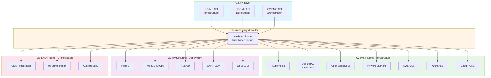

This architecture enables netweave to manage resources across Kubernetes, OpenStack NFVi, bare-metal systems (Dell DTIAS), cloud providers (AWS, Azure, GKE), VMware vSphere, and any future infrastructure backends. Additionally, it provides deployment management through Helm, ArgoCD, Flux, ONAP-LCM, OSM-LCM, and integrates with ONAP and OSM SMO frameworks.

**For complete plugin specifications, see [docs/backend-plugins.md](backend-plugins.md).**

#### Legacy Adapter Interface (O2-IMS Only)

**Note**: This section documents the original adapter interface for O2-IMS. The new plugin architecture extends this to cover O2-DMS and O2-SMO as well.

All O2-IMS backend implementations must satisfy the `Adapter` interface (now `ims.IMSPlugin`):

#### Adapter Interface

All backend implementations must satisfy the `Adapter` interface:

```go
// internal/adapter/adapter.go

package adapter

// Adapter is the pluggable backend interface
type Adapter interface {
    // Metadata
    Name() string
    Version() string
    Capabilities() []Capability

    // Deployment Managers
    ListDeploymentManagers(ctx context.Context, filter *Filter) ([]*DeploymentManager, error)
    GetDeploymentManager(ctx context.Context, id string) (*DeploymentManager, error)

    // Resource Pools
    ListResourcePools(ctx context.Context, filter *Filter) ([]*ResourcePool, error)
    GetResourcePool(ctx context.Context, id string) (*ResourcePool, error)
    CreateResourcePool(ctx context.Context, pool *ResourcePool) (*ResourcePool, error)
    UpdateResourcePool(ctx context.Context, id string, pool *ResourcePool) (*ResourcePool, error)
    DeleteResourcePool(ctx context.Context, id string) error

    // Resources
    ListResources(ctx context.Context, filter *Filter) ([]*Resource, error)
    GetResource(ctx context.Context, id string) (*Resource, error)
    CreateResource(ctx context.Context, resource *Resource) (*Resource, error)
    DeleteResource(ctx context.Context, id string) error

    // Resource Types
    ListResourceTypes(ctx context.Context, filter *Filter) ([]*ResourceType, error)
    GetResourceType(ctx context.Context, id string) (*ResourceType, error)

    // Subscriptions (backend may or may not support)
    SupportsSubscriptions() bool
    Subscribe(ctx context.Context, sub *Subscription) error
    Unsubscribe(ctx context.Context, id string) error

    // Health and lifecycle
    Health(ctx context.Context) error
    Close() error
}

// Capability describes what operations a backend supports
type Capability string

const (
    CapResourcePoolCreate   Capability = "resource-pool-create"
    CapResourcePoolUpdate   Capability = "resource-pool-update"
    CapResourcePoolDelete   Capability = "resource-pool-delete"
    CapResourceCreate       Capability = "resource-create"
    CapResourceDelete       Capability = "resource-delete"
    CapSubscriptions        Capability = "subscriptions"
    CapRealTimeEvents       Capability = "real-time-events"
)
```

#### Adapter Registry

The `Registry` manages multiple adapter instances and routes requests to appropriate backends:

```go
// internal/adapter/registry.go

type Registry struct {
    mu       sync.RWMutex
    adapters map[string]Adapter
    routes   map[string]RoutingRule
    default  string  // Default adapter name
}

// RoutingRule determines which backend to use
type RoutingRule struct {
    ResourceType string      // "ResourcePool", "Resource", etc.
    Filter       *Filter     // Optional filter criteria
    AdapterName  string      // Which adapter to route to
    Priority     int         // For fallback scenarios
}

// Route determines which adapter to use for a request
func (r *Registry) Route(resourceType string, filter *Filter) (Adapter, error) {
    r.mu.RLock()
    defer r.mu.RUnlock()

    // Check routing rules first (highest priority first)
    for _, rule := range r.sortedRules() {
        if rule.ResourceType == resourceType && rule.MatchesFilter(filter) {
            if adapter, ok := r.adapters[rule.AdapterName]; ok {
                return adapter, nil
            }
        }
    }

    // Fallback to default adapter
    if adapter, ok := r.adapters[r.default]; ok {
        return adapter, nil
    }

    return nil, fmt.Errorf("no adapter found for resource type %s", resourceType)
}
```

#### Backend Implementations

**Directory Structure:**

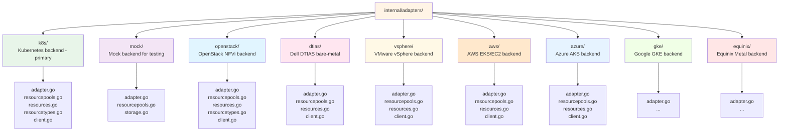

#### Kubernetes Adapter (Primary Implementation)

```go
// internal/adapters/k8s/adapter.go

package k8s

import (
    "context"
    "github.com/yourorg/netweave/internal/adapter"
    "sigs.k8s.io/controller-runtime/pkg/client"
)

type KubernetesAdapter struct {
    client    client.Client
    clientset *kubernetes.Clientset
    config    *Config
}

func NewAdapter(config *Config) (*KubernetesAdapter, error) {
    client, err := createK8sClient(config)
    if err != nil {
        return nil, err
    }

    return &KubernetesAdapter{
        client: client,
        config: config,
    }, nil
}

func (a *KubernetesAdapter) Name() string {
    return "kubernetes"
}

func (a *KubernetesAdapter) Capabilities() []adapter.Capability {
    return []adapter.Capability{
        adapter.CapResourcePoolCreate,
        adapter.CapResourcePoolUpdate,
        adapter.CapResourcePoolDelete,
        adapter.CapResourceCreate,
        adapter.CapResourceDelete,
        adapter.CapSubscriptions,
        adapter.CapRealTimeEvents,
    }
}

// Example: List Resource Pools → List MachineSets
func (a *KubernetesAdapter) ListResourcePools(
    ctx context.Context,
    filter *adapter.Filter,
) ([]*adapter.ResourcePool, error) {
    // 1. List Kubernetes MachineSets
    machineSets := &machinev1beta1.MachineSetList{}
    if err := a.client.List(ctx, machineSets); err != nil {
        return nil, fmt.Errorf("failed to list machinesets: %w", err)
    }

    // 2. Transform to O2-IMS ResourcePool
    pools := make([]*adapter.ResourcePool, 0, len(machineSets.Items))
    for i := range machineSets.Items {
        pool := a.transformMachineSetToResourcePool(&machineSets.Items[i])
        if filter.Matches(pool) {
            pools = append(pools, pool)
        }
    }

    return pools, nil
}

// Transform MachineSet → O2-IMS ResourcePool
func (a *KubernetesAdapter) transformMachineSetToResourcePool(ms *machinev1beta1.MachineSet) *adapter.ResourcePool {
    return &adapter.ResourcePool{
        ResourcePoolID: string(ms.UID),
        Name:          ms.Name,
        Description:   ms.Annotations["description"],
        Location:      ms.Spec.Template.Spec.ProviderSpec.Value.Zone,
        OCloudID:      a.config.OCloudID,
        Extensions: map[string]interface{}{
            "k8s.machineset.name":       ms.Name,
            "k8s.machineset.namespace":  ms.Namespace,
            "k8s.machineset.replicas":   *ms.Spec.Replicas,
            "k8s.instanceType":          ms.Spec.Template.Spec.ProviderSpec.Value.InstanceType,
        },
    }
}
```

#### Dell DTIAS Adapter Example

```go
// internal/adapters/dtias/adapter.go

package dtias

import (
    "context"
    "github.com/yourorg/netweave/internal/adapter"
    "github.com/yourorg/netweave/pkg/dtias-client"
)

type DTIASAdapter struct {
    client *dtias.Client
    config *Config
}

func NewAdapter(config *Config) (*DTIASAdapter, error) {
    client, err := dtias.NewClient(config.Endpoint, config.APIKey)
    if err != nil {
        return nil, err
    }

    return &DTIASAdapter{
        client: client,
        config: config,
    }, nil
}

func (a *DTIASAdapter) Name() string {
    return "dtias"
}

func (a *DTIASAdapter) Capabilities() []adapter.Capability {
    return []adapter.Capability{
        adapter.CapResourcePoolCreate,
        adapter.CapResourceCreate,
        // DTIAS doesn't support subscriptions
    }
}

func (a *DTIASAdapter) ListResourcePools(ctx context.Context, filter *adapter.Filter) ([]*adapter.ResourcePool, error) {
    // 1. Call DTIAS API
    dtiasGroups, err := a.client.ListResourceGroups(ctx)
    if err != nil {
        return nil, fmt.Errorf("dtias api error: %w", err)
    }

    // 2. Transform DTIAS ResourceGroup → O2-IMS ResourcePool
    pools := make([]*adapter.ResourcePool, 0, len(dtiasGroups))
    for _, group := range dtiasGroups {
        pool := a.transformToDTIASResourcePool(group)
        if filter.Matches(pool) {
            pools = append(pools, pool)
        }
    }

    return pools, nil
}

// Transform DTIAS ResourceGroup → O2-IMS ResourcePool
func (a *DTIASAdapter) transformToDTIASResourcePool(group *dtias.ResourceGroup) *adapter.ResourcePool {
    return &adapter.ResourcePool{
        ResourcePoolID: group.ID,
        Name:          group.Name,
        Description:   group.Description,
        Location:      group.DataCenter,
        OCloudID:      a.config.OCloudID,
        Extensions: map[string]interface{}{
            "dtias.resourceGroupType": group.Type,
            "dtias.provisioningState": group.State,
            "dtias.bareMetalCount":    group.ServerCount,
        },
    }
}
```

#### OpenStack Adapter Example (NFVi Migration Path)

```go
// internal/adapters/openstack/adapter.go

package openstack

import (
    "context"
    "github.com/yourorg/netweave/internal/adapter"
    "github.com/gophercloud/gophercloud"
    "github.com/gophercloud/gophercloud/openstack"
    "github.com/gophercloud/gophercloud/openstack/compute/v2/servers"
    "github.com/gophercloud/gophercloud/openstack/placement/v1/aggregates"
)

type OpenStackAdapter struct {
    provider *gophercloud.ProviderClient
    compute  *gophercloud.ServiceClient
    placement *gophercloud.ServiceClient
    config   *Config
}

func NewAdapter(config *Config) (*OpenStackAdapter, error) {
    provider, err := openstack.AuthenticatedClient(gophercloud.AuthOptions{
        IdentityEndpoint: config.AuthURL,
        Username:         config.Username,
        Password:         config.Password,
        TenantName:       config.ProjectName,
        DomainName:       config.DomainName,
    })
    if err != nil {
        return nil, err
    }

    compute, err := openstack.NewComputeV2(provider, gophercloud.EndpointOpts{
        Region: config.Region,
    })
    if err != nil {
        return nil, err
    }

    placement, err := openstack.NewPlacementV1(provider, gophercloud.EndpointOpts{
        Region: config.Region,
    })
    if err != nil {
        return nil, err
    }

    return &OpenStackAdapter{
        provider:  provider,
        compute:   compute,
        placement: placement,
        config:    config,
    }, nil
}

func (a *OpenStackAdapter) Name() string {
    return "openstack"
}

func (a *OpenStackAdapter) Capabilities() []adapter.Capability {
    return []adapter.Capability{
        adapter.CapResourcePoolCreate,
        adapter.CapResourcePoolUpdate,
        adapter.CapResourcePoolDelete,
        adapter.CapResourceCreate,
        adapter.CapResourceDelete,
        // OpenStack doesn't natively support subscriptions
    }
}

// List Resource Pools → List OpenStack Host Aggregates
func (a *OpenStackAdapter) ListResourcePools(ctx context.Context, filter *adapter.Filter) ([]*adapter.ResourcePool, error) {
    // 1. List OpenStack host aggregates
    allPages, err := aggregates.List(a.placement).AllPages()
    if err != nil {
        return nil, fmt.Errorf("failed to list host aggregates: %w", err)
    }

    osAggregates, err := aggregates.ExtractAggregates(allPages)
    if err != nil {
        return nil, err
    }

    // 2. Transform to O2-IMS ResourcePool
    pools := make([]*adapter.ResourcePool, 0, len(osAggregates))
    for _, agg := range osAggregates {
        pool := a.transformHostAggregateToResourcePool(&agg)
        if filter.Matches(pool) {
            pools = append(pools, pool)
        }
    }

    return pools, nil
}

// Transform OpenStack Host Aggregate → O2-IMS ResourcePool
func (a *OpenStackAdapter) transformHostAggregateToResourcePool(agg *aggregates.Aggregate) *adapter.ResourcePool {
    return &adapter.ResourcePool{
        ResourcePoolID: fmt.Sprintf("os-aggregate-%d", agg.ID),
        Name:          agg.Name,
        Description:   fmt.Sprintf("OpenStack host aggregate: %s", agg.Name),
        Location:      agg.AvailabilityZone,
        OCloudID:      a.config.OCloudID,
        Extensions: map[string]interface{}{
            "openstack.aggregateId":      agg.ID,
            "openstack.availabilityZone": agg.AvailabilityZone,
            "openstack.metadata":         agg.Metadata,
            "openstack.hostCount":        len(agg.Hosts),
            "openstack.hosts":            agg.Hosts,
        },
    }
}

// List Resources → List Nova Instances
func (a *OpenStackAdapter) ListResources(ctx context.Context, filter *adapter.Filter) ([]*adapter.Resource, error) {
    // 1. List Nova instances
    allPages, err := servers.List(a.compute, servers.ListOpts{}).AllPages()
    if err != nil {
        return nil, fmt.Errorf("failed to list instances: %w", err)
    }

    instances, err := servers.ExtractServers(allPages)
    if err != nil {
        return nil, err
    }

    // 2. Transform to O2-IMS Resource
    resources := make([]*adapter.Resource, 0, len(instances))
    for _, instance := range instances {
        resource := a.transformNovaInstanceToResource(&instance)
        if filter.Matches(resource) {
            resources = append(resources, resource)
        }
    }

    return resources, nil
}

// Transform Nova Instance → O2-IMS Resource
func (a *OpenStackAdapter) transformNovaInstanceToResource(instance *servers.Server) *adapter.Resource {
    return &adapter.Resource{
        ResourceID:     instance.ID,
        Name:          instance.Name,
        Description:   fmt.Sprintf("OpenStack instance: %s", instance.Name),
        ResourceTypeID: fmt.Sprintf("os-flavor-%s", instance.Flavor["id"]),
        ResourcePoolID: a.getResourcePoolIDFromInstance(instance),
        OCloudID:      a.config.OCloudID,
        Extensions: map[string]interface{}{
            "openstack.instanceId":   instance.ID,
            "openstack.flavorId":     instance.Flavor["id"],
            "openstack.imageId":      instance.Image["id"],
            "openstack.status":       instance.Status,
            "openstack.hostId":       instance.HostID,
            "openstack.availabilityZone": instance.AvailabilityZone,
            "openstack.addresses":    instance.Addresses,
        },
    }
}
```

#### VMware vSphere Adapter Example

```go
// internal/adapters/vsphere/adapter.go

package vsphere

import (
    "context"
    "github.com/yourorg/netweave/internal/adapter"
    "github.com/vmware/govmomi"
    "github.com/vmware/govmomi/find"
    "github.com/vmware/govmomi/object"
)

type VSphereAdapter struct {
    client *govmomi.Client
    finder *find.Finder
    config *Config
}

func NewAdapter(config *Config) (*VSphereAdapter, error) {
    ctx := context.Background()

    // Connect to vSphere
    client, err := govmomi.NewClient(ctx, config.URL, true)
    if err != nil {
        return nil, err
    }

    // Login
    if err := client.Login(ctx, config.User, config.Password); err != nil {
        return nil, err
    }

    finder := find.NewFinder(client.Client, true)

    return &VSphereAdapter{
        client: client,
        finder: finder,
        config: config,
    }, nil
}

func (a *VSphereAdapter) Name() string {
    return "vsphere"
}

func (a *VSphereAdapter) Capabilities() []adapter.Capability {
    return []adapter.Capability{
        adapter.CapResourcePoolCreate,
        adapter.CapResourceCreate,
        adapter.CapResourceDelete,
        // vSphere doesn't support subscriptions natively
    }
}

// List Resource Pools → List vSphere Resource Pools / Clusters
func (a *VSphereAdapter) ListResourcePools(ctx context.Context, filter *adapter.Filter) ([]*adapter.ResourcePool, error) {
    // 1. Find all resource pools
    pools, err := a.finder.ResourcePoolList(ctx, "*")
    if err != nil {
        return nil, fmt.Errorf("failed to list vSphere resource pools: %w", err)
    }

    // 2. Transform to O2-IMS ResourcePool
    o2Pools := make([]*adapter.ResourcePool, 0, len(pools))
    for _, pool := range pools {
        o2Pool := a.transformVSphereResourcePool(ctx, pool)
        if filter.Matches(o2Pool) {
            o2Pools = append(o2Pools, o2Pool)
        }
    }

    return o2Pools, nil
}

// Transform vSphere ResourcePool → O2-IMS ResourcePool
func (a *VSphereAdapter) transformVSphereResourcePool(ctx context.Context, pool *object.ResourcePool) *adapter.ResourcePool {
    props, _ := pool.Properties(ctx, pool.Reference(), []string{"name", "config", "summary"})

    return &adapter.ResourcePool{
        ResourcePoolID: pool.Reference().Value,
        Name:          props.Name,
        Description:   fmt.Sprintf("vSphere resource pool: %s", props.Name),
        Location:      a.config.Datacenter,
        OCloudID:      a.config.OCloudID,
        Extensions: map[string]interface{}{
            "vsphere.resourcePoolId": pool.Reference().Value,
            "vsphere.cpuLimit":       props.Config.CpuAllocation.Limit,
            "vsphere.memoryLimit":    props.Config.MemoryAllocation.Limit,
            "vsphere.cpuReservation": props.Config.CpuAllocation.Reservation,
            "vsphere.memoryReservation": props.Config.MemoryAllocation.Reservation,
        },
    }
}

// List Resources → List ESXi Hosts / VMs
func (a *VSphereAdapter) ListResources(ctx context.Context, filter *adapter.Filter) ([]*adapter.Resource, error) {
    // List ESXi hosts
    hosts, err := a.finder.HostSystemList(ctx, "*")
    if err != nil {
        return nil, fmt.Errorf("failed to list hosts: %w", err)
    }

    resources := make([]*adapter.Resource, 0, len(hosts))
    for _, host := range hosts {
        resource := a.transformHostToResource(ctx, host)
        if filter.Matches(resource) {
            resources = append(resources, resource)
        }
    }

    return resources, nil
}

// Transform ESXi Host → O2-IMS Resource
func (a *VSphereAdapter) transformHostToResource(ctx context.Context, host *object.HostSystem) *adapter.Resource {
    props, _ := host.Properties(ctx, host.Reference(), []string{"name", "hardware", "summary"})

    return &adapter.Resource{
        ResourceID:     host.Reference().Value,
        Name:          props.Name,
        Description:   fmt.Sprintf("ESXi host: %s", props.Name),
        ResourceTypeID: "esxi-host",
        OCloudID:      a.config.OCloudID,
        Extensions: map[string]interface{}{
            "vsphere.hostId":        host.Reference().Value,
            "vsphere.cpuCores":      props.Hardware.CpuInfo.NumCpuCores,
            "vsphere.cpuThreads":    props.Hardware.CpuInfo.NumCpuThreads,
            "vsphere.memorySize":    props.Hardware.MemorySize,
            "vsphere.connectionState": props.Summary.Runtime.ConnectionState,
            "vsphere.powerState":    props.Summary.Runtime.PowerState,
        },
    }
}
```

#### Mock Adapter Example (Testing)

```go
// internal/adapters/mock/adapter.go

package mock

import (
    "context"
    "sync"
    "github.com/yourorg/netweave/internal/adapter"
    "github.com/google/uuid"
)

// MockAdapter provides an in-memory backend for testing
type MockAdapter struct {
    mu             sync.RWMutex
    resourcePools  map[string]*adapter.ResourcePool
    resources      map[string]*adapter.Resource
    resourceTypes  map[string]*adapter.ResourceType
    config         *Config
}

func NewAdapter(config *Config) (*MockAdapter, error) {
    a := &MockAdapter{
        resourcePools: make(map[string]*adapter.ResourcePool),
        resources:     make(map[string]*adapter.Resource),
        resourceTypes: make(map[string]*adapter.ResourceType),
        config:        config,
    }

    // Pre-populate with mock data
    a.initializeMockData()

    return a, nil
}

func (a *MockAdapter) Name() string {
    return "mock"
}

func (a *MockAdapter) Capabilities() []adapter.Capability {
    // Mock supports everything for testing
    return []adapter.Capability{
        adapter.CapResourcePoolCreate,
        adapter.CapResourcePoolUpdate,
        adapter.CapResourcePoolDelete,
        adapter.CapResourceCreate,
        adapter.CapResourceDelete,
        adapter.CapSubscriptions,
        adapter.CapRealTimeEvents,
    }
}

// Initialize with sample data for testing
func (a *MockAdapter) initializeMockData() {
    // Create sample resource pools
    a.resourcePools["pool-compute-1"] = &adapter.ResourcePool{
        ResourcePoolID: "pool-compute-1",
        Name:          "Mock Compute Pool 1",
        Description:   "High-performance compute pool for testing",
        Location:      "mock-us-east-1a",
        OCloudID:      a.config.OCloudID,
        Extensions: map[string]interface{}{
            "mock.type":     "compute",
            "mock.capacity": 100,
        },
    }

    // Create sample resources
    a.resources["node-mock-001"] = &adapter.Resource{
        ResourceID:     "node-mock-001",
        Name:          "Mock Node 001",
        Description:   "Mock compute node for testing",
        ResourceTypeID: "type-compute-large",
        ResourcePoolID: "pool-compute-1",
        OCloudID:      a.config.OCloudID,
        Extensions: map[string]interface{}{
            "mock.cpuCores":  32,
            "mock.memoryGB":  128,
            "mock.gpuCount":  2,
        },
    }

    // Create sample resource types
    a.resourceTypes["type-compute-large"] = &adapter.ResourceType{
        ResourceTypeID: "type-compute-large",
        Name:          "Mock Compute Large",
        Description:   "32 CPU, 128GB RAM, 2 GPU",
        OCloudID:      a.config.OCloudID,
        Extensions: map[string]interface{}{
            "mock.cpu":    32,
            "mock.memory": 128,
            "mock.gpu":    2,
        },
    }
}

// CRUD operations work on in-memory storage
func (a *MockAdapter) ListResourcePools(ctx context.Context, filter *adapter.Filter) ([]*adapter.ResourcePool, error) {
    a.mu.RLock()
    defer a.mu.RUnlock()

    pools := make([]*adapter.ResourcePool, 0, len(a.resourcePools))
    for _, pool := range a.resourcePools {
        if filter.Matches(pool) {
            pools = append(pools, pool)
        }
    }

    return pools, nil
}

func (a *MockAdapter) CreateResourcePool(ctx context.Context, pool *adapter.ResourcePool) (*adapter.ResourcePool, error) {
    a.mu.Lock()
    defer a.mu.Unlock()

    if pool.ResourcePoolID == "" {
        pool.ResourcePoolID = uuid.New().String()
    }

    a.resourcePools[pool.ResourcePoolID] = pool
    return pool, nil
}

func (a *MockAdapter) DeleteResourcePool(ctx context.Context, id string) error {
    a.mu.Lock()
    defer a.mu.Unlock()

    delete(a.resourcePools, id)
    return nil
}

func (a *MockAdapter) ListResources(ctx context.Context, filter *adapter.Filter) ([]*adapter.Resource, error) {
    a.mu.RLock()
    defer a.mu.RUnlock()

    resources := make([]*adapter.Resource, 0, len(a.resources))
    for _, resource := range a.resources {
        if filter.Matches(resource) {
            resources = append(resources, resource)
        }
    }

    return resources, nil
}

// Mock adapter supports subscriptions for testing
func (a *MockAdapter) SupportsSubscriptions() bool {
    return true
}

func (a *MockAdapter) Subscribe(ctx context.Context, sub *adapter.Subscription) error {
    // In mock mode, subscriptions are just stored (no actual watching)
    return nil
}
```

#### Configuration-Driven Routing

Backend selection and routing are configured via YAML:

```yaml
# config/gateway.yaml

adapters:
  # Kubernetes adapter (default)
  - name: kubernetes
    type: k8s
    enabled: true
    default: true
    config:
      kubeconfig: /etc/kubernetes/admin.conf
      namespace: default
      ocloudId: ocloud-kubernetes-1

  # Dell DTIAS adapter
  - name: dtias
    type: dtias
    enabled: true
    config:
      endpoint: https://dtias.dell.com/api
      apiKey: ${DTIAS_API_KEY}
      timeout: 30s
      ocloudId: ocloud-dtias-1

  # AWS adapter (disabled for now)
  - name: aws
    type: aws
    enabled: false
    config:
      region: us-east-1
      credentials: ~/.aws/credentials
      ocloudId: ocloud-aws-1

# Routing rules: which backend for which resource type
routing:
  rules:
    # All bare-metal resource pools go to DTIAS
    - resourceType: ResourcePool
      filter:
        extensions.type: "bare-metal"
      adapter: dtias
      priority: 10

    # Cloud resource pools go to AWS
    - resourceType: ResourcePool
      filter:
        extensions.type: "cloud"
      adapter: aws
      priority: 10

    # GPU resources go to Kubernetes
    - resourceType: Resource
      filter:
        extensions.hasGPU: true
      adapter: kubernetes
      priority: 10

    # Everything else goes to Kubernetes (default)
    - resourceType: "*"
      adapter: kubernetes
      priority: 1
```

#### Multi-Backend Aggregation

For scenarios requiring results from multiple backends:

```go
// internal/adapter/aggregator.go

type AggregatingAdapter struct {
    adapters []Adapter
    strategy AggregationStrategy
}

type AggregationStrategy string

const (
    StrategyMerge    AggregationStrategy = "merge"     // Combine all results
    StrategyFirst    AggregationStrategy = "first"     // First successful response
    StrategyFallback AggregationStrategy = "fallback"  // Try in order until success
)

func (a *AggregatingAdapter) ListResourcePools(ctx context.Context, filter *Filter) ([]*ResourcePool, error) {
    switch a.strategy {
    case StrategyMerge:
        return a.mergeListResourcePools(ctx, filter)
    case StrategyFirst:
        return a.firstListResourcePools(ctx, filter)
    case StrategyFallback:
        return a.fallbackListResourcePools(ctx, filter)
    }
}

// Merge results from all backends
func (a *AggregatingAdapter) mergeListResourcePools(ctx context.Context, filter *Filter) ([]*ResourcePool, error) {
    var allPools []*ResourcePool

    // Query all adapters in parallel
    results := make(chan []*ResourcePool, len(a.adapters))
    errors := make(chan error, len(a.adapters))

    for _, adapter := range a.adapters {
        go func(adp Adapter) {
            pools, err := adp.ListResourcePools(ctx, filter)
            if err != nil {
                errors <- err
                return
            }
            results <- pools
        }(adapter)
    }

    // Collect results
    for i := 0; i < len(a.adapters); i++ {
        select {
        case pools := <-results:
            allPools = append(allPools, pools...)
        case err := <-errors:
            // Log error but continue (partial results OK)
            log.Warn("adapter failed", "error", err)
        case <-ctx.Done():
            return nil, ctx.Err()
        }
    }

    return allPools, nil
}
```

#### Benefits of Adapter Architecture

1. **Easy Extension**: Add new backends by implementing `Adapter` interface
2. **Hot Swappable**: Change backends via configuration without code changes
3. **Intelligent Routing**: Route requests based on resource type, filters, or capabilities
4. **Multi-Backend Aggregation**: Combine results from multiple sources
5. **Testability**: Use mock adapter for testing without real infrastructure
6. **Vendor Independence**: Abstract vendor-specific APIs behind standard interface

**Adapter Mappings** (see [api-mapping.md](api-mapping.md) for details):
- DeploymentManager → Cluster metadata (Kubernetes ConfigMap or CRD)
- ResourcePool → MachineSet/NodePool (K8s), ResourceGroup (DTIAS), ASG (AWS)
- Resource → Node/Machine (K8s), Server (DTIAS), EC2 Instance (AWS)
- ResourceType → StorageClass/Machine flavors (K8s), Server Types (DTIAS), Instance Types (AWS)

### API Versioning Strategy

**Responsibility**: Provide stable, evolvable O2-IMS API with backwards compatibility

The gateway supports multiple API versions simultaneously, allowing clients to upgrade at their own pace while enabling new features and improvements without breaking existing integrations.

#### Version URL Structure

```
/o2ims/v1/resourcePools       # API v1 (current, stable)
/o2ims/v2/resourcePools       # API v2 (future, with enhancements)
/o2ims/v3/resourcePools       # API v3 (future)
```

#### Router Configuration

```go
// internal/server/router.go

func (s *Server) setupRoutes() {
    // API v1 (current stable version)
    v1 := s.router.Group("/o2ims/v1")
    {
        v1.Use(s.authMiddleware())
        v1.Use(s.metricsMiddleware())

        // Deployment Managers
        v1.GET("/deploymentManagers", s.handleListDeploymentManagersV1)
        v1.GET("/deploymentManagers/:id", s.handleGetDeploymentManagerV1)

        // Resource Pools
        v1.GET("/resourcePools", s.handleListResourcePoolsV1)
        v1.GET("/resourcePools/:id", s.handleGetResourcePoolV1)
        v1.POST("/resourcePools", s.handleCreateResourcePoolV1)
        v1.PUT("/resourcePools/:id", s.handleUpdateResourcePoolV1)
        v1.DELETE("/resourcePools/:id", s.handleDeleteResourcePoolV1)

        // Resources
        v1.GET("/resources", s.handleListResourcesV1)
        v1.GET("/resources/:id", s.handleGetResourceV1)
        v1.POST("/resources", s.handleCreateResourceV1)
        v1.DELETE("/resources/:id", s.handleDeleteResourceV1)

        // Resource Types
        v1.GET("/resourceTypes", s.handleListResourceTypesV1)
        v1.GET("/resourceTypes/:id", s.handleGetResourceTypeV1)

        // Subscriptions
        v1.GET("/subscriptions", s.handleListSubscriptionsV1)
        v1.GET("/subscriptions/:id", s.handleGetSubscriptionV1)
        v1.POST("/subscriptions", s.handleCreateSubscriptionV1)
        v1.PUT("/subscriptions/:id", s.handleUpdateSubscriptionV1)
        v1.DELETE("/subscriptions/:id", s.handleDeleteSubscriptionV1)
    }

    // API v2 (future - enhanced features)
    v2 := s.router.Group("/o2ims/v2")
    {
        v2.Use(s.authMiddleware())
        v2.Use(s.metricsMiddleware())

        // Enhanced Resource Pools with additional fields
        v2.GET("/resourcePools", s.handleListResourcePoolsV2)
        v2.GET("/resourcePools/:id", s.handleGetResourcePoolV2)
        v2.POST("/resourcePools", s.handleCreateResourcePoolV2)
        v2.PUT("/resourcePools/:id", s.handleUpdateResourcePoolV2)
        v2.DELETE("/resourcePools/:id", s.handleDeleteResourcePoolV2)

        // New endpoints in v2
        v2.GET("/resourcePools/:id/metrics", s.handleGetResourcePoolMetrics)
        v2.GET("/resourcePools/:id/events", s.handleGetResourcePoolEvents)

        // Enhanced filtering and pagination
        v2.GET("/resources", s.handleListResourcesV2)
    }
}
```

#### Version-Specific Handlers

```go
// V1 handler - original implementation
func (s *Server) handleListResourcePoolsV1(c *gin.Context) {
    // Parse v1 query parameters
    filter := parseFilterV1(c)

    // Route to appropriate backend
    adapter, err := s.registry.Route("ResourcePool", filter)
    if err != nil {
        c.JSON(500, gin.H{"error": "adapter routing failed"})
        return
    }

    pools, err := adapter.ListResourcePools(c.Request.Context(), filter)
    if err != nil {
        c.JSON(500, gin.H{"error": err.Error()})
        return
    }

    // Return v1 response format
    c.JSON(200, marshalResourcePoolsV1(pools))
}

// V2 handler - enhanced with new fields and capabilities
func (s *Server) handleListResourcePoolsV2(c *gin.Context) {
    // Parse v2 query parameters (enhanced filtering)
    filter := parseFilterV2(c)

    // Route to appropriate backend
    adapter, err := s.registry.Route("ResourcePool", filter)
    if err != nil {
        c.JSON(500, gin.H{"error": "adapter routing failed"})
        return
    }

    pools, err := adapter.ListResourcePools(c.Request.Context(), filter)
    if err != nil {
        c.JSON(500, gin.H{"error": err.Error()})
        return
    }

    // Return v2 response format (with additional fields)
    c.JSON(200, marshalResourcePoolsV2(pools))
}
```

#### Response Format Evolution

**V1 Response** (current):
```json
{
  "items": [
    {
      "resourcePoolId": "pool-123",
      "name": "Compute Pool",
      "description": "High-performance compute",
      "location": "us-east-1a",
      "oCloudId": "ocloud-1"
    }
  ]
}
```

**V2 Response** (enhanced):
```json
{
  "items": [
    {
      "resourcePoolId": "pool-123",
      "name": "Compute Pool",
      "description": "High-performance compute",
      "location": "us-east-1a",
      "oCloudId": "ocloud-1",
      "health": {
        "status": "healthy",
        "availableCapacity": 80,
        "utilization": 65.5
      },
      "metrics": {
        "cpuUsagePercent": 45.2,
        "memoryUsagePercent": 72.1,
        "nodeCount": 10,
        "healthyNodeCount": 10
      },
      "tags": ["production", "gpu-enabled"],
      "createdAt": "2026-01-01T00:00:00Z",
      "updatedAt": "2026-01-06T10:30:00Z"
    }
  ],
  "pagination": {
    "totalCount": 42,
    "pageSize": 20,
    "nextPage": "/o2ims/v2/resourcePools?page=2"
  }
}
```

#### Version Negotiation

Clients specify their desired API version via URL path:

```bash
# Client uses v1 (stable)
curl https://netweave.example.com/o2ims/v1/resourcePools \
  --cert client.crt --key client.key --cacert ca.crt

# Client uses v2 (enhanced)
curl https://netweave.example.com/o2ims/v2/resourcePools \
  --cert client.crt --key client.key --cacert ca.crt
```

#### Deprecation Policy

1. **Announce Deprecation**: At least 6 months before removal
2. **Mark as Deprecated**: Add `X-API-Deprecated: true` header to responses
3. **Provide Migration Guide**: Document changes and migration path
4. **Grace Period**: Minimum 12 months from deprecation announcement
5. **Final Removal**: Remove deprecated version after grace period

Example deprecation header:

```http
HTTP/1.1 200 OK
X-API-Deprecated: true
X-API-Deprecation-Date: 2026-07-01
X-API-Sunset-Date: 2027-01-01
X-API-Migration-Guide: https://docs.netweave.io/migration/v1-to-v2
Content-Type: application/json
```

#### Version Support Matrix

| Version | Status | Release Date | Deprecation Date | Sunset Date |
|---------|--------|--------------|------------------|-------------|
| v1 | Stable | 2026-01-01 | - | - |
| v2 | Planned | 2026-07-01 | - | - |
| v3 | Future | TBD | - | - |

#### Benefits of Versioning Strategy

1. **Backwards Compatibility**: Existing clients continue working without changes
2. **Incremental Adoption**: Clients upgrade at their own pace
3. **Innovation**: New features can be added without breaking existing APIs
4. **Clear Migration Path**: Documented upgrade process for each version
5. **Production Stability**: No surprise breaking changes

### TLS and Certificate Management

**Responsibility**: Secure communication, certificate lifecycle

**Implementation**: Native Go TLS + cert-manager

**Features**:
1. **Native Go TLS 1.3**
   ```go
   // internal/server/tls.go
   func configureTLS(cfg *config.Config) *tls.Config {
       // Load server certificate
       cert, _ := tls.LoadX509KeyPair(cfg.TLS.CertPath, cfg.TLS.KeyPath)

       // Load CA for client verification
       caCert, _ := os.ReadFile(cfg.TLS.CACertPath)
       caCertPool := x509.NewCertPool()
       caCertPool.AppendCertsFromPEM(caCert)

       return &tls.Config{
           Certificates: []tls.Certificate{cert},
           ClientAuth:   tls.RequireAndVerifyClientCert,
           ClientCAs:    caCertPool,
           MinVersion:   tls.VersionTLS13,
           CipherSuites: []uint16{
               tls.TLS_AES_256_GCM_SHA384,
               tls.TLS_AES_128_GCM_SHA256,
               tls.TLS_CHACHA20_POLY1305_SHA256,
           },
       }
   }
   ```

2. **cert-manager Integration**
   - Automatic certificate issuance
   - Auto-renewal (90-day rotation)
   - Kubernetes Secret storage
   - No manual certificate management

3. **Kubernetes Ingress**
   - Native LoadBalancer or Ingress controller
   - TLS passthrough to application
   - Health-based routing
   - Session affinity (optional)

4. **Client Certificate Validation**
   ```go
   // Middleware to extract and validate client cert
   func ClientCertAuth() gin.HandlerFunc {
       return func(c *gin.Context) {
           if c.Request.TLS == nil || len(c.Request.TLS.PeerCertificates) == 0 {
               c.AbortWithStatusJSON(401, gin.H{"error": "client certificate required"})
               return
           }

           clientCert := c.Request.TLS.PeerCertificates[0]
           clientCN := clientCert.Subject.CommonName

           // Store identity for authorization
           c.Set("clientIdentity", clientCN)
           c.Next()
       }
   }
   ```

### RBAC and Multi-Tenancy

**Responsibility**: Secure multi-tenant access control and resource isolation

**Implementation**: Built-in from the start

netweave is designed as an **enterprise multi-tenant platform** with comprehensive RBAC from day one. This enables multiple SMO systems (tenants) to securely share the same gateway while maintaining strict resource isolation.

#### Multi-Tenancy Architecture

**Tenant Model**:
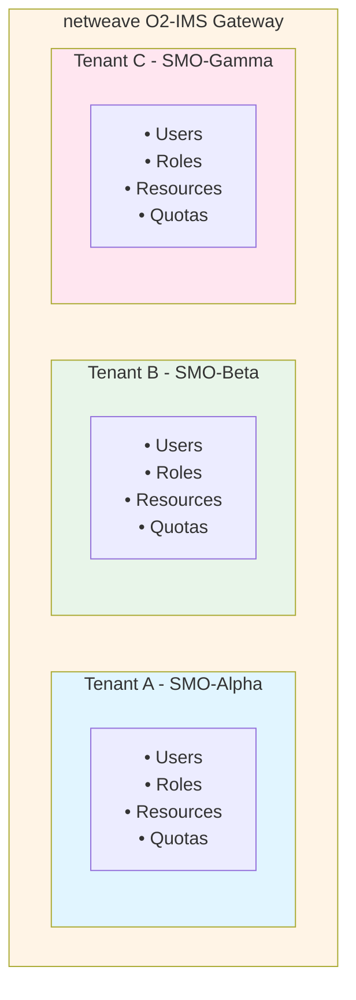

**Tenant Identification** (via client certificate):
```go
// Extract tenant from client certificate CN
// CN format: "user-id.tenant-id.o2ims.example.com"
func extractTenantFromCert(cert *x509.Certificate) (string, string, error) {
    cn := cert.Subject.CommonName
    parts := strings.Split(cn, ".")

    if len(parts) < 2 {
        return "", "", fmt.Errorf("invalid CN format")
    }

    return parts[0], parts[1], nil // userID, tenantID
}
```

**Tenant Middleware**:
```go
// Extracts and validates tenant for every request
func (m *TenantMiddleware) ExtractTenant() gin.HandlerFunc {
    return func(c *gin.Context) {
        // 1. Extract tenant ID from certificate CN
        tenantID := extractTenantFromCert(c.Request.TLS.PeerCertificates[0])

        // 2. Load and validate tenant
        tenant, err := m.store.Get(c.Request.Context(), tenantID)
        if err != nil || tenant.Status != "active" {
            c.AbortWithStatusJSON(403, gin.H{"error": "invalid tenant"})
            return
        }

        // 3. Store in context
        c.Set("tenant", tenant)
        c.Set("tenantId", tenantID)
        c.Next()
    }
}
```

#### RBAC Model

**Role Hierarchy**:
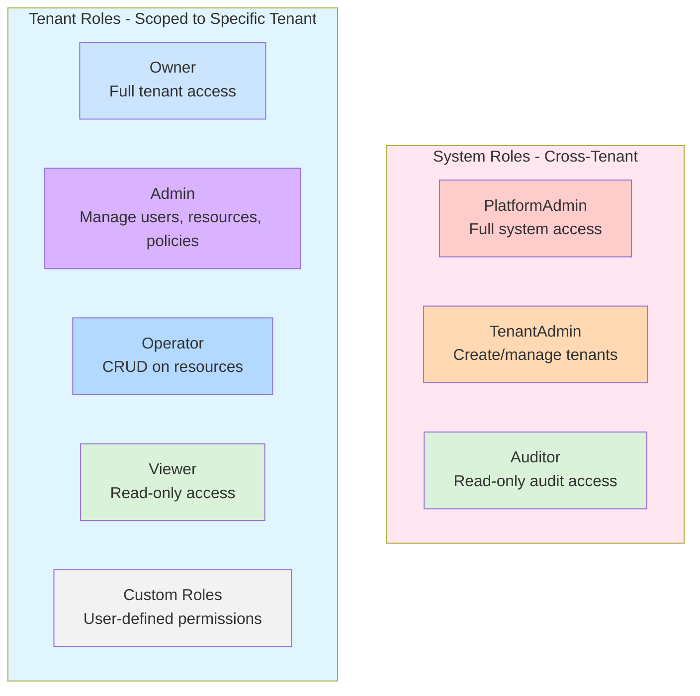

**Permission Model**:
```go
type Permission struct {
    Resource string   // "ResourcePool", "Resource", "Subscription"
    Action   Action   // "create", "read", "update", "delete", "list", "manage"
    Scope    Scope    // "tenant", "shared", "all"
}

// Example: Operator role permissions
operatorRole := &Role{
    Name: "Operator",
    Permissions: []Permission{
        {Resource: "ResourcePool", Action: "manage", Scope: "tenant"},
        {Resource: "Resource", Action: "manage", Scope: "tenant"},
        {Resource: "Subscription", Action: "manage", Scope: "tenant"},
    },
}
```

**Authorization Enforcement**:
```go
// Every API endpoint is protected
v1.POST("/resourcePools",
    tenantMiddleware.ExtractTenant(),
    authzMiddleware.RequirePermission("ResourcePool", "create"),
    handleCreateResourcePool)

// Authorization check
func (a *Authorizer) Authorize(
    userID, tenantID, resource string,
    action Action,
) (bool, error) {
    // 1. Get user's role bindings
    bindings := a.getUserBindings(userID, tenantID)

    // 2. Collect permissions from all roles
    permissions := a.collectPermissions(bindings)

    // 3. Check if any permission allows the action
    return a.matchPermission(permissions, resource, action, tenantID)
}
```

#### Tenant Isolation

**Resource Filtering**:
All list operations automatically filter by tenant:

```go
func (h *Handler) ListResourcePools(c *gin.Context) {
    tenantID := c.GetString("tenantId")

    // Tenant filter is ALWAYS applied
    filter := &adapter.Filter{
        TenantID: tenantID,  // CRITICAL: prevent cross-tenant access
    }

    pools, _ := adapter.ListResourcePools(ctx, filter)
    c.JSON(200, pools)
}
```

**Kubernetes Label Strategy**:
All Kubernetes resources MUST be labeled with tenant ID:

```yaml
apiVersion: machine.openshift.io/v1beta1
kind: MachineSet
metadata:
  name: production-pool
  labels:
    # Tenant isolation label (REQUIRED)
    o2ims.oran.org/tenant: smo-alpha

    # O2-IMS resource labels
    o2ims.oran.org/resource-pool-id: pool-123
spec:
  replicas: 5
  template:
    metadata:
      labels:
        o2ims.oran.org/tenant: smo-alpha
```

**Backend Enforcement**:
```go
// Kubernetes adapter filters by tenant label
func (a *KubernetesAdapter) ListResourcePools(
    ctx context.Context,
    filter *adapter.Filter,
) ([]*ResourcePool, error) {
    // Label selector for tenant isolation
    listOpts := &client.ListOptions{
        LabelSelector: labels.SelectorFromSet(labels.Set{
            "o2ims.oran.org/tenant": filter.TenantID,
        }),
    }

    machineSets := &machinev1beta1.MachineSetList{}
    a.client.List(ctx, machineSets, listOpts)

    // Double-check tenant isolation
    for _, pool := range pools {
        if pool.TenantID != filter.TenantID {
            continue // Skip other tenant's resources
        }
    }

    return pools, nil
}
```

#### Tenant Quotas

**Resource Limits**:
```go
type ResourceQuotas struct {
    MaxResourcePools     int `json:"maxResourcePools"`
    MaxResources         int `json:"maxResources"`
    MaxSubscriptions     int `json:"maxSubscriptions"`
    MaxCPUCores          int `json:"maxCpuCores"`
    MaxMemoryGB          int `json:"maxMemoryGb"`
}

// Enforce quota before creation
func (h *Handler) CreateResourcePool(c *gin.Context) {
    tenant := c.MustGet("tenant").(*tenant.Tenant)

    // Check current usage
    current := h.quotaManager.GetUsage(ctx, tenant.TenantID)
    if current.ResourcePools >= tenant.Quotas.MaxResourcePools {
        c.JSON(429, gin.H{"error": "resource pool quota exceeded"})
        return
    }

    // Proceed with creation
    pool, _ := adapter.CreateResourcePool(ctx, pool)
    c.JSON(201, pool)
}
```

#### Audit Logging

**Every operation is logged with tenant context**:
```go
type AuditEntry struct {
    Timestamp   time.Time `json:"timestamp"`
    TenantID    string    `json:"tenantId"`
    UserID      string    `json:"userId"`
    Action      string    `json:"action"`
    Resource    string    `json:"resource"`
    ResourceID  string    `json:"resourceId,omitempty"`
    Result      string    `json:"result"` // "success", "denied", "error"
    IPAddress   string    `json:"ipAddress"`
}

// Audit middleware logs all operations
func (m *AuditMiddleware) LogOperation() gin.HandlerFunc {
    return func(c *gin.Context) {
        start := time.Now()
        c.Next() // Process request

        m.logger.LogEntry(&AuditEntry{
            Timestamp:  start,
            TenantID:   c.GetString("tenantId"),
            UserID:     c.GetString("userId"),
            Action:     c.Request.Method,
            Resource:   c.Request.URL.Path,
            Result:     getResult(c.Writer.Status()),
            IPAddress:  c.ClientIP(),
        })
    }
}
```

#### API Design for Multi-Tenancy

**Admin API** (platform-level, requires system role):
```
POST   /admin/v1/tenants                    # Create tenant
GET    /admin/v1/tenants                    # List all tenants
GET    /admin/v1/tenants/:id                # Get tenant
PUT    /admin/v1/tenants/:id                # Update tenant
DELETE /admin/v1/tenants/:id                # Delete tenant

GET    /admin/v1/tenants/:id/users          # List tenant users
POST   /admin/v1/tenants/:id/users          # Create user
GET    /admin/v1/audit                      # Query audit logs
```

**O2-IMS API** (automatically tenant-scoped):
```
# All requests automatically scoped to authenticated tenant
GET    /o2ims/v1/resourcePools              # List (tenant's only)
POST   /o2ims/v1/resourcePools              # Create (in tenant)
GET    /o2ims/v1/resourcePools/:id          # Get (tenant check)
DELETE /o2ims/v1/resourcePools/:id          # Delete (tenant check)
```

#### Security Considerations

**Defense in Depth**:
1. ✅ Tenant filtering at API layer (middleware)
2. ✅ Tenant filtering at adapter layer (backend queries)
3. ✅ Kubernetes RBAC for backend isolation
4. ✅ Network policies for pod-level isolation

**Threat Mitigation**:
- **Cross-Tenant Data Access**: Label-based filtering + tenant verification on all ops
- **Privilege Escalation**: Immutable system roles, role binding validation
- **Resource Exhaustion**: Per-tenant quotas, rate limiting
- **Audit Trail**: All operations logged with tenant context

**For complete RBAC and multi-tenancy documentation, see [docs/rbac-multitenancy.md](rbac-multitenancy.md).**

---

## Comprehensive Plugin Ecosystem

### Overview

netweave implements a **unified plugin architecture** that extends beyond basic infrastructure management to provide comprehensive O-RAN stack support:

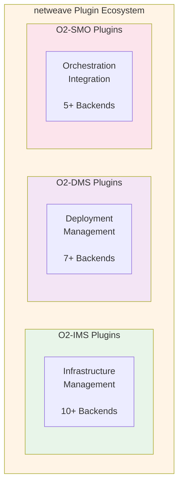

### Plugin Categories

#### 1. O2-IMS Infrastructure Plugins (10+ Backends)

**Purpose**: Manage heterogeneous infrastructure resources through standardized O2-IMS API

| Plugin | Priority | Resource Pools | Resources | Use Case |
|--------|----------|---------------|-----------|----------|
| **Kubernetes** | Core ✅ | MachineSet | Node/Machine | Cloud-native infrastructure |
| **OpenStack** | Highest 📋 | Host Aggregate | Nova Instance | NFVi migration, private cloud |
| **Dell DTIAS** | High 📋 | Server Pool | Physical Server | Bare-metal edge deployments |
| **VMware vSphere** | Medium-High 📋 | Resource Pool | ESXi Host/VM | Enterprise telco infrastructure |
| **AWS EKS** | Medium 📋 | Node Group | EC2 Instance | AWS cloud deployments |
| **Azure AKS** | Medium 📋 | Node Pool | Azure VM | Azure cloud deployments |
| **Google GKE** | Low-Medium 📋 | Node Pool | GCE Instance | GCP cloud, Anthos |
| **Equinix Metal** | Low 📋 | Metal Pool | Bare-Metal | Edge-as-a-Service |
| **Red Hat OpenShift** | Medium 📋 | MachineSet | Node/Machine | Enterprise Kubernetes |
| **Mock** | Testing ✅ | In-Memory | In-Memory | Development, testing, demos |

**Key Benefits**:
- **Hybrid Infrastructure**: Mix cloud (AWS/Azure/GCP) and on-prem (OpenStack/VMware/bare-metal)
- **Vendor Independence**: Single O2-IMS API across all backends
- **NFVi Migration**: Gradual transition from OpenStack NFVi to cloud-native
- **Multi-Cloud**: Deploy across multiple cloud providers transparently

#### 2. O2-DMS Deployment Plugins (7+ Backends)

**Purpose**: CNF/VNF lifecycle management through O2-DMS API

| Plugin | Priority | Package Format | Deployment Target | GitOps |
|--------|----------|---------------|-------------------|--------|
| **Helm** | Highest 📋 | Helm Chart | Kubernetes | No |
| **ArgoCD** | Highest 📋 | Git Repo | Kubernetes | Yes |
| **Flux CD** | Medium 📋 | Git Repo | Kubernetes | Yes |
| **ONAP-LCM** | High 📋 | ONAP Package | Multi-Cloud | No |
| **OSM-LCM** | Medium 📋 | OSM Package | Multi-Cloud | No |
| **Kustomize** | Low-Medium 📋 | Git Repo | Kubernetes | Partial |
| **Crossplane** | Low 📋 | Crossplane XR | Multi-Cloud | Partial |

**Key Benefits**:
- **Unified Deployment API**: Single interface for all deployment technologies
- **GitOps Support**: Native ArgoCD/Flux integration for declarative deployments
- **MANO Integration**: ONAP and OSM for telco-grade orchestration
- **Flexibility**: Choose deployment tool per workload (Helm for simple, ArgoCD for complex)

#### 3. O2-SMO Integration Plugins (5+ Backends)

**Purpose**: Bidirectional SMO integration (northbound inventory sync + southbound orchestration)

| Plugin | Priority | Northbound | DMS Backend | Workflow Engine |
|--------|----------|------------|-------------|-----------------|
| **ONAP** | Highest 📋 | A&AI, DMaaP | SO, SDNC | Camunda |
| **OSM** | High 📋 | VIM Sync | NS/VNF LCM | Native |
| **Custom SMO** | Medium 📋 | Configurable | Configurable | Optional |
| **Cloudify** | Low 📋 | No | TOSCA | Yes |
| **Camunda** | Low 📋 | No | No | Yes (standalone) |

**Dual-Mode Operation**:

**Northbound Mode** (netweave → SMO):
- Sync infrastructure inventory to SMO (ONAP A&AI, OSM VIM)
- Publish infrastructure events to SMO (DMaaP, message bus)
- Enable SMO visibility into O-Cloud resources

**DMS Backend Mode** (SMO → netweave → Deployment):
- SMO orchestrates CNF deployments through netweave O2-DMS API
- netweave routes to ONAP SO or OSM LCM for execution
- Complete closed-loop orchestration

**Key Benefits**:
- **Complete O-RAN Stack**: IMS + DMS + SMO in single gateway
- **ONAP/OSM Native**: Direct integration with major SMO frameworks
- **Bidirectional**: Both inventory sync AND orchestration
- **Flexible**: Support custom SMO frameworks

### Plugin Routing & Configuration

**Configuration-Driven Routing**:

```yaml
routing:
  ims:
    rules:
      # OpenStack for legacy NFV infrastructure
      - name: openstack-nfv
        priority: 100
        plugin: openstack-nfv
        conditions:
          labels:
            infrastructure.type: openstack

      # Bare-metal edge to DTIAS
      - name: bare-metal-edge
        priority: 95
        plugin: dtias-edge
        conditions:
          labels:
            infrastructure.type: bare-metal

      # Default to Kubernetes
      - name: default-k8s
        priority: 1
        plugin: kubernetes

  dms:
    rules:
      # GitOps to ArgoCD
      - name: gitops-deployments
        priority: 100
        plugin: argocd-gitops
        conditions:
          gitOps: true

      # ONAP service models to ONAP LCM
      - name: onap-services
        priority: 95
        plugin: onap-lcm
        packageType: onap-service

      # Default to Helm
      - name: default-helm
        priority: 1
        plugin: helm-deployer
```

**Multi-Backend Aggregation**:

netweave can aggregate results from multiple backends in a single response:

```
SMO Request: GET /o2ims/v1/resources

netweave Routes to:
  → Kubernetes Plugin    → 100 nodes
  → OpenStack Plugin     → 50 VMs
  → DTIAS Plugin         → 20 bare-metal servers

Aggregated Response:
  → 170 total resources (merged, deduplicated)
```

### End-to-End Use Case: Deploy 5G vDU

**Scenario**: Deploy a 5G virtual Distributed Unit (vDU) CNF on hybrid infrastructure

```
1. Infrastructure Provisioning (O2-IMS):
   SMO → netweave O2-IMS API → OpenStack Plugin
   → Provision compute nodes in OpenStack NFVi

2. Subscribe to Events (O2-IMS):
   SMO → netweave O2-IMS API → Create subscription
   ← Webhook when infrastructure ready

3. Upload CNF Package (O2-DMS):
   SMO → netweave O2-DMS API → Helm Plugin
   → Upload vDU Helm chart to repository

4. Deploy CNF (O2-DMS via ONAP):
   SMO → ONAP SO → netweave O2-DMS API → ONAP-LCM Plugin
   → Deploy vDU via ONAP orchestration

5. Monitor Deployment (O2-DMS + O2-SMO):
   netweave → ONAP DMaaP → Publish deployment events
   SMO ← Receives deployment status updates

6. Verify Deployment (O2-DMS):
   SMO → netweave O2-DMS API → Query deployment status
   ← vDU operational, ready for traffic
```

### Implementation Status

**Phase 1: Core (Production Ready)**
- ✅ Kubernetes IMS Plugin
- ✅ Mock IMS Plugin

**Phase 2: Multi-Backend IMS (Specification Complete)**
- 📋 OpenStack NFVi Plugin ⭐ **Highest Priority**
- 📋 Dell DTIAS Plugin
- 📋 VMware vSphere Plugin
- 📋 AWS/Azure/GKE Plugins

**Phase 3: O2-DMS Core (Specification Complete)**
- 📋 Helm Plugin ⭐ **Critical for DMS**
- 📋 ArgoCD GitOps Plugin
- 📋 Flux CD Plugin

**Phase 4: O2-SMO Integration (Specification Complete)**
- 📋 ONAP Integration Plugin ⭐ **Complete O-RAN Stack**
- 📋 OSM Integration Plugin
- 📋 Custom SMO Plugin

**For complete plugin specifications, implementation details, and code examples, see [docs/backend-plugins.md](backend-plugins.md).**

---

## Data Flow

### Request Flow: List Resource Pools

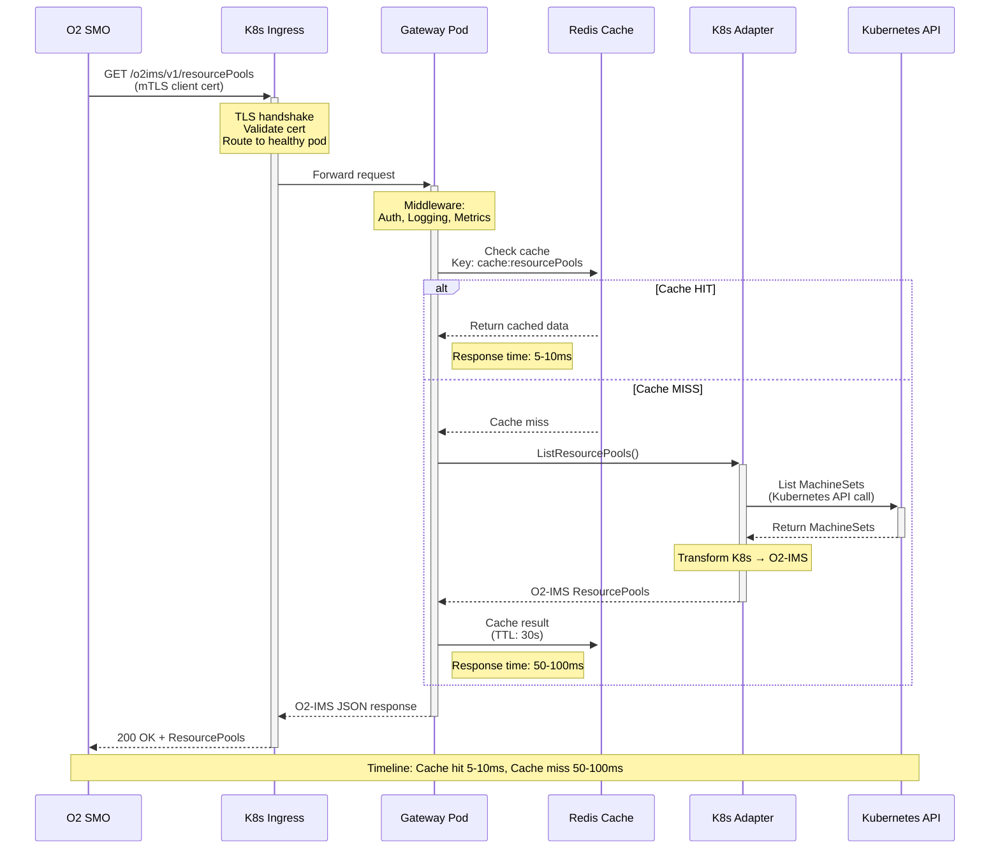

### Write Flow: Create Resource Pool

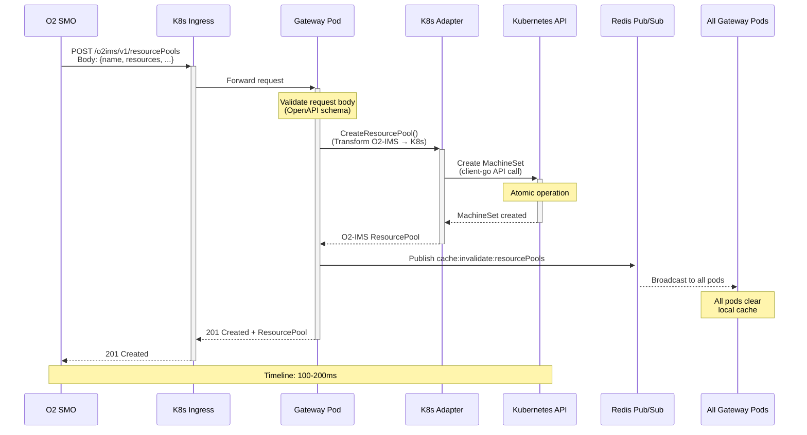

### Subscription Notification Flow

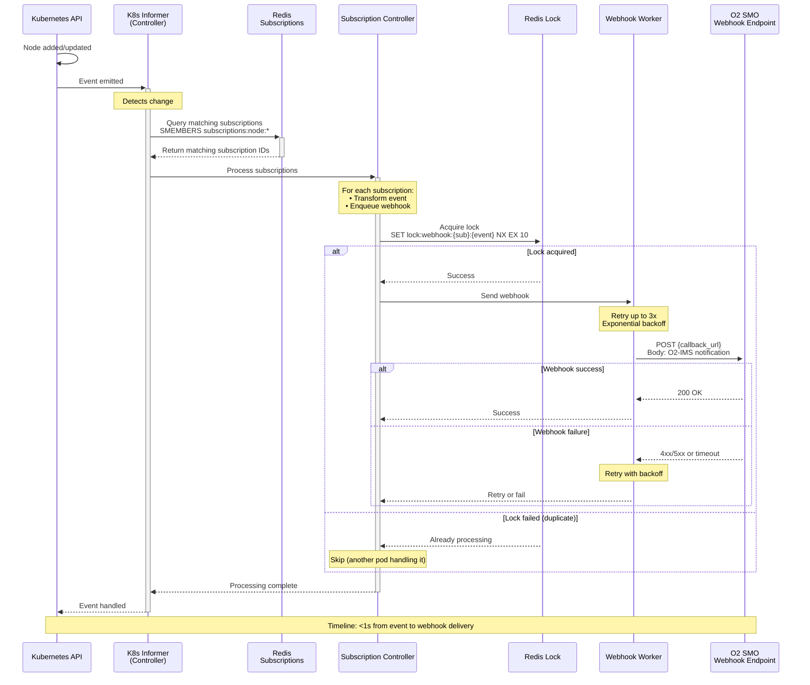

---

## Storage Architecture

### Redis Data Model

#### Subscriptions

```redis
# Subscription object
HSET subscription:550e8400-e29b-41d4-a716-446655440000
  id "550e8400-e29b-41d4-a716-446655440000"
  callback "https://smo.example.com/notifications"
  filter '{"resourcePoolId":"pool-123"}'
  consumerSubscriptionId "smo-sub-456"
  createdAt "2026-01-06T10:30:00Z"
  data '{"id":"550e...","callback":"https://..."}'

# Index: All active subscriptions
SADD subscriptions:active "550e8400-e29b-41d4-a716-446655440000"

# Index: By resource pool
SADD subscriptions:resourcePool:pool-123 "550e8400-e29b-41d4-a716-446655440000"

# Index: By resource type
SADD subscriptions:resourceType:compute "550e8400-e29b-41d4-a716-446655440000"
```

#### Cache

```redis
# Cache resource lists (short TTL)
SETEX cache:nodes '{"items":[{...}]}' 30
SETEX cache:resourcePools '{"items":[{...}]}' 30
SETEX cache:resources:pool-123 '{"items":[{...}]}' 30

# Cache individual resources (longer TTL)
SETEX cache:node:node-abc '{"id":"node-abc",...}' 60
SETEX cache:resourcePool:pool-123 '{"id":"pool-123",...}' 60

# Cache statistics
SETEX cache:stats:summary '{"nodes":100,"pools":10}' 120
```

#### Pub/Sub Channels

```redis
# Cache invalidation
PUBLISH cache:invalidate:nodes "node-abc-deleted"
PUBLISH cache:invalidate:resourcePools "pool-123-updated"

# Subscription events
PUBLISH subscriptions:created "550e8400-e29b-41d4-a716-446655440000"
PUBLISH subscriptions:deleted "550e8400-e29b-41d4-a716-446655440000"
```

#### Distributed Locks

```redis
# Webhook delivery lock (prevent duplicate sends)
SET lock:webhook:550e8400:event-123 "gateway-pod-2" NX EX 10

# Cache refresh lock (only one pod refreshes)
SET lock:cache:nodes "gateway-pod-1" NX EX 5

# Background job lock
SET lock:job:cleanup "controller-pod-1" NX EX 30
```

### Redis Sentinel Configuration

```yaml
# 3-node Sentinel setup (quorum=2)
Master:
  - Host: redis-master-0
  - Port: 6379
  - Persistence: AOF (appendonly yes) + RDB
  - Max Memory: 2GB
  - Eviction: allkeys-lru

Replicas:
  - redis-replica-1 (async replication from master)
  - redis-replica-2 (async replication from master)

Sentinels:
  - redis-sentinel-0:26379
  - redis-sentinel-1:26379
  - redis-sentinel-2:26379
  - Quorum: 2
  - Down-after-milliseconds: 5000
  - Failover-timeout: 10000
```

### Kubernetes State (Source of Truth)

All infrastructure state lives in Kubernetes:

```
Resources (K8s) → O2-IMS Mapping
─────────────────────────────────
Nodes          → Resources
MachineSets    → ResourcePools
Machines       → Resources (with lifecycle)
StorageClasses → ResourceTypes
PVs            → Storage Resources
```

Gateway never modifies K8s state directly in Redis - Redis is only for:
1. Subscriptions (O2-IMS specific, not in K8s)
2. Performance caching
3. Inter-pod communication

---

## Security Architecture

### Zero-Trust Principles

1. **Assume Breach**: Design for scenarios where perimeter is compromised
2. **Verify Explicitly**: Authenticate and authorize every request
3. **Least Privilege**: Minimal permissions for all components
4. **Encrypt Everything**: mTLS for all communication

### Authentication & Authorization

#### North-Bound (SMO → Gateway)

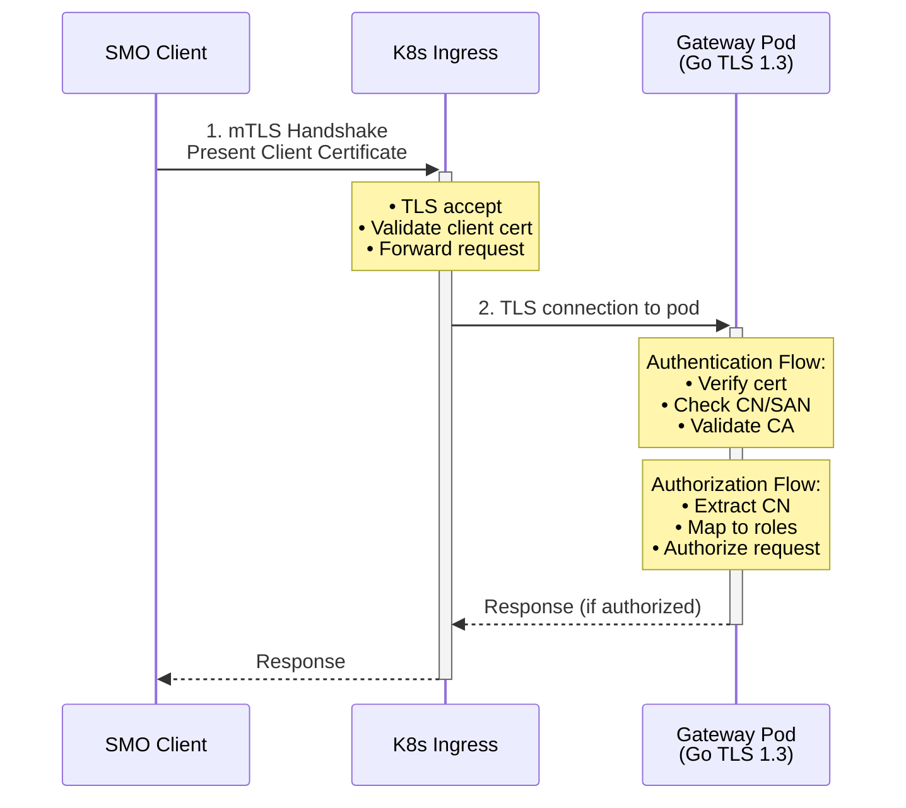

**Certificate Requirements**:
- Client certificates issued by trusted CA
- CN contains SMO identifier
- SAN includes callback domain
- Certificates rotated every 90 days (cert-manager automation)

**Authorization Model**:
```go
type Permission string

const (
    ReadResources  Permission = "resources:read"
    WriteResources Permission = "resources:write"
    ManageSubscriptions Permission = "subscriptions:manage"
)

// Map SMO identity to permissions
func authorize(clientCN string, requiredPerm Permission) bool {
    // Example: CN=smo-system-1,OU=orchestration
    roles := getRolesFromCertificate(clientCN)
    return roles.Has(requiredPerm)
}
```

#### South-Bound (Gateway → Kubernetes)

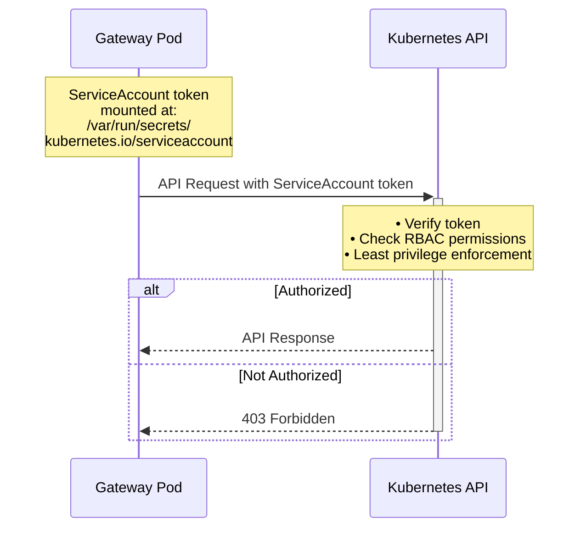

**ServiceAccount Permissions** (RBAC):
```yaml
apiVersion: rbac.authorization.k8s.io/v1
kind: ClusterRole
metadata:
  name: o2ims-gateway
rules:
  # Read infrastructure resources
  - apiGroups: [""]
    resources: ["nodes", "persistentvolumes", "storageclasses"]
    verbs: ["get", "list", "watch"]

  # Manage machine resources
  - apiGroups: ["machine.openshift.io"]
    resources: ["machinesets", "machines"]
    verbs: ["get", "list", "watch", "create", "update", "delete"]

  # NO access to secrets, pods, deployments (least privilege)
```

### mTLS Architecture

#### Certificate Hierarchy

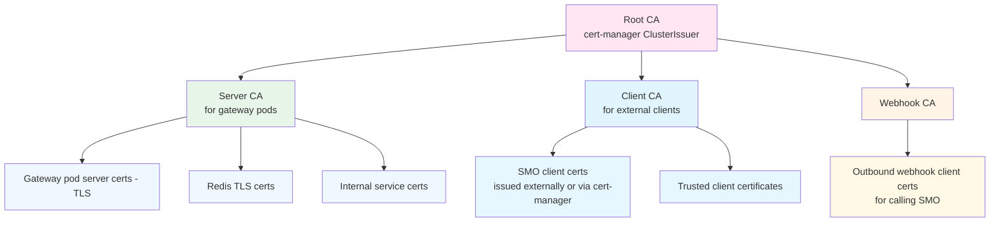

#### mTLS Flows

**External (SMO → Gateway)**:
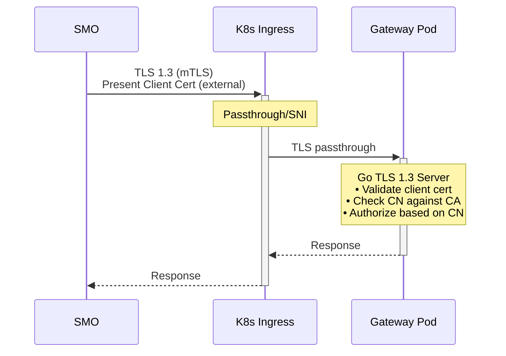

**Internal (Gateway → Redis)**:
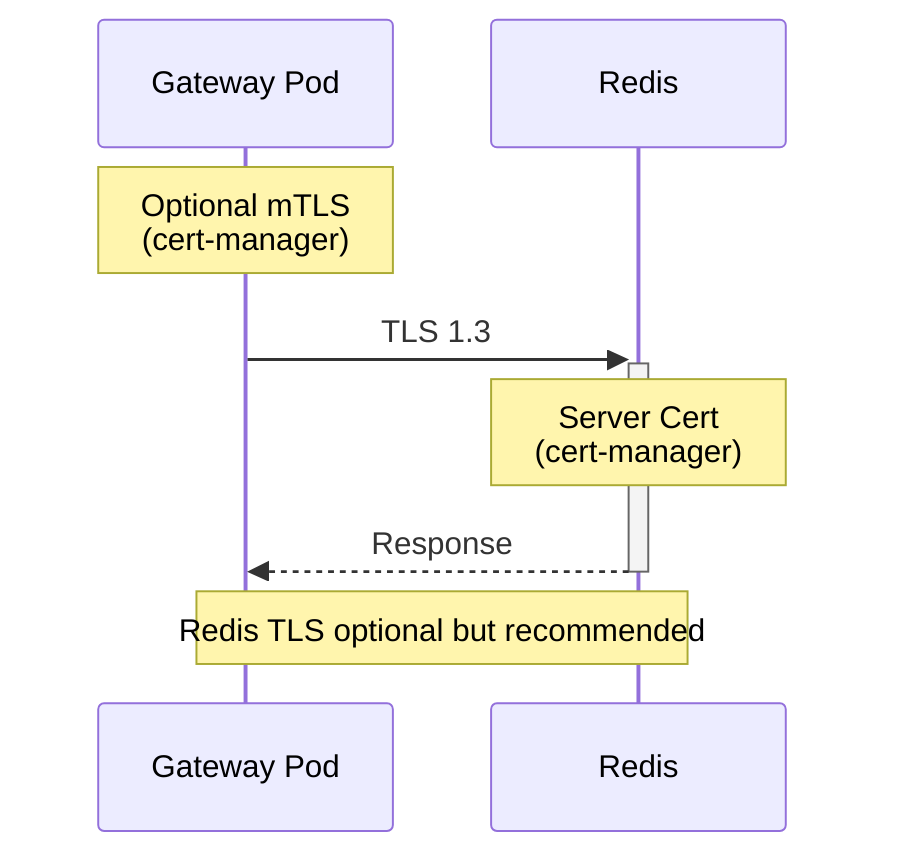

**Outbound (Controller → SMO Webhook)**:
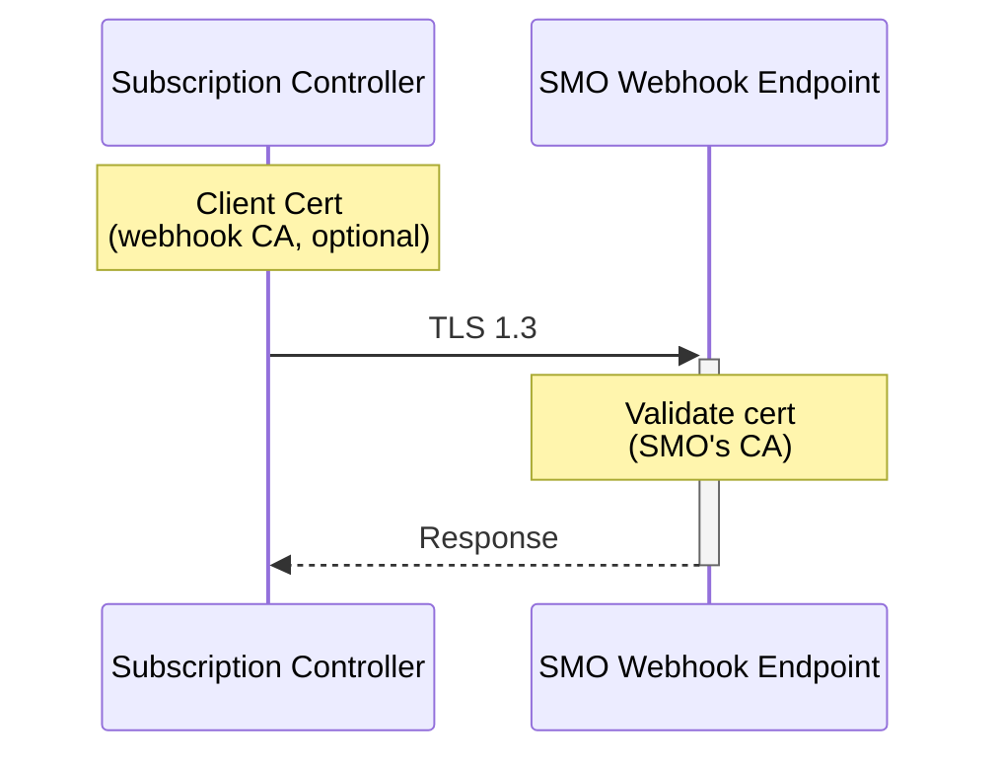

### Secrets Management

**No Hardcoded Secrets - EVER**

All secrets via:
1. **Kubernetes Secrets** (for small secrets)
   ```yaml
   env:
     - name: REDIS_PASSWORD
       valueFrom:
         secretKeyRef:
           name: redis-credentials
           key: password
   ```

2. **cert-manager** (for certificates)
   - Automatic issuance
   - Auto-renewal before expiry
   - Rotation without downtime

3. **External Secrets Operator** (optional, for enterprise)
   - Sync from HashiCorp Vault
   - Sync from AWS Secrets Manager
   - Automatic rotation

**Secrets Lifecycle**:
```
1. Creation    → cert-manager or External Secrets Operator
2. Storage     → Kubernetes Secrets (etcd encrypted at rest)
3. Delivery    → Mounted as volume or environment variable
4. Rotation    → Automatic (cert-manager watches expiry)
5. Deletion    → Kubernetes Secret deletion
```

### Network Security

#### Network Policies

```yaml
# Restrict gateway pod ingress
apiVersion: networking.k8s.io/v1
kind: NetworkPolicy
metadata:
  name: gateway-ingress
spec:
  podSelector:
    matchLabels:
      app: netweave-gateway
  ingress:
    # Allow from ingress controller
    - from:
      - namespaceSelector:
          matchLabels:
            name: ingress-nginx  # or your ingress controller namespace
      ports:
      - protocol: TCP
        port: 8443  # HTTPS port
```

```yaml
# Restrict gateway pod egress
apiVersion: networking.k8s.io/v1
kind: NetworkPolicy
metadata:
  name: gateway-egress
spec:
  podSelector:
    matchLabels:
      app: netweave-gateway
  egress:
    # Only to K8s API server
    - to:
      - namespaceSelector:
          matchLabels:
            name: kube-system
      ports:
      - protocol: TCP
        port: 6443

    # Only to Redis
    - to:
      - podSelector:
          matchLabels:
            app: redis
      ports:
      - protocol: TCP
        port: 6379

    # Only to SMO webhooks (external)
    - to:
      - namespaceSelector: {}
      ports:
      - protocol: TCP
        port: 443
```

### Security Monitoring

**Audit Logging**:
- All API requests logged (structured)
- Authentication failures logged
- Authorization denials logged
- Sensitive data redacted

**Metrics**:
```
# Authentication metrics
o2ims_auth_total{status="success|failure"}
o2ims_auth_failures_by_client{client_cn="..."}

# Authorization metrics
o2ims_authz_total{resource="...",action="...",result="allow|deny"}

# TLS metrics
o2ims_tls_handshake_duration_seconds
o2ims_tls_cert_expiry_seconds
```

**Alerts**:
- Certificate expiring in < 7 days
- Repeated authentication failures
- Authorization denial spike
- TLS handshake failures

---

*Continued in next section...*
