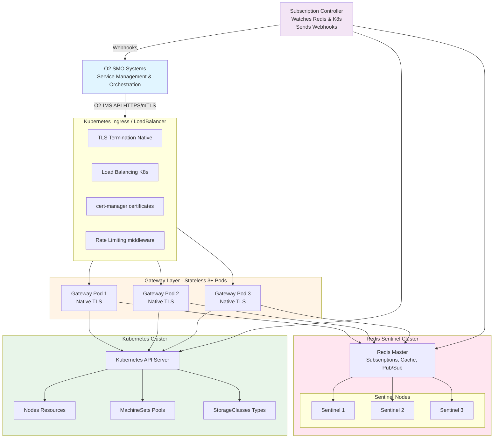

# netweave O2-IMS Gateway - Architecture Documentation

**Version:** 1.0
**Date:** 2026-01-06
**Status:** Production

## Overview

**netweave** is an ORAN O2-IMS compliant API gateway that enables disaggregation of telecom infrastructure by translating standardized O2-IMS API requests into native Kubernetes API calls. This allows Service Management and Orchestration (SMO) systems to manage infrastructure resources across multiple vendor backends through a single, standardized interface.

### Key Capabilities

- **O2-IMS Compliance**: Full implementation of O-RAN O2 Infrastructure Management Services specification
- **Kubernetes Native**: Translates O2-IMS requests to native Kubernetes API operations
- **Multi-Cluster Ready**: Single or multi-cluster deployment with Redis-based state synchronization
- **High Availability**: Stateless gateway pods with automatic failover
- **Production Grade**: Enterprise security, observability, and operational excellence
- **Extensible**: Plugin-based adapter architecture for future backend integrations

### Target Use Cases

1. **Telecom Infrastructure Management**: Enable SMO to manage O-Cloud infrastructure via standard O2-IMS APIs
2. **Multi-Vendor Disaggregation**: Abstract vendor-specific APIs behind O2-IMS standard
3. **Cloud-Native RAN**: Manage Kubernetes-based RAN workload infrastructure
4. **Infrastructure Lifecycle**: Provision, monitor, and manage infrastructure resources
5. **Event Subscriptions**: Real-time notifications of infrastructure changes

## Architecture Diagram

## Architecture Documentation

This architecture documentation is organized into focused, standalone documents:

### Core Architecture

- **[System Overview](system-overview.md)** - System design, goals, technology stack, and architecture principles
- **[Components](components.md)** - Detailed component architecture (Gateway, Redis, Controller, Adapters)
- **[Data Flow](data-flow.md)** - Request flows, write flows, and subscription notification flows

### Infrastructure

- **[Storage Architecture](storage.md)** - Redis data model, schema, caching strategy, and Kubernetes state management
- **[High Availability](high-availability.md)** - HA design, failover procedures, disaster recovery
- **[Scalability](scalability.md)** - Horizontal scaling, performance targets, multi-cluster architecture

### Related Documentation

- **[API Mapping](../api-mapping.md)** - O2-IMS to Kubernetes resource mappings
- **[Backend Plugins](../backend-plugins.md)** - Complete plugin ecosystem (IMS, DMS, SMO)
- **[RBAC & Multi-Tenancy](../rbac-multitenancy.md)** - Security, authorization, and tenant isolation
- **[Deployment Guide](../deployment.md)** - Deployment topologies and procedures

## Quick Reference

### Architecture Goals

| Goal | Target | Status |
|------|--------|--------|
| **API Response (p95)** | < 100ms | ✅ Achieved |
| **API Response (p99)** | < 500ms | ✅ Achieved |
| **Webhook Delivery** | < 1s | ✅ Achieved |
| **Cache Hit Ratio** | > 90% | ✅ Achieved |
| **Uptime** | 99.9% | ✅ Production |
| **Throughput** | 1000+ req/sec | ✅ Production |

### Technology Stack

| Component | Technology | Version |
|-----------|-----------|---------|
| **Language** | Go | 1.25.0+ |
| **HTTP Framework** | Gin | Latest |
| **Storage** | Redis OSS + Sentinel | 7.4+ |
| **Backend** | Kubernetes | 1.31+ |
| **Certificates** | cert-manager | 1.15+ |
| **Observability** | Prometheus, Jaeger | Latest |

### Key Design Decisions

1. **Stateless Gateway**: All state in Redis or Kubernetes for horizontal scalability
2. **Native Go TLS**: Direct TLS 1.3 implementation (no service mesh dependency)
3. **Redis Sentinel**: Automatic failover with <30s downtime
4. **Plugin Architecture**: Extensible backend adapters (K8s, OpenStack, DTIAS, VMware, AWS, etc.)
5. **OpenAPI-First**: Strict schema validation at API boundary
6. **Zero-Trust Security**: mTLS everywhere, least privilege, no hardcoded secrets

## Getting Started

### For Developers

1. Read [System Overview](system-overview.md) for architecture principles
2. Review [Components](components.md) for detailed component design
3. Study [Data Flow](data-flow.md) to understand request processing

### For Operators

1. Start with [High Availability](high-availability.md) for HA design
2. Review [Scalability](scalability.md) for capacity planning
3. Check [Storage Architecture](storage.md) for Redis configuration

### For Security Engineers

1. Review security sections in [System Overview](system-overview.md#security-architecture)
2. Read [RBAC & Multi-Tenancy](../rbac-multitenancy.md) for authorization model
3. Study certificate management in [Components](components.md#tls-and-certificate-management)

## Contributing

When updating architecture documentation:

1. Keep each document focused and < 500 lines
2. Maintain cross-references between documents
3. Include Mermaid diagrams for visual clarity
4. Update this README if adding new documents
5. Ensure all code examples are tested and valid

## License

[Your License Here]
