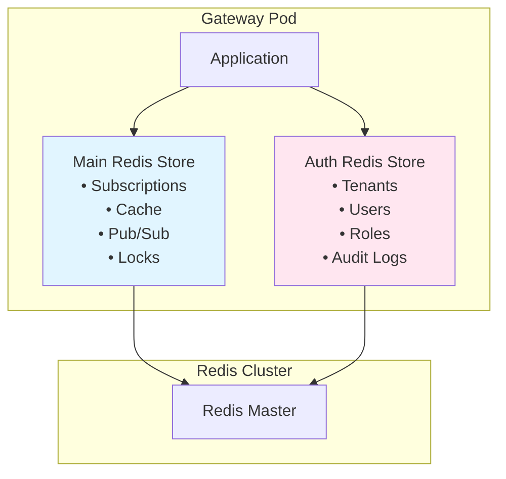
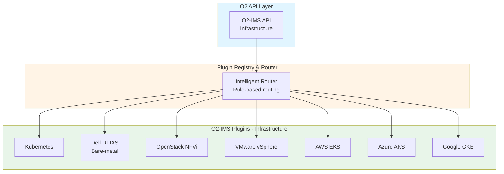
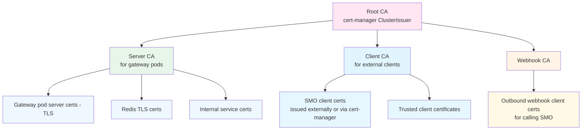
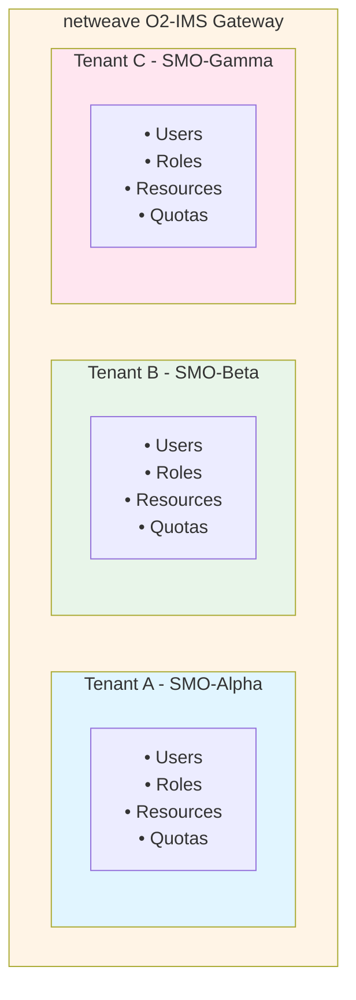
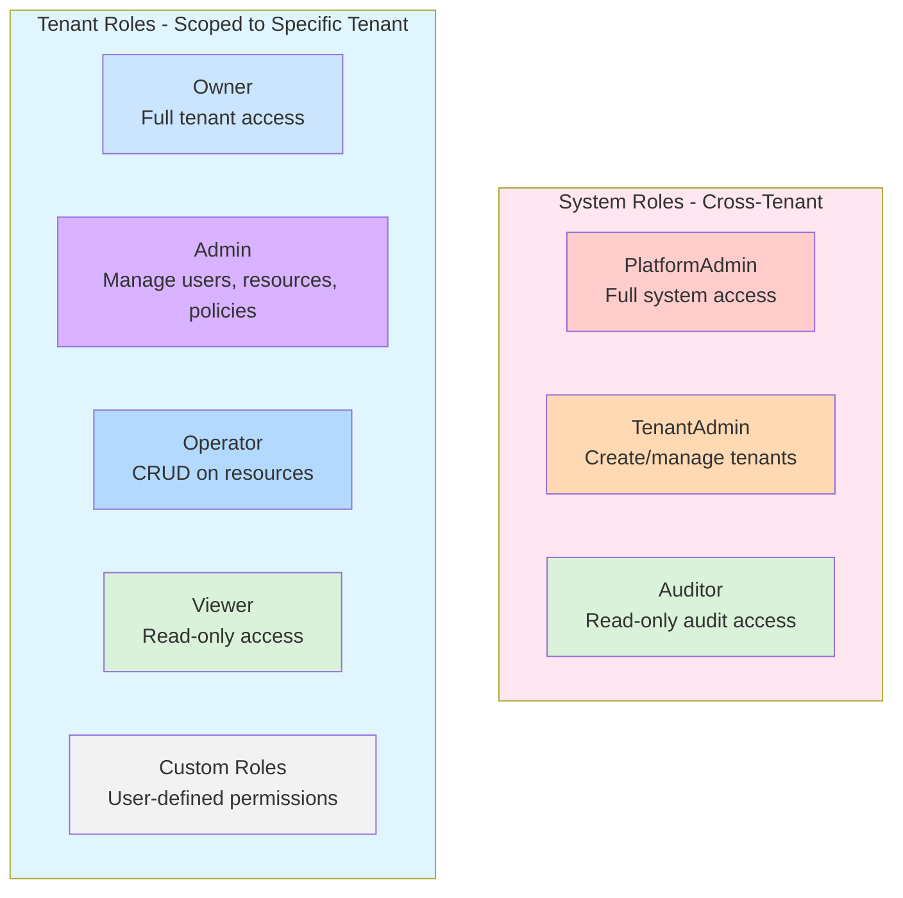

# Components

**Purpose**: Detailed architecture of Gateway, Redis, Controller, and backend adapters.

## Table of Contents

1. [Gateway Pods](#gateway-pods)
2. [Redis Cluster](#redis-cluster)
3. [Subscription Controller](#subscription-controller)
4. [Plugin Architecture](#plugin-architecture)
5. [API Versioning](#api-versioning)
6. [TLS and Certificate Management](#tls-and-certificate-management)
7. [RBAC and Multi-Tenancy](#rbac-and-multi-tenancy)

---

## Gateway Pods

**Responsibility**: Handle O2-IMS API requests, translate to backend operations

```go
// High-level structure
type Gateway struct {
    // HTTP server (Gin framework)
    router *gin.Engine

    // O2-IMS handlers
    dmHandler   *DeploymentManagerHandler
    poolHandler *ResourcePoolHandler
    resHandler  *ResourceHandler
    subHandler  *SubscriptionHandler

    // Backend adapter
    adapter adapter.BackendAdapter

    // Cache layer
    cache cache.Cache

    // Observability
    metrics *prometheus.Registry
    tracer  trace.Tracer
    logger  *zap.Logger
}
```

### Characteristics

- **Stateless**: No local state (all in Redis or K8s)
- **Identical**: All pods are equal, no leader
- **Scalable**: Add/remove pods without coordination
- **Fast startup**: < 5s to ready state

### Lifecycle

1. Load configuration (env vars, ConfigMap)
2. Connect to Redis (Sentinel)
3. Connect to Kubernetes API
4. Load OpenAPI specification
5. Register routes and middleware
6. Start HTTP server on port 8080
7. Signal readiness (liveness/readiness probes)

### API Documentation

The gateway includes built-in API documentation served via Swagger UI:

| Endpoint | Description |
|----------|-------------|
| `/docs/` | Interactive Swagger UI for API exploration |
| `/docs/openapi.yaml` | OpenAPI 3.0 specification (YAML format) |
| `/openapi.yaml` | OpenAPI specification (root path alias) |

**Security Features**:
- Pinned Swagger UI version (5.11.0) for reproducibility
- Subresource Integrity (SRI) hashes for all CDN resources
- Content Security Policy (CSP) headers
- Security headers (X-Content-Type-Options, X-Frame-Options, Referrer-Policy)

**Fail-Fast Loading**: The gateway requires the OpenAPI specification to be present at startup. If the spec file is not found, the gateway will fail to start. This ensures documentation is always available in production.

---

## Redis Cluster

**Responsibility**: Shared state, caching, pub/sub

### Deployment

Redis Sentinel for HA:
- 1 master + 2+ replicas per cluster
- Automatic failover via Sentinel (quorum=2)
- Persistence: AOF + RDB snapshots

### Data Stored

**1. Subscriptions** (primary data):
```redis
subscription:{uuid} → Hash {id, callback, filter, ...}
subscriptions:active → Set of UUIDs
subscriptions:resourcePool:{id} → Set of UUIDs
```

**2. Cache** (performance optimization):
```redis
cache:nodes:list → JSON (TTL: 30s)
cache:resourcePools:list → JSON (TTL: 30s)
cache:node:{id} → JSON (TTL: 60s)
```

**3. Pub/Sub** (inter-pod communication):
```redis
cache:invalidate:nodes → Event stream
subscriptions:created → Event stream
subscriptions:deleted → Event stream
```

**4. Distributed Locks** (coordination):
```redis
lock:webhook:{sub_id}:{event_id} → {pod_id} (TTL: 10s)
lock:cache:refresh → {pod_id} (TTL: 5s)
```

### Dual Redis Connection Architecture

When multi-tenancy is enabled, the gateway maintains **two separate Redis connections**:

1. **Main Storage** (`storage.RedisStore`): Subscriptions, caching, pub/sub, and distributed locks
2. **Auth Storage** (`auth.RedisStore`): Tenants, users, roles, role bindings, and audit logs



**Rationale for Separation**:

| Concern | Main Storage | Auth Storage |
|---------|--------------|--------------|
| **Data Lifecycle** | Short-lived (cache TTL) | Long-lived (persistent) |
| **Access Pattern** | High-frequency reads | Low-frequency, write-heavy |
| **Security** | General data | Sensitive credentials |
| **Failure Isolation** | Can degrade gracefully | Must be available for auth |
| **Health Checks** | Standard ping | Registered separately |

---

## Subscription Controller

**Responsibility**: Watch for K8s changes, send webhook notifications

```go
type SubscriptionController struct {
    redis      *redis.Client
    k8sClient  client.Client
    subStore   storage.SubscriptionStore
    webhookSvc *WebhookService
}

// Main loop
func (c *SubscriptionController) Run(ctx context.Context) {
    // Watch K8s resources
    nodeInformer.AddEventHandler(...)
    podInformer.AddEventHandler(...)

    // Watch Redis subscription events
    go c.syncRedisSubscriptions(ctx)

    // Process notification queue
    go c.processWebhooks(ctx)
}
```

### Deployment

3+ pods with leader election:
- Only leader actively sends webhooks (prevents duplicates)
- Standby pods ready for immediate takeover
- Leader election via Kubernetes Lease object

### Event Processing

1. K8s informer detects change (Node added, Pod failed, etc.)
2. Query subscriptions from Redis matching the change
3. For each matching subscription:
   - Transform K8s event to O2-IMS format
   - Enqueue webhook delivery
4. Webhook worker:
   - Acquire distributed lock (prevent duplicates)
   - POST to callback URL
   - Retry with exponential backoff (3 attempts)
   - Update subscription status

### Leader Election

```go
func (c *Controller) Run(ctx context.Context) error {
    // Use Kubernetes Lease for leader election
    lock := &resourcelock.LeaseLock{
        LeaseMeta: metav1.ObjectMeta{
            Name:      "subscription-controller-leader",
            Namespace: "o2ims-system",
        },
        Client: c.k8sClient,
        LockConfig: resourcelock.ResourceLockConfig{
            Identity: c.podName,
        },
    }

    leaderelection.RunOrDie(ctx, leaderelection.LeaderElectionConfig{
        Lock:          lock,
        LeaseDuration: 15 * time.Second,
        RenewDeadline: 10 * time.Second,
        RetryPeriod:   2 * time.Second,
        Callbacks: leaderelection.LeaderCallbacks{
            OnStartedLeading: func(ctx context.Context) {
                log.Info("became leader, starting controller")
                c.runController(ctx)
            },
            OnStoppedLeading: func() {
                log.Info("lost leadership, stopping controller")
                c.stopController()
            },
        },
    })
}
```

**Failover**:
- Leader heartbeat every 15s
- If leader misses 2 heartbeats (30s), new leader elected
- New leader resumes from Redis state (no data loss)
- Webhook queue preserved in Redis

---

## Plugin Architecture

**Responsibility**: Provide comprehensive pluggable backend system for O2-IMS operations

The netweave gateway implements a **plugin architecture** supporting multiple backend adapters:



**For complete plugin specifications, see [Backend Plugins](../backend-plugins.md).**

### Adapter Interface

All backend implementations must satisfy the `Adapter` interface:

```go
// internal/adapter/adapter.go

package adapter

// Adapter is the pluggable backend interface
type Adapter interface {
    // Metadata
    Name() string
    Version() string
    Capabilities() []Capability

    // Deployment Managers
    ListDeploymentManagers(ctx context.Context, filter *Filter) ([]*DeploymentManager, error)
    GetDeploymentManager(ctx context.Context, id string) (*DeploymentManager, error)

    // Resource Pools
    ListResourcePools(ctx context.Context, filter *Filter) ([]*ResourcePool, error)
    GetResourcePool(ctx context.Context, id string) (*ResourcePool, error)
    CreateResourcePool(ctx context.Context, pool *ResourcePool) (*ResourcePool, error)
    UpdateResourcePool(ctx context.Context, id string, pool *ResourcePool) (*ResourcePool, error)
    DeleteResourcePool(ctx context.Context, id string) error

    // Resources
    ListResources(ctx context.Context, filter *Filter) ([]*Resource, error)
    GetResource(ctx context.Context, id string) (*Resource, error)
    CreateResource(ctx context.Context, resource *Resource) (*Resource, error)
    DeleteResource(ctx context.Context, id string) error

    // Resource Types
    ListResourceTypes(ctx context.Context, filter *Filter) ([]*ResourceType, error)
    GetResourceType(ctx context.Context, id string) (*ResourceType, error)

    // Subscriptions (backend may or may not support)
    SupportsSubscriptions() bool
    Subscribe(ctx context.Context, sub *Subscription) error
    Unsubscribe(ctx context.Context, id string) error

    // Health and lifecycle
    Health(ctx context.Context) error
    Close() error
}

// Capability describes what operations a backend supports
type Capability string

const (
    CapResourcePoolCreate   Capability = "resource-pool-create"
    CapResourcePoolUpdate   Capability = "resource-pool-update"
    CapResourcePoolDelete   Capability = "resource-pool-delete"
    CapResourceCreate       Capability = "resource-create"
    CapResourceDelete       Capability = "resource-delete"
    CapSubscriptions        Capability = "subscriptions"
    CapRealTimeEvents       Capability = "real-time-events"
)
```

### Configuration-Driven Routing

Backend selection is configured via YAML:

```yaml
# config/gateway.yaml

adapters:
  # Kubernetes adapter (default)
  - name: kubernetes
    type: k8s
    enabled: true
    default: true
    config:
      kubeconfig: /etc/kubernetes/admin.conf
      namespace: default
      ocloudId: ocloud-kubernetes-1

  # Dell DTIAS adapter
  - name: dtias
    type: dtias
    enabled: true
    config:
      endpoint: https://dtias.dell.com/api
      apiKey: ${DTIAS_API_KEY}
      timeout: 30s
      ocloudId: ocloud-dtias-1

# Routing rules: which backend for which resource type
routing:
  rules:
    # All bare-metal resource pools go to DTIAS
    - resourceType: ResourcePool
      filter:
        extensions.type: "bare-metal"
      adapter: dtias
      priority: 10

    # Everything else goes to Kubernetes (default)
    - resourceType: "*"
      adapter: kubernetes
      priority: 1
```

---

## API Versioning

**Responsibility**: Provide stable, evolvable O2-IMS API with backwards compatibility

### Version URL Structure

```
/o2ims-infrastructureInventory/v1/resourcePools       # API v1 (current, stable)
/o2ims/v2/resourcePools       # API v2 (future, with enhancements)
```

### Version Support Matrix

| Version | Status | Release Date | Deprecation Date | Sunset Date |
|---------|--------|--------------|------------------|-------------|
| v1 | Stable | 2026-01-01 | - | - |
| v2 | Planned | 2026-07-01 | - | - |

### Deprecation Policy

1. **Announce Deprecation**: At least 6 months before removal
2. **Mark as Deprecated**: Add `X-API-Deprecated: true` header to responses
3. **Provide Migration Guide**: Document changes and migration path
4. **Grace Period**: Minimum 12 months from deprecation announcement
5. **Final Removal**: Remove deprecated version after grace period

Example deprecation header:

```http
HTTP/1.1 200 OK
X-API-Deprecated: true
X-API-Deprecation-Date: 2026-07-01
X-API-Sunset-Date: 2027-01-01
X-API-Migration-Guide: https://docs.netweave.io/migration/v1-to-v2
Content-Type: application/json
```

---

## TLS and Certificate Management

**Responsibility**: Secure communication, certificate lifecycle

**Implementation**: Native Go TLS + cert-manager

### Native Go TLS 1.3

```go
// internal/server/tls.go
func configureTLS(cfg *config.Config) *tls.Config {
    // Load server certificate
    cert, _ := tls.LoadX509KeyPair(cfg.TLS.CertPath, cfg.TLS.KeyPath)

    // Load CA for client verification
    caCert, _ := os.ReadFile(cfg.TLS.CACertPath)
    caCertPool := x509.NewCertPool()
    caCertPool.AppendCertsFromPEM(caCert)

    return &tls.Config{
        Certificates: []tls.Certificate{cert},
        ClientAuth:   tls.RequireAndVerifyClientCert,
        ClientCAs:    caCertPool,
        MinVersion:   tls.VersionTLS13,
        CipherSuites: []uint16{
            tls.TLS_AES_256_GCM_SHA384,
            tls.TLS_AES_128_GCM_SHA256,
            tls.TLS_CHACHA20_POLY1305_SHA256,
        },
    }
}
```

### cert-manager Integration

- Automatic certificate issuance
- Auto-renewal (90-day rotation)
- Kubernetes Secret storage
- No manual certificate management

### Certificate Hierarchy



### Client Certificate Validation

```go
// Middleware to extract and validate client cert
func ClientCertAuth() gin.HandlerFunc {
    return func(c *gin.Context) {
        if c.Request.TLS == nil || len(c.Request.TLS.PeerCertificates) == 0 {
            c.AbortWithStatusJSON(401, gin.H{"error": "client certificate required"})
            return
        }

        clientCert := c.Request.TLS.PeerCertificates[0]
        clientCN := clientCert.Subject.CommonName

        // Store identity for authorization
        c.Set("clientIdentity", clientCN)
        c.Next()
    }
}
```

---

## RBAC and Multi-Tenancy

**Responsibility**: Secure multi-tenant access control and resource isolation

**Implementation**: Built-in from the start

netweave is designed as an **enterprise multi-tenant platform** with comprehensive RBAC from day one. This enables multiple SMO systems (tenants) to securely share the same gateway while maintaining strict resource isolation.

**For complete RBAC and multi-tenancy documentation, see [RBAC & Multi-Tenancy](../rbac-multitenancy.md).**

### Multi-Tenancy Architecture

**Tenant Model**:


### RBAC Model

**Role Hierarchy**:


### Tenant Isolation

All Kubernetes resources MUST be labeled with tenant ID:

```yaml
apiVersion: machine.openshift.io/v1beta1
kind: MachineSet
metadata:
  name: production-pool
  labels:
    # Tenant isolation label (REQUIRED)
    o2ims.oran.org/tenant: smo-alpha

    # O2-IMS resource labels
    o2ims.oran.org/resource-pool-id: pool-123
spec:
  replicas: 5
  template:
    metadata:
      labels:
        o2ims.oran.org/tenant: smo-alpha
```

---

## Next Steps

- **[Data Flow](data-flow.md)**: Request and event processing flows
- **[Storage Architecture](storage.md)**: Redis data model and schema
- **[High Availability](high-availability.md)**: HA design and failover
- **[Backend Plugins](../backend-plugins.md)**: Complete plugin ecosystem
- **[RBAC & Multi-Tenancy](../rbac-multitenancy.md)**: Security and authorization
