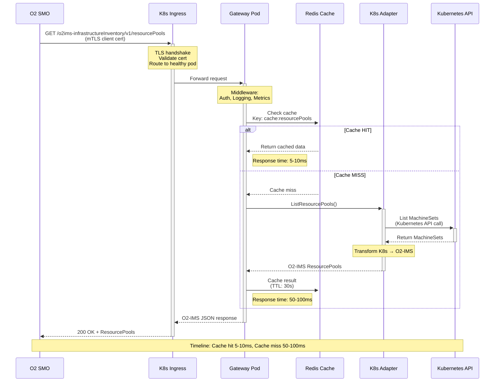
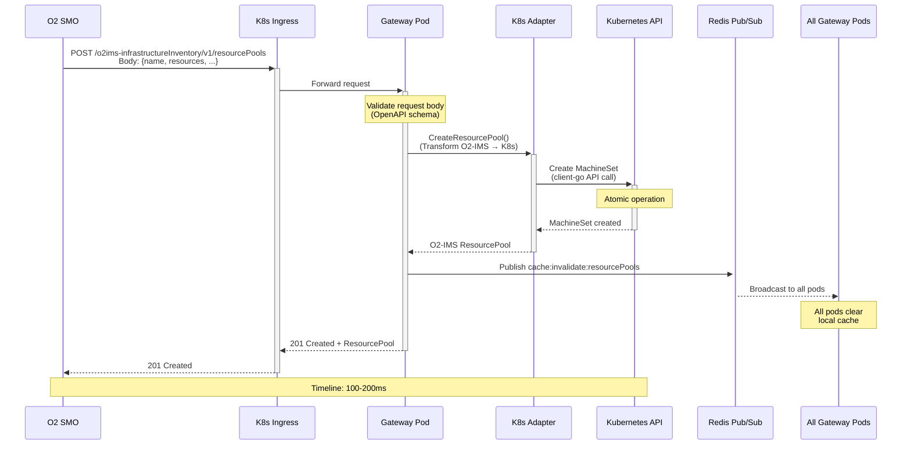
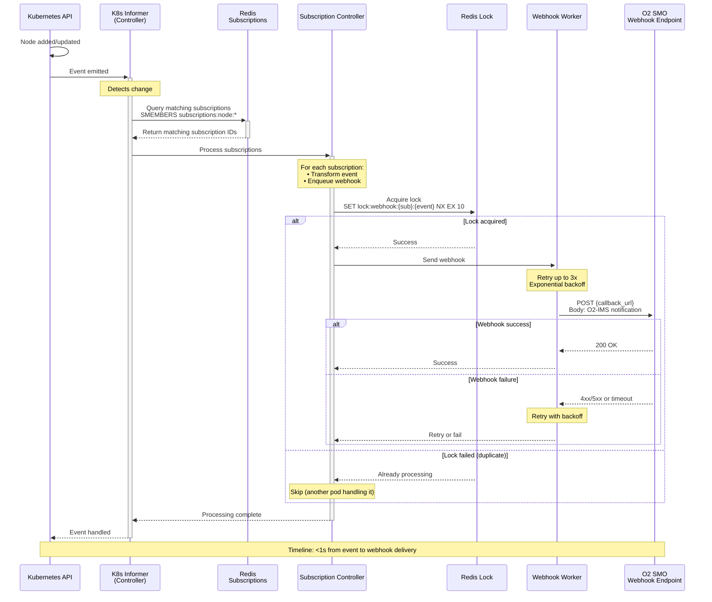
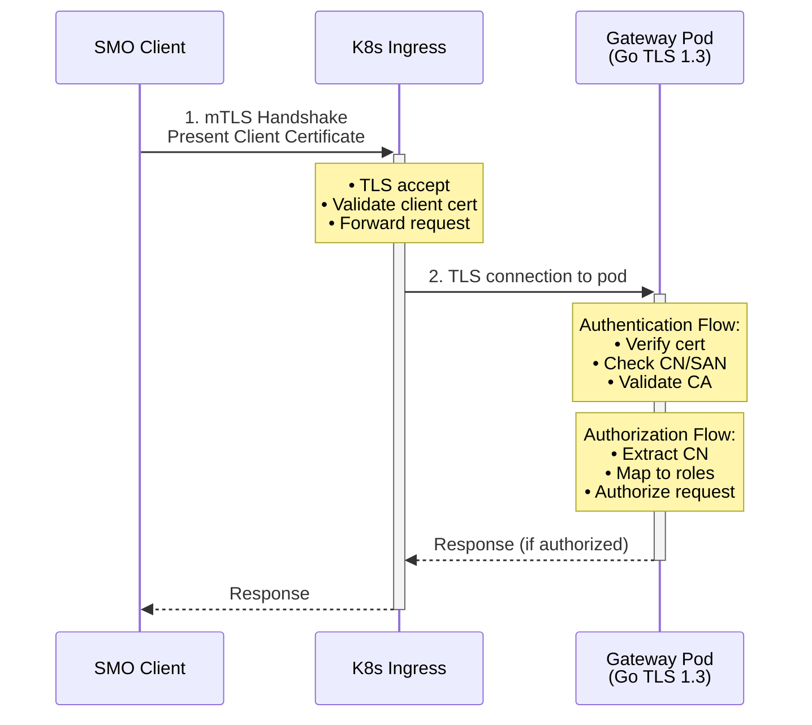
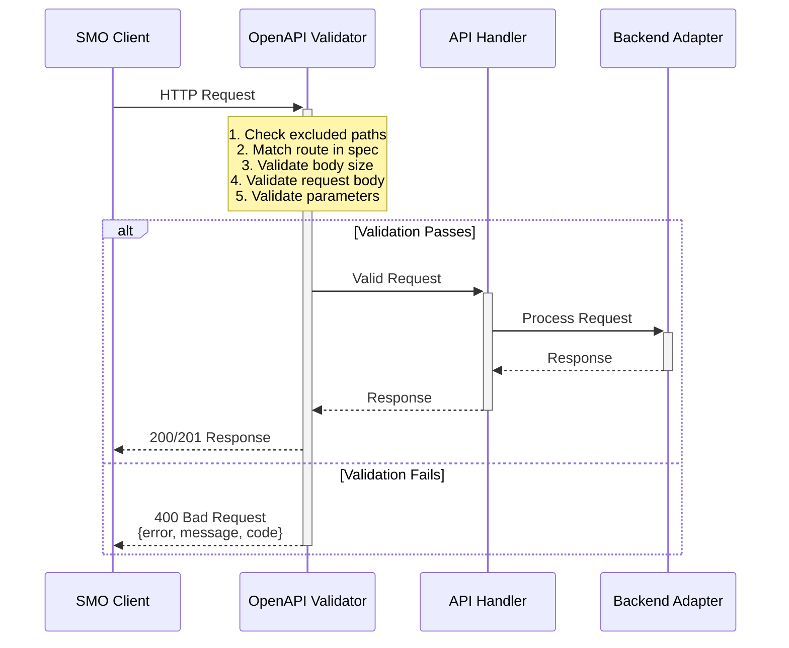
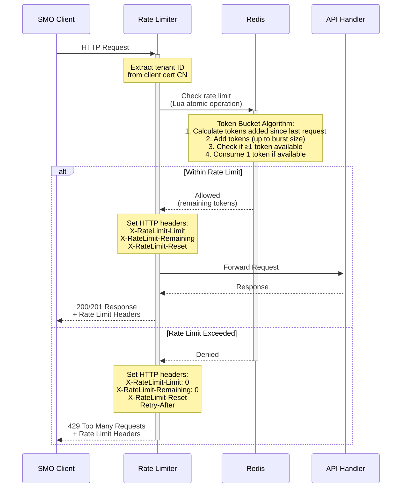

# Data Flow

**Purpose**: Request flows, write flows, and subscription notification flows.

## Table of Contents

1. [Request Flow: List Resource Pools](#request-flow-list-resource-pools)
2. [Write Flow: Create Resource Pool](#write-flow-create-resource-pool)
3. [Subscription Notification Flow](#subscription-notification-flow)
4. [Authentication Flow](#authentication-flow)
5. [OpenAPI Request Validation](#openapi-request-validation)
6. [Distributed Rate Limiting](#distributed-rate-limiting)

---

## Request Flow: List Resource Pools



### Performance Characteristics

| Scenario | Timeline | Components |
|----------|----------|-----------|
| **Cache Hit** | 5-10ms | Gateway → Redis → Gateway |
| **Cache Miss** | 50-100ms | Gateway → Adapter → K8s API → Transform → Cache → Response |
| **First Request** | 100-150ms | Cold cache + K8s API latency |

### Cache Strategy

**TTL Configuration**:
```yaml
cache:
  lists:
    ttl: 30s    # Resource lists (nodes, pools, resources)
  items:
    ttl: 60s    # Individual resources
  stats:
    ttl: 120s   # Statistics and summaries
```

**Cache Invalidation**:
- Write operations (POST/PUT/DELETE) invalidate related cache entries
- Redis Pub/Sub broadcasts invalidation events to all gateway pods
- Each pod clears its local cache for affected resources

---

## Write Flow: Create Resource Pool



### Write Operations

| Operation | HTTP Method | K8s Action | Timeline |
|-----------|-------------|-----------|----------|
| **Create Pool** | POST | Create MachineSet | 100-200ms |
| **Update Pool** | PUT | Update MachineSet | 100-150ms |
| **Delete Pool** | DELETE | Delete MachineSet | 50-100ms |
| **Create Resource** | POST | Create Machine | 150-250ms |

### Cache Invalidation Strategy

**On Write**:
1. Perform write operation on Kubernetes API
2. Publish invalidation event to Redis Pub/Sub channel
3. All gateway pods receive event and clear affected cache entries
4. Return response to client

**Cache Keys Invalidated**:
```
Create ResourcePool:
  - cache:resourcePools (list)
  - cache:resourcePools:filtered (all filtered variants)

Update ResourcePool:
  - cache:resourcePool:{id} (single item)
  - cache:resourcePools (list)

Delete ResourcePool:
  - cache:resourcePool:{id} (single item)
  - cache:resourcePools (list)
  - cache:resources:pool:{id} (related resources)
```

---

## Subscription Notification Flow



### Event Processing

**1. Event Detection**:
```go
// K8s informer watches for changes
nodeInformer.AddEventHandler(cache.ResourceEventHandlerFuncs{
    AddFunc: func(obj interface{}) {
        controller.handleNodeAdd(obj.(*corev1.Node))
    },
    UpdateFunc: func(oldObj, newObj interface{}) {
        controller.handleNodeUpdate(oldObj.(*corev1.Node), newObj.(*corev1.Node))
    },
    DeleteFunc: func(obj interface{}) {
        controller.handleNodeDelete(obj.(*corev1.Node))
    },
})
```

**2. Subscription Matching**:
```go
// Find subscriptions matching the event
func (c *Controller) findMatchingSubscriptions(event *Event) ([]*Subscription, error) {
    // Query by resource type
    subIDs := redis.SMembers("subscriptions:resourceType:" + event.ResourceType)

    // Query by specific resource
    subIDs = append(subIDs, redis.SMembers("subscriptions:resource:" + event.ResourceID)...)

    // Fetch subscription details
    subs := make([]*Subscription, 0, len(subIDs))
    for _, id := range subIDs {
        sub := redis.HGetAll("subscription:" + id)
        if c.matchesFilter(sub, event) {
            subs = append(subs, sub)
        }
    }
    return subs, nil
}
```

**3. Webhook Delivery**:
```go
func (w *WebhookWorker) sendWebhook(sub *Subscription, notification *Notification) error {
    // Acquire distributed lock to prevent duplicate sends
    lockKey := fmt.Sprintf("lock:webhook:%s:%s", sub.ID, notification.ID)
    acquired, err := w.redis.SetNX(lockKey, w.podID, 10*time.Second).Result()
    if !acquired {
        return nil // Another pod is handling this
    }

    // Send webhook with retry
    for attempt := 1; attempt <= 3; attempt++ {
        resp, err := w.httpClient.Post(sub.Callback, "application/json", notification)
        if err == nil && resp.StatusCode >= 200 && resp.StatusCode < 300 {
            return nil // Success
        }

        // Exponential backoff: 1s, 2s, 4s
        time.Sleep(time.Duration(1<<uint(attempt-1)) * time.Second)
    }

    return fmt.Errorf("webhook delivery failed after 3 attempts")
}
```

### Subscription Update Flow

When a subscription is updated (callback URL or filter changes):

**1. Kubernetes Adapter**:
- Update subscription in Redis (atomic)
- Publish `subscriptions:updated` event
- Controller watches Redis, detects change
- Controller restarts K8s informers with new filter

**2. OpenStack Adapter**:
- Hold mutex lock during critical section
- Stop old polling goroutine
- Update subscription in memory
- Start new polling goroutine with updated config
- Rollback on failure (restore old config + polling)
- Release lock only after successful polling start

**3. AWS/Azure/GCP/VMware Adapters**:
- Update subscription in memory (atomic with mutex)
- No watcher restart needed (passive filters on event streams)

See [Subscription UPDATE Behavior](../subscription-update-behavior.md) for detailed error handling.

---

## Authentication Flow



### Certificate Requirements

- Client certificates issued by trusted CA
- CN contains SMO identifier or tenant ID
- SAN includes callback domain (for webhooks)
- Certificates rotated every 90 days (cert-manager automation)

### Authorization Model

```go
type Permission string

const (
    ReadResources  Permission = "resources:read"
    WriteResources Permission = "resources:write"
    ManageSubscriptions Permission = "subscriptions:manage"
)

// Map SMO identity to permissions
func authorize(clientCN string, requiredPerm Permission) bool {
    // Example: CN=smo-system-1,OU=orchestration or CN=tenant-1
    roles := getRolesFromCertificate(clientCN)
    return roles.Has(requiredPerm)
}
```

---

## OpenAPI Request Validation



**Middleware Location**: `internal/middleware/openapi_validation.go`

**Features**:
- **Request Body Validation**: Schema validation against OpenAPI definitions
- **Parameter Validation**: Path, query, and header parameter validation
- **Body Size Limiting**: Configurable max body size (default 1MB)
- **Excluded Paths**: Health check and metrics endpoints excluded

**Error Response Format**:
```json
{
  "error": "ValidationError",
  "message": "Request body validation failed: missing required field",
  "code": 400
}
```

---

## Distributed Rate Limiting



**Middleware Location**: `internal/middleware/ratelimit.go`

**Features**:
- **Multi-Level Limits**: Per-tenant, per-endpoint, and global rate limits
- **Token Bucket Algorithm**: Allows bursts while maintaining average rate
- **Atomic Operations**: Redis Lua scripts ensure consistency across pods
- **Standard Headers**: X-RateLimit-Limit, X-RateLimit-Remaining, X-RateLimit-Reset, Retry-After

**Configuration**:
```yaml
security:
  rate_limit_enabled: true
  rate_limit:
    tenant:
      requests_per_second: 1000
      burst_size: 2000
    endpoints:
      - path: "/o2ims-infrastructureInventory/v1/subscriptions"
        method: "POST"
        requests_per_second: 100
        burst_size: 150
    global:
      requests_per_second: 10000
      max_concurrent_requests: 1000
```

**Rate Limit Headers**:
```http
HTTP/1.1 200 OK
X-RateLimit-Limit: 1000
X-RateLimit-Remaining: 847
X-RateLimit-Reset: 1704725400

HTTP/1.1 429 Too Many Requests
X-RateLimit-Limit: 1000
X-RateLimit-Remaining: 0
X-RateLimit-Reset: 1704725401
Retry-After: 1
```

---

## Performance Summary

| Flow | Timeline | Key Optimizations |
|------|----------|------------------|
| **Read (cache hit)** | 5-10ms | Redis caching, minimal hops |
| **Read (cache miss)** | 50-100ms | Parallel K8s queries, efficient transforms |
| **Write** | 100-200ms | Atomic K8s operations, async cache invalidation |
| **Webhook** | <1s | Distributed locks, parallel delivery, retry logic |

---

## Next Steps

- **[Storage Architecture](storage.md)**: Redis data model and schema
- **[High Availability](high-availability.md)**: HA design and failover
- **[Scalability](scalability.md)**: Scaling strategies
- **[Components](components.md)**: Component details
