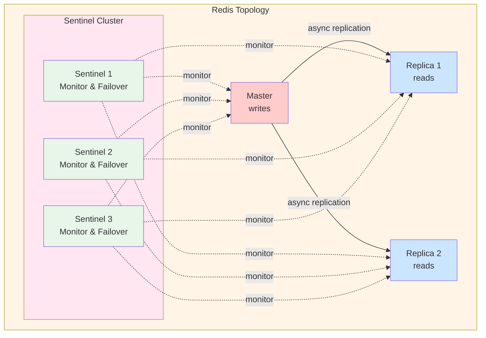
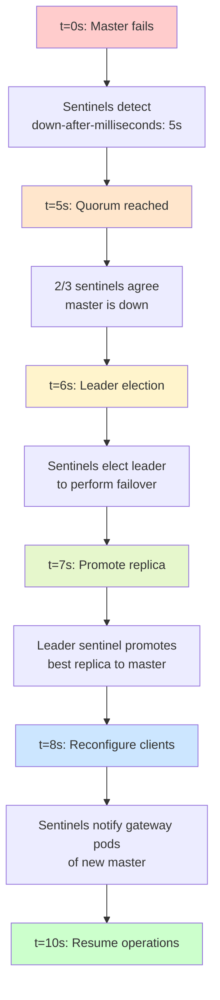

# High Availability & Disaster Recovery

**Purpose**: HA design, failover procedures, disaster recovery strategies.

## Table of Contents

1. [HA Strategy](#ha-strategy)
2. [Gateway Pod HA](#gateway-pod-ha)
3. [Redis HA (Sentinel)](#redis-ha-sentinel)
4. [Subscription Controller HA](#subscription-controller-ha)
5. [Disaster Recovery](#disaster-recovery)

---

## HA Strategy

**Goal**: 99.9% uptime (< 8.76 hours downtime/year)

### Component HA Matrix

| Component | HA Strategy | Failure Detection | Recovery Time | Data Loss |
|-----------|-------------|-------------------|---------------|-----------|
| Gateway Pods | 3+ replicas, anti-affinity | Readiness probe (5s) | Instant | None (stateless) |
| Redis Master | Sentinel failover | Sentinel (5s) | < 30s | None (AOF) |
| Redis Replicas | 2+ replicas | Sentinel (5s) | N/A | None |
| Subscription Controller | Leader election | Lease heartbeat (15s) | < 30s | None (Redis state) |
| Kubernetes API | Built-in K8s HA | etcd consensus | N/A | None |
| Ingress Controller | 2+ replicas | Liveness probe (10s) | Instant | None (stateless) |

---

## Gateway Pod HA

### Deployment Strategy

```yaml
apiVersion: apps/v1
kind: Deployment
metadata:
  name: netweave-gateway
spec:
  replicas: 3
  strategy:
    type: RollingUpdate
    rollingUpdate:
      maxUnavailable: 1
      maxSurge: 1

  template:
    spec:
      # Pod anti-affinity: spread across nodes
      affinity:
        podAntiAffinity:
          requiredDuringSchedulingIgnoredDuringExecution:
            - labelSelector:
                matchLabels:
                  app: netweave-gateway
              topologyKey: kubernetes.io/hostname

      # Topology spread: spread across zones
      topologySpreadConstraints:
        - maxSkew: 1
          topologyKey: topology.kubernetes.io/zone
          whenUnsatisfiable: DoNotSchedule
          labelSelector:
            matchLabels:
              app: netweave-gateway

      containers:
        - name: gateway
          livenessProbe:
            httpGet:
              path: /healthz
              port: 8080
            initialDelaySeconds: 10
            periodSeconds: 10
            timeoutSeconds: 5
            failureThreshold: 3

          readinessProbe:
            httpGet:
              path: /ready
              port: 8080
            initialDelaySeconds: 5
            periodSeconds: 5
            timeoutSeconds: 3
            failureThreshold: 2

          # Resource requests/limits
          resources:
            requests:
              memory: "256Mi"
              cpu: "250m"
            limits:
              memory: "512Mi"
              cpu: "500m"
```

### Failure Scenarios

**1. Pod Crash**:
- **Detection**: Liveness probe fails (30s)
- **Action**: Kubernetes restarts container
- **Impact**: Single pod unavailable, traffic routes to healthy pods
- **Recovery**: New container ready in < 30s

**2. Node Failure**:
- **Detection**: Node NotReady (40s)
- **Action**: Pods rescheduled to healthy nodes
- **Impact**: Pods on failed node unavailable
- **Recovery**: Pods running on new nodes in < 2 minutes

**3. Zone Failure**:
- **Detection**: All nodes in zone NotReady
- **Action**: Topology spread ensures pods in other zones
- **Impact**: Reduced capacity, no outage
- **Recovery**: Scale up in remaining zones if needed

---

## Redis HA (Sentinel)

### Deployment

**Topology**: 1 master + 2 replicas + 3 sentinels



### Failover Process



Gateway pods reconnect to new master automatically.

**Total downtime**: < 30s

### Data Durability

```yaml
# Redis configuration
appendonly yes                 # AOF enabled
appendfsync everysec          # Fsync every second
save 900 1                    # RDB snapshot every 15min if ≥1 key changed
save 300 10                   # RDB snapshot every 5min if ≥10 keys changed
save 60 10000                 # RDB snapshot every 1min if ≥10k keys changed

# Worst-case data loss:
# - 1 second of data (between fsync calls)
# - Acceptable for subscription data (SMO can re-subscribe)
```

---

## Subscription Controller HA

### Leader Election

```go
func (c *Controller) Run(ctx context.Context) error {
    // Use Kubernetes Lease for leader election
    lock := &resourcelock.LeaseLock{
        LeaseMeta: metav1.ObjectMeta{
            Name:      "subscription-controller-leader",
            Namespace: "o2ims-system",
        },
        Client: c.k8sClient,
        LockConfig: resourcelock.ResourceLockConfig{
            Identity: c.podName,
        },
    }

    leaderelection.RunOrDie(ctx, leaderelection.LeaderElectionConfig{
        Lock:          lock,
        LeaseDuration: 15 * time.Second,
        RenewDeadline: 10 * time.Second,
        RetryPeriod:   2 * time.Second,
        Callbacks: leaderelection.LeaderCallbacks{
            OnStartedLeading: func(ctx context.Context) {
                log.Info("became leader, starting controller")
                c.runController(ctx)
            },
            OnStoppedLeading: func() {
                log.Info("lost leadership, stopping controller")
                c.stopController()
            },
        },
    })
}
```

### Failover

- Leader heartbeat every 15s
- If leader misses 2 heartbeats (30s), new leader elected
- New leader resumes from Redis state (no data loss)
- Webhook queue preserved in Redis

---

## Disaster Recovery

### Backup Strategy

**What to Backup**:

**1. Redis Data** (subscriptions, critical):
- **Method**: RDB snapshots to persistent volume
- **Frequency**: Every 5 minutes
- **Retention**: 7 days

**2. Kubernetes Resources** (configuration):
- **Method**: GitOps (all manifests in Git)
- **Frequency**: Continuous (Git commits)
- **Retention**: Infinite (Git history)

**3. Application Logs** (audit):
- **Method**: Centralized logging (ELK/Loki)
- **Frequency**: Real-time streaming
- **Retention**: 30 days

### Redis Backup

```bash
#!/bin/bash
# Scheduled CronJob in Kubernetes

# 1. Trigger RDB snapshot
redis-cli -h redis-master BGSAVE

# 2. Wait for completion
while [ $(redis-cli -h redis-master LASTSAVE) -eq $LASTSAVE ]; do
  sleep 1
done

# 3. Copy RDB to persistent storage
kubectl cp o2ims-system/redis-master-0:/data/dump.rdb \
  /backups/redis/dump-$(date +%Y%m%d-%H%M%S).rdb

# 4. Upload to object storage (S3, GCS, etc.)
aws s3 cp /backups/redis/dump-*.rdb \
  s3://netweave-backups/redis/
```

### Recovery Procedures

#### Scenario 1: Complete Cluster Failure

```bash
# 1. Provision new Kubernetes cluster
# 2. Install prerequisites (cert-manager, ingress controller)
kubectl apply -f https://github.com/cert-manager/cert-manager/releases/download/v1.15.0/cert-manager.yaml

# 3. Install Redis via Helm
helm repo add bitnami https://charts.bitnami.com/bitnami
helm install redis bitnami/redis --set sentinel.enabled=true

# 4. Restore Redis data from backup
kubectl create -f redis-restore-job.yaml  # Loads from S3

# 5. Deploy netweave via Helm
helm install netweave ./helm/netweave \
  --values helm/netweave/values-production.yaml

# 6. Verify
make verify-deployment
```

**Recovery Time Objective (RTO)**: 30 minutes
**Recovery Point Objective (RPO)**: 5 minutes

#### Scenario 2: Redis Data Corruption

```bash
# 1. Stop Redis writes
kubectl scale deployment netweave-gateway --replicas=0

# 2. Stop Redis
kubectl exec redis-master-0 -- redis-cli SHUTDOWN NOSAVE

# 3. Restore from latest backup
kubectl cp s3://netweave-backups/redis/dump-latest.rdb \
  o2ims-system/redis-master-0:/data/dump.rdb

# 4. Start Redis
kubectl exec redis-master-0 -- redis-server /etc/redis/redis.conf

# 5. Verify data
kubectl exec redis-master-0 -- redis-cli DBSIZE

# 6. Resume gateway
kubectl scale deployment netweave-gateway --replicas=3
```

**RTO**: 10 minutes
**RPO**: 5 minutes

---

## Health Checks

### Gateway Health Endpoints

```go
// /healthz - Liveness probe
func (s *Server) handleHealthz(c *gin.Context) {
    // Check if server is responsive
    c.JSON(200, gin.H{"status": "ok"})
}

// /ready - Readiness probe
func (s *Server) handleReady(c *gin.Context) {
    // Check all dependencies
    checks := []Check{
        s.checkRedis(),
        s.checkK8sAPI(),
        s.checkBackendAdapter(),
    }

    for _, check := range checks {
        if check.Status != "ok" {
            c.JSON(503, gin.H{
                "status": "not_ready",
                "checks": checks,
            })
            return
        }
    }

    c.JSON(200, gin.H{"status": "ready", "checks": checks})
}
```

### Monitoring Alerts

**Critical Alerts** (page immediately):
- Gateway pods < 2 healthy
- Redis master down > 30s
- Redis failover in progress
- Certificate expiring in < 7 days
- K8s API unavailable

**Warning Alerts** (investigate soon):
- Gateway pod restarts > 3 in 1 hour
- Redis replica lag > 10s
- Cache hit ratio < 80%
- Webhook delivery failures > 10%

---

## Testing HA

### Chaos Engineering Tests

**1. Pod Failure**:
```bash
# Kill random gateway pod
kubectl delete pod -l app=netweave-gateway --field-selector=status.phase=Running --force --grace-period=0

# Verify: No failed requests, traffic routes to healthy pods
```

**2. Node Failure**:
```bash
# Drain node
kubectl drain <node-name> --ignore-daemonsets --delete-emptydir-data

# Verify: Pods rescheduled, no downtime
```

**3. Redis Master Failure**:
```bash
# Stop Redis master
kubectl exec redis-master-0 -- redis-cli SHUTDOWN

# Verify: Sentinel promotes replica, gateway reconnects
```

**4. Zone Failure**:
```bash
# Simulate zone failure (disable all nodes in zone)
kubectl cordon <node-in-zone-1>
kubectl cordon <node-in-zone-2>

# Verify: Pods in other zones handle traffic
```

---

## Recovery Procedures Runbook

### Procedure: Gateway Pod Not Ready

**Symptoms**: Readiness probe failing, pod not receiving traffic

**Diagnosis**:
```bash
kubectl get pods -l app=netweave-gateway
kubectl describe pod <pod-name>
kubectl logs <pod-name>
```

**Resolution**:
1. Check Redis connectivity: `kubectl exec <pod-name> -- redis-cli -h redis-master ping`
2. Check K8s API: `kubectl exec <pod-name> -- kubectl get nodes`
3. Restart pod: `kubectl delete pod <pod-name>`

### Procedure: Redis Failover Stuck

**Symptoms**: Redis master down, no new master elected

**Diagnosis**:
```bash
kubectl logs redis-sentinel-0
kubectl logs redis-sentinel-1
kubectl logs redis-sentinel-2
```

**Resolution**:
1. Check Sentinel quorum: `redis-cli -h redis-sentinel-0 -p 26379 SENTINEL CKQUORUM mymaster`
2. Force failover: `redis-cli -h redis-sentinel-0 -p 26379 SENTINEL FAILOVER mymaster`
3. Verify new master: `redis-cli -h redis-sentinel-0 -p 26379 SENTINEL MASTER mymaster`

---

## Next Steps

- **[Scalability](scalability.md)**: Scaling strategies and capacity planning
- **[Storage Architecture](storage.md)**: Redis data model and persistence
- **[Components](components.md)**: Component architecture and health checks
