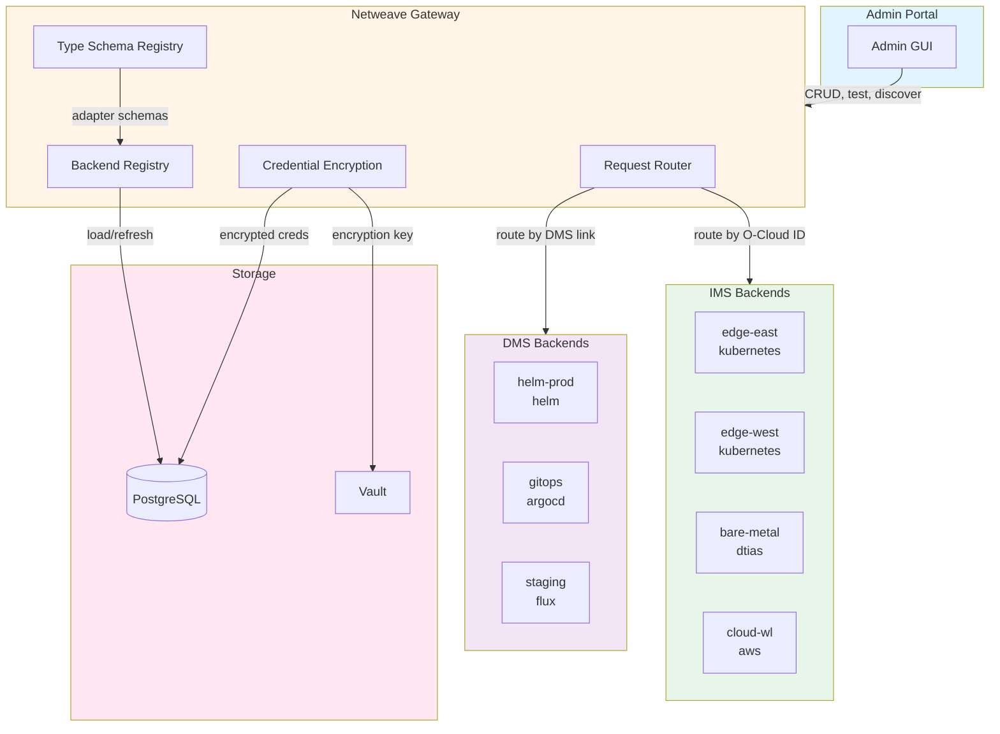
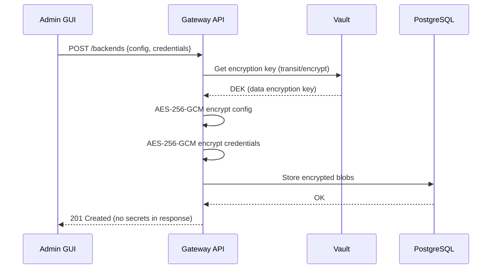
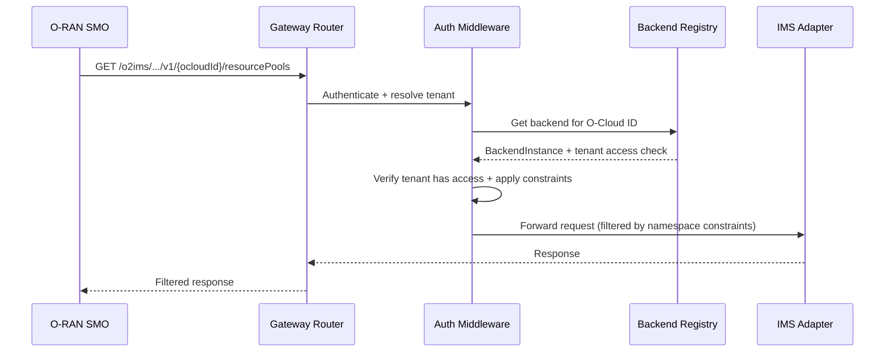

# Multi-Backend Configuration Architecture

> **Status**: Design
> **Issue**: [#362](https://github.com/piwi3910/netweave/issues/362)
> **Last Updated**: 2026-02-07

## Overview

The multi-backend system allows the netweave gateway to manage multiple IMS and DMS adapter instances simultaneously. Each backend instance is independently configured with encrypted credentials, tenant-scoped access control, and runtime management via the admin GUI.

## Architecture



## Data Model

### Backend Instance

Every configured backend (IMS or DMS) is a `BackendInstance`:

```sql
CREATE TABLE backend_instances (
    id              UUID PRIMARY KEY DEFAULT gen_random_uuid(),
    category        VARCHAR(3) NOT NULL CHECK (category IN ('ims', 'dms')),
    name            VARCHAR(255) NOT NULL,
    type            VARCHAR(50) NOT NULL,
    ocloud_id       VARCHAR(255) UNIQUE,  -- Only for IMS; the O-RAN O-Cloud identifier
    config          BYTEA NOT NULL,        -- AES-256-GCM encrypted JSON
    credentials     BYTEA NOT NULL,        -- AES-256-GCM encrypted JSON (separate from config)
    status          VARCHAR(20) NOT NULL DEFAULT 'disabled'
                    CHECK (status IN ('connected', 'error', 'disabled')),
    status_message  TEXT,
    auto_discovered BOOLEAN NOT NULL DEFAULT FALSE,
    created_at      TIMESTAMPTZ NOT NULL DEFAULT NOW(),
    updated_at      TIMESTAMPTZ NOT NULL DEFAULT NOW()
);

CREATE INDEX idx_backend_instances_category ON backend_instances(category);
CREATE INDEX idx_backend_instances_type ON backend_instances(type);
CREATE INDEX idx_backend_instances_ocloud_id ON backend_instances(ocloud_id) WHERE ocloud_id IS NOT NULL;
```

### Backend Links

Many-to-many relationship between IMS and DMS instances:

```sql
CREATE TABLE backend_links (
    ims_instance_id UUID NOT NULL REFERENCES backend_instances(id) ON DELETE CASCADE,
    dms_instance_id UUID NOT NULL REFERENCES backend_instances(id) ON DELETE CASCADE,
    created_at      TIMESTAMPTZ NOT NULL DEFAULT NOW(),
    PRIMARY KEY (ims_instance_id, dms_instance_id)
);
```

### Backend Access

Tenant-scoped access to backends:

```sql
CREATE TABLE backend_access (
    id               UUID PRIMARY KEY DEFAULT gen_random_uuid(),
    tenant_id        UUID NOT NULL REFERENCES tenants(id) ON DELETE CASCADE,
    backend_id       UUID NOT NULL REFERENCES backend_instances(id) ON DELETE CASCADE,
    permission_level VARCHAR(10) NOT NULL CHECK (permission_level IN ('read', 'deploy', 'manage')),
    constraints      JSONB NOT NULL DEFAULT '{}',
    granted_by       UUID REFERENCES users(id),
    created_at       TIMESTAMPTZ NOT NULL DEFAULT NOW(),
    updated_at       TIMESTAMPTZ NOT NULL DEFAULT NOW(),
    UNIQUE (tenant_id, backend_id)
);

CREATE INDEX idx_backend_access_tenant ON backend_access(tenant_id);
CREATE INDEX idx_backend_access_backend ON backend_access(backend_id);
```

## Configuration Architecture

### Bootstrap vs Runtime Config

| Layer | Storage | Contents | When Loaded |
|-------|---------|----------|-------------|
| **Bootstrap** | YAML file | Redis, Postgres, TLS, server port | Process start |
| **Runtime** | PostgreSQL | Backend instances, credentials, access rules | After DB connection |

The bootstrap YAML contains only what's needed to start the gateway and connect to infrastructure:

```yaml
# config.yaml — bootstrap only
server:
  port: 8080
redis:
  addresses: ["redis:6379"]
  password_env_var: REDIS_PASSWORD
postgres:
  host: postgres
  port: 5432
  database: netweave
  password_env_var: POSTGRES_PASSWORD
tls:
  enabled: true
  cert_file: /etc/netweave/tls/tls.crt
  key_file: /etc/netweave/tls/tls.key
```

Backend configuration lives in the database, managed via the admin API.

### Credential Encryption



- Encryption key stored in Vault transit engine
- Config and credentials encrypted separately (credentials can be rotated independently)
- Decrypted only in-memory when adapter connects
- Admin GUI never receives plaintext credentials after initial save

## Adapter Type Schemas

Each adapter type registers a schema that drives both validation and the admin GUI:

```go
type AdapterTypeSchema struct {
    Type         string                `json:"type"`
    Category     string                `json:"category"` // "ims" or "dms"
    DisplayName  string                `json:"display_name"`
    Description  string                `json:"description"`
    ConfigSchema map[string]FieldSpec  `json:"config_schema"`
    CredSchema   map[string]FieldSpec  `json:"credential_schema"`
    Discovery    bool                  `json:"supports_discovery"`
}

type FieldSpec struct {
    Type        string      `json:"type"`        // "string", "number", "text", "boolean"
    Required    bool        `json:"required"`
    Secret      bool        `json:"secret"`      // Masked in UI, encrypted at rest
    Default     interface{} `json:"default,omitempty"`
    Description string      `json:"description"`
    Validation  string      `json:"validation,omitempty"` // Regex pattern
}
```

### Example Schemas

**Kubernetes (IMS):**
```json
{
  "type": "kubernetes",
  "category": "ims",
  "display_name": "Kubernetes Cluster",
  "config_schema": {
    "namespace":  { "type": "string", "default": "default", "description": "Default namespace" },
    "qps":        { "type": "number", "default": 50, "description": "API server QPS limit" },
    "burst":      { "type": "number", "default": 100, "description": "API server burst limit" }
  },
  "credential_schema": {
    "kubeconfig": { "type": "text", "secret": true, "required": true, "description": "Kubeconfig contents" },
    "context":    { "type": "string", "required": false, "description": "Kubeconfig context name" }
  },
  "supports_discovery": true
}
```

**AWS (IMS):**
```json
{
  "config_schema": {
    "region":       { "type": "string", "required": true },
    "assume_role":  { "type": "string", "description": "IAM role ARN to assume" }
  },
  "credential_schema": {
    "access_key_id":     { "type": "string", "secret": true, "required": true },
    "secret_access_key": { "type": "string", "secret": true, "required": true }
  }
}
```

**Helm (DMS):**
```json
{
  "config_schema": {
    "namespace":        { "type": "string", "default": "default" },
    "repository_url":   { "type": "string" },
    "timeout":          { "type": "string", "default": "5m" },
    "max_history":      { "type": "number", "default": 10 }
  },
  "credential_schema": {
    "kubeconfig":       { "type": "text", "secret": true, "required": true },
    "repo_username":    { "type": "string" },
    "repo_password":    { "type": "string", "secret": true }
  }
}
```

## Request Routing

### O2-IMS API Routing



**Routing rules:**
- Request includes O-Cloud ID → route to matching IMS adapter instance
- Request is a list without O-Cloud ID → fan out to all IMS adapters the tenant can access, merge results
- O-Cloud ID not found → 404
- Tenant has no access to O-Cloud → 403

### Aggregation

For list endpoints without a specific O-Cloud ID:

```go
func (r *Router) ListResourcePools(ctx context.Context, tenantID string) ([]*ResourcePool, error) {
    // Get all IMS backends this tenant can access
    backends := r.registry.GetIMSBackendsForTenant(ctx, tenantID)

    // Fan out to all backends in parallel
    var wg sync.WaitGroup
    results := make(chan []*ResourcePool, len(backends))

    for _, backend := range backends {
        wg.Add(1)
        go func(b *BackendInstance) {
            defer wg.Done()
            pools, err := b.Adapter().ListResourcePools(ctx)
            if err != nil {
                // Log error, continue with other backends
                return
            }
            results <- pools
        }(backend)
    }

    // Collect and merge
    wg.Wait()
    close(results)
    return mergeResults(results), nil
}
```

## Tenant Access Model

### Permission Levels

| Level | IMS Backend | DMS Backend |
|-------|-------------|-------------|
| `read` | List/get resources, pools, types | List deployments, packages |
| `deploy` | read + create subscriptions | read + create/update/delete deployments |
| `manage` | deploy + modify resource labels | deploy + manage packages, rollback |

### Constraints

Per-tenant, per-backend restrictions:

```json
{
  "namespaces": ["acme-prod", "acme-staging"],
  "resource_quota": {
    "cpu": "100",
    "memory": "256Gi",
    "pods": 500
  },
  "labels": {
    "tenant": "acme-corp"
  }
}
```

### Access Evaluation

```
Can user X perform action Y on backend Z?

1. Authenticate user X → get tenant_id
2. Check RBAC: does user's role include permission for action Y? (existing)
3. Check backend access: does tenant have access to backend Z?
4. Check permission level: does the access level allow action Y?
5. Apply constraints: filter results by namespace/label constraints
```

## Admin API

### Backend Management

```
GET    /api/v1/admin/backends?category=ims|dms    List backends
POST   /api/v1/admin/backends                      Create backend
GET    /api/v1/admin/backends/{id}                 Get backend (creds masked)
PUT    /api/v1/admin/backends/{id}                 Update backend
DELETE /api/v1/admin/backends/{id}                 Delete backend
POST   /api/v1/admin/backends/{id}/test            Test connection
POST   /api/v1/admin/backends/discover             Trigger discovery
```

### Link Management

```
GET    /api/v1/admin/backends/{imsId}/dms-links           List DMS links
POST   /api/v1/admin/backends/{imsId}/dms-links           Create link
DELETE /api/v1/admin/backends/{imsId}/dms-links/{dmsId}    Remove link
```

### Tenant Access

```
GET    /api/v1/admin/tenants/{tenantId}/backend-access              List access
POST   /api/v1/admin/tenants/{tenantId}/backend-access              Grant access
PUT    /api/v1/admin/tenants/{tenantId}/backend-access/{accessId}   Update access
DELETE /api/v1/admin/tenants/{tenantId}/backend-access/{accessId}   Revoke access
GET    /api/v1/admin/backends/{backendId}/tenant-access             Reverse view
```

### Type Schemas

```
GET    /api/v1/admin/backend-types?category=ims|dms    List available types
GET    /api/v1/admin/backend-types/{type}/schema        Get config/credential schema
```

## Admin Portal Pages

### Infrastructure Section

```
Infrastructure
├── O-Clouds (IMS)
│   ├── List view (name, type, status, connected tenants)
│   ├── Add Backend (select type → dynamic form from schema)
│   ├── [instance] Detail (config, status, linked DMS, tenant access)
│   └── Test Connection button
├── Deployment Services (DMS)
│   ├── List view (name, type, status, linked O-Clouds)
│   ├── Add Backend (select type → dynamic form from schema)
│   └── [instance] Detail (config, status, linked O-Clouds)
├── Links (matrix view: which DMS serves which O-Cloud)
└── Discovery (auto-detected backends, adopt/dismiss)
```

### Tenant Section (Extended)

```
Tenants
└── [tenant]
    ├── Users & Roles (existing)
    ├── Backend Access (NEW)
    │   ├── List assigned backends with permission levels
    │   ├── Assign Backend (select from available, set level + constraints)
    │   └── Edit constraints (namespaces, quotas)
    └── Quotas (existing, now per-backend)
```

## Implementation Phases

### Phase 1: Database & Backend Registry
- Postgres migration for backend_instances, backend_links, backend_access
- Credential encryption/decryption service using Vault transit
- Backend registry: load from DB, cache in memory, refresh on changes
- Adapter type schema registry (hardcoded schemas for all adapter types)
- Gateway startup: load backends from DB, instantiate adapters

### Phase 2: Admin API
- CRUD endpoints for backends, links, access
- Input validation against type schemas
- Test connection endpoint (temporary adapter, call Health())
- Type schema endpoint for GUI form generation

### Phase 3: Request Routing
- O-Cloud ID extraction middleware
- Router dispatches to correct adapter instance
- Parallel fan-out for aggregation queries
- Tenant access enforcement in request pipeline

### Phase 4: Admin Portal
- Infrastructure pages with dynamic form generation
- Credential masking and secure update flow
- Link matrix view
- Tenant backend access management

### Phase 5: Auto-Discovery
- In-cluster Kubernetes detection on startup
- Discovery endpoint for manual trigger
- Adopt/dismiss workflow in admin GUI

## Migration Strategy

### Backward Compatibility

During migration from single-adapter to multi-backend:

1. **Phase 1**: Gateway still reads `ADAPTER_TYPE` env var as before
2. **Phase 1**: If no backends in DB, auto-create one from env var config
3. **Phase 2+**: Admin API becomes the primary configuration method
4. **Phase 3**: Env var becomes a fallback/bootstrap mechanism only

This ensures zero downtime during the transition.

## Security Considerations

- Credentials encrypted at rest with AES-256-GCM, key in Vault transit
- Credentials never returned in API responses after initial creation
- Admin GUI shows masked values, update-only for existing credentials
- Tenant isolation enforced at gateway level, not just UI
- Backend access changes are audited (granted_by field + audit log)
- Test connection uses short-lived temporary adapter instances
