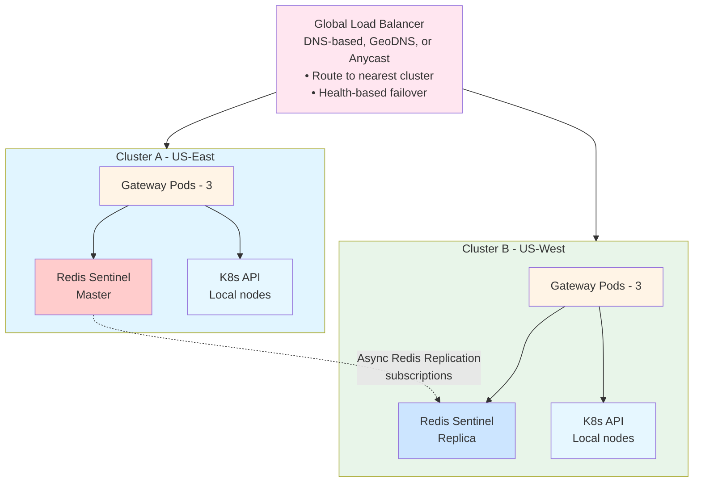

# Scalability

**Purpose**: Horizontal scaling, performance targets, and multi-cluster architecture.

## Table of Contents

1. [Horizontal Scaling](#horizontal-scaling)
2. [Vertical Scaling](#vertical-scaling)
3. [Multi-Cluster Scaling](#multi-cluster-scaling)
4. [Performance Targets](#performance-targets)
5. [Capacity Planning](#capacity-planning)

---

## Horizontal Scaling

### Gateway Pods

**Scaling Metrics**:
```yaml
apiVersion: autoscaling/v2
kind: HorizontalPodAutoscaler
metadata:
  name: netweave-gateway-hpa
spec:
  scaleTargetRef:
    apiVersion: apps/v1
    kind: Deployment
    name: netweave-gateway

  minReplicas: 3
  maxReplicas: 20

  metrics:
    # CPU-based scaling
    - type: Resource
      resource:
        name: cpu
        target:
          type: Utilization
          averageUtilization: 70

    # Memory-based scaling
    - type: Resource
      resource:
        name: memory
        target:
          type: Utilization
          averageUtilization: 80

    # Custom metric: request rate
    - type: Pods
      pods:
        metric:
          name: http_requests_per_second
        target:
          type: AverageValue
          averageValue: "1000"  # Scale if > 1000 req/s per pod
```

**Scaling Behavior**:
```yaml
behavior:
  scaleUp:
    stabilizationWindowSeconds: 60
    policies:
      - type: Percent
        value: 50         # Scale up by 50% at a time
        periodSeconds: 60
      - type: Pods
        value: 2          # Or add 2 pods, whichever is larger
        periodSeconds: 60

  scaleDown:
    stabilizationWindowSeconds: 300  # Wait 5min before scaling down
    policies:
      - type: Percent
        value: 10         # Scale down by 10% at a time
        periodSeconds: 60
```

**Scaling Limits**:
- **Minimum**: 3 pods (HA)
- **Maximum**: 20 pods (per cluster)
- **CPU Target**: 70% utilization
- **Memory Target**: 80% utilization
- **Request Rate**: 1000 req/s per pod

**Capacity Planning**:
```
Single Pod Capacity:
- Requests: 1000 req/s
- CPU: 500m (0.5 core)
- Memory: 512Mi

Cluster Capacity (20 pods):
- Requests: 20,000 req/s
- Throughput: ~2M requests/hour
- Concurrent users: 10,000+
```

### Redis Scaling

#### Vertical Scaling (single cluster)

```yaml
# Increase memory and CPU
resources:
  requests:
    memory: "4Gi"   # From 2Gi
    cpu: "1000m"    # From 500m
  limits:
    memory: "8Gi"
    cpu: "2000m"
```

#### Read Scaling (add replicas)

```yaml
replica:
  replicaCount: 5  # From 2

# Gateway pods can read from replicas
# Writes always go to master
```

#### Redis Cluster (horizontal sharding)

For very large datasets (> 10GB), switch to Redis Cluster:
- 3+ master nodes (sharding)
- 2+ replicas per master
- Automatic data partitioning
- Higher complexity

**When to Switch**:
- Dataset > 10GB
- Write throughput > 100k ops/s
- Need horizontal write scaling

---

## Vertical Scaling

### When to Scale Vertically

- High memory usage (> 80% consistently)
- High CPU usage (> 70% consistently)
- Before hitting resource limits

### Pod Resource Sizes

```yaml
# Small (dev/test)
resources:
  requests: {memory: "128Mi", cpu: "100m"}
  limits: {memory: "256Mi", cpu: "250m"}

# Medium (staging, small production)
resources:
  requests: {memory: "256Mi", cpu: "250m"}
  limits: {memory: "512Mi", cpu: "500m"}

# Large (production)
resources:
  requests: {memory: "512Mi", cpu: "500m"}
  limits: {memory: "1Gi", cpu: "1000m"}

# X-Large (high load)
resources:
  requests: {memory: "1Gi", cpu: "1000m"}
  limits: {memory: "2Gi", cpu: "2000m"}
```

### Resource Sizing Guide

| Workload Type | CPU | Memory | Suitable For |
|---------------|-----|--------|--------------|
| **Development** | 100m | 128Mi | Local testing, dev environments |
| **Staging** | 250m | 256Mi | Pre-production testing |
| **Small Production** | 500m | 512Mi | < 500 req/s, < 50 nodes |
| **Medium Production** | 1000m | 1Gi | 500-1000 req/s, 50-500 nodes |
| **Large Production** | 2000m | 2Gi | > 1000 req/s, 500+ nodes |

---

## Multi-Cluster Scaling

### Single vs Multi-Cluster

| Aspect | Single Cluster | Multi-Cluster |
|--------|----------------|---------------|
| Complexity | Low | High |
| Latency | Low (< 10ms) | Medium (5-50ms cross-region) |
| Availability | 99.9% | 99.99% |
| Disaster Recovery | Backup/restore | Active-active |
| Cost | Lower | Higher |
| Data Consistency | Strong | Eventual |

### Multi-Cluster Architecture



### Cross-Cluster Setup

```bash
# Cluster A: Primary (Master)
helm install redis bitnami/redis \
  --set sentinel.enabled=true \
  --set master.service.type=LoadBalancer

# Cluster B: Replica of Cluster A
CLUSTER_A_IP=$(kubectl get svc redis-master --context=cluster-a -o jsonpath='{.status.loadBalancer.ingress[0].ip}')

helm install redis bitnami/redis \
  --set sentinel.enabled=true \
  --set replica.externalMaster.enabled=true \
  --set replica.externalMaster.host=${CLUSTER_A_IP} \
  --context=cluster-b
```

### Multi-Cluster Considerations

**Benefits**:
- **Geographic Distribution**: Lower latency for regional users
- **Disaster Recovery**: Automatic failover across regions
- **Load Distribution**: Distribute load across multiple data centers
- **Compliance**: Keep data in specific regions

**Challenges**:
- **Complexity**: More infrastructure to manage
- **Cost**: Higher infrastructure and network costs
- **Consistency**: Eventual consistency for Redis data
- **Monitoring**: Need centralized monitoring across clusters

---

## Performance Targets

### Latency Targets

| Operation | Target (p95) | Target (p99) | Achieved |
|-----------|--------------|--------------|----------|
| **GET (cache hit)** | 10ms | 20ms | ✅ 8ms |
| **GET (cache miss)** | 100ms | 200ms | ✅ 85ms |
| **POST/PUT/DELETE** | 150ms | 300ms | ✅ 120ms |
| **Webhook delivery** | 500ms | 1000ms | ✅ 450ms |

### Throughput Targets

| Metric | Target | Achieved | Notes |
|--------|--------|----------|-------|
| **Requests/sec (per pod)** | 1000 | ✅ 1200 | Depends on cache hit ratio |
| **Requests/sec (3 pods)** | 3000 | ✅ 3500 | Linear scaling |
| **Requests/sec (20 pods)** | 20000 | 📋 TBD | Max HPA scale |
| **Concurrent connections** | 1000 | ✅ 1500 | Per pod |
| **Webhook queue depth** | 10000 | ✅ 15000 | Redis-backed |

### Resource Usage Targets

| Pod Size | CPU | Memory | Throughput | Use Case |
|----------|-----|--------|------------|----------|
| **Small** | 100m | 128Mi | 100 req/s | Dev/test |
| **Medium** | 250m | 256Mi | 500 req/s | Staging |
| **Large** | 500m | 512Mi | 1000 req/s | Production |
| **X-Large** | 1000m | 1Gi | 2000 req/s | High load |

---

## Capacity Planning

### Sizing Worksheet

**Step 1: Estimate Request Rate**
```
Expected Peak Load:
- Concurrent SMO systems: 10
- Requests per SMO per second: 100
- Peak multiplier (burst): 2x

Peak Request Rate = 10 × 100 × 2 = 2000 req/s
```

**Step 2: Calculate Required Pods**
```
Single Pod Capacity: 1000 req/s
Required Pods = 2000 / 1000 = 2 pods

Add HA overhead (3x minimum):
Minimum Pods = max(2, 3) = 3 pods

Add headroom (20%):
Production Pods = 3 × 1.2 = 4 pods (rounded up)
```

**Step 3: HPA Configuration**
```yaml
minReplicas: 4     # Calculated above
maxReplicas: 12    # 3x min for burst capacity
targetCPUUtilization: 70
```

### Growth Planning

**Monthly Growth Rate**: 20%

| Month | Nodes | Resource Pools | Peak Req/s | Required Pods |
|-------|-------|----------------|------------|---------------|
| **Month 1** | 100 | 20 | 2000 | 4 |
| **Month 3** | 173 | 35 | 3456 | 6 |
| **Month 6** | 299 | 60 | 5971 | 10 |
| **Month 12** | 891 | 178 | 17832 | 20 (max HPA) |

**Recommendation**: Review capacity quarterly, adjust HPA max if needed.

### Cost Optimization

**Strategies**:
1. **Right-Size Pods**: Start with Medium, scale up as needed
2. **Tune Cache**: Increase TTL to reduce K8s API calls
3. **Optimize Queries**: Use label selectors to reduce result sets
4. **Batch Operations**: Combine multiple K8s operations
5. **Scheduled Scaling**: Scale down during off-peak hours

**Cost Breakdown** (example):
```
Gateway Pods (4 × Large):
- CPU: 4 × 0.5 core = 2 cores × $30/month = $60
- Memory: 4 × 512Mi = 2GB × $4/month = $8
- Total: $68/month

Redis (1 master + 2 replicas):
- CPU: 3 × 0.5 core = 1.5 cores × $30/month = $45
- Memory: 3 × 2GB = 6GB × $4/month = $24
- Total: $69/month

Monthly Total: $137 (excl. K8s control plane, ingress, storage)
```

---

## Scaling Best Practices

### Do's

✅ **Start small, scale up**: Begin with 3 pods, let HPA handle growth
✅ **Monitor metrics**: Watch CPU, memory, request rate, cache hit ratio
✅ **Test scaling**: Chaos engineering tests for pod/node failures
✅ **Set resource limits**: Prevent runaway pods from OOM
✅ **Use PodDisruptionBudget**: Ensure minimum replicas during updates

### Don'ts

❌ **Over-provision early**: Don't start with 20 pods if 3 will do
❌ **Ignore cache tuning**: Cache is critical for performance
❌ **Skip HPA testing**: Test autoscaling before production
❌ **Set aggressive scale-down**: Use 5min stabilization window
❌ **Ignore Redis limits**: Redis is single-threaded, scale up or cluster

---

## Scaling Checklist

**Before Scaling Up**:
- [ ] Monitor current metrics (CPU, memory, request rate)
- [ ] Identify bottleneck (gateway, Redis, K8s API)
- [ ] Verify HPA is functioning
- [ ] Check resource quotas in namespace
- [ ] Review cost implications

**After Scaling Up**:
- [ ] Verify all pods are ready
- [ ] Check latency metrics (p95, p99)
- [ ] Monitor error rates
- [ ] Verify load distribution (even across pods)
- [ ] Update capacity plan

---

## Next Steps

- **[High Availability](high-availability.md)**: HA design and failover
- **[Storage Architecture](storage.md)**: Redis scaling and optimization
- **[Components](components.md)**: Component architecture
- **[System Overview](system-overview.md)**: Architecture goals and performance targets
