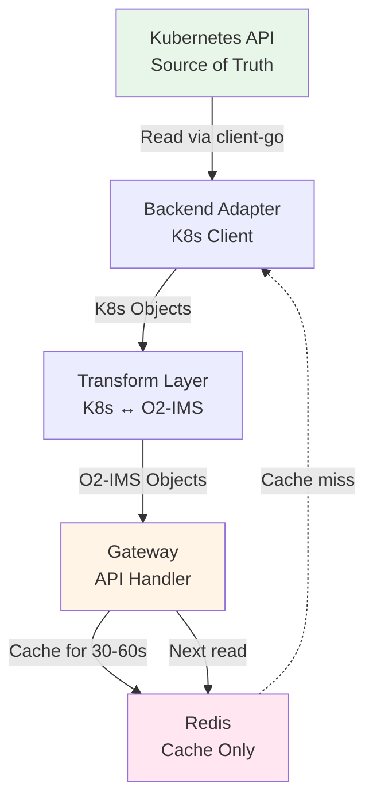

# Storage Architecture

**Purpose**: Redis data model, schema, caching strategy, and Kubernetes state management.

## Table of Contents

1. [Redis Data Model](#redis-data-model)
2. [Redis Sentinel Configuration](#redis-sentinel-configuration)
3. [Caching Strategy](#caching-strategy)
4. [Kubernetes State](#kubernetes-state)
5. [Data Persistence](#data-persistence)

---

## Redis Data Model

### Subscriptions

```redis
# Subscription object
HSET subscription:550e8400-e29b-41d4-a716-446655440000
  id "550e8400-e29b-41d4-a716-446655440000"
  callback "https://smo.example.com/notifications"
  filter '{"resourcePoolId":"pool-123"}'
  consumerSubscriptionId "smo-sub-456"
  createdAt "2026-01-06T10:30:00Z"
  data '{"id":"550e...","callback":"https://..."}'

# Index: All active subscriptions
SADD subscriptions:active "550e8400-e29b-41d4-a716-446655440000"

# Index: By resource pool
SADD subscriptions:resourcePool:pool-123 "550e8400-e29b-41d4-a716-446655440000"

# Index: By resource type
SADD subscriptions:resourceType:compute "550e8400-e29b-41d4-a716-446655440000"
```

**Subscription Lifecycle**:
1. **Create**: `HSET subscription:{uuid}`, `SADD subscriptions:active`
2. **Index**: `SADD subscriptions:resourcePool:{id}`, `SADD subscriptions:resourceType:{type}`
3. **Query**: `SMEMBERS subscriptions:active`, `SMEMBERS subscriptions:resourcePool:{id}`
4. **Update**: `HSET subscription:{uuid}`, Publish `subscriptions:updated`
5. **Delete**: `DEL subscription:{uuid}`, `SREM subscriptions:active`, cleanup indices

### Cache

```redis
# Cache resource lists (short TTL)
SETEX cache:nodes '{"items":[{...}]}' 30
SETEX cache:resourcePools '{"items":[{...}]}' 30
SETEX cache:resources:pool-123 '{"items":[{...}]}' 30

# Cache individual resources (longer TTL)
SETEX cache:node:node-abc '{"id":"node-abc",...}' 60
SETEX cache:resourcePool:pool-123 '{"id":"pool-123",...}' 60

# Cache statistics
SETEX cache:stats:summary '{"nodes":100,"pools":10}' 120
```

**Cache Key Patterns**:
```
cache:nodes                      # All nodes (list)
cache:resourcePools              # All resource pools (list)
cache:resources                  # All resources (list)
cache:resources:pool:{id}        # Resources in specific pool (list)
cache:node:{id}                  # Single node (item)
cache:resourcePool:{id}          # Single resource pool (item)
cache:resource:{id}              # Single resource (item)
cache:stats:summary              # Statistics summary
```

### Pub/Sub Channels

```redis
# Cache invalidation
PUBLISH cache:invalidate:nodes "node-abc-deleted"
PUBLISH cache:invalidate:resourcePools "pool-123-updated"

# Subscription events
PUBLISH subscriptions:created "550e8400-e29b-41d4-a716-446655440000"
PUBLISH subscriptions:updated "550e8400-e29b-41d4-a716-446655440000"
PUBLISH subscriptions:deleted "550e8400-e29b-41d4-a716-446655440000"
```

**Pub/Sub Usage**:
- All gateway pods subscribe to cache invalidation channels
- On write operation, pod publishes invalidation event
- All pods clear affected cache entries
- Ensures cache consistency across pods

### Distributed Locks

```redis
# Webhook delivery lock (prevent duplicate sends)
SET lock:webhook:550e8400:event-123 "gateway-pod-2" NX EX 10

# Cache refresh lock (only one pod refreshes)
SET lock:cache:nodes "gateway-pod-1" NX EX 5

# Background job lock
SET lock:job:cleanup "controller-pod-1" NX EX 30
```

**Lock Pattern**:
```go
// Acquire lock (atomic, distributed)
func acquireLock(redis *redis.Client, key, value string, ttl time.Duration) (bool, error) {
    // SET key value NX EX ttl
    return redis.SetNX(ctx, key, value, ttl).Result()
}

// Usage: Webhook delivery
lockKey := fmt.Sprintf("lock:webhook:%s:%s", subscriptionID, eventID)
acquired, _ := acquireLock(redis, lockKey, podID, 10*time.Second)
if !acquired {
    // Another pod is handling this webhook
    return
}
// Send webhook...
```

### Auth Data Model (Multi-Tenancy)

When multi-tenancy is enabled, the auth store maintains:

```redis
# Tenant object
HSET tenant:tenant-alpha
  id "tenant-alpha"
  name "SMO Alpha"
  status "active"
  quotas '{"maxUsers":100,"maxSubscriptions":1000}'
  createdAt "2026-01-06T10:00:00Z"

# Index: All tenants
SADD tenants:all "tenant-alpha" "tenant-beta"

# User object (scoped to tenant)
HSET user:tenant-alpha:user-123
  id "user-123"
  tenantId "tenant-alpha"
  name "admin@smo-alpha.com"
  status "active"
  createdAt "2026-01-06T10:30:00Z"

# Index: Users by tenant
SADD users:tenant:tenant-alpha "user-123" "user-456"

# Role definition
HSET role:operator
  id "operator"
  name "Operator"
  permissions '[{"resource":"ResourcePool","action":"manage","scope":"tenant"}]'
  isSystem "true"

# Index: All roles
SADD roles:all "platform-admin" "tenant-admin" "operator" "viewer"

# Role binding (user to role in tenant)
HSET rolebinding:tenant-alpha:user-123:operator
  userId "user-123"
  roleId "operator"
  tenantId "tenant-alpha"
  createdAt "2026-01-06T10:30:00Z"

# Index: Role bindings by user
SADD rolebindings:user:tenant-alpha:user-123 "operator" "viewer"

# Audit log entry
LPUSH audit:tenant-alpha
  '{"timestamp":"2026-01-06T11:00:00Z","userId":"user-123","action":"create","resource":"ResourcePool","resourceId":"pool-123"}'

# Audit log TTL (expire old entries)
LTRIM audit:tenant-alpha 0 9999
```

---

## Redis Sentinel Configuration

### Deployment Topology

```yaml
# 3-node Sentinel setup (quorum=2)
Master:
  - Host: redis-master-0
  - Port: 6379
  - Persistence: AOF (appendonly yes) + RDB
  - Max Memory: 2GB
  - Eviction: allkeys-lru

Replicas:
  - redis-replica-1 (async replication from master)
  - redis-replica-2 (async replication from master)

Sentinels:
  - redis-sentinel-0:26379
  - redis-sentinel-1:26379
  - redis-sentinel-2:26379
  - Quorum: 2
  - Down-after-milliseconds: 5000
  - Failover-timeout: 10000
```

### Redis Configuration

```conf
# redis.conf

# Persistence
appendonly yes                 # AOF enabled
appendfsync everysec          # Fsync every second
save 900 1                    # RDB snapshot every 15min if ≥1 key changed
save 300 10                   # RDB snapshot every 5min if ≥10 keys changed
save 60 10000                 # RDB snapshot every 1min if ≥10k keys changed

# Memory
maxmemory 2gb
maxmemory-policy allkeys-lru  # Evict least recently used keys

# Replication
repl-diskless-sync yes
repl-diskless-sync-delay 5
min-replicas-to-write 1       # Require at least 1 replica for writes
min-replicas-max-lag 10       # Replica lag must be <10s
```

### Sentinel Configuration

```conf
# sentinel.conf

# Monitor master
sentinel monitor mymaster redis-master-0 6379 2

# Failover settings
sentinel down-after-milliseconds mymaster 5000
sentinel parallel-syncs mymaster 1
sentinel failover-timeout mymaster 10000

# Notification scripts (optional)
sentinel notification-script mymaster /path/to/notification.sh
sentinel client-reconfig-script mymaster /path/to/reconfig.sh
```

### Gateway Connection

```go
// internal/storage/redis.go

import "github.com/go-redis/redis/v8"

func NewRedisClient(cfg *Config) *redis.Client {
    return redis.NewFailoverClient(&redis.FailoverOptions{
        MasterName:    "mymaster",
        SentinelAddrs: []string{
            "redis-sentinel-0:26379",
            "redis-sentinel-1:26379",
            "redis-sentinel-2:26379",
        },
        Password:     cfg.Password,
        DB:           0,
        DialTimeout:  5 * time.Second,
        ReadTimeout:  3 * time.Second,
        WriteTimeout: 3 * time.Second,
        PoolSize:     10,
        MinIdleConns: 2,
    })
}
```

---

## Caching Strategy

### Cache Tiers

| Tier | TTL | Use Case | Example |
|------|-----|----------|---------|
| **Tier 1: Hot** | 30s | Frequently accessed lists | All nodes, all pools |
| **Tier 2: Warm** | 60s | Individual resources | Node details, pool details |
| **Tier 3: Cold** | 120s | Statistics, summaries | System metrics |

### Cache Invalidation

**Write-Through Pattern**:
1. Write to Kubernetes API (source of truth)
2. Publish invalidation event to Redis Pub/Sub
3. All gateway pods receive event
4. Each pod clears affected cache entries
5. Next read will fetch fresh data from K8s

**Invalidation Events**:
```go
// After successful write
func invalidateCache(redis *redis.Client, cacheType string, id string) {
    // Publish to all gateway pods
    redis.Publish(ctx, "cache:invalidate:"+cacheType, id)
}

// Each gateway pod subscribes
pubsub := redis.Subscribe(ctx, "cache:invalidate:nodes", "cache:invalidate:resourcePools")
go func() {
    for msg := range pubsub.Channel() {
        switch msg.Channel {
        case "cache:invalidate:nodes":
            cache.Delete("cache:nodes")
            cache.Delete("cache:node:" + msg.Payload)
        case "cache:invalidate:resourcePools":
            cache.Delete("cache:resourcePools")
            cache.Delete("cache:resourcePool:" + msg.Payload)
        }
    }
}()
```

### Cache Hit Ratio

**Target**: > 90%

**Monitoring**:
```go
// Metrics
var (
    cacheHits = promauto.NewCounter(prometheus.CounterOpts{
        Name: "o2ims_cache_hits_total",
    })
    cacheMisses = promauto.NewCounter(prometheus.CounterOpts{
        Name: "o2ims_cache_misses_total",
    })
)

// Calculate hit ratio
hitRatio := cacheHits / (cacheHits + cacheMisses)
```

**Expected Hit Ratios**:
- Read-heavy workloads: 95%+
- Balanced workloads: 90-95%
- Write-heavy workloads: 80-90%

---

## Kubernetes State

### Source of Truth

**All infrastructure state lives in Kubernetes:**

```
Resources (K8s) → O2-IMS Mapping
─────────────────────────────────
Nodes          → Resources
MachineSets    → ResourcePools
Machines       → Resources (with lifecycle)
StorageClasses → ResourceTypes
PVs            → Storage Resources
```

### Data Flow



**Why Kubernetes is Source of Truth**:
1. **Consistency**: etcd provides strong consistency
2. **Reliability**: K8s has built-in HA and backup
3. **Versioning**: K8s API versioning and compatibility
4. **RBAC**: Leverage K8s RBAC for access control
5. **No Sync**: No dual-write consistency issues

**Redis Role**:
- **NOT** a source of truth for infrastructure
- **ONLY** for subscriptions (O2-IMS specific)
- **ONLY** for performance caching
- **ONLY** for inter-pod communication

---

## Data Persistence

### Redis Persistence

**AOF (Append-Only File)**:
- Every write appended to file
- Fsync policy: `everysec` (1s data loss window)
- Auto-rewrite when file grows large

**RDB (Snapshot)**:
- Point-in-time snapshot
- Triggered every 15min/5min/1min based on key changes
- Used for disaster recovery

**Combined Strategy**:
```
Write → Memory → AOF (1s) → Periodic RDB
```

**Worst-Case Data Loss**:
- 1 second of data (between fsync calls)
- Acceptable for subscription data (SMO can re-subscribe)

### Backup Strategy

**What to Backup**:
1. **Redis Data** (subscriptions, critical)
   - Method: RDB snapshots to persistent volume
   - Frequency: Every 5 minutes
   - Retention: 7 days

2. **Kubernetes Resources** (configuration)
   - Method: GitOps (all manifests in Git)
   - Frequency: Continuous (Git commits)
   - Retention: Infinite (Git history)

3. **Application Logs** (audit)
   - Method: Centralized logging (ELK/Loki)
   - Frequency: Real-time streaming
   - Retention: 30 days

**Redis Backup Script**:
```bash
#!/bin/bash
# Scheduled CronJob in Kubernetes

# 1. Trigger RDB snapshot
redis-cli -h redis-master BGSAVE

# 2. Wait for completion
while [ $(redis-cli -h redis-master LASTSAVE) -eq $LASTSAVE ]; do
  sleep 1
done

# 3. Copy RDB to persistent storage
kubectl cp o2ims-system/redis-master-0:/data/dump.rdb \
  /backups/redis/dump-$(date +%Y%m%d-%H%M%S).rdb

# 4. Upload to object storage (S3, GCS, etc.)
aws s3 cp /backups/redis/dump-*.rdb \
  s3://netweave-backups/redis/
```

### Data Recovery

**Scenario: Redis Data Corruption**

```bash
# 1. Stop Redis writes
kubectl scale deployment netweave-gateway --replicas=0

# 2. Stop Redis
kubectl exec redis-master-0 -- redis-cli SHUTDOWN NOSAVE

# 3. Restore from latest backup
kubectl cp s3://netweave-backups/redis/dump-latest.rdb \
  o2ims-system/redis-master-0:/data/dump.rdb

# 4. Start Redis
kubectl exec redis-master-0 -- redis-server /etc/redis/redis.conf

# 5. Verify data
kubectl exec redis-master-0 -- redis-cli DBSIZE

# 6. Resume gateway
kubectl scale deployment netweave-gateway --replicas=3
```

**RTO**: 10 minutes
**RPO**: 5 minutes

---

## Performance Characteristics

### Redis Performance

| Operation | Latency (p95) | Latency (p99) | Throughput |
|-----------|---------------|---------------|------------|
| **GET (cache hit)** | 1ms | 2ms | 100k ops/s |
| **SET** | 2ms | 3ms | 80k ops/s |
| **HGETALL** | 3ms | 5ms | 50k ops/s |
| **Pub/Sub** | 5ms | 10ms | 10k msgs/s |

### Kubernetes API Performance

| Operation | Latency (p95) | Latency (p99) | Notes |
|-----------|---------------|---------------|-------|
| **LIST Nodes** | 50ms | 100ms | Depends on cluster size |
| **GET Node** | 20ms | 50ms | Single resource fetch |
| **CREATE MachineSet** | 100ms | 200ms | Includes validation |
| **UPDATE MachineSet** | 80ms | 150ms | Optimistic locking |
| **DELETE MachineSet** | 50ms | 100ms | Async deletion |

### Combined Performance

| Scenario | Timeline | Bottleneck |
|----------|----------|-----------|
| **Cache hit** | 5-10ms | Redis GET + transform |
| **Cache miss** | 50-100ms | K8s API + transform + cache |
| **Write** | 100-200ms | K8s API write + invalidation |

---

## Next Steps

- **[High Availability](high-availability.md)**: HA design and failover
- **[Scalability](scalability.md)**: Scaling strategies
- **[Data Flow](data-flow.md)**: Request and event flows
- **[Components](components.md)**: Component architecture
