# System Overview

**Purpose**: High-level system design, architecture goals, technology stack, and design decisions.

## Table of Contents

1. [System Context](#system-context)
2. [Architecture Goals](#architecture-goals)
3. [Technology Stack](#technology-stack)
4. [Design Decisions](#design-decisions)

---

## System Context

```mermaid
graph TB
    subgraph External [External Systems]
        SMO[O2 SMO Client]
        Prom[Prometheus<br/>Monitoring]
        Logging[ELK/Loki<br/>Logging]
    end

    subgraph Gateway [netweave O2-IMS Gateway]
        subgraph GWLayer [Gateway Layer]
            API[O2-IMS API Implementation<br/>Request Validation OpenAPI<br/>Auth/AuthZ<br/>Rate Limiting]
        end
        subgraph TransLayer [Translation Layer]
            Trans[O2-IMS ↔ Kubernetes Mapping<br/>Data Transformation<br/>Error Translation]
        end
        subgraph AdapterLayer [Adapter Layer]
            Adapters[Kubernetes Adapter active<br/>Future Adapters DTIAS, etc.]
        end
    end

    subgraph Backend [Backend Systems]
        K8s[Kubernetes Cluster<br/>• Nodes<br/>• Workloads<br/>• Storage]
        Redis[Redis Sentinel Cluster<br/>• Master + Replicas<br/>• Automatic Failover<br/>• Persistence AOF+RDB]
    end

    SMO -->|O2-IMS API<br/>HTTPS/mTLS| GWLayer
    Prom -->|Metrics<br/>Prometheus scrape| GWLayer
    Logging -->|Logs<br/>JSON structured| GWLayer

    GWLayer --> TransLayer
    TransLayer --> AdapterLayer

    AdapterLayer -->|K8s API<br/>gRPC/HTTPS| K8s
    AdapterLayer -->|Redis Protocol<br/>RESP| Redis

    style External fill:#e1f5ff
    style Gateway fill:#fff4e6
    style Backend fill:#e8f5e9
    style GWLayer fill:#fff9e6
    style TransLayer fill:#fff9e6
    style AdapterLayer fill:#fff9e6
```



### System Responsibilities

**Gateway Layer**:
- O2-IMS API endpoint implementation
- Request validation (OpenAPI 3.0 schema)
- Authentication (mTLS client certificates)
- Authorization (RBAC, multi-tenancy)
- Rate limiting (distributed, token bucket)
- Observability (metrics, tracing, logs)

**Translation Layer**:
- O2-IMS ↔ Kubernetes data model mapping
- Resource transformation (bidirectional)
- Error code translation
- Query parameter translation (filters, pagination)

**Adapter Layer**:
- Backend abstraction (pluggable adapters)
- Kubernetes API client (primary)
- Future adapters: OpenStack, DTIAS, VMware, AWS, Azure, GCP
- Resource lifecycle operations

**Backend Systems**:
- **Kubernetes**: Source of truth for infrastructure state
- **Redis**: Subscriptions, caching, pub/sub, distributed locks

---

## Architecture Goals

### Functional Goals

1. **O2-IMS Compliance**
   - Full implementation of O-RAN O2-IMS specification
   - OpenAPI-driven development
   - Strict schema validation

2. **Backend Abstraction**
   - Translate O2-IMS to Kubernetes API
   - Support for future backend adapters (Dell DTIAS, OpenStack, etc.)
   - Consistent error handling and responses

3. **Real-Time Notifications**
   - Subscription-based event delivery
   - Webhook notifications to SMO systems
   - Filtering and transformation

### Non-Functional Goals

1. **Performance**
   - API response: p95 < 100ms, p99 < 500ms
   - Webhook delivery: < 1s from event to notification
   - Cache hit ratio: > 90%
   - Support 1000+ req/sec per cluster

2. **Reliability**
   - 99.9% uptime (< 8.76 hours downtime/year)
   - Zero-downtime deployments
   - Automatic failover < 30s
   - Graceful degradation

3. **Scalability**
   - Horizontal scaling (add more gateway pods)
   - Multi-cluster support
   - Handle 10,000+ nodes per cluster
   - Support 500,000+ resources (UUID v4 with negligible collision probability)
   - 100+ concurrent subscriptions

4. **Security**
   - mTLS everywhere
   - Zero-trust networking
   - No hardcoded secrets
   - Minimal attack surface
   - Audit logging

5. **Observability**
   - Comprehensive metrics (Prometheus)
   - Distributed tracing (Jaeger)
   - Structured logging
   - Health checks and dashboards

6. **Operability**
   - GitOps-friendly
   - Configuration as code
   - Simple rollback procedures
   - Clear operational runbooks

---

## Technology Stack

### Core Technologies

| Component | Technology | Version | Rationale |
|-----------|-----------|---------|-----------|
| **Language** | Go | 1.25.0+ | Performance, concurrency, K8s ecosystem |
| **HTTP Framework** | Gin | Latest | Fast, minimal, production-proven |
| **Storage** | Redis OSS | 7.4+ | Low latency, Sentinel HA, pub/sub |
| **Backend** | Kubernetes | 1.31+ | Source of truth for infrastructure |
| **Certificates** | cert-manager | 1.15+ | Automated cert lifecycle |
| **Observability** | Prometheus, Jaeger | Latest | Industry standard |

### Kubernetes Dependencies

```go
// go.mod - Required versions (DO NOT DOWNGRADE)
go 1.25.0

require (
    k8s.io/client-go v0.35.0
    k8s.io/api v0.35.0
    k8s.io/apimachinery v0.35.0
    k8s.io/kube-openapi v0.0.0-20250910181357-589584f1c912
    sigs.k8s.io/structured-merge-diff/v6 v6.3.0
)
```

**Why these versions:**
- **Go 1.25.0+**: Required by k8s.io/client-go v0.35.0
- **k8s.io v0.35.0**: Resolves yaml.v3 module path conflicts
- **structured-merge-diff v6**: K8s v0.35+ compatibility (migrated from v4)

**Known Issues with Earlier Versions:**
- k8s.io v0.31-v0.34 + Go 1.24: yaml.v3 type mismatch errors
- k8s.io v0.34 + Go 1.23: golang.org/x/net@v0.47.0 requires Go 1.24+

### Development Dependencies

```go
require (
    github.com/stretchr/testify v1.9.0      // Testing assertions
    go.uber.org/mock v0.5.0                 // Mock generation
    github.com/alicebob/miniredis/v2 v2.33.0 // Redis mocking
    github.com/testcontainers/testcontainers-go v0.33.0 // Integration tests
)
```

---

## Design Decisions

### 1. Stateless Gateway Pods

**Decision**: All gateway pods are stateless, with shared state in Redis and Kubernetes.

**Rationale**:
- **Horizontal Scalability**: Add/remove pods without coordination
- **Fast Failover**: No state migration on pod restart
- **Simple Deployment**: No leader election, all pods equal
- **Load Balancing**: True round-robin across all pods

**Trade-offs**:
- ✅ **Pros**: Instant scaling, simple architecture, no state migration
- ❌ **Cons**: Redis dependency, slightly higher latency for cache misses

### 2. Native Go TLS (No Service Mesh)

**Decision**: Implement TLS 1.3 directly in Go application code using cert-manager for certificate lifecycle.

**Rationale**:
- **Simplicity**: No additional infrastructure (Istio, Linkerd)
- **Performance**: Native Go TLS is fast and efficient
- **Control**: Full control over TLS configuration and client cert validation
- **Reduced Attack Surface**: Fewer components to secure

**Trade-offs**:
- ✅ **Pros**: Simple, fast, less infrastructure, easier debugging
- ❌ **Cons**: No auto-retry, circuit breaking (implement separately if needed)

### 3. Redis Sentinel (Not Redis Cluster)

**Decision**: Use Redis Sentinel for HA, not Redis Cluster.

**Rationale**:
- **Simplicity**: Sentinel is simpler to operate than Cluster
- **Dataset Size**: < 10GB dataset fits comfortably in single master
- **Latency**: Single-node writes are faster than cluster quorum
- **Ops Complexity**: Sentinel failover is well-understood and reliable

**Trade-offs**:
- ✅ **Pros**: Simple, fast, proven, automatic failover <30s
- ❌ **Cons**: Single master write bottleneck (acceptable for our workload)

**When to Switch to Cluster**: If dataset grows >10GB or write throughput >100k ops/s.

### 4. Kubernetes as Source of Truth

**Decision**: Kubernetes API is the authoritative source for infrastructure state. Redis only stores subscriptions and cache.

**Rationale**:
- **Single Source of Truth**: Kubernetes already has consistent state
- **No Sync Complexity**: No dual-write consistency issues
- **Leverage K8s Features**: etcd consensus, API versioning, RBAC
- **Operational Simplicity**: One less database to back up

**Trade-offs**:
- ✅ **Pros**: No sync issues, leverages K8s reliability, simpler architecture
- ❌ **Cons**: K8s API is slower than Redis (mitigated by caching)

### 5. Plugin-Based Adapter Architecture

**Decision**: Implement a pluggable adapter interface for backend systems (Kubernetes, OpenStack, DTIAS, VMware, etc.).

**Rationale**:
- **Extensibility**: Add new backends without changing core code
- **Vendor Independence**: Abstract vendor-specific APIs
- **Configuration-Driven**: Route requests via YAML configuration
- **Multi-Backend Aggregation**: Combine results from multiple backends

**Trade-offs**:
- ✅ **Pros**: Flexible, extensible, vendor-neutral, future-proof
- ❌ **Cons**: Slightly more complex than hard-coded K8s integration

**Supported Adapters** (see [Backend Plugins](../backend-plugins.md)):
- ✅ Kubernetes (production)
- ✅ Mock (testing)
- 📋 OpenStack NFVi (specification complete)
- 📋 Dell DTIAS (specification complete)
- 📋 VMware vSphere (specification complete)
- 📋 AWS, Azure, GCP (specification complete)

### 6. OpenAPI-First Development

**Decision**: Generate API handlers and validation from OpenAPI 3.0 specification.

**Rationale**:
- **Schema Validation**: Automatic request/response validation
- **Documentation**: OpenAPI spec is live, always up-to-date
- **Client Generation**: Clients can auto-generate SDKs
- **O2-IMS Compliance**: Ensure spec compliance at API boundary

**Trade-offs**:
- ✅ **Pros**: Accurate docs, strict validation, client SDKs
- ❌ **Cons**: OpenAPI spec must be maintained alongside code

**Implementation**: Middleware validates all requests against OpenAPI spec before reaching handlers.

### 7. Zero-Trust Security Model

**Decision**: Assume all networks are hostile, verify everything, grant minimal permissions.

**Rationale**:
- **Defense in Depth**: Multiple layers of security
- **Telco Security Requirements**: Meet stringent telecom security standards
- **Compliance**: Align with NIST, ISO 27001, PCI-DSS

**Implementation**:
- mTLS for all external communication
- Client certificate validation (CN, SAN)
- Kubernetes RBAC for API access
- No hardcoded secrets (cert-manager, K8s Secrets)
- Network policies (restrict ingress/egress)
- Audit logging (all operations)
- Rate limiting (DoS protection)

---

## Performance Characteristics

### Latency Targets

| Operation | Target (p95) | Target (p99) | Actual |
|-----------|--------------|--------------|--------|
| **GET (cache hit)** | 10ms | 20ms | ✅ 8ms |
| **GET (cache miss)** | 100ms | 200ms | ✅ 85ms |
| **POST/PUT/DELETE** | 150ms | 300ms | ✅ 120ms |
| **Webhook delivery** | 500ms | 1000ms | ✅ 450ms |

### Throughput Targets

| Metric | Target | Actual |
|--------|--------|--------|
| **Requests/sec (per pod)** | 1000 | ✅ 1200 |
| **Requests/sec (cluster, 3 pods)** | 3000 | ✅ 3500 |
| **Concurrent connections** | 1000 | ✅ 1500 |
| **Webhook queue depth** | 10000 | ✅ 15000 |

### Resource Usage

| Pod Size | CPU | Memory | Throughput |
|----------|-----|--------|------------|
| **Small (dev)** | 100m | 128Mi | 100 req/s |
| **Medium (staging)** | 250m | 256Mi | 500 req/s |
| **Large (production)** | 500m | 512Mi | 1000 req/s |
| **X-Large (high load)** | 1000m | 1Gi | 2000 req/s |

---

## Next Steps

- **[Components](components.md)**: Detailed component architecture
- **[Data Flow](data-flow.md)**: Request and event processing flows
- **[Storage Architecture](storage.md)**: Redis data model and schema
- **[High Availability](high-availability.md)**: HA design and failover
- **[Scalability](scalability.md)**: Scaling strategies and capacity planning
