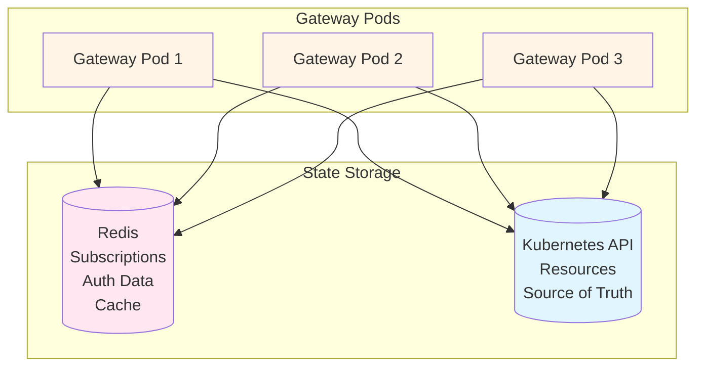
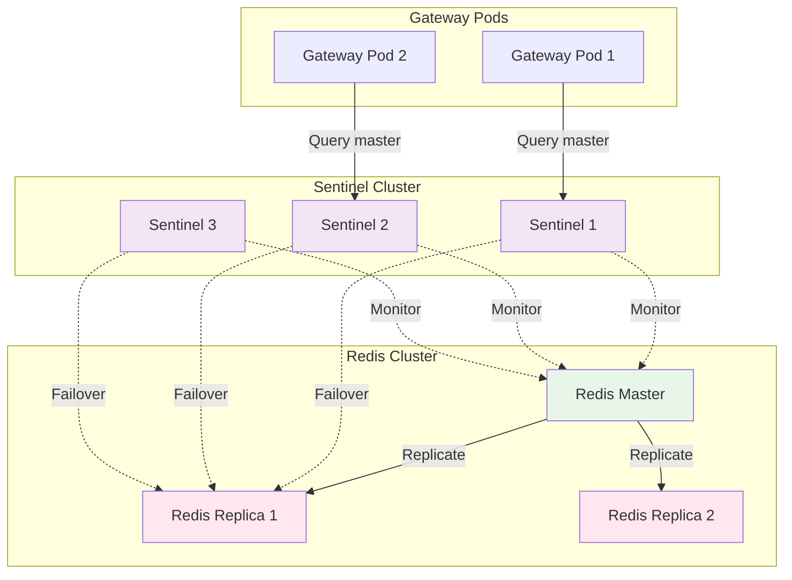
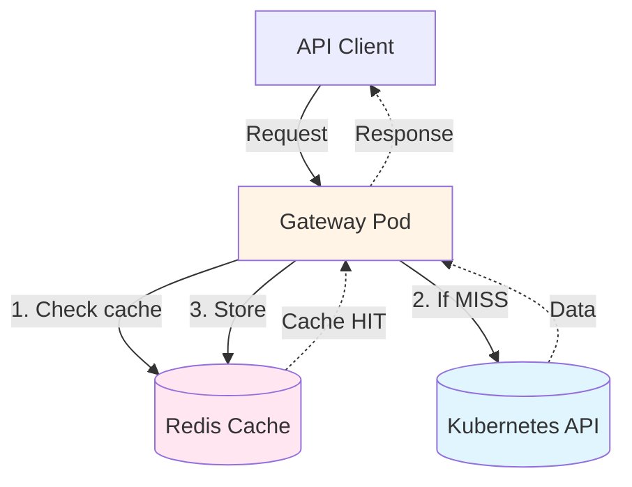
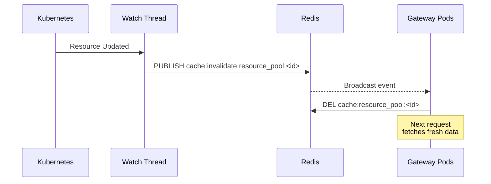
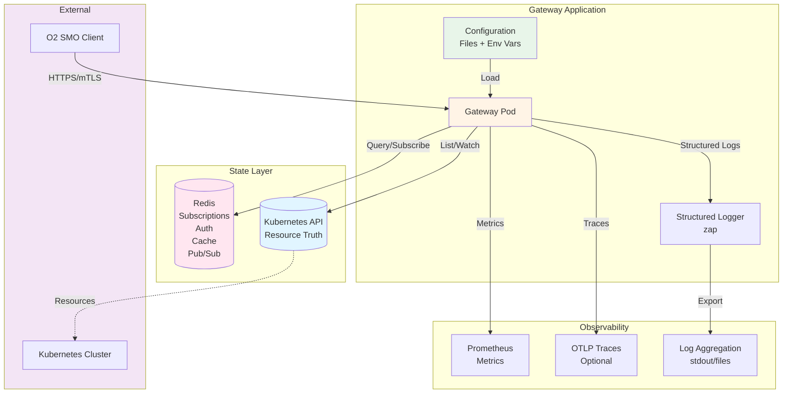
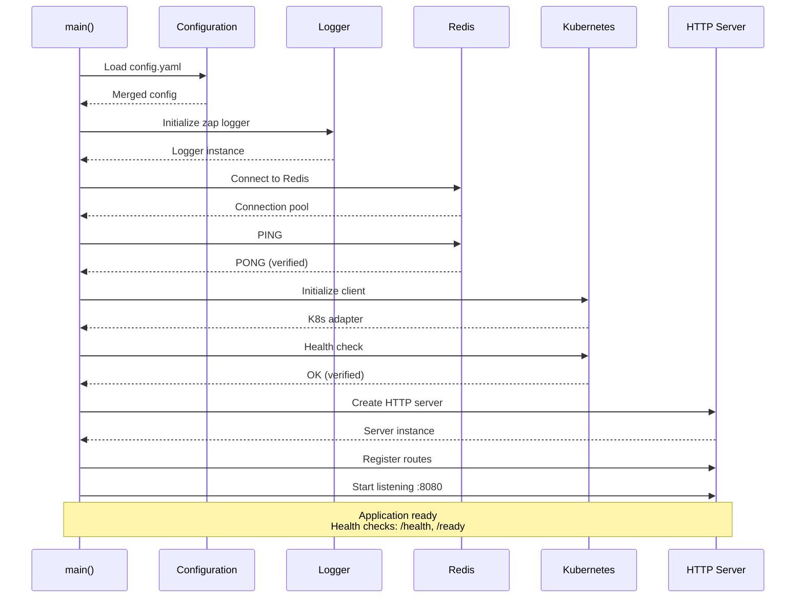
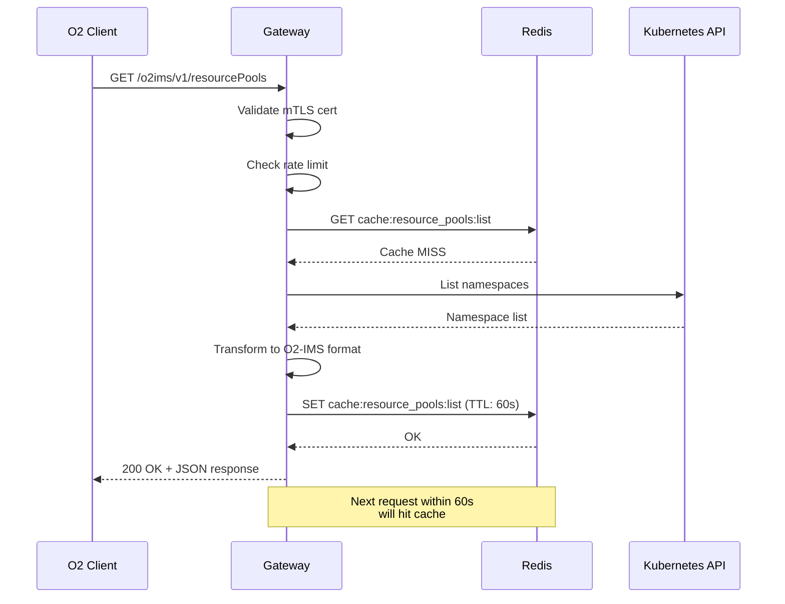

# Configuration and State Management

This document explains how the O2-IMS Gateway manages configuration, state, caching, and persistent data.

## Table of Contents

- [Configuration Management](#configuration-management)
- [State Management](#state-management)
- [Caching Strategy](#caching-strategy)
- [Data Persistence](#data-persistence)
- [Architecture Overview](#architecture-overview)

## Configuration Management

The gateway uses a layered configuration approach with support for multiple environments and secure secret management.

### Configuration Sources

Configuration is loaded from multiple sources with the following **precedence order** (highest to lowest):

1. **Environment Variables** (highest priority)
2. **Configuration Files** (YAML)
3. **Default Values** (lowest priority)

### Configuration File Resolution

The application resolves configuration files in this order:

1. **Explicit Path** - CLI flag: `--config=/path/to/config.yaml`
2. **Environment Variable** - `NETWEAVE_CONFIG=/path/to/config.yaml`
3. **Environment-Specific** - `NETWEAVE_ENV=prod` → `config/config.prod.yaml`
4. **Default Path** - `config/config.yaml`

```bash
# Example: Start with explicit config
./gateway --config=/etc/netweave/config.yaml

# Example: Use environment variable
export NETWEAVE_CONFIG=/etc/netweave/config.yaml
./gateway

# Example: Use environment-specific config
export NETWEAVE_ENV=prod
./gateway  # Loads config/config.prod.yaml
```

### Environment Variables

All configuration values can be overridden via environment variables using the `NETWEAVE_` prefix:

```bash
# Override server port
export NETWEAVE_SERVER_PORT=9090

# Override Redis addresses
export NETWEAVE_REDIS_ADDRESSES="redis1:6379,redis2:6379"

# Override log level
export NETWEAVE_OBSERVABILITY_LOGGING_LEVEL=debug
```

**Naming Convention:**
- Prefix: `NETWEAVE_`
- Nested keys: Use underscores (`_`) to separate levels
- Arrays: Comma-separated values

Examples:
```bash
NETWEAVE_SERVER_PORT=8080
NETWEAVE_REDIS_MODE=sentinel
NETWEAVE_REDIS_ADDRESSES="sentinel1:26379,sentinel2:26379,sentinel3:26379"
NETWEAVE_TLS_ENABLED=true
NETWEAVE_OBSERVABILITY_LOGGING_LEVEL=info
```

### Configuration Structure

```yaml
# Server Configuration
server:
  host: "0.0.0.0"
  port: 8080
  read_timeout: 30s
  write_timeout: 30s
  idle_timeout: 120s
  shutdown_timeout: 30s
  gin_mode: release  # debug, release, test

# Redis Configuration
redis:
  mode: standalone  # standalone, sentinel, cluster
  addresses:
    - localhost:6379
  password_env_var: REDIS_PASSWORD      # Recommended
  password_file: /run/secrets/redis-pw  # Alternative
  # password: "secret"                  # DEPRECATED: Don't use
  db: 0
  pool_size: 10
  max_retries: 3
  dial_timeout: 5s
  read_timeout: 3s
  write_timeout: 3s

# Kubernetes Configuration
kubernetes:
  config_path: ""  # Empty = in-cluster config
  namespace: ""    # Empty = all namespaces
  qps: 50.0
  burst: 100
  timeout: 30s
  enable_watch: true

# TLS/mTLS Configuration
tls:
  enabled: false
  cert_file: /etc/certs/server.crt
  key_file: /etc/certs/server.key
  ca_file: /etc/certs/ca.crt
  client_auth: none  # none, request, require, verify, require-and-verify
  min_version: "1.3"

# Observability Configuration
observability:
  logging:
    level: info  # debug, info, warn, error, fatal
    format: json  # json, console
    output_paths: [stdout]
    error_output_paths: [stderr]
    enable_caller: true
    enable_stacktrace: false
    development: false

  metrics:
    enabled: true
    path: /metrics
    namespace: netweave
    subsystem: gateway

  tracing:
    enabled: false
    provider: otlp  # jaeger, zipkin, otlp
    endpoint: ""
    sampling_rate: 0.1

# Security Configuration
security:
  enable_cors: false
  rate_limit_enabled: true
  allow_insecure_callbacks: false  # ONLY for dev/test

# Multi-Tenancy Configuration
multi_tenancy:
  enabled: false
  require_mtls: true
  initialize_default_roles: true
  audit_log_retention_days: 30
```

### Secure Secret Management

**CRITICAL:** Never store passwords in configuration files.

#### Recommended Approaches

**1. Environment Variables (Best for Kubernetes/Docker)**

```yaml
# config.yaml
redis:
  password_env_var: REDIS_PASSWORD
  sentinel_password_env_var: SENTINEL_PASSWORD
```

```bash
# Kubernetes Secret
kubectl create secret generic redis-creds \
  --from-literal=password='your-redis-password' \
  --from-literal=sentinel-password='your-sentinel-password'

# Pod spec
env:
  - name: REDIS_PASSWORD
    valueFrom:
      secretKeyRef:
        name: redis-creds
        key: password
  - name: SENTINEL_PASSWORD
    valueFrom:
      secretKeyRef:
        name: redis-creds
        key: sentinel-password
```

**2. Secret Files (Best for File-Based Secrets)**

```yaml
# config.yaml
redis:
  password_file: /run/secrets/redis-password
  sentinel_password_file: /run/secrets/sentinel-password
```

```yaml
# Kubernetes: Mount secrets as files
volumeMounts:
  - name: redis-secret
    mountPath: /run/secrets
    readOnly: true
volumes:
  - name: redis-secret
    secret:
      secretName: redis-creds
      items:
        - key: password
          path: redis-password
        - key: sentinel-password
          path: sentinel-password
```

**3. DEPRECATED: Direct Password (AVOID)**

```yaml
# ❌ BAD: Insecure, will trigger deprecation warning
redis:
  password: "hardcoded-password"
```

### Configuration Validation

The application validates configuration on startup:

**Development Environment:**
- Minimal validation
- TLS optional
- Rate limiting optional
- Debug logging allowed

**Staging Environment:**
- TLS recommended
- Rate limiting recommended
- Production-like settings encouraged

**Production Environment:**
- **TLS required** with mTLS (`require-and-verify`)
- **Rate limiting required**
- **HTTPS callbacks enforced** (no HTTP)
- **Debug logging prohibited**
- **Response validation disabled** (performance)

```go
// Validation errors on startup
FATAL: invalid configuration:
  - TLS must be enabled in production (environment: prod)
  - mTLS with require-and-verify must be enabled in production
  - rate limiting must be enabled in production
  - debug logging level is not recommended for production
```

### Environment-Specific Configs

Use separate configuration files for each environment:

```
config/
├── config.dev.yaml      # Development (local)
├── config.staging.yaml  # Staging (pre-production)
└── config.prod.yaml     # Production
```

**Development (`config.dev.yaml`):**
```yaml
server:
  gin_mode: debug
tls:
  enabled: false
observability:
  logging:
    level: debug
    development: true
security:
  rate_limit_enabled: false
  allow_insecure_callbacks: true
multi_tenancy:
  enabled: false
```

**Production (`config.prod.yaml`):**
```yaml
server:
  gin_mode: release
tls:
  enabled: true
  client_auth: require-and-verify
observability:
  logging:
    level: info
    development: false
security:
  rate_limit_enabled: true
  allow_insecure_callbacks: false
multi_tenancy:
  enabled: true
  require_mtls: true
```

## State Management

The gateway is designed as a **stateless application** with all persistent state stored in external systems.

### State Storage Architecture



### What is Stored Where

| Data Type | Storage | Purpose | TTL |
|-----------|---------|---------|-----|
| **O2-IMS Resources** | Kubernetes API | Source of truth for resource pools, types, resources | Permanent |
| **Subscriptions** | Redis | Webhook subscriptions, filters, callbacks | Permanent |
| **Authentication** | Redis | Tenants, users, roles, sessions | Permanent |
| **Audit Logs** | Redis | Security audit trail, compliance | 30 days |
| **Rate Limit State** | Redis | Per-tenant/endpoint rate counters | 1 minute |
| **Cache Data** | Redis | API response cache, Kubernetes data cache | 5-60 seconds |
| **Pub/Sub Events** | Redis | Inter-pod notifications | Ephemeral |

### Redis Data Model

#### Subscription Storage

```
Key Pattern                          Type    Description
───────────────────────────────────────────────────────────────────
subscription:<id>                    Hash    Subscription data (JSON)
subscriptions:active                 Set     All active subscription IDs
subscriptions:pool:<poolID>          Set     Index: by resource pool
subscriptions:type:<typeID>          Set     Index: by resource type
subscriptions:tenant:<tenantID>      Set     Index: by tenant (multi-tenancy)
subscriptions:events                 Pub/Sub Inter-pod event notifications
```

**Example:**
```redis
# Subscription data
subscription:sub-123 → {"id":"sub-123","callback":"https://smo.example.com/notify",...}

# Indexes
subscriptions:active → {sub-123, sub-456, sub-789}
subscriptions:pool:pool-abc → {sub-123, sub-456}
subscriptions:type:type-xyz → {sub-123}
```

#### Authentication Storage (Multi-Tenancy Mode)

```
Key Pattern                          Type    Description
───────────────────────────────────────────────────────────────────
tenant:<id>                          Hash    Tenant data, quota, usage
tenants:active                       Set     All active tenant IDs
user:<id>                            Hash    User data, roles, tenant
users:subject:<cert-hash>            String  mTLS cert subject → user ID
users:tenant:<tenantID>              Set     Users in tenant
role:<id>                            Hash    Role data, permissions
roles:all                            Set     All role IDs
roles:tenant:<tenantID>              Set     Roles in tenant
roles:name:<name>                    String  Role name → role ID
audit:<id>                           Hash    Audit event data
audit:events                         List    Ordered audit event IDs
audit:tenant:<tenantID>              Set     Audit events by tenant
audit:user:<userID>                  Set     Audit events by user
```

#### Rate Limiting State

```
Key Pattern                          Type    Description
───────────────────────────────────────────────────────────────────
ratelimit:tenant:<id>:<window>       String  Request count (TTL: 1m)
ratelimit:endpoint:<path>:<window>   String  Endpoint count (TTL: 1m)
ratelimit:global:<window>            String  Global count (TTL: 1m)
```

### Redis High Availability

The gateway supports **Redis Sentinel** for automatic failover:

```yaml
redis:
  mode: sentinel
  addresses:
    - sentinel1.example.com:26379
    - sentinel2.example.com:26379
    - sentinel3.example.com:26379
  master_name: mymaster
  password_env_var: REDIS_PASSWORD
  sentinel_password_env_var: SENTINEL_PASSWORD
```

**Sentinel Architecture:**



**Failover Behavior:**
- Sentinels monitor Redis master health
- Automatic promotion of replica to master on failure
- Gateway automatically reconnects to new master
- Zero downtime for applications (brief connection retry)

## Caching Strategy

The gateway implements intelligent caching to reduce load on Kubernetes API and improve response times.

### Cache Layers



### Cache Configuration

**Currently Planned** (not yet fully implemented):

```yaml
cache:
  enabled: true
  ttl:
    resource_pools: 60s      # Resource pool list
    resource_types: 300s     # Resource types (rarely change)
    resources: 30s           # Individual resources
    deployment_managers: 60s # Deployment managers
  invalidation:
    on_create: true          # Invalidate on resource creation
    on_update: true          # Invalidate on resource update
    on_delete: true          # Invalidate on resource deletion
```

### Cache Keys

```
Key Pattern                          TTL     Description
───────────────────────────────────────────────────────────────────
cache:resource_pools:list            60s     All resource pools
cache:resource_pool:<id>             60s     Individual pool
cache:resource_types:list            300s    All resource types
cache:resource_type:<id>             300s    Individual type
cache:resources:list:<poolID>        30s     Resources in pool
cache:resource:<id>                  30s     Individual resource
cache:dm:list                        60s     Deployment managers
cache:dm:<id>                        60s     Individual DM
```

### Cache Invalidation

**Event-Driven Invalidation:**

1. **Kubernetes Watch Events** → Invalidate affected cache entries
2. **Subscription Events** → Pub/Sub notification to all pods
3. **Manual Invalidation** → Admin API endpoint (future)



## Data Persistence

### Persistent Data

**Data that survives pod restarts:**
- ✅ Subscriptions (Redis)
- ✅ Tenants, users, roles (Redis, if multi-tenancy enabled)
- ✅ Kubernetes resources (Kubernetes API)

**Data that does NOT survive:**
- ❌ In-memory cache (rebuilt on restart)
- ❌ Active HTTP connections
- ❌ Rate limit counters (resets on window expiry)

### Backup and Recovery

**Redis Backup:**

```bash
# Manual backup (on Redis server)
redis-cli SAVE
redis-cli BGSAVE  # Background save

# Copy RDB file
cp /var/lib/redis/dump.rdb /backup/redis-$(date +%Y%m%d).rdb

# Restore
cp /backup/redis-20260112.rdb /var/lib/redis/dump.rdb
systemctl restart redis
```

**Kubernetes Backup:**

```bash
# Backup resources (using velero or similar)
velero backup create o2ims-backup \
  --include-namespaces o2ims-system

# Restore
velero restore create --from-backup o2ims-backup
```

### Data Retention

| Data Type | Retention Policy |
|-----------|-----------------|
| **Subscriptions** | Permanent (until explicitly deleted) |
| **Audit Logs** | 30 days (configurable) |
| **Rate Limit Data** | 1 minute (window duration) |
| **Cache Data** | 5-300 seconds (by type) |
| **Kubernetes Resources** | Per Kubernetes retention policy |

## Architecture Overview

### Complete Data Flow



### Startup Sequence



### Request Flow



## Best Practices

### Configuration

1. **Use environment-specific configs**
   - Keep development config permissive
   - Make staging similar to production
   - Lock down production config

2. **Never commit secrets**
   - Use `password_env_var` or `password_file`
   - Add `*.secret.yaml` to `.gitignore`
   - Use secret management tools (Vault, Sealed Secrets)

3. **Validate early**
   - Run `--version` test before deployment
   - Test config loading in CI/CD
   - Use linters for YAML syntax

### State Management

1. **Design for statelessness**
   - No local file storage (except logs)
   - No in-memory session state
   - All state in Redis or Kubernetes

2. **Handle Redis failures gracefully**
   - Use Sentinel for HA
   - Implement retry logic
   - Fail fast if Redis is unavailable

3. **Monitor state storage**
   - Redis memory usage
   - Connection pool saturation
   - Replication lag (Sentinel)

### Caching

1. **Set appropriate TTLs**
   - Short TTL for frequently changing data (30-60s)
   - Long TTL for static data (5-10 minutes)
   - No TTL for subscription data

2. **Implement cache invalidation**
   - Clear cache on resource updates
   - Use Redis Pub/Sub for coordination
   - Provide manual invalidation endpoint

3. **Monitor cache performance**
   - Track cache hit/miss ratio
   - Monitor cache memory usage
   - Alert on cache errors

## Troubleshooting

### Configuration Issues

**Problem:** Configuration file not found
```bash
# Solution: Check file path and permissions
ls -la config/config.yaml
export NETWEAVE_CONFIG=/absolute/path/to/config.yaml
```

**Problem:** Environment variable not working
```bash
# Solution: Verify naming and format
export NETWEAVE_SERVER_PORT=9090  # Correct
export NETWEAVE_SERVER.PORT=9090  # WRONG (use underscore)
```

### Redis Connection Issues

**Problem:** Cannot connect to Redis
```bash
# Check connectivity
redis-cli -h redis.example.com -p 6379 PING

# Check authentication
redis-cli -h redis.example.com -p 6379 -a "$REDIS_PASSWORD" PING

# Check Sentinel
redis-cli -h sentinel1.example.com -p 26379 SENTINEL masters
```

**Problem:** Subscription not persisting
```bash
# Check Redis data
redis-cli KEYS "subscription:*"
redis-cli SMEMBERS "subscriptions:active"
redis-cli GET "subscription:sub-123"
```

### Cache Issues

**Problem:** Stale cache data
```bash
# Manual cache invalidation (Redis CLI)
redis-cli DEL "cache:resource_pools:list"
redis-cli KEYS "cache:*" | xargs redis-cli DEL

# Check TTL
redis-cli TTL "cache:resource_pools:list"
```

## See Also

- [Architecture Overview](architecture.md)
- [API Documentation](api-mapping.md)
- [Deployment Guide](../README.md#deployment)
- [Security Best Practices](architecture.md#security)
