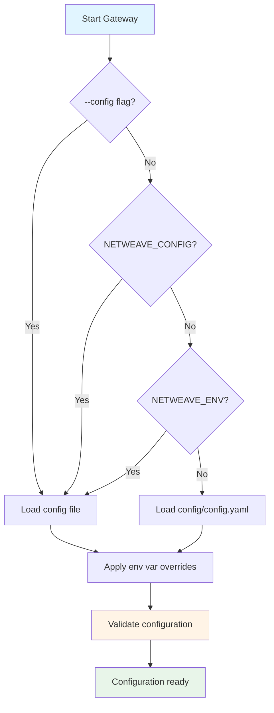
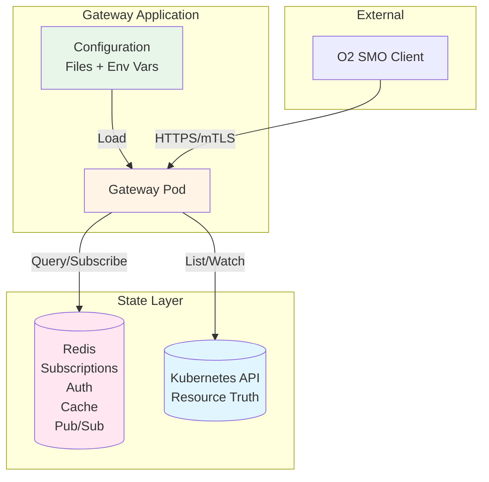

# Configuration Overview

This directory contains comprehensive configuration documentation for the O2-IMS Gateway.

## Quick Navigation

| Document | Description |
|----------|-------------|
| **[basics.md](basics.md)** | Core configuration options: server, Redis, logging |
| **[environments.md](environments.md)** | Environment detection, dev/staging/prod configs |
| **[security.md](security.md)** | TLS, mTLS, authentication, secrets management |
| **[adapters.md](adapters.md)** | Backend adapter configuration and routing |
| **[reference.md](reference.md)** | Complete configuration reference with all options |

## Configuration System

The O2-IMS Gateway uses a hierarchical configuration system with environment-specific settings and secure secret management.

### Configuration Priority

Configuration values are resolved in this order (highest to lowest priority):

1. **Environment variables** (`NETWEAVE_SERVER_PORT`, `NETWEAVE_REDIS_PASSWORD`)
2. **Explicit config file path** (`--config=/path/to/config.yaml`)
3. **NETWEAVE_CONFIG environment variable**
4. **Environment-specific config** (`NETWEAVE_ENV=prod` → `config/config.prod.yaml`)
5. **Default config file** (`config/config.yaml`)

### Environment Detection

The gateway automatically detects the environment using:

**Method 1: NETWEAVE_ENV Variable**
```bash
export NETWEAVE_ENV=dev      # Development
export NETWEAVE_ENV=staging  # Staging
export NETWEAVE_ENV=prod     # Production
./bin/gateway
```

**Method 2: Config File Path Pattern**
```bash
./bin/gateway --config=config/config.dev.yaml      # Auto-detects "dev"
./bin/gateway --config=config/config.prod.yaml     # Auto-detects "prod"
```

**Method 3: Makefile Targets**
```bash
make run-dev      # Development
make run-staging  # Staging
make run-prod     # Production
```

### Environment Variable Overrides

All configuration values can be overridden using the `NETWEAVE_` prefix:

```bash
# Override server port
export NETWEAVE_SERVER_PORT=9090

# Override Redis addresses (comma-separated for arrays)
export NETWEAVE_REDIS_ADDRESSES="redis1:6379,redis2:6379"

# Override log level
export NETWEAVE_OBSERVABILITY_LOGGING_LEVEL=debug

# Override nested keys (use underscores)
export NETWEAVE_TLS_CLIENT_AUTH=require-and-verify
```

**Naming Convention:**
- Prefix: `NETWEAVE_`
- Nested keys: Use underscores (`_`) to separate levels
- Arrays: Comma-separated values
- Example: `redis.master_name` → `NETWEAVE_REDIS_MASTER_NAME`

### Configuration File Resolution



### Quick Start Examples

**Development (local testing):**
```bash
# Uses config/config.dev.yaml
NETWEAVE_ENV=dev ./bin/gateway

# Or with explicit config
./bin/gateway --config=config/config.dev.yaml
```

**Production (Kubernetes):**
```bash
# Uses config/config.prod.yaml
NETWEAVE_ENV=prod ./bin/gateway

# With environment overrides
NETWEAVE_ENV=prod \
NETWEAVE_SERVER_PORT=8443 \
NETWEAVE_REDIS_PASSWORD="${REDIS_PASSWORD}" \
./bin/gateway
```

### Validation Rules

The gateway validates configuration on startup based on the detected environment.

**Development Environment:**
- Minimal validation
- TLS optional
- Rate limiting optional
- Debug logging allowed

**Staging Environment:**
- TLS recommended
- Rate limiting recommended
- Production-like settings encouraged

**Production Environment:**
- **TLS required** with mTLS (`require-and-verify`)
- **Rate limiting required**
- **HTTPS callbacks enforced** (no HTTP)
- **Debug logging prohibited**
- **Response validation disabled** (performance)

Example validation errors:
```
FATAL: invalid configuration:
  - TLS must be enabled in production (environment: prod)
  - mTLS with require-and-verify must be enabled in production
  - rate limiting must be enabled in production
  - debug logging level is not recommended for production
```

See [environments.md](environments.md) for detailed validation rules.

## Architecture Overview

### Configuration and State

The gateway is a **stateless application** with all persistent state in external systems:



**State Storage:**
- **Kubernetes API**: Source of truth for O2-IMS resources (pools, types, resources)
- **Redis**: Subscriptions, authentication data, cache, rate limiting

**Data Persistence:**
- ✅ Subscriptions (Redis)
- ✅ Tenants, users, roles (Redis, if multi-tenancy enabled)
- ✅ Kubernetes resources (Kubernetes API)
- ❌ In-memory cache (rebuilt on restart)
- ❌ Active HTTP connections
- ❌ Rate limit counters (resets on window expiry)

## Next Steps

- **New to configuration?** Start with [basics.md](basics.md)
- **Deploying to production?** Read [environments.md](environments.md) and [security.md](security.md)
- **Setting up mTLS?** See [security.md](security.md)
- **Configuring backends?** Check [adapters.md](adapters.md)
- **Need full reference?** See [reference.md](reference.md)

## Troubleshooting

### Configuration file not found
```bash
# Check file exists
ls -la config/config.yaml

# Use explicit path
./bin/gateway --config=/absolute/path/to/config.yaml

# Or set environment variable
export NETWEAVE_CONFIG=/path/to/config.yaml
```

### Environment variable not working
```bash
# Correct naming (use underscores)
export NETWEAVE_SERVER_PORT=9090

# WRONG (don't use dots)
export NETWEAVE_SERVER.PORT=9090
```

### Validation errors on startup
```bash
# Check which environment is detected
./bin/gateway 2>&1 | grep "environment"

# Validate config without starting
go run cmd/gateway/main.go --config=config/config.prod.yaml --validate
```

## See Also

- [Architecture Documentation](../architecture.md)
- [API Mapping](../api-mapping.md)
- [Deployment Guide](../../README.md#deployment)
