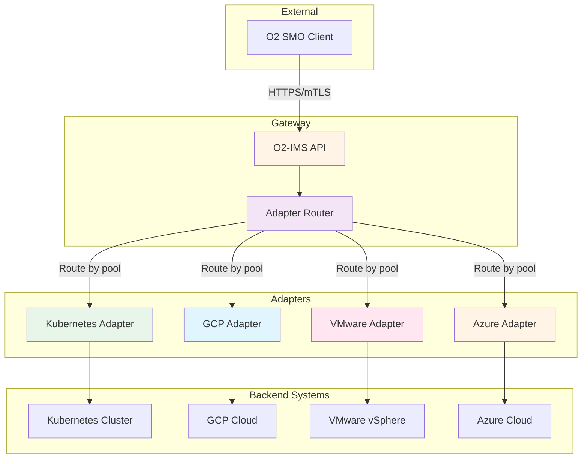
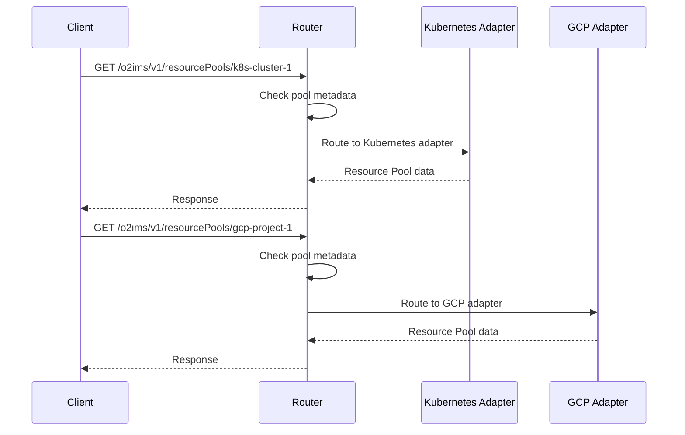

# Backend Adapter Configuration

Configuration for backend adapters (Kubernetes, GCP, VMware, Azure) and routing strategies.

## Table of Contents

- [Adapter Overview](#adapter-overview)
- [Kubernetes Adapter](#kubernetes-adapter)
- [GCP Adapter](#gcp-adapter)
- [VMware Adapter](#vmware-adapter)
- [Azure Adapter](#azure-adapter)
- [Adapter Selection](#adapter-selection)
- [Multi-Adapter Routing](#multi-adapter-routing)

## Adapter Overview

The O2-IMS Gateway uses backend adapters to translate O2-IMS API calls into platform-specific operations.

### Architecture



### Adapter Capabilities

| Adapter | Resource Pools | Resource Types | Resources | Deployments |
|---------|----------------|----------------|-----------|-------------|
| **Kubernetes** | ✅ Namespaces | ✅ CRDs | ✅ Custom Resources | ❌ |
| **GCP** | ✅ Projects | ✅ Resource Types | ✅ Instances | ❌ |
| **VMware** | ✅ Clusters | ✅ Resource Types | ✅ VMs | ✅ vApps |
| **Azure** | ✅ Resource Groups | ✅ Resource Types | ✅ Instances | ❌ |

## Kubernetes Adapter

Maps O2-IMS resources to Kubernetes API objects.

### Configuration

```yaml
kubernetes:
  config_path: ""               # Path to kubeconfig (empty = in-cluster)
  context: ""                   # Kubeconfig context
  namespace: ""                 # Default namespace (empty = all)
  qps: 100.0                    # API queries per second
  burst: 200                    # API burst limit
  timeout: 30s                  # API request timeout
  enable_watch: true            # Enable watch for real-time updates
  watch_resync: 10m             # Watch cache resync period
```

### Field Reference

| Field | Type | Default | Description |
|-------|------|---------|-------------|
| `config_path` | string | `""` | Path to kubeconfig file. Empty = use in-cluster ServiceAccount config |
| `context` | string | `""` | Kubeconfig context to use. Empty = current context |
| `namespace` | string | `""` | Default namespace. Empty = all namespaces (cluster-wide) |
| `qps` | float | `50.0` | Maximum queries per second to Kubernetes API |
| `burst` | int | `100` | Burst limit for API requests |
| `timeout` | duration | `30s` | Timeout for individual API requests |
| `enable_watch` | bool | `true` | Enable watch for real-time resource updates |
| `watch_resync` | duration | `10m` | Full resync period for watch cache |

### Resource Mapping

| O2-IMS Concept | Kubernetes Resource |
|----------------|---------------------|
| **Resource Pool** | Namespace |
| **Resource Type** | CustomResourceDefinition (CRD) |
| **Resource** | Custom Resource (CR) |
| **Deployment Manager** | N/A (not applicable) |

### Examples

**In-cluster (production):**
```yaml
kubernetes:
  config_path: ""       # Use ServiceAccount credentials
  namespace: ""         # Access all namespaces
  qps: 100.0
  burst: 200
  enable_watch: true
```

**Out-of-cluster (development):**
```yaml
kubernetes:
  config_path: ~/.kube/config
  context: docker-desktop
  namespace: default
  qps: 50.0
  burst: 100
  enable_watch: true
```

**Multi-cluster:**
```yaml
kubernetes:
  config_path: /etc/kubeconfig/cluster-1.yaml
  context: cluster-1-admin
  namespace: ""
  qps: 100.0
```

### Environment Overrides

```bash
export NETWEAVE_KUBERNETES_CONFIG_PATH=/path/to/kubeconfig
export NETWEAVE_KUBERNETES_CONTEXT=production-cluster
export NETWEAVE_KUBERNETES_NAMESPACE=o2ims-resources
export NETWEAVE_KUBERNETES_QPS=100.0
export NETWEAVE_KUBERNETES_BURST=200
```

### RBAC Requirements

**In-cluster ServiceAccount permissions:**

```yaml
apiVersion: v1
kind: ServiceAccount
metadata:
  name: netweave-gateway
  namespace: o2ims-system

---
apiVersion: rbac.authorization.k8s.io/v1
kind: ClusterRole
metadata:
  name: netweave-gateway
rules:
  # Resource Pools (Namespaces)
  - apiGroups: [""]
    resources: ["namespaces"]
    verbs: ["get", "list", "watch"]

  # Resource Types (CRDs)
  - apiGroups: ["apiextensions.k8s.io"]
    resources: ["customresourcedefinitions"]
    verbs: ["get", "list", "watch"]

  # Resources (Custom Resources)
  - apiGroups: ["*"]
    resources: ["*"]
    verbs: ["get", "list", "watch"]

---
apiVersion: rbac.authorization.k8s.io/v1
kind: ClusterRoleBinding
metadata:
  name: netweave-gateway
roleRef:
  apiGroup: rbac.authorization.k8s.io
  kind: ClusterRole
  name: netweave-gateway
subjects:
  - kind: ServiceAccount
    name: netweave-gateway
    namespace: o2ims-system
```

## GCP Adapter

*Currently planned - not yet implemented*

Maps O2-IMS resources to Google Cloud Platform resources.

### Planned Configuration

```yaml
gcp:
  project_id: "my-gcp-project"
  credentials_file: /etc/gcp/credentials.json
  region: "us-central1"
  zone: "us-central1-a"
  timeout: 30s
```

### Planned Resource Mapping

| O2-IMS Concept | GCP Resource |
|----------------|--------------|
| **Resource Pool** | GCP Project |
| **Resource Type** | Resource Type (Compute, Storage, etc.) |
| **Resource** | Compute Instance, Disk, etc. |
| **Deployment Manager** | N/A |

## VMware Adapter

*Currently planned - not yet implemented*

Maps O2-IMS resources to VMware vSphere resources.

### Planned Configuration

```yaml
vmware:
  vcenter_host: "vcenter.example.com"
  username_env_var: VCENTER_USERNAME
  password_env_var: VCENTER_PASSWORD
  insecure_skip_verify: false
  datacenter: "Datacenter1"
  timeout: 30s
```

### Planned Resource Mapping

| O2-IMS Concept | VMware Resource |
|----------------|-----------------|
| **Resource Pool** | Cluster or Resource Pool |
| **Resource Type** | VM, vApp, etc. |
| **Resource** | Virtual Machine |
| **Deployment Manager** | vApp |

## Azure Adapter

*Currently planned - not yet implemented*

Maps O2-IMS resources to Microsoft Azure resources.

### Planned Configuration

```yaml
azure:
  subscription_id: "xxxxxxxx-xxxx-xxxx-xxxx-xxxxxxxxxxxx"
  tenant_id: "xxxxxxxx-xxxx-xxxx-xxxx-xxxxxxxxxxxx"
  client_id: "xxxxxxxx-xxxx-xxxx-xxxx-xxxxxxxxxxxx"
  client_secret_env_var: AZURE_CLIENT_SECRET
  resource_group: "o2ims-resources"
  location: "eastus"
  timeout: 30s
```

### Planned Resource Mapping

| O2-IMS Concept | Azure Resource |
|----------------|----------------|
| **Resource Pool** | Resource Group |
| **Resource Type** | Resource Type (VM, Storage, etc.) |
| **Resource** | Virtual Machine, Disk, etc. |
| **Deployment Manager** | N/A |

## Adapter Selection

The gateway can be configured to use specific adapters or auto-detect based on available backends.

### Single Adapter (Default)

Use only one adapter type:

```yaml
adapters:
  enabled: ["kubernetes"]
```

### Multi-Adapter (Planned)

Enable multiple adapters simultaneously:

```yaml
adapters:
  enabled: ["kubernetes", "gcp", "vmware"]
  default: "kubernetes"
```

### Auto-Detection (Planned)

Automatically detect and enable available adapters:

```yaml
adapters:
  auto_detect: true
```

## Multi-Adapter Routing

*Planned feature for multi-cloud deployments*

Route requests to different adapters based on resource pool metadata.

### Routing Strategy

```yaml
adapters:
  enabled: ["kubernetes", "gcp", "vmware"]
  routing:
    strategy: "pool-metadata"  # or "round-robin", "explicit"
    fallback: "kubernetes"
```

### Pool-Based Routing

Route based on resource pool annotations:

```yaml
# Resource Pool metadata
apiVersion: o2ims.example.com/v1
kind: ResourcePool
metadata:
  name: k8s-cluster-1
  annotations:
    o2ims.example.com/adapter: "kubernetes"
spec:
  location: "us-east"
---
apiVersion: o2ims.example.com/v1
kind: ResourcePool
metadata:
  name: gcp-project-1
  annotations:
    o2ims.example.com/adapter: "gcp"
spec:
  location: "us-central1"
```

### Routing Flow



## Best Practices

### Kubernetes Adapter

1. **Use in-cluster config in production** - More secure than kubeconfig files
2. **Grant minimal RBAC permissions** - Only what's needed for O2-IMS operations
3. **Enable watch for real-time updates** - More efficient than polling
4. **Set appropriate QPS/burst** - Based on cluster size and load
5. **Monitor API server load** - Ensure gateway doesn't overwhelm K8s API

### Multi-Adapter (Planned)

1. **Use consistent naming** - Standardize resource pool naming across backends
2. **Document routing rules** - Clear documentation of which pools use which adapters
3. **Monitor adapter health** - Track availability of each backend
4. **Test failover** - Ensure fallback adapter works when primary fails
5. **Audit cross-adapter access** - Track which tenants access which backends

### Performance

1. **Cache aggressively** - Reduce backend API calls
2. **Use watch instead of poll** - More efficient for Kubernetes
3. **Batch operations** - When possible, batch multiple requests
4. **Set appropriate timeouts** - Balance responsiveness vs stability
5. **Monitor backend latency** - Track and alert on slow backends

## Troubleshooting

### Kubernetes adapter connection failed

```bash
# Check kubeconfig is valid
kubectl --kubeconfig=/path/to/kubeconfig cluster-info

# Check ServiceAccount permissions (in-cluster)
kubectl auth can-i list namespaces \
  --as=system:serviceaccount:o2ims-system:netweave-gateway

# Test API server connectivity
curl -k https://kubernetes.default.svc/api/v1/namespaces
```

### Watch events not working

```bash
# Check if watch is enabled
grep "enable_watch" config/config.yaml

# Check Kubernetes API server logs
kubectl logs -n kube-system kube-apiserver-xxx

# Manually test watch
kubectl get pods --watch
```

### Resource not found

```bash
# Check namespace exists
kubectl get namespace my-resource-pool

# Check CRD exists
kubectl get crd my-resource-type

# Check custom resource exists
kubectl get my-resource-type -n my-resource-pool
```

### QPS/burst limits too low

```bash
# Monitor rate limiting in logs
kubectl logs deployment/gateway -n o2ims-system | grep "rate limit"

# Increase limits
export NETWEAVE_KUBERNETES_QPS=200.0
export NETWEAVE_KUBERNETES_BURST=400
```

## See Also

- [Configuration Basics](basics.md)
- [Kubernetes API Client Documentation](https://kubernetes.io/docs/reference/using-api/client-libraries/)
- [RBAC Documentation](https://kubernetes.io/docs/reference/access-authn-authz/rbac/)
