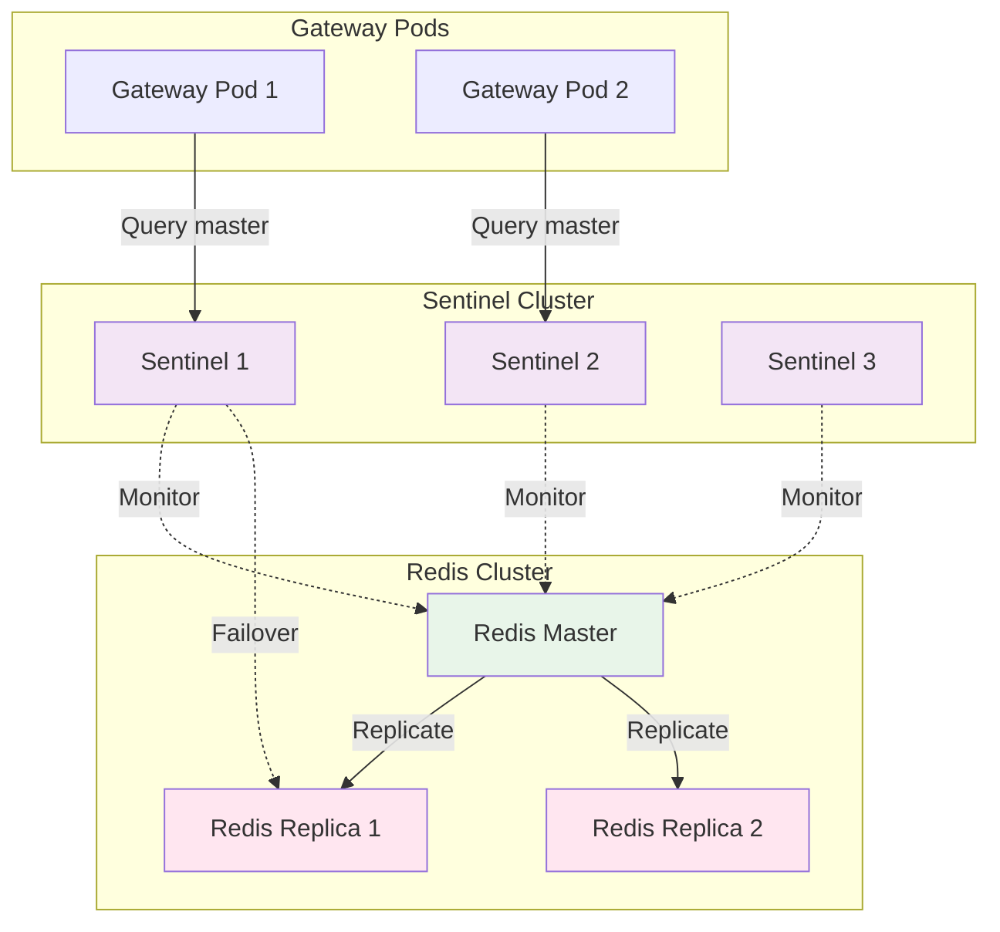

# Configuration Basics

Core configuration options for server, Redis, logging, and observability.

## Table of Contents

- [Server Configuration](#server-configuration)
- [Redis Configuration](#redis-configuration)
- [Kubernetes Configuration](#kubernetes-configuration)
- [Logging Configuration](#logging-configuration)
- [Metrics Configuration](#metrics-configuration)
- [Tracing Configuration](#tracing-configuration)

## Server Configuration

HTTP server settings for the gateway API.

```yaml
server:
  host: "0.0.0.0"              # Bind address (0.0.0.0 = all interfaces)
  port: 8443                    # HTTP(S) port
  read_timeout: 30s             # Request read timeout
  write_timeout: 30s            # Response write timeout
  idle_timeout: 120s            # Keep-alive idle timeout
  shutdown_timeout: 30s         # Graceful shutdown timeout
  max_header_bytes: 1048576     # Max header size (1MB)
  gin_mode: release             # Gin mode: debug, release, test
```

### Field Reference

| Field | Type | Default | Description |
|-------|------|---------|-------------|
| `host` | string | `"0.0.0.0"` | Server bind address. Use `0.0.0.0` for all interfaces, `127.0.0.1` for localhost only |
| `port` | int | `8080` | HTTP server port. Must be 1-65535 |
| `read_timeout` | duration | `30s` | Maximum time to read request headers and body |
| `write_timeout` | duration | `30s` | Maximum time to write response |
| `idle_timeout` | duration | `120s` | Keep-alive timeout for idle connections |
| `shutdown_timeout` | duration | `30s` | Maximum time to wait for graceful shutdown |
| `max_header_bytes` | int | `1048576` | Maximum request header size in bytes (1MB) |
| `gin_mode` | string | `"release"` | Gin framework mode: `debug`, `release`, `test` |

### Environment Overrides

```bash
export NETWEAVE_SERVER_HOST=0.0.0.0
export NETWEAVE_SERVER_PORT=8443
export NETWEAVE_SERVER_READ_TIMEOUT=30s
export NETWEAVE_SERVER_WRITE_TIMEOUT=30s
export NETWEAVE_SERVER_GIN_MODE=release
```

### Examples

**Development (verbose logging):**
```yaml
server:
  port: 8080
  gin_mode: debug  # Enables Gin debug logging
```

**Production (secure, performant):**
```yaml
server:
  host: "0.0.0.0"
  port: 8443
  read_timeout: 30s
  write_timeout: 30s
  gin_mode: release  # Minimal logging
```

## Redis Configuration

Redis storage for subscriptions, authentication, caching, and pub/sub.

### Standalone Mode

Single Redis instance (development only):

```yaml
redis:
  mode: standalone
  addresses:
    - localhost:6379
  password_env_var: REDIS_PASSWORD  # Read from environment
  db: 0
  pool_size: 10
  min_idle_conns: 2
  max_retries: 3
  dial_timeout: 5s
  read_timeout: 3s
  write_timeout: 3s
  pool_timeout: 4s
  idle_timeout: 5m
```

### Sentinel Mode (High Availability)

Redis Sentinel for automatic failover (production):

```yaml
redis:
  mode: sentinel
  addresses:
    - redis-sentinel-0:26379
    - redis-sentinel-1:26379
    - redis-sentinel-2:26379
  master_name: mymaster
  password_env_var: REDIS_PASSWORD
  sentinel_password_env_var: SENTINEL_PASSWORD
  db: 0
  pool_size: 50
  min_idle_conns: 10
  max_retries: 5
  dial_timeout: 5s
  read_timeout: 3s
  write_timeout: 3s
  pool_timeout: 4s
  idle_timeout: 5m
  enable_tls: true
  tls_insecure_skip_verify: false
```

### Field Reference

| Field | Type | Default | Description |
|-------|------|---------|-------------|
| `mode` | string | `"standalone"` | Redis mode: `standalone`, `sentinel`, `cluster` |
| `addresses` | []string | `["localhost:6379"]` | Redis server addresses (or Sentinel addresses in sentinel mode) |
| `master_name` | string | `""` | Sentinel master name (required for sentinel mode) |
| `password_env_var` | string | `""` | Environment variable name containing Redis password |
| `password_file` | string | `""` | Path to file containing Redis password |
| `sentinel_password_env_var` | string | `""` | Environment variable for Sentinel password |
| `sentinel_password_file` | string | `""` | Path to file containing Sentinel password |
| `db` | int | `0` | Database number (0-15) |
| `pool_size` | int | `10` | Maximum number of socket connections |
| `min_idle_conns` | int | `0` | Minimum number of idle connections |
| `max_retries` | int | `3` | Maximum number of retry attempts |
| `dial_timeout` | duration | `5s` | Timeout for establishing connection |
| `read_timeout` | duration | `3s` | Timeout for socket reads |
| `write_timeout` | duration | `3s` | Timeout for socket writes |
| `pool_timeout` | duration | `4s` | Timeout waiting for connection from pool |
| `idle_timeout` | duration | `5m` | Close idle connections after this duration |
| `enable_tls` | bool | `false` | Enable TLS for Redis connections |
| `tls_insecure_skip_verify` | bool | `false` | Skip TLS certificate verification (NOT recommended) |

### Sentinel Architecture



### Environment Overrides

```bash
export NETWEAVE_REDIS_MODE=sentinel
export NETWEAVE_REDIS_ADDRESSES="sentinel1:26379,sentinel2:26379,sentinel3:26379"
export NETWEAVE_REDIS_MASTER_NAME=mymaster
export REDIS_PASSWORD="your-redis-password"
export SENTINEL_PASSWORD="your-sentinel-password"
export NETWEAVE_REDIS_PASSWORD_ENV_VAR=REDIS_PASSWORD
export NETWEAVE_REDIS_SENTINEL_PASSWORD_ENV_VAR=SENTINEL_PASSWORD
```

### Connection Pooling

**For high-replica deployments (30+ pods):**

When multi-tenancy is enabled, the gateway maintains **two separate Redis connections** per pod:
1. **Main Storage**: Subscriptions, caching, pub/sub
2. **Auth Storage**: Tenants, users, roles, audit logs

Configure pool size accordingly:

```yaml
redis:
  pool_size: 10              # Per store, per pod (20 total per pod)
  min_idle_conns: 2          # Minimum idle connections
  max_conn_age: 30m          # Maximum connection age
```

Total connections = `pool_size × stores × pods`
Example: `10 × 2 × 30 = 600 connections`

## Kubernetes Configuration

Kubernetes client settings for accessing cluster resources.

```yaml
kubernetes:
  config_path: ""               # Path to kubeconfig (empty = in-cluster)
  context: ""                   # Kubeconfig context
  namespace: ""                 # Default namespace (empty = all)
  qps: 100.0                    # API queries per second
  burst: 200                    # API burst limit
  timeout: 30s                  # API request timeout
  enable_watch: true            # Enable watch for real-time updates
  watch_resync: 10m             # Watch cache resync period
```

### Field Reference

| Field | Type | Default | Description |
|-------|------|---------|-------------|
| `config_path` | string | `""` | Path to kubeconfig file. Empty = use in-cluster config |
| `context` | string | `""` | Kubeconfig context to use. Empty = current context |
| `namespace` | string | `""` | Default namespace. Empty = all namespaces |
| `qps` | float | `50.0` | Maximum queries per second to Kubernetes API |
| `burst` | int | `100` | Burst limit for API requests |
| `timeout` | duration | `30s` | Timeout for API requests |
| `enable_watch` | bool | `true` | Enable watch for real-time resource updates |
| `watch_resync` | duration | `10m` | Full resync period for watch cache |

### Environment Overrides

```bash
export NETWEAVE_KUBERNETES_CONFIG_PATH=/path/to/kubeconfig
export NETWEAVE_KUBERNETES_NAMESPACE=o2ims-system
export NETWEAVE_KUBERNETES_QPS=100.0
export NETWEAVE_KUBERNETES_BURST=200
```

### Examples

**In-cluster (production):**
```yaml
kubernetes:
  config_path: ""       # Use ServiceAccount credentials
  namespace: ""         # All namespaces
  qps: 100.0
  burst: 200
  enable_watch: true
```

**Out-of-cluster (development):**
```yaml
kubernetes:
  config_path: ~/.kube/config
  context: docker-desktop
  namespace: default
  qps: 50.0
  burst: 100
```

## Logging Configuration

Structured logging using uber-go/zap.

```yaml
observability:
  logging:
    level: info                   # debug, info, warn, error, fatal
    format: json                  # json, console
    output_paths:
      - stdout
    error_output_paths:
      - stderr
    enable_caller: true           # Add caller information (file:line)
    enable_stacktrace: false      # Add stacktraces on errors
    development: false            # Development mode (verbose)
```

### Field Reference

| Field | Type | Default | Description |
|-------|------|---------|-------------|
| `level` | string | `"info"` | Log level: `debug`, `info`, `warn`, `error`, `fatal` |
| `format` | string | `"json"` | Log format: `json` (structured), `console` (human-readable) |
| `output_paths` | []string | `["stdout"]` | Where to write logs. Can include file paths |
| `error_output_paths` | []string | `["stderr"]` | Where to write error-level logs |
| `enable_caller` | bool | `true` | Include caller info (file, line number) |
| `enable_stacktrace` | bool | `false` | Include stacktraces for errors |
| `development` | bool | `false` | Development mode (more verbose, console format) |

### Environment Overrides

```bash
export NETWEAVE_OBSERVABILITY_LOGGING_LEVEL=debug
export NETWEAVE_OBSERVABILITY_LOGGING_FORMAT=console
export NETWEAVE_OBSERVABILITY_LOGGING_DEVELOPMENT=true
```

### Examples

**Development (human-readable):**
```yaml
observability:
  logging:
    level: debug
    format: console
    enable_caller: true
    development: true
```

Output:
```
2026-01-12T10:30:45.123Z  INFO  gateway/main.go:123  Server starting  {"port": 8080}
2026-01-12T10:30:45.456Z  DEBUG redis/client.go:45  Connected to Redis  {"addr": "localhost:6379"}
```

**Production (structured JSON):**
```yaml
observability:
  logging:
    level: info
    format: json
    enable_caller: true
    development: false
```

Output:
```json
{"level":"info","ts":"2026-01-12T10:30:45.123Z","caller":"gateway/main.go:123","msg":"Server starting","port":8080}
{"level":"info","ts":"2026-01-12T10:30:45.456Z","caller":"redis/client.go:45","msg":"Connected to Redis","addr":"localhost:6379"}
```

## Metrics Configuration

Prometheus metrics exposition.

```yaml
observability:
  metrics:
    enabled: true
    path: /metrics
    port: 0                       # 0 = use main server port
    namespace: netweave
    subsystem: gateway
    enable_go_metrics: true
    enable_process_metrics: true
```

### Field Reference

| Field | Type | Default | Description |
|-------|------|---------|-------------|
| `enabled` | bool | `true` | Enable Prometheus metrics |
| `path` | string | `"/metrics"` | HTTP path for metrics endpoint |
| `port` | int | `0` | Metrics server port. 0 = use main server port |
| `namespace` | string | `"netweave"` | Prometheus namespace prefix |
| `subsystem` | string | `"gateway"` | Prometheus subsystem prefix |
| `enable_go_metrics` | bool | `true` | Expose Go runtime metrics |
| `enable_process_metrics` | bool | `true` | Expose process metrics (CPU, memory) |

### Exposed Metrics

**Gateway Metrics:**
- `netweave_gateway_requests_total` - Total HTTP requests
- `netweave_gateway_request_duration_seconds` - Request duration histogram
- `netweave_gateway_subscriptions_total` - Total subscriptions
- `netweave_gateway_webhooks_sent_total` - Webhook deliveries
- `netweave_gateway_cache_hits_total` - Cache hits/misses

**Go Runtime Metrics:**
- `go_goroutines` - Number of goroutines
- `go_memstats_alloc_bytes` - Allocated memory
- `go_gc_duration_seconds` - GC pause duration

**Process Metrics:**
- `process_cpu_seconds_total` - CPU time
- `process_resident_memory_bytes` - Resident memory

### Environment Overrides

```bash
export NETWEAVE_OBSERVABILITY_METRICS_ENABLED=true
export NETWEAVE_OBSERVABILITY_METRICS_PATH=/metrics
export NETWEAVE_OBSERVABILITY_METRICS_NAMESPACE=netweave
```

## Tracing Configuration

Distributed tracing using OpenTelemetry.

```yaml
observability:
  tracing:
    enabled: true
    provider: otlp                # jaeger, zipkin, otlp
    endpoint: http://jaeger:4318
    service_name: netweave-gateway-prod
    sampling_rate: 0.1            # 0.0 to 1.0 (10% sampling)
    enable_batching: true
    batch_timeout: 5s
```

### Field Reference

| Field | Type | Default | Description |
|-------|------|---------|-------------|
| `enabled` | bool | `false` | Enable distributed tracing |
| `provider` | string | `"otlp"` | Tracing backend: `jaeger`, `zipkin`, `otlp` |
| `endpoint` | string | `""` | Tracing backend endpoint URL |
| `service_name` | string | `"netweave-gateway"` | Service name in traces |
| `sampling_rate` | float | `0.1` | Sampling rate (0.0-1.0). 0.1 = 10% of requests |
| `enable_batching` | bool | `true` | Batch spans for efficiency |
| `batch_timeout` | duration | `5s` | Maximum batch wait time |

### Environment Overrides

```bash
export NETWEAVE_OBSERVABILITY_TRACING_ENABLED=true
export NETWEAVE_OBSERVABILITY_TRACING_PROVIDER=otlp
export NETWEAVE_OBSERVABILITY_TRACING_ENDPOINT=http://jaeger:4318
export NETWEAVE_OBSERVABILITY_TRACING_SAMPLING_RATE=0.1
```

### Examples

**Development (high sampling):**
```yaml
observability:
  tracing:
    enabled: true
    provider: jaeger
    endpoint: http://localhost:14268/api/traces
    sampling_rate: 1.0  # 100% sampling
```

**Production (efficient sampling):**
```yaml
observability:
  tracing:
    enabled: true
    provider: otlp
    endpoint: http://jaeger-collector:4318
    service_name: netweave-gateway-prod
    sampling_rate: 0.1  # 10% sampling for efficiency
    enable_batching: true
```

## See Also

- [Environment Configuration](environments.md)
- [Security Configuration](security.md)
- [Complete Reference](reference.md)
