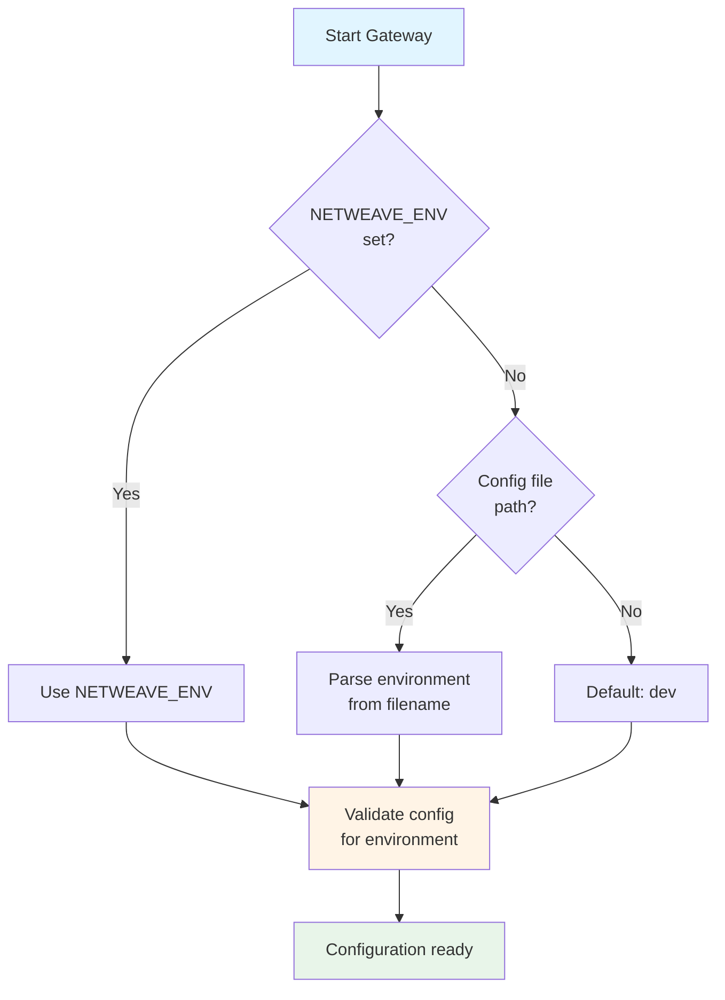

# Environment Configuration

Environment-specific configurations, validation rules, and deployment patterns for development, staging, and production environments.

## Table of Contents

- [Environment Types](#environment-types)
- [Environment Detection](#environment-detection)
- [Development Environment](#development-environment)
- [Staging Environment](#staging-environment)
- [Production Environment](#production-environment)
- [Validation Rules](#validation-rules)
- [Kubernetes Deployment](#kubernetes-deployment)

## Environment Types

The gateway supports three primary environments with different configurations and validation rules:

| Environment | Purpose | Security | Validation |
|-------------|---------|----------|------------|
| **Development** | Local testing | Minimal | Permissive |
| **Staging** | Pre-production testing | Production-like | Moderate |
| **Production** | Live deployment | Maximum | Strict |

## Environment Detection

The gateway automatically detects the environment using multiple methods.

### Method 1: NETWEAVE_ENV Environment Variable

```bash
# Development
export NETWEAVE_ENV=dev
./bin/gateway

# Staging
export NETWEAVE_ENV=staging
./bin/gateway

# Production
export NETWEAVE_ENV=prod
./bin/gateway
```

### Method 2: Config File Path Pattern

The environment is inferred from the config file name:

```bash
# Auto-detects "dev" environment
./bin/gateway --config=config/config.dev.yaml

# Auto-detects "staging" environment
./bin/gateway --config=config/config.staging.yaml

# Auto-detects "prod" environment
./bin/gateway --config=config/config.prod.yaml
```

### Method 3: Makefile Targets

```bash
# Development
make run-dev

# Staging
make run-staging

# Production
make run-prod
```

### Environment Resolution Order



## Development Environment

**Purpose**: Local development with minimal security for ease of testing.

### Configuration File: `config/config.dev.yaml`

```yaml
server:
  host: "0.0.0.0"
  port: 8080
  gin_mode: debug              # Verbose Gin logging

redis:
  mode: standalone
  addresses:
    - localhost:6379
  password_env_var: ""         # No password required
  pool_size: 10

kubernetes:
  config_path: ~/.kube/config  # Use local kubeconfig
  context: docker-desktop
  namespace: default

tls:
  enabled: false               # HTTP only (no TLS)

observability:
  logging:
    level: debug               # Verbose logging
    format: console            # Human-readable output
    development: true
  metrics:
    enabled: true
  tracing:
    enabled: false

security:
  enable_cors: true            # Allow CORS for frontend dev
  allowed_origins:
    - http://localhost:3000
  rate_limit_enabled: false    # No rate limiting

validation:
  enabled: true
  validate_response: true      # Catch API errors early

multi_tenancy:
  enabled: false               # Simpler single-tenant mode
```

### Key Features

| Feature | Setting | Reason |
|---------|---------|--------|
| TLS | Disabled | Easier local testing without certificates |
| Logging | Debug + Console | Verbose, human-readable debugging |
| Redis Auth | Disabled | Simpler local Redis setup |
| Rate Limiting | Disabled | Unrestricted testing |
| CORS | Enabled | Frontend development support |
| Response Validation | Enabled | Catch schema errors early |
| Multi-Tenancy | Disabled | Simpler development flow |

### Usage

```bash
# Start with default dev config
NETWEAVE_ENV=dev ./bin/gateway

# Or use explicit config
./bin/gateway --config=config/config.dev.yaml

# Override specific settings
NETWEAVE_ENV=dev \
NETWEAVE_SERVER_PORT=9090 \
NETWEAVE_OBSERVABILITY_LOGGING_LEVEL=debug \
./bin/gateway
```

## Staging Environment

**Purpose**: Pre-production testing with production-like security and features.

### Configuration File: `config/config.staging.yaml`

```yaml
server:
  host: "0.0.0.0"
  port: 8443
  gin_mode: release

redis:
  mode: sentinel
  addresses:
    - redis-sentinel-0:26379
    - redis-sentinel-1:26379
    - redis-sentinel-2:26379
  master_name: mymaster
  password_env_var: REDIS_PASSWORD
  sentinel_password_env_var: SENTINEL_PASSWORD
  pool_size: 30

kubernetes:
  config_path: ""              # In-cluster config
  namespace: ""                # All namespaces
  qps: 100.0
  burst: 200

tls:
  enabled: true
  cert_file: /etc/certs/tls.crt
  key_file: /etc/certs/tls.key
  ca_file: /etc/certs/ca.crt
  client_auth: require-and-verify
  min_version: "1.3"

observability:
  logging:
    level: info
    format: json
    development: false
  metrics:
    enabled: true
  tracing:
    enabled: true
    provider: otlp
    endpoint: http://jaeger:4318
    service_name: netweave-gateway-staging
    sampling_rate: 0.5         # 50% sampling for testing

security:
  enable_cors: false
  rate_limit_enabled: true
  rate_limit:
    tenant:
      requests_per_second: 50
      burst_size: 100

validation:
  enabled: true
  validate_response: false

multi_tenancy:
  enabled: true
  require_mtls: true
  audit_log_retention_days: 30
```

### Key Features

| Feature | Setting | Reason |
|---------|---------|--------|
| TLS | Enabled | Test TLS/mTLS functionality |
| mTLS | require-and-verify | Test client certificate authentication |
| Logging | Info + JSON | Production-like structured logging |
| Redis | Sentinel | Test high availability failover |
| Rate Limiting | Moderate | Realistic load testing |
| Tracing | 50% sampling | Performance testing with tracing |
| Multi-Tenancy | Enabled | Test multi-tenant features |
| CORS | Disabled | Production-like security |

### Usage

```bash
# Kubernetes deployment
helm install netweave ./helm/netweave \
  --values helm/netweave/values-staging.yaml \
  --namespace o2ims-staging

# Or with environment variable
export NETWEAVE_ENV=staging
./bin/gateway
```

## Production Environment

**Purpose**: Live deployment with maximum security, performance, and reliability.

### Configuration File: `config/config.prod.yaml`

```yaml
server:
  host: "0.0.0.0"
  port: 8443
  read_timeout: 30s
  write_timeout: 30s
  idle_timeout: 120s
  shutdown_timeout: 30s
  gin_mode: release

redis:
  mode: sentinel
  addresses:
    - redis-sentinel-0:26379
    - redis-sentinel-1:26379
    - redis-sentinel-2:26379
  master_name: mymaster
  password_env_var: REDIS_PASSWORD
  sentinel_password_env_var: SENTINEL_PASSWORD
  pool_size: 50
  min_idle_conns: 10
  enable_tls: true
  tls_insecure_skip_verify: false

kubernetes:
  config_path: ""
  namespace: ""
  qps: 100.0
  burst: 200
  timeout: 30s
  enable_watch: true

tls:
  enabled: true
  cert_file: /etc/certs/tls.crt
  key_file: /etc/certs/tls.key
  ca_file: /etc/certs/ca.crt
  client_auth: require-and-verify  # Strict mTLS
  min_version: "1.3"

observability:
  logging:
    level: info                     # NOT debug
    format: json                    # Structured only
    output_paths: [stdout]
    enable_caller: true
    enable_stacktrace: false
    development: false
  metrics:
    enabled: true
  tracing:
    enabled: true
    provider: otlp
    endpoint: http://jaeger-collector:4318
    service_name: netweave-gateway-prod
    sampling_rate: 0.1              # 10% for efficiency

security:
  enable_cors: false                # No CORS
  rate_limit_enabled: true
  rate_limit:
    tenant:
      requests_per_second: 100
      burst_size: 200
    global:
      requests_per_second: 1000
      max_concurrent_requests: 500
  allow_insecure_callbacks: false   # HTTPS only

validation:
  enabled: true
  validate_response: false          # Disabled for performance

multi_tenancy:
  enabled: true
  require_mtls: true
  initialize_default_roles: true
  audit_log_retention_days: 90
```

### Key Features

| Feature | Setting | Reason |
|---------|---------|--------|
| TLS | Required | Encryption for all traffic |
| mTLS | require-and-verify | Strict client authentication |
| Logging | Info + JSON | Efficient, parseable logs |
| Redis | Sentinel + TLS | High availability + encryption |
| Rate Limiting | Enabled | DoS protection |
| Tracing | 10% sampling | Balanced observability/performance |
| Response Validation | Disabled | Optimized performance |
| CORS | Disabled | Security hardening |
| Multi-Tenancy | Enabled | Tenant isolation |

### Usage

```bash
# Kubernetes deployment
helm install netweave ./helm/netweave \
  --values helm/netweave/values-prod.yaml \
  --set image.tag=v1.0.0 \
  --namespace o2ims-prod

# Or with environment variable
export NETWEAVE_ENV=prod
./bin/gateway
```

## Validation Rules

The gateway validates configuration on startup based on the detected environment.

### Universal Validation (All Environments)

Applied regardless of environment:

- Server port must be 1-65535
- Gin mode must be `debug`, `release`, or `test`
- Redis mode must be `standalone`, `sentinel`, or `cluster`
- Redis DB must be 0-15
- TLS min version must be `1.2` or `1.3`
- Log level must be `debug`, `info`, `warn`, `error`, or `fatal`

### Development Validation

**Minimal validation - most permissive**

- ✅ All configurations allowed
- ⚠️ Warnings for missing TLS (non-blocking)
- ⚠️ Warnings for disabled rate limiting

### Staging Validation

**Moderate validation - encourages production-like settings**

- ⚠️ TLS should be enabled
- ⚠️ Rate limiting should be enabled
- ⚠️ Multi-tenancy should match production config
- ⚠️ Debug logging not recommended

### Production Validation (Strict)

**Required (blocks startup if not met):**

✅ **TLS must be enabled**
```yaml
tls:
  enabled: true
```

✅ **mTLS must use require-and-verify**
```yaml
tls:
  client_auth: require-and-verify
```

✅ **Rate limiting must be enabled**
```yaml
security:
  rate_limit_enabled: true
```

✅ **HTTPS callbacks enforced**
```yaml
security:
  allow_insecure_callbacks: false
```

**Warnings (non-blocking but logged):**

⚠️ **Debug logging not recommended**
```yaml
observability:
  logging:
    level: info  # NOT debug
```

⚠️ **Response validation should be disabled**
```yaml
validation:
  validate_response: false
```

⚠️ **CORS allowed_origins must be specified if enabled**
```yaml
security:
  enable_cors: true
  allowed_origins:
    - https://example.com  # Must specify origins
```

### Validation Error Examples

```
FATAL: invalid configuration:
  - TLS must be enabled in production (environment: prod)
  - mTLS with require-and-verify must be enabled in production
  - rate limiting must be enabled in production
  - HTTPS-only callbacks must be enforced in production

WARN: configuration recommendations:
  - debug logging level is not recommended for production
  - response validation should be disabled for production performance
```

## Kubernetes Deployment

### Using Helm with Environment Values

Each environment has a corresponding Helm values file:

```
helm/netweave/
├── values-dev.yaml      # Development
├── values-staging.yaml  # Staging
└── values-prod.yaml     # Production
```

### Development Deployment

```bash
helm install netweave ./helm/netweave \
  --values helm/netweave/values-dev.yaml \
  --namespace o2ims-dev \
  --create-namespace
```

**values-dev.yaml:**
```yaml
environment: dev  # Sets NETWEAVE_ENV=dev

replicaCount: 1   # Single replica for dev

image:
  tag: latest
  pullPolicy: Always

resources:
  requests:
    memory: "256Mi"
    cpu: "250m"

config:
  server:
    port: 8080
  tls:
    enabled: false
  security:
    rate_limit_enabled: false
```

### Staging Deployment

```bash
helm install netweave ./helm/netweave \
  --values helm/netweave/values-staging.yaml \
  --namespace o2ims-staging \
  --create-namespace
```

**values-staging.yaml:**
```yaml
environment: staging

replicaCount: 3   # HA with 3 replicas

image:
  tag: v1.0.0-rc.1

resources:
  requests:
    memory: "512Mi"
    cpu: "500m"
  limits:
    memory: "1Gi"
    cpu: "1000m"

config:
  tls:
    enabled: true
  security:
    rate_limit_enabled: true
  multi_tenancy:
    enabled: true
```

### Production Deployment

```bash
helm install netweave ./helm/netweave \
  --values helm/netweave/values-prod.yaml \
  --set image.tag=v1.0.0 \
  --namespace o2ims-prod \
  --create-namespace
```

**values-prod.yaml:**
```yaml
environment: prod

replicaCount: 5   # High availability

image:
  tag: v1.0.0     # Explicit stable version

resources:
  requests:
    memory: "512Mi"
    cpu: "500m"
  limits:
    memory: "1Gi"
    cpu: "2000m"

config:
  tls:
    enabled: true
    client_auth: require-and-verify
  security:
    rate_limit_enabled: true
  multi_tenancy:
    enabled: true
  observability:
    tracing:
      sampling_rate: 0.1

podDisruptionBudget:
  enabled: true
  minAvailable: 2

autoscaling:
  enabled: true
  minReplicas: 5
  maxReplicas: 20
  targetCPUUtilizationPercentage: 70
```

### Environment Variable Injection

The Helm chart automatically sets `NETWEAVE_ENV` based on the `environment` value:

```yaml
# templates/deployment.yaml
env:
  - name: NETWEAVE_ENV
    value: {{ .Values.environment | quote }}
  - name: REDIS_PASSWORD
    valueFrom:
      secretKeyRef:
        name: {{ include "netweave.fullname" . }}-secrets
        key: redis-password
```

### ConfigMap Generation

The Helm chart generates ConfigMaps from values:

```yaml
# templates/configmap.yaml
apiVersion: v1
kind: ConfigMap
metadata:
  name: {{ include "netweave.fullname" . }}-config
data:
  config.yaml: |
{{ toYaml .Values.config | indent 4 }}
```

## Best Practices

### Configuration Management

1. **Use environment-specific configs** - Don't modify prod config for dev use
2. **Version control configs** - Track changes in git
3. **Validate before deploy** - Run `make test` to validate configs
4. **Document changes** - Update docs when adding config options
5. **Review regularly** - Audit configs quarterly for security

### Environment Isolation

1. **Separate namespaces** - Use different K8s namespaces per environment
2. **Separate Redis instances** - Don't share Redis between environments
3. **Separate secrets** - Use environment-specific Kubernetes secrets
4. **Separate clusters** - Ideally use separate K8s clusters for prod

### Deployment Safety

1. **Test in staging first** - Always deploy to staging before production
2. **Use explicit versions** - Don't use `latest` tag in production
3. **Gradual rollouts** - Use canary or blue-green deployments
4. **Monitor closely** - Watch metrics and logs during rollout
5. **Have rollback plan** - Test rollback procedures regularly

## Troubleshooting

### "TLS must be enabled in production"

**Cause**: Running with `NETWEAVE_ENV=prod` but `tls.enabled: false`

**Solution**:
```yaml
tls:
  enabled: true
  cert_file: /etc/certs/tls.crt
  key_file: /etc/certs/tls.key
  ca_file: /etc/certs/ca.crt
```

### "mTLS with require-and-verify must be enabled in production"

**Cause**: Production requires strict mTLS

**Solution**:
```yaml
tls:
  enabled: true
  client_auth: require-and-verify
  ca_file: /etc/certs/ca.crt
```

### "Rate limiting must be enabled in production"

**Cause**: Production requires rate limiting for DoS protection

**Solution**:
```yaml
security:
  rate_limit_enabled: true
  rate_limit:
    tenant:
      requests_per_second: 100
      burst_size: 200
```

### Environment not detected correctly

```bash
# Check which environment is detected
./bin/gateway 2>&1 | grep "environment"

# Explicitly set environment
export NETWEAVE_ENV=prod
./bin/gateway

# Or use explicit config path
./bin/gateway --config=/absolute/path/config.prod.yaml
```

### Config validation failed

```bash
# Validate config without starting server
go run cmd/gateway/main.go \
  --config=config/config.prod.yaml \
  --validate

# Check environment variables
env | grep NETWEAVE_
```

## See Also

- [Configuration Basics](basics.md)
- [Security Configuration](security.md)
- [Complete Reference](reference.md)
