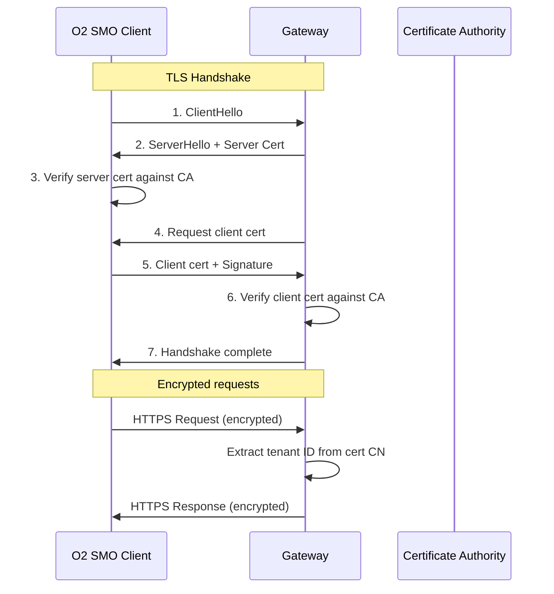
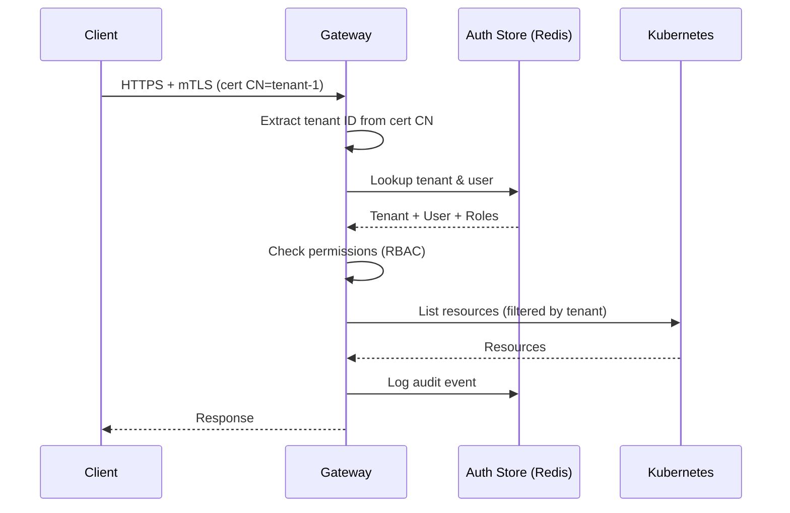

# Security Configuration

TLS, mTLS, authentication, secrets management, CORS, and rate limiting configuration.

## Table of Contents

- [TLS Configuration](#tls-configuration)
- [mTLS (Mutual TLS)](#mtls-mutual-tls)
- [Secrets Management](#secrets-management)
- [CORS Configuration](#cors-configuration)
- [Rate Limiting](#rate-limiting)
- [Multi-Tenancy Security](#multi-tenancy-security)
- [Certificate Management](#certificate-management)
- [Best Practices](#best-practices)

## TLS Configuration

Transport Layer Security (TLS) encrypts all HTTP traffic between clients and the gateway.

### Basic TLS Configuration

```yaml
tls:
  enabled: true
  cert_file: /etc/certs/tls.crt
  key_file: /etc/certs/tls.key
  ca_file: /etc/certs/ca.crt
  client_auth: none              # TLS without client certificates
  min_version: "1.3"
  cipher_suites: []              # Empty = Go defaults (recommended)
```

### Field Reference

| Field | Type | Default | Description |
|-------|------|---------|-------------|
| `enabled` | bool | `false` | Enable TLS/HTTPS. **Required in production** |
| `cert_file` | string | `""` | Path to server certificate (PEM format) |
| `key_file` | string | `""` | Path to server private key (PEM format) |
| `ca_file` | string | `""` | Path to CA certificate for client verification |
| `client_auth` | string | `"none"` | Client authentication mode (see below) |
| `min_version` | string | `"1.3"` | Minimum TLS version: `1.2` or `1.3` |
| `cipher_suites` | []string | `[]` | TLS cipher suites (empty = Go defaults) |

### Client Authentication Modes

| Mode | Description | Use Case |
|------|-------------|----------|
| `none` | No client certificates required | TLS encryption only |
| `request` | Request client cert (optional) | Soft mTLS (fallback to other auth) |
| `require` | Require client cert (not verified) | Testing mTLS without CA |
| `verify` | Verify client cert if provided | Optional verified mTLS |
| `require-and-verify` | Require + verify client cert | **Production mTLS (recommended)** |

### Environment Overrides

```bash
export NETWEAVE_TLS_ENABLED=true
export NETWEAVE_TLS_CERT_FILE=/etc/certs/tls.crt
export NETWEAVE_TLS_KEY_FILE=/etc/certs/tls.key
export NETWEAVE_TLS_CA_FILE=/etc/certs/ca.crt
export NETWEAVE_TLS_CLIENT_AUTH=require-and-verify
export NETWEAVE_TLS_MIN_VERSION=1.3
```

### Examples

**TLS Only (no client certs):**
```yaml
tls:
  enabled: true
  cert_file: /etc/certs/server.crt
  key_file: /etc/certs/server.key
  client_auth: none
  min_version: "1.3"
```

**Strict mTLS (production):**
```yaml
tls:
  enabled: true
  cert_file: /etc/certs/server.crt
  key_file: /etc/certs/server.key
  ca_file: /etc/certs/ca.crt
  client_auth: require-and-verify
  min_version: "1.3"
```

## mTLS (Mutual TLS)

Mutual TLS requires both server and client to present valid certificates for two-way authentication.

### mTLS Architecture



### Configuration

```yaml
tls:
  enabled: true
  cert_file: /etc/certs/tls.crt         # Gateway server certificate
  key_file: /etc/certs/tls.key          # Gateway private key
  ca_file: /etc/certs/ca.crt            # CA to verify client certs
  client_auth: require-and-verify       # Strict mTLS
  min_version: "1.3"                    # TLS 1.3 for modern crypto
```

### Client Certificate Requirements

**Certificate Subject:**
- **Common Name (CN)**: Tenant ID (e.g., `smo-tenant-1`)
- **Organization (O)**: Organization name
- **Organizational Unit (OU)**: Optional department/team

**Example client certificate:**
```
Subject: CN=smo-tenant-1, O=Example SMO, OU=Operations
Issuer: CN=O2-IMS CA, O=Example Org
Validity: 2026-01-01 to 2027-01-01
```

The gateway extracts the tenant ID from the certificate's CN field for multi-tenancy.

### Generating Test Certificates

```bash
# 1. Create CA
openssl req -x509 -new -nodes \
  -keyout ca.key -out ca.crt \
  -days 365 \
  -subj "/CN=O2-IMS-CA/O=Example Org"

# 2. Create server certificate
openssl req -new -nodes \
  -keyout server.key -out server.csr \
  -subj "/CN=o2ims-gateway.example.com/O=Example Org"

openssl x509 -req -in server.csr \
  -CA ca.crt -CAkey ca.key -CAcreateserial \
  -out server.crt -days 365

# 3. Create client certificate (for SMO tenant)
openssl req -new -nodes \
  -keyout client.key -out client.csr \
  -subj "/CN=smo-tenant-1/O=Example SMO"

openssl x509 -req -in client.csr \
  -CA ca.crt -CAkey ca.key -CAcreateserial \
  -out client.crt -days 365
```

### Testing mTLS

```bash
# Test with curl (valid client cert)
curl --cacert ca.crt \
  --cert client.crt \
  --key client.key \
  https://o2ims-gateway.example.com:8443/o2ims/v1/resourcePools

# Test without client cert (should fail)
curl --cacert ca.crt \
  https://o2ims-gateway.example.com:8443/o2ims/v1/resourcePools
# Error: SSL certificate problem: unable to get local issuer certificate
```

## Secrets Management

**CRITICAL**: Never hardcode secrets in configuration files.

### Recommended Approaches

#### 1. Environment Variables (Kubernetes)

**Best for**: Kubernetes/Docker deployments

```yaml
# config.yaml
redis:
  password_env_var: REDIS_PASSWORD
  sentinel_password_env_var: SENTINEL_PASSWORD
```

**Kubernetes Secret:**
```bash
# Create secret
kubectl create secret generic netweave-secrets \
  --from-literal=redis-password='your-redis-password' \
  --from-literal=sentinel-password='your-sentinel-password' \
  --namespace=o2ims-system

# Reference in pod spec
apiVersion: v1
kind: Pod
spec:
  containers:
  - name: gateway
    env:
    - name: REDIS_PASSWORD
      valueFrom:
        secretKeyRef:
          name: netweave-secrets
          key: redis-password
    - name: SENTINEL_PASSWORD
      valueFrom:
        secretKeyRef:
          name: netweave-secrets
          key: sentinel-password
```

#### 2. Secret Files

**Best for**: File-based secret management (Docker secrets, mounted volumes)

```yaml
# config.yaml
redis:
  password_file: /run/secrets/redis-password
  sentinel_password_file: /run/secrets/sentinel-password
```

**Kubernetes - Mount secrets as files:**
```yaml
apiVersion: v1
kind: Pod
spec:
  containers:
  - name: gateway
    volumeMounts:
    - name: redis-secret
      mountPath: /run/secrets
      readOnly: true
  volumes:
  - name: redis-secret
    secret:
      secretName: netweave-secrets
      items:
      - key: redis-password
        path: redis-password
      - key: sentinel-password
        path: sentinel-password
```

#### 3. DEPRECATED: Direct Password

**❌ INSECURE - DO NOT USE IN PRODUCTION**

```yaml
# ❌ BAD: Hardcoded password in config
redis:
  password: "hardcoded-password"  # NEVER DO THIS
```

This will trigger a deprecation warning:
```
WARN: Using 'password' field is deprecated and insecure. Use 'password_env_var' or 'password_file' instead.
```

### Secret Redaction

The gateway automatically redacts secrets from:
- Log messages
- Error messages
- Metrics labels
- Tracing spans

Example:
```json
{
  "level": "error",
  "msg": "Redis connection failed",
  "addr": "redis.example.com:6379",
  "password": "[REDACTED]"
}
```

## CORS Configuration

Cross-Origin Resource Sharing (CORS) allows web browsers to access the API from different domains.

### Configuration

```yaml
security:
  enable_cors: false              # Disabled in production
  allowed_origins:
    - https://smo.example.com
    - https://dashboard.example.com
  allowed_methods:
    - GET
    - POST
    - PUT
    - PATCH
    - DELETE
  allowed_headers:
    - Content-Type
    - Authorization
    - X-Request-ID
  exposed_headers:
    - X-Request-ID
  allow_credentials: true
  max_age: 3600
```

### Field Reference

| Field | Type | Default | Description |
|-------|------|---------|-------------|
| `enable_cors` | bool | `false` | Enable CORS. **Disable in production** |
| `allowed_origins` | []string | `["*"]` | Allowed origin domains. Use specific domains, not `*` |
| `allowed_methods` | []string | `[...]` | Allowed HTTP methods |
| `allowed_headers` | []string | `[...]` | Allowed request headers |
| `exposed_headers` | []string | `[]` | Headers exposed to browser |
| `allow_credentials` | bool | `false` | Allow credentials (cookies, auth headers) |
| `max_age` | int | `3600` | Preflight cache duration (seconds) |

### Environment Overrides

```bash
export NETWEAVE_SECURITY_ENABLE_CORS=true
export NETWEAVE_SECURITY_ALLOWED_ORIGINS="https://smo.example.com,https://dashboard.example.com"
```

### Examples

**Development (permissive):**
```yaml
security:
  enable_cors: true
  allowed_origins:
    - http://localhost:3000
    - http://localhost:8080
  allowed_methods:
    - GET
    - POST
    - PUT
    - DELETE
  allow_credentials: true
```

**Production (restricted):**
```yaml
security:
  enable_cors: false  # Disabled entirely
```

**Production (if CORS required):**
```yaml
security:
  enable_cors: true
  allowed_origins:
    - https://smo.production.example.com  # Specific domain only
  allowed_methods:
    - GET
    - POST
  allow_credentials: false
```

## Rate Limiting

Protects the gateway from abuse and denial-of-service attacks.

### Configuration

```yaml
security:
  rate_limit_enabled: true
  rate_limit:
    # Per-tenant rate limits
    tenant:
      requests_per_second: 100
      burst_size: 200

    # Global rate limits
    global:
      requests_per_second: 1000
      max_concurrent_requests: 500

    # Per-endpoint rate limits
    endpoints:
      - path: /o2ims/v1/subscriptions
        method: POST
        requests_per_second: 10
        burst_size: 20
      - path: /o2ims/v1/subscriptions
        method: DELETE
        requests_per_second: 10
        burst_size: 20
```

### Rate Limit Types

#### 1. Tenant Rate Limits

Applies per tenant (extracted from mTLS certificate CN).

```yaml
tenant:
  requests_per_second: 100  # Sustained rate
  burst_size: 200           # Allow bursts up to this
```

**Example**: Tenant `smo-tenant-1` can make:
- 100 requests/second sustained
- Up to 200 requests in a burst

#### 2. Global Rate Limits

Applies to all requests combined.

```yaml
global:
  requests_per_second: 1000          # Total gateway capacity
  max_concurrent_requests: 500       # Max in-flight requests
```

#### 3. Endpoint-Specific Rate Limits

Applies to specific API endpoints (e.g., resource-intensive operations).

```yaml
endpoints:
  - path: /o2ims/v1/subscriptions
    method: POST
    requests_per_second: 10
    burst_size: 20
```

### Rate Limit Responses

When rate limit is exceeded:

```http
HTTP/1.1 429 Too Many Requests
Content-Type: application/json
Retry-After: 5

{
  "error": "rate limit exceeded",
  "retry_after": 5
}
```

### Environment Overrides

```bash
export NETWEAVE_SECURITY_RATE_LIMIT_ENABLED=true
export NETWEAVE_SECURITY_RATE_LIMIT_TENANT_REQUESTS_PER_SECOND=100
export NETWEAVE_SECURITY_RATE_LIMIT_TENANT_BURST_SIZE=200
```

### Examples

**Development (disabled):**
```yaml
security:
  rate_limit_enabled: false
```

**Staging (moderate):**
```yaml
security:
  rate_limit_enabled: true
  rate_limit:
    tenant:
      requests_per_second: 50
      burst_size: 100
    global:
      requests_per_second: 500
```

**Production (strict):**
```yaml
security:
  rate_limit_enabled: true
  rate_limit:
    tenant:
      requests_per_second: 100
      burst_size: 200
    global:
      requests_per_second: 1000
      max_concurrent_requests: 500
    endpoints:
      - path: /o2ims/v1/subscriptions
        method: POST
        requests_per_second: 10
        burst_size: 20
```

## Multi-Tenancy Security

When multi-tenancy is enabled, the gateway enforces tenant isolation and RBAC.

### Configuration

```yaml
multi_tenancy:
  enabled: true
  require_mtls: true                   # Extract tenant from client cert
  initialize_default_roles: true       # Create system roles on startup
  audit_log_retention_days: 90
  skip_auth_paths:
    - /health
    - /healthz
    - /metrics
  default_tenant_quota:
    max_subscriptions: 100
    max_resource_pools: 50
    max_deployments: 200
    max_users: 20
    max_requests_per_minute: 1000
```

### Authentication Flow



### Default Roles

When `initialize_default_roles: true`, these roles are created:

| Role | Permissions | Use Case |
|------|-------------|----------|
| `platform-admin` | All operations, all tenants | Platform operators |
| `tenant-admin` | All operations within tenant | Tenant administrators |
| `operator` | Read/write resources, read-only config | Day-to-day operations |
| `viewer` | Read-only access | Monitoring, dashboards |

### Skip Auth Paths

Paths that bypass authentication (for health checks, metrics):

```yaml
skip_auth_paths:
  - /health          # Liveness probe
  - /healthz         # Kubernetes health
  - /ready           # Readiness probe
  - /metrics         # Prometheus scraping
  - /swagger         # API documentation (optional)
```

**Pattern Matching:**
- Exact match: `/health`
- Prefix match: `/api/` (matches `/api/foo`, `/api/bar/baz`)

### Tenant Quotas

Limit resource usage per tenant:

```yaml
default_tenant_quota:
  max_subscriptions: 100         # Max webhook subscriptions
  max_resource_pools: 50         # Max resource pools
  max_deployments: 200           # Max deployments (O2-DMS)
  max_users: 20                  # Max users in tenant
  max_requests_per_minute: 1000  # Rate limit
```

### Audit Logging

All authenticated actions are logged for compliance:

**Logged Events:**
- User authentication
- Resource access (read/write)
- Configuration changes
- Permission denials

**Audit Log Entry:**
```json
{
  "timestamp": "2026-01-12T10:30:45Z",
  "tenant_id": "smo-tenant-1",
  "user_id": "user-123",
  "action": "resource.list",
  "resource_type": "resource_pool",
  "result": "success",
  "ip_address": "10.0.1.50"
}
```

**Retention:**
```yaml
audit_log_retention_days: 90  # Keep logs for 90 days
```

## Certificate Management

### Certificate Locations

**Kubernetes (recommended):**
```yaml
# Server certificates
/etc/certs/tls.crt   # Mounted from Secret
/etc/certs/tls.key   # Mounted from Secret
/etc/certs/ca.crt    # Mounted from ConfigMap or Secret
```

**Docker:**
```yaml
# Mount certificates as volumes
docker run -v /host/certs:/etc/certs:ro netweave-gateway
```

### Creating Kubernetes TLS Secrets

```bash
# Server certificate
kubectl create secret tls gateway-tls \
  --cert=server.crt \
  --key=server.key \
  --namespace=o2ims-system

# CA certificate (for client verification)
kubectl create configmap gateway-ca \
  --from-file=ca.crt=ca.crt \
  --namespace=o2ims-system
```

### Mounting in Deployment

```yaml
apiVersion: apps/v1
kind: Deployment
spec:
  template:
    spec:
      containers:
      - name: gateway
        volumeMounts:
        - name: tls-certs
          mountPath: /etc/certs
          readOnly: true
      volumes:
      - name: tls-certs
        projected:
          sources:
          - secret:
              name: gateway-tls
              items:
              - key: tls.crt
                path: tls.crt
              - key: tls.key
                path: tls.key
          - configMap:
              name: gateway-ca
              items:
              - key: ca.crt
                path: ca.crt
```

### Certificate Rotation

**Automated with cert-manager:**
```yaml
apiVersion: cert-manager.io/v1
kind: Certificate
metadata:
  name: gateway-tls
spec:
  secretName: gateway-tls
  issuerRef:
    name: letsencrypt-prod
    kind: ClusterIssuer
  dnsNames:
  - o2ims-gateway.example.com
  renewBefore: 720h  # Renew 30 days before expiry
```

**Manual rotation:**
```bash
# 1. Generate new certificate
openssl req -new -key server.key -out server.csr

# 2. Sign with CA
openssl x509 -req -in server.csr -CA ca.crt -CAkey ca.key -out server-new.crt

# 3. Update Kubernetes secret
kubectl create secret tls gateway-tls \
  --cert=server-new.crt \
  --key=server.key \
  --dry-run=client -o yaml | kubectl apply -f -

# 4. Restart gateway pods
kubectl rollout restart deployment/gateway -n o2ims-system
```

## Best Practices

### TLS/mTLS

1. **Always enable TLS in production** - Non-negotiable
2. **Use TLS 1.3** - Modern, secure, performant
3. **Use require-and-verify for mTLS** - Strongest client authentication
4. **Rotate certificates regularly** - Every 90 days or less
5. **Monitor certificate expiry** - Alert 30 days before expiry
6. **Use cert-manager** - Automate certificate lifecycle

### Secrets

1. **Never commit secrets** - Use `.gitignore` for secret files
2. **Use environment variables** - Preferred for Kubernetes
3. **Use secret files** - For file-based secret management
4. **Rotate credentials** - Change passwords quarterly
5. **Audit secret access** - Monitor who accesses secrets
6. **Encrypt at rest** - Enable etcd encryption in Kubernetes

### CORS

1. **Disable in production** - Unless absolutely required
2. **Specify exact origins** - Never use `*` wildcard
3. **Minimize allowed methods** - Only what's needed
4. **Don't allow credentials** - Unless required for auth
5. **Review regularly** - Audit CORS config quarterly

### Rate Limiting

1. **Always enable in production** - Critical DoS protection
2. **Set conservative limits** - Can increase based on monitoring
3. **Use tenant-specific limits** - Prevent noisy neighbor issues
4. **Monitor rate limit hits** - Track who's hitting limits
5. **Adjust based on capacity** - Load test to find optimal limits

### Multi-Tenancy

1. **Enable audit logging** - Required for compliance
2. **Set appropriate quotas** - Prevent resource exhaustion
3. **Review permissions regularly** - Audit role assignments
4. **Monitor cross-tenant access** - Alert on unauthorized attempts
5. **Test isolation** - Verify tenant data segregation

## Troubleshooting

### TLS certificate errors

```bash
# Verify certificate
openssl x509 -in /etc/certs/tls.crt -text -noout

# Check certificate-key pair match
openssl x509 -noout -modulus -in server.crt | openssl md5
openssl rsa -noout -modulus -in server.key | openssl md5
# MD5 hashes should match

# Test TLS connection
openssl s_client -connect gateway.example.com:8443 -CAfile ca.crt
```

### mTLS authentication failing

```bash
# Verify client certificate
openssl x509 -in client.crt -text -noout | grep "CN="

# Test mTLS connection
curl -v --cacert ca.crt --cert client.crt --key client.key \
  https://gateway.example.com:8443/health
```

### Redis password not working

```bash
# Check environment variable is set
env | grep REDIS_PASSWORD

# Check file exists and is readable
ls -la /run/secrets/redis-password
cat /run/secrets/redis-password

# Test Redis connection manually
redis-cli -h redis.example.com -p 6379 -a "$REDIS_PASSWORD" PING
```

### Rate limit too aggressive

```bash
# Check current limits in logs
kubectl logs deployment/gateway -n o2ims-system | grep "rate limit"

# Temporarily disable for testing
export NETWEAVE_SECURITY_RATE_LIMIT_ENABLED=false

# Adjust limits via environment
export NETWEAVE_SECURITY_RATE_LIMIT_TENANT_REQUESTS_PER_SECOND=200
```

## See Also

- [Configuration Basics](basics.md)
- [Environment Configuration](environments.md)
- [Complete Reference](reference.md)
- [TLS Best Practices](https://wiki.mozilla.org/Security/Server_Side_TLS)
