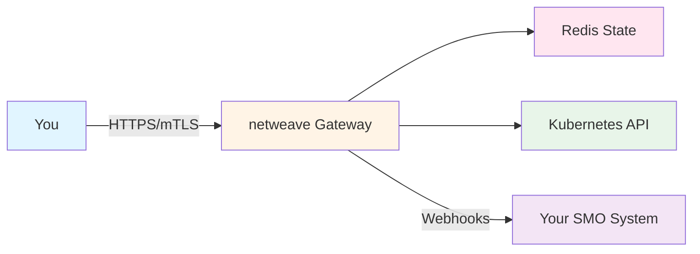

# Getting Started with netweave

Welcome to netweave! This guide will help you get up and running quickly.

## Overview

netweave is a production-grade O-RAN O2 Gateway that implements:

- **O2-IMS** - Infrastructure Management Services
- **O2-DMS** - Deployment Management Services
- **O2-SMO** - Service Management & Orchestration integration

## Quick Links

- **[Quickstart Guide](quickstart.md)** - Get running in 5 minutes
- **[Installation Guide](installation.md)** - Detailed setup instructions
- **[First Steps](first-steps.md)** - Your first API calls and basic concepts

## Learning Path

### 1. Quickstart (5 minutes)

Start here if you want to see netweave in action immediately:

- [**Quickstart Guide →**](quickstart.md)
  - Deploy with Docker Compose
  - Make your first API call
  - See webhook notifications

### 2. Installation (30 minutes)

Choose your installation method:

- [**Installation Guide →**](installation.md)
  - Kubernetes with Helm
  - Kubernetes with Operator
  - Docker Compose for development
  - Local development setup

### 3. First Steps (1 hour)

Learn the fundamentals:

- [**First Steps Guide →**](first-steps.md)
  - O2-IMS concepts
  - Create resource pools
  - Query resources
  - Set up subscriptions
  - Understand webhooks

## Prerequisites

Before you begin, ensure you have:

### For Quickstart

- Docker and Docker Compose installed
- `curl` or similar HTTP client
- 5 minutes of your time

### For Production Installation

- Kubernetes 1.30+ cluster
- kubectl configured
- Helm 3.x installed
- Access to a Redis instance (or will install via Helm)

### For Development

- Go 1.25.0+ installed
- Docker for container builds
- make for build automation
- Access to a Kubernetes cluster (kind, minikube, or cloud)

## What's Next?

After completing the getting started guides:

### For Operators

- [Deployment Strategies](../operations/deployment.md) - Production deployment
- [Monitoring Setup](../operations/monitoring.md) - Observability
- [Security Hardening](../security/hardening.md) - Production checklist

### For Developers

- [API Reference](../api/README.md) - Complete API documentation
- [Architecture](../architecture/README.md) - System design
- [Development Guide](../development/README.md) - Contributing

### For Architects

- [Architecture Overview](../architecture/system-overview.md) - High-level design
- [Multi-Tenancy](../architecture/multi-tenancy.md) - Enterprise isolation
- [High Availability](../architecture/high-availability.md) - HA & DR

## Need Help?

- **Troubleshooting:** [Common Issues](../operations/troubleshooting.md)
- **API Reference:** [Complete API Docs](../api/README.md)
- **Community:** [GitHub Discussions](https://github.com/piwi3910/netweave/discussions)
- **Issues:** [Report Bug](https://github.com/piwi3910/netweave/issues)

## Quick Reference

### Common Commands

```bash
# Deploy with Helm
helm install netweave ./helm/netweave

# Check status
kubectl get pods -n o2ims-system

# View logs
kubectl logs -n o2ims-system -l app=netweave

# Port forward for local access
kubectl port-forward -n o2ims-system svc/netweave 8000:8000
```

### First API Call

```bash
# List resource pools
curl -X GET http://localhost:8000/o2ims-infrastructureInventory/v1/resourcePools
```

### Environment Variables

```bash
# Development
export NETWEAVE_ENV=dev

# Production
export NETWEAVE_ENV=prod
export NETWEAVE_REDIS_PASSWORD=<password>
export NETWEAVE_TLS_ENABLED=true
```

## Architecture at a Glance



---

**Ready to start?** → [Begin with the Quickstart Guide](quickstart.md)
