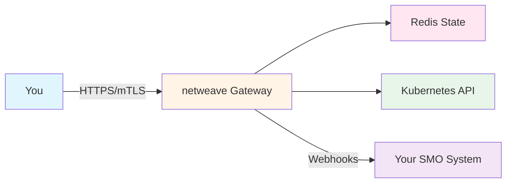

# Getting Started with netweave

Welcome to netweave! This guide will help you get up and running quickly.

## Overview

netweave is a production-grade O-RAN O2 Gateway that implements:

- **O2-IMS** - Infrastructure Management Services
- **O2-DMS** - Deployment Management Services
- **O2-SMO** - Service Management & Orchestration integration

## Quick Links

- **[Quickstart Guide](quickstart.md)** - Get running in 5 minutes
- **[Installation Guide](installation.md)** - Detailed setup instructions
- **[First Steps](first-steps.md)** - Your first API calls and basic concepts

## Learning Path

### 1. Quickstart (5 minutes)

Start here if you want to see netweave in action immediately:

- [**Quickstart Guide →**](quickstart.md)
  - Deploy to Kubernetes with `netweave-cli setup all`
  - Make your first O2-IMS API call with mTLS
  - Explore the admin portal

### 2. Installation (30 minutes)

Choose your installation method:

- [**Installation Guide →**](installation.md)
  - Automated setup with `netweave-cli` (recommended)
  - Manual Kubernetes deployment
  - Production deployment with Helm
  - Multi-cluster deployment

### 3. First Steps (1 hour)

Learn the fundamentals:

- [**First Steps Guide →**](first-steps.md)
  - O2-IMS concepts
  - Create resource pools
  - Query resources
  - Set up subscriptions
  - Understand webhooks

## Prerequisites

Before you begin, ensure you have:

### For Quickstart

- Kubernetes cluster (Docker Desktop, Kind, or minikube)
- kubectl, Helm, and Go 1.25.7+ installed
- NGINX Ingress Controller
- 5 minutes of your time

### For Production Installation

- Kubernetes 1.30+ cluster
- kubectl configured
- Helm 3.x installed
- `netweave-cli` installed (recommended)
- Access to a Redis instance (or will install via Helm)

### For Development

- Go 1.25.7+ installed
- Docker for container builds
- make for build automation
- Access to a Kubernetes cluster (kind, minikube, or cloud)

## What's Next?

After completing the getting started guides:

### For Operators

- [Deployment Strategies](../operations/deployment.md) - Production deployment
- [Monitoring Setup](../operations/monitoring.md) - Observability
- [Security Hardening](../security/hardening.md) - Production checklist

### For Developers

- [API Reference](../api/README.md) - Complete API documentation
- [Architecture](../architecture/README.md) - System design
- [Development Guide](../development/README.md) - Contributing

### For Architects

- [Architecture Overview](../architecture/system-overview.md) - High-level design
- [Multi-Tenancy](../architecture/multi-tenancy.md) - Enterprise isolation
- [High Availability](../architecture/high-availability.md) - HA & DR

## Need Help?

- **Troubleshooting:** [Common Issues](../operations/troubleshooting.md)
- **API Reference:** [Complete API Docs](../api/README.md)
- **Community:** [GitHub Discussions](https://github.com/piwi3910/netweave/discussions)
- **Issues:** [Report Bug](https://github.com/piwi3910/netweave/issues)

## Quick Reference

### Common Commands

Using `netweave-cli` (recommended):

```bash
# Full setup: Vault, Helm, Keycloak, certificates
netweave-cli setup all

# Check gateway health
netweave-cli api health

# List resource pools
netweave-cli api resource-pools list

# List resources
netweave-cli api resources list

# Manage users, roles, and tenants
netweave-cli users list --tenant=default
netweave-cli roles list
netweave-cli tenants list

# Teardown everything
netweave-cli setup teardown
```

<details>
<summary>Manual commands (without CLI)</summary>

```bash
# Deploy with Helm (local development)
helm install netweave deployments/helm/netweave -f deployments/helm/netweave/values-local.yaml -n netweave --create-namespace

# Check status
kubectl get pods -n netweave

# View logs
kubectl logs -n netweave -l app.kubernetes.io/component=gateway

# Access via NGINX Ingress (recommended, see Installation Guide)
# Requires /etc/hosts: 127.0.0.1 admin.netweave.local api.netweave.local auth.netweave.local o2.netweave.local tmf.netweave.local graphql.netweave.local
# O2-IMS API uses mTLS authentication on o2.netweave.local
curl --cert ~/.netweave/client.crt --key ~/.netweave/client.key \
  --cacert ~/.netweave/ca.crt \
  https://o2.netweave.local/o2ims-infrastructureInventory/v1/resourceTypes
```

</details>

### Environment Variables

```bash
# Development
export NETWEAVE_ENV=dev

# Production
export NETWEAVE_ENV=prod
export NETWEAVE_REDIS_PASSWORD=<password>
export NETWEAVE_TLS_ENABLED=true
```

## Architecture at a Glance


```mermaid
graph LR
    You[You] -->|HTTPS/mTLS| GW[netweave Gateway]
    GW --> Redis[Redis State]
    GW --> K8s[Kubernetes API]
    GW -->|Webhooks| SMO[Your SMO System]

    style You fill:#e1f5ff
    style GW fill:#fff4e6
    style Redis fill:#ffe6f0
    style K8s fill:#e8f5e9
    style SMO fill:#f3e5f5
```

---

**Ready to start?** → [Begin with the Quickstart Guide](quickstart.md)
