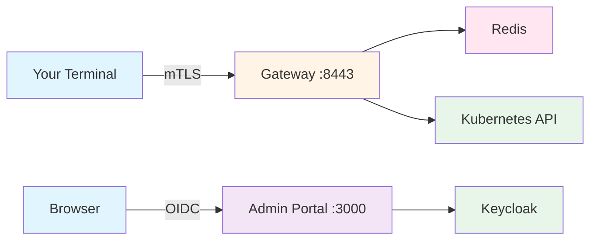
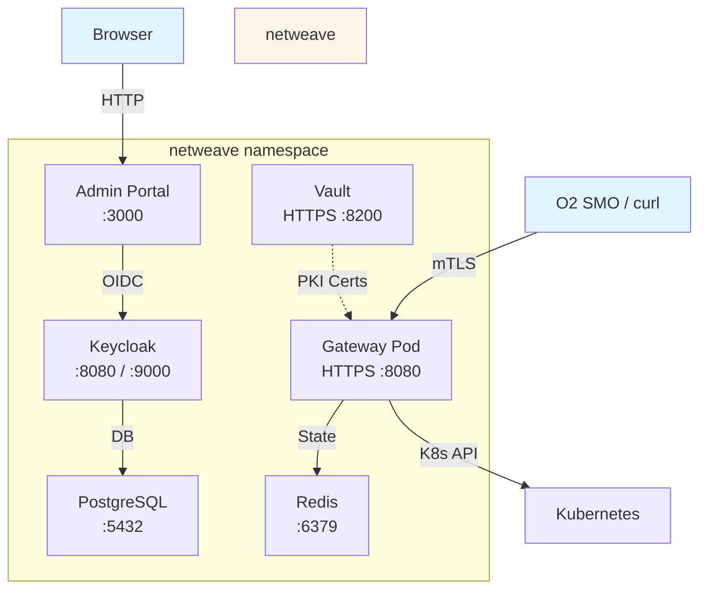

# Getting Started with Netweave

Deploy netweave on Docker Desktop Kubernetes and make your first mTLS-authenticated API calls.

**Time:** ~30 minutes | **Auth:** mTLS only (O-RAN O2-IMS compliant) | **Platform:** Docker Desktop with Kubernetes

## What You'll Get

By the end of this guide you will have:

- Netweave gateway running with TLS and mTLS client verification
- Vault PKI issuing mTLS certificates
- Keycloak managing tenants and users (admin portal auth)
- Admin portal accessible in your browser
- Working O2-IMS API calls authenticated with client certificates


```mermaid
graph LR
    You[Your Terminal] -->|mTLS| GW[Gateway :8443]
    Browser[Browser] -->|OIDC| AP[Admin Portal :3000]
    GW --> Redis[Redis]
    GW --> K8s[Kubernetes API]
    AP --> KC[Keycloak]

    style You fill:#e1f5ff
    style Browser fill:#e1f5ff
    style GW fill:#fff4e6
    style AP fill:#f3e5f5
    style Redis fill:#ffe6f0
    style K8s fill:#e8f5e9
    style KC fill:#e8f5e9
```

## Prerequisites

| Tool | Version | Check |
|------|---------|-------|
| Docker Desktop | With Kubernetes enabled | `kubectl get nodes` |
| Helm | 3.12+ | `helm version --short` |
| kubectl | 1.30+ | `kubectl version --client` |
| Go | 1.25+ | `go version` |
| Node.js | 22+ | `node --version` |
| jq | any | `jq --version` |
| openssl | any | `openssl version` |

**Enable Kubernetes in Docker Desktop:** Settings → Kubernetes → Enable Kubernetes → Apply & Restart.

Verify your cluster is running:

```bash
kubectl get nodes
# NAME             STATUS   ROLES           AGE   VERSION
# docker-desktop   Ready    control-plane   ...   v1.3x.x
```

## Step 1: Clone and Build Images

```bash
git clone https://github.com/piwi3910/netweave.git
cd netweave
```

Build the gateway and admin portal images:

```bash
# Build gateway image
docker build -t netweave-gateway:local .

# Build admin portal image
docker build -t netweave-admin-portal:local ./web/admin-portal/
```

Verify both images exist:

```bash
docker images | grep -E "netweave-gateway|netweave-admin-portal"
# netweave-gateway        local   ...
# netweave-admin-portal   local   ...
```

> **Note:** Docker Desktop Kubernetes runs on the same Docker daemon, so locally built images are automatically available to the cluster (no need to push or load images).

## Step 2: Deploy Vault with TLS

Vault provides the PKI infrastructure for mTLS certificates. We deploy it in the `netweave` namespace alongside all other components.

### 2.1: Create the Namespace

```bash
kubectl create namespace netweave
```

### 2.2: Generate Vault TLS Certificates

Create a self-signed CA and server certificate for Vault itself:

```bash
# Create a temporary working directory
mkdir -p /tmp/vault-tls && cd /tmp/vault-tls

# Generate CA private key and certificate
openssl genrsa -out ca.key 4096
openssl req -x509 -new -nodes -key ca.key -sha256 -days 3650 \
  -out ca.crt -subj "/CN=Vault CA/O=Netweave"

# Generate Vault server private key
openssl genrsa -out vault.key 4096

# Create server certificate signing request with SANs
openssl req -new -key vault.key -out vault.csr -subj "/CN=vault" \
  -addext "subjectAltName=DNS:vault,DNS:vault.netweave,DNS:vault.netweave.svc,DNS:vault.netweave.svc.cluster.local,IP:127.0.0.1"

# Sign the server certificate with our CA
openssl x509 -req -in vault.csr -CA ca.crt -CAkey ca.key -CAcreateserial \
  -out vault.crt -days 3650 -sha256 \
  -extfile <(printf "subjectAltName=DNS:vault,DNS:vault.netweave,DNS:vault.netweave.svc,DNS:vault.netweave.svc.cluster.local,IP:127.0.0.1")
```

### 2.3: Create Kubernetes Secrets for Vault TLS

```bash
# TLS secret for Vault server
kubectl create secret tls vault-tls \
  --cert=/tmp/vault-tls/vault.crt \
  --key=/tmp/vault-tls/vault.key \
  -n netweave

# CA certificate as a ConfigMap (for clients to trust Vault)
kubectl create configmap vault-ca \
  --from-file=ca.crt=/tmp/vault-tls/ca.crt \
  -n netweave
```

### 2.4: Deploy Vault

```bash
kubectl apply -f - <<'EOF'
apiVersion: v1
kind: ServiceAccount
metadata:
  name: vault
  namespace: netweave
---
apiVersion: v1
kind: ConfigMap
metadata:
  name: vault-config
  namespace: netweave
data:
  vault.hcl: |
    ui = true
    disable_mlock = true

    listener "tcp" {
      address       = "0.0.0.0:8200"
      tls_cert_file = "/vault/tls/tls.crt"
      tls_key_file  = "/vault/tls/tls.key"
    }

    storage "file" {
      path = "/vault/data"
    }

    api_addr = "https://vault.netweave.svc.cluster.local:8200"
---
apiVersion: apps/v1
kind: Deployment
metadata:
  name: vault
  namespace: netweave
  labels:
    app.kubernetes.io/name: vault
spec:
  replicas: 1
  selector:
    matchLabels:
      app.kubernetes.io/name: vault
  template:
    metadata:
      labels:
        app.kubernetes.io/name: vault
    spec:
      serviceAccountName: vault
      containers:
        - name: vault
          image: hashicorp/vault:1.15.4
          command: ["vault", "server", "-config=/vault/config/vault.hcl"]
          ports:
            - name: https
              containerPort: 8200
          env:
            - name: VAULT_ADDR
              value: "https://127.0.0.1:8200"
            - name: VAULT_CACERT
              value: "/vault/ca/ca.crt"
          volumeMounts:
            - name: vault-tls
              mountPath: /vault/tls
              readOnly: true
            - name: vault-ca
              mountPath: /vault/ca
              readOnly: true
            - name: vault-config
              mountPath: /vault/config
              readOnly: true
            - name: vault-data
              mountPath: /vault/data
          readinessProbe:
            exec:
              command:
                - sh
                - -c
                - "vault status -tls-skip-verify 2>&1 | grep -E 'Sealed.*false'"
            initialDelaySeconds: 10
            periodSeconds: 5
          livenessProbe:
            exec:
              command:
                - sh
                - -c
                - "vault status -tls-skip-verify 2>&1 | grep -qv 'connection refused'"
            initialDelaySeconds: 15
            periodSeconds: 10
          securityContext:
            capabilities:
              add:
                - IPC_LOCK
          resources:
            requests:
              cpu: 100m
              memory: 128Mi
            limits:
              cpu: 500m
              memory: 256Mi
      volumes:
        - name: vault-tls
          secret:
            secretName: vault-tls
        - name: vault-ca
          configMap:
            name: vault-ca
        - name: vault-config
          configMap:
            name: vault-config
        - name: vault-data
          emptyDir: {}
---
apiVersion: v1
kind: Service
metadata:
  name: vault
  namespace: netweave
  labels:
    app.kubernetes.io/name: vault
spec:
  type: ClusterIP
  ports:
    - port: 8200
      targetPort: 8200
      protocol: TCP
      name: https
  selector:
    app.kubernetes.io/name: vault
EOF
```

Wait for the Vault pod to start running (it will **not** pass readiness probes yet — it needs to be initialized and unsealed first):

```bash
echo "Waiting for Vault pod to start..."
kubectl wait --for=condition=ready=false pod -l app.kubernetes.io/name=vault \
  -n netweave --timeout=120s 2>/dev/null
sleep 10

# Verify the pod is running (even if not ready)
kubectl get pod -l app.kubernetes.io/name=vault -n netweave
# STATUS should be "Running" with READY "0/1"
```

### 2.5: Initialize and Unseal Vault

We use `kubectl exec` to run Vault commands inside the container and the Vault HTTP API for operations that need JSON parsing:

```bash
# Initialize Vault (single key share for dev simplicity)
kubectl exec -n netweave deploy/vault -- \
  vault operator init -key-shares=1 -key-threshold=1 -format=json \
  > /tmp/vault-init.json

# Extract unseal key and root token
VAULT_UNSEAL_KEY=$(jq -r '.unseal_keys_b64[0]' /tmp/vault-init.json)
VAULT_ROOT_TOKEN=$(jq -r '.root_token' /tmp/vault-init.json)

echo "Unseal Key: $VAULT_UNSEAL_KEY"
echo "Root Token: $VAULT_ROOT_TOKEN"
```

> **Important:** Save these values! You will need the root token for PKI setup and the unseal key if Vault restarts.

Unseal Vault and verify:

```bash
# Unseal
kubectl exec -n netweave deploy/vault -- vault operator unseal "$VAULT_UNSEAL_KEY"

# Verify - should show "Sealed: false"
kubectl exec -n netweave deploy/vault -- vault status

# Wait for the pod to become ready now that it's unsealed
kubectl wait --for=condition=ready pod -l app.kubernetes.io/name=vault \
  -n netweave --timeout=60s
```

### 2.6: Set Up PKI Engine for mTLS Certificates

Port-forward to Vault so we can use the HTTP API with `jq` for JSON parsing:

```bash
kubectl port-forward -n netweave svc/vault 8200:8200 &
VAULT_PF_PID=$!
sleep 3

# Vault API base URL and auth header
VAULT_API="https://127.0.0.1:8200/v1"
VAULT_CA="/tmp/vault-tls/ca.crt"
```

Enable and configure the Root CA:

```bash
# Enable Root CA PKI engine
curl -sk --cacert "$VAULT_CA" \
  -H "X-Vault-Token: $VAULT_ROOT_TOKEN" \
  -X POST "$VAULT_API/sys/mounts/pki" \
  -d '{"type":"pki","config":{"max_lease_ttl":"87600h"}}'

# Generate Root CA
curl -sk --cacert "$VAULT_CA" \
  -H "X-Vault-Token: $VAULT_ROOT_TOKEN" \
  -X POST "$VAULT_API/pki/root/generate/internal" \
  -d '{"common_name":"Netweave Root CA","ttl":"87600h","key_bits":4096}' | jq

# Configure Root CA URLs
curl -sk --cacert "$VAULT_CA" \
  -H "X-Vault-Token: $VAULT_ROOT_TOKEN" \
  -X POST "$VAULT_API/pki/config/urls" \
  -d "{\"issuing_certificates\":\"https://vault.netweave.svc.cluster.local:8200/v1/pki/ca\",\"crl_distribution_points\":\"https://vault.netweave.svc.cluster.local:8200/v1/pki/crl\"}"
```

Enable and configure the Intermediate CA:

```bash
# Enable Intermediate CA PKI engine
curl -sk --cacert "$VAULT_CA" \
  -H "X-Vault-Token: $VAULT_ROOT_TOKEN" \
  -X POST "$VAULT_API/sys/mounts/pki_int" \
  -d '{"type":"pki","config":{"max_lease_ttl":"43800h"}}'

# Generate Intermediate CA CSR
curl -sk --cacert "$VAULT_CA" \
  -H "X-Vault-Token: $VAULT_ROOT_TOKEN" \
  -X POST "$VAULT_API/pki_int/intermediate/generate/internal" \
  -d '{"common_name":"Netweave Intermediate CA","key_bits":4096}' \
  | jq -r '.data.csr' > /tmp/vault-tls/pki_int.csr

# Sign Intermediate CA with Root CA
curl -sk --cacert "$VAULT_CA" \
  -H "X-Vault-Token: $VAULT_ROOT_TOKEN" \
  -X POST "$VAULT_API/pki/root/sign-intermediate" \
  -d "$(jq -n --arg csr "$(cat /tmp/vault-tls/pki_int.csr)" \
    '{csr: $csr, format: "pem_bundle", ttl: "43800h"}')" \
  | jq -r '.data.certificate' > /tmp/vault-tls/intermediate.crt

# Set signed intermediate certificate
curl -sk --cacert "$VAULT_CA" \
  -H "X-Vault-Token: $VAULT_ROOT_TOKEN" \
  -X POST "$VAULT_API/pki_int/intermediate/set-signed" \
  -d "$(jq -n --arg cert "$(cat /tmp/vault-tls/intermediate.crt)" '{certificate: $cert}')"

# Configure Intermediate CA URLs
curl -sk --cacert "$VAULT_CA" \
  -H "X-Vault-Token: $VAULT_ROOT_TOKEN" \
  -X POST "$VAULT_API/pki_int/config/urls" \
  -d "{\"issuing_certificates\":\"https://vault.netweave.svc.cluster.local:8200/v1/pki_int/ca\",\"crl_distribution_points\":\"https://vault.netweave.svc.cluster.local:8200/v1/pki_int/crl\"}"
```

Create the certificate issuing role:

```bash
# Create role for issuing netweave mTLS certificates
curl -sk --cacert "$VAULT_CA" \
  -H "X-Vault-Token: $VAULT_ROOT_TOKEN" \
  -X POST "$VAULT_API/pki_int/roles/netweave-mtls" \
  -d '{
    "allow_any_name": true,
    "allow_localhost": true,
    "allow_ip_sans": true,
    "max_ttl": "8760h",
    "ttl": "2160h",
    "key_bits": 2048,
    "key_type": "rsa",
    "require_cn": true
  }'
```

### 2.7: Generate Gateway Server TLS Certificate

Issue a server certificate for the gateway to use for TLS:

```bash
# Issue server certificate
curl -sk --cacert "$VAULT_CA" \
  -H "X-Vault-Token: $VAULT_ROOT_TOKEN" \
  -X POST "$VAULT_API/pki_int/issue/netweave-mtls" \
  -d '{
    "common_name": "netweave-gateway.netweave.svc.cluster.local",
    "alt_names": "netweave-gateway,netweave-gateway.netweave,netweave-gateway.netweave.svc,localhost",
    "ip_sans": "127.0.0.1",
    "ttl": "8760h"
  }' > /tmp/vault-tls/server-cert.json

# Extract server cert, key, and CA chain
jq -r '.data.certificate' /tmp/vault-tls/server-cert.json > /tmp/vault-tls/server.crt
jq -r '.data.private_key' /tmp/vault-tls/server-cert.json > /tmp/vault-tls/server.key
jq -r '.data.ca_chain[]' /tmp/vault-tls/server-cert.json > /tmp/vault-tls/ca-chain.crt
```

### 2.8: Create Gateway TLS Secrets

```bash
# Create TLS secret for the gateway (server cert + key)
kubectl create secret tls netweave-tls-server \
  --cert=/tmp/vault-tls/server.crt \
  --key=/tmp/vault-tls/server.key \
  -n netweave

# Create CA ConfigMap (for verifying client certs)
kubectl create configmap netweave-tls-ca \
  --from-file=ca.crt=/tmp/vault-tls/ca-chain.crt \
  -n netweave
```

Stop the Vault port-forward:

```bash
kill $VAULT_PF_PID 2>/dev/null
```

## Step 3: Deploy with Helm

Install the netweave Helm chart with local development values:

```bash
helm install netweave ./deployments/helm/netweave \
  -f ./deployments/helm/netweave/values-local.yaml \
  -n netweave
```

Wait for all components to come up (Keycloak takes 60-90 seconds to start):

```bash
echo "Waiting for PostgreSQL..."
kubectl wait --for=condition=ready pod \
  -l app.kubernetes.io/component=postgresql -n netweave --timeout=120s

echo "Waiting for Redis..."
kubectl wait --for=condition=ready pod \
  -l app.kubernetes.io/component=redis -n netweave --timeout=120s

echo "Waiting for Keycloak..."
kubectl wait --for=condition=ready pod \
  -l app.kubernetes.io/component=keycloak -n netweave --timeout=300s

echo "Waiting for Gateway..."
kubectl wait --for=condition=ready pod \
  -l app.kubernetes.io/component=gateway -n netweave --timeout=300s

echo "Waiting for Admin Portal..."
kubectl wait --for=condition=ready pod \
  -l app.kubernetes.io/component=admin-portal -n netweave --timeout=120s
```

Verify everything is up:

```bash
kubectl get pods -n netweave
```

Expected output:

```
NAME                                     READY   STATUS      RESTARTS   AGE
netweave-admin-portal-xxxxx-xxxxx        1/1     Running     0          2m
netweave-xxxxx-xxxxx                     1/1     Running     0          2m
netweave-keycloak-xxxxx-xxxxx            1/1     Running     0          2m
netweave-keycloak-config-xxxxx           0/1     Completed   0          2m
netweave-keycloak-init-xxxxx             0/1     Completed   0          2m
netweave-postgresql-0                    1/1     Running     0          2m
netweave-redis-master-0                  1/1     Running     0          2m
vault-xxxxx-xxxxx                        1/1     Running     0          5m
```

## Step 4: Verify the Deployment

### 4.1: Gateway Health Check

The gateway uses HTTPS with mTLS. The `/healthz` endpoint is excluded from authentication so you can check it without a client certificate:

```bash
# Port-forward the gateway
kubectl port-forward -n netweave svc/netweave 8443:8080 &
GW_PF_PID=$!
sleep 2

# Health check (no client cert needed for /healthz)
curl -sk https://localhost:8443/healthz | jq
```

Expected:

```json
{
  "status": "healthy",
  "timestamp": "...",
  "version": "1.0.0",
  "components": {
    "dms": { "status": "healthy", "latency": "..." },
    "ims-adapter": { "status": "healthy", "latency": "..." },
    "redis": { "status": "healthy", "latency": "..." }
  }
}
```

### 4.2: Keycloak Admin Console

```bash
# Port-forward Keycloak
kubectl port-forward -n netweave svc/netweave-keycloak 8090:80 &
KC_PF_PID=$!
sleep 2

# Verify Keycloak is serving the netweave realm
curl -s http://localhost:8090/realms/netweave | jq '.realm'
# "netweave"
```

Open http://localhost:8090 in your browser. Login with `admin` / `admin`. You should see the `netweave` realm with roles and clients configured.

### 4.3: Admin Portal

```bash
# Port-forward the admin portal
kubectl port-forward -n netweave svc/netweave-admin-portal 3000:80 &
AP_PF_PID=$!
sleep 2
```

Open http://localhost:3000 in your browser. You will be redirected to Keycloak for login.

> **Note:** Before logging in to the admin portal, you need to bootstrap Keycloak and create a user. See [Step 5.1](#51-bootstrap-keycloak-for-mtls) below.

## Step 5: First API Calls with mTLS

The gateway authenticates all API requests via mTLS client certificates (per O-RAN O2-IMS specification). Let's generate a client certificate and make authenticated calls.

### 5.1: Bootstrap Keycloak for mTLS

The realm import creates the basic realm, roles, and clients, but several things need to be configured before mTLS works:

1. **User profile attributes** — Keycloak 26 requires custom user attributes to be declared before they can be set
2. **Default tenant** — The gateway stores tenants as Keycloak realm attributes
3. **Role permissions** — The realm import creates roles without permission attributes
4. **Admin user** — A user linked to your mTLS client certificate

Get a Keycloak admin token:

```bash
KC_URL="http://localhost:8090"

KC_TOKEN=$(curl -s -X POST "$KC_URL/realms/master/protocol/openid-connect/token" \
  -d "username=admin&password=admin&grant_type=password&client_id=admin-cli" \
  | jq -r '.access_token')
```

**Declare custom user profile attributes:**

```bash
# Get current user profile config
PROFILE=$(curl -s "$KC_URL/admin/realms/netweave/users/profile" \
  -H "Authorization: Bearer $KC_TOKEN")

# Add tenant_id, certificate_subject, and role_id attributes
UPDATED_PROFILE=$(echo "$PROFILE" | jq '.attributes = [
  .attributes[] | select(.name == "username" or .name == "email" or .name == "firstName" or .name == "lastName")
] + [
  {
    "name": "tenant_id",
    "displayName": "Tenant ID",
    "validations": {},
    "annotations": {},
    "permissions": {"view": ["admin"], "edit": ["admin"]},
    "multivalued": false
  },
  {
    "name": "certificate_subject",
    "displayName": "Certificate Subject",
    "validations": {},
    "annotations": {},
    "permissions": {"view": ["admin"], "edit": ["admin"]},
    "multivalued": false
  },
  {
    "name": "role_id",
    "displayName": "Role ID",
    "validations": {},
    "annotations": {},
    "permissions": {"view": ["admin"], "edit": ["admin"]},
    "multivalued": false
  }
]')

curl -s -X PUT "$KC_URL/admin/realms/netweave/users/profile" \
  -H "Authorization: Bearer $KC_TOKEN" \
  -H "Content-Type: application/json" \
  -d "$UPDATED_PROFILE" > /dev/null
echo "User profile attributes declared"
```

**Create the default tenant:**

```bash
# Get current realm config
REALM=$(curl -s "$KC_URL/admin/realms/netweave" \
  -H "Authorization: Bearer $KC_TOKEN")

# Add tenant attributes
NOW=$(date -u +"%Y-%m-%dT%H:%M:%SZ")
UPDATED_REALM=$(echo "$REALM" | jq --arg now "$NOW" '.attributes += {
  "tenant_default_name": "Default",
  "tenant_default_status": "active",
  "tenant_default_description": "Default tenant for local development",
  "tenant_default_email": "",
  "tenant_default_created_at": $now,
  "tenant_default_updated_at": $now,
  "tenant_default_quota": "{\"maxSubscriptions\":0,\"maxResourcePools\":0,\"maxDeployments\":0,\"maxUsers\":0,\"maxRequestsPerMinute\":0}",
  "tenant_default_usage": "{\"subscriptions\":0,\"resourcePools\":0,\"deployments\":0,\"users\":0}"
}')

curl -s -X PUT "$KC_URL/admin/realms/netweave" \
  -H "Authorization: Bearer $KC_TOKEN" \
  -H "Content-Type: application/json" \
  -d "$UPDATED_REALM" > /dev/null
echo "Default tenant created"
```

**Set permissions on the platform-admin role:**

```bash
# Get the platform-admin role
ROLE=$(curl -s "$KC_URL/admin/realms/netweave/roles/platform-admin" \
  -H "Authorization: Bearer $KC_TOKEN")

# Update with full permissions
UPDATED_ROLE=$(echo "$ROLE" | jq '.attributes = {
  "role_type": ["platform"],
  "permissions": [
    "tenants:read", "tenants:create", "tenants:update", "tenants:delete",
    "users:read", "users:create", "users:update", "users:delete",
    "roles:read", "roles:create", "roles:update", "roles:delete",
    "subscriptions:read", "subscriptions:create", "subscriptions:delete",
    "resourcePools:read", "resourcePools:create", "resourcePools:update", "resourcePools:delete",
    "resources:read", "resources:create", "resources:update", "resources:delete",
    "resourceTypes:read", "deploymentManagers:read", "audit:read"
  ]
}')

curl -s -X PUT "$KC_URL/admin/realms/netweave/roles/platform-admin" \
  -H "Authorization: Bearer $KC_TOKEN" \
  -H "Content-Type: application/json" \
  -d "$UPDATED_ROLE" > /dev/null
echo "Platform-admin permissions set"
```

**Create the admin user:**

```bash
# Get the platform-admin role ID
ROLE_ID=$(curl -s "$KC_URL/admin/realms/netweave/roles/platform-admin" \
  -H "Authorization: Bearer $KC_TOKEN" | jq -r '.id')

# Create user (CN must match the client cert you'll generate in Step 5.2)
curl -s -X POST "$KC_URL/admin/realms/netweave/users" \
  -H "Authorization: Bearer $KC_TOKEN" \
  -H "Content-Type: application/json" \
  -d "{
    \"username\": \"admin@netweave.local\",
    \"email\": \"admin@netweave.local\",
    \"firstName\": \"Admin\",
    \"lastName\": \"User\",
    \"enabled\": true,
    \"emailVerified\": true,
    \"credentials\": [{\"type\": \"password\", \"value\": \"admin\", \"temporary\": false}],
    \"attributes\": {
      \"tenant_id\": [\"default\"],
      \"certificate_subject\": [\"CN=admin-client.netweave.local\"],
      \"role_id\": [\"$ROLE_ID\"]
    }
  }"

# Get the user's UUID
USER_ID=$(curl -s "$KC_URL/admin/realms/netweave/users?username=admin@netweave.local" \
  -H "Authorization: Bearer $KC_TOKEN" | jq -r '.[0].id')

# Assign platform-admin role
curl -s -X POST "$KC_URL/admin/realms/netweave/users/$USER_ID/role-mappings/realm" \
  -H "Authorization: Bearer $KC_TOKEN" \
  -H "Content-Type: application/json" \
  -d "[$(curl -s "$KC_URL/admin/realms/netweave/roles/platform-admin" \
    -H "Authorization: Bearer $KC_TOKEN")]"

echo "Admin user created with ID: $USER_ID"
```

The `certificate_subject` attribute maps the mTLS client certificate's CN to this Keycloak user, linking the certificate identity to the user's roles and tenant.

### 5.2: Generate a Client Certificate

Issue a client certificate from Vault PKI:

```bash
# Start Vault port-forward
kubectl port-forward -n netweave svc/vault 8200:8200 &
VAULT_PF_PID=$!
sleep 2

VAULT_API="https://127.0.0.1:8200/v1"
VAULT_CA="/tmp/vault-tls/ca.crt"

# Issue client certificate (CN must match certificate_subject in Keycloak)
curl -sk --cacert "$VAULT_CA" \
  -H "X-Vault-Token: $VAULT_ROOT_TOKEN" \
  -X POST "$VAULT_API/pki_int/issue/netweave-mtls" \
  -d '{"common_name":"admin-client.netweave.local","ttl":"720h"}' \
  > /tmp/vault-tls/client-cert.json

# Extract client cert and key
jq -r '.data.certificate' /tmp/vault-tls/client-cert.json > /tmp/vault-tls/client.crt
jq -r '.data.private_key' /tmp/vault-tls/client-cert.json > /tmp/vault-tls/client.key

kill $VAULT_PF_PID 2>/dev/null
```

### 5.3: Make Authenticated API Calls

Set up convenience variables:

```bash
export GW_URL="https://localhost:8443"
export CLIENT_CERT="/tmp/vault-tls/client.crt"
export CLIENT_KEY="/tmp/vault-tls/client.key"
export CA_CERT="/tmp/vault-tls/ca-chain.crt"
```

**List Deployment Managers:**

```bash
curl -s --cert "$CLIENT_CERT" --key "$CLIENT_KEY" --cacert "$CA_CERT" \
  "$GW_URL/o2ims-infrastructureInventory/v1/deploymentManagers" | jq
```

**List Resource Pools:**

```bash
curl -s --cert "$CLIENT_CERT" --key "$CLIENT_KEY" --cacert "$CA_CERT" \
  "$GW_URL/o2ims-infrastructureInventory/v1/resourcePools" | jq
```

**List Resource Types:**

```bash
curl -s --cert "$CLIENT_CERT" --key "$CLIENT_KEY" --cacert "$CA_CERT" \
  "$GW_URL/o2ims-infrastructureInventory/v1/resourceTypes" | jq
```

**Create a Subscription:**

```bash
curl -s --cert "$CLIENT_CERT" --key "$CLIENT_KEY" --cacert "$CA_CERT" \
  -X POST "$GW_URL/o2ims-infrastructureInventory/v1/subscriptions" \
  -H "Content-Type: application/json" \
  -d '{
    "callback": "https://smo.example.com/o2ims/notifications",
    "consumerSubscriptionId": "test-sub-1"
  }' | jq
```

**List Subscriptions:**

```bash
curl -s --cert "$CLIENT_CERT" --key "$CLIENT_KEY" --cacert "$CA_CERT" \
  "$GW_URL/o2ims-infrastructureInventory/v1/subscriptions" | jq
```

### 5.4: Helper Function

Add this to your shell for convenience:

```bash
o2api() {
  local method="${1:-GET}"
  local path="$2"
  local data="$3"

  curl -s --cert "$CLIENT_CERT" --key "$CLIENT_KEY" --cacert "$CA_CERT" \
    -X "$method" "$GW_URL$path" \
    -H "Content-Type: application/json" \
    ${data:+-d "$data"} | jq
}

# Usage:
# o2api GET /o2ims-infrastructureInventory/v1/resourcePools
# o2api POST /o2ims-infrastructureInventory/v1/subscriptions '{"callback":"https://example.com/notify"}'
```

## Step 6: Access the Admin Portal

With the user created in [Step 5.1](#51-bootstrap-keycloak-for-mtls), open http://localhost:3000 in your browser.

1. Click **Sign in**
2. You will be redirected to Keycloak
3. Login with `admin@netweave.local` / `admin` (the credentials from Step 5.1)
4. You will be redirected back to the admin portal dashboard

From the admin portal you can:

- View and manage **tenants**
- View and manage **users** and role assignments
- Browse **resources**, **resource pools**, and **resource types**
- Manage **subscriptions**

## Troubleshooting

### Vault Pod Not Starting

```bash
kubectl describe pod -l app.kubernetes.io/name=vault -n netweave
kubectl logs -l app.kubernetes.io/name=vault -n netweave
```

Common causes:
- TLS secret not created → check `kubectl get secret vault-tls -n netweave`
- Config syntax error → check `kubectl get configmap vault-config -n netweave -o yaml`

### Vault Sealed After Restart

Vault seals itself when the pod restarts (uses file storage, not dev mode). Re-unseal it:

```bash
kubectl exec -n netweave deploy/vault -- vault operator unseal "$VAULT_UNSEAL_KEY"
```

### Keycloak Init Job Failing

```bash
kubectl logs -l job-name -n netweave --tail=50
```

Keycloak takes 60-90 seconds to start. The init jobs retry for up to 5 minutes. If they time out:

```bash
# Check Keycloak pod directly
kubectl logs -l app.kubernetes.io/component=keycloak -n netweave --tail=30

# Restart the init jobs by deleting and re-running
kubectl delete job -l app.kubernetes.io/managed-by=Helm -n netweave
helm upgrade netweave ./deployments/helm/netweave \
  -f ./deployments/helm/netweave/values-local.yaml -n netweave
```

### Gateway Not Ready

```bash
kubectl describe pod -l app.kubernetes.io/component=gateway -n netweave
kubectl logs -l app.kubernetes.io/component=gateway -n netweave --tail=30
```

Common causes:
- TLS secret missing → `kubectl get secret netweave-tls-server -n netweave`
- CA ConfigMap missing → `kubectl get configmap netweave-tls-ca -n netweave`
- Keycloak not reachable → check gateway init container logs
- Redis not ready → `kubectl get pods -l app.kubernetes.io/component=redis -n netweave`

### Client Certificate Rejected

If you get `SSL: TLSV13_ALERT_CERTIFICATE_REQUIRED`:

- Verify the client cert was issued by the same PKI as the gateway CA chain
- Check: `openssl verify -CAfile /tmp/vault-tls/ca-chain.crt /tmp/vault-tls/client.crt`
- Ensure the `certificate_subject` attribute in Keycloak matches the CN of your client cert exactly (format: `CN=admin-client.netweave.local`)

### Admin Portal Login Loop

The admin portal needs the Keycloak issuer URL to be reachable from your **browser** (not just the cluster). The `values-local.yaml` sets the issuer to `http://localhost:8090/realms/netweave`, so Keycloak must be port-forwarded on port 8090:

```bash
kubectl port-forward -n netweave svc/netweave-keycloak 8090:80
```

## Cleanup

Stop all port-forwards:

```bash
kill $GW_PF_PID $KC_PF_PID $AP_PF_PID $VAULT_PF_PID 2>/dev/null
# Or kill all kubectl port-forwards:
pkill -f "kubectl port-forward"
```

Remove the Helm release and namespace:

```bash
helm uninstall netweave -n netweave
kubectl delete deployment vault -n netweave
kubectl delete service vault -n netweave
kubectl delete configmap vault-config vault-ca -n netweave
kubectl delete secret vault-tls -n netweave
kubectl delete pvc --all -n netweave
kubectl delete namespace netweave
```

Clean up temporary files:

```bash
rm -rf /tmp/vault-tls /tmp/vault-init.json
```

## Architecture at a Glance


```mermaid
graph TB
    subgraph netweave namespace
        GW[Gateway Pod<br/>HTTPS :8080]
        AP[Admin Portal<br/>:3000]
        KC[Keycloak<br/>:8080 / :9000]
        PG[PostgreSQL<br/>:5432]
        RD[Redis<br/>:6379]
        VT[Vault<br/>HTTPS :8200]
    end

    Client[O2 SMO / curl] -->|mTLS| GW
    Browser[Browser] -->|HTTP| AP
    AP -->|OIDC| KC
    GW -->|State| RD
    GW -->|K8s API| K8s[Kubernetes]
    KC -->|DB| PG
    VT -.->|PKI Certs| GW

    style Client fill:#e1f5ff
    style Browser fill:#e1f5ff
    style netweave fill:#fff4e6
```

## What's Next?

- **[O2-IMS Concepts & API Tutorials](first-steps.md)** - Deep dive into resource pools, resources, subscriptions, and webhooks
- **[API Reference](../api/README.md)** - Complete O2-IMS API documentation
- **[Architecture](../architecture/README.md)** - System design and multi-tenancy
- **[Security](../security/README.md)** - mTLS, RBAC, and certificate management

## Support

- **Issues:** [GitHub Issues](https://github.com/piwi3910/netweave/issues)
- **Discussions:** [GitHub Discussions](https://github.com/piwi3910/netweave/discussions)
