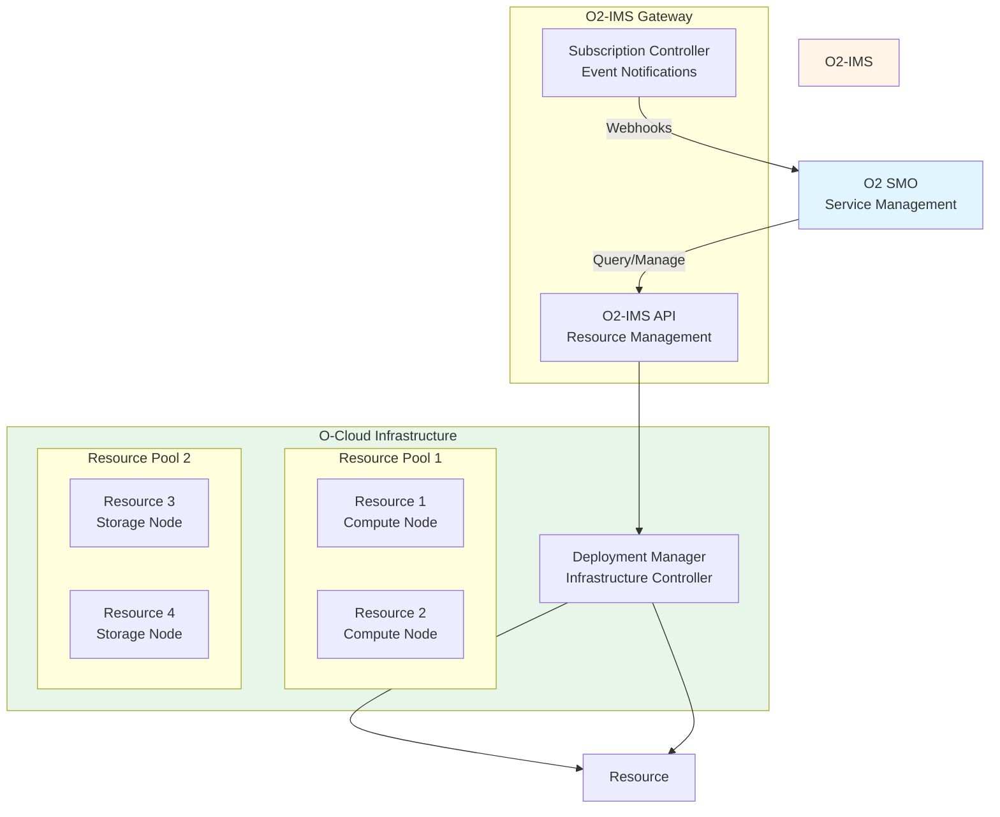
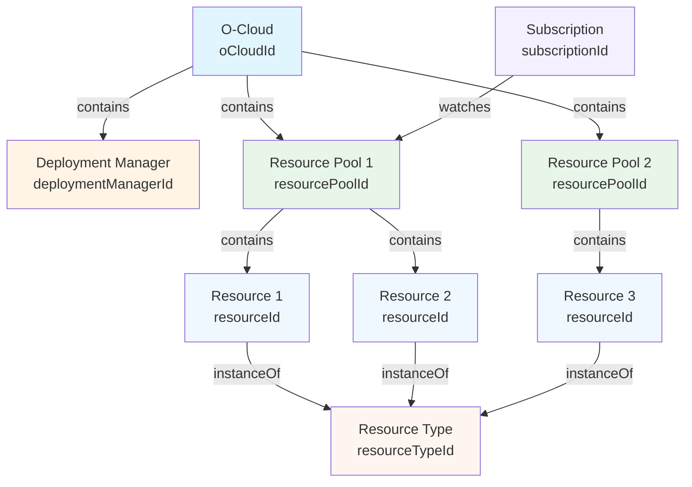

# First Steps with O2-IMS

Learn O2-IMS concepts and common API patterns through hands-on tutorials.

## Table of Contents

- [O2-IMS Concepts](#o2-ims-concepts)
- [Prerequisites](#prerequisites)
- [Tutorial 1: Understanding Resource Pools](#tutorial-1-understanding-resource-pools)
- [Tutorial 2: Querying Resources](#tutorial-2-querying-resources)
- [Tutorial 3: Creating Subscriptions](#tutorial-3-creating-subscriptions)
- [Tutorial 4: Testing Webhooks](#tutorial-4-testing-webhooks)
- [Tutorial 5: Working with Resource Types](#tutorial-5-working-with-resource-types)
- [Common Errors and Solutions](#common-errors-and-solutions)
- [Best Practices](#best-practices)
- [Next Steps](#next-steps)

## O2-IMS Concepts

Before diving into the tutorials, understand the core O2-IMS concepts.

### O-Cloud Architecture



### Core Entities

#### 1. O-Cloud

Represents the entire infrastructure domain managed by netweave.

**Attributes:**

- `oCloudId` - Unique identifier (e.g., `ocloud-us-east-1`)
- `name` - Human-readable name
- `serviceUri` - Management endpoint
- `extensions` - Backend-specific metadata

**Example:**

```json
{
  "oCloudId": "ocloud-kubernetes-prod",
  "name": "Production Kubernetes O-Cloud",
  "description": "Multi-region production Kubernetes infrastructure",
  "serviceUri": "https://netweave.example.com/o2ims/v1"
}
```

#### 2. Deployment Manager

Represents the infrastructure management system (e.g., Kubernetes, OpenStack).

**Attributes:**

- `deploymentManagerId` - Unique identifier
- `oCloudId` - Parent O-Cloud
- `serviceUri` - Management endpoint
- `capabilities` - Supported operations

**Example:**

```json
{
  "deploymentManagerId": "dm-k8s-prod-us-east",
  "name": "Kubernetes Production US East",
  "oCloudId": "ocloud-kubernetes-prod",
  "serviceUri": "https://k8s-api.us-east-1.example.com",
  "extensions": {
    "backend": "kubernetes",
    "version": "v1.30.0",
    "supportedCapabilities": ["compute", "storage", "network"]
  }
}
```

#### 3. Resource Pool

Logical grouping of infrastructure resources with similar characteristics.

**Attributes:**

- `resourcePoolId` - Unique identifier
- `name` - Human-readable name
- `location` - Physical or logical location
- `oCloudId` - Parent O-Cloud
- `extensions` - Pool-specific attributes

**Example:**

```json
{
  "resourcePoolId": "pool-compute-highmem",
  "name": "High Memory Compute Pool",
  "description": "Compute nodes with 128GB+ RAM for data processing",
  "location": "us-east-1a",
  "oCloudId": "ocloud-kubernetes-prod",
  "extensions": {
    "instanceType": "r5.4xlarge",
    "replicas": 5,
    "totalCPU": "80",
    "totalMemory": "640Gi"
  }
}
```

#### 4. Resource

Individual infrastructure component (compute, storage, network).

**Attributes:**

- `resourceId` - Unique identifier
- `resourcePoolId` - Parent pool
- `resourceTypeId` - Resource type classification
- `description` - Human-readable description
- `extensions` - Resource-specific attributes

**Example:**

```json
{
  "resourceId": "node-ip-10-0-1-42",
  "resourcePoolId": "pool-compute-highmem",
  "resourceTypeId": "kubernetes-node",
  "description": "Kubernetes worker node",
  "extensions": {
    "hostname": "ip-10-0-1-42.ec2.internal",
    "cpu": "16",
    "memory": "128Gi",
    "status": "Ready",
    "labels": {
      "node.kubernetes.io/instance-type": "r5.4xlarge",
      "topology.kubernetes.io/zone": "us-east-1a"
    }
  }
}
```

#### 5. Resource Type

Classification/template for resources with common characteristics.

**Attributes:**

- `resourceTypeId` - Unique identifier
- `name` - Human-readable name
- `vendor` - Provider/vendor
- `version` - Type version
- `model` - Model identifier

**Example:**

```json
{
  "resourceTypeId": "kubernetes-node",
  "name": "Kubernetes Node",
  "description": "Kubernetes worker node resource type",
  "vendor": "Kubernetes",
  "version": "v1.30.0",
  "extensions": {
    "resourceClass": "compute",
    "capabilities": ["scheduling", "pod-hosting"]
  }
}
```

#### 6. Subscription

Event notification registration for infrastructure changes.

**Attributes:**

- `subscriptionId` - Gateway-assigned UUID
- `consumerSubscriptionId` - Client-provided identifier
- `callback` - Webhook URL
- `filter` - Event filter criteria

**Example:**

```json
{
  "subscriptionId": "550e8400-e29b-41d4-a716-446655440000",
  "consumerSubscriptionId": "smo-sub-pools-prod",
  "callback": "https://smo.example.com/o2ims/notifications",
  "filter": {
    "resourcePoolId": "pool-compute-highmem"
  }
}
```

### Relationship Model



## Prerequisites

Before starting the tutorials:

1. **netweave gateway running** - Follow [Quickstart](quickstart.md) or [Installation](installation.md)
2. **curl or HTTPie installed** - For making API calls
3. **jq installed** - For JSON formatting (optional but recommended)

### Verify Gateway is Ready

```bash
# Check health
curl http://localhost:8080/health

# Expected: {"status":"ok","timestamp":"..."}
```

### Set Environment Variables

```bash
# Development (HTTP)
export GATEWAY_URL="http://localhost:8080"

# Production (HTTPS with mTLS)
export GATEWAY_URL="https://netweave.example.com"
export CLIENT_CERT="client.crt"
export CLIENT_KEY="client.key"
export CA_CERT="ca.crt"
```

### Helper Function for API Calls

```bash
# Add to ~/.bashrc or ~/.zshrc
o2ims_api() {
  local method=$1
  local path=$2
  local data=$3

  if [ -z "$CLIENT_CERT" ]; then
    # Development (HTTP)
    curl -X "$method" "$GATEWAY_URL$path" \
      -H "Content-Type: application/json" \
      ${data:+-d "$data"} | jq
  else
    # Production (HTTPS + mTLS)
    curl -X "$method" "$GATEWAY_URL$path" \
      --cert "$CLIENT_CERT" \
      --key "$CLIENT_KEY" \
      --cacert "$CA_CERT" \
      -H "Content-Type: application/json" \
      ${data:+-d "$data"} | jq
  fi
}

# Usage:
# o2ims_api GET /o2ims/v1/resourcePools
# o2ims_api POST /o2ims/v1/subscriptions '{"callback":"..."}'
```

## Tutorial 1: Understanding Resource Pools

Learn to query and manage resource pools.

### Step 1: List All Resource Pools

```bash
curl -X GET $GATEWAY_URL/o2ims/v1/resourcePools | jq
```

**Response:**

```json
{
  "items": [
    {
      "resourcePoolId": "pool-compute-general",
      "name": "General Purpose Compute Pool",
      "description": "Standard compute nodes for general workloads",
      "location": "us-east-1a",
      "oCloudId": "ocloud-kubernetes-prod",
      "extensions": {
        "backend": "kubernetes",
        "nodeSelector": "node.kubernetes.io/instance-type=c5.2xlarge",
        "replicas": 10,
        "totalCPU": "80",
        "totalMemory": "160Gi"
      }
    },
    {
      "resourcePoolId": "pool-compute-highmem",
      "name": "High Memory Compute Pool",
      "description": "Compute nodes with 128GB+ RAM",
      "location": "us-east-1b",
      "oCloudId": "ocloud-kubernetes-prod",
      "extensions": {
        "backend": "kubernetes",
        "nodeSelector": "node.kubernetes.io/instance-type=r5.4xlarge",
        "replicas": 5,
        "totalCPU": "80",
        "totalMemory": "640Gi"
      }
    }
  ],
  "metadata": {
    "totalCount": 2
  }
}
```

### Step 2: Get a Specific Resource Pool

```bash
curl -X GET $GATEWAY_URL/o2ims/v1/resourcePools/pool-compute-highmem | jq
```

**Response:**

```json
{
  "resourcePoolId": "pool-compute-highmem",
  "name": "High Memory Compute Pool",
  "description": "Compute nodes with 128GB+ RAM for data processing",
  "location": "us-east-1b",
  "oCloudId": "ocloud-kubernetes-prod",
  "extensions": {
    "backend": "kubernetes",
    "nodeSelector": "node.kubernetes.io/instance-type=r5.4xlarge",
    "replicas": 5,
    "totalCPU": "80",
    "totalMemory": "640Gi",
    "availableResources": {
      "cpu": "72",
      "memory": "600Gi"
    }
  }
}
```

### Step 3: Create a New Resource Pool

```bash
curl -X POST $GATEWAY_URL/o2ims/v1/resourcePools \
  -H "Content-Type: application/json" \
  -d '{
    "name": "GPU Compute Pool",
    "description": "Nodes with NVIDIA A100 GPUs for ML/AI workloads",
    "location": "us-west-2a",
    "oCloudId": "ocloud-kubernetes-prod",
    "extensions": {
      "instanceType": "p4d.24xlarge",
      "replicas": 3,
      "gpuType": "NVIDIA-A100",
      "gpuCount": 24
    }
  }' | jq
```

**Response (201 Created):**

```json
{
  "resourcePoolId": "pool-gpu-ml",
  "name": "GPU Compute Pool",
  "description": "Nodes with NVIDIA A100 GPUs for ML/AI workloads",
  "location": "us-west-2a",
  "oCloudId": "ocloud-kubernetes-prod",
  "extensions": {
    "instanceType": "p4d.24xlarge",
    "replicas": 3,
    "gpuType": "NVIDIA-A100",
    "gpuCount": 24,
    "status": "Creating"
  }
}
```

### Step 4: Update Resource Pool

```bash
curl -X PUT $GATEWAY_URL/o2ims/v1/resourcePools/pool-gpu-ml \
  -H "Content-Type: application/json" \
  -d '{
    "name": "GPU Compute Pool",
    "description": "Nodes with NVIDIA A100 GPUs for ML/AI workloads",
    "location": "us-west-2a",
    "oCloudId": "ocloud-kubernetes-prod",
    "extensions": {
      "instanceType": "p4d.24xlarge",
      "replicas": 5,
      "gpuType": "NVIDIA-A100",
      "gpuCount": 40
    }
  }' | jq
```

**Response (200 OK):**

```json
{
  "resourcePoolId": "pool-gpu-ml",
  "name": "GPU Compute Pool",
  "extensions": {
    "replicas": 5,
    "gpuCount": 40,
    "status": "Updating"
  }
}
```

### Step 5: Delete Resource Pool

```bash
curl -X DELETE $GATEWAY_URL/o2ims/v1/resourcePools/pool-gpu-ml

# Response: 204 No Content
```

## Tutorial 2: Querying Resources

Learn to query and filter infrastructure resources.

### Step 1: List All Resources

```bash
# List all resources (across all pools)
curl -X GET $GATEWAY_URL/o2ims/v1/resourcePools/pool-compute-highmem/resources | jq
```

**Response:**

```json
{
  "items": [
    {
      "resourceId": "node-ip-10-0-1-42",
      "resourcePoolId": "pool-compute-highmem",
      "resourceTypeId": "kubernetes-node",
      "description": "Kubernetes worker node",
      "extensions": {
        "hostname": "ip-10-0-1-42.ec2.internal",
        "cpu": "16",
        "memory": "128Gi",
        "status": "Ready",
        "allocatable": {
          "cpu": "15500m",
          "memory": "125Gi"
        },
        "labels": {
          "node.kubernetes.io/instance-type": "r5.4xlarge",
          "topology.kubernetes.io/zone": "us-east-1b"
        }
      }
    },
    {
      "resourceId": "node-ip-10-0-1-87",
      "resourcePoolId": "pool-compute-highmem",
      "resourceTypeId": "kubernetes-node",
      "description": "Kubernetes worker node",
      "extensions": {
        "hostname": "ip-10-0-1-87.ec2.internal",
        "cpu": "16",
        "memory": "128Gi",
        "status": "Ready"
      }
    }
  ],
  "metadata": {
    "totalCount": 2
  }
}
```

### Step 2: Get a Specific Resource

```bash
curl -X GET $GATEWAY_URL/o2ims/v1/resources/node-ip-10-0-1-42 | jq
```

**Response:**

```json
{
  "resourceId": "node-ip-10-0-1-42",
  "resourcePoolId": "pool-compute-highmem",
  "resourceTypeId": "kubernetes-node",
  "description": "Kubernetes worker node",
  "extensions": {
    "hostname": "ip-10-0-1-42.ec2.internal",
    "cpu": "16",
    "memory": "128Gi",
    "status": "Ready",
    "allocatable": {
      "cpu": "15500m",
      "memory": "125Gi",
      "pods": "110"
    },
    "conditions": [
      {"type": "Ready", "status": "True"},
      {"type": "MemoryPressure", "status": "False"},
      {"type": "DiskPressure", "status": "False"}
    ],
    "labels": {
      "node.kubernetes.io/instance-type": "r5.4xlarge",
      "topology.kubernetes.io/zone": "us-east-1b",
      "node-role.kubernetes.io/worker": ""
    }
  }
}
```

### Step 3: Filter Resources by Type

```bash
# Get only compute node resources
curl -X GET "$GATEWAY_URL/o2ims/v1/resourcePools/pool-compute-highmem/resources?resourceTypeId=kubernetes-node" | jq
```

### Step 4: Advanced Filtering (v2 API)

The v2 API supports advanced filtering with operators:

```bash
# Resources with specific label
curl -X GET "$GATEWAY_URL/o2ims/v2/resources?labels=env:prod" | jq

# Field selection (reduce payload)
curl -X GET "$GATEWAY_URL/o2ims/v2/resources?fields=resourceId,resourcePoolId,extensions.status" | jq

# Sorting
curl -X GET "$GATEWAY_URL/o2ims/v2/resources?sortBy=resourceId&sortOrder=desc" | jq

# Pagination
curl -X GET "$GATEWAY_URL/o2ims/v2/resources?limit=10&offset=20" | jq
```

## Tutorial 3: Creating Subscriptions

Learn to set up event subscriptions for infrastructure change notifications.

### Step 1: Understand Subscription Events

Subscriptions trigger webhook notifications for these events:

- `ResourceCreated` - New resource added
- `ResourceUpdated` - Resource modified
- `ResourceDeleted` - Resource removed
- `ResourcePoolCreated` - New pool added
- `ResourcePoolUpdated` - Pool modified
- `ResourcePoolDeleted` - Pool removed

### Step 2: Create a Simple Subscription

```bash
curl -X POST $GATEWAY_URL/o2ims/v1/subscriptions \
  -H "Content-Type: application/json" \
  -d '{
    "callback": "https://smo.example.com/o2ims/notifications",
    "consumerSubscriptionId": "smo-sub-all-pools"
  }' | jq
```

**Response (201 Created):**

```json
{
  "subscriptionId": "550e8400-e29b-41d4-a716-446655440000",
  "consumerSubscriptionId": "smo-sub-all-pools",
  "callback": "https://smo.example.com/o2ims/notifications",
  "filter": {}
}
```

This subscribes to **all** infrastructure events.

### Step 3: Create a Filtered Subscription

Subscribe only to events for a specific resource pool:

```bash
curl -X POST $GATEWAY_URL/o2ims/v1/subscriptions \
  -H "Content-Type: application/json" \
  -d '{
    "callback": "https://smo.example.com/o2ims/notifications/highmem",
    "consumerSubscriptionId": "smo-sub-highmem-pool",
    "filter": {
      "resourcePoolId": "pool-compute-highmem"
    }
  }' | jq
```

**Response:**

```json
{
  "subscriptionId": "550e8400-e29b-41d4-a716-446655440001",
  "consumerSubscriptionId": "smo-sub-highmem-pool",
  "callback": "https://smo.example.com/o2ims/notifications/highmem",
  "filter": {
    "resourcePoolId": "pool-compute-highmem"
  }
}
```

### Step 4: List Active Subscriptions

```bash
curl -X GET $GATEWAY_URL/o2ims/v1/subscriptions | jq
```

**Response:**

```json
{
  "items": [
    {
      "subscriptionId": "550e8400-e29b-41d4-a716-446655440000",
      "consumerSubscriptionId": "smo-sub-all-pools",
      "callback": "https://smo.example.com/o2ims/notifications",
      "filter": {}
    },
    {
      "subscriptionId": "550e8400-e29b-41d4-a716-446655440001",
      "consumerSubscriptionId": "smo-sub-highmem-pool",
      "callback": "https://smo.example.com/o2ims/notifications/highmem",
      "filter": {
        "resourcePoolId": "pool-compute-highmem"
      }
    }
  ],
  "metadata": {
    "totalCount": 2
  }
}
```

### Step 5: Get Subscription Details

```bash
curl -X GET $GATEWAY_URL/o2ims/v1/subscriptions/550e8400-e29b-41d4-a716-446655440001 | jq
```

### Step 6: Delete Subscription

```bash
curl -X DELETE $GATEWAY_URL/o2ims/v1/subscriptions/550e8400-e29b-41d4-a716-446655440001

# Response: 204 No Content
```

## Tutorial 4: Testing Webhooks

Learn to receive and process webhook notifications.

### Step 1: Set Up a Webhook Receiver

Use a simple webhook testing tool:

```bash
# Option 1: Using webhook.site (public)
# Visit https://webhook.site and copy your unique URL

# Option 2: Using local HTTP echo server
docker run --rm -p 9000:8080 --name webhook-receiver \
  mendhak/http-https-echo:31

# Your callback URL: http://host.docker.internal:9000/webhook
```

### Step 2: Create Subscription with Test Webhook

```bash
curl -X POST $GATEWAY_URL/o2ims/v1/subscriptions \
  -H "Content-Type: application/json" \
  -d '{
    "callback": "http://host.docker.internal:9000/webhook",
    "consumerSubscriptionId": "test-webhook-sub",
    "filter": {
      "resourcePoolId": "pool-compute-highmem"
    }
  }' | jq
```

### Step 3: Trigger an Event

Create a resource to trigger a `ResourceCreated` event:

```bash
# Simulate resource creation (this would normally happen via backend)
# For Kubernetes adapter, deploy a new pod in the resource pool
kubectl run test-pod --image=nginx -n default \
  --labels="o2ims.oran.org/resource-pool=pool-compute-highmem"
```

### Step 4: Webhook Notification Format

The webhook receiver will receive a POST request:

**Webhook Request:**

```http
POST /webhook HTTP/1.1
Host: host.docker.internal:9000
Content-Type: application/json
X-O2IMS-Subscription-Id: 550e8400-e29b-41d4-a716-446655440002
X-O2IMS-Event-Type: ResourceCreated
```

**Webhook Payload:**

```json
{
  "subscriptionId": "550e8400-e29b-41d4-a716-446655440002",
  "consumerSubscriptionId": "test-webhook-sub",
  "eventType": "ResourceCreated",
  "eventTime": "2026-01-12T21:30:00Z",
  "resource": {
    "resourceId": "pod-test-pod",
    "resourcePoolId": "pool-compute-highmem",
    "resourceTypeId": "kubernetes-pod",
    "description": "Kubernetes pod: test-pod",
    "extensions": {
      "namespace": "default",
      "status": "Running",
      "nodeName": "node-ip-10-0-1-42"
    }
  }
}
```

### Step 5: Webhook Response Requirements

Your webhook endpoint must:

1. **Respond with 2xx status** (200, 201, 204)
2. **Respond within 5 seconds** (timeout)
3. **Handle retries** (exponential backoff: 1s, 2s, 4s, 8s)

**Example webhook handler (Python):**

```python
from flask import Flask, request, jsonify

app = Flask(__name__)

@app.route('/webhook', methods=['POST'])
def webhook_handler():
    # Parse webhook notification
    data = request.json
    event_type = request.headers.get('X-O2IMS-Event-Type')

    # Log event
    print(f"Received {event_type} for resource {data['resource']['resourceId']}")

    # Process event
    if event_type == 'ResourceCreated':
        handle_resource_created(data)
    elif event_type == 'ResourceDeleted':
        handle_resource_deleted(data)

    # Return 200 OK
    return jsonify({"status": "received"}), 200

if __name__ == '__main__':
    app.run(host='0.0.0.0', port=9000)
```

### Step 6: Monitor Webhook Delivery

Check gateway logs for webhook delivery status:

```bash
# Development (Docker Compose)
docker compose logs gateway | grep webhook

# Kubernetes
kubectl logs -n o2ims-system deployment/netweave-gateway | grep webhook
```

**Log output:**

```json
{
  "level": "info",
  "ts": "2026-01-12T21:30:01.234Z",
  "msg": "Webhook delivered successfully",
  "subscriptionId": "550e8400-e29b-41d4-a716-446655440002",
  "callback": "http://host.docker.internal:9000/webhook",
  "eventType": "ResourceCreated",
  "statusCode": 200,
  "latencyMs": 42
}
```

## Tutorial 5: Working with Resource Types

Learn to query resource type metadata.

### Step 1: List All Resource Types

```bash
curl -X GET $GATEWAY_URL/o2ims/v1/resourceTypes | jq
```

**Response:**

```json
{
  "items": [
    {
      "resourceTypeId": "kubernetes-node",
      "name": "Kubernetes Node",
      "description": "Kubernetes worker node",
      "vendor": "Kubernetes",
      "version": "v1.30.0",
      "extensions": {
        "resourceClass": "compute",
        "capabilities": ["scheduling", "pod-hosting", "persistent-volumes"]
      }
    },
    {
      "resourceTypeId": "kubernetes-pod",
      "name": "Kubernetes Pod",
      "description": "Kubernetes pod resource",
      "vendor": "Kubernetes",
      "version": "v1.30.0",
      "extensions": {
        "resourceClass": "workload",
        "capabilities": ["container-runtime", "networking", "storage"]
      }
    },
    {
      "resourceTypeId": "kubernetes-persistentvolume",
      "name": "Kubernetes Persistent Volume",
      "description": "Kubernetes PV storage",
      "vendor": "Kubernetes",
      "version": "v1.30.0",
      "extensions": {
        "resourceClass": "storage",
        "capabilities": ["block-storage", "file-storage"]
      }
    }
  ],
  "metadata": {
    "totalCount": 3
  }
}
```

### Step 2: Get Specific Resource Type

```bash
curl -X GET $GATEWAY_URL/o2ims/v1/resourceTypes/kubernetes-node | jq
```

**Response:**

```json
{
  "resourceTypeId": "kubernetes-node",
  "name": "Kubernetes Node",
  "description": "Kubernetes worker node resource type",
  "vendor": "Kubernetes",
  "version": "v1.30.0",
  "model": "Worker Node",
  "extensions": {
    "resourceClass": "compute",
    "capabilities": [
      "scheduling",
      "pod-hosting",
      "persistent-volumes",
      "service-load-balancing"
    ],
    "attributes": {
      "cpu": "string",
      "memory": "string",
      "status": "enum(Ready,NotReady)",
      "allocatable": "object"
    }
  }
}
```

### Step 3: Find Resources by Type

```bash
# List all resources of a specific type
curl -X GET "$GATEWAY_URL/o2ims/v1/resourcePools/pool-compute-highmem/resources?resourceTypeId=kubernetes-node" | jq
```

## Common Errors and Solutions

### Error 1: Unauthorized (401)

**Symptom:**

```json
{
  "error": "Unauthorized",
  "message": "Client certificate required"
}
```

**Cause:** Missing or invalid client certificate for mTLS

**Solution:**

```bash
# Ensure certificates are provided
curl -X GET $GATEWAY_URL/o2ims/v1/resourcePools \
  --cert client.crt \
  --key client.key \
  --cacert ca.crt
```

### Error 2: Not Found (404)

**Symptom:**

```json
{
  "error": "Not Found",
  "message": "Resource pool not found: pool-invalid-id"
}
```

**Cause:** Resource ID does not exist

**Solution:**

```bash
# List available resource pools first
curl -X GET $GATEWAY_URL/o2ims/v1/resourcePools | jq '.items[].resourcePoolId'

# Use correct ID
curl -X GET $GATEWAY_URL/o2ims/v1/resourcePools/pool-compute-highmem
```

### Error 3: Bad Request (400)

**Symptom:**

```json
{
  "error": "Bad Request",
  "message": "Validation failed: 'callback' is required"
}
```

**Cause:** Missing required field or invalid JSON

**Solution:**

```bash
# Ensure all required fields are present
curl -X POST $GATEWAY_URL/o2ims/v1/subscriptions \
  -H "Content-Type: application/json" \
  -d '{
    "callback": "https://smo.example.com/notify",
    "consumerSubscriptionId": "my-sub-1"
  }'
```

### Error 4: Webhook Delivery Failed

**Symptom:** Logs show "webhook delivery failed: connection refused"

**Cause:** Webhook endpoint unreachable or not responding

**Solution:**

```bash
# Verify webhook endpoint is accessible from gateway
curl -X POST $CALLBACK_URL/webhook \
  -H "Content-Type: application/json" \
  -d '{"test": "connectivity"}'

# Check firewall rules allow gateway IP
# Update subscription with correct callback URL
```

### Error 5: Rate Limited (429)

**Symptom:**

```json
{
  "error": "Too Many Requests",
  "message": "Rate limit exceeded",
  "retryAfter": 60
}
```

**Cause:** Too many requests in short time

**Solution:**

```bash
# Wait and retry
sleep 60
curl -X GET $GATEWAY_URL/o2ims/v1/resourcePools

# Implement exponential backoff in client
```

## Best Practices

### 1. Use Meaningful IDs

```bash
# Good: Descriptive consumer subscription IDs
{
  "consumerSubscriptionId": "smo-prod-highmem-pools-v1"
}

# Bad: Generic IDs
{
  "consumerSubscriptionId": "sub1"
}
```

### 2. Filter Subscriptions

```bash
# Good: Filter to reduce webhook volume
{
  "callback": "https://smo.example.com/notify",
  "filter": {
    "resourcePoolId": "pool-compute-highmem",
    "eventType": ["ResourceCreated", "ResourceDeleted"]
  }
}

# Bad: Subscribe to everything
{
  "callback": "https://smo.example.com/notify"
}
```

### 3. Handle Webhook Idempotency

```python
# Track processed events to avoid duplicates
processed_events = set()

def webhook_handler(data):
    event_id = data.get('eventId')
    if event_id in processed_events:
        return {"status": "already_processed"}, 200

    # Process event
    process_event(data)

    # Mark as processed
    processed_events.add(event_id)
    return {"status": "processed"}, 200
```

### 4. Use Field Selection (v2 API)

```bash
# Good: Request only needed fields
curl -X GET "$GATEWAY_URL/o2ims/v2/resources?fields=resourceId,resourcePoolId,extensions.status"

# Bad: Retrieve all fields when only few needed
curl -X GET "$GATEWAY_URL/o2ims/v2/resources"
```

### 5. Implement Retry Logic

```python
import time
import requests

def call_o2ims_api(url, method='GET', data=None, retries=3):
    for attempt in range(retries):
        try:
            response = requests.request(method, url, json=data, timeout=10)
            response.raise_for_status()
            return response.json()
        except requests.exceptions.RequestException as e:
            if attempt == retries - 1:
                raise
            wait = 2 ** attempt  # Exponential backoff
            time.sleep(wait)
```

### 6. Monitor Subscription Health

```bash
# Periodically verify subscriptions are active
curl -X GET $GATEWAY_URL/o2ims/v1/subscriptions | jq '.items[] | {id: .subscriptionId, callback: .callback}'

# Delete stale subscriptions
curl -X DELETE $GATEWAY_URL/o2ims/v1/subscriptions/<stale-sub-id>
```

## Next Steps

After completing these tutorials, explore:

1. **[API Reference](../api-mapping.md)** - Complete O2-IMS API specification
   - All endpoints and operations
   - Request/response schemas
   - Filter syntax reference
   - Extension attributes

2. **[Advanced Features](../architecture.md)** - Deep dive into architecture
   - Multi-backend support
   - High availability
   - Performance optimization
   - Security architecture

3. **[O2-DMS Integration](../o2dms-o2smo-extension.md)** - Deployment management
   - CNF/VNF lifecycle management
   - Helm chart deployments
   - GitOps workflows
   - Package management

4. **[Security Configuration](../security.md)** - Harden your deployment
   - mTLS certificate management
   - RBAC policies
   - Webhook authentication
   - Audit logging

5. **[Operations Guide](../operations.md)** - Production operations
   - Monitoring and alerting
   - Backup and restore
   - Troubleshooting
   - Performance tuning

## Support and Resources

- **Documentation:** [docs/](../)
- **API Reference:** Swagger UI at `$GATEWAY_URL/docs/`
- **Issues:** [GitHub Issues](https://github.com/piwi3910/netweave/issues)
- **Discussions:** [GitHub Discussions](https://github.com/piwi3910/netweave/discussions)

## Summary

You've learned:

- ✅ O2-IMS core concepts (O-Cloud, Deployment Managers, Resource Pools, Resources, Types)
- ✅ How to query and manage resource pools
- ✅ How to list and filter resources
- ✅ How to create and manage subscriptions
- ✅ How to receive and process webhook notifications
- ✅ How to work with resource types
- ✅ Common errors and troubleshooting
- ✅ Best practices for O2-IMS API usage

**Continue your journey with advanced topics and production deployment guides!**
