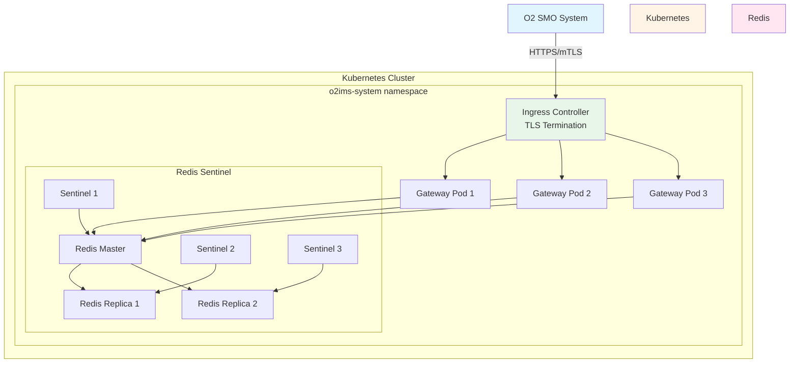
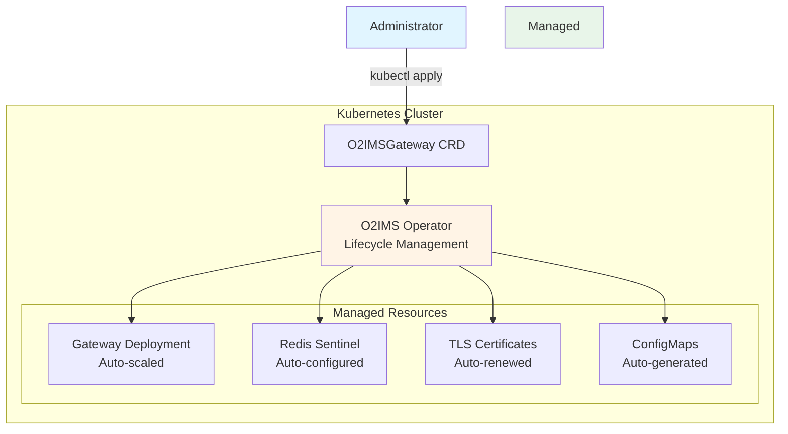
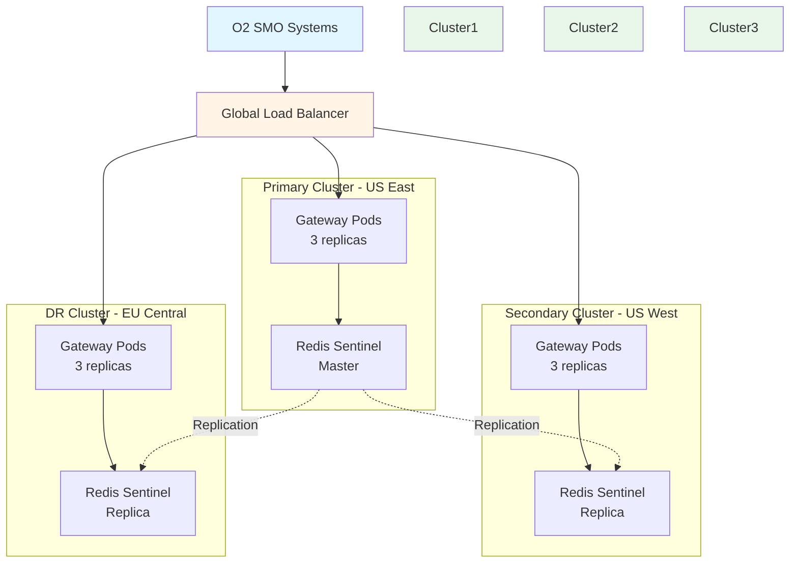

# Installation Guide

Comprehensive guide for deploying netweave in all environments.

## Table of Contents

- [Prerequisites](#prerequisites)
- [Quick Deploy (Development)](#quick-deploy-development)
- [Production Deployment with Helm](#production-deployment-with-helm)
- [Production Deployment with Operator](#production-deployment-with-operator)
- [Docker Compose for Development](#docker-compose-for-development)
- [Multi-Cluster Deployment](#multi-cluster-deployment)
- [Verification](#verification)
- [Troubleshooting](#troubleshooting)
- [Uninstallation](#uninstallation)

## Prerequisites

### Required Software

| Software | Minimum Version | Purpose | Installation |
|----------|-----------------|---------|--------------|
| **Kubernetes** | 1.30+ | Container orchestration | [Install kubectl](https://kubernetes.io/docs/tasks/tools/) |
| **Helm** | 3.0+ | Package manager | [Install Helm](https://helm.sh/docs/intro/install/) |
| **Go** | 1.25.0+ | Development only | [Install Go](https://go.dev/doc/install) |
| **Docker** | 20.10+ | Container runtime | [Install Docker](https://docs.docker.com/get-docker/) |
| **Redis** | 7.4+ | State backend | Installed via Helm |
| **cert-manager** | 1.15+ | TLS certificates | [Install cert-manager](https://cert-manager.io/docs/installation/) |

### Verify Prerequisites

```bash
# Kubernetes cluster access
kubectl cluster-info
kubectl version --short

# Helm installed
helm version --short

# Docker installed (for development)
docker --version

# Go installed (for development)
go version
```

### Cluster Requirements

**Development:**

- Single-node cluster (minikube, kind, Docker Desktop)
- 2 CPU cores
- 4GB RAM
- 10GB storage

**Production:**

- Multi-node cluster (3+ nodes)
- 8+ CPU cores per node
- 16GB+ RAM per node
- 50GB+ storage per node
- Load balancer support
- Persistent volume provisioner

### Network Requirements

| Port | Protocol | Direction | Purpose |
|------|----------|-----------|---------|
| 8080 | TCP | Inbound | HTTP API (development) |
| 8443 | TCP | Inbound | HTTPS API (production) |
| 6379 | TCP | Internal | Redis communication |
| 9090 | TCP | Internal | Metrics (Prometheus) |

## Quick Deploy (Development)

For local development and testing on your workstation.

### Step 1: Clone Repository

```bash
git clone https://github.com/piwi3910/netweave.git
cd netweave
```

### Step 2: Install Development Tools

```bash
# Install linters, formatters, testing tools
make install-tools

# Install Git pre-commit hooks
make install-hooks

# Verify setup
make verify-setup
```

**Expected output:**

```text
✓ Go 1.25.0 installed
✓ golangci-lint installed
✓ Docker installed
✓ kubectl configured
✓ Kubernetes cluster reachable
✓ Pre-commit hooks installed
```

### Step 3: Build and Deploy

```bash
# Build binary and Docker image
make build
make docker-build

# Deploy to Kubernetes (development mode)
make deploy-dev
```

This deploys:

- netweave gateway (1 replica, HTTP)
- Redis (single instance, no auth)
- Development configuration
- Port-forward to `localhost:8080`

### Step 4: Verify Deployment

```bash
# Check pods
kubectl get pods -n o2ims-dev

# Check gateway logs
kubectl logs -n o2ims-dev deployment/netweave-gateway -f

# Test API
curl http://localhost:8080/health
```

### Step 5: Access Gateway

```bash
# Port-forward (if not already running)
kubectl port-forward -n o2ims-dev svc/netweave-gateway 8080:8080

# Test API
curl http://localhost:8080/o2ims/v1/resourcePools | jq
```

## Production Deployment with Helm

Deploy netweave to production Kubernetes clusters using Helm charts.

### Architecture Overview



### Step 1: Install cert-manager

cert-manager manages TLS certificates for secure communication.

```bash
# Add cert-manager repository
helm repo add jetstack https://charts.jetstack.io
helm repo update

# Install cert-manager
kubectl apply -f https://github.com/cert-manager/cert-manager/releases/download/v1.15.0/cert-manager.yaml

# Verify cert-manager is running
kubectl get pods -n cert-manager
```

**Wait for all pods to be Running:**

```text
NAME                                      READY   STATUS
cert-manager-7d9b5d8d9c-xxxxx            1/1     Running
cert-manager-cainjector-xxxxx            1/1     Running
cert-manager-webhook-xxxxx               1/1     Running
```

### Step 2: Create CA Certificate

Create a Certificate Authority for issuing TLS certificates.

```bash
# Create CA private key and certificate
kubectl create namespace o2ims-system

kubectl apply -f - <<EOF
apiVersion: v1
kind: Secret
metadata:
  name: ca-keypair
  namespace: o2ims-system
type: kubernetes.io/tls
data:
  tls.crt: $(openssl req -x509 -newkey rsa:4096 -keyout /dev/stdout -out /dev/stdout -days 3650 -nodes -subj "/CN=O2IMS Root CA" 2>/dev/null | base64 -w0)
  tls.key: $(openssl genrsa 4096 2>/dev/null | base64 -w0)
---
apiVersion: cert-manager.io/v1
kind: ClusterIssuer
metadata:
  name: ca-issuer
spec:
  ca:
    secretName: ca-keypair
EOF
```

### Step 3: Install Redis with Sentinel

Redis Sentinel provides high availability for state storage.

```bash
# Add Bitnami repository
helm repo add bitnami https://charts.bitnami.com/bitnami
helm repo update

# Install Redis with Sentinel
helm install redis bitnami/redis \
  --namespace o2ims-system \
  --create-namespace \
  --set sentinel.enabled=true \
  --set sentinel.replicas=3 \
  --set replica.replicaCount=2 \
  --set master.persistence.enabled=true \
  --set master.persistence.size=10Gi \
  --set auth.enabled=true \
  --set auth.password="$(openssl rand -base64 32)" \
  --set tls.enabled=true \
  --set tls.autoGenerated=true

# Wait for Redis to be ready
kubectl wait --for=condition=ready pod -l app.kubernetes.io/name=redis -n o2ims-system --timeout=300s
```

### Step 4: Deploy netweave with Helm

Deploy the O2-IMS gateway with production configuration.

```bash
# Add netweave Helm repository (if public)
helm repo add netweave https://piwi3910.github.io/netweave
helm repo update

# Or use local chart
cd netweave/helm

# Install with production values
helm install netweave ./netweave \
  --namespace o2ims-system \
  --values netweave/values-production.yaml \
  --set image.tag=v1.0.0 \
  --set redis.existingSecret=redis \
  --set tls.issuerRef.name=ca-issuer \
  --set tls.issuerRef.kind=ClusterIssuer

# Wait for gateway to be ready
kubectl wait --for=condition=ready pod -l app.kubernetes.io/name=netweave -n o2ims-system --timeout=300s
```

### Step 5: Configure Ingress

Expose the gateway via Ingress with TLS termination.

```bash
kubectl apply -f - <<EOF
apiVersion: networking.k8s.io/v1
kind: Ingress
metadata:
  name: netweave-ingress
  namespace: o2ims-system
  annotations:
    cert-manager.io/cluster-issuer: ca-issuer
    nginx.ingress.kubernetes.io/backend-protocol: "HTTPS"
    nginx.ingress.kubernetes.io/ssl-redirect: "true"
spec:
  tls:
  - hosts:
    - netweave.example.com
    secretName: netweave-tls
  rules:
  - host: netweave.example.com
    http:
      paths:
      - path: /
        pathType: Prefix
        backend:
          service:
            name: netweave-gateway
            port:
              number: 8443
EOF
```

### Step 6: Verify Production Deployment

```bash
# Check all pods are running
kubectl get pods -n o2ims-system

# Check gateway logs
kubectl logs -n o2ims-system -l app.kubernetes.io/name=netweave --tail=50

# Test API with mTLS
curl -X GET https://netweave.example.com/health \
  --cert client.crt \
  --key client.key \
  --cacert ca.crt

# Check Prometheus metrics
curl -X GET https://netweave.example.com/metrics \
  --cert client.crt \
  --key client.key \
  --cacert ca.crt
```

## Production Deployment with Operator

Deploy netweave using the Kubernetes Operator for advanced lifecycle management.

### Architecture with Operator



### Step 1: Install Operator CRD

```bash
# Install Custom Resource Definition
kubectl apply -f https://raw.githubusercontent.com/piwi3910/netweave/main/deployments/operator/crd.yaml

# Verify CRD is installed
kubectl get crd o2imsgateways.o2ims.oran.org
```

### Step 2: Deploy Operator

```bash
# Install operator
kubectl apply -f https://raw.githubusercontent.com/piwi3910/netweave/main/deployments/operator/operator.yaml

# Verify operator is running
kubectl get pods -n o2ims-operator-system
```

### Step 3: Create O2IMSGateway Resource

Create a production gateway instance:

```bash
kubectl apply -f - <<EOF
apiVersion: o2ims.oran.org/v1alpha1
kind: O2IMSGateway
metadata:
  name: netweave-production
  namespace: o2ims-system
spec:
  # Gateway configuration
  replicas: 3
  version: "v1.0.0"

  # TLS configuration
  tls:
    enabled: true
    mode: "require-and-verify"
    issuerRef:
      name: ca-issuer
      kind: ClusterIssuer

  # Redis configuration (auto-deployed)
  redis:
    sentinel: true
    replicas: 3
    persistence:
      enabled: true
      size: 10Gi
    tls:
      enabled: true

  # Adapter configuration
  adapter:
    backend: "kubernetes"
    kubernetes:
      incluster: true

  # Observability
  observability:
    metrics:
      enabled: true
    tracing:
      enabled: true
      jaeger:
        endpoint: "http://jaeger-collector:14268/api/traces"

  # Resource limits
  resources:
    requests:
      cpu: "500m"
      memory: "512Mi"
    limits:
      cpu: "2000m"
      memory: "2Gi"

  # High availability
  podDisruptionBudget:
    minAvailable: 2

  # Auto-scaling
  autoscaling:
    enabled: true
    minReplicas: 3
    maxReplicas: 10
    targetCPUUtilizationPercentage: 70
EOF
```

### Step 4: Verify Operator Deployment

```bash
# Check O2IMSGateway resource
kubectl get o2imsgateway -n o2ims-system

# Check managed resources
kubectl get all -n o2ims-system -l app.kubernetes.io/managed-by=o2ims-operator

# Check operator logs
kubectl logs -n o2ims-operator-system deployment/o2ims-operator -f
```

### Step 5: Upgrade via Operator

The operator handles rolling updates automatically:

```bash
# Update gateway version
kubectl patch o2imsgateway netweave-production -n o2ims-system \
  --type=merge \
  -p '{"spec":{"version":"v1.1.0"}}'

# Watch rollout
kubectl rollout status deployment/netweave-production-gateway -n o2ims-system
```

## Docker Compose for Development

Use Docker Compose for local development without Kubernetes.

### Step 1: Create docker-compose.yaml

```bash
cd netweave

# Use provided docker-compose.yaml
cat docker-compose.yaml
```

**docker-compose.yaml:**

```yaml
version: '3.8'

services:
  gateway:
    container_name: netweave-gateway
    image: netweave:latest
    build:
      context: .
      dockerfile: Dockerfile
    ports:
      - "8080:8080"
    environment:
      - NETWEAVE_ENV=dev
      - NETWEAVE_REDIS_ADDRESS=redis:6379
      - NETWEAVE_ADAPTER_BACKEND=kubernetes
    volumes:
      - ~/.kube/config:/root/.kube/config:ro
      - ./config:/app/config:ro
    depends_on:
      - redis
    healthcheck:
      test: ["CMD", "wget", "-qO-", "http://localhost:8080/health"]
      interval: 10s
      timeout: 5s
      retries: 3
    networks:
      - netweave

  redis:
    container_name: netweave-redis
    image: redis:7.4-alpine
    ports:
      - "6379:6379"
    volumes:
      - redis-data:/data
    healthcheck:
      test: ["CMD", "redis-cli", "ping"]
      interval: 10s
      timeout: 3s
      retries: 3
    networks:
      - netweave

networks:
  netweave:
    driver: bridge

volumes:
  redis-data:
```

### Step 2: Start Services

```bash
# Build and start
docker compose up -d

# Check status
docker compose ps

# View logs
docker compose logs -f
```

### Step 3: Verify Docker Compose Deployment

```bash
# Check health
curl http://localhost:8080/health

# Test API
curl http://localhost:8080/o2ims/v1/resourcePools | jq
```

See [Quickstart Guide](quickstart.md) for detailed Docker Compose usage.

## Multi-Cluster Deployment

Deploy netweave across multiple Kubernetes clusters for high availability.

### Architecture



### Step 1: Configure Redis Replication

Deploy Redis in primary cluster:

```bash
# Primary cluster (us-east)
kubectl config use-context cluster-us-east

helm install redis-primary bitnami/redis \
  --namespace o2ims-system \
  --create-namespace \
  --set sentinel.enabled=true \
  --set auth.enabled=true \
  --set auth.password="shared-secret" \
  --set tls.enabled=true \
  --set master.service.type=LoadBalancer

# Get primary Redis external IP
export REDIS_PRIMARY_IP=$(kubectl get svc redis-primary -n o2ims-system -o jsonpath='{.status.loadBalancer.ingress[0].ip}')
```

Deploy Redis replicas in secondary clusters:

```bash
# Secondary cluster (us-west)
kubectl config use-context cluster-us-west

helm install redis-replica bitnami/redis \
  --namespace o2ims-system \
  --create-namespace \
  --set sentinel.enabled=true \
  --set auth.enabled=true \
  --set auth.password="shared-secret" \
  --set tls.enabled=true \
  --set replica.replicaCount=2 \
  --set master.service.externalIPs[0]=$REDIS_PRIMARY_IP
```

### Step 2: Deploy Gateway to All Clusters

Deploy to each cluster with cluster-specific configuration:

```bash
# Primary cluster
kubectl config use-context cluster-us-east
helm install netweave-primary ./helm/netweave \
  --namespace o2ims-system \
  --set cluster.name=us-east \
  --set redis.sentinelAddresses[0]=redis-primary-sentinel:26379

# Secondary cluster
kubectl config use-context cluster-us-west
helm install netweave-secondary ./helm/netweave \
  --namespace o2ims-system \
  --set cluster.name=us-west \
  --set redis.sentinelAddresses[0]=redis-replica-sentinel:26379
```

### Step 3: Configure Global Load Balancer

Configure traffic manager to distribute requests:

```bash
# Example: AWS Route53 with health checks
aws route53 change-resource-record-sets \
  --hosted-zone-id Z1234567890ABC \
  --change-batch file://route53-multicluster.json
```

**route53-multicluster.json:**

```json
{
  "Changes": [
    {
      "Action": "CREATE",
      "ResourceRecordSet": {
        "Name": "netweave.example.com",
        "Type": "A",
        "SetIdentifier": "us-east-cluster",
        "Weight": 100,
        "TTL": 60,
        "ResourceRecords": [{"Value": "192.0.2.1"}],
        "HealthCheckId": "abcd1234"
      }
    },
    {
      "Action": "CREATE",
      "ResourceRecordSet": {
        "Name": "netweave.example.com",
        "Type": "A",
        "SetIdentifier": "us-west-cluster",
        "Weight": 100,
        "TTL": 60,
        "ResourceRecords": [{"Value": "192.0.2.2"}],
        "HealthCheckId": "efgh5678"
      }
    }
  ]
}
```

## Verification

Comprehensive verification checklist after deployment.

### Health Checks

```bash
# Gateway health
curl https://netweave.example.com/health

# Redis connectivity
kubectl exec -n o2ims-system deployment/netweave-gateway -- \
  redis-cli -h redis -p 6379 PING

# Kubernetes adapter
curl https://netweave.example.com/o2ims/v1/deploymentManagers
```

### API Functionality

```bash
# List resource pools
curl -X GET https://netweave.example.com/o2ims/v1/resourcePools \
  --cert client.crt --key client.key --cacert ca.crt

# Create subscription
curl -X POST https://netweave.example.com/o2ims/v1/subscriptions \
  --cert client.crt --key client.key --cacert ca.crt \
  -H "Content-Type: application/json" \
  -d '{"callback":"https://smo.example.com/notify"}'
```

### TLS Certificate Verification

```bash
# Check certificate validity
openssl s_client -connect netweave.example.com:443 \
  -CAfile ca.crt \
  -cert client.crt \
  -key client.key

# Verify certificate chain
kubectl get certificate -n o2ims-system
kubectl describe certificate netweave-tls -n o2ims-system
```

### Performance Testing

```bash
# Install K6 load testing tool
brew install k6  # macOS
# or
wget https://github.com/grafana/k6/releases/download/v0.50.0/k6-v0.50.0-linux-amd64.tar.gz

# Run performance test
k6 run tests/performance/load-test.js
```

## Troubleshooting

Common issues and solutions.

### Gateway Pods CrashLooping

**Symptom:** Pods restart repeatedly

```bash
# Check pod status
kubectl get pods -n o2ims-system

# Check logs
kubectl logs -n o2ims-system deployment/netweave-gateway --tail=100

# Common causes:
# 1. Redis connection failed
# 2. Invalid configuration
# 3. Certificate issues
# 4. Resource limits too low
```

**Solution:**

```bash
# Check Redis connectivity
kubectl exec -n o2ims-system deployment/netweave-gateway -- \
  redis-cli -h redis -p 6379 PING

# Check configuration
kubectl get configmap -n o2ims-system netweave-config -o yaml

# Increase resource limits
kubectl patch deployment netweave-gateway -n o2ims-system \
  --type=json \
  -p='[{"op":"replace","path":"/spec/template/spec/containers/0/resources/limits/memory","value":"2Gi"}]'
```

### TLS Certificate Errors

**Symptom:** `x509: certificate signed by unknown authority`

```bash
# Check certificate status
kubectl get certificate -n o2ims-system
kubectl describe certificate netweave-tls -n o2ims-system

# Check cert-manager logs
kubectl logs -n cert-manager deployment/cert-manager
```

**Solution:**

```bash
# Delete and recreate certificate
kubectl delete certificate netweave-tls -n o2ims-system
kubectl apply -f deployments/kubernetes/production/certificates.yaml

# Wait for certificate to be ready
kubectl wait --for=condition=ready certificate/netweave-tls -n o2ims-system --timeout=300s
```

### Redis Connection Issues

**Symptom:** `failed to connect to Redis`

```bash
# Check Redis pods
kubectl get pods -n o2ims-system -l app.kubernetes.io/name=redis

# Test Redis connection
kubectl exec -n o2ims-system redis-master-0 -- redis-cli ping
```

**Solution:**

```bash
# Check Redis password secret
kubectl get secret -n o2ims-system redis -o jsonpath='{.data.redis-password}' | base64 -d

# Update gateway config with correct password
kubectl create secret generic redis-password \
  --from-literal=password=$(openssl rand -base64 32) \
  -n o2ims-system \
  --dry-run=client -o yaml | kubectl apply -f -

# Restart gateway
kubectl rollout restart deployment/netweave-gateway -n o2ims-system
```

### Ingress Not Working

**Symptom:** Cannot reach gateway via ingress hostname

```bash
# Check ingress status
kubectl get ingress -n o2ims-system
kubectl describe ingress netweave-ingress -n o2ims-system

# Check ingress controller logs
kubectl logs -n ingress-nginx deployment/ingress-nginx-controller
```

**Solution:**

```bash
# Verify DNS resolution
nslookup netweave.example.com

# Check ingress controller
kubectl get pods -n ingress-nginx

# Test direct service access
kubectl port-forward -n o2ims-system svc/netweave-gateway 8443:8443
curl https://localhost:8443/health --insecure
```

## Uninstallation

Complete removal of netweave and dependencies.

### Uninstall Helm Deployment

```bash
# Uninstall gateway
helm uninstall netweave -n o2ims-system

# Uninstall Redis
helm uninstall redis -n o2ims-system

# Delete namespace (removes all resources)
kubectl delete namespace o2ims-system

# Uninstall cert-manager (optional)
kubectl delete -f https://github.com/cert-manager/cert-manager/releases/download/v1.15.0/cert-manager.yaml
```

### Uninstall Operator Deployment

```bash
# Delete O2IMSGateway resource
kubectl delete o2imsgateway netweave-production -n o2ims-system

# Uninstall operator
kubectl delete -f deployments/operator/operator.yaml

# Delete CRD (removes all instances)
kubectl delete -f deployments/operator/crd.yaml

# Delete namespace
kubectl delete namespace o2ims-system
kubectl delete namespace o2ims-operator-system
```

### Clean Up Docker Compose

```bash
# Stop and remove containers
cd netweave
docker compose down

# Remove volumes (data)
docker compose down -v

# Remove images
docker compose down --rmi all -v
```

### Verify Complete Removal

```bash
# Check no pods remain
kubectl get pods --all-namespaces | grep netweave

# Check no PVCs remain
kubectl get pvc --all-namespaces | grep o2ims

# Check no CRDs remain
kubectl get crd | grep o2ims
```

## Next Steps

After successful installation:

1. **[First Steps Tutorial](first-steps.md)** - Learn O2-IMS API basics
   - Create resource pools
   - Query resources
   - Set up subscriptions
   - Test webhooks

2. **[Configuration Guide](../configuration.md)** - Customize deployment
   - Environment-specific configs
   - Adapter configuration
   - Security settings
   - Observability options

3. **[Operations Guide](../operations.md)** - Day-2 operations
   - Monitoring and alerting
   - Backup and restore
   - Upgrades and rollbacks
   - Troubleshooting

4. **[Security Guide](../security.md)** - Harden deployment
   - mTLS configuration
   - RBAC policies
   - Network policies
   - Secret management

## Support

- **Documentation:** [docs/](../)
- **Issues:** [GitHub Issues](https://github.com/piwi3910/netweave/issues)
- **Discussions:** [GitHub Discussions](https://github.com/piwi3910/netweave/discussions)
- **Security:** security@example.com
