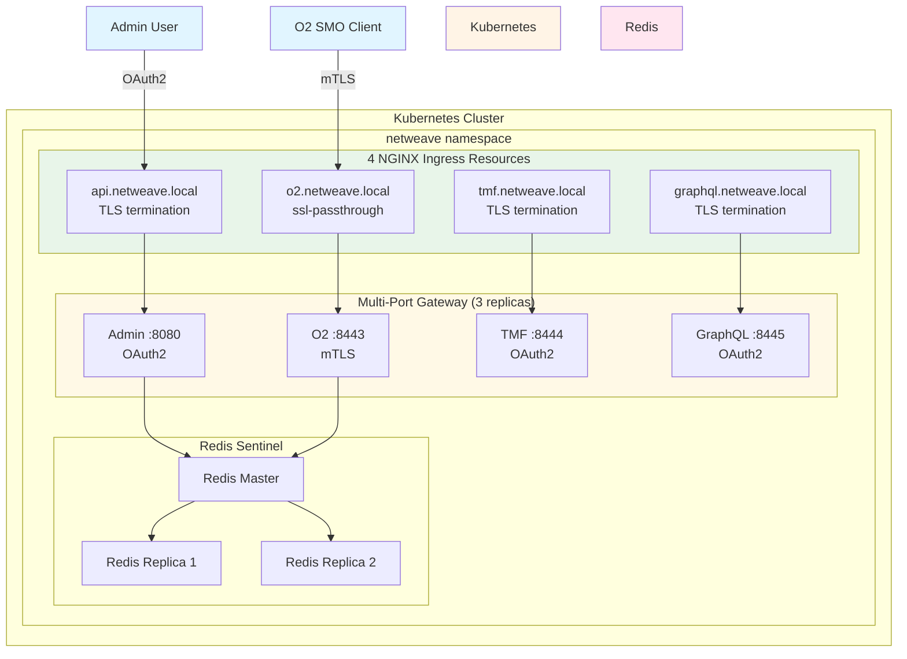
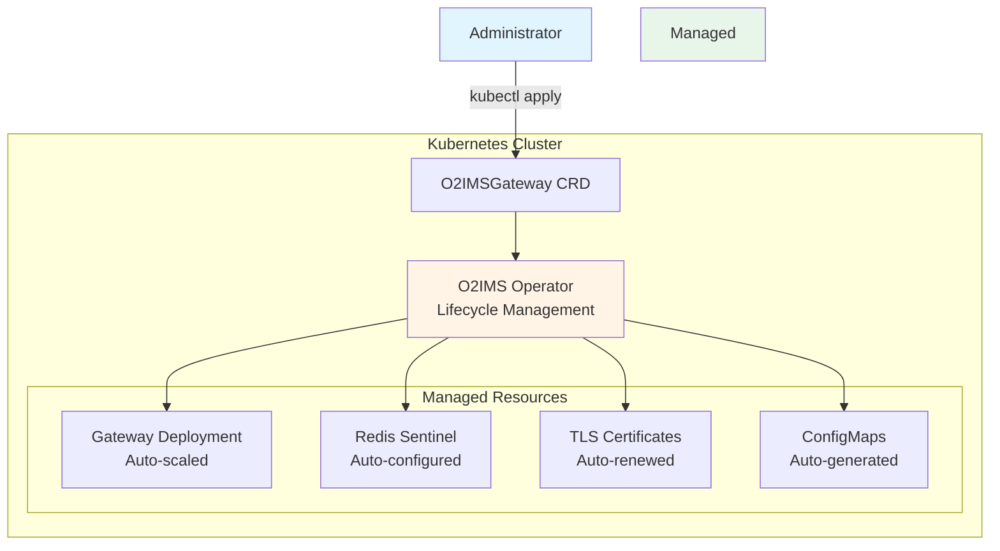
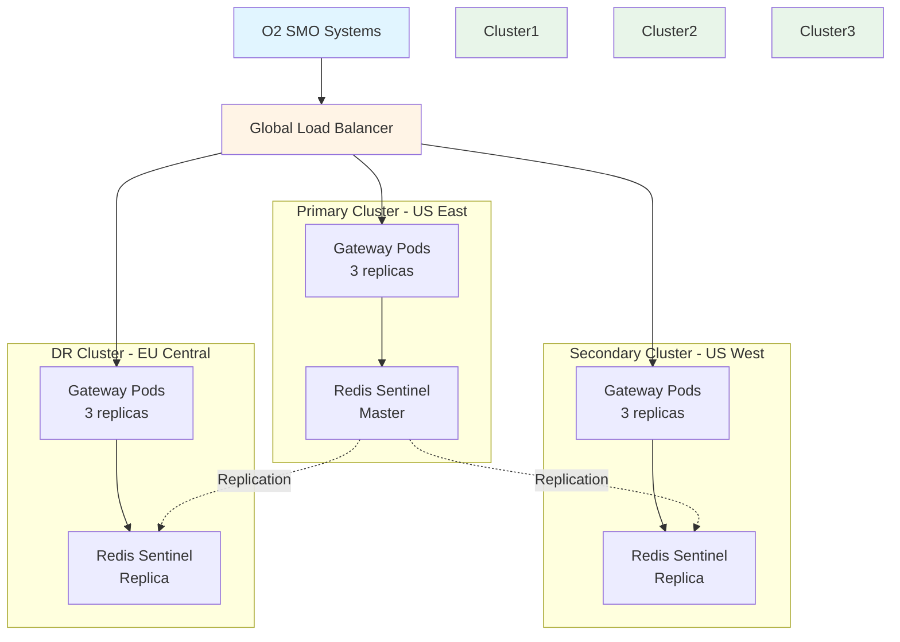

# Installation Guide

Comprehensive guide for deploying netweave in all environments.

## Table of Contents

- [Prerequisites](#prerequisites)
- [Quick Deploy (Development)](#quick-deploy-development)
- [Production Deployment with Helm](#production-deployment-with-helm)
- [Production Deployment with Operator](#production-deployment-with-operator)
- [Docker Compose for Development](#docker-compose-for-development)
- [Multi-Cluster Deployment](#multi-cluster-deployment)
- [Verification](#verification)
- [Troubleshooting](#troubleshooting)
- [Uninstallation](#uninstallation)

## Prerequisites

### Required Software

| Software | Minimum Version | Purpose | Installation |
|----------|-----------------|---------|--------------|
| **Kubernetes** | 1.30+ | Container orchestration | [Install kubectl](https://kubernetes.io/docs/tasks/tools/) |
| **Helm** | 3.0+ | Package manager | [Install Helm](https://helm.sh/docs/intro/install/) |
| **netweave-cli** | latest | CLI management tool | `make build-cli` |
| **Go** | 1.25.7+ | Development only | [Install Go](https://go.dev/doc/install) |
| **Docker** | 20.10+ | Container runtime | [Install Docker](https://docs.docker.com/get-docker/) |
| **Redis** | 7.4+ | State backend | Installed via Helm |
| **HashiCorp Vault** | 1.15+ | PKI certificate management | [Install Vault](https://developer.hashicorp.com/vault/docs/install) |

### Verify Prerequisites

```bash
# Kubernetes cluster access
kubectl cluster-info
kubectl version --short

# Helm installed
helm version --short

# Docker installed (for development)
docker --version

# Go installed (for development)
go version
```

### Cluster Requirements

**Development:**

- Single-node cluster (minikube, kind, Docker Desktop)
- 2 CPU cores
- 4GB RAM
- 10GB storage

**Production:**

- Multi-node cluster (3+ nodes)
- 8+ CPU cores per node
- 16GB+ RAM per node
- 50GB+ storage per node
- Load balancer support
- Persistent volume provisioner

### Network Requirements

| Port | Protocol | Direction | Purpose |
|------|----------|-----------|---------|
| 443 | TCP | Inbound | NGINX Ingress HTTPS (all hostnames) |
| 8080 | TCP | Internal | Admin port (OAuth2, health, docs, metrics) |
| 8443 | TCP | Internal | O2 port (mTLS, O2-IMS/DMS/SMO) |
| 8444 | TCP | Internal | TMF port (OAuth2, TMForum APIs) |
| 8445 | TCP | Internal | GraphQL port (OAuth2, GraphQL API) |
| 6379 | TCP | Internal | Redis communication |
| 9090 | TCP | Internal | Metrics (Prometheus) |

## Quick Deploy with netweave-cli (Recommended)

The fastest way to deploy netweave on a local Kubernetes cluster.

### Step 1: Clone and Build

```bash
git clone https://github.com/piwi3910/netweave.git
cd netweave
make build-cli
sudo cp build/netweave-cli /usr/local/bin/
```

### Step 2: Deploy Everything

```bash
# Full setup: Vault PKI, Helm chart, Keycloak bootstrap, certificates
netweave-cli setup all --verbose
```

This runs the following steps automatically:
1. **Vault** — Deploys Vault in production mode (TLS + file storage), initializes PKI engine (root CA, intermediate CA, server/client roles)
2. **Certificates** — Issues gateway server certificate, ingress TLS certificates (admin portal, Keycloak), and admin client certificate; creates K8s TLS secrets
3. **Helm** — Installs the netweave Helm chart (PostgreSQL, Redis, Keycloak, Gateway, NGINX Ingress), waits for all pods
4. **Keycloak** — Declares user profile attributes, creates default tenant, initializes roles with permissions, creates admin user with certificate binding

Credentials are saved to `~/.netweave/`:
- `credentials.json` — Vault root token and unseal keys
- `client.crt` / `client.key` — Admin client certificate (used automatically by API commands)
- `ca.crt` — CA certificate chain

### Step 3: Verify

```bash
# Check gateway health
netweave-cli api health

# List O2-IMS resources
netweave-cli api resource-types list
netweave-cli api resource-pools list
netweave-cli api deployment-managers list

# Test subscriptions
netweave-cli api subscriptions create --callback https://example.com/notify
netweave-cli api subscriptions list

# List users, roles, and tenants
netweave-cli users list --tenant=default
netweave-cli roles list
netweave-cli tenants list

# Issue and verify a certificate
netweave-cli certs issue --cn=test.netweave.local --type=client
netweave-cli certs verify --cert ~/.netweave/client.crt
```

### Individual Setup Steps

You can run each setup phase individually:

```bash
netweave-cli setup vault       # Deploy Vault + PKI
netweave-cli setup certs       # Issue TLS certificates
netweave-cli setup helm        # Install Helm chart
netweave-cli setup keycloak    # Bootstrap Keycloak
```

### Teardown

```bash
# Remove everything: Helm release, Vault, PVCs, namespace
netweave-cli setup teardown
```

## Quick Deploy (Manual)

For local development and testing without the CLI.

### Step 1: Clone Repository

```bash
git clone https://github.com/piwi3910/netweave.git
cd netweave
```

### Step 2: Install Development Tools

```bash
# Install linters, formatters, testing tools
make install-tools

# Install Git pre-commit hooks
make install-hooks

# Verify setup
make verify-setup
```

**Expected output:**

```text
✓ Go 1.25.7 installed
✓ golangci-lint installed
✓ Docker installed
✓ kubectl configured
✓ Kubernetes cluster reachable
✓ Pre-commit hooks installed
```

### Step 3: Build and Deploy

```bash
# Build binary and Docker image
make build
make docker-build

# Deploy to Kubernetes (development mode)
make deploy-dev
```

This deploys:

- netweave gateway (1 replica, HTTP)
- Redis (single instance, no auth)
- Development configuration

### Step 4: Install NGINX Ingress Controller

NGINX Ingress provides stable, hostname-based HTTPS access to all services:

```bash
# Install NGINX Ingress Controller
kubectl apply -f https://raw.githubusercontent.com/kubernetes/ingress-nginx/controller-v1.12.0/deploy/static/provider/cloud/deploy.yaml

# Wait for the controller to be ready
kubectl wait --namespace ingress-nginx \
  --for=condition=ready pod \
  --selector=app.kubernetes.io/component=controller \
  --timeout=120s

# Enable SSL passthrough (required for gateway mTLS)
kubectl -n ingress-nginx patch deployment ingress-nginx-controller --type=json \
  -p='[{"op":"add","path":"/spec/template/spec/containers/0/args/-","value":"--enable-ssl-passthrough"}]'

# Get the ingress controller ClusterIP (needed for admin portal OIDC)
kubectl get svc -n ingress-nginx ingress-nginx-controller -o jsonpath='{.spec.clusterIP}'
```

Add local DNS entries to `/etc/hosts`:

```bash
# Add to /etc/hosts (requires sudo)
echo "127.0.0.1 admin.netweave.local api.netweave.local auth.netweave.local o2.netweave.local tmf.netweave.local graphql.netweave.local" | sudo tee -a /etc/hosts
```

Update the ingress controller IP in `values-local.yaml` under
`adminPortal.hostAliases[0].ip` with the ClusterIP from above. This allows
the admin portal pod to resolve `auth.netweave.local` for OIDC discovery.

### Step 5: Verify Deployment

```bash
# Check pods
kubectl get pods -n netweave

# Check ingress resources
kubectl get ingress -n netweave

# Check gateway logs
kubectl logs -n netweave deployment/netweave -f

# Test Gateway API via mTLS passthrough
curl --cert ~/.netweave/client.crt --key ~/.netweave/client.key \
  --cacert ~/.netweave/ca.crt \
  https://api.netweave.local/o2ims-infrastructureInventory/v1/resourceTypes

# Test Keycloak OIDC discovery (NGINX TLS termination)
curl -sk https://auth.netweave.local/realms/netweave/.well-known/openid-configuration | jq .issuer
```

### Step 6: Access Services

All services are accessible via HTTPS with local hostnames:

| Service | URL | TLS Mode | Auth | Purpose |
|---------|-----|----------|------|---------|
| **O2 API** | `https://o2.netweave.local` | SSL Passthrough (mTLS) | mTLS client certs | O2-IMS, O2-DMS, O2-SMO endpoints |
| **Admin API** | `https://api.netweave.local` | TLS Termination | OAuth2 Bearer | Admin API, health, docs, metrics |
| **TMF API** | `https://tmf.netweave.local` | TLS Termination | OAuth2 Bearer | TMForum Open APIs |
| **GraphQL API** | `https://graphql.netweave.local` | TLS Termination | OAuth2 Bearer | GraphQL API |
| **Admin Portal** | `https://admin.netweave.local` | TLS Termination (Vault cert) | Keycloak OIDC | Web management UI |
| **Keycloak** | `https://auth.netweave.local` | TLS Termination (Vault cert) | Admin credentials | Identity provider |

The gateway runs 4 separate listeners. The O2 ingress uses ssl-passthrough so
mTLS client certificates reach the gateway directly (O-RAN spec compliant).
Admin, TMF, and GraphQL ingresses use TLS termination at NGINX. The admin
portal and Keycloak have their own dedicated ingresses.

```bash
# O2 API (requires mTLS client cert)
curl --cert ~/.netweave/client.crt --key ~/.netweave/client.key \
  --cacert ~/.netweave/ca.crt \
  https://o2.netweave.local/o2ims-infrastructureInventory/v1/resourcePools | jq

# Admin API (OAuth2, no client cert needed)
curl -k -H "Authorization: Bearer $TOKEN" \
  https://api.netweave.local/health

# Open Admin Portal in browser (trust CA cert first)
open https://admin.netweave.local

# Keycloak admin console
open https://auth.netweave.local/admin/
```

> **Browser TLS:** Since certificates are signed by a private Vault CA, import
> `~/.netweave/ca.crt` into your browser's trusted certificate authorities to
> avoid security warnings.
>
> **CLI access:** The `netweave-cli` tool auto-discovers the gateway via
> Kubernetes port-forwarding with mTLS. Use `--gateway-url https://o2.netweave.local`
> to route through the O2 ingress instead (requires CA trust).

## Production Deployment with Helm

Deploy netweave to production Kubernetes clusters using Helm charts.

### Architecture Overview


```mermaid
graph TB
    subgraph Kubernetes Cluster
        subgraph netweave namespace
            subgraph Gateway["Multi-Port Gateway (3 replicas)"]
                AdminPort[Admin :8080<br/>OAuth2]
                O2Port[O2 :8443<br/>mTLS]
                TMFPort[TMF :8444<br/>OAuth2]
                GQLPort[GraphQL :8445<br/>OAuth2]
            end

            subgraph Redis Sentinel
                R1[Redis Master]
                R2[Redis Replica 1]
                R3[Redis Replica 2]
            end

            subgraph Ingress["4 NGINX Ingress Resources"]
                IngAdmin[api.netweave.local<br/>TLS termination]
                IngO2[o2.netweave.local<br/>ssl-passthrough]
                IngTMF[tmf.netweave.local<br/>TLS termination]
                IngGQL[graphql.netweave.local<br/>TLS termination]
            end
        end
    end

    SMO[O2 SMO Client]
    Admin[Admin User]

    SMO -->|mTLS| IngO2
    Admin -->|OAuth2| IngAdmin
    IngO2 --> O2Port
    IngAdmin --> AdminPort
    IngTMF --> TMFPort
    IngGQL --> GQLPort

    AdminPort --> R1
    O2Port --> R1
    R1 --> R2
    R1 --> R3

    style SMO fill:#e1f5ff
    style Admin fill:#e1f5ff
    style Kubernetes fill:#fff4e6
    style Redis fill:#ffe6f0
    style Ingress fill:#e8f5e9
    style Gateway fill:#fff9e6
```

### Step 1: Install HashiCorp Vault

Vault manages PKI certificate lifecycle (root CA, intermediate CA, server/client certificates).

```bash
# Using netweave-cli (recommended)
netweave-cli setup vault --verbose

# Or install manually via Helm
helm repo add hashicorp https://helm.releases.hashicorp.com
helm repo update
helm install vault hashicorp/vault --namespace netweave --create-namespace

# Verify Vault is running
kubectl get pods -n netweave -l app.kubernetes.io/name=vault
```

### Step 2: Initialize PKI and Issue Certificates

```bash
# Using netweave-cli (recommended — handles root CA, intermediate CA, and roles)
netweave-cli setup certs --verbose

# This creates:
# - Root CA and intermediate CA in Vault PKI
# - Gateway server certificate (for all 4 ports)
# - Admin client certificate (for mTLS testing)
# - Ingress TLS certificates (admin portal, Keycloak)
# - K8s TLS secrets in netweave namespace
```

### Step 3: Install Redis with Sentinel

Redis Sentinel provides high availability for state storage.

```bash
# Add Bitnami repository
helm repo add bitnami https://charts.bitnami.com/bitnami
helm repo update

# Install Redis with Sentinel
helm install redis bitnami/redis \
  --namespace netweave \
  --create-namespace \
  --set sentinel.enabled=true \
  --set sentinel.replicas=3 \
  --set replica.replicaCount=2 \
  --set master.persistence.enabled=true \
  --set master.persistence.size=10Gi \
  --set auth.enabled=true \
  --set auth.password="$(openssl rand -base64 32)" \
  --set tls.enabled=true \
  --set tls.autoGenerated=true

# Wait for Redis to be ready
kubectl wait --for=condition=ready pod -l app.kubernetes.io/name=redis -n netweave --timeout=300s
```

### Step 4: Deploy netweave with Helm

Deploy the O2-IMS gateway with production configuration.

```bash
# Add netweave Helm repository (if public)
helm repo add netweave https://piwi3910.github.io/netweave
helm repo update

# Or use local chart
cd netweave/helm

# Install with production values
helm install netweave ./netweave \
  --namespace netweave \
  --values netweave/values-production.yaml \
  --set image.tag=v1.0.0 \
  --set redis.existingSecret=redis \
  --set tls.issuerRef.name=ca-issuer \
  --set tls.issuerRef.kind=ClusterIssuer

# Wait for gateway to be ready
kubectl wait --for=condition=ready pod -l app.kubernetes.io/name=netweave -n netweave --timeout=300s
```

### Step 5: Configure Ingress

The Helm chart creates 4 separate NGINX Ingress resources (one per gateway port):

| Ingress | Host | Backend Port | TLS Mode |
|---------|------|-------------|----------|
| `netweave-admin` | `api.netweave.local` | admin (8080) | TLS termination at NGINX |
| `netweave-o2` | `o2.netweave.local` | o2 (8443) | ssl-passthrough (mTLS end-to-end) |
| `netweave-tmf` | `tmf.netweave.local` | tmf (8444) | TLS termination at NGINX |
| `netweave-graphql` | `graphql.netweave.local` | graphql (8445) | TLS termination at NGINX |

These are automatically created by the Helm chart. Verify with:

```bash
kubectl get ingress -n netweave
```

Ensure your `/etc/hosts` file includes all hostnames:

```bash
# Required for local development
echo "127.0.0.1 admin.netweave.local api.netweave.local auth.netweave.local o2.netweave.local tmf.netweave.local graphql.netweave.local" | sudo tee -a /etc/hosts
```

### Step 6: Verify Production Deployment

```bash
# Check all pods are running
kubectl get pods -n netweave

# Check gateway logs (should show 4 "starting HTTP server" messages)
kubectl logs -n netweave -l app.kubernetes.io/name=netweave --tail=50

# Test admin port (OAuth2, no client cert)
curl -k https://api.netweave.local/health

# Test O2 port (mTLS, requires client cert)
curl -X GET https://o2.netweave.local/o2ims-infrastructureInventory/v1/resourcePools \
  --cert client.crt \
  --key client.key \
  --cacert ca.crt

# Check Prometheus metrics (admin port)
curl -k https://api.netweave.local/metrics

# Verify all 4 ingress resources
kubectl get ingress -n netweave
```

## Production Deployment with Operator

Deploy netweave using the Kubernetes Operator for advanced lifecycle management.

### Architecture with Operator


```mermaid
graph TB
    subgraph Kubernetes Cluster
        Operator[O2IMS Operator<br/>Lifecycle Management]
        CRD[O2IMSGateway CRD]

        subgraph Managed Resources
            GW[Gateway Deployment<br/>Auto-scaled]
            Redis[Redis Sentinel<br/>Auto-configured]
            Certs[TLS Certificates<br/>Auto-renewed]
            Config[ConfigMaps<br/>Auto-generated]
        end
    end

    User[Administrator]

    User -->|kubectl apply| CRD
    CRD --> Operator
    Operator --> GW
    Operator --> Redis
    Operator --> Certs
    Operator --> Config

    style User fill:#e1f5ff
    style Operator fill:#fff4e6
    style Managed fill:#e8f5e9
```

### Step 1: Install Operator CRD

```bash
# Install Custom Resource Definition
kubectl apply -f https://raw.githubusercontent.com/piwi3910/netweave/main/deployments/operator/crd.yaml

# Verify CRD is installed
kubectl get crd o2imsgateways.o2ims.oran.org
```

### Step 2: Deploy Operator

```bash
# Install operator
kubectl apply -f https://raw.githubusercontent.com/piwi3910/netweave/main/deployments/operator/operator.yaml

# Verify operator is running
kubectl get pods -n o2ims-operator-system
```

### Step 3: Create O2IMSGateway Resource

Create a production gateway instance:

```bash
kubectl apply -f - <<EOF
apiVersion: o2ims.oran.org/v1alpha1
kind: O2IMSGateway
metadata:
  name: netweave-production
  namespace: netweave
spec:
  # Gateway configuration
  replicas: 3
  version: "v1.0.0"

  # TLS configuration
  tls:
    enabled: true
    mode: "require-and-verify"
    issuerRef:
      name: ca-issuer
      kind: ClusterIssuer

  # Redis configuration (auto-deployed)
  redis:
    sentinel: true
    replicas: 3
    persistence:
      enabled: true
      size: 10Gi
    tls:
      enabled: true

  # Adapter configuration
  adapter:
    backend: "kubernetes"
    kubernetes:
      incluster: true

  # Observability
  observability:
    metrics:
      enabled: true
    tracing:
      enabled: true
      jaeger:
        endpoint: "http://jaeger-collector:14268/api/traces"

  # Resource limits
  resources:
    requests:
      cpu: "500m"
      memory: "512Mi"
    limits:
      cpu: "2000m"
      memory: "2Gi"

  # High availability
  podDisruptionBudget:
    minAvailable: 2

  # Auto-scaling
  autoscaling:
    enabled: true
    minReplicas: 3
    maxReplicas: 10
    targetCPUUtilizationPercentage: 70
EOF
```

### Step 4: Verify Operator Deployment

```bash
# Check O2IMSGateway resource
kubectl get o2imsgateway -n netweave

# Check managed resources
kubectl get all -n netweave -l app.kubernetes.io/managed-by=o2ims-operator

# Check operator logs
kubectl logs -n o2ims-operator-system deployment/o2ims-operator -f
```

### Step 5: Upgrade via Operator

The operator handles rolling updates automatically:

```bash
# Update gateway version
kubectl patch o2imsgateway netweave-production -n netweave \
  --type=merge \
  -p '{"spec":{"version":"v1.1.0"}}'

# Watch rollout
kubectl rollout status deployment/netweave-production-gateway -n netweave
```

## Docker Compose for Development

Use Docker Compose for local development without Kubernetes.

### Step 1: Create docker-compose.yaml

```bash
cd netweave

# Use provided docker-compose.yaml
cat docker-compose.yaml
```

**docker-compose.yaml:**

```yaml
version: '3.8'

services:
  gateway:
    container_name: netweave-gateway
    image: netweave:latest
    build:
      context: .
      dockerfile: Dockerfile
    ports:
      - "8080:8080"
    environment:
      - NETWEAVE_ENV=dev
      - NETWEAVE_REDIS_ADDRESS=redis:6379
      - NETWEAVE_ADAPTER_BACKEND=kubernetes
    volumes:
      - ~/.kube/config:/root/.kube/config:ro
      - ./config:/app/config:ro
    depends_on:
      - redis
    healthcheck:
      test: ["CMD", "wget", "-qO-", "http://localhost:8080/health"]
      interval: 10s
      timeout: 5s
      retries: 3
    networks:
      - netweave

  redis:
    container_name: netweave-redis
    image: redis:7.4-alpine
    ports:
      - "6379:6379"
    volumes:
      - redis-data:/data
    healthcheck:
      test: ["CMD", "redis-cli", "ping"]
      interval: 10s
      timeout: 3s
      retries: 3
    networks:
      - netweave

networks:
  netweave:
    driver: bridge

volumes:
  redis-data:
```

### Step 2: Start Services

```bash
# Build and start
docker compose up -d

# Check status
docker compose ps

# View logs
docker compose logs -f
```

### Step 3: Verify Docker Compose Deployment

```bash
# Check health
curl http://localhost:8080/health

# Test API
curl http://localhost:8080/o2ims-infrastructureInventory/v1/resourcePools | jq
```

See [Quickstart Guide](quickstart.md) for detailed Docker Compose usage.

## Multi-Cluster Deployment

Deploy netweave across multiple Kubernetes clusters for high availability.

### Architecture


```mermaid
graph TB
    subgraph Cluster 1 [Primary Cluster - US East]
        GW1[Gateway Pods<br/>3 replicas]
        Redis1[Redis Sentinel<br/>Master]
    end

    subgraph Cluster 2 [Secondary Cluster - US West]
        GW2[Gateway Pods<br/>3 replicas]
        Redis2[Redis Sentinel<br/>Replica]
    end

    subgraph Cluster 3 [DR Cluster - EU Central]
        GW3[Gateway Pods<br/>3 replicas]
        Redis3[Redis Sentinel<br/>Replica]
    end

    LB[Global Load Balancer]
    SMO[O2 SMO Systems]

    SMO --> LB
    LB --> GW1
    LB --> GW2
    LB --> GW3

    GW1 --> Redis1
    GW2 --> Redis2
    GW3 --> Redis3

    Redis1 -.Replication.-> Redis2
    Redis1 -.Replication.-> Redis3

    style SMO fill:#e1f5ff
    style LB fill:#fff4e6
    style Cluster1 fill:#e8f5e9
    style Cluster2 fill:#e8f5e9
    style Cluster3 fill:#e8f5e9
```

### Step 1: Configure Redis Replication

Deploy Redis in primary cluster:

```bash
# Primary cluster (us-east)
kubectl config use-context cluster-us-east

helm install redis-primary bitnami/redis \
  --namespace netweave \
  --create-namespace \
  --set sentinel.enabled=true \
  --set auth.enabled=true \
  --set auth.password="shared-secret" \
  --set tls.enabled=true \
  --set master.service.type=LoadBalancer

# Get primary Redis external IP
export REDIS_PRIMARY_IP=$(kubectl get svc redis-primary -n netweave -o jsonpath='{.status.loadBalancer.ingress[0].ip}')
```

Deploy Redis replicas in secondary clusters:

```bash
# Secondary cluster (us-west)
kubectl config use-context cluster-us-west

helm install redis-replica bitnami/redis \
  --namespace netweave \
  --create-namespace \
  --set sentinel.enabled=true \
  --set auth.enabled=true \
  --set auth.password="shared-secret" \
  --set tls.enabled=true \
  --set replica.replicaCount=2 \
  --set master.service.externalIPs[0]=$REDIS_PRIMARY_IP
```

### Step 2: Deploy Gateway to All Clusters

Deploy to each cluster with cluster-specific configuration:

```bash
# Primary cluster
kubectl config use-context cluster-us-east
helm install netweave-primary ./helm/netweave \
  --namespace netweave \
  --set cluster.name=us-east \
  --set redis.sentinelAddresses[0]=redis-primary-sentinel:26379

# Secondary cluster
kubectl config use-context cluster-us-west
helm install netweave-secondary ./helm/netweave \
  --namespace netweave \
  --set cluster.name=us-west \
  --set redis.sentinelAddresses[0]=redis-replica-sentinel:26379
```

### Step 3: Configure Global Load Balancer

Configure traffic manager to distribute requests:

```bash
# Example: AWS Route53 with health checks
aws route53 change-resource-record-sets \
  --hosted-zone-id Z1234567890ABC \
  --change-batch file://route53-multicluster.json
```

**route53-multicluster.json:**

```json
{
  "Changes": [
    {
      "Action": "CREATE",
      "ResourceRecordSet": {
        "Name": "netweave.example.com",
        "Type": "A",
        "SetIdentifier": "us-east-cluster",
        "Weight": 100,
        "TTL": 60,
        "ResourceRecords": [{"Value": "192.0.2.1"}],
        "HealthCheckId": "abcd1234"
      }
    },
    {
      "Action": "CREATE",
      "ResourceRecordSet": {
        "Name": "netweave.example.com",
        "Type": "A",
        "SetIdentifier": "us-west-cluster",
        "Weight": 100,
        "TTL": 60,
        "ResourceRecords": [{"Value": "192.0.2.2"}],
        "HealthCheckId": "efgh5678"
      }
    }
  ]
}
```

## Verification

Comprehensive verification checklist after deployment.

### Using netweave-cli (Recommended)

```bash
# Gateway health
netweave-cli api health

# List all O2-IMS entities
netweave-cli api deployment-managers list
netweave-cli api resource-pools list
netweave-cli api resource-types list
netweave-cli api resources list

# Check subscriptions
netweave-cli api subscriptions list

# Verify certificates
netweave-cli certs verify --cert ~/.netweave/client.crt

# Check users, roles, and tenants
netweave-cli users list --tenant=default
netweave-cli roles list
netweave-cli tenants list
```

### Manual Health Checks

```bash
# Gateway health (admin port, no mTLS)
curl -k https://api.netweave.local/health

# Redis connectivity
kubectl exec -n netweave deployment/netweave -- \
  redis-cli -h redis -p 6379 PING

# O2-IMS API (O2 port, mTLS)
curl --cert client.crt --key client.key --cacert ca.crt \
  https://o2.netweave.local/o2ims-infrastructureInventory/v1/deploymentManagers
```

### API Functionality

```bash
# List resource pools (O2 port, mTLS)
curl -X GET https://o2.netweave.local/o2ims-infrastructureInventory/v1/resourcePools \
  --cert client.crt --key client.key --cacert ca.crt

# Create subscription (O2 port, mTLS)
curl -X POST https://o2.netweave.local/o2ims-infrastructureInventory/v1/subscriptions \
  --cert client.crt --key client.key --cacert ca.crt \
  -H "Content-Type: application/json" \
  -d '{"callback":"https://smo.example.com/notify"}'
```

### TLS Certificate Verification

```bash
# Using netweave-cli
netweave-cli certs verify --cert client.crt --ca ca.crt

# Test O2 port (mTLS) via openssl
openssl s_client -connect o2.netweave.local:443 \
  -CAfile ca.crt \
  -cert client.crt \
  -key client.key

# Test admin port (no client cert) via openssl
openssl s_client -connect api.netweave.local:443 \
  -CAfile ca.crt

# Verify TLS secrets
kubectl get secrets -n netweave -l type=kubernetes.io/tls
```

### Performance Testing

```bash
# Install K6 load testing tool
brew install k6  # macOS
# or
wget https://github.com/grafana/k6/releases/download/v0.50.0/k6-v0.50.0-linux-amd64.tar.gz

# Run performance test
k6 run tests/performance/load-test.js
```

## Troubleshooting

Common issues and solutions.

### Gateway Pods CrashLooping

**Symptom:** Pods restart repeatedly

```bash
# Check pod status
kubectl get pods -n netweave

# Check logs
kubectl logs -n netweave deployment/netweave-gateway --tail=100

# Common causes:
# 1. Redis connection failed
# 2. Invalid configuration
# 3. Certificate issues
# 4. Resource limits too low
```

**Solution:**

```bash
# Check Redis connectivity
kubectl exec -n netweave deployment/netweave-gateway -- \
  redis-cli -h redis -p 6379 PING

# Check configuration
kubectl get configmap -n netweave netweave-config -o yaml

# Increase resource limits
kubectl patch deployment netweave-gateway -n netweave \
  --type=json \
  -p='[{"op":"replace","path":"/spec/template/spec/containers/0/resources/limits/memory","value":"2Gi"}]'
```

### TLS Certificate Errors

**Symptom:** `x509: certificate signed by unknown authority`

```bash
# Check TLS secrets
kubectl get secrets -n netweave -l type=kubernetes.io/tls

# Check Vault PKI status
netweave-cli certs verify --cert ~/.netweave/client.crt
```

**Solution:**

```bash
# Re-issue certificates via CLI
netweave-cli setup certs --verbose

# Or manually reissue via Vault
netweave-cli certs issue --cn=gateway.netweave.local --type=server

# Restart gateway to pick up new certs
kubectl rollout restart deployment/netweave -n netweave
```

### Redis Connection Issues

**Symptom:** `failed to connect to Redis`

```bash
# Check Redis pods
kubectl get pods -n netweave -l app.kubernetes.io/name=redis

# Test Redis connection
kubectl exec -n netweave redis-master-0 -- redis-cli ping
```

**Solution:**

```bash
# Check Redis password secret
kubectl get secret -n netweave redis -o jsonpath='{.data.redis-password}' | base64 -d

# Update gateway config with correct password
kubectl create secret generic redis-password \
  --from-literal=password=$(openssl rand -base64 32) \
  -n netweave \
  --dry-run=client -o yaml | kubectl apply -f -

# Restart gateway
kubectl rollout restart deployment/netweave-gateway -n netweave
```

### Ingress Not Working

**Symptom:** Cannot reach gateway via ingress hostname

```bash
# Check all 4 ingress resources
kubectl get ingress -n netweave
kubectl describe ingress netweave-admin -n netweave
kubectl describe ingress netweave-o2 -n netweave

# Check ingress controller logs
kubectl logs -n ingress-nginx deployment/ingress-nginx-controller

# Verify ssl-passthrough is enabled (required for O2 mTLS)
kubectl -n ingress-nginx get deployment ingress-nginx-controller -o yaml | grep ssl-passthrough
```

**Solution:**

```bash
# Verify /etc/hosts has all hostnames
cat /etc/hosts | grep netweave

# Check ingress controller
kubectl get pods -n ingress-nginx

# Test direct service access (admin port)
kubectl port-forward -n netweave svc/netweave 8080:8080
curl https://localhost:8080/health --insecure
```

## Uninstallation

Complete removal of netweave and dependencies.

### Using netweave-cli (Recommended)

```bash
# Remove everything: Helm release, Vault, PVCs, namespace
netweave-cli setup teardown
```

### Uninstall Helm Deployment

```bash
# Uninstall gateway
helm uninstall netweave -n netweave

# Uninstall Redis
helm uninstall redis -n netweave

# Delete namespace (removes all resources)
kubectl delete namespace netweave

# Uninstall Vault (optional)
helm uninstall vault -n netweave
```

### Uninstall Operator Deployment

```bash
# Delete O2IMSGateway resource
kubectl delete o2imsgateway netweave-production -n netweave

# Uninstall operator
kubectl delete -f deployments/operator/operator.yaml

# Delete CRD (removes all instances)
kubectl delete -f deployments/operator/crd.yaml

# Delete namespace
kubectl delete namespace netweave
kubectl delete namespace o2ims-operator-system
```

### Clean Up Docker Compose

```bash
# Stop and remove containers
cd netweave
docker compose down

# Remove volumes (data)
docker compose down -v

# Remove images
docker compose down --rmi all -v
```

### Verify Complete Removal

```bash
# Check no pods remain
kubectl get pods --all-namespaces | grep netweave

# Check no PVCs remain
kubectl get pvc --all-namespaces | grep o2ims

# Check no CRDs remain
kubectl get crd | grep o2ims
```

## Next Steps

After successful installation:

1. **[First Steps Tutorial](first-steps.md)** - Learn O2-IMS API basics
   - Create resource pools
   - Query resources
   - Set up subscriptions
   - Test webhooks

2. **[Configuration Guide](../configuration.md)** - Customize deployment
   - Environment-specific configs
   - Adapter configuration
   - Security settings
   - Observability options

3. **[Operations Guide](../operations.md)** - Day-2 operations
   - Monitoring and alerting
   - Backup and restore
   - Upgrades and rollbacks
   - Troubleshooting

4. **[Security Guide](../security/README.md)** - Harden deployment
   - mTLS configuration
   - RBAC policies
   - Network policies
   - Secret management

## Support

- **Documentation:** [docs/](../)
- **Issues:** [GitHub Issues](https://github.com/piwi3910/netweave/issues)
- **Discussions:** [GitHub Discussions](https://github.com/piwi3910/netweave/discussions)
- **Security:** security@example.com
