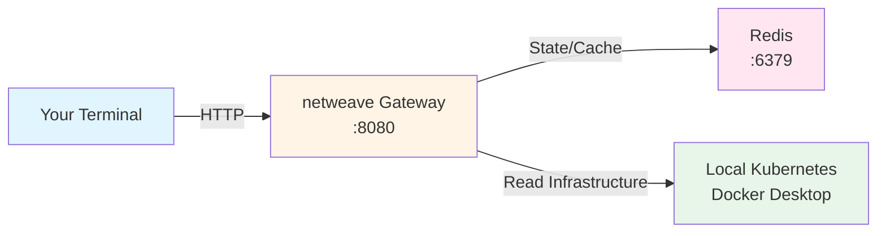

# 5-Minute Quickstart

Get netweave running locally in under 5 minutes using Docker Compose.

## What You'll Get

By the end of this quickstart, you'll have:

- Complete O2-IMS gateway running locally
- Redis backend for subscriptions and caching
- Working API endpoints at `http://localhost:8080`
- Sample Kubernetes backend adapter

## Prerequisites

- **Docker Desktop** or **Docker Engine** 20.10+
- **Docker Compose** v2.0+
- **curl** or **HTTPie** for API testing
- **2GB RAM** available

### Verify Prerequisites

```bash
# Check Docker
docker --version
# Expected: Docker version 20.10.0+

# Check Docker Compose
docker compose version
# Expected: Docker Compose version v2.0.0+

# Check available memory
docker info | grep "Total Memory"
# Expected: >2GB
```

## Quick Deploy

### Step 1: Clone Repository

```bash
# Clone the repository
git clone https://github.com/piwi3910/netweave.git
cd netweave
```

### Step 2: Start Services

```bash
# Start gateway + Redis with Docker Compose
docker compose up -d

# Wait for services to be ready (10-30 seconds)
docker compose ps
```

**Expected output:**

```text
NAME                IMAGE                 STATUS
netweave-gateway    netweave:latest       Up 10 seconds (healthy)
netweave-redis      redis:7.4-alpine      Up 15 seconds (healthy)
```

### Step 3: Verify Gateway is Running

```bash
# Check health endpoint
curl http://localhost:8080/health

# Expected response:
# {"status":"ok","timestamp":"2026-01-12T21:00:00Z"}
```

## First API Call

Make your first O2-IMS API call to list resource pools:

```bash
curl -X GET http://localhost:8080/o2ims-infrastructureInventory/v1/resourcePools | jq
```

**Expected response:**

```json
{
  "items": [
    {
      "resourcePoolId": "pool-default",
      "name": "Default Compute Pool",
      "description": "Default Kubernetes node pool",
      "location": "local",
      "oCloudId": "ocloud-local-k8s",
      "extensions": {
        "backend": "kubernetes",
        "nodeCount": 1
      }
    }
  ],
  "metadata": {
    "totalCount": 1
  }
}
```

**Success!** You've successfully deployed netweave and made your first API call.

## What's Running

Your local environment now includes:



### Services Overview

| Service | Port | Purpose | Status Check |
|---------|------|---------|--------------|
| **netweave Gateway** | 8080 | O2-IMS API | `curl localhost:8080/health` |
| **Redis** | 6379 | Subscriptions, cache | `docker exec netweave-redis redis-cli ping` |
| **Kubernetes** | - | Infrastructure backend | `kubectl get nodes` |

### Key Configuration

The development environment uses `config/config.dev.yaml`:

```yaml
server:
  port: 8080
  tls:
    enabled: false  # HTTP only for local testing

redis:
  address: "redis:6379"
  password: ""     # No auth for local dev

adapter:
  backend: "kubernetes"
  kubernetes:
    incluster: false
    kubeconfig: "~/.kube/config"

observability:
  logging:
    level: debug
    development: true
```

## Try More API Calls

### 1. List Resource Types

```bash
curl -X GET http://localhost:8080/o2ims-infrastructureInventory/v1/resourceTypes | jq
```

**Response:**

```json
{
  "items": [
    {
      "resourceTypeId": "kubernetes-node",
      "name": "Kubernetes Node",
      "vendor": "Kubernetes",
      "version": "v1.30.0"
    },
    {
      "resourceTypeId": "kubernetes-pod",
      "name": "Kubernetes Pod",
      "vendor": "Kubernetes",
      "version": "v1.30.0"
    }
  ]
}
```

### 2. List Resources in a Pool

```bash
curl -X GET http://localhost:8080/o2ims-infrastructureInventory/v1/resourcePools/pool-default/resources | jq
```

**Response:**

```json
{
  "items": [
    {
      "resourceId": "node-docker-desktop",
      "resourcePoolId": "pool-default",
      "resourceTypeId": "kubernetes-node",
      "description": "Docker Desktop Kubernetes node",
      "extensions": {
        "cpu": "8",
        "memory": "16Gi",
        "status": "Ready"
      }
    }
  ]
}
```

### 3. Get Deployment Managers

```bash
curl -X GET http://localhost:8080/o2ims-infrastructureInventory/v1/deploymentManagers | jq
```

**Response:**

```json
{
  "items": [
    {
      "deploymentManagerId": "dm-kubernetes-local",
      "name": "Local Kubernetes",
      "description": "Docker Desktop Kubernetes cluster",
      "oCloudId": "ocloud-local-k8s",
      "serviceUri": "https://kubernetes.default.svc",
      "extensions": {
        "version": "v1.30.0",
        "backend": "kubernetes"
      }
    }
  ]
}
```

### 4. Create a Subscription (Webhooks)

First, set up a webhook receiver (optional):

```bash
# In a separate terminal, start a simple webhook receiver
docker run --rm -p 9000:8080 --network netweave_default \
  mendhak/http-https-echo:31
```

Then create a subscription:

```bash
curl -X POST http://localhost:8080/o2ims-infrastructureInventory/v1/subscriptions \
  -H "Content-Type: application/json" \
  -d '{
    "callback": "http://host.docker.internal:9000/webhook",
    "consumerSubscriptionId": "quickstart-sub-1",
    "filter": {
      "resourcePoolId": "pool-default"
    }
  }' | jq
```

**Response:**

```json
{
  "subscriptionId": "550e8400-e29b-41d4-a716-446655440000",
  "consumerSubscriptionId": "quickstart-sub-1",
  "callback": "http://host.docker.internal:9000/webhook",
  "filter": {
    "resourcePoolId": "pool-default"
  }
}
```

Now any changes to resources in `pool-default` will trigger webhook notifications to your receiver.

## Access Swagger UI

The gateway includes interactive API documentation:

```bash
# Open Swagger UI in your browser
open http://localhost:8080/docs/

# Or download the OpenAPI spec
curl http://localhost:8080/openapi.yaml > o2ims-api.yaml
```

**Swagger UI Features:**

- Interactive API exploration
- Try out endpoints directly
- See request/response schemas
- Generate example payloads

## Check Logs

### View Gateway Logs

```bash
# Follow gateway logs
docker compose logs -f gateway

# Last 100 lines
docker compose logs --tail=100 gateway
```

**Sample log output:**

```json
{
  "level": "info",
  "ts": "2026-01-12T21:00:00.000Z",
  "caller": "server/server.go:123",
  "msg": "Gateway started successfully",
  "port": 8080,
  "adapter": "kubernetes"
}
```

### View Redis Logs

```bash
# Redis logs
docker compose logs -f redis
```

### Monitor Redis State

```bash
# Connect to Redis CLI
docker exec -it netweave-redis redis-cli

# List all subscriptions
KEYS subscription:*

# View subscription details
GET subscription:550e8400-e29b-41d4-a716-446655440000

# Exit Redis CLI
exit
```

## Stopping and Cleaning Up

### Stop Services

```bash
# Stop containers (keeps data)
docker compose stop

# Start again
docker compose start
```

### Complete Cleanup

```bash
# Stop and remove containers + networks
docker compose down

# Remove volumes (clears all data)
docker compose down -v

# Remove images
docker compose down --rmi all -v
```

## Troubleshooting

### Gateway Won't Start

**Symptom:** `docker compose up` fails or gateway container restarts

**Solution:**

```bash
# Check logs
docker compose logs gateway

# Common issues:
# 1. Port 8080 already in use
lsof -i :8080  # Find process using port 8080
docker compose up -d  # Retry

# 2. Cannot connect to Docker Kubernetes
kubectl cluster-info  # Verify Kubernetes is running
```

### Cannot Reach API

**Symptom:** `curl http://localhost:8080/health` fails

**Solution:**

```bash
# Check gateway is running
docker compose ps

# Check gateway health
docker exec netweave-gateway wget -qO- http://localhost:8080/health

# Check port forwarding
docker port netweave-gateway
# Expected: 8080/tcp -> 0.0.0.0:8080
```

### Empty Resource Pools

**Symptom:** API returns empty arrays

**Solution:**

```bash
# Verify Kubernetes backend is accessible
docker exec netweave-gateway kubectl get nodes

# If kubectl fails, check kubeconfig mount
docker inspect netweave-gateway | grep -A5 Mounts

# Restart with correct kubeconfig
docker compose down
docker compose up -d
```

### Redis Connection Failed

**Symptom:** Logs show "failed to connect to Redis"

**Solution:**

```bash
# Check Redis is running
docker compose ps redis

# Test Redis connectivity
docker exec netweave-redis redis-cli ping
# Expected: PONG

# Restart Redis
docker compose restart redis
```

## Next Steps

Now that you have netweave running locally, continue with:

1. **[Installation Guide](installation.md)** - Production deployment options
   - Kubernetes with Helm
   - Kubernetes with Operator
   - Multi-cluster deployment

2. **[First Steps Tutorial](first-steps.md)** - Learn O2-IMS concepts
   - Understanding resource pools and resources
   - Creating and managing subscriptions
   - Working with webhooks
   - Common API patterns

3. **[Architecture Documentation](../architecture.md)** - Deep dive into design
   - Multi-backend support
   - Subscription controller
   - Security architecture
   - High availability

4. **[API Mapping Guide](../api-mapping.md)** - O2-IMS to Kubernetes mappings
   - Resource type mappings
   - Filter translations
   - Extension attributes

## Configuration Customization

### Override Default Config

Create a custom configuration file:

```yaml
# config/custom.yaml
server:
  port: 9090  # Change port

redis:
  address: "localhost:6379"  # External Redis

adapter:
  backend: "kubernetes"
  kubernetes:
    kubeconfig: "/path/to/custom/kubeconfig"

observability:
  logging:
    level: info  # Less verbose
```

Use it with Docker Compose:

```bash
# Override config file
docker compose run -v $(pwd)/config/custom.yaml:/app/config/config.yaml \
  gateway
```

### Enable TLS for Local Testing

Generate self-signed certificates:

```bash
# Generate CA and certificates
make dev-certs

# Update docker-compose.yaml to mount certs
# Update config/config.dev.yaml to enable TLS
```

See [Security Documentation](../security.md) for certificate management.

## Development vs. Production

This quickstart uses **development configuration** optimized for local testing:

| Feature | Development | Production |
|---------|-------------|------------|
| TLS/mTLS | Disabled (HTTP) | Required (HTTPS) |
| Authentication | None | Required |
| Rate Limiting | Disabled | Enabled |
| Logging | Debug, console | Info, JSON |
| Redis Auth | None | Password + TLS |
| CORS | Enabled | Restrictive |

**For production deployment**, see:

- [Installation Guide](installation.md) for production deployment
- [Security Documentation](../security.md) for hardening
- [Operations Guide](../operations.md) for monitoring

## Support and Resources

- **Documentation:** [docs/](../)
- **API Reference:** Swagger UI at `http://localhost:8080/docs/`
- **Issues:** [GitHub Issues](https://github.com/piwi3910/netweave/issues)
- **Discussions:** [GitHub Discussions](https://github.com/piwi3910/netweave/discussions)

## Summary

You've successfully:

- ✅ Deployed netweave with Docker Compose
- ✅ Made your first O2-IMS API call
- ✅ Explored resource pools, resources, and types
- ✅ Created a subscription for webhook notifications
- ✅ Accessed interactive API documentation

**Time to complete:** ~5 minutes

**What's running:**

- netweave gateway on port 8080
- Redis on port 6379
- Connected to local Kubernetes cluster

**Next:** Follow the [First Steps Tutorial](first-steps.md) to learn O2-IMS concepts and common API patterns.
