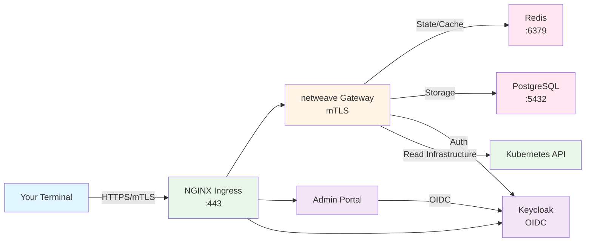

# 5-Minute Quickstart

Get netweave running on a local Kubernetes cluster in under 5 minutes using the `netweave-cli`.

## What You'll Get

By the end of this quickstart, you'll have:

- Complete O2-IMS gateway running on Kubernetes
- Vault PKI with Root CA, Intermediate CA, and mTLS certificates
- PostgreSQL, Redis, and Keycloak deployed and configured
- Admin Portal with Keycloak OIDC authentication
- NGINX Ingress with TLS for all services
- Working API endpoints at `https://o2.netweave.local` (O2-IMS) and `https://api.netweave.local` (Admin)

## Prerequisites

- **Docker Desktop** with Kubernetes enabled, or a **Kind** cluster
- **kubectl** configured and connected to your cluster
- **Helm** 3.x installed
- **NGINX Ingress Controller** installed (see [Installation Guide](installation.md#step-4-install-nginx-ingress-controller))
- **Go 1.25.7+** (to build the CLI)
- **2GB RAM** available

### Verify Prerequisites

```bash
# Check Kubernetes cluster
kubectl cluster-info
# Expected: Kubernetes control plane is running

# Check Helm
helm version --short
# Expected: v3.x.x

# Check Go
go version
# Expected: go1.25.7 or later
```

### DNS Setup

Add local DNS entries to `/etc/hosts`:

```bash
echo "127.0.0.1 admin.netweave.local api.netweave.local auth.netweave.local o2.netweave.local tmf.netweave.local graphql.netweave.local" | sudo tee -a /etc/hosts
```

## Quick Deploy

### Step 1: Clone and Build

```bash
git clone https://github.com/piwi3910/netweave.git
cd netweave
make build-cli
make docker-build
```

Load the gateway image into your cluster nodes (Kind example):

```bash
# For Kind clusters
kind load docker-image netweave:latest

# For Docker Desktop with Kind nodes
docker save netweave:latest | docker exec -i <worker-node> ctr -n k8s.io images import --all-platforms -
```

### Step 2: Deploy Everything

```bash
./build/netweave-cli setup all --verbose
```

This runs four phases automatically:

1. **Vault** — Deploys Vault with TLS, initializes PKI engine (root CA, intermediate CA, server/client roles)
2. **Certificates** — Issues gateway server certificate, ingress TLS certificates, and admin client certificate
3. **Helm** — Installs the netweave Helm chart (PostgreSQL, Redis, Keycloak, Gateway, Admin Portal)
4. **Keycloak** — Declares user profile attributes, creates default tenant, initializes roles, creates admin user

Credentials are saved to `~/.netweave/`:

- `credentials.json` — Vault root token and unseal keys
- `client.crt` / `client.key` — Admin client certificate for mTLS API access
- `ca.crt` — CA certificate chain

### Step 3: Verify Gateway is Running

```bash
./build/netweave-cli api health
```

**Expected output:**

```text
Status: healthy

Gateway is healthy
```

## First API Call

Make your first O2-IMS API call to list resource types:

Using `netweave-cli`:

```bash
./build/netweave-cli api resource-types list
```

**Expected output:**

```text
ID                     NAME                   VENDOR   MODEL  VERSION
---------------------  ---------------------  -------  -----  -------
k8s-node-type-generic  k8s-node-type-generic  Unknown  <nil>  v1.33.1

1 item(s)
```

<details>
<summary>Using curl with mTLS</summary>

```bash
curl --cert ~/.netweave/client.crt --key ~/.netweave/client.key \
  --cacert ~/.netweave/ca.crt \
  https://o2.netweave.local/o2ims-infrastructureInventory/v1/resourceTypes
```

</details>

**Success!** You've deployed netweave and made your first API call.

## What's Running

Your local environment now includes:


```mermaid
graph LR
    Client[Your Terminal]
    Ingress[NGINX Ingress<br/>:443]
    Gateway[netweave Gateway<br/>mTLS]
    Redis[Redis<br/>:6379]
    PG[PostgreSQL<br/>:5432]
    KC[Keycloak<br/>OIDC]
    Admin[Admin Portal]
    K8s[Kubernetes API]

    Client -->|HTTPS/mTLS| Ingress
    Ingress --> Gateway
    Ingress --> Admin
    Ingress --> KC
    Gateway -->|State/Cache| Redis
    Gateway -->|Storage| PG
    Gateway -->|Auth| KC
    Gateway -->|Read Infrastructure| K8s
    Admin -->|OIDC| KC

    style Client fill:#e1f5ff
    style Ingress fill:#e8f5e9
    style Gateway fill:#fff4e6
    style Redis fill:#ffe6f0
    style PG fill:#ffe6f0
    style KC fill:#f3e5f5
    style Admin fill:#f3e5f5
    style K8s fill:#e8f5e9
```

### Services Overview

| Service | URL | Auth | Purpose |
|---------|-----|------|---------|
| **O2-IMS API** | `https://o2.netweave.local` | mTLS client cert | O2-IMS API endpoints |
| **Admin API** | `https://api.netweave.local` | OAuth2/OIDC (Keycloak) | Admin API endpoints |
| **Admin Portal** | `https://admin.netweave.local` | OAuth2/OIDC (Keycloak) | Web management UI |
| **Keycloak** | `https://auth.netweave.local` | Admin credentials | Identity provider |

### Authentication

netweave uses two authentication mechanisms:

- **O2-IMS API** — mTLS client certificates (O-RAN spec compliant). Use the client cert from `~/.netweave/`.
- **Admin Portal** — OAuth2/OIDC via Keycloak. Log in through the browser with your Keycloak credentials.

## Try More API Calls

### 1. List Deployment Managers

```bash
./build/netweave-cli api deployment-managers list
```

**Response:**

```text
ID               NAME                                 DESCRIPTION
---------------  -----------------------------------  ------------------------------------------
netweave-k8s-dm  Kubernetes Cluster: netweave-k8s-dm  Kubernetes-based O2-IMS Deployment Manager

1 item(s)
```

### 2. Create a Subscription (Webhooks)

```bash
./build/netweave-cli api subscriptions create --callback https://example.com/notify
```

**Response:**

```text
Subscription created: sub-<uuid>
Callback: https://example.com/notify
```

### 3. List Subscriptions

```bash
./build/netweave-cli api subscriptions list
```

### 4. List Users, Roles, and Tenants

```bash
./build/netweave-cli users list --tenant=default
./build/netweave-cli roles list
./build/netweave-cli tenants list
```

### 5. Verify Certificates

```bash
./build/netweave-cli certs verify --cert ~/.netweave/client.crt
```

**Response:**

```text
Certificate details:
  Subject:  CN=admin.netweave.local,O=Netweave
  Issuer:   CN=Netweave Intermediate CA,O=Netweave
  ...

Certificate is valid and trusted by CA
```

## Access the Admin Portal

Open `https://admin.netweave.local` in your browser.

> **Browser TLS:** Since certificates are signed by a private Vault CA, import
> `~/.netweave/ca.crt` into your browser's trusted certificate authorities to
> avoid security warnings.

The admin portal provides:

- Dashboard with infrastructure overview
- Tenant management
- User and role management
- Certificate management
- Deployment manager configuration
- Audit log viewer

## Check Logs

### View Gateway Logs

```bash
kubectl logs -n netweave deployment/netweave -f
```

### View All Pod Status

```bash
kubectl get pods -n netweave
```

**Expected output:**

```text
NAME                                     READY   STATUS      AGE
netweave-<hash>                          1/1     Running     2m
netweave-admin-portal-<hash>             1/1     Running     2m
netweave-keycloak-<hash>                 1/1     Running     2m
netweave-keycloak-config-<hash>          0/1     Completed   1m
netweave-keycloak-init-<hash>            0/1     Completed   1m
netweave-postgresql-0                    1/1     Running     2m
netweave-redis-master-0                  1/1     Running     2m
vault-<hash>                             1/1     Running     3m
```

## Stopping and Cleaning Up

### Teardown Everything

```bash
./build/netweave-cli setup teardown --force
```

This removes:

- Helm release (all Kubernetes resources)
- Vault deployment
- PersistentVolumeClaims (all data)
- The `netweave` namespace

## Troubleshooting

### Gateway Won't Start

```bash
# Check pod events
kubectl describe pod -n netweave -l app.kubernetes.io/component=gateway

# Check logs
kubectl logs -n netweave deployment/netweave --tail=50
```

**Common causes:**

- Redis not ready yet (wait for StatefulSet)
- Keycloak not ready (init containers waiting)
- TLS secrets not created (re-run `netweave-cli setup certs`)

### Cannot Reach API via Ingress

```bash
# Check ingress
kubectl get ingress -n netweave

# Verify /etc/hosts
grep netweave /etc/hosts

# Test health directly (bypasses mTLS)
curl -sk https://api.netweave.local/healthz
```

### mTLS Authentication Fails

```bash
# Verify client cert exists
ls -la ~/.netweave/client.crt ~/.netweave/client.key

# Re-issue certificates
./build/netweave-cli setup certs --verbose
```

## Next Steps

Now that you have netweave running locally, continue with:

1. **[Installation Guide](installation.md)** — Detailed deployment options
   - Manual Kubernetes setup
   - Production deployment with Helm
   - Multi-cluster deployment

2. **[First Steps Tutorial](first-steps.md)** — Learn O2-IMS concepts
   - Understanding resource pools and resources
   - Creating and managing subscriptions
   - Working with webhooks

3. **[Architecture Documentation](../architecture/README.md)** — Deep dive into design
   - Multi-backend support
   - Subscription controller
   - Security architecture

4. **[API Mapping Guide](../api-mapping.md)** — O2-IMS to Kubernetes mappings

## Summary

You've successfully:

- Deployed netweave on Kubernetes with `netweave-cli setup all`
- Verified gateway health and API endpoints
- Made O2-IMS API calls with mTLS authentication
- Explored resource types, deployment managers, and subscriptions
- Accessed the admin portal

**What's running:**

- netweave O2-IMS API with mTLS at `https://o2.netweave.local`
- netweave Admin API with OAuth2 at `https://api.netweave.local`
- Admin portal with OAuth2 at `https://admin.netweave.local`
- Keycloak identity provider at `https://auth.netweave.local`
- PostgreSQL, Redis, and Vault backing services
- All connected to local Kubernetes cluster

**Next:** Follow the [First Steps Tutorial](first-steps.md) to learn O2-IMS concepts and common API patterns.
