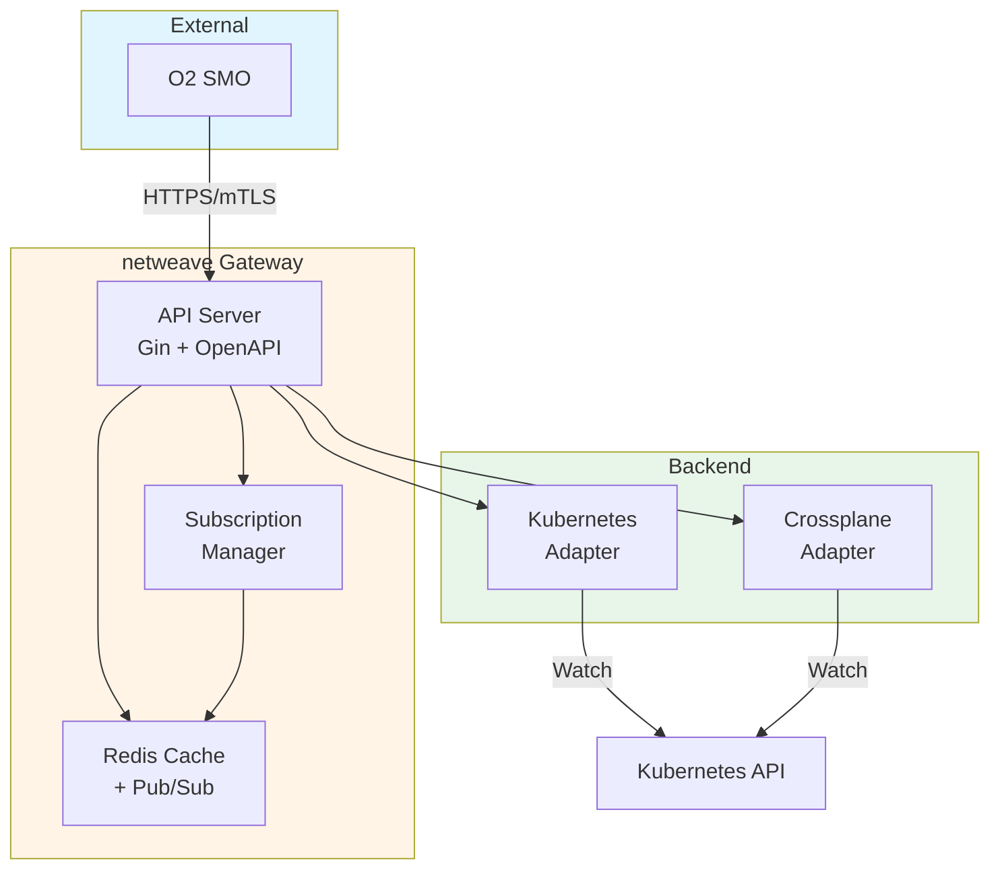

# netweave Documentation

**Complete O-RAN O2 Gateway (IMS + DMS + SMO) for Cloud-Native Infrastructure**

**Quick Links:** [GitHub Repository](https://github.com/watteel/netweave) | [API Docs](api-mapping.md) | [Architecture](architecture.md) | [Deployment](deployment.md)

---

## About netweave

netweave is a production-grade, cloud-native O-RAN O2 Gateway implementing:

- **O2-IMS (Infrastructure Management Service)** - Resource lifecycle, inventory, topology
- **O2-DMS (Deployment Management Service)** - Helm-based deployments, cluster provisioning
- **O2-SMO (Service Management & Orchestration)** - Multi-cluster federation, policy enforcement

Built with Go, Kubernetes, and Redis for telecom-grade reliability.

---

## Documentation

### Getting Started

- [README](../README.md) - Project overview, quick start, features
- [Configuration Guide](configuration.md) - Complete configuration reference
- [Deployment Guide](deployment.md) - Production deployment instructions

### Architecture & Design

- [Architecture Overview](../ARCHITECTURE_SUMMARY.md) - High-level architecture summary
- [Architecture Details](architecture.md) - In-depth architecture documentation
- [Architecture Part 2](architecture-part2.md) - Extended architecture topics
- [API Mapping](api-mapping.md) - O-RAN O2 API implementation mapping
- [Backend Plugins](backend-plugins.md) - Kubernetes adapter architecture

### Configuration & Operations

- [Configuration Guide](configuration.md) - All configuration options
- [Configuration and State Management](configuration-and-state.md) - State management patterns
- [Operations Guide](operations.md) - Day-2 operations, troubleshooting
- [Monitoring](operations/monitoring.md) - Observability, metrics, alerts

### Security

- [Security Overview](security.md) - Security architecture and controls
- [Security Hardening](security-hardening.md) - Production hardening checklist
- [Supply Chain Security](supply-chain-security.md) - Build and dependency security
- [Webhook Security](webhook-security.md) - Webhook authentication and validation
- [RBAC & Multi-Tenancy](rbac-multitenancy.md) - Access control and isolation

### API & Integration

- [API Mapping](api-mapping.md) - O-RAN O2 compliance mapping
- [O2-DMS & O2-SMO Extension](o2dms-o2smo-extension.md) - DMS and SMO capabilities
- [Subscription Update Behavior](subscription-update-behavior.md) - Subscription lifecycle

### Compliance

- [Compliance Documentation](compliance.md) - O-RAN specifications compliance

---

## Key Features

### O2-IMS (Infrastructure Management Service)

- ✅ **Resource Pools** - Kubernetes node pools, cloud regions
- ✅ **Resources** - Compute nodes, worker nodes, infrastructure
- ✅ **Resource Types** - CPU, memory, storage, accelerators
- ✅ **Deployments** - Helm charts, Kubernetes manifests
- ✅ **Subscriptions** - Event notifications via webhooks
- ✅ **Filtering** - Advanced query support per O-RAN spec

### O2-DMS (Deployment Management Service)

- ✅ **Deployment Management** - Helm-based application deployments
- ✅ **Cluster Lifecycle** - Cluster provisioning via Crossplane
- ✅ **Multi-Backend Support** - Kubernetes, Crossplane adapters
- ✅ **Version Control** - Deployment revision tracking

### O2-SMO (Service Management & Orchestration)

- ✅ **Multi-Cluster Federation** - Manage multiple K8s clusters
- ✅ **Policy Enforcement** - Resource quotas, governance
- ✅ **Tenant Isolation** - Namespace-based multi-tenancy

---

## O-RAN Specifications

netweave implements the following O-RAN Alliance specifications:

- [O-RAN O2 General Aspects and Principles v10.00](https://specifications.o-ran.org/)
- [O-RAN O2 IMS API Specification v4.00](https://specifications.o-ran.org/)
- [O-RAN O2 DMS API Specification v4.00](https://specifications.o-ran.org/)

---

## Architecture Highlights

**Core Design Principles:**

- **Stateless Gateway Pods** - Horizontal scaling, zero downtime upgrades
- **Redis for State** - Subscriptions, caching, pub/sub coordination
- **Kubernetes as Source of Truth** - Real-time resource sync via watches
- **Plugin Architecture** - Extensible backend adapters (DMS plugins)
- **Native Go TLS 1.3** - No service mesh required for mTLS

---

## Technology Stack

| Component | Technology |
|-----------|------------|
| **Language** | Go 1.25.0+ |
| **HTTP Framework** | Gin |
| **Storage** | Redis OSS 7.4+ (Sentinel) |
| **Orchestration** | Kubernetes 1.32+ |
| **Packaging** | Helm 3.x |
| **Observability** | OpenTelemetry, Prometheus |
| **Security** | Native TLS 1.3, mTLS |

---

## Support

- **Issues**: [GitHub Issues](https://github.com/watteel/netweave/issues)
- **Discussions**: [GitHub Discussions](https://github.com/watteel/netweave/discussions)
- **Contributing**: See [Contributing Guide](../CONTRIBUTING.md) (if exists)

---

## License

[Apache License 2.0](../LICENSE)

---

*Built for production telecom infrastructure. Quality is not optional.*
