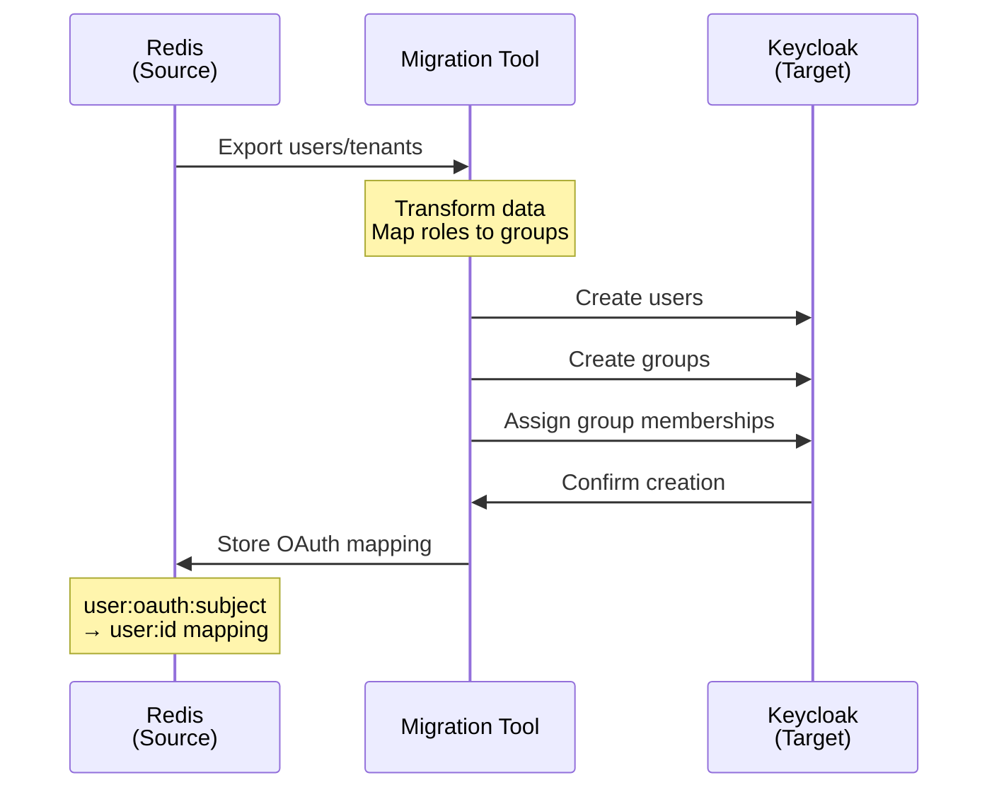
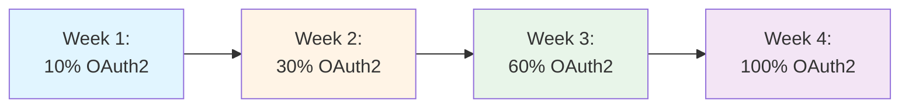

# Deployment Plan: Keycloak + Vault Migration

Comprehensive deployment plan for migrating from Redis-based authentication to Keycloak + Vault PKI in production.

## Table of Contents

1. [Executive Summary](#executive-summary)
2. [Pre-Deployment Checklist](#pre-deployment-checklist)
3. [Deployment Phases](#deployment-phases)
4. [Resource Requirements](#resource-requirements)
5. [Network Topology](#network-topology)
6. [Health Check Verification](#health-check-verification)
7. [Timeline and Schedule](#timeline-and-schedule)

---

## Executive Summary

### Objective

Migrate the netweave O2-IMS Gateway from Redis-only authentication to a dual authentication system supporting both mTLS (backed by Vault PKI) and OAuth2/OIDC (backed by Keycloak), while maintaining 100% backward compatibility with existing mTLS clients.

### Key Principles

- **Zero-Downtime Migration**: All existing mTLS clients continue working unchanged
- **Phased Rollout**: Gradual transition through 5 distinct phases with validation gates
- **Fail-Safe Design**: Rollback capability at every phase
- **Production-Ready**: Enterprise-grade HA deployment for Keycloak and Vault

### Migration Architecture

```mermaid
graph TB
    subgraph "Current State (Redis Auth)"
        SMO_OLD[SMO Client]
        GW_OLD[Gateway<br/>Redis Auth Only]
        REDIS_OLD[Redis]

        SMO_OLD -->|mTLS| GW_OLD
        GW_OLD --> REDIS_OLD
    end

    subgraph "Target State (Dual Auth)"
        SMO_NEW[SMO Client]
        GW_NEW[Gateway<br/>Dual Auth]
        KC[Keycloak HA]
        VAULT[Vault HA]
        PG[PostgreSQL]
        REDIS_NEW[Redis]

        SMO_NEW -->|mTLS or OAuth2| GW_NEW
        GW_NEW --> KC
        GW_NEW --> VAULT
        GW_NEW --> REDIS_NEW
        KC --> PG
    end

    style "Current State (Redis Auth)" fill:#ffebee
    style "Target State (Dual Auth)" fill:#e8f5e9
```

### Success Criteria

| Criterion | Target | Measurement |
|-----------|--------|-------------|
| **Zero Breaking Changes** | 100% | All existing mTLS clients work unchanged |
| **Availability** | 99.9% | < 43 minutes downtime during entire migration |
| **Performance** | < 5% degradation | p95 latency remains < 105ms (current: 100ms) |
| **Data Integrity** | 100% | All users, tenants, and subscriptions preserved |
| **Rollback Time** | < 15 minutes | Ability to revert to previous state quickly |

---

## Pre-Deployment Checklist

### Infrastructure Prerequisites

#### Kubernetes Cluster

- [ ] Kubernetes version 1.28+ verified
- [ ] Minimum 5 worker nodes (3 for Keycloak/Vault/PG, 2 for Gateway)
- [ ] Node resources: 8 vCPU, 32GB RAM minimum per node
- [ ] Storage class with dynamic provisioning available
- [ ] Network policies supported (Calico, Cilium, or Weave Net)
- [ ] Ingress controller deployed (nginx or Istio)
- [ ] cert-manager 1.15+ installed for TLS certificates

**Verification:**
```bash
kubectl version --short
kubectl get nodes -o wide
kubectl get storageclass
kubectl get pods -n cert-manager
```

#### Database Requirements

- [ ] PostgreSQL 15+ support verified
- [ ] Database sizing: 50GB initial, 100GB growth capacity
- [ ] Backup solution configured
- [ ] High availability (primary + standby) recommended
- [ ] Connection pooling configured (pgBouncer recommended)

**Verification:**
```bash
# Test PostgreSQL connectivity
psql -h <postgres-host> -U postgres -c "SELECT version();"
```

#### Certificate Infrastructure

- [ ] Root CA certificate available (or Vault auto-generates)
- [ ] Intermediate CA certificates prepared
- [ ] TLS certificates for Keycloak (if ingress enabled)
- [ ] TLS certificates for Vault (mandatory for production)
- [ ] Certificate rotation procedures documented

#### Network Requirements

- [ ] DNS entries configured:
  - `keycloak.example.com` → Keycloak ingress
  - `vault.example.com` → Vault service
  - `o2ims.example.com` → Gateway ingress
- [ ] Firewall rules updated:
  - Gateway → Keycloak (TCP 8080 or 443)
  - Gateway → Vault (TCP 8200)
  - Keycloak → PostgreSQL (TCP 5432)
- [ ] Load balancer configured for Gateway (if using LoadBalancer service)

**Verification:**
```bash
# DNS resolution
nslookup keycloak.example.com
nslookup vault.example.com

# Network connectivity
curl -k https://keycloak.example.com/health
curl -k https://vault.example.com/v1/sys/health
```

### Access and Credentials

- [ ] Kubernetes admin access verified (`kubectl auth can-i create deployments`)
- [ ] Helm 3.12+ installed
- [ ] Docker/container registry access configured
- [ ] Cloud provider credentials available (if using cloud services)
- [ ] Secrets prepared:
  - PostgreSQL root password
  - Keycloak admin password
  - Redis password
  - Vault auto-unseal keys (cloud KMS)

### Backup and Rollback

- [ ] Current Redis data backed up (`redis-cli BGSAVE`)
- [ ] Gateway configuration backed up
- [ ] Helm values files version controlled
- [ ] Rollback procedure tested in staging environment
- [ ] Incident response team on standby

**Backup Commands:**
```bash
# Backup Redis data
kubectl exec -n netweave redis-0 -- redis-cli BGSAVE
kubectl cp netweave/redis-0:/data/dump.rdb ./backups/redis-backup-$(date +%Y%m%d).rdb

# Backup current Helm values
helm get values netweave -n netweave > backups/helm-values-$(date +%Y%m%d).yaml

# Backup secrets
kubectl get secrets -n netweave -o yaml > backups/secrets-$(date +%Y%m%d).yaml
```

### Documentation and Communication

- [ ] Migration plan reviewed by operations team
- [ ] Stakeholders notified of migration window
- [ ] Incident escalation contacts confirmed
- [ ] Runbooks prepared for common issues
- [ ] Status page updated with maintenance notice

---

## Deployment Phases

### Phase 1: Infrastructure Deployment

**Duration**: 2-4 hours
**Risk Level**: Low
**Rollback**: Full rollback possible

#### Objectives

1. Deploy Keycloak HA cluster (2 replicas)
2. Deploy HashiCorp Vault HA cluster (3 replicas)
3. Deploy PostgreSQL for Keycloak backend
4. Verify infrastructure health before proceeding

#### Infrastructure Architecture

```mermaid
graph TB
    subgraph "Kubernetes Cluster"
        subgraph "netweave namespace"
            GW[Gateway Pods<br/>Existing - No Changes]
            REDIS[Redis<br/>Existing - No Changes]
        end

        subgraph "keycloak-system namespace"
            KC1[Keycloak Pod 1]
            KC2[Keycloak Pod 2]
            PG[(PostgreSQL<br/>Primary + Standby)]

            KC1 --> PG
            KC2 --> PG
        end

        subgraph "vault-system namespace"
            V1[Vault Pod 1]
            V2[Vault Pod 2]
            V3[Vault Pod 3]

            V1 -.Raft Consensus.-> V2
            V2 -.Raft Consensus.-> V3
            V3 -.Raft Consensus.-> V1
        end
    end

    style "netweave namespace" fill:#e1f5ff
    style "keycloak-system namespace" fill:#fff4e6
    style "vault-system namespace" fill:#e8f5e9
```

#### Step 1.1: Deploy PostgreSQL

```bash
# Add Bitnami repository
helm repo add bitnami https://charts.bitnami.com/bitnami
helm repo update

# Create namespace
kubectl create namespace keycloak-system

# Deploy PostgreSQL with HA
helm install postgresql bitnami/postgresql \
  --namespace keycloak-system \
  --set auth.username=keycloak \
  --set auth.password="${POSTGRES_PASSWORD}" \
  --set auth.database=keycloak \
  --set primary.persistence.enabled=true \
  --set primary.persistence.size=50Gi \
  --set primary.resources.requests.cpu=1000m \
  --set primary.resources.requests.memory=2Gi \
  --set primary.resources.limits.cpu=2000m \
  --set primary.resources.limits.memory=4Gi \
  --set readReplicas.enabled=true \
  --set readReplicas.replicaCount=1 \
  --set readReplicas.persistence.enabled=true \
  --set readReplicas.persistence.size=50Gi \
  --wait --timeout=10m

# Verify PostgreSQL deployment
kubectl get pods -n keycloak-system -l app.kubernetes.io/name=postgresql
kubectl exec -n keycloak-system postgresql-0 -- psql -U keycloak -d keycloak -c "SELECT version();"
```

**Health Check:**
```bash
# PostgreSQL readiness
kubectl wait --for=condition=ready pod -l app.kubernetes.io/name=postgresql \
  -n keycloak-system --timeout=300s

# Database connectivity
kubectl exec -n keycloak-system postgresql-0 -- \
  psql -U keycloak -d keycloak -c "CREATE TABLE test_table (id INT); DROP TABLE test_table;"
```

**Expected Result**: PostgreSQL primary and read replica running, accepting connections.

#### Step 1.2: Deploy Keycloak HA

```bash
# Deploy Keycloak
helm install keycloak bitnami/keycloak \
  --namespace keycloak-system \
  --set replicaCount=2 \
  --set auth.adminUser=admin \
  --set auth.adminPassword="${KEYCLOAK_ADMIN_PASSWORD}" \
  --set postgresql.enabled=false \
  --set externalDatabase.host=postgresql.keycloak-system.svc.cluster.local \
  --set externalDatabase.port=5432 \
  --set externalDatabase.user=keycloak \
  --set externalDatabase.password="${POSTGRES_PASSWORD}" \
  --set externalDatabase.database=keycloak \
  --set resources.requests.cpu=1000m \
  --set resources.requests.memory=1Gi \
  --set resources.limits.cpu=2000m \
  --set resources.limits.memory=2Gi \
  --set ingress.enabled=false \
  --wait --timeout=15m

# Verify Keycloak deployment
kubectl get pods -n keycloak-system -l app.kubernetes.io/name=keycloak
```

**Health Check:**
```bash
# Keycloak readiness
kubectl wait --for=condition=ready pod -l app.kubernetes.io/name=keycloak \
  -n keycloak-system --timeout=600s

# Keycloak API health
kubectl port-forward -n keycloak-system svc/keycloak 8080:80 &
sleep 5
curl http://localhost:8080/health
curl http://localhost:8080/realms/master
```

**Expected Result**: 2 Keycloak pods running, health endpoint returns 200, master realm accessible.

#### Step 1.3: Import Keycloak Realm

```bash
# Create realm ConfigMap
kubectl create configmap keycloak-realm-import \
  --from-file=netweave-realm.json=deployments/keycloak/realm-import/netweave-realm.json \
  -n keycloak-system

# Create realm import job
kubectl apply -f - <<EOF
apiVersion: batch/v1
kind: Job
metadata:
  name: keycloak-realm-import
  namespace: keycloak-system
spec:
  ttlSecondsAfterFinished: 3600
  template:
    spec:
      restartPolicy: OnFailure
      containers:
      - name: import
        image: curlimages/curl:8.5.0
        env:
        - name: KEYCLOAK_URL
          value: "http://keycloak.keycloak-system.svc.cluster.local:80"
        - name: KEYCLOAK_ADMIN_PASSWORD
          valueFrom:
            secretKeyRef:
              name: keycloak
              key: admin-password
        command:
        - /bin/sh
        - -c
        - |
          set -e
          # Wait for Keycloak to be ready
          until curl -sf \${KEYCLOAK_URL}/health; do
            echo "Waiting for Keycloak..."
            sleep 5
          done

          # Get admin token
          TOKEN=\$(curl -s -X POST \
            "\${KEYCLOAK_URL}/realms/master/protocol/openid-connect/token" \
            -d "client_id=admin-cli" \
            -d "username=admin" \
            -d "password=\${KEYCLOAK_ADMIN_PASSWORD}" \
            -d "grant_type=password" \
            | jq -r '.access_token')

          # Import realm
          curl -X POST "\${KEYCLOAK_URL}/admin/realms" \
            -H "Authorization: Bearer \${TOKEN}" \
            -H "Content-Type: application/json" \
            -d @/config/netweave-realm.json

          echo "Realm import completed successfully"
        volumeMounts:
        - name: realm-config
          mountPath: /config
      volumes:
      - name: realm-config
        configMap:
          name: keycloak-realm-import
EOF

# Wait for import job to complete
kubectl wait --for=condition=complete job/keycloak-realm-import \
  -n keycloak-system --timeout=300s

# Verify realm imported
kubectl logs -n keycloak-system job/keycloak-realm-import
```

**Health Check:**
```bash
# Verify netweave realm exists
kubectl port-forward -n keycloak-system svc/keycloak 8080:80 &
curl http://localhost:8080/realms/netweave
```

**Expected Result**: Realm import job completes successfully, netweave realm accessible.

#### Step 1.4: Deploy HashiCorp Vault

```bash
# Create Vault namespace
kubectl create namespace vault-system

# Deploy Vault using Kustomize
kubectl apply -k deployments/kubernetes/vault/

# Verify Vault deployment
kubectl get pods -n vault-system -l app.kubernetes.io/name=vault
```

**Vault Initialization:**
```bash
# Initialize Vault (first time only)
kubectl exec -n vault-system vault-0 -- vault operator init \
  -key-shares=5 \
  -key-threshold=3 \
  -format=json > vault-init-keys.json

# Store unseal keys securely (CRITICAL)
# NEVER commit these to git or store in plain text
UNSEAL_KEY_1=$(cat vault-init-keys.json | jq -r '.unseal_keys_b64[0]')
UNSEAL_KEY_2=$(cat vault-init-keys.json | jq -r '.unseal_keys_b64[1]')
UNSEAL_KEY_3=$(cat vault-init-keys.json | jq -r '.unseal_keys_b64[2]')
ROOT_TOKEN=$(cat vault-init-keys.json | jq -r '.root_token')

# Unseal all Vault instances
for pod in vault-0 vault-1 vault-2; do
  kubectl exec -n vault-system $pod -- vault operator unseal $UNSEAL_KEY_1
  kubectl exec -n vault-system $pod -- vault operator unseal $UNSEAL_KEY_2
  kubectl exec -n vault-system $pod -- vault operator unseal $UNSEAL_KEY_3
done

# Verify all Vault instances unsealed
kubectl exec -n vault-system vault-0 -- vault status
kubectl exec -n vault-system vault-1 -- vault status
kubectl exec -n vault-system vault-2 -- vault status
```

**Health Check:**
```bash
# Vault health status
kubectl get pods -n vault-system
kubectl exec -n vault-system vault-0 -- vault status | grep -i sealed
```

**Expected Result**: 3 Vault pods running, all unsealed and healthy.

#### Step 1.5: Initialize Vault PKI

```bash
# Run Vault PKI initialization job
kubectl apply -f deployments/kubernetes/vault/init-job.yaml

# Wait for PKI initialization
kubectl wait --for=condition=complete job/vault-pki-init \
  -n vault-system --timeout=300s

# Verify PKI setup
kubectl logs -n vault-system job/vault-pki-init
```

**Health Check:**
```bash
# Verify PKI engines enabled
kubectl exec -n vault-system vault-0 -- vault secrets list | grep pki

# Verify PKI role exists
kubectl exec -n vault-system vault-0 -- vault read pki_int/roles/netweave-mtls
```

**Expected Result**: Root PKI and intermediate PKI mounted, netweave-mtls role configured.

#### Phase 1 Validation Gates

Before proceeding to Phase 2, verify ALL of the following:

- [ ] PostgreSQL primary and replica running and healthy
- [ ] Keycloak 2 replicas running and accessible
- [ ] Keycloak netweave realm imported successfully
- [ ] Vault 3 pods running and unsealed
- [ ] Vault PKI engines configured
- [ ] All pods passing readiness probes
- [ ] No error logs in any component
- [ ] **Gateway still operational** (existing mTLS auth working)

**Validation Script:**
```bash
#!/bin/bash
# phase1-validation.sh

echo "=== Phase 1 Validation ==="

# PostgreSQL
echo "Checking PostgreSQL..."
kubectl get pods -n keycloak-system -l app.kubernetes.io/name=postgresql | grep Running || exit 1

# Keycloak
echo "Checking Keycloak..."
kubectl get pods -n keycloak-system -l app.kubernetes.io/name=keycloak | grep Running || exit 1
curl -sf http://localhost:8080/realms/netweave || exit 1

# Vault
echo "Checking Vault..."
kubectl get pods -n vault-system -l app.kubernetes.io/name=vault | grep Running || exit 1
kubectl exec -n vault-system vault-0 -- vault status | grep -q "Sealed.*false" || exit 1

# Gateway (unchanged)
echo "Checking Gateway..."
kubectl get pods -n netweave -l app.kubernetes.io/component=gateway | grep Running || exit 1
curl -k https://o2ims.example.com/healthz || exit 1

echo "✓ Phase 1 validation PASSED"
```

**Rollback Trigger**: If validation fails, execute Phase 1 rollback (see rollback-plan.md).

---

### Phase 2: Data Migration

**Duration**: 1-2 hours
**Risk Level**: Medium
**Rollback**: Full rollback possible (Redis data unchanged)

#### Objectives

1. Export users and tenants from Redis
2. Create corresponding users and groups in Keycloak
3. Verify data migration completeness
4. Test OAuth2 authentication for migrated users

#### Migration Architecture



#### Step 2.1: Export Redis Data

```bash
# Run data export from Redis
kubectl exec -n netweave redis-0 -- redis-cli --scan --pattern "user:*" > /tmp/redis-users.txt
kubectl exec -n netweave redis-0 -- redis-cli --scan --pattern "tenant:*" > /tmp/redis-tenants.txt

# Count records
echo "Users to migrate: $(wc -l < /tmp/redis-users.txt)"
echo "Tenants to migrate: $(wc -l < /tmp/redis-tenants.txt)"
```

#### Step 2.2: Run Migration Tool

```bash
# Create migration job
kubectl apply -f - <<EOF
apiVersion: batch/v1
kind: Job
metadata:
  name: keycloak-data-migration
  namespace: netweave
spec:
  ttlSecondsAfterFinished: 86400
  template:
    spec:
      restartPolicy: OnFailure
      serviceAccountName: netweave
      containers:
      - name: migrate
        image: ghcr.io/piwi3910/netweave:latest
        command: ["/app/netweave"]
        args:
          - migrate-to-keycloak
          - --redis-addr=redis.netweave.svc.cluster.local:6379
          - --keycloak-url=http://keycloak.keycloak-system.svc.cluster.local:80
          - --keycloak-realm=netweave
          - --keycloak-client-id=netweave-gateway
          - --dry-run=false
        env:
        - name: REDIS_PASSWORD
          valueFrom:
            secretKeyRef:
              name: redis
              key: redis-password
        - name: KEYCLOAK_CLIENT_SECRET
          valueFrom:
            secretKeyRef:
              name: netweave-secret
              key: keycloak-client-secret
        - name: KEYCLOAK_ADMIN_PASSWORD
          valueFrom:
            secretKeyRef:
              name: keycloak
              key: admin-password
EOF

# Monitor migration progress
kubectl logs -n netweave job/keycloak-data-migration -f

# Wait for completion
kubectl wait --for=condition=complete job/keycloak-data-migration \
  -n netweave --timeout=1800s
```

#### Step 2.3: Verify Migration

**User Count Verification:**
```bash
# Count users in Keycloak
kubectl exec -n keycloak-system keycloak-0 -- \
  /opt/keycloak/bin/kcadm.sh get users -r netweave --fields id,username | jq length

# Compare with Redis count
kubectl exec -n netweave redis-0 -- redis-cli KEYS "user:*" | wc -l
```

**User Detail Verification:**
```bash
# Check a sample user in Keycloak
kubectl exec -n keycloak-system keycloak-0 -- \
  /opt/keycloak/bin/kcadm.sh get users -r netweave -q username=test-user

# Verify group membership
kubectl exec -n keycloak-system keycloak-0 -- \
  /opt/keycloak/bin/kcadm.sh get-groups -r netweave
```

**OAuth Subject Mapping Verification:**
```bash
# Verify OAuth subject index in Redis
kubectl exec -n netweave redis-0 -- redis-cli KEYS "users:oauth:*" | wc -l

# Should equal number of users migrated
```

#### Phase 2 Validation Gates

Before proceeding to Phase 3, verify ALL of the following:

- [ ] All users from Redis created in Keycloak
- [ ] All tenants mapped to Keycloak groups
- [ ] Role assignments preserved (admin, editor, viewer)
- [ ] OAuth subject mappings stored in Redis
- [ ] No errors in migration job logs
- [ ] Sample user login test successful (OAuth2)
- [ ] **Gateway still operational** (existing mTLS auth working)

**Validation Script:**
```bash
#!/bin/bash
# phase2-validation.sh

echo "=== Phase 2 Validation ==="

# User count match
REDIS_COUNT=$(kubectl exec -n netweave redis-0 -- redis-cli KEYS "user:*" | wc -l)
KC_COUNT=$(kubectl exec -n keycloak-system keycloak-0 -- \
  /opt/keycloak/bin/kcadm.sh get users -r netweave --fields id | jq length)

echo "Redis users: ${REDIS_COUNT}"
echo "Keycloak users: ${KC_COUNT}"

if [ "${REDIS_COUNT}" -ne "${KC_COUNT}" ]; then
  echo "✗ User count mismatch!"
  exit 1
fi

# OAuth mapping count
OAUTH_COUNT=$(kubectl exec -n netweave redis-0 -- redis-cli KEYS "users:oauth:*" | wc -l)
echo "OAuth mappings: ${OAUTH_COUNT}"

if [ "${OAUTH_COUNT}" -ne "${REDIS_COUNT}" ]; then
  echo "✗ OAuth mapping count mismatch!"
  exit 1
fi

# Gateway health (unchanged)
curl -k -sf https://o2ims.example.com/healthz || exit 1

echo "✓ Phase 2 validation PASSED"
```

**Rollback Trigger**: If validation fails, execute Phase 2 rollback (see rollback-plan.md).

---

### Phase 3: Gateway Update (Dual Auth Support)

**Duration**: 30-60 minutes
**Risk Level**: Medium-High
**Rollback**: Possible (via Helm rollback)

#### Objectives

1. Deploy gateway with OAuth2 support enabled
2. Configure dual authentication (mTLS priority)
3. Verify both authentication methods work
4. Monitor for any authentication failures

#### Gateway Configuration

```yaml
# values-dual-auth.yaml

gateway:
  replicaCount: 3  # No change

  config:
    auth:
      # OAuth2 enabled but NOT primary
      oauth2:
        enabled: true
        priority: false  # mTLS takes priority (CRITICAL)
        issuerURL: "http://keycloak.keycloak-system.svc.cluster.local:80/realms/netweave"
        clientID: "netweave-gateway"
        clientSecret: ""  # From secret
        autoProvisionUsers: false  # Manual approval initially
        requireTenantClaim: true
        defaultRole: "tenant-viewer"
        groupRoleMapping:
          "/platform-admins": "platform-admin"
          "/tenant-admins": "tenant-admin"
          "/tenant-editors": "tenant-editor"
          "/tenant-viewers": "tenant-viewer"

      # mTLS remains primary
      mtls:
        enabled: true
        caCert: ""  # From Vault

    certManager:
      enabled: true
      monitorInterval: 1h
      renewalWindow: 720h  # 30 days
```

#### Step 3.1: Prepare Secrets

```bash
# Get Keycloak client secret
KEYCLOAK_CLIENT_SECRET=$(kubectl get secret -n keycloak-system keycloak-gateway-client \
  -o jsonpath='{.data.client-secret}' | base64 -d)

# Update gateway secrets
kubectl create secret generic netweave-oauth2-config \
  --from-literal=keycloak-client-secret="${KEYCLOAK_CLIENT_SECRET}" \
  --from-literal=keycloak-issuer-url="http://keycloak.keycloak-system.svc.cluster.local:80/realms/netweave" \
  -n netweave --dry-run=client -o yaml | kubectl apply -f -
```

#### Step 3.2: Deploy Updated Gateway

```bash
# Backup current deployment
kubectl get deployment netweave-gateway -n netweave -o yaml > backups/gateway-before-oauth2.yaml

# Deploy with dual auth support
helm upgrade netweave deployments/helm/netweave \
  --namespace netweave \
  --values values-dual-auth.yaml \
  --set gateway.config.auth.oauth2.enabled=true \
  --set gateway.config.auth.oauth2.priority=false \
  --wait --timeout=10m

# Monitor rollout
kubectl rollout status deployment/netweave-gateway -n netweave -w
```

**Rolling Update Strategy:**
- MaxUnavailable: 1
- MaxSurge: 1
- Expected rollout time: 3-5 minutes

#### Step 3.3: Verify Dual Authentication

**Test 1: Existing mTLS Client (Should Work Unchanged)**
```bash
# Test with existing mTLS certificate
curl -X GET https://o2ims.example.com/o2ims-infrastructureInventory/v1/api_versions \
  --cert client.crt --key client.key --cacert ca.crt

# Expected: 200 OK (authenticated via mTLS)
```

**Test 2: OAuth2 Client (New)**
```bash
# Get OAuth2 token
TOKEN=$(curl -s -X POST \
  http://keycloak.keycloak-system.svc.cluster.local:80/realms/netweave/protocol/openid-connect/token \
  -d "client_id=netweave-gateway" \
  -d "client_secret=${KEYCLOAK_CLIENT_SECRET}" \
  -d "username=test-user" \
  -d "password=test-password" \
  -d "grant_type=password" \
  | jq -r '.access_token')

# Test OAuth2 authentication
curl -X GET https://o2ims.example.com/o2ims-infrastructureInventory/v1/api_versions \
  -H "Authorization: Bearer ${TOKEN}"

# Expected: 200 OK (authenticated via OAuth2)
```

**Test 3: Priority Verification (Both Present)**
```bash
# Request with BOTH Bearer token AND certificate
# Should use mTLS (priority=false means mTLS takes precedence)
curl -v -X GET https://o2ims.example.com/o2ims-infrastructureInventory/v1/api_versions \
  -H "Authorization: Bearer ${TOKEN}" \
  --cert client.crt --key client.key --cacert ca.crt

# Check logs to confirm authentication method used
kubectl logs -n netweave -l app.kubernetes.io/component=gateway | grep "authentication method detected"
# Expected: "mTLS" (not OAuth2)
```

#### Step 3.4: Monitor Metrics

```bash
# Check authentication metrics
kubectl port-forward -n netweave svc/netweave-gateway 9090:9090 &
curl http://localhost:9090/metrics | grep o2ims_authentication

# Expected metrics:
# o2ims_authentication_total{method="mtls",status="success"} <existing count>
# o2ims_authentication_total{method="oauth2",status="success"} <new count>
```

#### Phase 3 Validation Gates

Before proceeding to Phase 4, verify ALL of the following:

- [ ] All 3 gateway pods running and ready
- [ ] Existing mTLS clients authenticate successfully
- [ ] New OAuth2 clients authenticate successfully
- [ ] mTLS takes priority when both present
- [ ] No authentication failures for existing clients
- [ ] Prometheus metrics show both auth methods working
- [ ] p95 latency < 105ms (5% degradation max)
- [ ] No increase in error rate

**Validation Script:**
```bash
#!/bin/bash
# phase3-validation.sh

echo "=== Phase 3 Validation ==="

# Gateway pods ready
READY_PODS=$(kubectl get pods -n netweave -l app.kubernetes.io/component=gateway \
  -o jsonpath='{.items[*].status.conditions[?(@.type=="Ready")].status}' | grep -o "True" | wc -l)

if [ "${READY_PODS}" -ne 3 ]; then
  echo "✗ Not all gateway pods ready (${READY_PODS}/3)"
  exit 1
fi

# Test mTLS authentication
MTLS_RESP=$(curl -s -o /dev/null -w "%{http_code}" \
  https://o2ims.example.com/o2ims-infrastructureInventory/v1/api_versions \
  --cert client.crt --key client.key --cacert ca.crt)

if [ "${MTLS_RESP}" != "200" ]; then
  echo "✗ mTLS authentication failed (HTTP ${MTLS_RESP})"
  exit 1
fi

# Test OAuth2 authentication
OAUTH2_RESP=$(curl -s -o /dev/null -w "%{http_code}" \
  https://o2ims.example.com/o2ims-infrastructureInventory/v1/api_versions \
  -H "Authorization: Bearer ${TOKEN}")

if [ "${OAUTH2_RESP}" != "200" ]; then
  echo "✗ OAuth2 authentication failed (HTTP ${OAUTH2_RESP})"
  exit 1
fi

# Check metrics
MTLS_SUCCESS=$(curl -s http://localhost:9090/metrics | \
  grep 'o2ims_authentication_total{method="mtls",status="success"}' | \
  awk '{print $2}')

if [ -z "${MTLS_SUCCESS}" ] || [ "${MTLS_SUCCESS}" -eq 0 ]; then
  echo "✗ No successful mTLS authentications in metrics"
  exit 1
fi

echo "✓ Phase 3 validation PASSED"
```

**Rollback Trigger**: If validation fails, execute Phase 3 rollback (see rollback-plan.md).

---

### Phase 4: Client Migration (Gradual Transition)

**Duration**: 2-4 weeks
**Risk Level**: Low
**Rollback**: Individual client rollback possible

#### Objectives

1. Gradually migrate clients from mTLS-only to OAuth2+mTLS
2. Monitor client migration progress
3. Provide client migration support
4. Maintain 100% availability during transition

#### Client Migration Strategy



#### Step 4.1: Enable Auto-Provisioning

After 1-2 weeks of manual approval (Phase 3), enable auto-provisioning:

```bash
# Update gateway configuration
helm upgrade netweave deployments/helm/netweave \
  --namespace netweave \
  --reuse-values \
  --set gateway.config.auth.oauth2.autoProvisionUsers=true \
  --wait

# Verify auto-provisioning enabled
kubectl get configmap netweave-config -n netweave -o yaml | grep autoProvisionUsers
```

#### Step 4.2: Client Migration Tracking

```bash
# Monitor authentication method distribution
kubectl port-forward -n netweave svc/netweave-gateway 9090:9090 &

# Query authentication breakdown
curl -s http://localhost:9090/metrics | grep o2ims_authentication_total | \
  awk '{split($1,a,"\""); split($2,b," "); print a[4], b[1]}'

# Sample output:
# mtls 850
# oauth2 150
# Total: 1000 (85% mTLS, 15% OAuth2)
```

**Migration Progress Dashboard:**
Create Grafana dashboard to track:
- Authentication method distribution (%)
- OAuth2 adoption rate over time
- Client migration velocity (clients/day)

#### Step 4.3: Client Communication Plan

**Week 1: Announcement**
- Notify all clients of OAuth2 availability
- Provide migration guide and example code
- Offer migration support (office hours, Slack channel)

**Week 2-3: Assisted Migration**
- Work with 20% of clients to migrate
- Collect feedback and address issues
- Update documentation based on learnings

**Week 4: Self-Service Migration**
- Remaining clients migrate at their own pace
- Monitor for migration blockers
- Provide async support via ticketing system

#### Phase 4 Validation Gates

Phase 4 is a gradual transition with ongoing monitoring. No single validation gate, but track:

- [ ] OAuth2 adoption rate increasing week-over-week
- [ ] No increase in authentication failures
- [ ] Client satisfaction with migration process
- [ ] All migration blockers resolved

**Weekly Status Report:**
```bash
#!/bin/bash
# phase4-weekly-report.sh

echo "=== Week $(date +%U) Migration Status ==="

# Authentication distribution
TOTAL_AUTH=$(curl -s http://localhost:9090/metrics | \
  grep 'o2ims_authentication_total{method="' | \
  awk '{sum+=$2} END {print sum}')

OAUTH2_AUTH=$(curl -s http://localhost:9090/metrics | \
  grep 'o2ims_authentication_total{method="oauth2"' | \
  awk '{sum+=$2} END {print sum}')

OAUTH2_PCT=$(echo "scale=2; ${OAUTH2_AUTH} * 100 / ${TOTAL_AUTH}" | bc)

echo "Total authentications: ${TOTAL_AUTH}"
echo "OAuth2 authentications: ${OAUTH2_AUTH} (${OAUTH2_PCT}%)"

# Authentication errors
AUTH_ERRORS=$(curl -s http://localhost:9090/metrics | \
  grep 'o2ims_authentication_total{.*status="failed"' | \
  awk '{sum+=$2} END {print sum}')

echo "Authentication failures: ${AUTH_ERRORS}"

# Auto-provisioned users
NEW_USERS=$(curl -s http://localhost:9090/metrics | \
  grep 'oauth2_user_provisions_total' | \
  awk '{print $2}')

echo "New users auto-provisioned: ${NEW_USERS}"
```

---

### Phase 5: Redis Auth Decommission (After Grace Period)

**Duration**: 1-2 hours
**Risk Level**: Medium
**Prerequisites**: 100% client migration to OAuth2 or explicit mTLS-only configuration

#### Objectives

1. Disable Redis-based user storage (if fully migrated)
2. Keep Redis for subscriptions and caching only
3. Verify no disruption to service
4. Archive Redis authentication data for audit

#### Decision Point

**Option A: Keep Hybrid Model (Recommended)**
- Keep both OAuth2 and mTLS authentication
- Redis stores OAuth subject mappings only
- No decommissioning needed

**Option B: OAuth2-Only (If all clients migrated)**
- Disable mTLS authentication completely
- Remove Vault PKI dependency
- Simplify architecture

**Option C: mTLS-Only (If no OAuth2 adoption)**
- Disable OAuth2 authentication
- Remove Keycloak dependency
- Rollback to simpler architecture

For most deployments, **Option A (Hybrid)** is recommended for maximum flexibility.

#### Step 5.1: Archive Redis Auth Data

```bash
# Export authentication data for audit
kubectl exec -n netweave redis-0 -- redis-cli --scan --pattern "user:*" > backups/redis-users-final.txt
kubectl exec -n netweave redis-0 -- redis-cli --scan --pattern "tenant:*" > backups/redis-tenants-final.txt
kubectl exec -n netweave redis-0 -- redis-cli --scan --pattern "users:oauth:*" > backups/redis-oauth-mappings-final.txt

# Create backup
kubectl exec -n netweave redis-0 -- redis-cli BGSAVE
kubectl cp netweave/redis-0:/data/dump.rdb backups/redis-auth-archive-$(date +%Y%m%d).rdb
```

#### Step 5.2: Monitor Post-Decommission

```bash
# Monitor for 48 hours after decommissioning
watch -n 300 'kubectl logs -n netweave -l app.kubernetes.io/component=gateway | grep -i "auth"'

# Check for any authentication issues
curl -s http://localhost:9090/metrics | grep o2ims_authentication_total
```

#### Phase 5 Validation Gates

- [ ] No authentication failures after decommissioning
- [ ] All clients authenticating successfully
- [ ] Redis data archived for audit
- [ ] Monitoring shows stable authentication metrics

---

## Resource Requirements

### Compute Resources

| Component | Replicas | CPU Request | CPU Limit | Memory Request | Memory Limit |
|-----------|----------|-------------|-----------|----------------|--------------|
| **Gateway** | 3 | 500m | 1000m | 512Mi | 1Gi |
| **Keycloak** | 2 | 1000m | 2000m | 1Gi | 2Gi |
| **PostgreSQL** | 1 primary + 1 replica | 1000m | 2000m | 2Gi | 4Gi |
| **Vault** | 3 | 500m | 1000m | 512Mi | 1Gi |
| **Redis** | 1 (existing) | 100m | 250m | 128Mi | 256Mi |

**Total Additional Resources:**
- CPU: 8.5 vCPU (requests), 17 vCPU (limits)
- Memory: 11.5Gi (requests), 23Gi (limits)

### Storage Requirements

| Component | Purpose | Size | Type | Backup |
|-----------|---------|------|------|--------|
| **PostgreSQL Data** | Keycloak database | 50Gi initial<br/>100Gi growth | RWO, SSD | Daily snapshots |
| **PostgreSQL Backup** | WAL archive | 50Gi | RWX, Standard | 7-day retention |
| **Vault Data** | Raft storage, PKI | 10Gi per pod | RWO, SSD | Snapshot + export |
| **Redis Data** | Existing data | 10Gi (unchanged) | RWO, SSD | Existing backup |

**Total Additional Storage**: 180Gi (50Gi × 2 for PG + 50Gi backup + 30Gi for Vault)

### Network Bandwidth

| Traffic Pattern | Bandwidth | Latency SLA |
|----------------|-----------|-------------|
| Client → Gateway | Existing (no change) | < 50ms p95 |
| Gateway → Keycloak | 5-10 req/s per gateway pod<br/>~1 Mbps | < 10ms p95 |
| Gateway → Vault | 2-5 req/s per gateway pod<br/>~500 Kbps | < 10ms p95 |
| Keycloak → PostgreSQL | 10-20 queries/s<br/>~2 Mbps | < 5ms p95 |

### Availability Requirements

| Component | Availability Target | Max Downtime/Month | Recovery Time |
|-----------|--------------------|--------------------|---------------|
| **Gateway** | 99.9% | 43 minutes | < 2 minutes (pod restart) |
| **Keycloak** | 99.9% | 43 minutes | < 5 minutes (failover) |
| **PostgreSQL** | 99.95% | 22 minutes | < 10 minutes (failover) |
| **Vault** | 99.9% | 43 minutes | < 3 minutes (unseal) |

---

## Network Topology

### Kubernetes Network Architecture

```mermaid
graph TB
    subgraph "External Zone"
        CLIENT[O2 SMO Clients]
        LB[Load Balancer<br/>or Ingress]
    end

    subgraph "Gateway Namespace (netweave)"
        GW1[Gateway Pod 1]
        GW2[Gateway Pod 2]
        GW3[Gateway Pod 3]
        GW_SVC[Gateway Service]
        REDIS[Redis]

        GW_SVC --> GW1
        GW_SVC --> GW2
        GW_SVC --> GW3
    end

    subgraph "Keycloak Namespace (keycloak-system)"
        KC1[Keycloak Pod 1]
        KC2[Keycloak Pod 2]
        KC_SVC[Keycloak Service]
        PG[(PostgreSQL<br/>Primary + Replica)]

        KC_SVC --> KC1
        KC_SVC --> KC2
        KC1 --> PG
        KC2 --> PG
    end

    subgraph "Vault Namespace (vault-system)"
        V1[Vault Pod 1]
        V2[Vault Pod 2]
        V3[Vault Pod 3]
        V_SVC[Vault Service]

        V_SVC --> V1
        V_SVC --> V2
        V_SVC --> V3
    end

    CLIENT -->|HTTPS/mTLS| LB
    LB -->|HTTPS| GW_SVC

    GW1 -->|HTTP| KC_SVC
    GW2 -->|HTTP| KC_SVC
    GW3 -->|HTTP| KC_SVC

    GW1 -->|HTTPS| V_SVC
    GW2 -->|HTTPS| V_SVC
    GW3 -->|HTTPS| V_SVC

    GW1 --> REDIS
    GW2 --> REDIS
    GW3 --> REDIS

    style "External Zone" fill:#ffebee
    style "Gateway Namespace (netweave)" fill:#e1f5ff
    style "Keycloak Namespace (keycloak-system)" fill:#fff4e6
    style "Vault Namespace (vault-system)" fill:#e8f5e9
```

### Service Connectivity Matrix

| Source | Destination | Protocol | Port | Purpose |
|--------|-------------|----------|------|---------|
| External → Gateway | Gateway Service | HTTPS | 443 | API requests |
| Gateway → Keycloak | Keycloak Service | HTTP | 80 | OAuth2 token validation |
| Gateway → Vault | Vault Service | HTTPS | 8200 | Certificate operations |
| Gateway → Redis | Redis Service | TCP | 6379 | Subscription storage |
| Keycloak → PostgreSQL | PostgreSQL Service | TCP | 5432 | Database queries |
| Vault → Vault | Vault Pods (Raft) | TCP | 8201 | Raft consensus |

### NetworkPolicy Configuration

```yaml
# Gateway egress to Keycloak
apiVersion: networking.k8s.io/v1
kind: NetworkPolicy
metadata:
  name: gateway-to-keycloak
  namespace: netweave
spec:
  podSelector:
    matchLabels:
      app.kubernetes.io/component: gateway
  policyTypes:
  - Egress
  egress:
  - to:
    - namespaceSelector:
        matchLabels:
          name: keycloak-system
      podSelector:
        matchLabels:
          app.kubernetes.io/name: keycloak
    ports:
    - protocol: TCP
      port: 80
---
# Gateway egress to Vault
apiVersion: networking.k8s.io/v1
kind: NetworkPolicy
metadata:
  name: gateway-to-vault
  namespace: netweave
spec:
  podSelector:
    matchLabels:
      app.kubernetes.io/component: gateway
  policyTypes:
  - Egress
  egress:
  - to:
    - namespaceSelector:
        matchLabels:
          name: vault-system
      podSelector:
        matchLabels:
          app.kubernetes.io/name: vault
    ports:
    - protocol: TCP
      port: 8200
---
# Keycloak ingress from Gateway
apiVersion: networking.k8s.io/v1
kind: NetworkPolicy
metadata:
  name: keycloak-from-gateway
  namespace: keycloak-system
spec:
  podSelector:
    matchLabels:
      app.kubernetes.io/name: keycloak
  policyTypes:
  - Ingress
  ingress:
  - from:
    - namespaceSelector:
        matchLabels:
          name: netweave
      podSelector:
        matchLabels:
          app.kubernetes.io/component: gateway
    ports:
    - protocol: TCP
      port: 80
```

---

## Health Check Verification

### Component Health Checks

#### Keycloak Health Checks

```bash
# Keycloak liveness
curl -sf http://keycloak.keycloak-system.svc.cluster.local:80/health/live

# Keycloak readiness
curl -sf http://keycloak.keycloak-system.svc.cluster.local:80/health/ready

# Keycloak realm availability
curl -sf http://keycloak.keycloak-system.svc.cluster.local:80/realms/netweave
```

**Expected Response**: HTTP 200, JSON response with status UP

#### Vault Health Checks

```bash
# Vault system health
kubectl exec -n vault-system vault-0 -- vault status

# Vault unsealed status
kubectl exec -n vault-system vault-0 -- vault status | grep -i sealed

# Vault PKI engine availability
kubectl exec -n vault-system vault-0 -- vault secrets list | grep pki
```

**Expected Response**: Sealed: false, PKI engines listed

#### PostgreSQL Health Checks

```bash
# PostgreSQL connectivity
kubectl exec -n keycloak-system postgresql-0 -- \
  psql -U keycloak -d keycloak -c "SELECT 1;"

# PostgreSQL replication status
kubectl exec -n keycloak-system postgresql-0 -- \
  psql -U keycloak -d keycloak -c "SELECT * FROM pg_stat_replication;"
```

**Expected Response**: Connection successful, replication active

#### Gateway Health Checks

```bash
# Gateway health endpoint
curl -k https://o2ims.example.com/healthz

# Gateway readiness endpoint
curl -k https://o2ims.example.com/ready

# Gateway authentication test (mTLS)
curl -k https://o2ims.example.com/o2ims-infrastructureInventory/v1/api_versions \
  --cert client.crt --key client.key --cacert ca.crt
```

**Expected Response**: HTTP 200 for all endpoints

### Monitoring and Alerting

#### Prometheus Alerts

```yaml
# Alert if Keycloak unavailable
- alert: KeycloakUnavailable
  expr: up{job="keycloak"} == 0
  for: 2m
  annotations:
    summary: "Keycloak service is unavailable"

# Alert if Vault sealed
- alert: VaultSealed
  expr: vault_core_unsealed == 0
  for: 1m
  annotations:
    summary: "Vault is sealed and requires manual unsealing"

# Alert if PostgreSQL down
- alert: PostgreSQLDown
  expr: up{job="postgresql"} == 0
  for: 1m
  annotations:
    summary: "PostgreSQL database is unavailable"

# Alert if Gateway authentication failures increase
- alert: HighAuthenticationFailureRate
  expr: rate(o2ims_authentication_total{status="failed"}[5m]) > 0.1
  for: 5m
  annotations:
    summary: "High authentication failure rate detected"
```

#### Grafana Dashboards

Import the following dashboards for deployment monitoring:
- **Keycloak Dashboard**: Track login attempts, token issuance, database queries
- **Vault Dashboard**: Monitor PKI operations, seal status, raft consensus
- **PostgreSQL Dashboard**: Database performance, replication lag, query latency
- **Gateway Auth Dashboard**: Authentication method distribution, failure rates

---

## Timeline and Schedule

### Recommended Deployment Windows

| Phase | Recommended Window | Duration | Rollback Window |
|-------|-------------------|----------|-----------------|
| **Phase 1: Infrastructure** | Weekend (Saturday) | 4 hours | 24 hours |
| **Phase 2: Data Migration** | Weekday (Tuesday/Wednesday) | 2 hours | 48 hours |
| **Phase 3: Gateway Update** | Weekday (Thursday) | 1 hour | 48 hours |
| **Phase 4: Client Migration** | Ongoing (2-4 weeks) | N/A | Per-client |
| **Phase 5: Decommission** | Weekend (after Phase 4) | 2 hours | 7 days |

**Total Timeline**: 4-6 weeks from Phase 1 to Phase 5 completion

### Sample Deployment Schedule

**Week 1:**
- **Saturday, 10:00 AM**: Phase 1 starts (Infrastructure deployment)
- **Saturday, 2:00 PM**: Phase 1 complete, validation passed
- **Monday**: Monitor Phase 1 components for stability

**Week 2:**
- **Wednesday, 2:00 PM**: Phase 2 starts (Data migration)
- **Wednesday, 4:00 PM**: Phase 2 complete, validation passed
- **Thursday-Friday**: Monitor for any issues

**Week 3:**
- **Thursday, 10:00 AM**: Phase 3 starts (Gateway update)
- **Thursday, 11:00 AM**: Phase 3 complete, validation passed
- **Thursday-Sunday**: Monitor dual authentication

**Week 4-7:**
- **Ongoing**: Phase 4 (Client migration)
- **Weekly review**: Track OAuth2 adoption progress

**Week 8:**
- **Saturday, 10:00 AM**: Phase 5 starts (Optional decommission)
- **Saturday, 12:00 PM**: Phase 5 complete
- **Post-migration review**: Document lessons learned

### On-Call Coverage

**Required Roles During Deployment:**
- **Primary Operator**: Executes deployment steps
- **Secondary Operator**: Monitors health checks and logs
- **SRE On-Call**: Escalation point for critical issues
- **Application Owner**: Business decision authority

**Communication Channels:**
- **Slack**: #netweave-deployment (real-time updates)
- **Email**: deployment-team@example.com (status reports)
- **Status Page**: status.example.com (public updates)

---

## Related Documentation

- [Rollback Plan](rollback-plan.md) - Detailed rollback procedures for each phase
- [Cutover Checklist](cutover-checklist.md) - Operational checklist for deployment day
- [Keycloak Operations Runbook](runbooks/keycloak-operations.md) - Keycloak operational procedures
- [Vault Operations Runbook](runbooks/vault-operations.md) - Vault operational procedures
- [OAuth2 Migration Guide](../security/oauth2-migration-guide.md) - Client migration instructions
- [Architecture Documentation](../security/architecture.md) - Security architecture overview

---

**Document Version**: 1.0
**Last Updated**: 2026-02-06
**Maintained By**: NetWeave Operations Team
