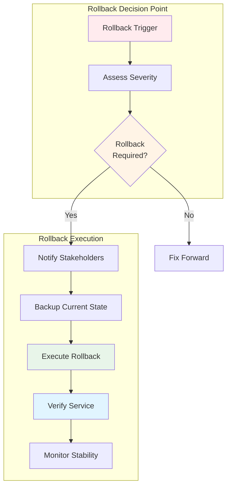
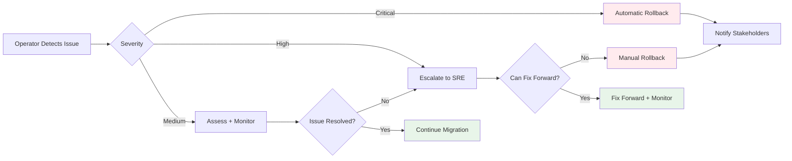

# Rollback Plan: Keycloak + Vault Migration

Comprehensive rollback procedures for reverting the Keycloak + Vault migration at any phase.

## Table of Contents

1. [Rollback Overview](#rollback-overview)
2. [Rollback Decision Criteria](#rollback-decision-criteria)
3. [Phase-Specific Rollback Procedures](#phase-specific-rollback-procedures)
4. [Data Rollback Strategies](#data-rollback-strategies)
5. [Communication Templates](#communication-templates)
6. [Post-Rollback Verification](#post-rollback-verification)

---

## Rollback Overview

### Rollback Principles

- **Fast and Safe**: Prioritize speed without compromising data integrity
- **Zero Data Loss**: All user data and subscriptions must be preserved
- **Minimal Downtime**: Keep service degradation to minimum (< 5 minutes target)
- **Clear Decision Points**: Well-defined triggers for rollback initiation

### Rollback Capabilities by Phase

| Phase | Rollback Complexity | Data Loss Risk | Expected RTO |
|-------|---------------------|----------------|--------------|
| **Phase 1: Infrastructure** | Simple | None | < 5 minutes |
| **Phase 2: Data Migration** | Moderate | None (Redis unchanged) | < 10 minutes |
| **Phase 3: Gateway Update** | Simple | None | < 5 minutes |
| **Phase 4: Client Migration** | Per-client | None | Varies |
| **Phase 5: Decommission** | Complex | Possible | < 30 minutes |

### Rollback Architecture



---

## Rollback Decision Criteria

### Automatic Rollback Triggers

These conditions trigger immediate automatic rollback:

| Trigger | Threshold | Action |
|---------|-----------|--------|
| **Gateway Availability** | < 95% pods ready for > 5 min | IMMEDIATE |
| **Authentication Failure Rate** | > 10% for > 2 min | IMMEDIATE |
| **API Error Rate** | > 5% for > 5 min | IMMEDIATE |
| **Database Connection Failures** | > 50% for > 1 min | IMMEDIATE |
| **Keycloak Availability** | Service down > 3 min | IMMEDIATE |
| **Vault Sealed** | All instances sealed > 2 min | IMMEDIATE |

### Manual Rollback Triggers

These conditions require human decision:

| Condition | Severity | Recommended Action |
|-----------|----------|-------------------|
| **Performance Degradation** | p95 latency > 200ms | Rollback if not resolved in 15 min |
| **Data Inconsistency** | User count mismatch > 5% | Rollback immediately |
| **Client Complaints** | > 3 critical complaints | Assess and decide |
| **Monitoring Alerts** | Multiple warning alerts | Assess impact |
| **Resource Exhaustion** | Memory/CPU > 90% | Rollback if scaling fails |

### Decision Escalation Path



**Escalation Contacts:**
- **L1 (Operator)**: Execute predefined runbooks
- **L2 (SRE)**: Make rollback decisions, coordinate team
- **L3 (Application Owner)**: Business impact assessment, stakeholder communication

---

## Phase-Specific Rollback Procedures

### Phase 1 Rollback: Infrastructure Deployment

**Scope**: Remove Keycloak, Vault, and PostgreSQL without affecting gateway
**Duration**: 5-10 minutes
**Risk**: Low (gateway unchanged)

#### Rollback Steps

```bash
#!/bin/bash
# phase1-rollback.sh

set -euo pipefail
trap 'echo "ERROR: Rollback step failed at line $LINENO. Manual intervention required." >&2' ERR
echo "=== Phase 1 Rollback Started ==="
START_TIME=$(date +%s)

# Step 1: Delete Vault namespace
echo "[1/4] Removing Vault namespace..."
kubectl delete namespace vault-system --grace-period=30
kubectl wait --for=delete namespace/vault-system --timeout=300s

# Step 2: Delete Keycloak
echo "[2/4] Removing Keycloak..."
helm uninstall keycloak -n keycloak-system --wait
kubectl delete namespace keycloak-system --grace-period=30
kubectl wait --for=delete namespace/keycloak-system --timeout=300s

# Step 3: Verify gateway still operational
echo "[3/4] Verifying gateway health..."
GATEWAY_READY=$(kubectl get pods -n netweave -l app.kubernetes.io/component=gateway \
  -o jsonpath='{.items[*].status.conditions[?(@.type=="Ready")].status}' | grep -o "True" | wc -l)

if [ "${GATEWAY_READY}" -ne 3 ]; then
  echo "ERROR: Gateway not healthy after rollback!"
  exit 1
fi

# Test gateway
HEALTH_CHECK=$(curl -k -s -o /dev/null -w "%{http_code}" https://o2ims.example.com/healthz)
if [ "${HEALTH_CHECK}" != "200" ]; then
  echo "ERROR: Gateway health check failed (HTTP ${HEALTH_CHECK})"
  exit 1
fi

# Step 4: Cleanup secrets
echo "[4/4] Cleaning up secrets..."
kubectl delete secret vault-tls vault-unseal-keys -n vault-system --ignore-not-found
kubectl delete secret keycloak postgresql -n keycloak-system --ignore-not-found

END_TIME=$(date +%s)
DURATION=$((END_TIME - START_TIME))

echo "=== Phase 1 Rollback Complete ==="
echo "Duration: ${DURATION} seconds"
echo "Gateway status: OPERATIONAL"
```

#### Post-Rollback Verification

```bash
# Verify gateway authentication (should still work with mTLS)
curl -k -X GET https://o2ims.example.com/o2ims-infrastructureInventory/v1/api_versions \
  --cert client.crt --key client.key --cacert ca.crt

# Expected: 200 OK

# Verify infrastructure removed
kubectl get namespaces | grep -E "vault-system|keycloak-system"
# Expected: No output

# Check for orphaned resources
kubectl get pvc,pv | grep -E "vault|keycloak|postgresql"
# Expected: No output (or document any that remain)
```

#### Rollback Success Criteria

- [ ] Vault namespace deleted
- [ ] Keycloak namespace deleted
- [ ] PostgreSQL PVCs deleted (or retained for audit)
- [ ] Gateway 100% operational (all 3 pods ready)
- [ ] mTLS authentication working
- [ ] No errors in gateway logs

---

### Phase 2 Rollback: Data Migration

**Scope**: Remove Keycloak users/groups, keep Redis unchanged
**Duration**: 10-15 minutes
**Risk**: Low (Redis data untouched)

#### Rollback Steps

```bash
#!/bin/bash
# phase2-rollback.sh

set -euo pipefail
trap 'echo "ERROR: Rollback step failed at line $LINENO. Manual intervention required." >&2' ERR
echo "=== Phase 2 Rollback Started ==="
START_TIME=$(date +%s)

# Step 1: Backup current Keycloak state (for audit)
echo "[1/5] Backing up Keycloak state..."
kubectl exec -n keycloak-system keycloak-0 -- \
  /opt/keycloak/bin/kcadm.sh get users -r netweave --fields id,username > \
  backups/keycloak-users-before-rollback-$(date +%Y%m%d-%H%M%S).json

# Step 2: Delete migrated users from Keycloak
echo "[2/5] Removing migrated users from Keycloak..."
kubectl exec -n keycloak-system keycloak-0 -- bash -c '
  KC_ADMIN_PASSWORD=$(cat /opt/keycloak/secrets/admin-password)
  /opt/keycloak/bin/kcadm.sh config credentials \
    --server http://localhost:8080 \
    --realm master \
    --user admin \
    --password ${KC_ADMIN_PASSWORD}

  # Get all users in netweave realm
  USER_IDS=$(/opt/keycloak/bin/kcadm.sh get users -r netweave --fields id | jq -r ".[].id")

  # Delete each user
  for USER_ID in ${USER_IDS}; do
    /opt/keycloak/bin/kcadm.sh delete users/${USER_ID} -r netweave
  done
'

# Step 3: Remove OAuth subject mappings from Redis (optional)
echo "[3/5] Cleaning OAuth mappings from Redis..."
kubectl exec -n netweave redis-0 -- redis-cli --scan --pattern "users:oauth:*" | \
  xargs -I {} kubectl exec -n netweave redis-0 -- redis-cli DEL {}

# Step 4: Verify Redis user data intact
echo "[4/5] Verifying Redis user data integrity..."
REDIS_USER_COUNT=$(kubectl exec -n netweave redis-0 -- redis-cli KEYS "user:*" | wc -l)
echo "Redis user count: ${REDIS_USER_COUNT}"

if [ "${REDIS_USER_COUNT}" -eq 0 ]; then
  echo "ERROR: Redis user data lost!"
  exit 1
fi

# Step 5: Verify gateway functionality
echo "[5/5] Verifying gateway..."
HEALTH_CHECK=$(curl -k -s -o /dev/null -w "%{http_code}" https://o2ims.example.com/healthz)
if [ "${HEALTH_CHECK}" != "200" ]; then
  echo "ERROR: Gateway health check failed"
  exit 1
fi

END_TIME=$(date +%s)
DURATION=$((END_TIME - START_TIME))

echo "=== Phase 2 Rollback Complete ==="
echo "Duration: ${DURATION} seconds"
echo "Redis user data: INTACT (${REDIS_USER_COUNT} users)"
```

#### Post-Rollback Verification

```bash
# Verify no users in Keycloak
KC_USER_COUNT=$(kubectl exec -n keycloak-system keycloak-0 -- \
  /opt/keycloak/bin/kcadm.sh get users -r netweave --fields id | jq length)

echo "Keycloak users after rollback: ${KC_USER_COUNT}"
# Expected: 0

# Verify Redis user count unchanged
REDIS_USERS=$(kubectl exec -n netweave redis-0 -- redis-cli KEYS "user:*" | wc -l)
echo "Redis users: ${REDIS_USERS}"
# Expected: Same as before migration

# Verify gateway authentication
curl -k -X GET https://o2ims.example.com/o2ims-infrastructureInventory/v1/api_versions \
  --cert client.crt --key client.key --cacert ca.crt
# Expected: 200 OK
```

#### Rollback Success Criteria

- [ ] All Keycloak users deleted
- [ ] OAuth mappings removed from Redis
- [ ] Redis user data intact (count unchanged)
- [ ] Gateway authentication working (mTLS)
- [ ] No data loss confirmed

---

### Phase 3 Rollback: Gateway Update

**Scope**: Revert gateway to mTLS-only authentication
**Duration**: 5-10 minutes
**Risk**: Low (Helm rollback)

#### Rollback Steps

```bash
#!/bin/bash
# phase3-rollback.sh

set -euo pipefail
trap 'echo "ERROR: Rollback step failed at line $LINENO. Manual intervention required." >&2' ERR
echo "=== Phase 3 Rollback Started ==="
START_TIME=$(date +%s)

# Step 1: Check current Helm revision
echo "[1/4] Checking Helm history..."
helm history netweave -n netweave
CURRENT_REV=$(helm history netweave -n netweave -o json | jq -r '.[0].revision')
echo "Current revision: ${CURRENT_REV}"

# Step 2: Rollback to previous Helm release
echo "[2/4] Rolling back Helm release..."
helm rollback netweave $((CURRENT_REV - 1)) -n netweave --wait --timeout=10m

# Monitor rollback progress
echo "Monitoring rollback progress..."
kubectl rollout status deployment/netweave-gateway -n netweave -w

# Step 3: Verify all pods ready
echo "[3/4] Waiting for all pods to be ready..."
kubectl wait --for=condition=ready pod -l app.kubernetes.io/component=gateway \
  -n netweave --timeout=300s

# Step 4: Verify mTLS authentication
echo "[4/4] Verifying mTLS authentication..."
MTLS_TEST=$(curl -k -s -o /dev/null -w "%{http_code}" \
  https://o2ims.example.com/o2ims-infrastructureInventory/v1/api_versions \
  --cert client.crt --key client.key --cacert ca.crt)

if [ "${MTLS_TEST}" != "200" ]; then
  echo "ERROR: mTLS authentication failed after rollback!"
  exit 1
fi

# Verify OAuth2 disabled
echo "Verifying OAuth2 disabled..."
kubectl get configmap netweave-config -n netweave -o yaml | grep "oauth2.enabled: false" || \
  echo "WARNING: OAuth2 may still be enabled in config"

END_TIME=$(date +%s)
DURATION=$((END_TIME - START_TIME))

echo "=== Phase 3 Rollback Complete ==="
echo "Duration: ${DURATION} seconds"
echo "Gateway authentication: mTLS ONLY"
```

#### Alternative: Manual Rollback

If Helm rollback fails, manual rollback:

```bash
# Restore previous deployment from backup
kubectl apply -f backups/gateway-before-oauth2.yaml

# Wait for rollout
kubectl rollout status deployment/netweave-gateway -n netweave

# Remove OAuth2 secrets
kubectl delete secret netweave-oauth2-config -n netweave --ignore-not-found
```

#### Post-Rollback Verification

```bash
# Verify gateway configuration
kubectl get deployment netweave-gateway -n netweave -o yaml | grep -A 10 "env:"
# Expected: No OAuth2 environment variables

# Test mTLS authentication
for i in {1..10}; do
  curl -k -s -o /dev/null -w "Request $i: %{http_code}\n" \
    https://o2ims.example.com/o2ims-infrastructureInventory/v1/api_versions \
    --cert client.crt --key client.key --cacert ca.crt
  sleep 1
done
# Expected: All 200 OK

# Check authentication metrics
kubectl port-forward -n netweave svc/netweave-gateway 9090:9090 &
trap 'kill $(jobs -p) 2>/dev/null' EXIT
sleep 3
curl -s http://localhost:9090/metrics | grep o2ims_authentication_total
# Expected: Only mtls method present, oauth2 should be absent or zero
```

#### Rollback Success Criteria

- [ ] Helm rollback completed successfully
- [ ] All 3 gateway pods running and ready
- [ ] mTLS authentication working
- [ ] OAuth2 authentication disabled
- [ ] No OAuth2 configuration in gateway pods
- [ ] Metrics show only mTLS authentication

---

### Phase 4 Rollback: Client Migration

**Scope**: Per-client rollback to mTLS-only
**Duration**: Varies per client
**Risk**: None (individual client impact only)

#### Client Rollback Procedure

Phase 4 is a gradual transition where clients migrate individually. Rollback is per-client:

**For Individual Client Rollback:**

```bash
# Client removes OAuth2 credentials
# Client reverts to mTLS-only authentication
# No gateway changes needed

# Gateway side: Verify client can still authenticate with mTLS
curl -k -X GET https://o2ims.example.com/o2ims-infrastructureInventory/v1/api_versions \
  --cert client.crt --key client.key --cacert ca.crt

# Expected: 200 OK
```

**For Complete Phase 4 Rollback:**

If all clients need to rollback (mass rollback):

```bash
# Gateway configuration already supports both methods
# No changes needed on gateway side

# Communication to clients:
# "Please revert to mTLS-only authentication until further notice"

# Monitor authentication method distribution
kubectl port-forward -n netweave svc/netweave-gateway 9090:9090 &
trap 'kill $(jobs -p) 2>/dev/null' EXIT
sleep 3
watch -n 5 'curl -s http://localhost:9090/metrics | grep o2ims_authentication_total'

# Expected: oauth2 count should decrease, mtls count should increase
```

#### Phase 4 Rollback Success Criteria

- [ ] Client reverted to mTLS-only authentication
- [ ] Client can successfully authenticate
- [ ] No authentication failures for the client
- [ ] Client communication acknowledged

**Note**: Phase 4 rollback does NOT require gateway changes, as dual authentication is maintained throughout.

---

### Phase 5 Rollback: Redis Auth Decommission

**Scope**: Restore Redis authentication data
**Duration**: 20-30 minutes
**Risk**: High (data restoration required)

#### Rollback Steps

```bash
#!/bin/bash
# phase5-rollback.sh

set -euo pipefail
trap 'echo "ERROR: Rollback step failed at line $LINENO. Manual intervention required." >&2' ERR
echo "=== Phase 5 Rollback Started ==="
START_TIME=$(date +%s)

# Step 1: Stop gateway to prevent writes
echo "[1/5] Scaling down gateway..."
kubectl scale deployment netweave-gateway -n netweave --replicas=0
kubectl wait --for=delete pod -l app.kubernetes.io/component=gateway \
  -n netweave --timeout=300s

# Step 2: Restore Redis data from archive
echo "[2/5] Restoring Redis data from archive..."
BACKUP_FILE="backups/redis-auth-archive-$(date +%Y%m%d).rdb"

if [ ! -f "${BACKUP_FILE}" ]; then
  echo "ERROR: Backup file not found: ${BACKUP_FILE}"
  exit 1
fi

# Copy backup to Redis pod
kubectl cp "${BACKUP_FILE}" netweave/redis-0:/tmp/restore.rdb

# Execute restore
kubectl exec -n netweave redis-0 -- bash -c '
  # Stop Redis
  redis-cli SHUTDOWN NOSAVE
  sleep 5

  # Replace dump file
  mv /tmp/restore.rdb /data/dump.rdb
  chown redis:redis /data/dump.rdb

  # Start Redis (Kubernetes will restart pod)
'

# Wait for Redis to restart
echo "Waiting for Redis to restart..."
kubectl wait --for=condition=ready pod -l app.kubernetes.io/name=redis \
  -n netweave --timeout=300s

# Step 3: Verify Redis data restored
echo "[3/5] Verifying Redis data..."
RESTORED_USER_COUNT=$(kubectl exec -n netweave redis-0 -- redis-cli KEYS "user:*" | wc -l)
echo "Restored user count: ${RESTORED_USER_COUNT}"

if [ "${RESTORED_USER_COUNT}" -eq 0 ]; then
  echo "ERROR: Redis data restoration failed!"
  exit 1
fi

# Step 4: Re-enable mTLS-only auth in gateway
echo "[4/5] Updating gateway configuration..."
helm upgrade netweave deployments/helm/netweave \
  --namespace netweave \
  --reuse-values \
  --set gateway.config.auth.oauth2.enabled=false \
  --set gateway.config.auth.mtls.enabled=true \
  --wait --timeout=10m

# Step 5: Scale up gateway
echo "[5/5] Scaling up gateway..."
kubectl scale deployment netweave-gateway -n netweave --replicas=3
kubectl wait --for=condition=ready pod -l app.kubernetes.io/component=gateway \
  -n netweave --timeout=300s

# Verify gateway functionality
HEALTH_CHECK=$(curl -k -s -o /dev/null -w "%{http_code}" https://o2ims.example.com/healthz)
if [ "${HEALTH_CHECK}" != "200" ]; then
  echo "ERROR: Gateway health check failed"
  exit 1
fi

END_TIME=$(date +%s)
DURATION=$((END_TIME - START_TIME))

echo "=== Phase 5 Rollback Complete ==="
echo "Duration: ${DURATION} seconds"
echo "Redis data restored: ${RESTORED_USER_COUNT} users"
```

#### Post-Rollback Verification

```bash
# Verify Redis data integrity
REDIS_USERS=$(kubectl exec -n netweave redis-0 -- redis-cli KEYS "user:*" | wc -l)
REDIS_TENANTS=$(kubectl exec -n netweave redis-0 -- redis-cli KEYS "tenant:*" | wc -l)

echo "Redis users: ${REDIS_USERS}"
echo "Redis tenants: ${REDIS_TENANTS}"

# Compare with archive count
# Expected: Matches archived data

# Verify gateway mTLS authentication
curl -k -X GET https://o2ims.example.com/o2ims-infrastructureInventory/v1/api_versions \
  --cert client.crt --key client.key --cacert ca.crt
# Expected: 200 OK

# Verify OAuth2 disabled
kubectl get deployment netweave-gateway -n netweave -o yaml | grep oauth2
# Expected: oauth2.enabled=false
```

#### Phase 5 Rollback Success Criteria

- [ ] Redis data fully restored
- [ ] User count matches archive
- [ ] Gateway scaled back to 3 replicas
- [ ] mTLS authentication working
- [ ] OAuth2 authentication disabled
- [ ] No data loss confirmed

---

## Data Rollback Strategies

### Backup Retention Policy

| Backup Type | Retention | Purpose |
|-------------|-----------|---------|
| **Pre-Phase Snapshots** | 7 days | Rollback to known-good state |
| **Incremental Backups** | 24 hours | Recent changes rollback |
| **Archive Backups** | 90 days | Audit and compliance |

### Redis Data Rollback

**Strategy 1: RDB Snapshot Restore**
```bash
# Fastest method for complete restore
kubectl cp backups/redis-backup.rdb netweave/redis-0:/data/dump.rdb
kubectl exec -n netweave redis-0 -- redis-cli SHUTDOWN NOSAVE
# Redis restarts automatically with restored data
```

**Strategy 2: AOF Replay**
```bash
# For point-in-time recovery
kubectl cp backups/redis-backup.aof netweave/redis-0:/data/appendonly.aof
kubectl exec -n netweave redis-0 -- redis-cli BGREWRITEAOF
```

**Strategy 3: Selective Key Restore**
```bash
# For partial rollback
redis-cli --rdb backup.rdb --pipe | \
  kubectl exec -i -n netweave redis-0 -- redis-cli --pipe
```

### Keycloak Data Rollback

**Strategy 1: PostgreSQL Snapshot Restore**
```bash
# Restore PostgreSQL from backup
kubectl scale statefulset postgresql -n keycloak-system --replicas=0
kubectl exec -n keycloak-system postgresql-restore-job -- \
  pg_restore -d keycloak /backups/keycloak-backup.dump
kubectl scale statefulset postgresql -n keycloak-system --replicas=1
```

**Strategy 2: Realm Re-Import**
```bash
# Restore Keycloak realm from export
kubectl exec -n keycloak-system keycloak-0 -- \
  /opt/keycloak/bin/kc.sh import --file /backups/netweave-realm-backup.json
```

### Vault Data Rollback

**Vault Rollback NOT RECOMMENDED** - Vault contains cryptographic state that should not be rolled back. Instead:

1. **Re-initialize Vault** if corruption detected
2. **Re-import PKI configuration** from source control
3. **Re-issue certificates** for all clients (automated via cert manager)

---

## Communication Templates

### Rollback Announcement Template

```
Subject: [ACTION REQUIRED] NetWeave Deployment Rollback in Progress

Team,

We are initiating a rollback of the NetWeave Keycloak + Vault migration due to [REASON].

**Current Status:**
- Phase: [PHASE NUMBER]
- Rollback Started: [TIMESTAMP]
- Expected Completion: [TIMESTAMP + RTO]
- Service Status: [DEGRADED/AVAILABLE]

**Impact:**
- [DESCRIBE USER IMPACT]
- [EXPECTED DOWNTIME IF ANY]

**Actions Required:**
- Users: No action required, mTLS authentication remains available
- Administrators: Monitor rollback progress via [STATUS PAGE URL]

**Next Update:**
- [TIMESTAMP] or upon completion

Rollback Lead: [NAME]
Incident Channel: #netweave-incident
```

### Rollback Completion Template

```
Subject: [RESOLVED] NetWeave Deployment Rollback Complete

Team,

The NetWeave deployment rollback has been completed successfully.

**Summary:**
- Rollback Phase: [PHASE NUMBER]
- Started: [START TIME]
- Completed: [END TIME]
- Duration: [DURATION]
- Data Loss: None

**Verification:**
- ✓ Service availability: 100%
- ✓ Authentication: mTLS operational
- ✓ Data integrity: Confirmed
- ✓ All tests passing

**Root Cause:**
[BRIEF DESCRIPTION OF ISSUE]

**Next Steps:**
1. Post-mortem scheduled for [DATE/TIME]
2. Remediation plan to be developed
3. Migration rescheduled TBD

Thank you for your patience during this rollback.

Operations Team
```

### Stakeholder Communication Template

```
Subject: NetWeave Deployment Status Update

Dear Stakeholders,

We are providing an update on the NetWeave Keycloak + Vault migration project.

**Current Status:**
- Migration paused
- Rollback initiated to ensure service stability
- No customer impact expected

**Timeline:**
- Rollback completion: [TIMESTAMP]
- Service fully operational: [TIMESTAMP]
- Next migration attempt: TBD pending root cause analysis

**Business Impact:**
- Zero downtime for production services
- OAuth2 features delayed until further notice
- Existing mTLS authentication unaffected

**Questions:**
Please contact [PROJECT MANAGER] at [EMAIL]

Best regards,
NetWeave Operations Team
```

---

## Post-Rollback Verification

### Comprehensive Health Check

Run this script after ANY rollback to verify system health:

```bash
#!/bin/bash
# post-rollback-verification.sh

set -euo pipefail
trap 'echo "ERROR: Verification failed at line $LINENO." >&2; kill $(jobs -p) 2>/dev/null' ERR
trap 'kill $(jobs -p) 2>/dev/null' EXIT

echo "=== Post-Rollback Verification ==="

# 1. Gateway Health
echo "[1/8] Checking Gateway..."
GATEWAY_PODS=$(kubectl get pods -n netweave -l app.kubernetes.io/component=gateway \
  -o jsonpath='{.items[*].status.conditions[?(@.type=="Ready")].status}' | grep -o "True" | wc -l)

if [ "${GATEWAY_PODS}" -ne 3 ]; then
  echo "✗ Gateway pods not ready (${GATEWAY_PODS}/3)"
  exit 1
fi
echo "✓ Gateway: ${GATEWAY_PODS}/3 pods ready"

# 2. Redis Health
echo "[2/8] Checking Redis..."
REDIS_PING=$(kubectl exec -n netweave redis-0 -- redis-cli PING)
if [ "${REDIS_PING}" != "PONG" ]; then
  echo "✗ Redis not responding"
  exit 1
fi
echo "✓ Redis: Healthy"

# 3. Redis Data Integrity
echo "[3/8] Checking Redis data..."
REDIS_USERS=$(kubectl exec -n netweave redis-0 -- redis-cli KEYS "user:*" | wc -l)
REDIS_TENANTS=$(kubectl exec -n netweave redis-0 -- redis-cli KEYS "tenant:*" | wc -l)
echo "✓ Redis data: ${REDIS_USERS} users, ${REDIS_TENANTS} tenants"

# 4. Gateway API Test
echo "[4/8] Testing Gateway API..."
API_RESP=$(curl -k -s -o /dev/null -w "%{http_code}" \
  https://o2ims.example.com/o2ims-infrastructureInventory/v1/api_versions \
  --cert client.crt --key client.key --cacert ca.crt)

if [ "${API_RESP}" != "200" ]; then
  echo "✗ Gateway API test failed (HTTP ${API_RESP})"
  exit 1
fi
echo "✓ Gateway API: Responding"

# 5. Authentication Test
echo "[5/8] Testing Authentication..."
for i in {1..5}; do
  AUTH_TEST=$(curl -k -s -o /dev/null -w "%{http_code}" \
    https://o2ims.example.com/o2ims-infrastructureInventory/v1/api_versions \
    --cert client.crt --key client.key --cacert ca.crt)
  if [ "${AUTH_TEST}" != "200" ]; then
    echo "✗ Authentication test ${i} failed"
    exit 1
  fi
done
echo "✓ Authentication: 5/5 tests passed"

# 6. Metrics Check
echo "[6/8] Checking Metrics..."
kubectl port-forward -n netweave svc/netweave-gateway 9090:9090 > /dev/null 2>&1 &
PF_PID=$!
sleep 3

METRICS_RESP=$(curl -s -o /dev/null -w "%{http_code}" http://localhost:9090/metrics)
kill $PF_PID

if [ "${METRICS_RESP}" != "200" ]; then
  echo "✗ Metrics endpoint not responding"
  exit 1
fi
echo "✓ Metrics: Available"

# 7. Error Rate Check
echo "[7/8] Checking Error Rate..."
kubectl port-forward -n netweave svc/netweave-gateway 9090:9090 > /dev/null 2>&1 &
PF_PID=$!
sleep 3

ERROR_RATE=$(curl -s http://localhost:9090/metrics | \
  grep 'o2ims_http_requests_total{.*status="5.."' | \
  awk '{sum+=$2} END {print sum}')
kill $PF_PID

if [ -z "${ERROR_RATE}" ]; then
  ERROR_RATE=0
fi

echo "✓ Error count: ${ERROR_RATE}"

# 8. Log Check
echo "[8/8] Checking Logs for Errors..."
ERROR_LOGS=$(kubectl logs -n netweave -l app.kubernetes.io/component=gateway \
  --since=10m | grep -i "error\|fatal\|panic" | wc -l)

if [ "${ERROR_LOGS}" -gt 10 ]; then
  echo "⚠ Warning: ${ERROR_LOGS} error log entries in last 10 minutes"
else
  echo "✓ Logs: ${ERROR_LOGS} error entries (acceptable)"
fi

echo ""
echo "=== Post-Rollback Verification Complete ==="
echo "Status: ✓ PASSED"
```

### Monitoring Dashboard

After rollback, monitor these metrics for 24 hours:

| Metric | Target | Alert Threshold |
|--------|--------|-----------------|
| **Gateway Availability** | 100% | < 99% |
| **Authentication Success Rate** | > 99% | < 95% |
| **API Response Time (p95)** | < 100ms | > 200ms |
| **Error Rate** | < 0.1% | > 1% |
| **Redis Memory Usage** | < 80% | > 90% |

### Rollback Report Template

Document all rollbacks with this template:

```markdown
# Rollback Report

**Date:** [DATE]
**Phase Rolled Back:** [PHASE NUMBER]
**Rollback Lead:** [NAME]

## Summary

[Brief description of what was rolled back and why]

## Timeline

- **Issue Detected:** [TIMESTAMP]
- **Rollback Decision:** [TIMESTAMP]
- **Rollback Started:** [TIMESTAMP]
- **Rollback Completed:** [TIMESTAMP]
- **Total Duration:** [DURATION]

## Root Cause

[Detailed explanation of what went wrong]

## Impact

- **User Impact:** [DESCRIPTION]
- **Downtime:** [DURATION]
- **Data Loss:** [YES/NO - DETAILS]

## Verification Results

- [ ] Gateway health: [PASS/FAIL]
- [ ] Authentication: [PASS/FAIL]
- [ ] Data integrity: [PASS/FAIL]
- [ ] Monitoring: [PASS/FAIL]

## Lessons Learned

1. [LESSON 1]
2. [LESSON 2]
3. [LESSON 3]

## Action Items

| Action | Owner | Due Date | Status |
|--------|-------|----------|--------|
| [ACTION 1] | [NAME] | [DATE] | [ ] |
| [ACTION 2] | [NAME] | [DATE] | [ ] |

## Next Steps

[Plan for addressing root cause and reattempting migration]
```

---

## Related Documentation

- [Deployment Plan](deployment-plan.md) - Original migration plan
- [Cutover Checklist](cutover-checklist.md) - Pre-deployment verification
- [Keycloak Operations](runbooks/keycloak-operations.md) - Keycloak management
- [Vault Operations](runbooks/vault-operations.md) - Vault management
- [Troubleshooting Guide](troubleshooting.md) - Common issues and solutions

---

**Document Version**: 1.0
**Last Updated**: 2026-02-06
**Maintained By**: NetWeave Operations Team
