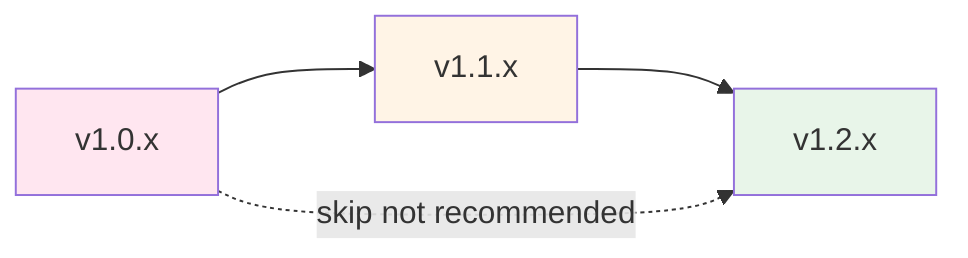

# Upgrade Guide

Comprehensive upgrade procedures and version management for the netweave O2-IMS Gateway.

## Version Compatibility Matrix

| Gateway Version | Kubernetes | Redis | Go Runtime | O-RAN O2 Spec |
|----------------|------------|-------|------------|---------------|
| **v1.2.x** | 1.30-1.32 | 7.4+ | 1.25+ | 3.0 |
| **v1.1.x** | 1.29-1.31 | 7.2+ | 1.24+ | 2.0 |
| **v1.0.x** | 1.28-1.30 | 7.0+ | 1.23+ | 2.0 |

**Compatibility Notes:**
- **Kubernetes**: Gateway requires K8s version N-2 (two versions back from latest)
- **Redis**: Sentinel mode requires Redis 7.0+, standalone supports 6.2+
- **Go**: Runtime must match gateway build requirements

## Upgrade Paths

### Supported Upgrade Paths



**Rules:**
- ✅ **Supported**: Upgrade to next minor version (v1.0 → v1.1)
- ✅ **Supported**: Patch upgrades (v1.1.0 → v1.1.5)
- ⚠️ **Not Recommended**: Skip minor versions (v1.0 → v1.2)
- ❌ **Not Supported**: Downgrades (v1.2 → v1.1)

**Why skip upgrades are risky:**
- Database schema changes may not be compatible
- Configuration format changes may require manual intervention
- API deprecations may break integrations

## Pre-Upgrade Checklist

### 1. Review Release Notes

```bash
# View release notes
gh release view v1.2.0 --repo piwi3910/netweave

# Check for breaking changes
gh release view v1.2.0 --repo piwi3910/netweave | grep -i "breaking"

# Review changelog
curl -s https://raw.githubusercontent.com/piwi3910/netweave/v1.2.0/CHANGELOG.md
```

### 2. Verify Current State

```bash
# Current version
kubectl get deployment netweave-gateway -n o2ims-system \
  -o jsonpath='{.spec.template.spec.containers[0].image}'

# Pod health
kubectl get pods -n o2ims-system -l app.kubernetes.io/name=netweave

# Resource usage
kubectl top pods -n o2ims-system -l app.kubernetes.io/name=netweave

# Redis health
kubectl exec -n o2ims-system redis-node-0 -- redis-cli INFO replication

# Active subscriptions
kubectl exec -n o2ims-system redis-node-0 -- redis-cli DBSIZE
```

### 3. Backup Current State

```bash
# Backup Redis data
kubectl exec -n o2ims-system redis-node-0 -- redis-cli BGSAVE

# Wait for backup to complete
sleep 10

# Copy backup
kubectl exec -n o2ims-system redis-node-0 -- tar czf - /data/dump.rdb | \
  cat > backup-pre-upgrade-$(date +%Y%m%d-%H%M%S).rdb.tar.gz

# Backup Kubernetes resources
kubectl get all,configmap,secret,ingress -n o2ims-system -o yaml > \
  backup-k8s-$(date +%Y%m%d-%H%M%S).yaml

# Backup Helm values
helm get values netweave -n o2ims-system > \
  backup-helm-values-$(date +%Y%m%d-%H%M%S).yaml
```

### 4. Plan Maintenance Window

**Recommended maintenance windows by environment:**

| Environment | Duration | Best Time | Day |
|-------------|----------|-----------|-----|
| **Development** | 30 min | Anytime | Any day |
| **Staging** | 1 hour | Off-hours | Weekday |
| **Production** | 2 hours | 2-4 AM local | Tuesday-Thursday |

**Why Tuesday-Thursday?**
- Monday: System may be unstable after weekend
- Friday: Limited support if issues arise
- Weekend: Reduced support availability

### 5. Notify Stakeholders

```bash
# Example notification
cat <<EOF
Subject: Scheduled Maintenance - O2-IMS Gateway Upgrade

Dear Stakeholders,

We will be upgrading the O2-IMS Gateway from v1.1.5 to v1.2.0.

Schedule:
  Date: 2026-01-14
  Time: 2:00 AM - 4:00 AM EST
  Expected Downtime: 15-30 minutes

Impact:
  - Brief service interruption during rolling update
  - Existing subscriptions will be preserved
  - API endpoints remain unchanged

Rollback Plan:
  - Automated rollback if health checks fail
  - Manual rollback window: 1 hour post-upgrade

Contact:
  - Primary: ops-team@example.com
  - Emergency: +1-555-0100

Thank you,
Operations Team
EOF
```

## Upgrade Procedures

### Option 1: Helm Upgrade (Recommended)

**Zero-downtime rolling update for production environments.**

#### Step 1: Update Helm Repository

```bash
# Update chart repository
helm repo update

# Check available versions
helm search repo netweave --versions

# Download and inspect new chart
helm pull netweave/netweave --version 1.2.0 --untar
ls -la netweave/
```

#### Step 2: Review Configuration Changes

```bash
# Compare current values with new defaults
helm show values netweave/netweave --version 1.2.0 > new-values.yaml
helm get values netweave -n o2ims-system > current-values.yaml

diff -u current-values.yaml new-values.yaml
```

**Common configuration changes to review:**
- New required parameters
- Deprecated parameters
- Changed default values
- New optional features

#### Step 3: Upgrade with Helm

```bash
# Dry run to preview changes
helm upgrade netweave netweave/netweave \
  --version 1.2.0 \
  --namespace o2ims-system \
  --values current-values.yaml \
  --dry-run --debug

# Perform upgrade
helm upgrade netweave netweave/netweave \
  --version 1.2.0 \
  --namespace o2ims-system \
  --values current-values.yaml \
  --wait \
  --timeout 10m

# Monitor rollout
kubectl rollout status deployment/netweave-gateway -n o2ims-system -w
```

#### Step 4: Verify Upgrade

```bash
# Check deployed version
helm list -n o2ims-system
kubectl get deployment netweave-gateway -n o2ims-system \
  -o jsonpath='{.spec.template.spec.containers[0].image}'

# Check pod status
kubectl get pods -n o2ims-system -l app.kubernetes.io/name=netweave

# Check pod logs
kubectl logs -n o2ims-system -l app.kubernetes.io/name=netweave --tail=50

# Test health endpoint
kubectl port-forward -n o2ims-system svc/netweave-gateway 8080:8080 &
curl -k https://localhost:8080/healthz

# Test API version endpoint
curl -k https://o2ims.example.com/o2ims-infrastructureInventory/v1/api_versions

# Verify subscriptions preserved
kubectl exec -n o2ims-system redis-node-0 -- redis-cli DBSIZE
```

### Option 2: Kubectl Rolling Update

**Manual control over deployment rollout.**

```bash
# Update deployment image
kubectl set image deployment/netweave-gateway \
  gateway=ghcr.io/piwi3910/netweave:v1.2.0 \
  -n o2ims-system

# Monitor rollout
kubectl rollout status deployment/netweave-gateway -n o2ims-system -w

# Pause rollout if issues detected
kubectl rollout pause deployment/netweave-gateway -n o2ims-system

# Resume after verification
kubectl rollout resume deployment/netweave-gateway -n o2ims-system
```

### Option 3: Blue-Green Upgrade

**Maximum safety with instant rollback capability.**

```bash
# Deploy new version alongside current
kubectl apply -f - <<EOF
apiVersion: apps/v1
kind: Deployment
metadata:
  name: netweave-gateway-v2
  namespace: o2ims-system
spec:
  replicas: 3
  selector:
    matchLabels:
      app: netweave-gateway
      version: v1.2.0
  template:
    metadata:
      labels:
        app: netweave-gateway
        version: v1.2.0
    spec:
      containers:
      - name: gateway
        image: ghcr.io/piwi3910/netweave:v1.2.0
        # ... rest of container spec
EOF

# Wait for new pods to be ready
kubectl wait --for=condition=ready pod \
  -l version=v1.2.0 -n o2ims-system --timeout=300s

# Test new version internally
kubectl port-forward -n o2ims-system deploy/netweave-gateway-v2 8080:8080 &
curl -k https://localhost:8080/healthz

# Run smoke tests
./scripts/smoke-test.sh localhost:8080

# Switch Service to new version
kubectl patch svc netweave-gateway -n o2ims-system \
  -p '{"spec":{"selector":{"version":"v1.2.0"}}}'

# Monitor for 30 minutes
watch -n 30 'kubectl get pods -n o2ims-system && \
  kubectl exec -n o2ims-system netweave-gateway-v2-0 -- \
  wget -qO- http://localhost:8080/metrics | grep o2ims_http_requests_total'

# If successful, delete old version
kubectl delete deployment netweave-gateway-v1 -n o2ims-system
```

### Option 4: Canary Upgrade (with Service Mesh)

**Gradual rollout with automated rollback.**

**Prerequisites:** Istio or similar service mesh

```bash
# Deploy canary version
kubectl apply -f - <<EOF
apiVersion: apps/v1
kind: Deployment
metadata:
  name: netweave-gateway-canary
  namespace: o2ims-system
spec:
  replicas: 1
  selector:
    matchLabels:
      app: netweave-gateway
      version: v1.2.0-canary
  template:
    metadata:
      labels:
        app: netweave-gateway
        version: v1.2.0-canary
    spec:
      containers:
      - name: gateway
        image: ghcr.io/piwi3910/netweave:v1.2.0
        # ... rest of container spec
EOF

# Configure traffic split (10% to canary)
kubectl apply -f - <<EOF
apiVersion: networking.istio.io/v1beta1
kind: VirtualService
metadata:
  name: netweave-gateway
  namespace: o2ims-system
spec:
  hosts:
    - netweave-gateway
  http:
    - match:
        - headers:
            x-canary:
              exact: "true"
      route:
        - destination:
            host: netweave-gateway
            subset: v1.2.0-canary
          weight: 100
    - route:
        - destination:
            host: netweave-gateway
            subset: v1.1.5
          weight: 90
        - destination:
            host: netweave-gateway
            subset: v1.2.0-canary
          weight: 10
EOF

# Monitor canary metrics
kubectl exec -n o2ims-system netweave-gateway-canary-0 -- \
  wget -qO- http://localhost:8080/metrics | \
  grep -E "o2ims_http_requests_total|o2ims_http_request_duration_seconds"

# Gradually increase canary traffic
# 10% -> 25% -> 50% -> 75% -> 100%
for weight in 25 50 75 100; do
  echo "Increasing canary to ${weight}%..."
  kubectl patch virtualservice netweave-gateway -n o2ims-system \
    --type merge -p "{\"spec\":{\"http\":[{\"route\":[{\"destination\":{\"host\":\"netweave-gateway\",\"subset\":\"v1.1.5\"},\"weight\":$((100-weight))},{\"destination\":{\"host\":\"netweave-gateway\",\"subset\":\"v1.2.0-canary\"},\"weight\":${weight}}]}]}}"

  # Monitor for 15 minutes
  sleep 900

  # Check error rate
  ERROR_RATE=$(kubectl exec -n o2ims-system netweave-gateway-canary-0 -- \
    wget -qO- http://localhost:8080/metrics | \
    awk '/o2ims_http_requests_total.*status="5[0-9][0-9]"/{sum+=$2} END{print sum}')

  if [ "${ERROR_RATE}" -gt 10 ]; then
    echo "Error rate too high, rolling back..."
    kubectl patch virtualservice netweave-gateway -n o2ims-system \
      --type merge -p '{"spec":{"http":[{"route":[{"destination":{"host":"netweave-gateway","subset":"v1.1.5"},"weight":100}]}]}}'
    exit 1
  fi
done

# Scale canary to full capacity
kubectl scale deployment netweave-gateway-canary -n o2ims-system --replicas=3

# Delete old version
kubectl delete deployment netweave-gateway -n o2ims-system
kubectl label deployment netweave-gateway-canary version=v1.2.0 --overwrite
```

## Post-Upgrade Verification

### 1. Health Checks

```bash
# Pod status
kubectl get pods -n o2ims-system -l app.kubernetes.io/name=netweave

# All pods should be Running with 1/1 ready
# NAME                               READY   STATUS    RESTARTS   AGE
# netweave-gateway-5d8f7c9b4-abc12   1/1     Running   0          5m
# netweave-gateway-5d8f7c9b4-def34   1/1     Running   0          5m
# netweave-gateway-5d8f7c9b4-ghi56   1/1     Running   0          5m

# Health endpoint
curl -k https://o2ims.example.com/healthz

# Readiness endpoint
curl -k https://o2ims.example.com/readyz
```

### 2. Functional Tests

```bash
# Test API versions endpoint
curl -k https://o2ims.example.com/o2ims-infrastructureInventory/v1/api_versions

# Test resource pool listing
curl -k https://o2ims.example.com/o2ims-infrastructureInventory/v1/resourcePools

# Test resource listing
curl -k https://o2ims.example.com/o2ims-infrastructureInventory/v1/resourcePools/pool-1/resources

# Test subscription creation
SUB_ID=$(curl -k -X POST https://o2ims.example.com/o2ims-infrastructureInventory/v1/subscriptions \
  -H "Content-Type: application/json" \
  -d '{
    "callback": "https://test.example.com/notify",
    "consumerSubscriptionId": "upgrade-test-001"
  }' | jq -r '.subscriptionId')

# Verify subscription
curl -k https://o2ims.example.com/o2ims-infrastructureInventory/v1/subscriptions/${SUB_ID}

# Delete test subscription
curl -k -X DELETE https://o2ims.example.com/o2ims-infrastructureInventory/v1/subscriptions/${SUB_ID}
```

### 3. Performance Verification

```bash
# Check metrics
kubectl exec -n o2ims-system netweave-gateway-0 -- \
  wget -qO- http://localhost:8080/metrics | \
  grep -E "o2ims_http_request_duration_seconds|o2ims_adapter_operations_total"

# Run load test
hey -n 1000 -c 10 -m GET \
  https://o2ims.example.com/o2ims-infrastructureInventory/v1/resourcePools

# Expected results:
# Summary:
#   Total:        5.2341 secs
#   Slowest:      0.0876 secs
#   Fastest:      0.0102 secs
#   Average:      0.0523 secs
#   Requests/sec: 191.05

# p95 should be < 100ms
# p99 should be < 500ms

# Check for errors
kubectl logs -n o2ims-system -l app.kubernetes.io/name=netweave --tail=100 | grep -i error
```

### 4. Data Integrity Verification

```bash
# Verify subscription count unchanged
BEFORE_COUNT=$(grep "subscriptions:" backup-redis-before.txt | awk '{print $2}')
AFTER_COUNT=$(kubectl exec -n o2ims-system redis-node-0 -- redis-cli DBSIZE | awk '{print $1}')

if [ "$BEFORE_COUNT" -eq "$AFTER_COUNT" ]; then
  echo "✓ Subscription count verified: ${AFTER_COUNT}"
else
  echo "✗ Subscription count mismatch: before=${BEFORE_COUNT}, after=${AFTER_COUNT}"
fi

# Sample subscriptions to verify integrity
kubectl exec -n o2ims-system redis-node-0 -- \
  redis-cli KEYS "subscription:*" | head -5 | \
  while read key; do
    kubectl exec -n o2ims-system redis-node-0 -- redis-cli GET "$key"
  done
```

### 5. Monitor for 24 Hours

```bash
# Set up monitoring dashboard
kubectl port-forward -n monitoring svc/grafana 3000:80 &
# Open http://localhost:3000
# View "O2-IMS Gateway" dashboard

# Check key metrics every hour:
# - Request rate
# - Error rate
# - Latency (p95, p99)
# - Cache hit ratio
# - Active subscriptions

# Set up alerts for:
# - Error rate > 1%
# - p99 latency > 500ms
# - Cache hit ratio < 90%
```

## Rollback Procedures

### Helm Rollback

**Fastest rollback method - use for production.**

```bash
# Check rollback history
helm history netweave -n o2ims-system

# Rollback to previous version
helm rollback netweave -n o2ims-system

# Rollback to specific revision
helm rollback netweave 5 -n o2ims-system

# Wait for rollback to complete
kubectl rollout status deployment/netweave-gateway -n o2ims-system -w

# Verify rollback
kubectl get deployment netweave-gateway -n o2ims-system \
  -o jsonpath='{.spec.template.spec.containers[0].image}'
```

**Expected rollback time:** 2-3 minutes

### Kubectl Rollback

```bash
# Check rollout history
kubectl rollout history deployment/netweave-gateway -n o2ims-system

# Rollback to previous version
kubectl rollout undo deployment/netweave-gateway -n o2ims-system

# Rollback to specific revision
kubectl rollout undo deployment/netweave-gateway -n o2ims-system --to-revision=5

# Monitor rollback
kubectl rollout status deployment/netweave-gateway -n o2ims-system -w
```

### Blue-Green Rollback

```bash
# Switch Service back to old version
kubectl patch svc netweave-gateway -n o2ims-system \
  -p '{"spec":{"selector":{"version":"v1.1.5"}}}'

# Verify service switched
kubectl describe svc netweave-gateway -n o2ims-system | grep Selector

# Test service
curl -k https://o2ims.example.com/healthz

# Delete new version
kubectl delete deployment netweave-gateway-v2 -n o2ims-system
```

**Expected rollback time:** < 30 seconds

### Emergency Rollback with Data Restore

**Use if upgrade corrupted data.**

```bash
# 1. Scale down current version
kubectl scale deployment netweave-gateway -n o2ims-system --replicas=0

# 2. Restore Redis from pre-upgrade backup
kubectl exec -n o2ims-system redis-node-0 -- redis-cli FLUSHALL

# Copy backup to Redis pod
kubectl cp backup-pre-upgrade.rdb o2ims-system/redis-node-0:/tmp/dump.rdb

# Restore data
kubectl exec -n o2ims-system redis-node-0 -- sh -c \
  'cp /tmp/dump.rdb /data/dump.rdb && redis-cli SHUTDOWN NOSAVE'

# Wait for Redis to restart and load backup
sleep 30

# 3. Rollback to previous version
helm rollback netweave -n o2ims-system --wait

# 4. Verify data restored
kubectl exec -n o2ims-system redis-node-0 -- redis-cli DBSIZE
kubectl exec -n o2ims-system redis-node-0 -- redis-cli KEYS "subscription:*" | wc -l
```

**Expected rollback time:** 10-15 minutes

## Troubleshooting Upgrade Issues

### Issue: Pods Not Starting After Upgrade

**Diagnosis:**
```bash
kubectl describe pod -n o2ims-system <pod-name>
kubectl logs -n o2ims-system <pod-name> --previous
```

**Common Causes:**
- Configuration format changed
- Missing required parameters
- Incompatible Redis version

**Resolution:**
```bash
# Check for configuration errors
kubectl get configmap netweave-config -n o2ims-system -o yaml

# Rollback and review release notes
helm rollback netweave -n o2ims-system
gh release view v1.2.0 --repo piwi3910/netweave | grep -A 20 "Configuration Changes"
```

### Issue: High Error Rate After Upgrade

**Diagnosis:**
```bash
# Check error metrics
kubectl exec -n o2ims-system netweave-gateway-0 -- \
  wget -qO- http://localhost:8080/metrics | \
  grep o2ims_http_requests_total | grep status=\"5

# Check logs for errors
kubectl logs -n o2ims-system -l app.kubernetes.io/name=netweave | grep ERROR
```

**Resolution:**
```bash
# If > 5% error rate, immediate rollback
ERROR_RATE=$(kubectl exec -n o2ims-system netweave-gateway-0 -- \
  wget -qO- http://localhost:8080/metrics | \
  awk '/o2ims_http_requests_total.*status="[45][0-9][0-9]"/{errors+=$2} \
       /o2ims_http_requests_total/{total+=$2} \
       END{print (errors/total)*100}')

if (( $(echo "$ERROR_RATE > 5" | bc -l) )); then
  echo "Error rate ${ERROR_RATE}% exceeds threshold, rolling back..."
  helm rollback netweave -n o2ims-system
fi
```

### Issue: Performance Degradation

**Diagnosis:**
```bash
# Check latency metrics
kubectl exec -n o2ims-system netweave-gateway-0 -- \
  wget -qO- http://localhost:8080/metrics | \
  grep o2ims_http_request_duration_seconds | grep quantile

# Check resource usage
kubectl top pods -n o2ims-system -l app.kubernetes.io/name=netweave
```

**Resolution:**
```bash
# If p99 > 500ms, investigate before rolling back
# Check if configuration tuning needed
kubectl edit configmap netweave-config -n o2ims-system

# Adjust cache TTLs, connection pools, etc.

# If no improvement after tuning, rollback
helm rollback netweave -n o2ims-system
```

## Version-Specific Upgrade Notes

### Upgrading to v1.2.0

**Breaking Changes:**
- Redis Sentinel now required (standalone deprecated)
- Configuration format changed for cache TTLs
- Deprecated API endpoints removed

**Migration Steps:**
```bash
# 1. Deploy Redis Sentinel if not present
helm upgrade redis bitnami/redis \
  --namespace o2ims-system \
  --set sentinel.enabled=true \
  --reuse-values

# 2. Update configuration
kubectl edit configmap netweave-config -n o2ims-system

# Old format:
# cache_ttl: 300

# New format:
# cache:
#   ttl:
#     resources: 30s
#     resource_pools: 300s

# 3. Proceed with upgrade
helm upgrade netweave netweave/netweave --version 1.2.0 -n o2ims-system
```

### Upgrading to v1.1.0

**Breaking Changes:**
- mTLS now required by default
- Subscription webhook format changed

**Migration Steps:**
```bash
# 1. Deploy cert-manager if not present
kubectl apply -f https://github.com/cert-manager/cert-manager/releases/download/v1.15.0/cert-manager.yaml

# 2. Create ClusterIssuer
kubectl apply -f deployments/tls/cluster-issuer.yaml

# 3. Notify SMO of webhook format change

# 4. Proceed with upgrade
helm upgrade netweave netweave/netweave --version 1.1.0 -n o2ims-system
```

## Upgrade Automation

### GitOps with ArgoCD

```yaml
# Application manifest
apiVersion: argoproj.io/v1alpha1
kind: Application
metadata:
  name: netweave-gateway
  namespace: argocd
spec:
  project: default
  source:
    repoURL: https://github.com/piwi3910/netweave
    targetRevision: v1.2.0
    path: helm/netweave
    helm:
      valueFiles:
        - values-prod.yaml
  destination:
    server: https://kubernetes.default.svc
    namespace: o2ims-system
  syncPolicy:
    automated:
      prune: true
      selfHeal: true
    syncOptions:
      - CreateNamespace=true
    retry:
      limit: 5
      backoff:
        duration: 5s
        factor: 2
        maxDuration: 3m
```

### Automated Upgrade Testing

```bash
#!/bin/bash
# automated-upgrade-test.sh

set -e

echo "Starting automated upgrade test..."

# 1. Deploy old version
helm install netweave-test netweave/netweave \
  --version 1.1.5 \
  --namespace test-upgrade \
  --create-namespace \
  --wait

# 2. Create test subscriptions
for i in {1..10}; do
  curl -k -X POST https://netweave-test/subscriptions \
    -d "{\"callback\":\"https://test.com/notify-${i}\"}"
done

# 3. Upgrade to new version
helm upgrade netweave-test netweave/netweave \
  --version 1.2.0 \
  --namespace test-upgrade \
  --wait

# 4. Verify subscriptions preserved
COUNT=$(kubectl exec -n test-upgrade redis-node-0 -- redis-cli DBSIZE)
if [ "$COUNT" -ne 10 ]; then
  echo "✗ Subscription count mismatch: expected 10, got ${COUNT}"
  exit 1
fi

# 5. Run functional tests
./scripts/smoke-test.sh netweave-test.test-upgrade.svc.cluster.local

# 6. Cleanup
helm delete netweave-test -n test-upgrade
kubectl delete namespace test-upgrade

echo "✓ Automated upgrade test passed"
```

## Related Documentation

- [Operations Overview](README.md)
- [Deployment Guide](deployment.md)
- [Backup and Recovery](backup-recovery.md)
- [Troubleshooting Guide](troubleshooting.md)
