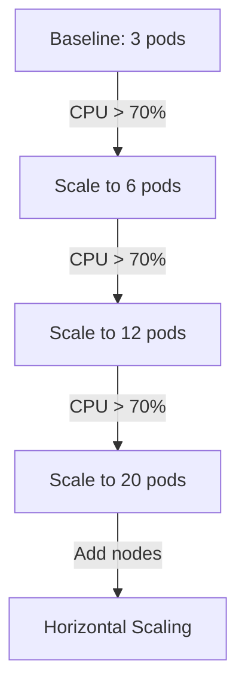

# Performance Tuning Guide

Optimization recommendations and best practices for netweave O2-IMS Gateway performance.

## Table of Contents

- [Performance Overview](#performance-overview)
- [Application Tuning](#application-tuning)
- [Database Optimization](#database-optimization)
- [Caching Strategy](#caching-strategy)
- [Network Optimization](#network-optimization)
- [Kubernetes Tuning](#kubernetes-tuning)
- [Monitoring & Observability](#monitoring--observability)

## Performance Overview

### Target Metrics

| Component | Metric | Target |
|-----------|--------|--------|
| **API Response Time** | p95 | < 100ms |
| **API Response Time** | p99 | < 500ms |
| **Authentication** | p95 | < 100ms |
| **Token Validation** | p95 | < 50ms |
| **Throughput** | RPS | > 10,000 |
| **Error Rate** | % | < 1% |
| **Memory Usage** | per pod | < 512MB |

### Performance Bottlenecks

Common bottlenecks and their symptoms:

1. **CPU Bound**: High CPU usage, slow request processing
2. **Memory Bound**: OOM kills, frequent garbage collection
3. **I/O Bound**: Slow database queries, Redis latency
4. **Network Bound**: High network latency, bandwidth exhaustion

## Application Tuning

### Go Runtime Configuration

```bash
# Environment variables for production
export GOMAXPROCS=8              # Match CPU cores
export GOGC=100                  # Default GC target (adjust if needed)
export GODEBUG=gctrace=0         # Disable GC tracing in production
```

### Connection Pooling

#### Redis Configuration

```yaml
# config.yaml
redis:
  pool_size: 100                 # Connections per instance
  max_retries: 3
  dial_timeout: 5s
  read_timeout: 3s
  write_timeout: 3s
  pool_timeout: 4s
  idle_timeout: 5m
  idle_check_frequency: 1m
```

**Tuning Guidelines:**
- **pool_size**: 10-20 per CPU core
- **Increase if**: Connection pool exhaustion errors
- **Decrease if**: Excessive idle connections

#### Kubernetes Client Configuration

```yaml
kubernetes:
  qps: 50                        # Queries per second
  burst: 100                     # Burst allowance
  timeout: 30s
```

### HTTP Server Tuning

```go
// internal/server/server.go
server := &http.Server{
    ReadTimeout:       10 * time.Second,
    ReadHeaderTimeout: 5 * time.Second,
    WriteTimeout:      10 * time.Second,
    IdleTimeout:       120 * time.Second,
    MaxHeaderBytes:    1 << 20, // 1 MB
}
```

**Tuning Guidelines:**
- **ReadTimeout**: Balance between slow clients and timeout sensitivity
- **IdleTimeout**: Reduce to free connections faster
- **MaxHeaderBytes**: Prevent header overflow attacks

### Rate Limiting

```yaml
# config.yaml
rate_limit:
  enabled: true
  global_limit: 10000            # Global RPS limit
  per_client_limit: 1000         # Per-client RPS limit
  burst: 100
```

**Configuration:**
- Set **global_limit** based on capacity testing
- Set **per_client_limit** to prevent single client abuse
- Allow **burst** for spike tolerance

## Database Optimization

### Redis Best Practices

#### 1. Use Efficient Data Structures

```go
// Bad: Storing JSON strings
redis.Set("key", jsonString)

// Good: Using Redis hashes for structured data
redis.HSet("subscription:123", map[string]interface{}{
    "callback": "https://...",
    "filter": "(eq,resourceTypeId,node)",
})
```

#### 2. Enable Pipeline Operations

```go
// Bad: Multiple round trips
for _, sub := range subscriptions {
    redis.Set(ctx, sub.ID, sub)
}

// Good: Pipelined writes
pipe := redis.Pipeline()
for _, sub := range subscriptions {
    pipe.Set(ctx, sub.ID, sub, 0)
}
pipe.Exec(ctx)
```

#### 3. Set Appropriate TTLs

```go
// Prevent memory bloat with TTLs
redis.Set(ctx, key, value, 24*time.Hour)
```

#### 4. Use Redis Transactions

```go
// Ensure atomic operations
pipe := redis.TxPipeline()
pipe.HSet(ctx, "sub:123", "callback", newCallback)
pipe.Publish(ctx, "sub:updates", "123")
_, err := pipe.Exec(ctx)
```

### Redis Sentinel Configuration

```yaml
# High availability setup
redis:
  mode: sentinel
  master_name: o2ims-master
  sentinel_addresses:
    - sentinel-1:26379
    - sentinel-2:26379
    - sentinel-3:26379
  sentinel_password: <secret>
```

**Tuning:**
- **3+ Sentinel nodes** for quorum
- **down-after-milliseconds: 5000** - Failure detection time
- **failover-timeout: 30000** - Max failover duration

## Caching Strategy

### Multi-Level Caching

```
┌─────────────┐
│ Application │ → In-Memory Cache (1-5 min)
└─────────────┘
       ↓
┌─────────────┐
│    Redis    │ → Distributed Cache (5-60 min)
└─────────────┘
       ↓
┌─────────────┐
│ Kubernetes  │ → Source of Truth
└─────────────┘
```

### Cache Key Design

```go
// Good cache key structure
const (
    ResourcePoolPrefix = "pool:"
    ResourcePrefix     = "resource:"
    CacheTTL           = 5 * time.Minute
)

// Namespaced keys
key := fmt.Sprintf("tenant:%s:pool:%s", tenantID, poolID)
```

### Cache Invalidation

```go
// Event-driven invalidation
func (s *Store) OnResourceUpdate(ctx context.Context, resourceID string) {
    // Invalidate specific resource
    s.redis.Del(ctx, ResourcePrefix+resourceID)

    // Invalidate list caches
    s.redis.Del(ctx, "resources:list")
}
```

## Network Optimization

### TLS Configuration

```go
// Optimized TLS settings
tlsConfig := &tls.Config{
    MinVersion:               tls.VersionTLS13,
    CurvePreferences:         []tls.CurveID{tls.X25519},
    PreferServerCipherSuites: true,
    CipherSuites: []uint16{
        tls.TLS_AES_128_GCM_SHA256,
        tls.TLS_AES_256_GCM_SHA384,
        tls.TLS_CHACHA20_POLY1305_SHA256,
    },
    SessionTicketsDisabled: false, // Enable for performance
}
```

**Benefits:**
- **TLS 1.3**: Faster handshake (1-RTT)
- **Session tickets**: Resume sessions without full handshake
- **Modern ciphers**: Hardware-accelerated encryption

### HTTP/2 Configuration

```go
// Enable HTTP/2 for multiplexing
server := &http.Server{
    TLSConfig: tlsConfig,
    // HTTP/2 is enabled by default in Go
}
```

**Benefits:**
- **Multiplexing**: Multiple requests over single connection
- **Header compression**: Reduced bandwidth
- **Server push**: Proactive resource delivery

### Keep-Alive Settings

```yaml
# Nginx (if used as reverse proxy)
keepalive_timeout 65s;
keepalive_requests 1000;
```

## Kubernetes Tuning

### Pod Resource Limits

```yaml
# deployment.yaml
resources:
  requests:
    cpu: 500m
    memory: 256Mi
  limits:
    cpu: 2000m
    memory: 512Mi
```

**Tuning Guidelines:**
- **requests**: Guaranteed resources
- **limits**: Maximum allowed (prevent noisy neighbors)
- **CPU**: 500m-2000m per pod (adjust based on load)
- **Memory**: 256Mi-512Mi (monitor actual usage)

### Horizontal Pod Autoscaling

```yaml
# hpa.yaml
apiVersion: autoscaling/v2
kind: HorizontalPodAutoscaler
metadata:
  name: netweave-gateway
spec:
  scaleTargetRef:
    apiVersion: apps/v1
    kind: Deployment
    name: netweave-gateway
  minReplicas: 3
  maxReplicas: 20
  metrics:
  - type: Resource
    resource:
      name: cpu
      target:
        type: Utilization
        averageUtilization: 70
  - type: Resource
    resource:
      name: memory
      target:
        type: Utilization
        averageUtilization: 80
  behavior:
    scaleDown:
      stabilizationWindowSeconds: 300
      policies:
      - type: Percent
        value: 10
        periodSeconds: 60
    scaleUp:
      stabilizationWindowSeconds: 0
      policies:
      - type: Percent
        value: 50
        periodSeconds: 60
```

**Configuration:**
- **minReplicas: 3** - High availability baseline
- **maxReplicas: 20** - Scale based on capacity
- **CPU target: 70%** - Leave headroom for spikes
- **scaleUp: 50%** - Aggressive scaling up
- **scaleDown: 10%** - Conservative scaling down

### Pod Disruption Budget

```yaml
# pdb.yaml
apiVersion: policy/v1
kind: PodDisruptionBudget
metadata:
  name: netweave-gateway
spec:
  minAvailable: 2
  selector:
    matchLabels:
      app: netweave-gateway
```

### Node Affinity

```yaml
# deployment.yaml
affinity:
  podAntiAffinity:
    preferredDuringSchedulingIgnoredDuringExecution:
    - weight: 100
      podAffinityTerm:
        labelSelector:
          matchExpressions:
          - key: app
            operator: In
            values:
            - netweave-gateway
        topologyKey: kubernetes.io/hostname
```

**Benefits:**
- Spread pods across nodes
- Reduce impact of node failures
- Improve availability

### Resource Quotas

```yaml
# namespace.yaml
apiVersion: v1
kind: ResourceQuota
metadata:
  name: o2ims-quota
  namespace: netweave
spec:
  hard:
    requests.cpu: "20"
    requests.memory: 10Gi
    limits.cpu: "40"
    limits.memory: 20Gi
    pods: "50"
```

## Monitoring & Observability

### Key Metrics to Track

#### Application Metrics

```
# API Performance
http_request_duration_seconds{handler="/resourcePools"} [p50, p95, p99]
http_requests_total{status="200"}
http_requests_total{status="5xx"}

# Authentication
auth_requests_total{result="success"}
auth_duration_seconds{method="mtls"} [p95]
auth_duration_seconds{method="oauth2"} [p95]

# Cache Performance
cache_hits_total
cache_misses_total
cache_evictions_total
```

#### System Metrics

```
# Resource Usage
container_cpu_usage_seconds_total
container_memory_usage_bytes
container_network_transmit_bytes_total

# Go Runtime
go_goroutines
go_memstats_alloc_bytes
go_gc_duration_seconds
```

### Prometheus Queries

```promql
# Request rate (RPS)
rate(http_requests_total[5m])

# Error rate
rate(http_requests_total{status=~"5.."}[5m]) / rate(http_requests_total[5m])

# p95 latency
histogram_quantile(0.95, rate(http_request_duration_seconds_bucket[5m]))

# Cache hit rate
rate(cache_hits_total[5m]) / (rate(cache_hits_total[5m]) + rate(cache_misses_total[5m]))
```

### Alerting Rules

```yaml
# prometheus-rules.yaml
groups:
- name: netweave-performance
  rules:
  - alert: HighLatency
    expr: histogram_quantile(0.95, rate(http_request_duration_seconds_bucket[5m])) > 0.5
    for: 5m
    annotations:
      summary: "p95 latency exceeds 500ms"

  - alert: HighErrorRate
    expr: rate(http_requests_total{status=~"5.."}[5m]) / rate(http_requests_total[5m]) > 0.01
    for: 2m
    annotations:
      summary: "Error rate exceeds 1%"

  - alert: CacheDegradation
    expr: rate(cache_hits_total[5m]) / (rate(cache_hits_total[5m]) + rate(cache_misses_total[5m])) < 0.8
    for: 10m
    annotations:
      summary: "Cache hit rate below 80%"
```

## Performance Testing Checklist

- [ ] Run baseline performance tests
- [ ] Apply tuning changes
- [ ] Run comparative performance tests
- [ ] Validate SLA targets met
- [ ] Monitor for regressions
- [ ] Document configuration changes
- [ ] Update capacity planning docs

## Capacity Planning

### Estimation Formula

```
Required Pods = (Target RPS × Response Time) / (CPU Cores × CPU Efficiency)

Example:
- Target: 10,000 RPS
- Response time: 50ms (0.05s)
- CPU per pod: 2 cores
- CPU efficiency: 70%

Required Pods = (10000 × 0.05) / (2 × 0.7) = 357 pods
With 30% overhead: ~465 pods
```

### Scaling Strategy



## Troubleshooting

### High CPU Usage

1. **Profile CPU**: `go tool pprof http://pod-ip:6060/debug/pprof/profile`
2. **Check goroutines**: `curl http://pod-ip:6060/debug/pprof/goroutine`
3. **Optimize hot paths**: Reduce allocations, use sync.Pool
4. **Scale horizontally**: Add more pods

### High Memory Usage

1. **Profile memory**: `go tool pprof http://pod-ip:6060/debug/pprof/heap`
2. **Check for leaks**: Monitor memory over time
3. **Tune GC**: Adjust GOGC if needed
4. **Increase limits**: If legitimate growth

### Slow Queries

1. **Enable query logging**: Redis SLOWLOG
2. **Add indexes**: For frequently filtered fields
3. **Optimize queries**: Use projections, reduce data transfer
4. **Cache aggressively**: For expensive queries

## References

- [Go Performance Wiki](https://github.com/golang/go/wiki/Performance)
- [Kubernetes Best Practices](https://kubernetes.io/docs/concepts/configuration/overview/)
- [Redis Performance Optimization](https://redis.io/docs/management/optimization/)
- [TLS Performance](https://blog.cloudflare.com/tls-1-3-overview-and-q-and-a/)
