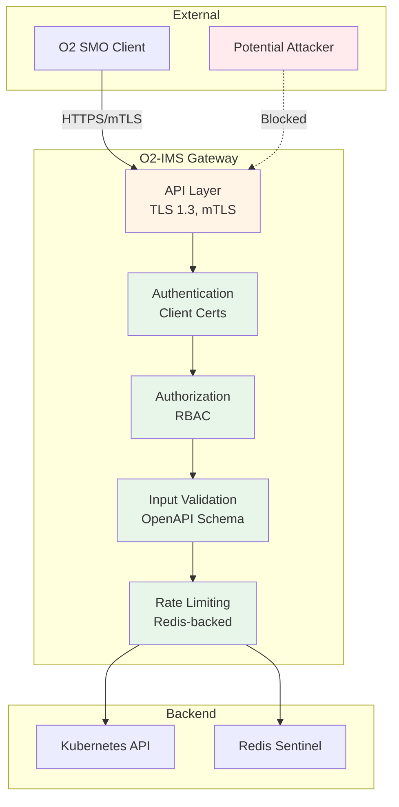
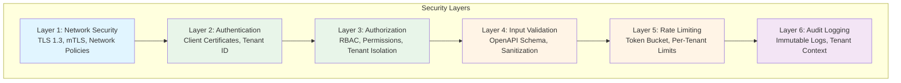

# Security Documentation

**Comprehensive security architecture and implementation guide for the netweave O2-IMS Gateway.**

## Overview

The O2-IMS Gateway implements defense-in-depth security with zero-trust principles, providing enterprise-grade protection for critical telecom infrastructure.

### Core Security Principles

1. **Zero-Trust Security**: Assume breach, verify explicitly, enforce least privilege
2. **Defense in Depth**: Multiple layers of security controls
3. **Secure by Default**: Security hardening enabled out of the box
4. **Compliance Ready**: SOC 2, ISO 27001, NIST controls
5. **Comprehensive Auditing**: Immutable audit trail for all operations

## Threat Model

### Attack Surface



### Threats and Mitigations

| Threat Category | Attack Vectors | Mitigations | Risk Level |
|----------------|----------------|-------------|------------|
| **Unauthorized Access** | Stolen credentials, impersonation | mTLS, client cert validation, certificate revocation | LOW |
| **Cross-Tenant Data Leakage** | Tenant enumeration, IDOR | Label-based filtering, tenant verification, opaque errors | LOW |
| **Privilege Escalation** | Role manipulation, authorization bypass | Immutable system roles, authorization checks | LOW |
| **Data Tampering** | MITM, request modification | TLS 1.3 enforcement, HMAC webhook signatures | LOW |
| **DDoS/Resource Exhaustion** | Request flooding, connection exhaustion, expensive operations | Distributed rate limiting, per-tenant quotas, resource-type limits | LOW |
| **Supply Chain Attacks** | Compromised dependencies, malicious images | Vulnerability scanning, SBOM, signed artifacts | LOW |
| **Insider Threats** | Privileged abuse, credential theft | Audit logging, least privilege, MFA | MEDIUM |

## Security Architecture



### Security Components

| Component | Purpose | Implementation |
|-----------|---------|----------------|
| **TLS/mTLS** | Encrypted communication, client authentication | Native Go TLS 1.3, cert-manager |
| **Authentication** | Identity verification | Client certificates, tenant extraction |
| **Authorization** | Access control | RBAC with roles, permissions, tenant isolation |
| **Input Validation** | Sanitization, DoS protection | OpenAPI 3.0 schema validation |
| **Rate Limiting** | DDoS mitigation | Redis-backed token bucket, per-tenant |
| **Secrets Management** | Credential protection | Kubernetes Secrets, external secret stores |
| **Audit Logging** | Compliance, forensics | Structured logs, tenant context |
| **Supply Chain Security** | Dependency protection | Vulnerability scanning, SBOM, signed images |

## Documentation Structure

### Core Security Guides

| Document | Purpose | Target Audience |
|----------|---------|-----------------|
| **[Architecture](architecture.md)** | Security design, threat model, zero-trust principles | Architects, Security Engineers |
| **[TLS/mTLS](tls-mtls.md)** | TLS 1.3 configuration, certificate management, mTLS setup | Platform Engineers, Operators |
| **[Authentication](authentication.md)** | Client certificates, tenant identification | Integrators, Developers |
| **[Authorization](authorization.md)** | RBAC model, roles, permissions, tenant isolation | Security Engineers, Architects |
| **[Multi-Tenancy](multi-tenancy.md)** | Tenant isolation, resource segregation, quota management | Platform Engineers, Architects |
| **[Hardening](hardening.md)** | Production hardening checklist, security best practices | Operators, DevOps |
| **[Webhooks](webhooks.md)** | HMAC signature verification, webhook security | Integrators, SMO Developers |
| **[Supply Chain](supply-chain.md)** | Dependency scanning, SBOM, CI/CD security | DevOps, Security Teams |

### Quick Navigation

**Getting Started:**
- 🚀 [Security Architecture](architecture.md) - Start here for design overview
- 🔐 [TLS/mTLS Setup](tls-mtls.md) - Configure encryption and client auth
- ✅ [Production Hardening](hardening.md) - Pre-deployment checklist

**Integration:**
- 🔑 [Authentication Guide](authentication.md) - Implement client authentication
- 🛡️ [Authorization Guide](authorization.md) - Configure RBAC and permissions
- 🏢 [Multi-Tenancy Guide](multi-tenancy.md) - Tenant isolation and resource segregation
- 🔔 [Webhook Security](webhooks.md) - Verify webhook notifications

**Operations:**
- 🔧 [Hardening Checklist](hardening.md) - Security operations and maintenance
- 📦 [Supply Chain Security](supply-chain.md) - Dependency management and scanning

## Security Features

### Transport Security

- **TLS 1.3 Only**: Legacy protocols disabled
- **Mutual TLS**: Client and server authentication
- **Strong Cipher Suites**: TLS_AES_256_GCM_SHA384, TLS_CHACHA20_POLY1305_SHA256
- **Certificate Validation**: Full chain verification, revocation checking
- **Automated Rotation**: cert-manager integration for certificate lifecycle

### Authentication & Authorization

- **mTLS Client Certificates**: Cryptographic identity verification
- **RBAC Model**: Fine-grained permissions with roles
- **Tenant Isolation**: Strict resource boundaries between tenants
- **Least Privilege**: Minimal permissions by default
- **Audit Trail**: All authentication and authorization events logged

### API Security

- **OpenAPI Validation**: Request/response schema enforcement
- **Input Sanitization**: Protection against injection attacks
- **Rate Limiting**: Distributed, per-tenant token bucket with resource-type-specific limits
- **Resource Protection**: Granular rate limits for expensive operations (reads, writes, deletes)
- **Page Size Limits**: Prevent large list queries from overwhelming the system
- **DoS Protection**: Request size limits, timeout controls
- **Security Headers**: X-Frame-Options, X-Content-Type-Options, CSP

### Data Protection

- **Encryption at Rest**: Kubernetes secrets, Redis encryption
- **Encryption in Transit**: TLS 1.3 for all connections
- **Secret Management**: External secret stores (Vault, AWS Secrets Manager)
- **Secret Rotation**: Automated rotation with zero-downtime
- **Secret Redaction**: Automatic masking in logs and errors

### Network Security

- **Network Policies**: Pod-level traffic restrictions
- **Ingress Filtering**: IP allowlisting, DDoS protection
- **Egress Controls**: Restrict outbound connections
- **Service Mesh Ready**: Compatible with Istio, Linkerd

### Monitoring & Alerting

- **Security Events**: Failed auth, authorization denials, rate limit violations
- **Certificate Expiry**: Alerts for expiring certificates
- **Anomaly Detection**: Unusual access patterns, repeated failures
- **Audit Logs**: Compliance-ready logs with tenant context
- **Prometheus Metrics**: Security-related metrics exported

## Compliance & Standards

### Supported Standards

| Standard | Applicability | Status |
|----------|---------------|--------|
| **O-RAN O2 IMS** | Core specification compliance | ✅ Full |
| **NIST CSF** | Cybersecurity Framework | ✅ Aligned |
| **ISO 27001** | Information security management | ✅ Controls mapped |
| **SOC 2 Type II** | Service organization controls | ✅ Ready |
| **CIS Kubernetes** | Container security benchmark | ✅ Compliant |
| **OWASP Top 10** | Web application security | ✅ Mitigated |

### Compliance Features

- **Audit Logging**: Immutable logs retained for 90+ days
- **Encryption**: Data encrypted at rest and in transit
- **Access Controls**: RBAC with least privilege
- **Vulnerability Management**: Automated scanning and remediation
- **Incident Response**: Documented procedures and playbooks

## Security Operations

### Pre-Deployment Checklist

```bash
# TLS/mTLS
☑ TLS 1.3 enforced for all connections
☑ Valid CA-signed certificates installed
☑ mTLS enabled for client authentication
☑ Certificate rotation automated
☑ Certificate expiry monitoring configured

# Authentication & Authorization
☑ mTLS client verification required
☑ Service accounts use workload identity
☑ No hardcoded credentials in code/config
☑ Default admin credentials changed
☑ RBAC policies configured and tested

# Network Security
☑ NetworkPolicies restrict pod communication
☑ Ingress rate limiting enabled
☑ External IPs allowlisted
☑ Egress filtering configured
☑ DDoS protection enabled

# Secrets Management
☑ Secrets stored in external secret manager
☑ Secret rotation automated
☑ Secrets not logged or exposed
☑ Encryption at rest enabled

# Monitoring & Logging
☑ Security event alerting configured
☑ Audit logging enabled
☑ Failed authentication attempts monitored
☑ Certificate expiry alerts set
```

### Security Scanning

```bash
# Vulnerability scanning
make security-scan              # Run all security checks
govulncheck ./...              # Go vulnerability database
trivy image netweave:latest    # Container scanning
gosec ./...                    # Static security analysis

# Dependency management
make deps-scan                 # Vulnerability scanning
make license-check             # License compliance
make sbom-generate             # Generate SBOM

# Code quality
make lint                      # All linters (includes gosec)
make test                      # Unit tests
make test-integration          # Integration tests
```

## Quick Start

### For Developers

1. Read [Security Architecture](architecture.md) for design overview
2. Review [Authentication Guide](authentication.md) for integration
3. Configure [TLS/mTLS](tls-mtls.md) for development environment
4. Run `make security-scan` before committing

### For Operators

1. Complete [Production Hardening Checklist](hardening.md)
2. Configure [TLS/mTLS](tls-mtls.md) with production certificates
3. Set up [Authorization](authorization.md) RBAC policies
4. Enable monitoring and alerting
5. Review [Supply Chain Security](supply-chain.md) practices

### For Security Teams

1. Review [Security Architecture](architecture.md) and threat model
2. Validate [Hardening](hardening.md) compliance
3. Audit [Authorization](authorization.md) RBAC configurations
4. Review [Supply Chain](supply-chain.md) dependency management
5. Test incident response procedures

## Security Contacts

### Reporting Security Issues

**DO NOT** open public GitHub issues for security vulnerabilities.

**Email:** security@example.com
**PGP Key:** [Download Public Key](https://example.com/security.asc)

**Response SLA:**
- Initial acknowledgment: 24 hours
- Severity assessment: 48 hours
- Remediation timeline: Based on severity (7-90 days)

### Security Team

- **Security Architect**: [Your Name]
- **Security Engineer**: [Your Name]
- **Incident Response Lead**: [Your Name]

## Resources

### External Documentation

- [O-RAN O2 IMS Specification](https://specifications.o-ran.org/)
- [NIST Cybersecurity Framework](https://www.nist.gov/cyberframework)
- [CIS Kubernetes Benchmark](https://www.cisecurity.org/benchmark/kubernetes)
- [OWASP API Security Top 10](https://owasp.org/www-project-api-security/)
- [Cloud Native Security Whitepaper](https://github.com/cncf/tag-security/blob/main/security-whitepaper/cloud-native-security-whitepaper.md)

### Tools & Libraries

- [cert-manager](https://cert-manager.io/) - Certificate management
- [Trivy](https://trivy.dev/) - Vulnerability scanning
- [gosec](https://github.com/securego/gosec) - Go security analyzer
- [govulncheck](https://pkg.go.dev/golang.org/x/vuln/cmd/govulncheck) - Go vulnerability checker
- [Syft](https://github.com/anchore/syft) - SBOM generation
- [Grype](https://github.com/anchore/grype) - SBOM vulnerability scanning

---

**Last Updated:** 2026-01-12
**Version:** 1.0
