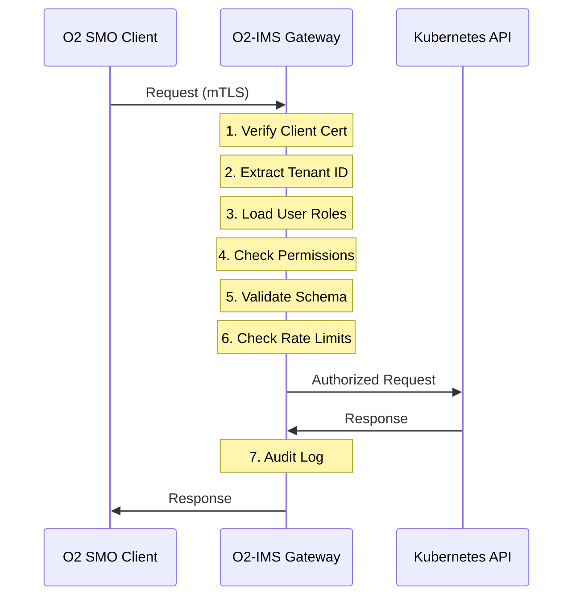
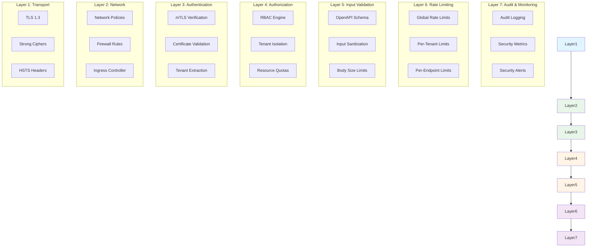
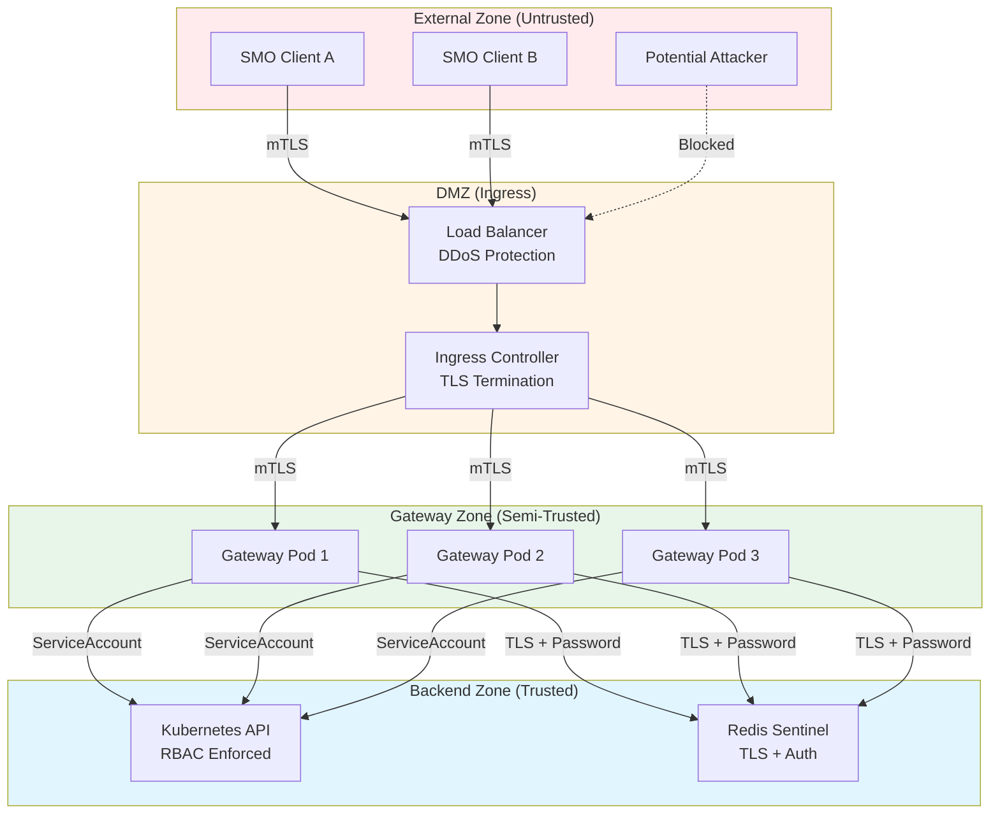
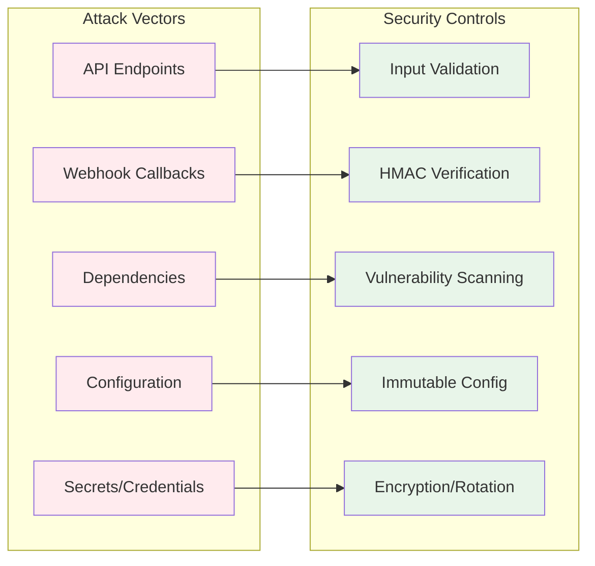
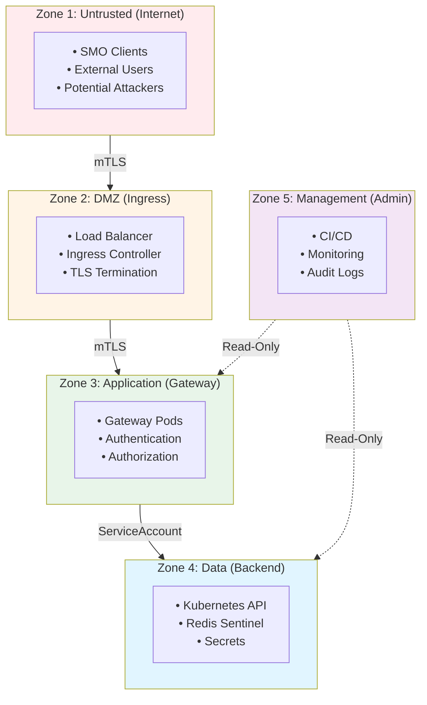

# Security Architecture

**Zero-trust security architecture with defense-in-depth for the netweave O2-IMS Gateway.**

## Table of Contents

1. [Design Philosophy](#design-philosophy)
2. [Zero-Trust Principles](#zero-trust-principles)
3. [Defense-in-Depth](#defense-in-depth)
4. [Security Boundaries](#security-boundaries)
5. [Threat Model](#threat-model)
6. [Trust Zones](#trust-zones)
7. [Security Controls](#security-controls)

---

## Design Philosophy

### Core Tenets

The O2-IMS Gateway security architecture is built on these fundamental principles:

1. **Zero-Trust by Default**: Never trust, always verify - regardless of network location
2. **Defense in Depth**: Multiple layers of security controls
3. **Least Privilege**: Minimal permissions for all components and users
4. **Assume Breach**: Design for scenarios where perimeter is compromised
5. **Encrypt Everything**: TLS 1.3 for all communications, encryption at rest
6. **Immutable Audit Trail**: Comprehensive logging for forensics and compliance

### Design Goals

- ✅ **Production-Grade Security**: Enterprise-ready from day one
- ✅ **O-RAN Compliance**: Full O2 IMS specification compliance
- ✅ **Multi-Tenant Isolation**: Strict resource boundaries between tenants
- ✅ **Cloud-Native**: Kubernetes-native security controls
- ✅ **Compliance Ready**: SOC 2, ISO 27001, NIST frameworks

---

## Zero-Trust Principles

### Never Trust, Always Verify

Every request is treated as potentially malicious, regardless of source:



### Implementation

#### 1. Verify Explicitly

Every request must present valid credentials:

- **mTLS Client Certificates**: Cryptographic identity proof
- **Certificate Validation**: Full chain verification, expiration, revocation
- **Tenant Extraction**: Identity mapped to tenant from certificate CN/SAN

#### 2. Least Privilege Access

Minimal permissions granted by default:

- **New Users**: No roles assigned by default
- **RBAC**: Explicit role bindings required for any access
- **Service Accounts**: Scoped to specific namespaces and resources
- **API Permissions**: Granular resource/action combinations

#### 3. Assume Breach

Design assumes attackers may be inside the network:

- **Micro-Segmentation**: Network policies restrict pod-to-pod traffic
- **Resource Isolation**: Tenant labels prevent cross-tenant access
- **Encryption Everywhere**: mTLS even for internal services
- **Audit Everything**: Complete audit trail for forensics

---

## Defense-in-Depth

### Security Layers



### Layer Responsibilities

| Layer | Purpose | Controls | Failure Impact |
|-------|---------|----------|----------------|
| **L1: Transport** | Encryption | TLS 1.3, strong ciphers, HSTS | Connection rejected |
| **L2: Network** | Network isolation | NetworkPolicies, firewall, ingress | Traffic blocked |
| **L3: Authentication** | Identity verification | mTLS, cert validation, tenant ID | 401 Unauthorized |
| **L4: Authorization** | Access control | RBAC, tenant isolation, quotas | 403 Forbidden |
| **L5: Input Validation** | Data sanitization | Schema validation, size limits | 400 Bad Request |
| **L6: Rate Limiting** | DoS protection | Token bucket, per-tenant limits | 429 Too Many Requests |
| **L7: Audit** | Observability | Logs, metrics, alerts | Logged for investigation |

### Failure Modes

Each layer operates independently - if one layer is bypassed, others still protect:

**Example Attack Scenario:**
1. Attacker obtains stolen client certificate
2. ✅ **L3 (Authentication)**: Certificate validates, user identified
3. ❌ **L4 (Authorization)**: User lacks required permissions → **403 Forbidden**
4. ✅ **L7 (Audit)**: Unauthorized access attempt logged with user context

---

## Security Boundaries

### System Architecture



### Trust Boundaries

#### Boundary 1: Internet → DMZ

**Controls:**
- TLS 1.3 enforcement
- mTLS client certificate requirement
- DDoS protection at load balancer
- IP allowlisting (optional)
- Rate limiting at ingress

**Threats Mitigated:**
- MITM attacks (TLS encryption)
- Unauthorized access (mTLS)
- DDoS attacks (rate limiting, connection limits)
- Network sniffing (encryption)

#### Boundary 2: DMZ → Gateway

**Controls:**
- Network policies restrict ingress to DMZ only
- mTLS between ingress and gateway pods
- No direct pod access from external networks
- Service mesh ready (Istio, Linkerd)

**Threats Mitigated:**
- Lateral movement (network policies)
- Pod compromise (mTLS verification)
- Container breakout (namespace isolation)

#### Boundary 3: Gateway → Backend

**Controls:**
- ServiceAccount authentication to Kubernetes API
- RBAC restrictions on API operations
- Redis TLS + password authentication
- Egress network policies
- Least privilege service account permissions

**Threats Mitigated:**
- Unauthorized Kubernetes access (ServiceAccount RBAC)
- Data theft from Redis (TLS + auth)
- Privilege escalation (minimal RBAC permissions)

---

## Threat Model

### STRIDE Analysis

#### Spoofing (Identity)

| Threat | Mitigation | Residual Risk |
|--------|-----------|---------------|
| Fake client certificate | mTLS with trusted CA verification | LOW |
| Certificate theft | Short-lived certs, automated rotation, revocation | MEDIUM |
| Tenant impersonation | Tenant ID from cert CN, strict validation | LOW |

#### Tampering (Data)

| Threat | Mitigation | Residual Risk |
|--------|-----------|---------------|
| MITM request modification | TLS 1.3 encryption, HSTS | LOW |
| Webhook payload tampering | HMAC-SHA256 signatures | LOW |
| Redis data corruption | TLS to Redis, ACLs, persistence | LOW |

#### Repudiation (Logging)

| Threat | Mitigation | Residual Risk |
|--------|-----------|---------------|
| Deny malicious actions | Immutable audit logs, tenant context | LOW |
| Log tampering | Write-only log shipping, external storage | LOW |
| Missing audit trail | Comprehensive event logging | LOW |

#### Information Disclosure (Confidentiality)

| Threat | Mitigation | Residual Risk |
|--------|-----------|---------------|
| Cross-tenant data leakage | Label-based filtering, tenant checks | LOW |
| Error message leaks | Generic errors, redacted secrets | LOW |
| Log exposure | Secret redaction, RBAC on logs | LOW |

#### Denial of Service (Availability)

| Threat | Mitigation | Residual Risk |
|--------|-----------|---------------|
| Request flooding | Distributed rate limiting, quotas | MEDIUM |
| Connection exhaustion | Connection limits, timeouts | MEDIUM |
| Resource exhaustion | Per-tenant quotas, memory limits | MEDIUM |

#### Elevation of Privilege (Authorization)

| Threat | Mitigation | Residual Risk |
|--------|-----------|---------------|
| Role escalation | Immutable system roles, RBAC checks | LOW |
| Authorization bypass | Multi-layer permission checks | LOW |
| Tenant boundary violation | Strict tenant filtering, label checks | LOW |

### Attack Surface



---

## Trust Zones

### Zone Definitions



### Zone Trust Levels

| Zone | Trust Level | Network Access | Authentication | Authorization |
|------|-------------|----------------|----------------|---------------|
| **Untrusted (Internet)** | None | Blocked by default | mTLS client cert | Per-request RBAC |
| **DMZ (Ingress)** | Low | Restricted ingress | TLS termination | Rate limiting |
| **Application (Gateway)** | Medium | Internal only | ServiceAccount | RBAC enforced |
| **Data (Backend)** | High | Internal only | Strong auth | Least privilege |
| **Management (Admin)** | High | Read-only | MFA required | Admin roles only |

---

## Security Controls

### Technical Controls

#### Cryptographic Controls

```yaml
# TLS Configuration
tls:
  min_version: "1.3"
  cipher_suites:
    - TLS_AES_256_GCM_SHA384
    - TLS_CHACHA20_POLY1305_SHA256
    - TLS_AES_128_GCM_SHA256
  client_auth: required
  client_ca_file: /etc/o2ims/certs/client-ca.crt

# Certificate Requirements
certificates:
  validity: 90d
  renewal_threshold: 15d
  key_size: 4096
  signature_algorithm: SHA256
```

#### Authentication Controls

- **Primary**: mTLS client certificates
- **Service Accounts**: Kubernetes ServiceAccount tokens
- **API Keys**: Optional, for service-to-service (with expiration)
- **MFA**: Required for admin operations (future)

#### Authorization Controls

- **RBAC**: Role-based access control with fine-grained permissions
- **Tenant Isolation**: Label-based filtering, strict boundaries
- **Resource Quotas**: Per-tenant limits on resources
- **Admission Control**: Kubernetes ValidatingWebhook for policies

#### Network Controls

- **Network Policies**: Kubernetes NetworkPolicy for pod isolation
- **Firewall Rules**: Cloud provider firewall, security groups
- **Service Mesh**: Compatible with Istio, Linkerd for mTLS mesh
- **Egress Filtering**: Restrict outbound connections

### Administrative Controls

#### Access Management

- **Least Privilege**: Minimal permissions by default
- **Separation of Duties**: Different roles for different functions
- **Regular Reviews**: Quarterly access reviews
- **Automated Deprovisioning**: Remove access on role change

#### Change Management

- **Code Review**: All changes require peer review
- **Automated Testing**: Security tests in CI/CD
- **Staging Environment**: Test in non-production first
- **Rollback Plan**: Documented rollback procedures

#### Incident Response

1. **Detection**: Automated alerts for security events
2. **Containment**: Isolate affected components
3. **Investigation**: Analyze audit logs and metrics
4. **Remediation**: Apply fixes, patches
5. **Recovery**: Restore normal operations
6. **Post-Incident**: Document lessons learned

### Operational Controls

#### Vulnerability Management

```bash
# Automated scanning
govulncheck ./...              # Weekly
trivy image netweave:latest    # Every build
gosec ./...                    # Every commit
```

#### Patch Management

- **Critical**: 7 days SLA
- **High**: 30 days SLA
- **Medium**: 90 days SLA
- **Low**: Next release

#### Backup & Recovery

- **Redis**: Automated backups every 6 hours, retained 30 days
- **Secrets**: Backed up to external secret store
- **Audit Logs**: Shipped to external SIEM, retained 1 year
- **Configuration**: GitOps, version controlled

---

## Compliance Mapping

### NIST Cybersecurity Framework

| Function | Category | Controls |
|----------|----------|----------|
| **Identify** | Asset Management | Inventory, SBOM, dependencies |
| **Protect** | Access Control | mTLS, RBAC, network policies |
| **Detect** | Anomaly Detection | Audit logs, metrics, alerts |
| **Respond** | Incident Response | Playbooks, escalation, containment |
| **Recover** | Backup/Restore | Redis backups, DR procedures |

### ISO 27001 Controls

| Control | Description | Implementation |
|---------|-------------|----------------|
| A.9.1 | Access control policy | RBAC, least privilege |
| A.9.2 | User access management | mTLS certificates, role bindings |
| A.10.1 | Cryptographic controls | TLS 1.3, encryption at rest |
| A.12.4 | Logging and monitoring | Audit logs, security metrics |
| A.14.2 | Security in development | Security testing, code review |

---

**Last Updated:** 2026-01-12
**Version:** 1.0
