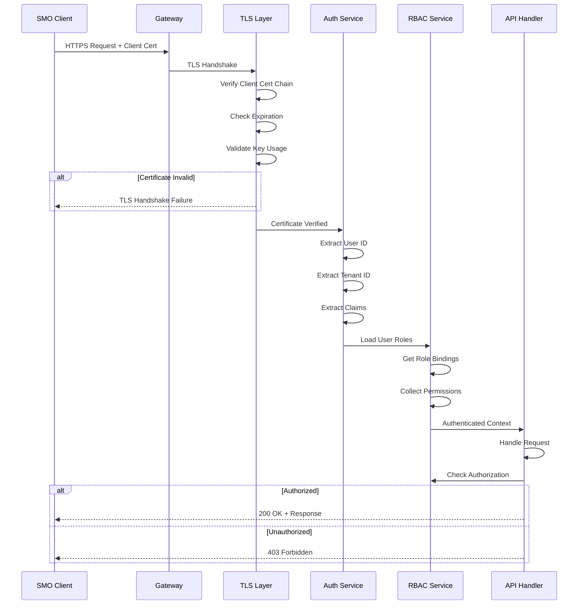

# Authentication

**Client certificate-based authentication and tenant identification for the O2-IMS Gateway.**

## Table of Contents

1. [Overview](#overview)
2. [mTLS Client Certificates](#mtls-client-certificates)
3. [Tenant Identification](#tenant-identification)
4. [Certificate Requirements](#certificate-requirements)
5. [Authentication Flow](#authentication-flow)
6. [Client Configuration](#client-configuration)
7. [Testing Authentication](#testing-authentication)

---

## Overview

### Authentication Methods

The O2-IMS Gateway uses **mTLS client certificates** as the primary authentication method:

| Method | Use Case | Security Level | Status |
|--------|----------|----------------|--------|
| **mTLS Client Certs** | Production SMO clients | High | ✅ Implemented |
| **API Keys** | Service accounts (optional) | Medium | 🔄 Future |
| **JWT Tokens** | OAuth2/OIDC integration | High | 🔄 Future |

### Why mTLS?

- ✅ **Cryptographic Proof**: Stronger than passwords or tokens
- ✅ **No Shared Secrets**: Each client has unique certificate
- ✅ **Revocation**: Instant revocation via CRL or OCSP
- ✅ **Tenant Binding**: Tenant ID embedded in certificate
- ✅ **O-RAN Compliant**: Recommended by O2-IMS specification

---

## mTLS Client Certificates

### Certificate Format

Client certificates follow this subject format:

```
Subject: CN=user-id.tenant-id.o2ims.example.com, O=Organization Name, OU=tenant-id
         ^^^^^^^^^^^^^^^^^^^^^^^^^^^^^^^^^^^^^^^^^^  ^^^^^^^^^^^^^^^^^^^  ^^^^^^^^^
         Common Name (CN)                             Organization (O)     Org Unit (OU)

SAN: DNS:user-id.tenant.tenant-id, Email:user@example.com
     ^^^^^^^^^^^^^^^^^^^^^^^^^^^^  ^^^^^^^^^^^^^^^^^^^^^
     DNS SAN                       Email SAN
```

**Example:**
```
CN: operator-1.smo-alpha.o2ims.example.com
O: SMO Alpha Inc
OU: smo-alpha
SAN DNS: operator-1.tenant.smo-alpha
SAN Email: operator1@smo-alpha.example.com
```

### Extracting Identity

```go
// internal/auth/mtls.go
package auth

import (
    "crypto/x509"
    "fmt"
    "strings"
)

// ExtractIdentity extracts user and tenant from certificate
func ExtractIdentity(cert *x509.Certificate) (*Identity, error) {
    // Parse CN: "user-id.tenant-id.o2ims.example.com"
    cn := cert.Subject.CommonName
    parts := strings.Split(cn, ".")

    if len(parts) < 3 {
        return nil, fmt.Errorf("invalid CN format: %s", cn)
    }

    userID := parts[0]      // "operator-1"
    tenantID := parts[1]    // "smo-alpha"

    // Extract organization
    var organization string
    if len(cert.Subject.Organization) > 0 {
        organization = cert.Subject.Organization[0]
    }

    // Extract email from SAN
    var email string
    if len(cert.EmailAddresses) > 0 {
        email = cert.EmailAddresses[0]
    }

    return &Identity{
        UserID:       userID,
        TenantID:     tenantID,
        Organization: organization,
        Email:        email,
        Certificate:  cert,
    }, nil
}

type Identity struct {
    UserID       string
    TenantID     string
    Organization string
    Email        string
    Certificate  *x509.Certificate
}
```

---

## Tenant Identification

### Three Methods

The gateway supports three methods for tenant identification (in priority order):

#### 1. Client Certificate CN (Recommended)

Extract tenant from certificate Common Name:

```go
func extractTenantFromCert(cert *x509.Certificate) string {
    // CN format: "user.tenant-id.o2ims.example.com"
    cn := cert.Subject.CommonName
    parts := strings.Split(cn, ".")

    if len(parts) >= 2 {
        return parts[1]  // "tenant-id"
    }

    return ""
}
```

**Pros:**
- ✅ Most secure (cryptographically bound)
- ✅ Cannot be spoofed
- ✅ Automatically validated by TLS

**Cons:**
- ❌ Requires specific CN format
- ❌ Certificate reissue needed to change tenant

#### 2. Custom HTTP Header

Client sends tenant ID in header:

```bash
curl -X GET https://gateway.example.com/o2ims/v1/resourcePools \
    --cert client.crt --key client.key --cacert ca.crt \
    -H "X-Tenant-ID: smo-alpha"
```

```go
func extractTenantFromHeader(r *http.Request) string {
    return r.Header.Get("X-Tenant-ID")
}
```

**Pros:**
- ✅ Flexible (can change without cert reissue)
- ✅ Simpler client integration

**Cons:**
- ❌ Less secure (header can be modified)
- ❌ Requires additional validation against cert

#### 3. URL Path (API v3+)

Tenant ID in URL path:

```bash
GET /o2ims/v3/tenants/smo-alpha/resourcePools
```

**Pros:**
- ✅ RESTful design
- ✅ Clear tenant scope in URL

**Cons:**
- ❌ Requires API v3+
- ❌ More complex routing

### Tenant Middleware

```go
// internal/middleware/tenant.go
package middleware

import (
    "context"
    "net/http"
    "github.com/gin-gonic/gin"
)

func ExtractTenant() gin.HandlerFunc {
    return func(c *gin.Context) {
        // Priority 1: Client certificate
        if c.Request.TLS != nil && len(c.Request.TLS.PeerCertificates) > 0 {
            cert := c.Request.TLS.PeerCertificates[0]
            if tenantID := extractTenantFromCert(cert); tenantID != "" {
                c.Set("tenantId", tenantID)
                c.Next()
                return
            }
        }

        // Priority 2: HTTP header
        if tenantID := c.GetHeader("X-Tenant-ID"); tenantID != "" {
            c.Set("tenantId", tenantID)
            c.Next()
            return
        }

        // Priority 3: URL parameter (v3 API)
        if tenantID := c.Param("tenantId"); tenantID != "" {
            c.Set("tenantId", tenantID)
            c.Next()
            return
        }

        // No tenant ID found
        c.AbortWithStatusJSON(http.StatusBadRequest, gin.H{
            "error": "missing tenant identifier",
        })
    }
}
```

---

## Certificate Requirements

### Client Certificate Specifications

```yaml
# Client Certificate Requirements
version: X.509 v3
validity: 90 days
key_algorithm: RSA
key_size: 4096 bits
signature_algorithm: SHA256WithRSA

# Subject
subject:
  common_name: "user-id.tenant-id.o2ims.example.com"
  organization: "Organization Name"
  organizational_unit: "tenant-id"
  country: "US"
  locality: "City"
  state: "State"

# Subject Alternative Names
subject_alternative_names:
  dns:
    - "user-id.tenant.tenant-id"
  email:
    - "user@example.com"

# Key Usage
key_usage:
  - Digital Signature
  - Key Encipherment

# Extended Key Usage
extended_key_usage:
  - Client Authentication

# Optional: Certificate Policies
certificate_policies:
  - "1.2.3.4.5.6.7.8.1"  # Organization policy OID
```

### Validation Rules

The gateway validates client certificates against these rules:

```go
// internal/auth/validator.go
package auth

import (
    "crypto/x509"
    "fmt"
    "time"
)

type CertificateValidator struct {
    trustedCAs *x509.CertPool
    crl        *x509.RevocationList
}

func (v *CertificateValidator) Validate(cert *x509.Certificate) error {
    // 1. Check expiration
    now := time.Now()
    if now.Before(cert.NotBefore) || now.After(cert.NotAfter) {
        return fmt.Errorf("certificate expired or not yet valid")
    }

    // 2. Verify chain
    opts := x509.VerifyOptions{
        Roots:     v.trustedCAs,
        KeyUsages: []x509.ExtKeyUsage{x509.ExtKeyUsageClientAuth},
    }
    if _, err := cert.Verify(opts); err != nil {
        return fmt.Errorf("certificate verification failed: %w", err)
    }

    // 3. Check key usage
    if !hasKeyUsage(cert, x509.KeyUsageDigitalSignature) {
        return fmt.Errorf("certificate missing required key usage")
    }

    // 4. Check extended key usage
    if !hasExtKeyUsage(cert, x509.ExtKeyUsageClientAuth) {
        return fmt.Errorf("certificate missing client authentication extended key usage")
    }

    // 5. Check revocation (if CRL configured)
    if v.crl != nil && isRevoked(cert, v.crl) {
        return fmt.Errorf("certificate has been revoked")
    }

    return nil
}

func hasKeyUsage(cert *x509.Certificate, usage x509.KeyUsage) bool {
    return cert.KeyUsage&usage != 0
}

func hasExtKeyUsage(cert *x509.Certificate, usage x509.ExtKeyUsage) bool {
    for _, u := range cert.ExtKeyUsage {
        if u == usage {
            return true
        }
    }
    return false
}

func isRevoked(cert *x509.Certificate, crl *x509.RevocationList) bool {
    for _, revoked := range crl.RevokedCertificateEntries {
        if cert.SerialNumber.Cmp(revoked.SerialNumber) == 0 {
            return true
        }
    }
    return false
}
```

---

## Authentication Flow

### Request Authentication Sequence



### Implementation

```go
// internal/middleware/auth.go
package middleware

import (
    "net/http"
    "github.com/gin-gonic/gin"
)

type AuthMiddleware struct {
    validator *auth.CertificateValidator
    authz     *authz.Authorizer
}

func (m *AuthMiddleware) Authenticate() gin.HandlerFunc {
    return func(c *gin.Context) {
        // 1. Extract client certificate
        if c.Request.TLS == nil || len(c.Request.TLS.PeerCertificates) == 0 {
            c.AbortWithStatusJSON(http.StatusUnauthorized, gin.H{
                "error": "client certificate required",
            })
            return
        }

        cert := c.Request.TLS.PeerCertificates[0]

        // 2. Validate certificate
        if err := m.validator.Validate(cert); err != nil {
            c.AbortWithStatusJSON(http.StatusUnauthorized, gin.H{
                "error": "invalid client certificate",
                "details": err.Error(),
            })
            return
        }

        // 3. Extract identity
        identity, err := auth.ExtractIdentity(cert)
        if err != nil {
            c.AbortWithStatusJSON(http.StatusUnauthorized, gin.H{
                "error": "failed to extract identity",
            })
            return
        }

        // 4. Store in context
        c.Set("userId", identity.UserID)
        c.Set("tenantId", identity.TenantID)
        c.Set("organization", identity.Organization)
        c.Set("identity", identity)

        c.Next()
    }
}
```

---

## Client Configuration

### Creating Client Certificates

#### Using cert-manager

```yaml
apiVersion: cert-manager.io/v1
kind: Certificate
metadata:
  name: smo-alpha-operator-cert
  namespace: smo-alpha
spec:
  secretName: smo-alpha-operator-tls
  duration: 2160h    # 90 days
  renewBefore: 360h  # 15 days

  # Subject (tenant identification)
  subject:
    organizations:
      - "SMO Alpha Inc"
    organizationalUnits:
      - "smo-alpha"
  commonName: "operator-1.smo-alpha.o2ims.example.com"

  # SANs
  dnsNames:
    - "operator-1.tenant.smo-alpha"
  emailAddresses:
    - "operator1@smo-alpha.example.com"

  # Key usage
  usages:
    - client auth
    - digital signature
    - key encipherment

  # Issuer
  issuerRef:
    name: client-ca
    kind: ClusterIssuer
```

#### Using OpenSSL

```bash
#!/bin/bash
# scripts/create-client-cert.sh

TENANT_ID="smo-alpha"
USER_ID="operator-1"
EMAIL="operator1@smo-alpha.example.com"
ORG="SMO Alpha Inc"

# Generate private key
openssl genrsa -out "${USER_ID}.key" 4096

# Create CSR config
cat > "${USER_ID}.cnf" <<EOF
[req]
distinguished_name = req_distinguished_name
req_extensions = v3_req
prompt = no

[req_distinguished_name]
CN = ${USER_ID}.${TENANT_ID}.o2ims.example.com
O = ${ORG}
OU = ${TENANT_ID}
C = US
ST = California
L = San Francisco

[v3_req]
keyUsage = digitalSignature, keyEncipherment
extendedKeyUsage = clientAuth
subjectAltName = @alt_names

[alt_names]
DNS.1 = ${USER_ID}.tenant.${TENANT_ID}
email.1 = ${EMAIL}
EOF

# Generate CSR
openssl req -new -key "${USER_ID}.key" \
    -out "${USER_ID}.csr" \
    -config "${USER_ID}.cnf"

# Sign with CA
openssl x509 -req -days 90 \
    -in "${USER_ID}.csr" \
    -CA ca.crt -CAkey ca.key \
    -CAcreateserial \
    -out "${USER_ID}.crt" \
    -extensions v3_req \
    -extfile "${USER_ID}.cnf"

echo "✅ Client certificate created: ${USER_ID}.crt"
```

### Client Usage Examples

#### cURL

```bash
# Make authenticated request
curl -X GET https://o2ims-gateway.example.com/o2ims/v1/resourcePools \
    --cert operator-1.crt \
    --key operator-1.key \
    --cacert ca.crt

# With custom tenant header (fallback)
curl -X GET https://o2ims-gateway.example.com/o2ims/v1/resourcePools \
    --cert operator-1.crt \
    --key operator-1.key \
    --cacert ca.crt \
    -H "X-Tenant-ID: smo-alpha"
```

#### Python

```python
import requests

# Configure mTLS
response = requests.get(
    'https://o2ims-gateway.example.com/o2ims/v1/resourcePools',
    cert=('operator-1.crt', 'operator-1.key'),
    verify='ca.crt'
)

print(response.json())
```

#### Go

```go
package main

import (
    "crypto/tls"
    "crypto/x509"
    "io"
    "net/http"
    "os"
)

func main() {
    // Load client certificate
    cert, err := tls.LoadX509KeyPair("operator-1.crt", "operator-1.key")
    if err != nil {
        panic(err)
    }

    // Load CA certificate
    caCert, err := os.ReadFile("ca.crt")
    if err != nil {
        panic(err)
    }

    caCertPool := x509.NewCertPool()
    caCertPool.AppendCertsFromPEM(caCert)

    // Configure TLS
    tlsConfig := &tls.Config{
        Certificates: []tls.Certificate{cert},
        RootCAs:      caCertPool,
        MinVersion:   tls.VersionTLS13,
    }

    // Create HTTP client
    client := &http.Client{
        Transport: &http.Transport{
            TLSClientConfig: tlsConfig,
        },
    }

    // Make request
    resp, err := client.Get("https://o2ims-gateway.example.com/o2ims/v1/resourcePools")
    if err != nil {
        panic(err)
    }
    defer resp.Body.Close()

    body, _ := io.ReadAll(resp.Body)
    println(string(body))
}
```

---

## Testing Authentication

### Manual Testing

```bash
# 1. Test with valid certificate
curl -v -X GET https://o2ims-gateway.example.com/o2ims/v1/api_versions \
    --cert client.crt --key client.key --cacert ca.crt
# Expected: 200 OK

# 2. Test without certificate
curl -v -X GET https://o2ims-gateway.example.com/o2ims/v1/api_versions \
    --cacert ca.crt
# Expected: TLS handshake failure or 401 Unauthorized

# 3. Test with expired certificate
curl -v -X GET https://o2ims-gateway.example.com/o2ims/v1/api_versions \
    --cert expired-client.crt --key expired-client.key --cacert ca.crt
# Expected: Certificate verification error

# 4. Test with wrong CA
curl -v -X GET https://o2ims-gateway.example.com/o2ims/v1/api_versions \
    --cert wrong-client.crt --key wrong-client.key --cacert ca.crt
# Expected: Certificate verification error
```

### Automated Testing

```go
// internal/auth/mtls_test.go
package auth_test

import (
    "crypto/tls"
    "crypto/x509"
    "testing"
    "time"
)

func TestClientCertificateAuthentication(t *testing.T) {
    tests := []struct {
        name        string
        cert        *x509.Certificate
        wantErr     bool
        wantUser    string
        wantTenant  string
    }{
        {
            name:       "valid certificate",
            cert:       loadTestCert("valid-client.crt"),
            wantErr:    false,
            wantUser:   "operator-1",
            wantTenant: "smo-alpha",
        },
        {
            name:    "expired certificate",
            cert:    loadExpiredCert(),
            wantErr: true,
        },
        {
            name:    "invalid CN format",
            cert:    loadCertWithInvalidCN(),
            wantErr: true,
        },
    }

    authenticator := auth.NewMTLSAuthenticator("testdata/ca.crt")

    for _, tt := range tests {
        t.Run(tt.name, func(t *testing.T) {
            ctx, err := authenticator.Authenticate(tt.cert)

            if tt.wantErr {
                if err == nil {
                    t.Errorf("expected error, got nil")
                }
                return
            }

            if err != nil {
                t.Errorf("unexpected error: %v", err)
                return
            }

            if ctx.UserID != tt.wantUser {
                t.Errorf("UserID = %v, want %v", ctx.UserID, tt.wantUser)
            }

            if ctx.TenantID != tt.wantTenant {
                t.Errorf("TenantID = %v, want %v", ctx.TenantID, tt.wantTenant)
            }
        })
    }
}
```

---

**Last Updated:** 2026-01-12
**Version:** 1.0
