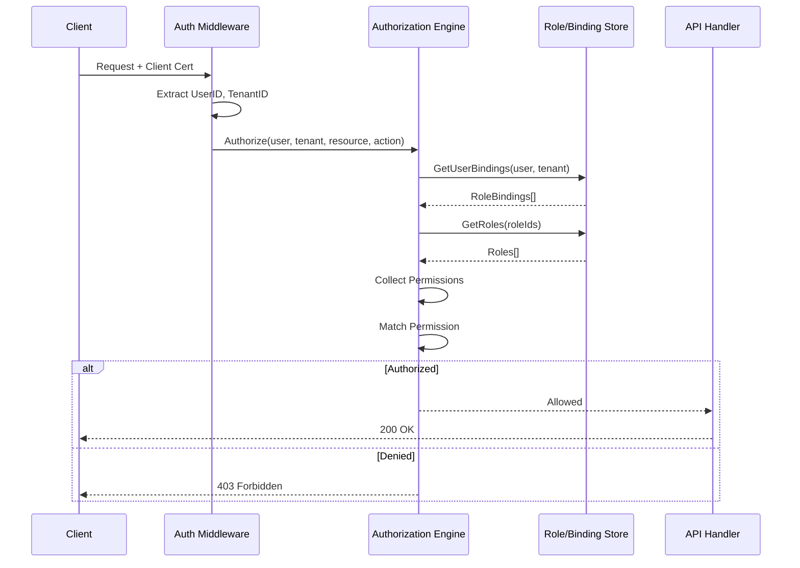

# Authorization

**RBAC model, roles, permissions, and tenant isolation for the O2-IMS Gateway.**

## Table of Contents

1. [Overview](#overview)
2. [RBAC Architecture](#rbac-architecture)
3. [Permission Model](#permission-model)
4. [Built-in Roles](#built-in-roles)
5. [Custom Roles](#custom-roles)
6. [Tenant Isolation](#tenant-isolation)
7. [Authorization Flow](#authorization-flow)
8. [Testing Authorization](#testing-authorization)

---

## Overview

### Authorization Model

The O2-IMS Gateway implements fine-grained Role-Based Access Control (RBAC) with strict tenant isolation.

**Key Features:**
- ✅ **RBAC**: Role-based permissions with granular control
- ✅ **Tenant Isolation**: Strict boundaries between tenants
- ✅ **Least Privilege**: Minimal permissions by default
- ✅ **Resource Quotas**: Per-tenant limits
- ✅ **Audit Trail**: All authorization decisions logged

### Design Principles

1. **Zero Access by Default**: Users have no permissions until roles assigned
2. **Explicit Role Bindings**: All access must be explicitly granted
3. **Tenant Boundaries**: Users cannot access other tenants' resources
4. **Immutable System Roles**: Built-in roles cannot be modified
5. **Comprehensive Auditing**: All authorization checks logged

---

## RBAC Architecture

### Role Hierarchy

```
┌─────────────────────────────────────────────────────────┐
│                    System Roles                          │
│  (Cross-tenant, platform administration)                │
│                                                          │
│  • PlatformAdmin  - Full system access                  │
│  • TenantAdmin    - Create/manage tenants               │
│  • Auditor        - Read-only audit access              │
└─────────────────────────────────────────────────────────┘
                          │
                          ▼
┌─────────────────────────────────────────────────────────┐
│                    Tenant Roles                          │
│  (Scoped to specific tenant)                            │
│                                                          │
│  • Owner          - Full tenant access                  │
│  • Admin          - Manage users, resources, policies   │
│  • Operator       - CRUD on resources                   │
│  • Viewer         - Read-only access                    │
│  • Custom Roles   - User-defined permissions            │
└─────────────────────────────────────────────────────────┘
```

### Data Model

```go
// internal/rbac/rbac.go
package rbac

// Permission represents a specific action on a resource
type Permission struct {
    Resource string   `json:"resource"` // "ResourcePool", "Resource", "Subscription"
    Action   Action   `json:"action"`   // "create", "read", "update", "delete", "list"
    Scope    Scope    `json:"scope"`    // "tenant", "shared", "all"
}

type Action string

const (
    ActionCreate  Action = "create"
    ActionRead    Action = "read"
    ActionUpdate  Action = "update"
    ActionDelete  Action = "delete"
    ActionList    Action = "list"
    ActionManage  Action = "manage"  // All CRUD operations
    ActionExecute Action = "execute" // Execute operations
)

type Scope string

const (
    ScopeTenant Scope = "tenant"  // Only tenant's resources
    ScopeShared Scope = "shared"  // Shared resources
    ScopeAll    Scope = "all"     // All resources (system admin)
)

// Role defines a set of permissions
type Role struct {
    RoleID      string       `json:"roleId"`
    Name        string       `json:"name"`
    Description string       `json:"description"`
    TenantID    string       `json:"tenantId,omitempty"` // Empty for system roles
    Permissions []Permission `json:"permissions"`
    IsSystem    bool         `json:"isSystem"`
    CreatedAt   time.Time    `json:"createdAt"`
    UpdatedAt   time.Time    `json:"updatedAt"`
}

// RoleBinding associates users with roles
type RoleBinding struct {
    BindingID   string    `json:"bindingId"`
    UserID      string    `json:"userId"`
    RoleID      string    `json:"roleId"`
    TenantID    string    `json:"tenantId"`
    ResourceID  string    `json:"resourceId,omitempty"` // Optional
    CreatedAt   time.Time `json:"createdAt"`
    CreatedBy   string    `json:"createdBy"`
}
```

---

## Permission Model

### Resource-Action-Scope

Permissions follow the pattern: **Resource + Action + Scope**

| Component | Description | Examples |
|-----------|-------------|----------|
| **Resource** | The object being accessed | ResourcePool, Resource, Subscription, Tenant, User |
| **Action** | The operation being performed | create, read, update, delete, list, manage |
| **Scope** | The boundary of access | tenant (own), shared (cross-tenant), all (system) |

### Permission Examples

```yaml
# Read own tenant's resource pools
- resource: ResourcePool
  action: read
  scope: tenant

# Create resources in own tenant
- resource: Resource
  action: create
  scope: tenant

# Manage all subscriptions (admin)
- resource: Subscription
  action: manage
  scope: tenant

# System admin - manage everything
- resource: "*"
  action: manage
  scope: all
```

### Wildcard Permissions

```go
// Wildcard matching
"*" matches all resources
"Resource*" matches ResourcePool, Resource, ResourceType
"manage" action includes create, read, update, delete
```

---

## Built-in Roles

### System Roles

#### Platform Administrator

```yaml
roleId: platform-admin
name: Platform Administrator
isSystem: true
tenantId: null
permissions:
  - resource: "*"
    action: manage
    scope: all
  - resource: Tenant
    action: manage
    scope: all
```

**Use Case:** Full system administration across all tenants

#### Tenant Administrator

```yaml
roleId: tenant-admin
name: Tenant Administrator
isSystem: true
tenantId: null
permissions:
  - resource: Tenant
    action: create
    scope: all
  - resource: Tenant
    action: read
    scope: all
  - resource: Tenant
    action: update
    scope: all
```

**Use Case:** Create and manage tenants

#### System Auditor

```yaml
roleId: auditor
name: System Auditor
isSystem: true
tenantId: null
permissions:
  - resource: "*"
    action: read
    scope: all
  - resource: "*"
    action: list
    scope: all
  - resource: AuditLog
    action: read
    scope: all
```

**Use Case:** Read-only access for compliance and auditing

### Tenant Roles

#### Tenant Owner

```yaml
roleId: owner
name: Tenant Owner
isSystem: true
permissions:
  - resource: "*"
    action: manage
    scope: tenant
  - resource: User
    action: manage
    scope: tenant
  - resource: RoleBinding
    action: manage
    scope: tenant
```

**Use Case:** Full control within tenant

#### Tenant Admin

```yaml
roleId: admin
name: Tenant Administrator
isSystem: true
permissions:
  - resource: ResourcePool
    action: manage
    scope: tenant
  - resource: Resource
    action: manage
    scope: tenant
  - resource: Subscription
    action: manage
    scope: tenant
  - resource: User
    action: read
    scope: tenant
  - resource: User
    action: update
    scope: tenant
```

**Use Case:** Manage resources but not user roles

#### Operator

```yaml
roleId: operator
name: Operator
isSystem: true
permissions:
  - resource: ResourcePool
    action: manage
    scope: tenant
  - resource: Resource
    action: manage
    scope: tenant
  - resource: Subscription
    action: manage
    scope: tenant
```

**Use Case:** Day-to-day resource operations

#### Viewer

```yaml
roleId: viewer
name: Viewer
isSystem: true
permissions:
  - resource: "*"
    action: read
    scope: tenant
  - resource: "*"
    action: list
    scope: tenant
```

**Use Case:** Read-only monitoring and observability

---

## Custom Roles

### Creating Custom Roles

```bash
# Create custom role via API
curl -X POST https://o2ims-gateway.example.com/admin/v1/tenants/smo-alpha/roles \
  --cert admin.crt --key admin.key --cacert ca.crt \
  -H "Content-Type: application/json" \
  -d '{
    "name": "CNF Manager",
    "description": "Manage CNF deployments but not infrastructure",
    "permissions": [
      {
        "resource": "ResourcePool",
        "action": "read",
        "scope": "tenant"
      },
      {
        "resource": "Resource",
        "action": "read",
        "scope": "tenant"
      },
      {
        "resource": "Deployment",
        "action": "manage",
        "scope": "tenant"
      },
      {
        "resource": "Subscription",
        "action": "create",
        "scope": "tenant"
      },
      {
        "resource": "Subscription",
        "action": "read",
        "scope": "tenant"
      },
      {
        "resource": "Subscription",
        "action": "delete",
        "scope": "tenant"
      }
    ]
  }'
```

### Role Design Patterns

#### Pattern 1: Separation of Duties

```yaml
# Read-only infrastructure viewer
- name: Infrastructure Viewer
  permissions:
    - {resource: ResourcePool, action: read, scope: tenant}
    - {resource: Resource, action: read, scope: tenant}
    - {resource: DeploymentManager, action: read, scope: tenant}

# Deployment operator (no infrastructure access)
- name: Deployment Operator
  permissions:
    - {resource: Deployment, action: manage, scope: tenant}
    - {resource: DeploymentPackage, action: manage, scope: tenant}
```

#### Pattern 2: Graduated Privileges

```yaml
# Level 1: Observer
- {resource: "*", action: read, scope: tenant}

# Level 2: Operator (+ create/delete)
- {resource: Subscription, action: manage, scope: tenant}
- {resource: Resource, action: create, scope: tenant}
- {resource: Resource, action: delete, scope: tenant}

# Level 3: Administrator (+ user management)
- {resource: User, action: manage, scope: tenant}
- {resource: RoleBinding, action: manage, scope: tenant}
```

---

## Tenant Isolation

### Isolation Mechanisms

#### 1. Label-Based Filtering

All resources labeled with tenant ID:

```yaml
apiVersion: machine.openshift.io/v1beta1
kind: MachineSet
metadata:
  labels:
    o2ims.oran.org/tenant: smo-alpha  # Required
```

#### 2. Query Filtering

All list operations filter by tenant:

```go
func (h *Handler) ListResourcePools(c *gin.Context) {
    tenantID := c.GetString("tenantId")

    // CRITICAL: Add tenant filter
    filter := parseFilter(c)
    filter.TenantID = tenantID

    pools, err := adapter.ListResourcePools(c.Request.Context(), filter)
    // ...
}
```

#### 3. Resource Verification

All get operations verify tenant ownership:

```go
func (h *Handler) GetResourcePool(c *gin.Context) {
    poolID := c.Param("id")
    tenantID := c.GetString("tenantId")

    pool, err := adapter.GetResourcePool(c.Request.Context(), poolID)
    if err != nil {
        c.JSON(404, gin.H{"error": "not found"})
        return
    }

    // CRITICAL: Verify tenant ownership
    if pool.TenantID != tenantID {
        c.JSON(404, gin.H{"error": "not found"})  // Don't leak existence
        return
    }

    c.JSON(200, pool)
}
```

### Resource Quotas

Per-tenant limits prevent resource exhaustion:

```go
type ResourceQuotas struct {
    MaxResourcePools     int `json:"maxResourcePools"`
    MaxResources         int `json:"maxResources"`
    MaxSubscriptions     int `json:"maxSubscriptions"`
    MaxCPUCores          int `json:"maxCpuCores,omitempty"`
    MaxMemoryGB          int `json:"maxMemoryGb,omitempty"`
    MaxStorageGB         int `json:"maxStorageGb,omitempty"`
}
```

---

## Authorization Flow

### Request Authorization



### Authorization Engine

```go
// internal/authz/authz.go
package authz

func (a *Authorizer) Authorize(
    ctx context.Context,
    userID string,
    tenantID string,
    resource string,
    action rbac.Action,
) (bool, error) {
    // 1. Get user's role bindings
    bindings, err := a.bindingStore.GetUserBindings(ctx, userID, tenantID)
    if err != nil {
        return false, err
    }

    if len(bindings) == 0 {
        return false, nil // No roles = no permissions
    }

    // 2. Collect all permissions from roles
    permissions := make([]rbac.Permission, 0)
    for _, binding := range bindings {
        role, err := a.roleStore.Get(ctx, binding.RoleID)
        if err != nil {
            continue
        }
        permissions = append(permissions, role.Permissions...)
    }

    // 3. Check if any permission allows the action
    return a.matchPermission(permissions, resource, action, tenantID), nil
}

func (a *Authorizer) matchPermission(
    permissions []rbac.Permission,
    resource string,
    action rbac.Action,
    tenantID string,
) bool {
    for _, perm := range permissions {
        // Match resource (exact or wildcard)
        if perm.Resource != "*" && perm.Resource != resource {
            continue
        }

        // Match action (exact or "manage")
        if perm.Action != action && perm.Action != rbac.ActionManage {
            continue
        }

        // Match scope
        switch perm.Scope {
        case rbac.ScopeAll:
            return true
        case rbac.ScopeTenant:
            return true
        case rbac.ScopeShared:
            return true
        }
    }

    return false
}
```

---

## Testing Authorization

### Manual Testing

```bash
# 1. Create role binding
curl -X POST https://o2ims-gateway.example.com/admin/v1/tenants/smo-alpha/roleBindings \
  --cert admin.crt --key admin.key --cacert ca.crt \
  -d '{
    "userId": "operator-1",
    "roleId": "operator",
    "tenantId": "smo-alpha"
  }'

# 2. Test authorized access
curl -X GET https://o2ims-gateway.example.com/o2ims/v1/resourcePools \
  --cert operator-1.crt --key operator-1.key --cacert ca.crt
# Expected: 200 OK

# 3. Test unauthorized access (different tenant)
curl -X GET https://o2ims-gateway.example.com/o2ims/v1/resourcePools \
  --cert operator-1.crt --key operator-1.key --cacert ca.crt \
  -H "X-Tenant-ID: smo-beta"
# Expected: 403 Forbidden

# 4. Test insufficient permissions
curl -X DELETE https://o2ims-gateway.example.com/o2ims/v1/tenants/smo-alpha \
  --cert operator-1.crt --key operator-1.key --cacert ca.crt
# Expected: 403 Forbidden (operator cannot delete tenants)
```

### Automated Testing

```go
func TestAuthorization(t *testing.T) {
    tests := []struct {
        name     string
        userID   string
        tenantID string
        resource string
        action   rbac.Action
        want     bool
    }{
        {
            name:     "operator can read resource pools",
            userID:   "operator-1",
            tenantID: "smo-alpha",
            resource: "ResourcePool",
            action:   rbac.ActionRead,
            want:     true,
        },
        {
            name:     "viewer cannot delete resources",
            userID:   "viewer-1",
            tenantID: "smo-alpha",
            resource: "Resource",
            action:   rbac.ActionDelete,
            want:     false,
        },
        {
            name:     "user cannot access other tenant",
            userID:   "operator-1",
            tenantID: "smo-beta",
            resource: "ResourcePool",
            action:   rbac.ActionRead,
            want:     false,
        },
    }

    for _, tt := range tests {
        t.Run(tt.name, func(t *testing.T) {
            got, err := authz.Authorize(ctx, tt.userID, tt.tenantID, tt.resource, tt.action)
            require.NoError(t, err)
            assert.Equal(t, tt.want, got)
        })
    }
}
```

---

**Last Updated:** 2026-01-12
**Version:** 1.0
